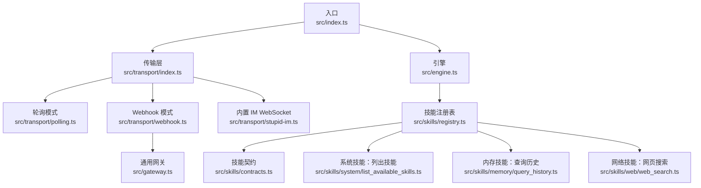
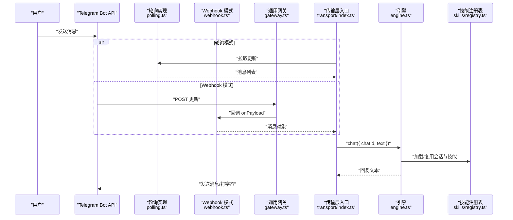
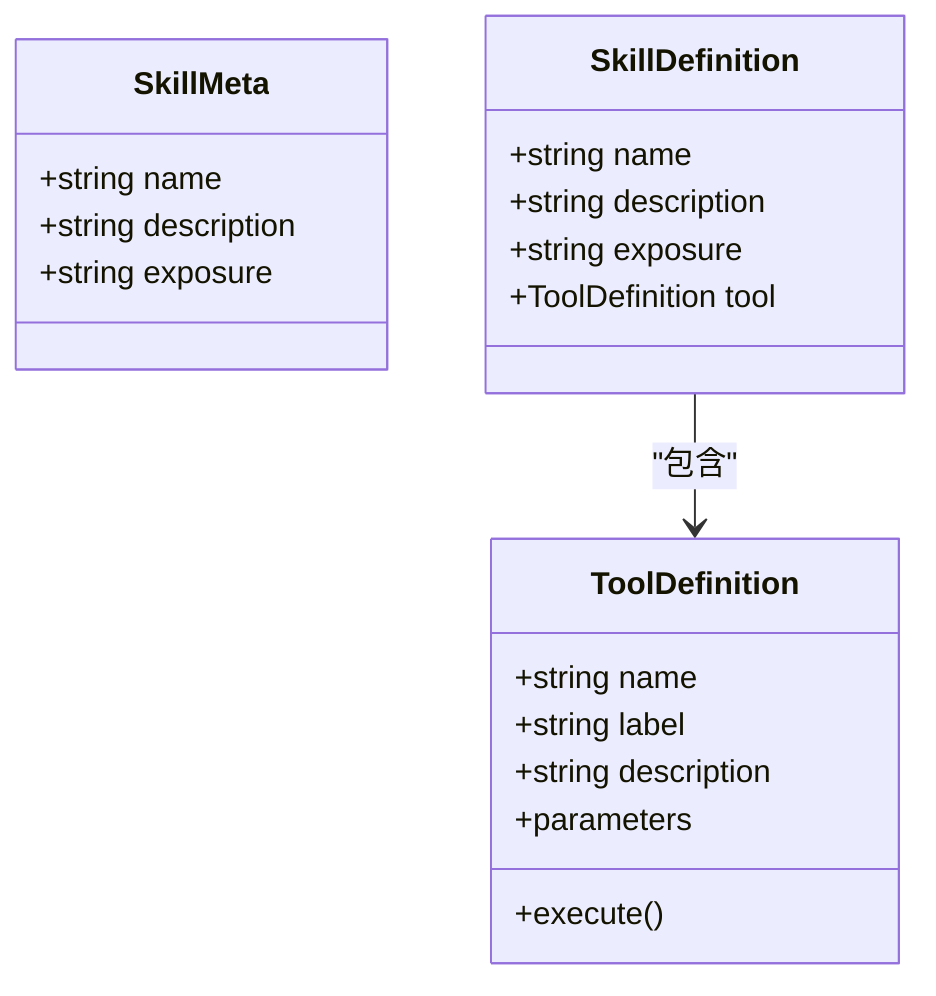
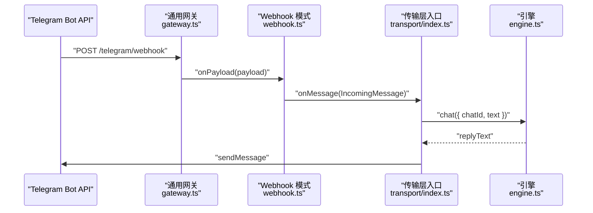
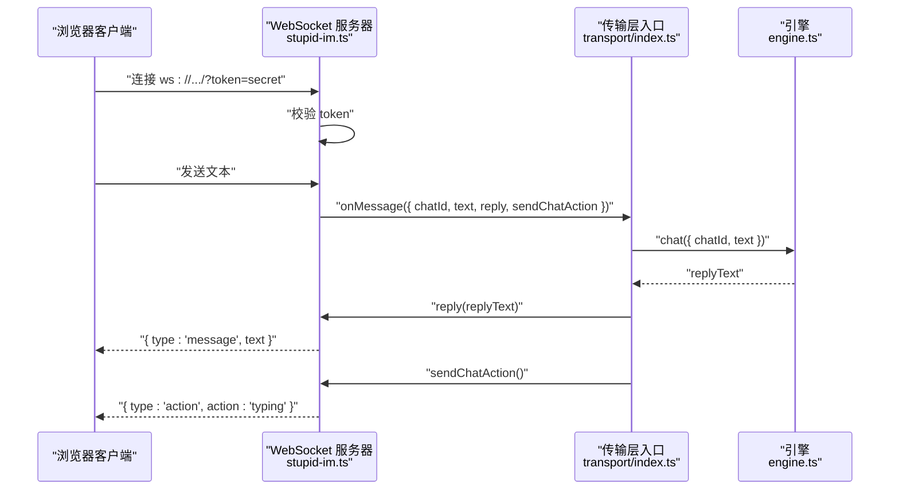
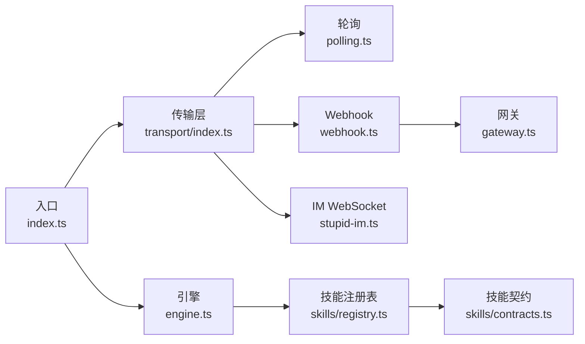

# API 参考

<cite>
**本文档引用的文件**
- [src/index.ts](file://src/index.ts)
- [src/engine.ts](file://src/engine.ts)
- [src/transport/index.ts](file://src/transport/index.ts)
- [src/transport/polling.ts](file://src/transport/polling.ts)
- [src/transport/webhook.ts](file://src/transport/webhook.ts)
- [src/transport/stupid-im.ts](file://src/transport/stupid-im.ts)
- [src/gateway.ts](file://src/gateway.ts)
- [src/skills/registry.ts](file://src/skills/registry.ts)
- [src/skills/contracts.ts](file://src/skills/contracts.ts)
- [src/skills/system/list_available_skills.ts](file://src/skills/system/list_available_skills.ts)
- [src/skills/memory/query_history.ts](file://src/skills/memory/query_history.ts)
- [src/skills/web/web_search.ts](file://src/skills/web/web_search.ts)
- [package.json](file://package.json)
- [README.md](file://README.md)
</cite>

## 目录
1. [简介](#简介)
2. [项目结构](#项目结构)
3. [核心组件](#核心组件)
4. [架构总览](#架构总览)
5. [详细组件分析](#详细组件分析)
6. [依赖关系分析](#依赖关系分析)
7. [性能考虑](#性能考虑)
8. [故障排除指南](#故障排除指南)
9. [结论](#结论)
10. [附录](#附录)

## 简介
本参考文档面向 StupidClaw 的使用者与集成开发者，系统化梳理以下三类接口与能力：
- 技能 API：技能接口定义、参数规范、返回值格式、错误处理策略
- Webhook API：HTTP 方法、URL 模式、请求/响应模式、认证方法
- WebSocket API：连接处理、消息格式、事件类型、实时交互模式

同时提供版本信息、兼容性说明、客户端实现指南与性能优化建议，并给出可直接定位到源码的路径指引，便于快速查阅与落地实施。

## 项目结构
StupidClaw 的运行时由“入口”“引擎”“传输层”“网关”“技能注册表”等模块组成。入口负责初始化、锁进程、启动传输层与定时任务；引擎负责会话管理、提示词构建、模型调用与历史记录；传输层负责轮询/推送（Webhook）与内置网页 IM（WebSocket）；网关提供通用 HTTP 接入与签名校验；技能注册表统一管理内置与标准文件技能。

图表来源
- [src/index.ts:112-216](file://src/index.ts#L112-L216)
- [src/transport/index.ts:47-71](file://src/transport/index.ts#L47-L71)
- [src/transport/webhook.ts:41-86](file://src/transport/webhook.ts#L41-L86)
- [src/gateway.ts:27-79](file://src/gateway.ts#L27-L79)
- [src/transport/stupid-im.ts:24-105](file://src/transport/stupid-im.ts#L24-L105)
- [src/engine.ts:392-475](file://src/engine.ts#L392-L475)
- [src/skills/registry.ts:23-55](file://src/skills/registry.ts#L23-L55)

章节来源
- [src/index.ts:112-216](file://src/index.ts#L112-L216)
- [src/transport/index.ts:47-71](file://src/transport/index.ts#L47-L71)
- [src/engine.ts:392-475](file://src/engine.ts#L392-L475)
- [src/skills/registry.ts:23-55](file://src/skills/registry.ts#L23-L55)

## 核心组件
- 入口与生命周期
  - 初始化工作空间、单实例锁、信号钩子、环境变量加载
  - 启动 Cron 调度器与传输层
  - 参考路径：[入口主流程:112-216](file://src/index.ts#L112-L216)
- 引擎与会话
  - 模型选择、会话创建、提示词构建、流式/非流式回复、历史记录追加
  - 参考路径：[会话与聊天:392-475](file://src/engine.ts#L392-L475), [聊天主函数:680-706](file://src/engine.ts#L680-L706)
- 传输层
  - 轮询模式：拉取更新、发送消息、打字态
  - Webhook 模式：设置/验证 Webhook、HTTP 网关接收、转发消息
  - 内置 IM WebSocket：HTTP GET 页面、WebSocket 连接、消息/动作事件
  - 参考路径：[传输层入口:47-71](file://src/transport/index.ts#L47-L71), [轮询实现:52-89](file://src/transport/polling.ts#L52-L89), [Webhook 实现:41-86](file://src/transport/webhook.ts#L41-86), [IM WebSocket:24-105](file://src/transport/stupid-im.ts#L24-105)
- 网关
  - 通用 HTTP 网关，支持 GET/POST、路径匹配、可选签名头校验、JSON 解析与响应
  - 参考路径：[通用网关:27-79](file://src/gateway.ts#L27-79)
- 技能注册表
  - 统一聚合内置技能与标准文件技能，区分 always/on-demand 暴露级别
  - 参考路径：[技能注册表:23-55](file://src/skills/registry.ts#23-L55), [技能契约:1-20](file://src/skills/contracts.ts#L1-L20)

章节来源
- [src/index.ts:112-216](file://src/index.ts#L112-L216)
- [src/engine.ts:392-475](file://src/engine.ts#L392-L475)
- [src/engine.ts:680-706](file://src/engine.ts#L680-L706)
- [src/transport/index.ts:47-71](file://src/transport/index.ts#L47-L71)
- [src/transport/polling.ts:52-89](file://src/transport/polling.ts#L52-L89)
- [src/transport/webhook.ts:41-86](file://src/transport/webhook.ts#L41-L86)
- [src/transport/stupid-im.ts:24-105](file://src/transport/stupid-im.ts#L24-L105)
- [src/gateway.ts:27-79](file://src/gateway.ts#L27-L79)
- [src/skills/registry.ts:23-55](file://src/skills/registry.ts#L23-L55)
- [src/skills/contracts.ts:1-20](file://src/skills/contracts.ts#L1-L20)

## 架构总览
下图展示 Telegram 轮询/Webhook 与内置 IM 的整体数据流与组件交互。

图表来源
- [src/transport/polling.ts:52-89](file://src/transport/polling.ts#L52-L89)
- [src/transport/webhook.ts:41-86](file://src/transport/webhook.ts#L41-L86)
- [src/gateway.ts:27-79](file://src/gateway.ts#L27-L79)
- [src/transport/index.ts:47-71](file://src/transport/index.ts#L47-L71)
- [src/engine.ts:680-706](file://src/engine.ts#L680-L706)
- [src/skills/registry.ts:23-55](file://src/skills/registry.ts#L23-L55)

## 详细组件分析

### 技能 API 参考
- 技能接口定义
  - 技能元数据：名称、描述、暴露级别（always/on-demand）
  - 工具定义：名称、标签、描述、参数 Schema、执行函数
  - 参考路径：[技能契约:1-20](file://src/skills/contracts.ts#L1-L20)
- 技能注册表
  - 聚合内置技能与标准文件技能，导出 all/always/onDemand 三类集合
  - 参考路径：[技能注册表:23-55](file://src/skills/registry.ts#L23-L55)
- 典型技能示例
  - 列出可用技能：返回技能清单与使用指导
    - 参考路径：[列出技能:4-40](file://src/skills/system/list_available_skills.ts#L4-L40)
  - 查询历史：支持日期、chatId、limit 过滤
    - 参考路径：[查询历史:5-57](file://src/skills/memory/query_history.ts#L5-L57)
  - 网页搜索：Brave Search，支持关键词与结果数量
    - 参考路径：[网页搜索:16-95](file://src/skills/web/web_search.ts#L16-L95)

- 参数规范与返回值格式
  - 参数通过 Type.Object 定义，遵循 pi-ai Schema
  - 执行返回统一结构：content 数组（元素含 type/text），details 对象
  - 错误处理：当外部依赖缺失或请求失败时，返回包含错误信息的文本内容
  - 参考路径：[列出技能返回:16-37](file://src/skills/system/list_available_skills.ts#L16-L37), [查询历史返回:42-53](file://src/skills/memory/query_history.ts#L42-L53), [网页搜索返回:70-91](file://src/skills/web/web_search.ts#L70-L91)

- 调用流程与错误处理策略
  - 引擎在构建提示词时会打印调试信息，便于定位问题
  - 当模型调用失败时，会进行 API Key 错误归一化提示
  - 参考路径：[调试日志与错误归一化:59-85](file://src/engine.ts#L59-L85), [API Key 归一化:162-186](file://src/engine.ts#L162-L186)

图表来源
- [src/skills/contracts.ts:6-20](file://src/skills/contracts.ts#L6-L20)

章节来源
- [src/skills/contracts.ts:1-20](file://src/skills/contracts.ts#L1-L20)
- [src/skills/registry.ts:23-55](file://src/skills/registry.ts#L23-L55)
- [src/skills/system/list_available_skills.ts:4-40](file://src/skills/system/list_available_skills.ts#L4-L40)
- [src/skills/memory/query_history.ts:5-57](file://src/skills/memory/query_history.ts#L5-L57)
- [src/skills/web/web_search.ts:16-95](file://src/skills/web/web_search.ts#L16-L95)
- [src/engine.ts:59-85](file://src/engine.ts#L59-L85)
- [src/engine.ts:162-186](file://src/engine.ts#L162-L186)

### Webhook API 参考
- HTTP 方法与 URL 模式
  - 设置 Webhook：POST /bot{token}/setWebhook
  - 接收更新：POST {gatewayPath}（默认 /telegram/webhook）
  - 认证：可选 X-Telegram-Bot-API-Secret-Token 请求头
  - 参考路径：[设置 Webhook:19-37](file://src/transport/webhook.ts#L19-L37), [网关路由与校验:34-53](file://src/gateway.ts#L34-L53)
- 请求/响应模式
  - 请求体：JSON，字段与 Telegram Update 结构一致
  - 响应体：JSON，成功返回 { ok: true }，失败返回 { ok: false }
  - 参考路径：[网关解析与响应:55-64](file://src/gateway.ts#L55-L64)
- 认证方法
  - 若配置 TELEGRAM_WEBHOOK_SECRET，请求需携带 X-Telegram-Bot-API-Secret-Token
  - 参考路径：[签名校验:46-53](file://src/gateway.ts#L46-L53)
- 端到端调用序列

图表来源
- [src/transport/webhook.ts:57-84](file://src/transport/webhook.ts#L57-L84)
- [src/gateway.ts#L27-L79:27-79](file://src/gateway.ts#L27-L79)
- [src/transport/index.ts:47-71](file://src/transport/index.ts#L47-L71)
- [src/engine.ts:680-706](file://src/engine.ts#L680-L706)

章节来源
- [src/transport/webhook.ts:19-37](file://src/transport/webhook.ts#L19-L37)
- [src/gateway.ts#L34-L53:34-53](file://src/gateway.ts#L34-L53)
- [src/transport/webhook.ts:57-84](file://src/transport/webhook.ts#L57-L84)

### WebSocket API 参考（内置 IM）
- 连接处理
  - HTTP GET / 或 /im 返回内置网页端 HTML
  - WebSocket 服务监听端口（默认 8787），支持附加到现有 HTTP Server
  - 参考路径：[IM 请求处理:11-22](file://src/transport/stupid-im.ts#L11-L22), [启动与端口:24-50](file://src/transport/stupid-im.ts#L24-L50)
- 认证
  - ws://.../?token=secret，服务端校验 token
  - 参考路径：[WS 认证:65-71](file://src/transport/stupid-im.ts#L65-L71)
- 消息格式
  - 客户端发送：字符串文本
  - 服务端发送：
    - { type: "message", text: "..." } 回复
    - { type: "action", action: "typing" } 打字态
  - 参考路径：[消息处理与事件:76-98](file://src/transport/stupid-im.ts#L76-L98)
- 实时交互模式

图表来源
- [src/transport/stupid-im.ts:24-105](file://src/transport/stupid-im.ts#L24-L105)
- [src/transport/index.ts:47-71](file://src/transport/index.ts#L47-L71)
- [src/engine.ts:680-706](file://src/engine.ts#L680-L706)

章节来源
- [src/transport/stupid-im.ts:11-22](file://src/transport/stupid-im.ts#L11-L22)
- [src/transport/stupid-im.ts#L24-L50:24-50](file://src/transport/stupid-im.ts#L24-L50)
- [src/transport/stupid-im.ts#L65-L71:65-71](file://src/transport/stupid-im.ts#L65-L71)
- [src/transport/stupid-im.ts#L76-L98:76-98](file://src/transport/stupid-im.ts#L76-L98)

### 轮询模式（Telegram Long Polling）
- 拉取更新
  - POST /bot{token}/getUpdates，支持 offset、timeout、allowed_updates
  - 若 409 冲突则先删除 Webhook 再重试
  - 参考路径：[轮询实现:36-89](file://src/transport/polling.ts#L36-L89)
- 发送消息与打字态
  - 发送消息：按 HTML 模式优先，失败回退纯文本；超过长度自动分片
  - 打字态：sendChatAction，fire-and-forget
  - 参考路径：[消息发送与分片:215-242](file://src/transport/polling.ts#L215-L242), [打字态:203-213](file://src/transport/polling.ts#L203-L213)

章节来源
- [src/transport/polling.ts:36-89](file://src/transport/polling.ts#L36-L89)
- [src/transport/polling.ts#L215-L242:215-242](file://src/transport/polling.ts#L215-L242)
- [src/transport/polling.ts#L203-L213:203-213](file://src/transport/polling.ts#L203-L213)

## 依赖关系分析
- 组件耦合
  - 入口依赖传输层与引擎；传输层依赖网关与轮询/Webhook/IM 实现；引擎依赖技能注册表与内存存储；技能注册表依赖各技能实现
- 外部依赖
  - @mariozechner/pi-coding-agent 与 @mariozechner/pi-ai 提供会话、工具与 Schema 能力
  - ws 提供 WebSocket 服务
  - dotenv 加载环境变量
- 版本与兼容性
  - 包版本：0.1.7
  - 项目边界与默认传输模式：轮询为主，Webhook 为可选增强
  - 参考路径：[包版本](file://package.json#L3), [项目边界:15-21](file://README.md#L15-L21)

图表来源
- [src/index.ts:112-216](file://src/index.ts#L112-L216)
- [src/transport/index.ts:47-71](file://src/transport/index.ts#L47-L71)
- [src/transport/webhook.ts:41-86](file://src/transport/webhook.ts#L41-L86)
- [src/gateway.ts:27-79](file://src/gateway.ts#L27-L79)
- [src/transport/stupid-im.ts:24-105](file://src/transport/stupid-im.ts#L24-L105)
- [src/engine.ts:392-475](file://src/engine.ts#L392-L475)
- [src/skills/registry.ts:23-55](file://src/skills/registry.ts#L23-L55)
- [src/skills/contracts.ts:1-20](file://src/skills/contracts.ts#L1-L20)

章节来源
- [package.json:1-39](file://package.json#L1-L39)
- [README.md:15-21](file://README.md#L15-L21)

## 性能考虑
- 消息分片与回退
  - 优先使用 HTML 模式发送，失败自动回退纯文本；超长文本按换行切片，避免单次请求过大
  - 参考路径：[消息分片与回退:144-242](file://src/transport/polling.ts#L144-L242)
- 打字态节流
  - 轮询模式下定期发送打字态，避免长时间无响应
  - 参考路径：[打字态循环:189-208](file://src/index.ts#L189-L208)
- 会话复用
  - 引擎按 chatId 缓存会话，减少重复初始化成本
  - 参考路径：[会话缓存:461-475](file://src/engine.ts#L461-L475)
- 模型选择与调试
  - 支持多种 Provider 与自定义 OpenAI/Anthropic 兼容接口，便于按需切换
  - 参考路径：[模型注册与选择:246-383](file://src/engine.ts#L246-L383), [自定义模型提取:385-390](file://src/engine.ts#L385-L390)

## 故障排除指南
- 常见错误与提示
  - API Key 未配置或无效：引擎会归一化错误，提示检查 .env 中对应 Provider 的密钥
    - 参考路径：[API Key 归一化:162-186](file://src/engine.ts#L162-L186)
  - Telegram Webhook 设置失败：检查 TELEGRAM_WEBHOOK_URL、PORT、secret_token
    - 参考路径：[设置 Webhook:19-37](file://src/transport/webhook.ts#L19-L37), [端口校验:53-55](file://src/transport/webhook.ts#L53-L55)
  - Webhook 网关 401：确认 X-Telegram-Bot-API-Secret-Token 与配置一致
    - 参考路径：[签名校验:46-53](file://src/gateway.ts#L46-L53)
  - 轮询冲突（409）：自动删除 Webhook 后重试
    - 参考路径：[轮询冲突处理:57-60](file://src/transport/polling.ts#L57-L60)
  - IM WebSocket 4001：token 不匹配或未提供
    - 参考路径：[WS 认证:65-71](file://src/transport/stupid-im.ts#L65-L71)

章节来源
- [src/engine.ts:162-186](file://src/engine.ts#L162-L186)
- [src/transport/webhook.ts:19-37](file://src/transport/webhook.ts#L19-L37)
- [src/transport/webhook.ts#L53-L55:53-55](file://src/transport/webhook.ts#L53-L55)
- [src/gateway.ts#L46-L53:46-53](file://src/gateway.ts#L46-L53)
- [src/transport/polling.ts#L57-L60:57-60](file://src/transport/polling.ts#L57-L60)
- [src/transport/stupid-im.ts#L65-L71:65-71](file://src/transport/stupid-im.ts#L65-L71)

## 结论
本参考文档覆盖了 StupidClaw 的技能 API、Webhook 与 WebSocket 接口，提供了参数规范、返回格式、错误处理策略与端到端调用流程。结合版本信息与兼容性说明，开发者可据此快速集成与扩展功能。建议在生产环境中优先采用 Webhook 模式以降低延迟，配合内置 IM WebSocket 实现低门槛的前端交互体验。

## 附录
- API 使用示例（路径指引）
  - Webhook 设置与接收：[设置 Webhook:19-37](file://src/transport/webhook.ts#L19-L37), [网关回调:55-64](file://src/gateway.ts#L55-L64)
  - 轮询拉取与回复：[拉取更新:52-89](file://src/transport/polling.ts#L52-L89), [发送消息:215-242](file://src/transport/polling.ts#L215-L242)
  - 内置 IM 连接与消息：[启动 IM:24-50](file://src/transport/stupid-im.ts#L24-L50), [消息处理:76-98](file://src/transport/stupid-im.ts#L76-L98)
  - 技能调用示例：[列出技能:16-37](file://src/skills/system/list_available_skills.ts#L16-L37), [查询历史:31-53](file://src/skills/memory/query_history.ts#L31-L53), [网页搜索:32-91](file://src/skills/web/web_search.ts#L32-L91)
- 版本与兼容性
  - 包版本：0.1.7
  - 项目边界：默认传输模式为轮询，Webhook 为可选增强
  - 参考路径：[包版本](file://package.json#L3), [项目边界:15-21](file://README.md#L15-L21)