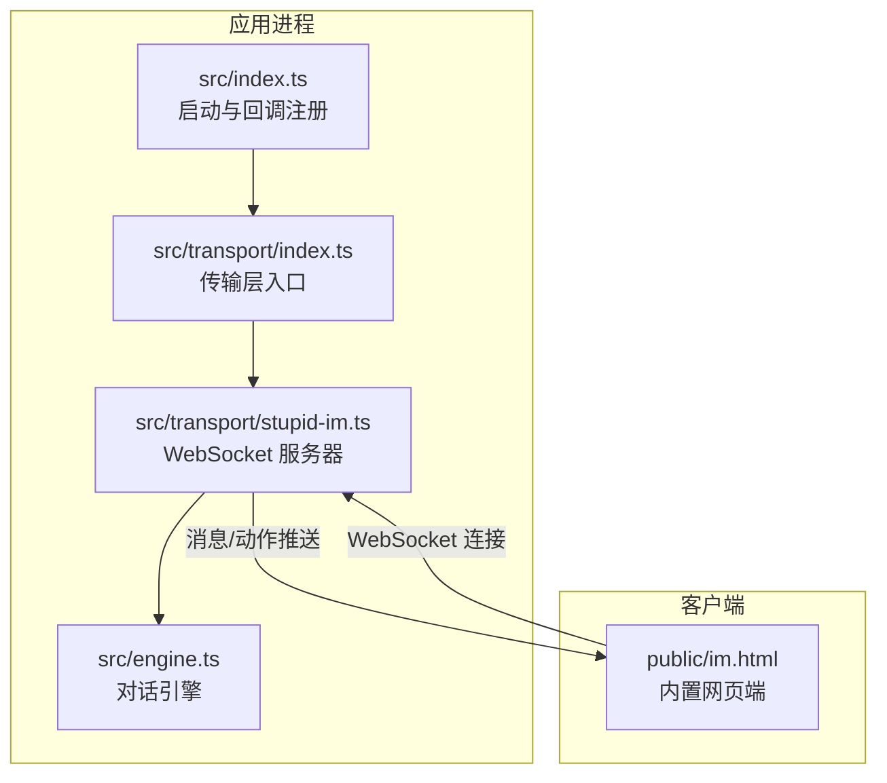
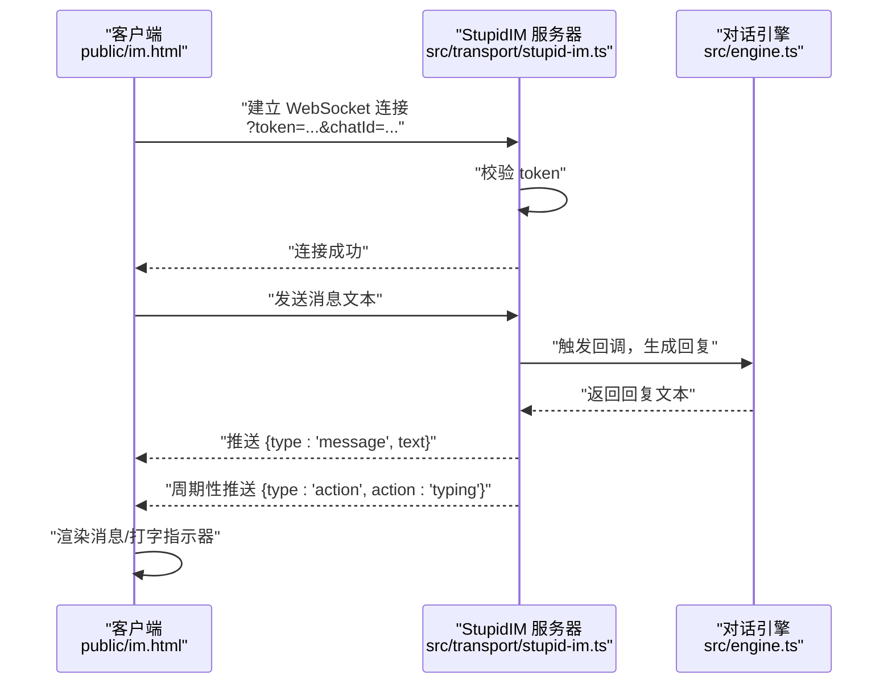
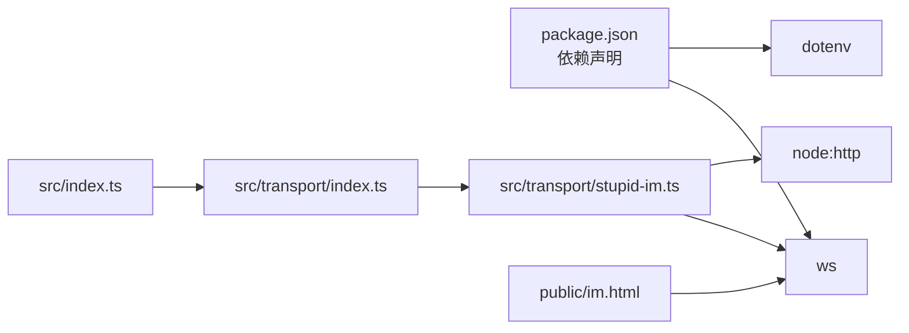

# WebSocket API

<cite>
**本文引用的文件列表**
- [src/transport/stupid-im.ts](file://src/transport/stupid-im.ts)
- [src/transport/index.ts](file://src/transport/index.ts)
- [public/im.html](file://public/im.html)
- [src/index.ts](file://src/index.ts)
- [src/engine.ts](file://src/engine.ts)
- [src/gateway.ts](file://src/gateway.ts)
- [package.json](file://package.json)
</cite>

## 目录
1. [简介](#简介)
2. [项目结构](#项目结构)
3. [核心组件](#核心组件)
4. [架构总览](#架构总览)
5. [详细组件分析](#详细组件分析)
6. [依赖关系分析](#依赖关系分析)
7. [性能考量](#性能考量)
8. [故障排查指南](#故障排查指南)
9. [结论](#结论)
10. [附录](#附录)

## 简介
本文件面向希望使用 StupidIM 提供的 WebSocket 能力与内置网页端进行实时交互的开发者，系统性记录 WebSocket 连接建立流程、消息格式、事件类型、实时交互模式、连接参数与握手协议、消息序列化格式、客户端连接示例、消息发送/接收模式、心跳机制、错误处理与重连策略、连接状态管理、与内置网页端的交互方式与数据同步机制，并提供客户端实现指南与调试方法。

## 项目结构
围绕 WebSocket 的关键文件与职责如下：
- 传输层入口与模式切换：src/transport/index.ts
- StupidIM WebSocket 服务器实现：src/transport/stupid-im.ts
- 内置网页端前端：public/im.html
- 应用入口与业务回调注册：src/index.ts
- 引擎与对话处理：src/engine.ts
- 通用网关（用于对比参考）：src/gateway.ts
- 依赖声明：package.json

图表来源
- [src/index.ts:189-208](file://src/index.ts#L189-L208)
- [src/transport/index.ts:47-70](file://src/transport/index.ts#L47-L70)
- [src/transport/stupid-im.ts:24-104](file://src/transport/stupid-im.ts#L24-L104)
- [public/im.html:340-427](file://public/im.html#L340-L427)

章节来源
- [src/transport/stupid-im.ts:1-105](file://src/transport/stupid-im.ts#L1-L105)
- [src/transport/index.ts:1-71](file://src/transport/index.ts#L1-L71)
- [public/im.html:1-428](file://public/im.html#L1-L428)
- [src/index.ts:112-216](file://src/index.ts#L112-L216)
- [src/engine.ts:19-706](file://src/engine.ts#L19-L706)
- [src/gateway.ts:1-79](file://src/gateway.ts#L1-L79)
- [package.json:1-39](file://package.json#L1-L39)

## 核心组件
- StupidIM WebSocket 服务器：负责监听 WebSocket 连接、校验 token、解析消息、向客户端推送消息与打字动作。
- 传输层入口：根据环境变量选择启动 StupidIM 或其他传输模式，并注册统一的消息回调。
- 内置网页端：提供简易的聊天界面，支持连接配置、消息收发、打字指示器。
- 对话引擎：接收消息，生成回复，写入历史记录。

章节来源
- [src/transport/stupid-im.ts:24-104](file://src/transport/stupid-im.ts#L24-L104)
- [src/transport/index.ts:47-70](file://src/transport/index.ts#L47-L70)
- [public/im.html:240-428](file://public/im.html#L240-L428)
- [src/engine.ts:680-706](file://src/engine.ts#L680-L706)

## 架构总览
WebSocket 交互的关键流程：
- 服务端启动时根据环境变量决定是否启用 StupidIM，并创建 WebSocketServer。
- 客户端通过 WebSocket 连接服务端，携带 token、chatId 等查询参数。
- 服务端校验 token，建立会话，接收消息文本。
- 服务端通过统一回调触发对话引擎生成回复，并向客户端推送消息与打字动作。
- 客户端接收消息并渲染，同时维护打字指示器与连接状态。

图表来源
- [src/transport/stupid-im.ts:65-98](file://src/transport/stupid-im.ts#L65-L98)
- [src/index.ts:189-208](file://src/index.ts#L189-L208)
- [public/im.html:373-385](file://public/im.html#L373-L385)

## 详细组件分析

### 连接建立与握手协议
- 服务端启动：若检测到 STUPID_IM_TOKEN，将启动 StupidIM WebSocket 服务器；可选择附加到现有 HTTP 服务器或独立监听端口。
- 客户端连接：通过 WebSocket URL 携带 token、chatId 等查询参数。
- 握手与认证：服务端解析请求 URL 查询参数，校验 token，不匹配则关闭连接并返回 4001。
- 会话标识：若未提供 chatId，服务端会基于连接生成一个随机标识；后续消息均以此 chatId 归属。

章节来源
- [src/transport/stupid-im.ts:24-71](file://src/transport/stupid-im.ts#L24-L71)
- [src/transport/stupid-im.ts:65-74](file://src/transport/stupid-im.ts#L65-L74)
- [src/index.ts:51-54](file://src/index.ts#L51-L54)

### 消息格式与事件类型
- 客户端发送：直接发送字符串文本，服务端将其作为用户消息内容。
- 服务端推送：
  - 文本消息：type=message，text 为回复内容。
  - 打字动作：type=action，action=typing。
- 客户端接收：解析 JSON，根据 type 渲染消息或显示打字指示器。

章节来源
- [src/transport/stupid-im.ts:84-94](file://src/transport/stupid-im.ts#L84-L94)
- [public/im.html:373-385](file://public/im.html#L373-L385)

### 实时交互模式
- 心跳机制：服务端在收到消息后，周期性调用 sendChatAction 推送打字动作，客户端侧每 4 秒触发一次。
- 消息流：客户端发送文本 -> 服务端回调引擎 -> 服务端推送回复 -> 客户端渲染。
- 打字指示器：当收到 action=typing 时显示，超时自动隐藏。

章节来源
- [src/index.ts:189-208](file://src/index.ts#L189-L208)
- [public/im.html:268-270](file://public/im.html#L268-L270)
- [public/im.html:326-338](file://public/im.html#L326-L338)

### 连接参数与客户端示例
- 必填参数：
  - token：服务端校验用，需与 STUPID_IM_TOKEN 一致。
  - chatId：会话标识，可选；未提供时由服务端生成。
- 客户端示例（内置网页端）：
  - 从 URL 参数读取 token、url、chatId。
  - 构造带 token、chatId 的 WebSocket URL。
  - 连接成功后启用输入框与发送按钮。
  - 断开时根据 code 展示错误信息并重置 UI。

章节来源
- [src/transport/stupid-im.ts:67-74](file://src/transport/stupid-im.ts#L67-L74)
- [public/im.html:282-298](file://public/im.html#L282-L298)
- [public/im.html:357-407](file://public/im.html#L357-L407)

### 消息序列化格式
- 客户端发送：纯文本字符串。
- 服务端推送：
  - 文本消息：{"type":"message","text":"..."}
  - 打字动作：{"type":"action","action":"typing"}

章节来源
- [src/transport/stupid-im.ts:84-94](file://src/transport/stupid-im.ts#L84-L94)
- [public/im.html:373-385](file://public/im.html#L373-L385)

### 错误处理与连接状态管理
- 认证失败：服务端返回 4001，客户端展示“Token 错误”。
- 连接断开：根据 close code 展示断开原因，重置 UI 并允许重新连接。
- 运行时异常：服务端捕获回调中的异常并记录日志，不影响连接。

章节来源
- [src/transport/stupid-im.ts:68-71](file://src/transport/stupid-im.ts#L68-L71)
- [src/transport/stupid-im.ts:95-97](file://src/transport/stupid-im.ts#L95-L97)
- [public/im.html:394-406](file://public/im.html#L394-L406)

### 与内置网页端的交互与数据同步
- 数据同步：服务端将用户消息与回复写入历史记录，引擎负责生成回复文本。
- 前端渲染：消息到达后添加气泡并滚动到底部；打字动作触发时显示指示器。
- 会话归属：以 chatId 为维度组织消息历史。

章节来源
- [src/engine.ts:680-706](file://src/engine.ts#L680-L706)
- [public/im.html:309-324](file://public/im.html#L309-L324)
- [public/im.html:378-381](file://public/im.html#L378-L381)

## 依赖关系分析
- 传输层依赖：ws（WebSocket）、node:http（HTTP 服务器）。
- 应用入口依赖：dotenv 加载环境变量，确保 STUPID_IM_TOKEN、PORT 等生效。
- 内置网页端：纯静态 HTML+JS，通过 WebSocket 与服务端通信。

图表来源
- [package.json:30-37](file://package.json#L30-L37)
- [src/index.ts:1-10](file://src/index.ts#L1-L10)
- [src/transport/stupid-im.ts:1-6](file://src/transport/stupid-im.ts#L1-L6)
- [public/im.html:278-427](file://public/im.html#L278-L427)

章节来源
- [package.json:1-39](file://package.json#L1-L39)
- [src/index.ts:1-10](file://src/index.ts#L1-L10)
- [src/transport/stupid-im.ts:1-6](file://src/transport/stupid-im.ts#L1-L6)

## 性能考量
- 心跳频率：服务端每 4 秒推送一次打字动作，避免过于频繁导致网络压力。
- 消息处理：服务端在回调中异步处理消息，异常被捕获并记录，不影响整体稳定性。
- 历史记录：每次对话前后写入历史事件，建议关注磁盘 IO 与存储空间。

章节来源
- [src/index.ts:189-208](file://src/index.ts#L189-L208)
- [src/engine.ts:680-706](file://src/engine.ts#L680-L706)

## 故障排查指南
- 无法连接：
  - 检查 STUPID_IM_TOKEN 是否与客户端 token 一致。
  - 确认服务端端口与防火墙设置。
- 连接断开：
  - 查看控制台输出的 close code，4001 表示认证失败。
  - 检查客户端是否正确构造 WebSocket URL（包含 token、chatId）。
- 无回复：
  - 确认对话引擎可用（模型与 API Key 配置正确）。
  - 查看回调日志，确认消息已进入处理流程。
- 打字指示器不消失：
  - 客户端默认 5 秒自动隐藏，检查网络延迟或消息解析异常。

章节来源
- [src/transport/stupid-im.ts:68-71](file://src/transport/stupid-im.ts#L68-L71)
- [public/im.html:394-406](file://public/im.html#L394-L406)
- [src/engine.ts:680-706](file://src/engine.ts#L680-L706)

## 结论
StupidIM 的 WebSocket 能力提供了轻量、可控的实时交互通道：通过简单的 token 校验与文本消息格式，结合周期性打字动作推送，实现了内置网页端与后端引擎的顺畅协作。其设计遵循“传输层可替换”的原则，便于未来扩展其他接入方式而不影响业务层。

## 附录

### 客户端实现指南（通用）
- 连接参数
  - 必填：token
  - 可选：chatId（未提供时由服务端生成）
- 发送消息
  - 直接发送字符串文本。
- 接收消息
  - 解析 JSON，type=message 时渲染文本；type=action 且 action=typing 时显示打字指示器。
- 心跳与重连
  - 建议每 4 秒发送一次心跳（可复用现有文本消息）。
  - 断开后指数退避重连，最大重试次数与等待时间可根据场景调整。

章节来源
- [src/transport/stupid-im.ts:84-94](file://src/transport/stupid-im.ts#L84-L94)
- [public/im.html:373-385](file://public/im.html#L373-L385)
- [src/index.ts:189-208](file://src/index.ts#L189-L208)

### 调试方法
- 启用调试日志：设置 DEBUG_STUPIDCLAW=1 与 DEBUG_PROMPT=1 观察运行时配置与提示词。
- 查看控制台输出：连接、错误、消息处理等日志。
- 使用内置网页端：通过 UI 直观验证连接、消息与打字指示器行为。

章节来源
- [src/engine.ts:35-36](file://src/engine.ts#L35-L36)
- [src/engine.ts:65-73](file://src/engine.ts#L65-L73)
- [src/transport/stupid-im.ts:100-102](file://src/transport/stupid-im.ts#L100-L102)