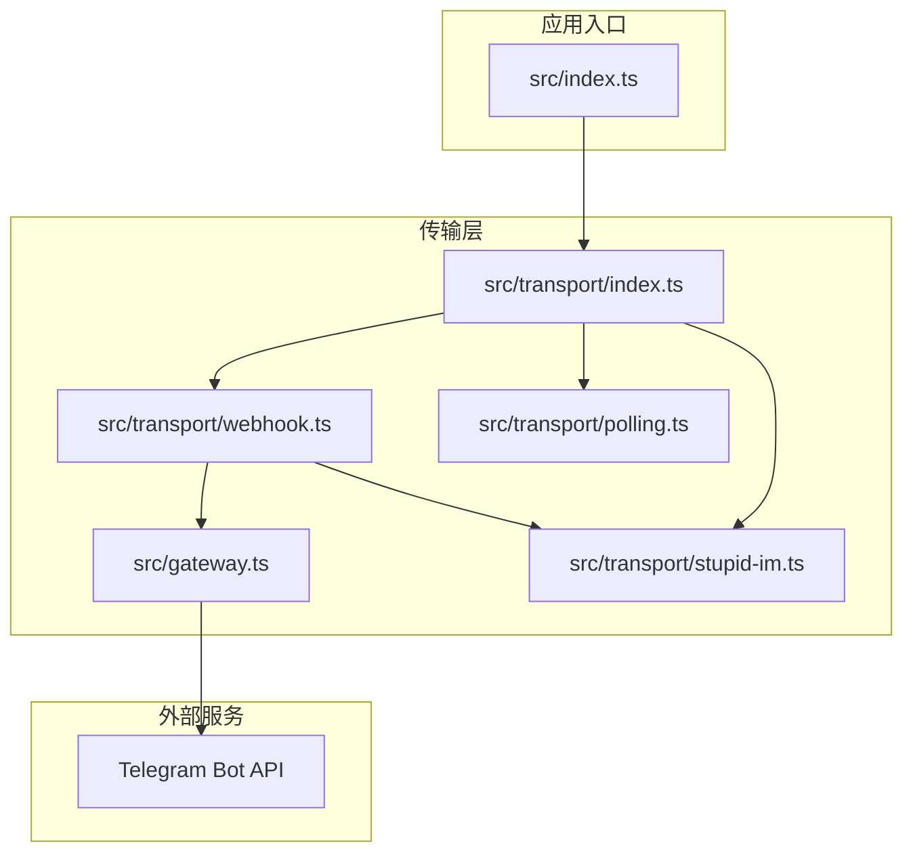
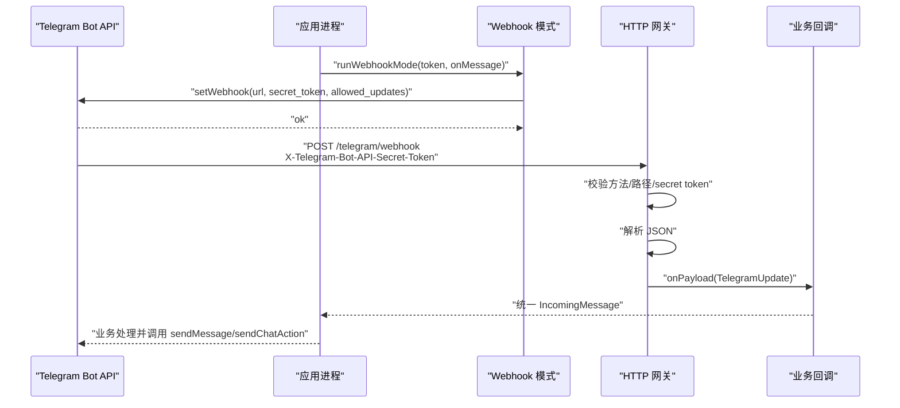
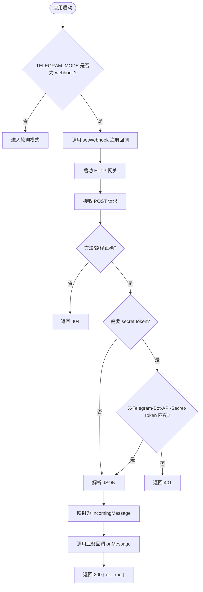
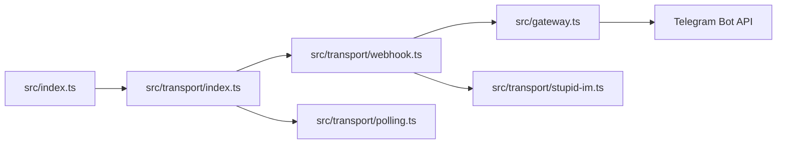

# Webhook API

<cite>
**本文引用的文件**
- [src/transport/webhook.ts](file://src/transport/webhook.ts)
- [src/gateway.ts](file://src/gateway.ts)
- [src/transport/index.ts](file://src/transport/index.ts)
- [src/transport/polling.ts](file://src/transport/polling.ts)
- [src/transport/stupid-im.ts](file://src/transport/stupid-im.ts)
- [src/index.ts](file://src/index.ts)
- [StupidClaw-第2期-从Polling升级到Webhook.md](file://StupidClaw-第2期-从Polling升级到Webhook.md)
- [package.json](file://package.json)
</cite>

## 目录
1. [简介](#简介)
2. [项目结构](#项目结构)
3. [核心组件](#核心组件)
4. [架构总览](#架构总览)
5. [详细组件分析](#详细组件分析)
6. [依赖关系分析](#依赖关系分析)
7. [性能考量](#性能考量)
8. [故障排查指南](#故障排查指南)
9. [结论](#结论)
10. [附录](#附录)

## 简介
本文件面向使用 StupidClaw 的开发者，提供 Webhook API 的完整技术文档。内容覆盖：
- HTTP Webhook 端点的 URL 模式与请求方法
- 消息格式与事件类型
- 认证机制与请求头要求
- 消息接收流程与处理逻辑
- 响应格式与状态码
- 配置指南与验证方法
- 与 Telegram Bot API 的集成方式与最佳实践
- 请求/响应示例与集成代码片段路径

## 项目结构
Webhook 相关能力由传输层模块提供，核心文件如下：
- 传输层入口与模式切换：src/transport/index.ts
- Webhook 模式实现：src/transport/webhook.ts
- 通用网关：src/gateway.ts
- 轮询模式（对比参考）：src/transport/polling.ts
- StupidIM 内置网页与 WS：src/transport/stupid-im.ts
- 应用入口与业务回调注册：src/index.ts
- 教程文档（含最小数据结构与配置说明）：StupidClaw-第2期-从Polling升级到Webhook.md
- 包脚本与二进制入口：package.json

图表来源
- [src/index.ts:112-209](file://src/index.ts#L112-L209)
- [src/transport/index.ts:47-70](file://src/transport/index.ts#L47-L70)
- [src/transport/webhook.ts:41-85](file://src/transport/webhook.ts#L41-L85)
- [src/gateway.ts:27-78](file://src/gateway.ts#L27-L78)
- [src/transport/polling.ts:52-89](file://src/transport/polling.ts#L52-L89)
- [src/transport/stupid-im.ts:24-104](file://src/transport/stupid-im.ts#L24-L104)

章节来源
- [src/transport/index.ts:1-71](file://src/transport/index.ts#L1-L71)
- [src/transport/webhook.ts:1-86](file://src/transport/webhook.ts#L1-L86)
- [src/gateway.ts:1-79](file://src/gateway.ts#L1-L79)
- [src/transport/polling.ts:1-243](file://src/transport/polling.ts#L1-L243)
- [src/transport/stupid-im.ts:1-105](file://src/transport/stupid-im.ts#L1-L105)
- [src/index.ts:112-209](file://src/index.ts#L112-L209)
- [StupidClaw-第2期-从Polling升级到Webhook.md:38-95](file://StupidClaw-第2期-从Polling升级到Webhook.md#L38-L95)

## 核心组件
- 传输层入口：根据 TELEGRAM_MODE 切换轮询或 Webhook；同时支持可选的 StupidIM。
- Webhook 模式：启动时向 Telegram Bot API 注册 Webhook，监听本地 HTTP 端点，接收 Telegram 更新并转换为统一消息模型。
- 网关：校验请求方法与路径、可选的 secret token、解析 JSON 并回调业务处理器。
- 轮询模式：用于对比与回退，当未配置 TELEGRAM_BOT_TOKEN 或非 Webhook 模式时启用。
- StupidIM：提供网页端与 WebSocket，便于本地调试与演示。

章节来源
- [src/transport/index.ts:47-70](file://src/transport/index.ts#L47-L70)
- [src/transport/webhook.ts:41-85](file://src/transport/webhook.ts#L41-L85)
- [src/gateway.ts:27-78](file://src/gateway.ts#L27-L78)
- [src/transport/polling.ts:19-45](file://src/transport/polling.ts#L19-L45)
- [src/transport/stupid-im.ts:24-104](file://src/transport/stupid-im.ts#L24-L104)

## 架构总览
Webhook 工作流概览：
- 应用启动后，若 TELEGRAM_MODE=webhook，则调用 runWebhookMode。
- runWebhookMode 通过 Telegram Bot API 的 setWebhook 注册回调 URL。
- Telegram 将消息以 POST 请求发送至本地 HTTP 网关。
- 网关校验路径与可选 secret token，解析 JSON，回调 onPayload。
- onPayload 将 TelegramUpdate 映射为统一 IncomingMessage，交由业务层处理。

图表来源
- [src/transport/webhook.ts:19-37](file://src/transport/webhook.ts#L19-L37)
- [src/transport/webhook.ts:57-84](file://src/transport/webhook.ts#L57-L84)
- [src/gateway.ts:40-64](file://src/gateway.ts#L40-L64)
- [src/transport/polling.ts:215-242](file://src/transport/polling.ts#L215-L242)

## 详细组件分析

### Webhook 端点与 URL 模式
- 端点路径：/telegram/webhook（可通过 TELEGRAM_WEBHOOK_PATH 自定义）
- 监听端口：PORT（默认 8787）
- 请求方法：仅接受 POST；GET 请求由 StupidIM 处理（若启用）

章节来源
- [src/transport/webhook.ts:50-55](file://src/transport/webhook.ts#L50-L55)
- [src/gateway.ts:40-44](file://src/gateway.ts#L40-L44)
- [src/transport/stupid-im.ts:11-22](file://src/transport/stupid-im.ts#L11-L22)

### 认证机制与请求头
- 可选 secret token：若配置了 TELEGRAM_WEBHOOK_SECRET，Telegram 会在每个 Webhook 请求中携带请求头 X-Telegram-Bot-API-Secret-Token，网关会严格比对。
- 未配置 secret token：网关不校验该请求头。
- StupidIM 的 WebSocket 认证：通过 ws URL 查询参数 token 进行简单认证。

章节来源
- [src/transport/webhook.ts:49-51](file://src/transport/webhook.ts#L49-L51)
- [src/gateway.ts:46-53](file://src/gateway.ts#L46-L53)
- [src/transport/stupid-im.ts:65-71](file://src/transport/stupid-im.ts#L65-L71)

### 消息格式与事件类型
- 输入格式：TelegramUpdate（来自 Telegram Bot API 的更新对象）
- 输出格式：统一 IncomingMessage（业务层只认此结构）
- 事件类型：当前实现仅处理消息类更新（allowed_updates: ["message"]）

章节来源
- [src/transport/webhook.ts:5-11](file://src/transport/webhook.ts#L5-L11)
- [src/transport/webhook.ts:71-82](file://src/transport/webhook.ts#L71-L82)
- [src/transport/index.ts:5-13](file://src/transport/index.ts#L5-L13)
- [src/transport/webhook.ts:27-32](file://src/transport/webhook.ts#L27-L32)

### 数据结构规范
- TelegramUpdate（输入）
  - update_id: 数字
  - message?: 包含 chat.id 与 text
- IncomingMessage（输出）
  - updateId?: 数字（Webhook 场景可缺省）
  - chatId: 字符串
  - text: 字符串
  - reply(text): 回复消息
  - sendChatAction(): 发送“正在输入”状态

章节来源
- [src/transport/webhook.ts:5-11](file://src/transport/webhook.ts#L5-L11)
- [src/transport/index.ts:5-13](file://src/transport/index.ts#L5-L13)
- [StupidClaw-第2期-从Polling升级到Webhook.md:19-35](file://StupidClaw-第2期-从Polling升级到Webhook.md#L19-L35)

### 请求头要求
- Content-Type: application/json
- 可选 X-Telegram-Bot-API-Secret-Token: 当配置了 secret token 时必须一致

章节来源
- [src/transport/webhook.ts:24-36](file://src/transport/webhook.ts#L24-L36)
- [src/gateway.ts:46-53](file://src/gateway.ts#L46-L53)

### 响应格式与状态码
- 成功：200 OK，JSON { ok: true }
- 失败：400 Bad Request，JSON { ok: false }
- 未授权：401 Unauthorized（secret token 不匹配）
- 路径或方法错误：404 Not Found
- GET 请求（StupidIM）：200 OK 返回页面内容

章节来源
- [src/gateway.ts:59-64](file://src/gateway.ts#L59-L64)
- [src/gateway.ts:48-52](file://src/gateway.ts#L48-L52)
- [src/gateway.ts:40-44](file://src/gateway.ts#L40-L44)
- [src/transport/stupid-im.ts:13-21](file://src/transport/stupid-im.ts#L13-L21)

### 消息接收流程
- 应用启动：读取 TELEGRAM_MODE，若为 webhook 则进入 runWebhookMode
- 注册 Webhook：调用 Telegram Bot API 的 setWebhook，设置 url、secret_token、allowed_updates
- 启动网关：监听指定端口与路径，接收 POST 请求
- 校验与解析：校验方法/路径/secret token，读取并解析 JSON
- 映射与回调：将 TelegramUpdate 映射为 IncomingMessage，调用 onMessage
- 业务处理：业务层执行聊天与回复逻辑

图表来源
- [src/transport/index.ts:61-69](file://src/transport/index.ts#L61-L69)
- [src/transport/webhook.ts:57-84](file://src/transport/webhook.ts#L57-L84)
- [src/gateway.ts:40-64](file://src/gateway.ts#L40-L64)
- [src/transport/polling.ts:52-89](file://src/transport/polling.ts#L52-L89)

### 与 Telegram Bot API 的集成
- 注册 Webhook：调用 setWebhook，设置 url 为应用对外可达的公网地址 + /telegram/webhook，secret_token 可选
- allowed_updates：仅监听 message 类型更新
- 业务层通过 sendMessage 与 sendChatAction 与 Telegram 交互

章节来源
- [src/transport/webhook.ts:19-37](file://src/transport/webhook.ts#L19-L37)
- [src/transport/webhook.ts:75-81](file://src/transport/webhook.ts#L75-L81)
- [src/transport/polling.ts:215-242](file://src/transport/polling.ts#L215-L242)

### 配置指南与验证方法
- 必填项
  - TELEGRAM_BOT_TOKEN：Bot 访问令牌
  - TELEGRAM_WEBHOOK_URL：公网可达的完整 URL（包含 /telegram/webhook）
- 可选项
  - TELEGRAM_WEBHOOK_SECRET：Webhook secret token
  - TELEGRAM_WEBHOOK_PATH：自定义路径（默认 /telegram/webhook）
  - PORT：监听端口（默认 8787）
  - TELEGRAM_MODE：polling 或 webhook（默认 polling）
  - STUPID_IM_TOKEN：启用 StupidIM 的访问令牌
- 验证步骤
  - 启动应用，确认控制台输出“StupidClaw Telegram webhook started”
  - 使用 curl 或浏览器访问 /im（若启用 StupidIM），验证页面可用
  - 在 Telegram BotFather 中查看 Webhook 设置状态

章节来源
- [src/transport/webhook.ts:44-55](file://src/transport/webhook.ts#L44-L55)
- [src/transport/webhook.ts:50-51](file://src/transport/webhook.ts#L50-L51)
- [src/transport/stupid-im.ts:11-22](file://src/transport/stupid-im.ts#L11-L22)
- [StupidClaw-第2期-从Polling升级到Webhook.md:98-113](file://StupidClaw-第2期-从Polling升级到Webhook.md#L98-L113)

### 重试机制与错误处理策略
- Telegram Bot API 的错误：setWebhook 失败抛出异常
- 网关层错误：解析失败返回 400；secret token 不匹配返回 401；路径/方法错误返回 404
- 轮询模式冲突：当存在已注册 Webhook 时，轮询会自动禁用 Webhook 并重试
- 业务层错误：onMessage 抛错会被捕获并记录，不影响后续请求处理

章节来源
- [src/transport/webhook.ts:34-36](file://src/transport/webhook.ts#L34-L36)
- [src/gateway.ts:61-64](file://src/gateway.ts#L61-L64)
- [src/gateway.ts:48-52](file://src/gateway.ts#L48-L52)
- [src/transport/polling.ts:57-60](file://src/transport/polling.ts#L57-L60)

### 实际请求/响应示例与集成代码片段路径
- 注册 Webhook 请求（示例路径）
  - [src/transport/webhook.ts:24-36](file://src/transport/webhook.ts#L24-L36)
- Webhook 回调请求（示例路径）
  - 方法：POST
  - 路径：/telegram/webhook
  - 请求头：Content-Type: application/json；可选 X-Telegram-Bot-API-Secret-Token
  - 请求体：TelegramUpdate 对象
  - 响应：200 { ok: true } 或 400 { ok: false }
  - 参考：[src/gateway.ts:40-64](file://src/gateway.ts#L40-L64)
- 业务回调（示例路径）
  - 统一消息模型 IncomingMessage
  - 回复与打字状态：[src/transport/webhook.ts:75-81](file://src/transport/webhook.ts#L75-L81)
  - 发送消息与打字状态：[src/transport/polling.ts:203-242](file://src/transport/polling.ts#L203-L242)
- StupidIM 页面与 WS（示例路径）
  - 页面：GET /im -> 200 HTML
  - WS 认证：ws?url=...&token=...
  - 参考：[src/transport/stupid-im.ts:11-22](file://src/transport/stupid-im.ts#L11-L22), [src/transport/stupid-im.ts:65-71](file://src/transport/stupid-im.ts#L65-L71)

章节来源
- [src/transport/webhook.ts:24-36](file://src/transport/webhook.ts#L24-L36)
- [src/gateway.ts:40-64](file://src/gateway.ts#L40-L64)
- [src/transport/webhook.ts:75-81](file://src/transport/webhook.ts#L75-L81)
- [src/transport/polling.ts:203-242](file://src/transport/polling.ts#L203-L242)
- [src/transport/stupid-im.ts:11-22](file://src/transport/stupid-im.ts#L11-L22)
- [src/transport/stupid-im.ts:65-71](file://src/transport/stupid-im.ts#L65-L71)

## 依赖关系分析
- 传输层解耦：index.ts 仅依赖 transport/index.ts，不感知具体传输实现
- Webhook 依赖 Telegram Bot API：setWebhook/deleteWebhook
- 网关依赖 Node HTTP：负责路由、校验与解析
- 业务层依赖统一消息模型：IncomingMessage

图表来源
- [src/index.ts:112-209](file://src/index.ts#L112-L209)
- [src/transport/index.ts:47-70](file://src/transport/index.ts#L47-L70)
- [src/transport/webhook.ts:57-84](file://src/transport/webhook.ts#L57-L84)
- [src/gateway.ts:27-78](file://src/gateway.ts#L27-L78)
- [src/transport/stupid-im.ts:24-104](file://src/transport/stupid-im.ts#L24-L104)

章节来源
- [src/index.ts:112-209](file://src/index.ts#L112-L209)
- [src/transport/index.ts:47-70](file://src/transport/index.ts#L47-L70)
- [src/transport/webhook.ts:57-84](file://src/transport/webhook.ts#L57-L84)
- [src/gateway.ts:27-78](file://src/gateway.ts#L27-L78)
- [src/transport/stupid-im.ts:24-104](file://src/transport/stupid-im.ts#L24-L104)

## 性能考量
- 网关采用流式读取请求体，避免大消息内存峰值过高
- 业务层在收到消息后周期性发送“正在输入”状态，提升用户体验
- 轮询模式具备自动禁用 Webhook 的冲突处理，避免重复消息

章节来源
- [src/gateway.ts:16-25](file://src/gateway.ts#L16-L25)
- [src/transport/index.ts:19-45](file://src/transport/index.ts#L19-L45)
- [src/transport/polling.ts:57-60](file://src/transport/polling.ts#L57-L60)

## 故障排查指南
- 控制台未输出“webhook started”：检查 TELEGRAM_MODE 与 TELEGRAM_BOT_TOKEN
- setWebhook 失败：检查 TELEGRAM_WEBHOOK_URL 与网络可达性
- 401 Unauthorized：确认 X-Telegram-Bot-API-Secret-Token 与 TELEGRAM_WEBHOOK_SECRET 一致
- 404 Not Found：确认请求方法为 POST 且路径与 TELEGRAM_WEBHOOK_PATH 一致
- 400 Bad Request：检查请求体是否为合法 JSON
- 轮询冲突：若出现 409，轮询会自动禁用 Webhook 并重试

章节来源
- [src/transport/webhook.ts:44-55](file://src/transport/webhook.ts#L44-L55)
- [src/transport/webhook.ts:34-36](file://src/transport/webhook.ts#L34-L36)
- [src/gateway.ts:48-52](file://src/gateway.ts#L48-L52)
- [src/gateway.ts:40-44](file://src/gateway.ts#L40-L44)
- [src/gateway.ts:61-64](file://src/gateway.ts#L61-L64)
- [src/transport/polling.ts:57-60](file://src/transport/polling.ts#L57-L60)

## 结论
通过将传输层与业务层解耦，Webhook 模式在不改变业务处理逻辑的前提下实现了消息接入方式的灵活切换。结合可选的 secret token 与严格的网关校验，系统在安全性与稳定性方面具备良好基础。建议在生产环境中使用公网可达域名与 HTTPS，合理配置 secret token，并监控 Webhook 回调状态与错误日志。

## 附录
- 包脚本与二进制入口
  - 开发运行：npm run dev
  - 构建：npm run build
  - 二进制入口：stupid-claw
  - 参考：[package.json:14-22](file://package.json#L14-L22)

章节来源
- [package.json:14-22](file://package.json#L14-L22)