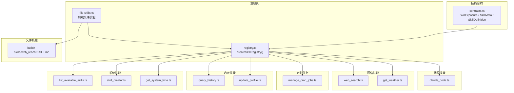
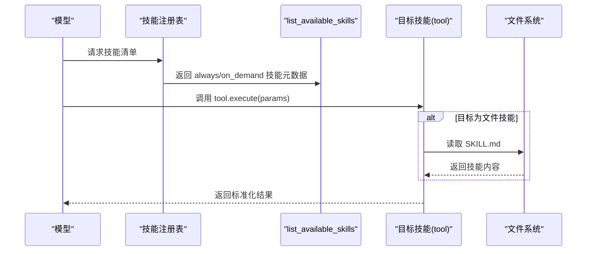
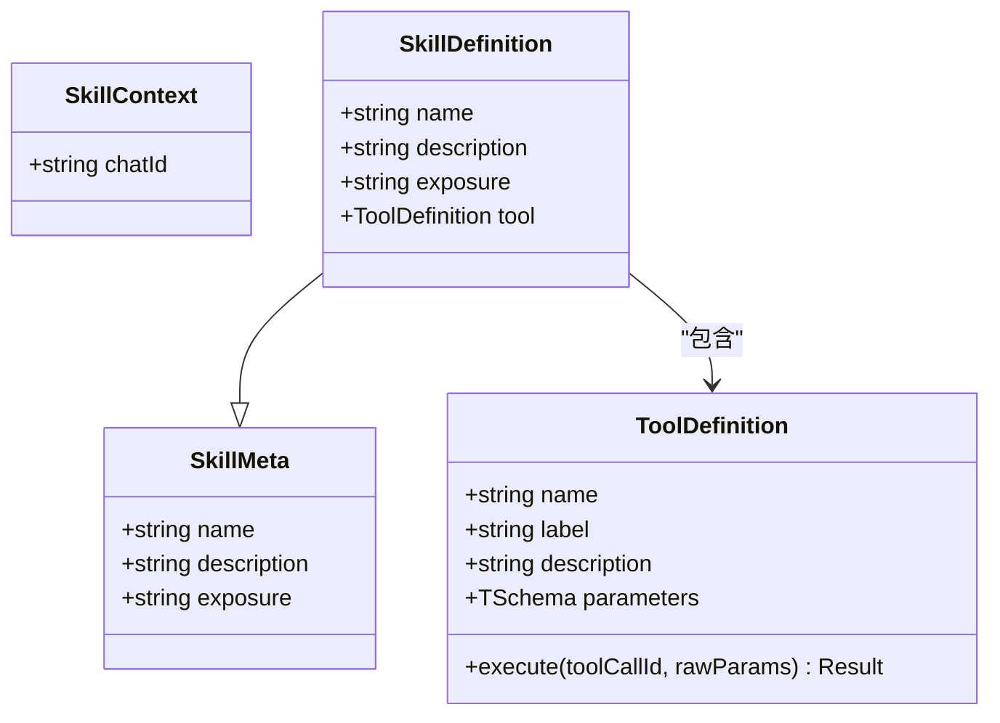
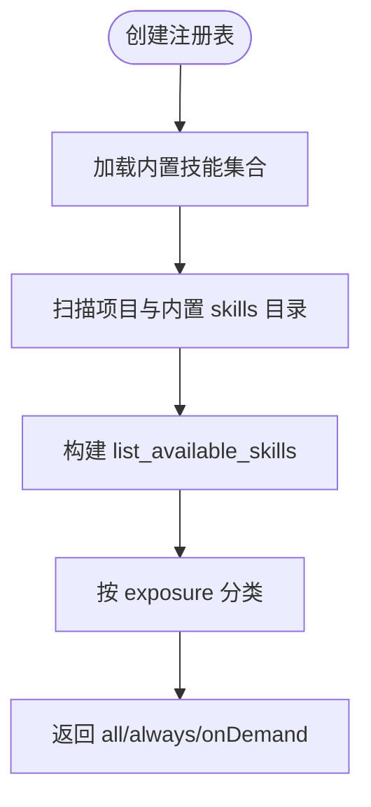
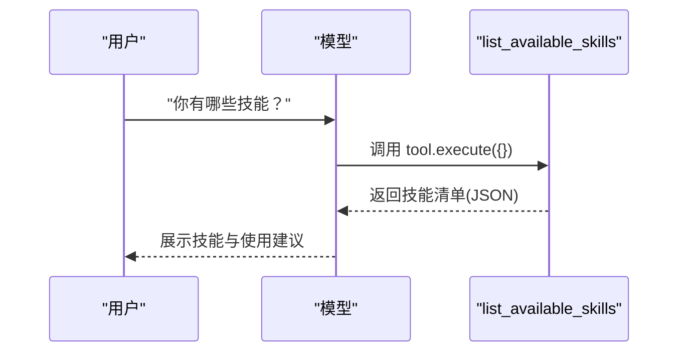
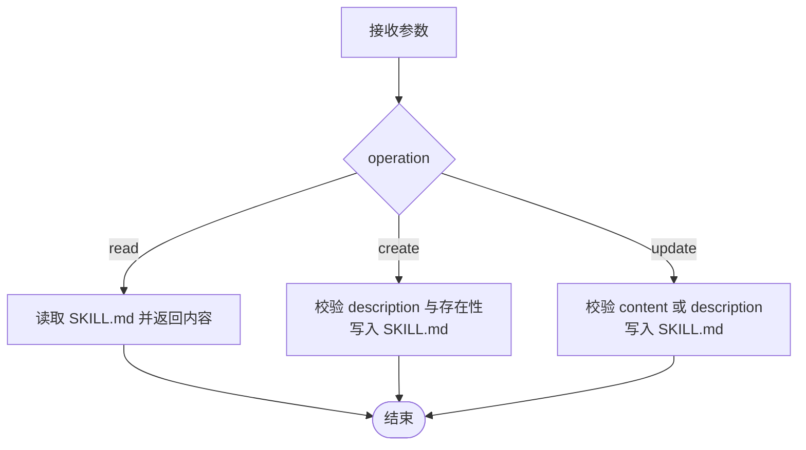
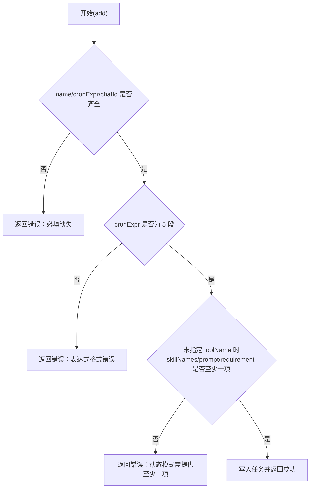
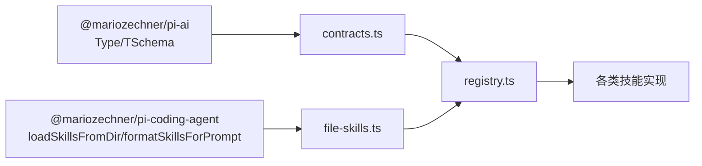

# 技能 API

<cite>
**本文引用的文件**
- [contracts.ts](file://src/skills/contracts.ts)
- [registry.ts](file://src/skills/registry.ts)
- [file-skills.ts](file://src/skills/file-skills.ts)
- [list_available_skills.ts](file://src/skills/system/list_available_skills.ts)
- [skill_creator.ts](file://src/skills/system/skill_creator.ts)
- [get_system_time.ts](file://src/skills/system/get_system_time.ts)
- [query_history.ts](file://src/skills/memory/query_history.ts)
- [update_profile.ts](file://src/skills/memory/update_profile.ts)
- [manage_cron_jobs.ts](file://src/skills/cron/manage_cron_jobs.ts)
- [web_search.ts](file://src/skills/web/web_search.ts)
- [get_weather.ts](file://src/skills/web/get_weather.ts)
- [claude_code.ts](file://src/skills/coding/claude_code.ts)
- [SKILL.md](file://builtin-skills/web_reach/SKILL.md)
- [第3期文档](file://StupidClaw-第3期-Skills不是越多越好关键是按需披露.md)
- [README.md](file://README.md)
- [package.json](file://package.json)
</cite>

## 目录
1. [简介](#简介)
2. [项目结构](#项目结构)
3. [核心组件](#核心组件)
4. [架构总览](#架构总览)
5. [详细组件分析](#详细组件分析)
6. [依赖关系分析](#依赖关系分析)
7. [性能考量](#性能考量)
8. [故障排查指南](#故障排查指南)
9. [结论](#结论)
10. [附录](#附录)

## 简介
本文件系统性梳理 StupidClaw 的技能 API 设计与实现，覆盖技能接口定义、元数据结构、暴露级别（always/on_demand）、工具定义与参数校验、注册流程、调用机制、错误处理与调试技巧，并给出扩展与自定义技能的最佳实践。

## 项目结构
技能系统位于 src/skills 目录，采用“合约 + 注册表 + 多种技能实现”的分层组织方式：
- 合约层：定义技能元数据与技能定义接口、暴露级别类型别名
- 注册表层：聚合内置技能与文件技能，按暴露级别分类导出
- 实现层：系统技能（时间、技能目录、技能创建器）、内存技能（历史查询、个人档案）、定时任务、网络搜索、天气、代码助手等

图表来源
- [contracts.ts:1-20](file://src/skills/contracts.ts#L1-L20)
- [registry.ts:1-55](file://src/skills/registry.ts#L1-L55)
- [file-skills.ts:1-65](file://src/skills/file-skills.ts#L1-L65)
- [list_available_skills.ts:1-40](file://src/skills/system/list_available_skills.ts#L1-L40)
- [skill_creator.ts:1-312](file://src/skills/system/skill_creator.ts#L1-L312)
- [get_system_time.ts:1-38](file://src/skills/system/get_system_time.ts#L1-L38)
- [query_history.ts:1-57](file://src/skills/memory/query_history.ts#L1-L57)
- [update_profile.ts:1-84](file://src/skills/memory/update_profile.ts#L1-L84)
- [manage_cron_jobs.ts:1-336](file://src/skills/cron/manage_cron_jobs.ts#L1-L336)
- [web_search.ts:1-95](file://src/skills/web/web_search.ts#L1-L95)
- [get_weather.ts:1-110](file://src/skills/web/get_weather.ts#L1-L110)
- [claude_code.ts:1-99](file://src/skills/coding/claude_code.ts#L1-L99)
- [SKILL.md:1-122](file://builtin-skills/web_reach/SKILL.md#L1-L122)

章节来源
- [README.md:38-51](file://README.md#L38-L51)
- [package.json:30-37](file://package.json#L30-L37)

## 核心组件
- 暴露级别（SkillExposure）
  - "always"：首轮可见，作为“入口能力”
  - "on_demand"：按需发现，避免首轮过度膨胀
- 技能元数据（SkillMeta）
  - name：技能名称（小写字母、数字、连字符，与目录同名）
  - description：触发描述与用途说明
  - exposure：always 或 on_demand
- 技能定义（SkillDefinition）
  - 继承 SkillMeta，并包含 tool（ToolDefinition<TParams>）
  - tool.execute 返回标准化内容与细节，避免隐式状态
- 工具参数（ToolDefinition.parameters）
  - 使用 TSchema（来自 @mariozechner/pi-ai）进行参数约束与校验
  - 通过 Type.Object/Type.String/Type.Number/Type.Union 等构建参数模式

章节来源
- [contracts.ts:4-19](file://src/skills/contracts.ts#L4-L19)
- [第3期文档:23-47](file://StupidClaw-第3期-Skills不是越多越好关键是按需披露.md#L23-L47)

## 架构总览
技能注册与调用的总体流程：
- 初始化阶段：创建技能注册表，聚合内置技能与文件技能，按 exposure 分类
- 运行阶段：模型先调用 always 技能（如列出技能目录），再根据需要调用 on_demand 技能
- 文件技能：从项目 skills 目录与内置 builtin-skills 目录加载 SKILL.md，自动暴露为 on_demand 技能

图表来源
- [registry.ts:23-54](file://src/skills/registry.ts#L23-L54)
- [list_available_skills.ts:4-39](file://src/skills/system/list_available_skills.ts#L4-L39)
- [file-skills.ts:58-64](file://src/skills/file-skills.ts#L58-L64)

## 详细组件分析

### 合约与类型：SkillDefinition 与 ToolDefinition
- SkillDefinition
  - 字段：name/description/exposure/tool
  - 约束：name/description 与 tool 必须一致；execute 返回可序列化结果
- ToolDefinition<TParams>
  - parameters：TSchema（Type.Object(...) 等）
  - execute：(_toolCallId, rawParams) => Promise<{ content, details }>
- TSchema
  - 由 @mariozechner/pi-ai 提供，用于参数模式声明与运行时校验

图表来源
- [contracts.ts:6-19](file://src/skills/contracts.ts#L6-L19)

章节来源
- [contracts.ts:1-20](file://src/skills/contracts.ts#L1-L20)

### 注册表：createSkillRegistry
- 职责
  - 聚合内置技能（系统、内存、定时、网络、代码等）
  - 加载文件技能（项目 skills 与内置 builtin-skills）
  - 暴露 all/always/onDemand 三类集合
- 关键点
  - always：入口能力（如列出技能目录、系统时间）
  - onDemand：扩展能力（历史查询、个人档案、网络搜索、天气、代码助手、定时任务等）

图表来源
- [registry.ts:23-54](file://src/skills/registry.ts#L23-L54)
- [file-skills.ts:26-48](file://src/skills/file-skills.ts#L26-L48)

章节来源
- [registry.ts:1-55](file://src/skills/registry.ts#L1-L55)
- [file-skills.ts:1-65](file://src/skills/file-skills.ts#L1-L65)

### 系统技能

#### 列出可用技能（always）
- 功能：返回技能清单与使用指引
- 参数：无
- 输出：skills 数组（name/exposure/description）+ guidance

图表来源
- [list_available_skills.ts:4-39](file://src/skills/system/list_available_skills.ts#L4-L39)

章节来源
- [list_available_skills.ts:1-40](file://src/skills/system/list_available_skills.ts#L1-L40)

#### 技能创建器（on_demand）
- 功能：在 .stupidClaw/skills/<name>/SKILL.md 下创建/读取/更新技能
- 参数：
  - operation: "read" | "create" | "update"
  - name: 技能名（规范化为小写连字符）
  - description/body/content：创建/更新所需
- 校验与错误：
  - name 必填且规范化
  - create 时必须提供 description
  - update 时至少提供 content 或 description
- 输出：标准化 JSON 文本

图表来源
- [skill_creator.ts:65-311](file://src/skills/system/skill_creator.ts#L65-L311)

章节来源
- [skill_creator.ts:1-312](file://src/skills/system/skill_creator.ts#L1-L312)

#### 系统时间（always）
- 功能：返回 ISO 与本地时间字符串
- 参数：无
- 输出：包含时间对象的 JSON 文本

章节来源
- [get_system_time.ts:1-38](file://src/skills/system/get_system_time.ts#L1-L38)

### 内存技能

#### 历史查询（on_demand）
- 功能：按日期/聊天标识/限制条数查询历史事件
- 参数：
  - date: YYYY-MM-DD（默认当天）
  - chatId: 可选过滤
  - limit: 默认 20，最大 200
- 输出：事件数组 JSON 文本

章节来源
- [query_history.ts:1-57](file://src/skills/memory/query_history.ts#L1-L57)

#### 个人档案更新（on_demand）
- 功能：更新 profile.md 的指定 section（稳定事实/偏好/约束）
- 参数：
  - section: "stable_facts" | "preferences" | "constraints"
  - facts: 字符串数组
  - mode: "append"(默认) | "replace"
- 输出：更新后的档案 JSON 文本

章节来源
- [update_profile.ts:1-84](file://src/skills/memory/update_profile.ts#L1-L84)

### 定时任务技能（on_demand）
- 功能：增删改查定时任务，支持固定工具调用或 LLM 动态生成
- 参数要点：
  - action: "list" | "add" | "update" | "remove" | "set_enabled"
  - add 时 name/cronExpr/chatId 必填；cronExpr 必须为 5 段
  - 未指定 toolName 时，至少提供 skillNames/prompt/requirement 之一
  - set_enabled 需要 id 与 enabled(boolean)
- 输出：操作结果 JSON 文本

图表来源
- [manage_cron_jobs.ts:136-214](file://src/skills/cron/manage_cron_jobs.ts#L136-L214)

章节来源
- [manage_cron_jobs.ts:1-336](file://src/skills/cron/manage_cron_jobs.ts#L1-L336)

### 网络技能

#### 网页搜索（on_demand）
- 功能：Brave Search API 搜索，返回标题、链接与摘要
- 参数：
  - q: 关键词
  - count: 结果数，默认 5，最多 10
- 环境：需要 BRAVE_SEARCH_API_KEY
- 输出：格式化文本

章节来源
- [web_search.ts:1-95](file://src/skills/web/web_search.ts#L1-L95)

#### 天气查询（on_demand）
- 功能：wttr.in 查询实时天气与当日预报
- 参数：
  - city: 城市名（中英文均可）
- 输出：格式化文本

章节来源
- [get_weather.ts:1-110](file://src/skills/web/get_weather.ts#L1-L110)

### 代码技能（on_demand）
- Claude Code（claude --print）
  - 参数：
    - task: 编程任务（越具体越好）
    - workDir: 目标目录（可选）
  - 行为：调用本地 claude CLI，捕获 stdout/stderr，超时与缓冲限制
  - 错误：未安装 CLI、执行失败、输出为空等均有明确提示

章节来源
- [claude_code.ts:1-99](file://src/skills/coding/claude_code.ts#L1-L99)

### 文件技能（on_demand）
- 来源：项目 skills 与内置 builtin-skills 目录下的 SKILL.md
- 加载策略：
  - 项目目录：resolveSafePath("skills")
  - 内置目录：builtin-skills
  - 去重：同名技能以首次出现为准
- 暴露：统一以 "on_demand" 暴露，便于按需发现

章节来源
- [file-skills.ts:1-65](file://src/skills/file-skills.ts#L1-L65)
- [SKILL.md:1-122](file://builtin-skills/web_reach/SKILL.md#L1-L122)

## 依赖关系分析
- 外部依赖
  - @mariozechner/pi-ai：提供 Type.* 与 TSchema
  - @mariozechner/pi-coding-agent：提供文件技能加载与格式化工具
- 内部依赖
  - contracts.ts 为所有技能实现提供类型约束
  - registry.ts 聚合所有技能，形成统一的暴露面
  - file-skills.ts 与内置 SKILL.md 形成“文件即技能”的扩展点

图表来源
- [contracts.ts:1-3](file://src/skills/contracts.ts#L1-L3)
- [file-skills.ts:3-7](file://src/skills/file-skills.ts#L3-L7)
- [package.json:30-37](file://package.json#L30-L37)

章节来源
- [package.json:30-37](file://package.json#L30-L37)

## 性能考量
- 参数校验前置：通过 TSchema 在进入 execute 前完成参数约束，减少分支判断成本
- I/O 优化：
  - 文件技能加载去重，避免重复解析
  - 历史查询限制 limit，避免大文件扫描
- 超时与缓冲：代码执行设置超时与输出缓冲上限，防止阻塞
- 网络请求：搜索与天气接口设置合理超时与错误处理，避免阻塞主流程

## 故障排查指南
- 参数校验失败
  - 检查 ToolDefinition.parameters 的字段与类型
  - 确认必填字段是否缺失
- 环境变量缺失
  - 网页搜索：确认 BRAVE_SEARCH_API_KEY 已配置
  - 天气查询：网络异常或城市名错误
- 文件技能问题
  - 确认 SKILL.md 路径与权限
  - 确认技能名规范化后与目录同名
- 代码执行失败
  - 确认本地 CLI 已安装且可执行
  - 检查工作目录与权限
- 定时任务
  - cronExpr 必须为 5 段
  - add 时必须提供 chatId（显式或默认）

章节来源
- [web_search.ts:34-46](file://src/skills/web/web_search.ts#L34-L46)
- [get_weather.ts:43-76](file://src/skills/web/get_weather.ts#L43-L76)
- [skill_creator.ts:136-147](file://src/skills/system/skill_creator.ts#L136-L147)
- [claude_code.ts:56-82](file://src/skills/coding/claude_code.ts#L56-L82)
- [manage_cron_jobs.ts:164-174](file://src/skills/cron/manage_cron_jobs.ts#L164-L174)

## 结论
StupidClaw 的技能 API 以“最小合约 + 渐进披露 + 文件即技能”为核心设计，通过 always/on_demand 的暴露策略降低模型首轮误调用风险，通过标准化的 tool.execute 输出与参数校验保障稳定性。结合文件技能扩展点，系统具备良好的可演进性与可维护性。

## 附录

### 技能开发最佳实践
- 元数据一致性
  - name/description 与 tool.name/label/description 保持一致
  - exposure 选择合理：入口能力用 always，扩展能力用 on_demand
- 参数设计
  - 使用 TSchema 明确字段类型与描述
  - 必填字段与可选字段清晰分离
- 错误处理
  - 在 execute 内对环境变量、外部依赖、I/O 等进行显式校验与错误返回
  - 返回标准化 JSON 文本，便于模型消费
- 文件技能
  - SKILL.md 使用 YAML frontmatter 声明 name/description
  - 目录名与 name 保持一致，便于规范化与定位

章节来源
- [第3期文档:37-47](file://StupidClaw-第3期-Skills不是越多越好关键是按需披露.md#L37-L47)
- [skill_creator.ts:19-63](file://src/skills/system/skill_creator.ts#L19-L63)
- [file-skills.ts:58-64](file://src/skills/file-skills.ts#L58-L64)