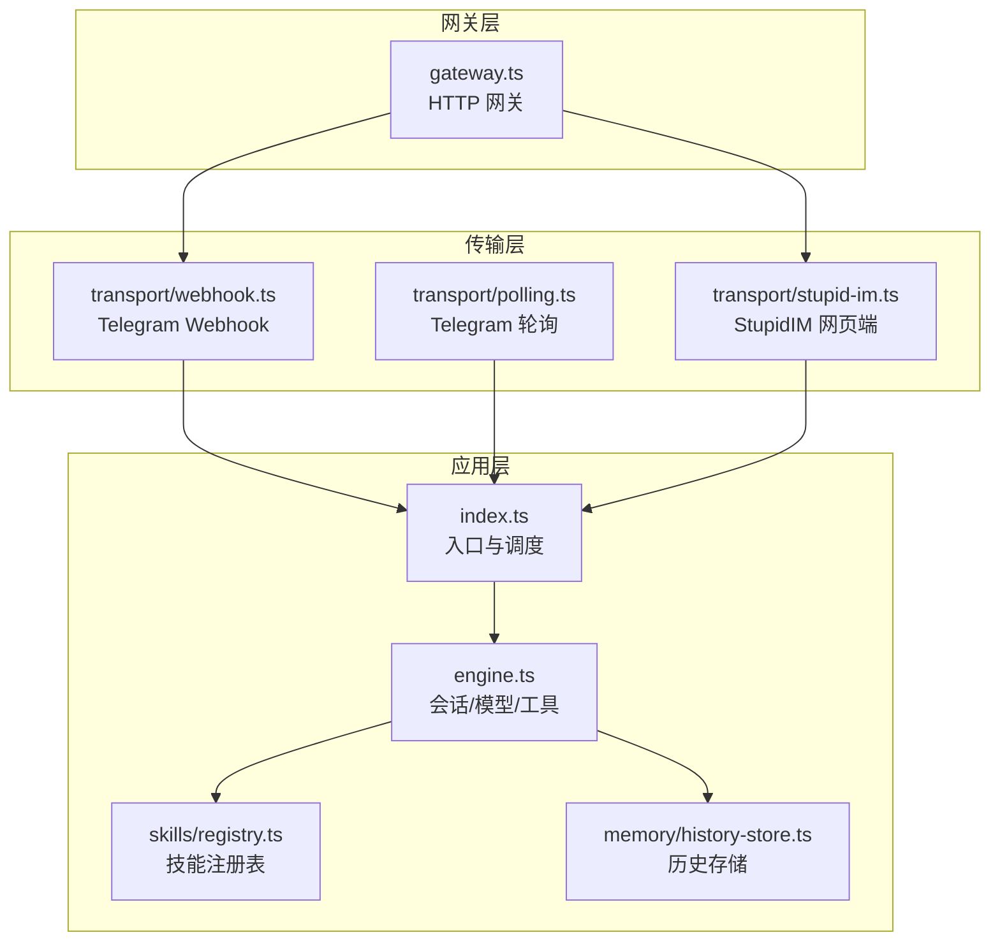
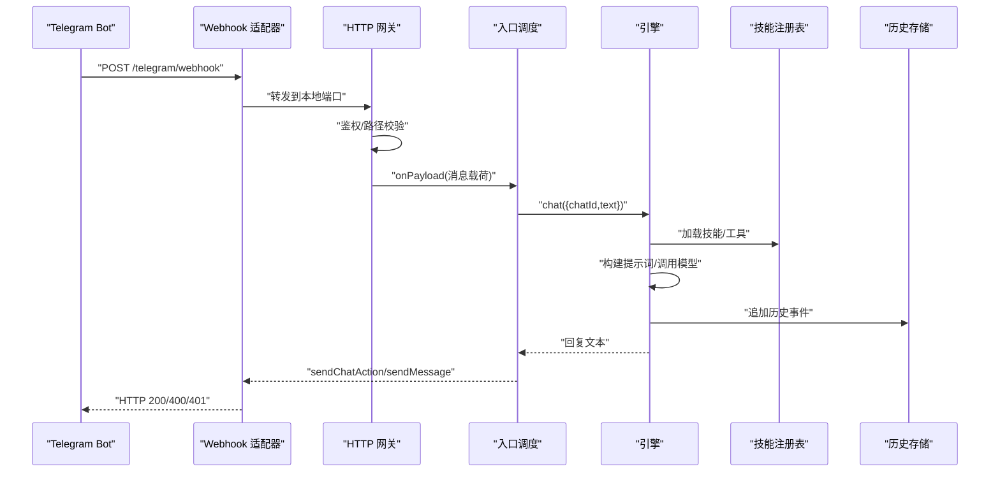
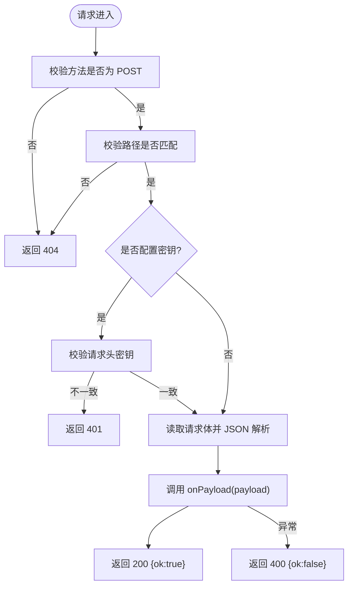
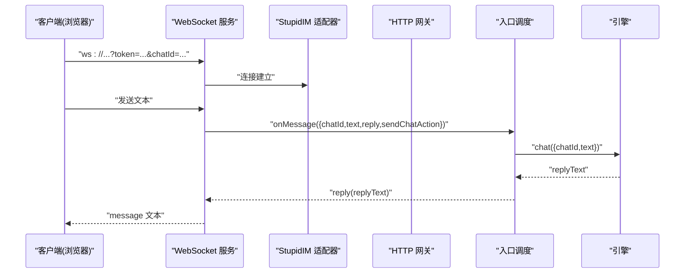
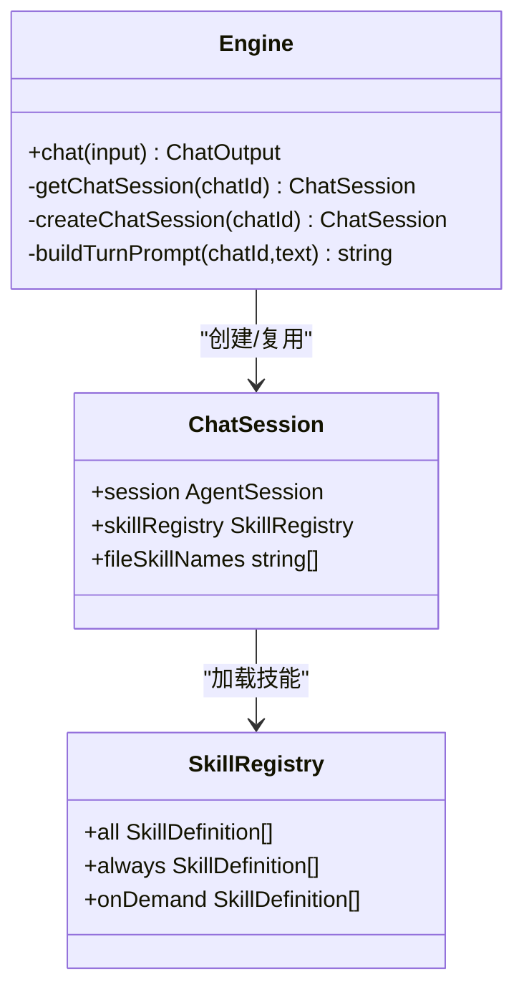
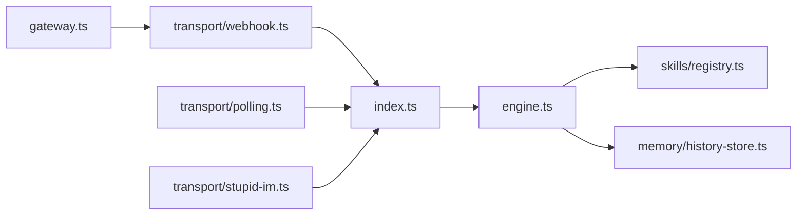
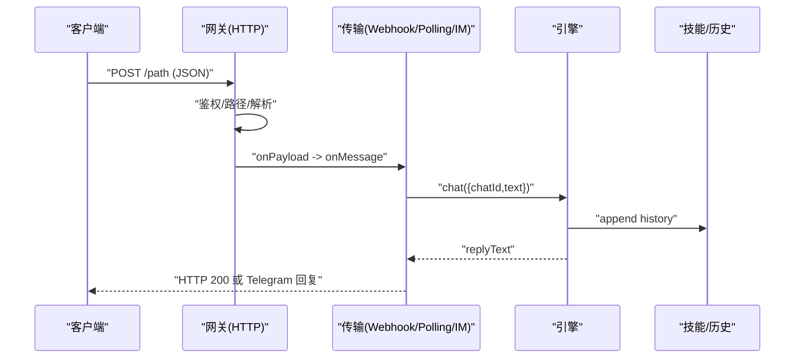

# 网关 API

<cite>
**本文档引用的文件**
- [gateway.ts](file://src/gateway.ts)
- [webhook.ts](file://src/transport/webhook.ts)
- [polling.ts](file://src/transport/polling.ts)
- [stupid-im.ts](file://src/transport/stupid-im.ts)
- [index.ts](file://src/index.ts)
- [engine.ts](file://src/engine.ts)
- [registry.ts](file://src/skills/registry.ts)
- [history-store.ts](file://src/memory/history-store.ts)
- [package.json](file://package.json)
- [README.md](file://README.md)
- [im.html](file://public/im.html)
</cite>

## 目录
1. [简介](#简介)
2. [项目结构](#项目结构)
3. [核心组件](#核心组件)
4. [架构总览](#架构总览)
5. [详细组件分析](#详细组件分析)
6. [依赖关系分析](#依赖关系分析)
7. [性能考虑](#性能考虑)
8. [故障排查指南](#故障排查指南)
9. [结论](#结论)
10. [附录](#附录)

## 简介
本文件面向“网关 API”的综合技术文档，聚焦于：
- 请求入口与路由：HTTP 网关如何接收外部推送（轮询/Webhook），以及内置网页端 IM 的接入方式
- 会话管理：如何基于 chatId 维护会话状态，以及与引擎层的交互
- 模型调用：如何将消息转为系统提示词并驱动底层模型推理
- 中间件机制：网关层的 GET/POST 路由、鉴权与回调扩展点
- 错误传播：从网关到引擎再到上游传输层的错误处理与返回
- 数据格式转换：消息体解析、上下文注入、响应聚合
- 配置与调优：端口、路径、密钥、调试开关等
- 扩展开发：如何新增网关回调、自定义中间件与传输适配器
- 高并发与限流：当前实现的局限与建议

## 项目结构
网关 API 的核心位于独立模块中，并通过传输层与引擎层协作：
- 网关层：HTTP 服务器封装与回调接口
- 传输层：Telegram 轮询/Webhook 与 StupidIM 网页端
- 引擎层：会话管理、工具注册、模型选择与调用
- 辅助模块：历史存储、技能注册表等

**图表来源**
- [gateway.ts:27-78](file://src/gateway.ts#L27-L78)
- [webhook.ts:41-85](file://src/transport/webhook.ts#L41-L85)
- [polling.ts:19-89](file://src/transport/polling.ts#L19-L89)
- [stupid-im.ts:24-104](file://src/transport/stupid-im.ts#L24-L104)
- [index.ts:112-209](file://src/index.ts#L112-L209)
- [engine.ts:392-475](file://src/engine.ts#L392-L475)
- [registry.ts:23-54](file://src/skills/registry.ts#L23-L54)
- [history-store.ts:37-42](file://src/memory/history-store.ts#L37-L42)

**章节来源**
- [README.md:22-52](file://README.md#L22-L52)
- [package.json:1-39](file://package.json#L1-L39)

## 核心组件
- 网关 HTTP 服务器：提供统一的 POST 路由入口，支持可选的 GET 中间件与鉴权头校验
- 传输适配器：Telegram 轮询与 Webhook，以及 StupidIM 网页端 WebSocket
- 引擎：会话生命周期管理、工具注册、模型选择与调用、历史事件记录
- 技能注册表：内置技能与文件类技能的动态装载与暴露控制
- 历史存储：按日期切分的 JSONL 记录，支持查询与追加

**章节来源**
- [gateway.ts:7-14](file://src/gateway.ts#L7-L14)
- [webhook.ts:41-85](file://src/transport/webhook.ts#L41-L85)
- [polling.ts:1-243](file://src/transport/polling.ts#L1-L243)
- [stupid-im.ts:1-105](file://src/transport/stupid-im.ts#L1-L105)
- [engine.ts:19-706](file://src/engine.ts#L19-L706)
- [registry.ts:13-54](file://src/skills/registry.ts#L13-L54)
- [history-store.ts:8-82](file://src/memory/history-store.ts#L8-L82)

## 架构总览
网关作为统一入口，接收来自 Telegram Webhook 或 StupidIM 的消息，解码为内部消息对象，交由引擎进行会话与模型调用，最终通过传输层回复。

**图表来源**
- [webhook.ts:58-84](file://src/transport/webhook.ts#L58-L84)
- [gateway.ts:27-78](file://src/gateway.ts#L27-L78)
- [index.ts:188-208](file://src/index.ts#L188-L208)
- [engine.ts:680-705](file://src/engine.ts#L680-L705)
- [polling.ts:215-242](file://src/transport/polling.ts#L215-L242)

## 详细组件分析

### 网关 HTTP 服务器（gateway.ts）
- 功能要点
  - 创建 HTTP 服务器，支持 GET 中间件回调（用于嵌入网页端 IM）
  - 严格校验请求方法与路径，非 POST 或路径不符返回 404
  - 可选密钥校验：通过请求头 X-Telegram-Bot-API-Secret-Token
  - 读取原始请求体，JSON 解析后调用 onPayload 回调
  - 统一返回 JSON { ok: boolean }，异常时返回 400
- 扩展点
  - onGet：允许在 POST 之外提供静态资源或健康检查
  - onServerCreated：拿到原生 HTTP Server 实例，便于挂载额外服务（如 StupidIM）

**图表来源**
- [gateway.ts:27-78](file://src/gateway.ts#L27-L78)

**章节来源**
- [gateway.ts:7-14](file://src/gateway.ts#L7-L14)
- [gateway.ts:27-78](file://src/gateway.ts#L27-L78)

### 传输适配器（Telegram 轮询与 Webhook）
- 轮询模式（polling.ts）
  - 拉取更新、过滤消息、拆分长文本、发送 HTML/纯文本回退
  - 提供 sendChatAction 以模拟“正在输入”
- Webhook 模式（webhook.ts）
  - 注册 Webhook，启动网关，转发消息到 onMessage
  - 支持与 StupidIM 共存：onServerCreated 钩子挂载 WebSocket 服务
- StupidIM 网页端（stupid-im.ts）
  - 提供静态页面与 WebSocket 服务，URL 参数含 token/chatId/url
  - 通过 onMessage 回调与引擎交互，支持 typing 指示

**图表来源**
- [stupid-im.ts:65-103](file://src/transport/stupid-im.ts#L65-L103)
- [webhook.ts:58-84](file://src/transport/webhook.ts#L58-L84)
- [gateway.ts:27-78](file://src/gateway.ts#L27-L78)
- [index.ts:188-208](file://src/index.ts#L188-L208)

**章节来源**
- [polling.ts:52-89](file://src/transport/polling.ts#L52-L89)
- [polling.ts:215-242](file://src/transport/polling.ts#L215-L242)
- [webhook.ts:41-85](file://src/transport/webhook.ts#L41-L85)
- [stupid-im.ts:24-104](file://src/transport/stupid-im.ts#L24-L104)
- [im.html:240-427](file://public/im.html#L240-L427)

### 引擎与会话管理（engine.ts）
- 会话生命周期
  - 以 chatId 为键缓存 AgentSession，首次创建后复用
  - 加载技能与文件技能，构建系统提示词，注入运行时上下文与 profile
- 模型选择
  - 依据环境变量选择模型，支持多种提供商与自定义 OpenAI/Anthropic 兼容接口
  - 若缺 Key，进行友好错误归一化提示
- 输出处理
  - 流式文本增量合并，必要时回退至最新助手消息
  - 记录工具调用与结果到历史存储

**图表来源**
- [engine.ts:19-706](file://src/engine.ts#L19-L706)
- [registry.ts:13-54](file://src/skills/registry.ts#L13-L54)

**章节来源**
- [engine.ts:392-475](file://src/engine.ts#L392-L475)
- [engine.ts:484-509](file://src/engine.ts#L484-L509)
- [engine.ts:680-705](file://src/engine.ts#L680-L705)
- [history-store.ts:37-42](file://src/memory/history-store.ts#L37-L42)

### 历史存储与上下文
- 历史事件结构：包含时间戳、chatId、角色、事件类型、文本/工具名/参数/结果等
- 按日期切分文件，支持查询与追加
- 引擎在用户消息与助手回复前后追加事件，便于审计与重放

**章节来源**
- [history-store.ts:8-82](file://src/memory/history-store.ts#L8-L82)
- [engine.ts:682-702](file://src/engine.ts#L682-L702)

## 依赖关系分析
- 网关依赖传输层（webhook.ts）启动，后者依赖网关的回调接口
- 引擎依赖技能注册表与历史存储
- 入口调度负责组装消息对象并调用引擎

**图表来源**
- [gateway.ts:27-78](file://src/gateway.ts#L27-L78)
- [webhook.ts:41-85](file://src/transport/webhook.ts#L41-L85)
- [polling.ts:19-89](file://src/transport/polling.ts#L19-L89)
- [stupid-im.ts:24-104](file://src/transport/stupid-im.ts#L24-L104)
- [index.ts:188-208](file://src/index.ts#L188-L208)
- [engine.ts:422-458](file://src/engine.ts#L422-L458)
- [registry.ts:23-54](file://src/skills/registry.ts#L23-L54)
- [history-store.ts:37-42](file://src/memory/history-store.ts#L37-L42)

**章节来源**
- [package.json:30-37](file://package.json#L30-L37)

## 性能考虑
- 并发模型
  - 网关采用单进程 HTTP 服务器，无内置连接池/限流
  - Telegram 轮询为同步拉取，长轮询超时与断线重试
  - StupidIM 使用 WebSocket，单连接串行处理
- 建议
  - 在反向代理后部署，利用其连接复用与限流能力
  - 对外暴露的 Webhook 路径应配合 Nginx/LNMP 层限速与熔断
  - 控制消息长度与工具调用频率，避免长耗时操作阻塞
  - 引擎层会话复用减少模型初始化成本，合理设置内存上限

[本节为通用性能建议，不直接分析具体文件]

## 故障排查指南
- 常见错误与定位
  - 404：请求方法非 POST 或路径不匹配
  - 401：Webhook 密钥不一致（X-Telegram-Bot-API-Secret-Token）
  - 400：请求体非合法 JSON 或解析失败
  - 409/删除 Webhook：轮询与 Webhook 冲突，需禁用一方
- 引擎错误
  - API Key 缺失或无效：根据模型提供商给出明确提示
  - 模型不可用：检查 .env 中对应 KEY 与模型拼写
- 日志与调试
  - 启用 DEBUG_STUPIDCLAW 与 DEBUG_PROMPT 查看运行时配置与提示词
  - StupidIM 页面提供连接状态指示与错误提示

**章节来源**
- [gateway.ts:40-64](file://src/gateway.ts#L40-L64)
- [polling.ts:21-34](file://src/transport/polling.ts#L21-L34)
- [engine.ts:162-186](file://src/engine.ts#L162-L186)
- [engine.ts:620-638](file://src/engine.ts#L620-L638)

## 结论
网关 API 以简洁的 HTTP 服务器为核心，结合传输层适配器与引擎层会话/模型能力，形成“统一入口 + 可插拔传输 + 可扩展工具”的架构。当前实现偏向单进程与同步处理，适合小规模部署与开发验证；生产环境建议配合反向代理与限流策略，同时优化工具调用与消息长度控制。

[本节为总结性内容，不直接分析具体文件]

## 附录

### 配置项与环境变量
- 网关与传输
  - PORT：服务端口（默认 8080/8787）
  - TELEGRAM_MODE：polling 或 webhook
  - TELEGRAM_WEBHOOK_URL：Webhook 回调地址
  - TELEGRAM_WEBHOOK_PATH：Webhook 路径（默认 /telegram/webhook）
  - TELEGRAM_WEBHOOK_SECRET：Webhook 密钥头
  - TELEGRAM_BOT_TOKEN：Telegram Bot Token
- 模型与提供商
  - STUPID_MODEL：provider:model_id 或 provider:model_id
  - 各提供商 API Key：如 OPENAI_API_KEY、MINIMAX_API_KEY 等
  - 自定义兼容：CUSTOM_OPENAI_BASE_URL/API_KEY、CUSTOM_ANTHROPIC_BASE_URL/API_KEY
- 网页端 IM
  - STUPID_IM_TOKEN：访问密钥
  - STUPID_IM_CHAT_ID：默认 chatId（可选）
- 调试
  - DEBUG_STUPIDCLAW：启用引擎调试日志
  - DEBUG_PROMPT：启用提示词调试日志

**章节来源**
- [webhook.ts:45-55](file://src/transport/webhook.ts#L45-L55)
- [engine.ts:39-57](file://src/engine.ts#L39-L57)
- [engine.ts:246-383](file://src/engine.ts#L246-L383)
- [init.ts:184-222](file://src/init.ts#L184-L222)

### 请求处理流程（端到端）

**图表来源**
- [gateway.ts:27-78](file://src/gateway.ts#L27-L78)
- [webhook.ts:71-84](file://src/transport/webhook.ts#L71-L84)
- [polling.ts:215-242](file://src/transport/polling.ts#L215-L242)
- [engine.ts:680-705](file://src/engine.ts#L680-L705)
- [history-store.ts:37-42](file://src/memory/history-store.ts#L37-L42)

### 扩展开发指南
- 新增传输适配器
  - 参考 webhook.ts 的 startGateway 调用方式与 onPayload/onGet/onServerCreated 回调
  - 在 index.ts 中通过 startTransport 注册
- 自定义中间件
  - 在 onGet 中处理静态资源或健康检查
  - 在 onServerCreated 中挂载额外 HTTP 路由或 WebSocket 服务
- 会话与模型扩展
  - 通过技能注册表添加自定义工具
  - 在引擎层调整系统提示词与上下文注入逻辑

**章节来源**
- [webhook.ts:58-84](file://src/transport/webhook.ts#L58-L84)
- [stupid-im.ts:24-50](file://src/transport/stupid-im.ts#L24-L50)
- [index.ts:188-208](file://src/index.ts#L188-L208)
- [registry.ts:23-54](file://src/skills/registry.ts#L23-L54)