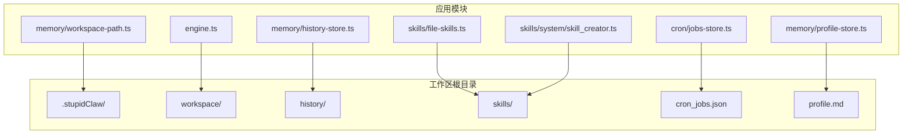
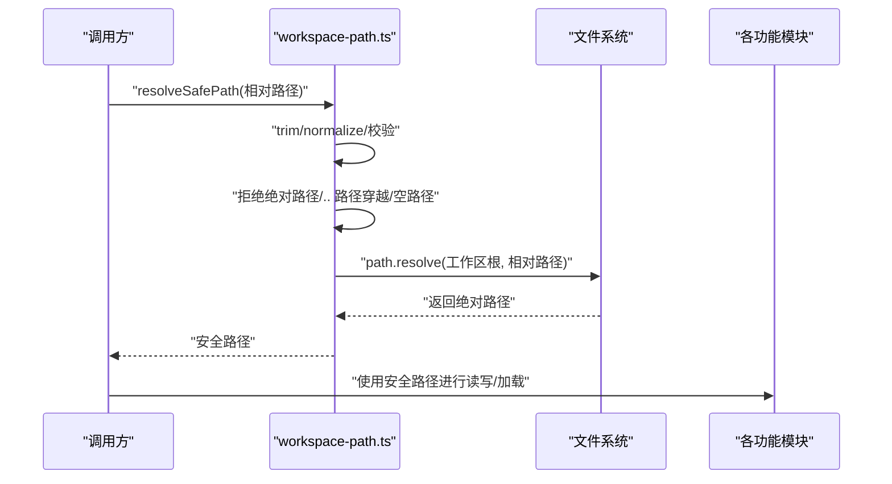
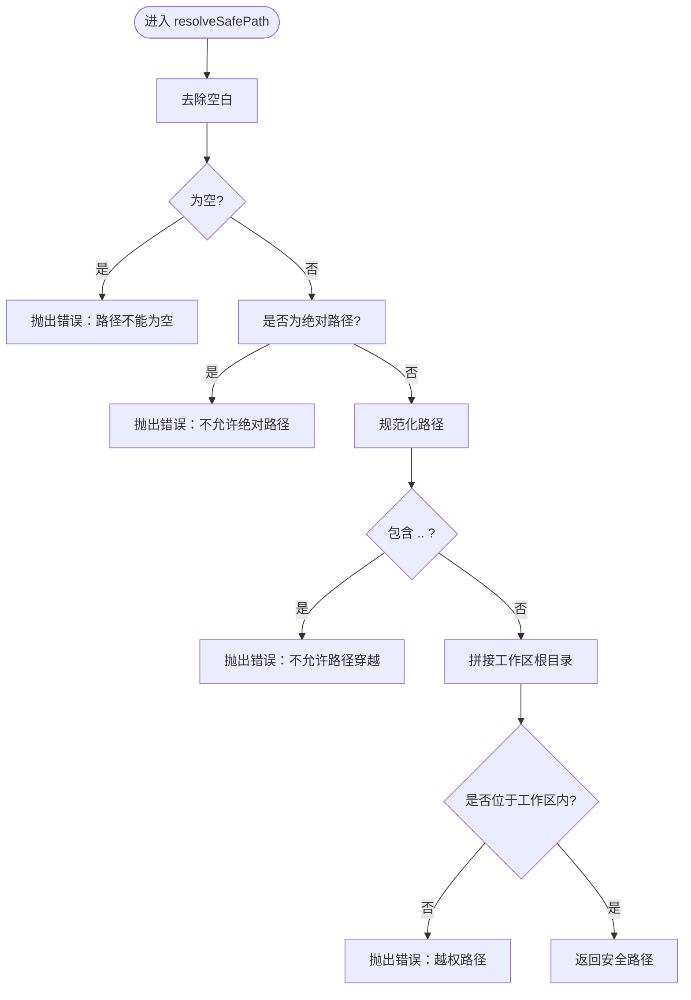
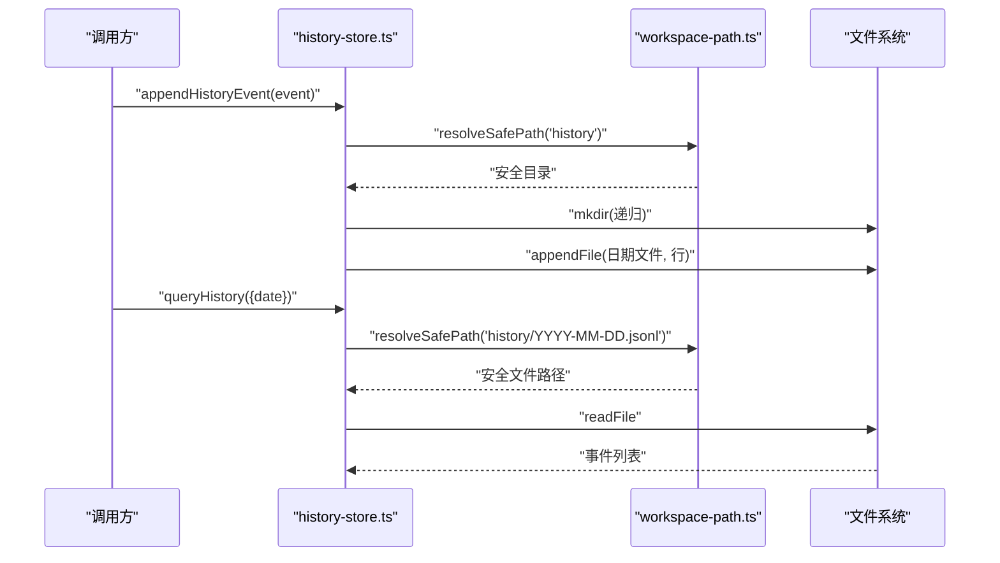
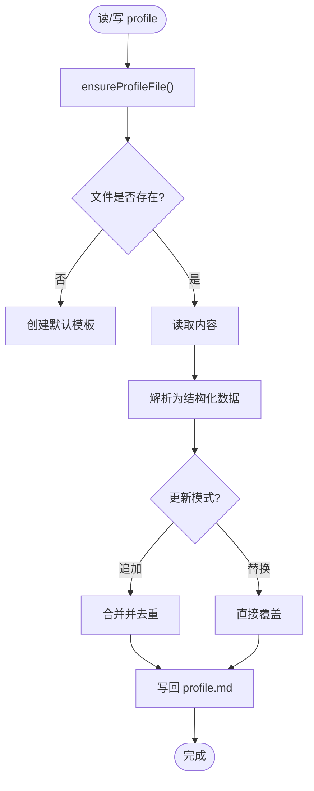
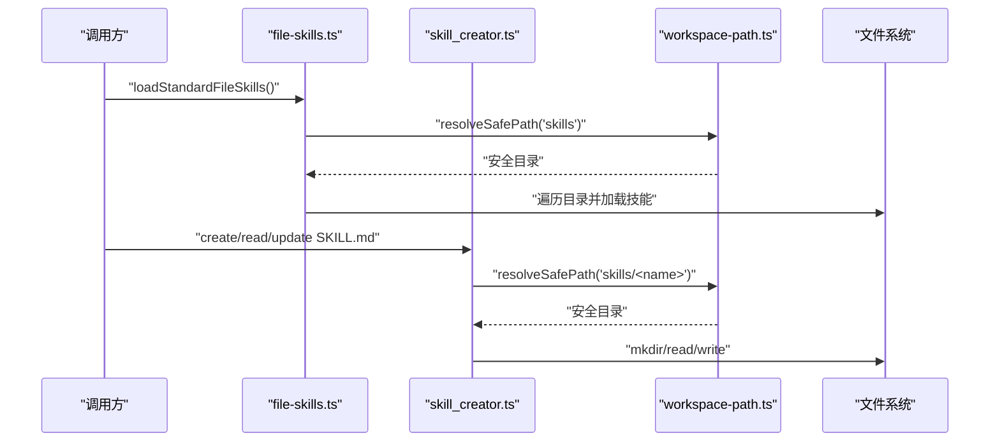
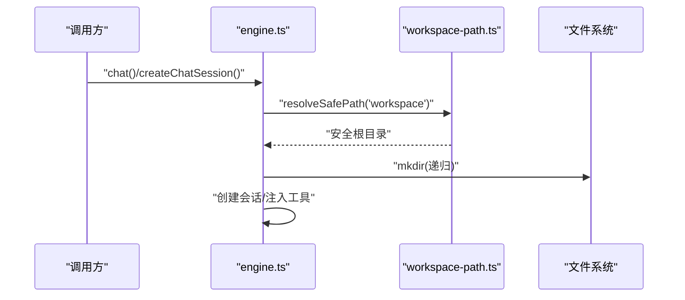
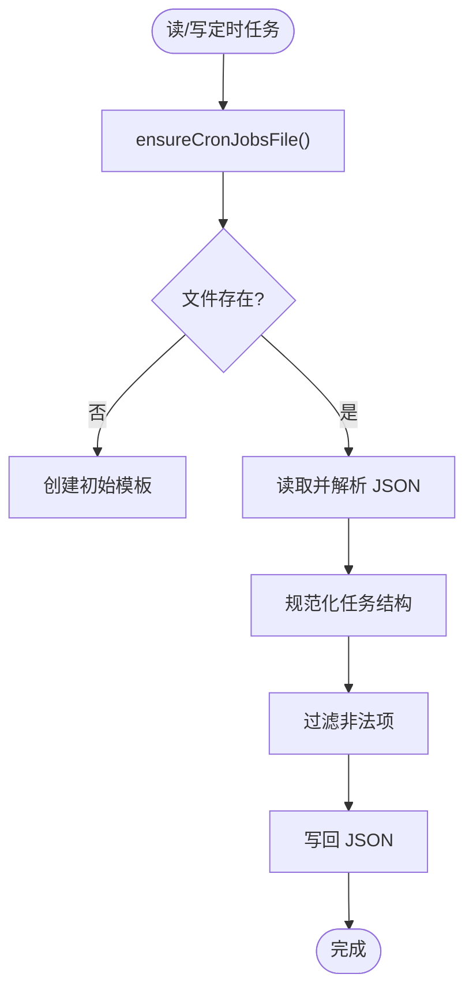
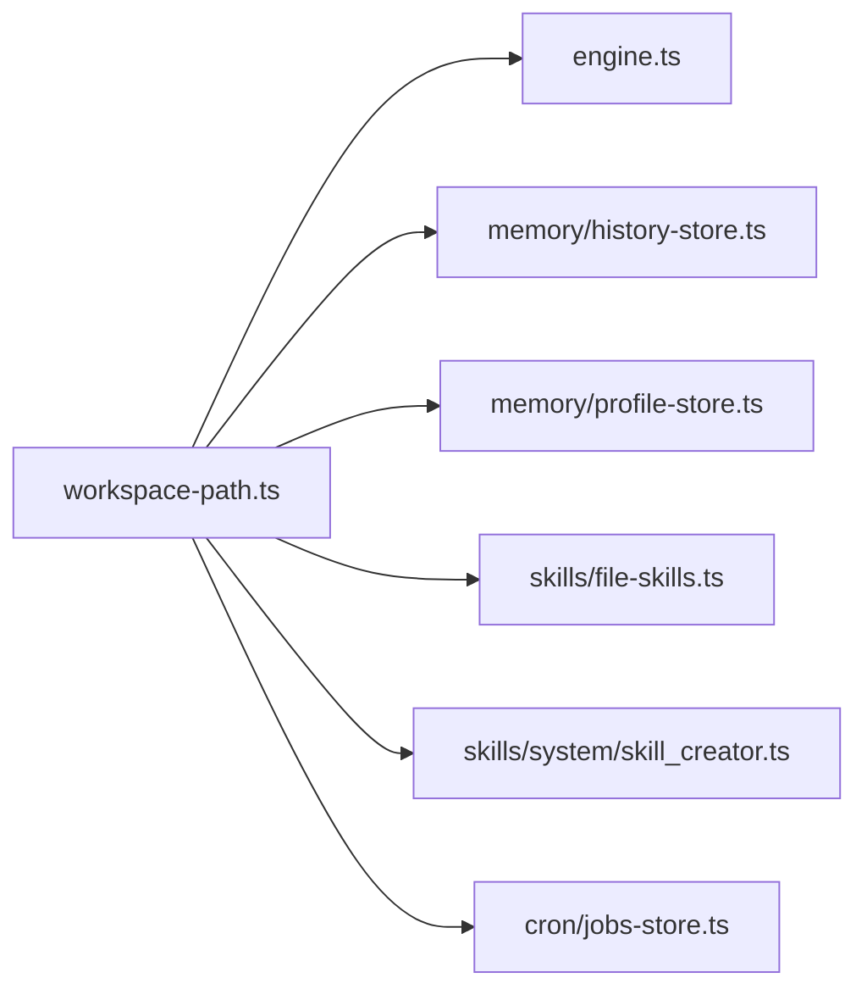

# 安全与沙盒机制

<cite>
**本文档引用的文件**
- [workspace-path.ts](file://src/memory/workspace-path.ts)
- [workspace-path.test.ts](file://src/memory/workspace-path.test.ts)
- [history-store.ts](file://src/memory/history-store.ts)
- [profile-store.ts](file://src/memory/profile-store.ts)
- [file-skills.ts](file://src/skills/file-skills.ts)
- [skill_creator.ts](file://src/skills/system/skill_creator.ts)
- [jobs-store.ts](file://src/cron/jobs-store.ts)
- [engine.ts](file://src/engine.ts)
- [StupidClaw-第5期-安全沙盒PathJailing防止越权读写.md](file://StupidClaw-第5期-安全沙盒PathJailing防止越权读写.md)
- [StupidClaw-详细设计文档-v3.md](file://StupidClaw-详细设计文档-v3.md)
- [package.json](file://package.json)
- [models.md](file://docs/models.md)
- [getting-started.md](file://docs/getting-started.md)
</cite>

## 目录
1. [简介](#简介)
2. [项目结构](#项目结构)
3. [核心组件](#核心组件)
4. [架构总览](#架构总览)
5. [详细组件分析](#详细组件分析)
6. [依赖关系分析](#依赖关系分析)
7. [性能考量](#性能考量)
8. [故障排查指南](#故障排查指南)
9. [结论](#结论)
10. [附录](#附录)

## 简介
本文件系统性阐述 StupidClaw 的安全与沙盒机制，重点围绕“路径沙盒（Path Jailing）”展开，解释如何通过严格的路径限制与统一的路径解析入口，防止 AI 代理越权读写宿主文件系统。文档涵盖：
- 路径沙盒的设计原则与实现细节
- 工作区路径控制与访问控制
- 权限检查与安全边界
- 安全最佳实践与配置指南
- 安全审计与测试方法
- 与传统安全机制的差异与优势
- 开发者安全编程指导

## 项目结构
StupidClaw 将所有与“项目内文件落盘”相关的路径统一收敛至工作区根目录（默认为项目根下的“.stupidClaw”），并通过单一安全路径解析模块集中校验与生成最终路径，从而在源头杜绝路径穿越与越权访问。

图示来源
- [engine.ts:37](file://src/engine.ts#L37)
- [history-store.ts:20](file://src/memory/history-store.ts#L20)
- [profile-store.ts:18](file://src/memory/profile-store.ts#L18)
- [file-skills.ts:17](file://src/skills/file-skills.ts#L17)
- [skill_creator.ts:7](file://src/skills/system/skill_creator.ts#L7)
- [jobs-store.ts:27](file://src/cron/jobs-store.ts#L27)
- [workspace-path.ts:4](file://src/memory/workspace-path.ts#L4)

章节来源
- [StupidClaw-第5期-安全沙盒PathJailing防止越权读写.md:34-47](file://StupidClaw-第5期-安全沙盒PathJailing防止越权读写.md#L34-L47)
- [StupidClaw-详细设计文档-v3.md:149-170](file://StupidClaw-详细设计文档-v3.md#L149-L170)

## 核心组件
- 路径沙盒核心模块：提供统一的安全路径解析与工作区根目录管理
- 记忆与历史模块：历史记录与长期记忆文件均通过安全路径解析写入
- 技能系统模块：技能文件加载与创建均受路径沙盒约束
- 引擎模块：工作区根目录统一收敛至安全路径
- 定时任务模块：定时任务配置文件通过安全路径解析读写

章节来源
- [workspace-path.ts:1-42](file://src/memory/workspace-path.ts#L1-L42)
- [history-store.ts:1-83](file://src/memory/history-store.ts#L1-L83)
- [profile-store.ts:1-132](file://src/memory/profile-store.ts#L1-L132)
- [file-skills.ts:1-65](file://src/skills/file-skills.ts#L1-L65)
- [skill_creator.ts:1-312](file://src/skills/system/skill_creator.ts#L1-L312)
- [engine.ts:37](file://src/engine.ts#L37)
- [jobs-store.ts:1-151](file://src/cron/jobs-store.ts#L1-L151)

## 架构总览
路径沙盒在系统中的作用链路如下：

图示来源
- [workspace-path.ts:6-35](file://src/memory/workspace-path.ts#L6-L35)
- [engine.ts:37](file://src/engine.ts#L37)
- [history-store.ts:20](file://src/memory/history-store.ts#L20)
- [profile-store.ts:18](file://src/memory/profile-store.ts#L18)
- [file-skills.ts:17](file://src/skills/file-skills.ts#L17)
- [skill_creator.ts:7](file://src/skills/system/skill_creator.ts#L7)
- [jobs-store.ts:27](file://src/cron/jobs-store.ts#L27)

## 详细组件分析

### 路径沙盒核心模块（workspace-path.ts）
- 工作区根目录：以项目当前工作目录为基础，固定为“.stupidClaw”
- 安全路径解析：
  - 去除空白并拒绝空路径
  - 拒绝绝对路径
  - 规范化路径并拒绝包含“..”的路径
  - 通过“路径拼接 + 前缀校验”确保最终路径位于工作区内
- 工具函数：
  - 获取工作区根路径
  - 解析安全路径
  - 确保工作区目录存在（含子目录）

图示来源
- [workspace-path.ts:6-35](file://src/memory/workspace-path.ts#L6-L35)

章节来源
- [workspace-path.ts:1-42](file://src/memory/workspace-path.ts#L1-L42)
- [workspace-path.test.ts:1-29](file://src/memory/workspace-path.test.ts#L1-L29)
- [StupidClaw-第5期-安全沙盒PathJailing防止越权读写.md:53-67](file://StupidClaw-第5期-安全沙盒PathJailing防止越权读写.md#L53-L67)

### 历史记录模块（history-store.ts）
- 历史目录：统一通过安全路径解析生成
- 文件命名：按 UTC 日期生成“YYYY-MM-DD.jsonl”
- 写入与查询：
  - 追加写入事件行
  - 查询时按日期定位文件，限定数量，异常时按“文件不存在”处理

图示来源
- [history-store.ts:20](file://src/memory/history-store.ts#L20)
- [history-store.ts:37-42](file://src/memory/history-store.ts#L37-L42)
- [history-store.ts:54](file://src/memory/history-store.ts#L54)
- [history-store.ts:72-82](file://src/memory/history-store.ts#L72-L82)

章节来源
- [history-store.ts:1-83](file://src/memory/history-store.ts#L1-L83)

### 长期记忆模块（profile-store.ts）
- 配置文件：profile.md 统一通过安全路径解析生成
- 初始化：若文件不存在则创建默认模板
- 更新策略：支持追加或替换，去重与规范化

图示来源
- [profile-store.ts:103-110](file://src/memory/profile-store.ts#L103-L110)
- [profile-store.ts:117-131](file://src/memory/profile-store.ts#L117-L131)

章节来源
- [profile-store.ts:1-132](file://src/memory/profile-store.ts#L1-L132)

### 技能系统模块（file-skills.ts 与 skill_creator.ts）
- 技能目录：统一通过安全路径解析生成
- 技能加载：遍历项目技能目录与内置技能目录，避免重复
- 技能创建：创建新技能目录与 SKILL.md，严格遵循安全路径

图示来源
- [file-skills.ts:15-24](file://src/skills/file-skills.ts#L15-L24)
- [file-skills.ts:26-48](file://src/skills/file-skills.ts#L26-L48)
- [skill_creator.ts:7](file://src/skills/system/skill_creator.ts#L7)
- [skill_creator.ts:149-150](file://src/skills/system/skill_creator.ts#L149-L150)
- [skill_creator.ts:214-220](file://src/skills/system/skill_creator.ts#L214-L220)

章节来源
- [file-skills.ts:1-65](file://src/skills/file-skills.ts#L1-L65)
- [skill_creator.ts:1-312](file://src/skills/system/skill_creator.ts#L1-L312)

### 引擎模块（engine.ts）
- 工作区根：统一通过安全路径解析生成
- 初始化：创建工作区根目录，注入工具与资源
- 会话：将安全工作区根传递给底层编码工具

图示来源
- [engine.ts:37](file://src/engine.ts#L37)
- [engine.ts:421](file://src/engine.ts#L421)

章节来源
- [engine.ts:1-706](file://src/engine.ts#L1-L706)

### 定时任务模块（jobs-store.ts）
- 配置文件：cron_jobs.json 通过安全路径解析读写
- 数据校验：对任务结构进行规范化与过滤
- 文件保障：若不存在则创建初始模板

图示来源
- [jobs-store.ts:115-122](file://src/cron/jobs-store.ts#L115-L122)
- [jobs-store.ts:124-142](file://src/cron/jobs-store.ts#L124-L142)

章节来源
- [jobs-store.ts:1-151](file://src/cron/jobs-store.ts#L1-L151)

## 依赖关系分析
- 统一依赖：各模块仅依赖 workspace-path.ts 提供的安全路径解析能力
- 依赖方向：从上层模块到安全路径模块，形成单向依赖
- 风险隔离：任何模块的路径输入都会被安全路径模块拦截，避免越权

图示来源
- [engine.ts:14](file://src/engine.ts#L14)
- [history-store.ts:3](file://src/memory/history-store.ts#L3)
- [profile-store.ts:2](file://src/memory/profile-store.ts#L2)
- [file-skills.ts:8](file://src/skills/file-skills.ts#L8)
- [skill_creator.ts:4](file://src/skills/system/skill_creator.ts#L4)
- [jobs-store.ts:2](file://src/cron/jobs-store.ts#L2)

章节来源
- [package.json:14-21](file://package.json#L14-L21)

## 性能考量
- 路径解析成本极低：仅涉及字符串处理与一次路径拼接，对整体性能影响可忽略
- I/O 成本主导：历史记录与技能文件的读写是主要性能瓶颈，建议：
  - 合理控制历史文件数量与大小
  - 技能文件尽量采用轻量模板
  - 使用异步读写与必要的缓存策略（如适用）

## 故障排查指南
- 常见错误与定位
  - “路径不能为空”：检查调用方传入的路径是否为空或仅空白字符
  - “不允许绝对路径”：检查是否传入了以“/”开头的绝对路径
  - “不允许路径穿越”：检查是否包含“..”片段
  - “越权路径”：确认最终路径是否位于工作区根目录之下
- 调试开关
  - 开启引擎调试日志：设置环境变量以输出详细运行信息
  - 开启 Prompt 调试：打印完整 Prompt 以便核对工具与技能描述
- 配置检查
  - 确认模型与 API Key 配置正确
  - 确认工作区根目录存在且具备读写权限

章节来源
- [StupidClaw-第5期-安全沙盒PathJailing防止越权读写.md:81-87](file://StupidClaw-第5期-安全沙盒PathJailing防止越权读写.md#L81-L87)
- [StupidClaw-详细设计文档-v3.md:149-170](file://StupidClaw-详细设计文档-v3.md#L149-L170)
- [getting-started.md:97-112](file://docs/getting-started.md#L97-L112)
- [models.md:55-100](file://docs/models.md#L55-L100)

## 结论
StupidClaw 的安全与沙盒机制以“路径沙盒（Path Jailing）”为核心，通过“一处定义、处处复用”的安全路径解析策略，将所有项目内文件落盘路径统一收敛至工作区根目录，并在路径解析阶段严格执行“禁止绝对路径、禁止路径穿越、禁止空路径、最终必须在工作区内”的不变量。该方案简单可靠、易于维护，适合本地单用户场景，有效防止 AI 代理越权读写宿主文件系统。对于更复杂的多租户或高安全等级场景，可在现有基础上扩展细粒度权限与审计能力。

## 附录

### 安全配置指南
- 工作区根目录：默认为项目根下的“.stupidClaw”，可通过安全路径解析统一生成
- 环境变量与模型配置：参考模型配置指南，确保 API Key 与模型选择正确
- 调试与日志：合理使用调试开关以辅助问题定位

章节来源
- [StupidClaw-详细设计文档-v3.md:149-170](file://StupidClaw-详细设计文档-v3.md#L149-L170)
- [models.md:55-100](file://docs/models.md#L55-L100)

### 安全审计方法
- 路径合规性审计：对所有调用方传入的路径进行静态与动态检查，确保符合安全路径规则
- 文件访问审计：记录关键文件的读写操作（路径、时间、调用方），便于回溯
- 配置审计：定期核对模型与 API Key 配置，确保未被误改

### 安全测试与验证示例
- 单元测试覆盖：
  - 合法相对路径解析：确保解析结果位于工作区根目录下
  - 路径穿越拒绝：断言包含“..”的路径被拒绝
  - 绝对路径拒绝：断言以“/”开头的路径被拒绝
  - 空路径拒绝：断言空字符串或仅空白字符被拒绝
- 集成测试覆盖：
  - 历史记录写入与查询：验证按日期生成文件并正确读取
  - 技能文件创建与读取：验证在安全路径下创建与读取 SKILL.md
  - 定时任务读写：验证配置文件在安全路径下读写

章节来源
- [workspace-path.test.ts:6-28](file://src/memory/workspace-path.test.ts#L6-L28)
- [history-store.ts:37-82](file://src/memory/history-store.ts#L37-L82)
- [skill_creator.ts:153-181](file://src/skills/system/skill_creator.ts#L153-L181)
- [jobs-store.ts:124-142](file://src/cron/jobs-store.ts#L124-L142)

### 与传统安全机制的区别与优势
- 区别：传统机制常采用 ACL、白名单 DSL、策略引擎等复杂方案；StupidClaw 采用“统一路径解析 + 硬拒绝越界”的轻量策略
- 优势：
  - 实现简单、维护成本低
  - 不易误配，边界清晰
  - 适合本地单用户、教程场景
  - 可平滑演进到更精细的权限体系

章节来源
- [StupidClaw-第5期-安全沙盒PathJailing防止越权读写.md:91-101](file://StupidClaw-第5期-安全沙盒PathJailing防止越权读写.md#L91-L101)

### 开发者安全编程指导与规范
- 始终使用安全路径解析：任何涉及文件落盘的路径必须通过安全路径解析生成
- 严禁直接拼接路径：避免在业务代码中直接拼接绝对路径或包含“..”的路径
- 严格输入校验：对来自外部的路径输入进行严格校验与清理
- 最小权限原则：仅授予必要的文件系统权限，避免过度授权
- 审计与监控：对关键文件的访问进行记录，建立审计与告警机制

章节来源
- [StupidClaw-第5期-安全沙盒PathJailing防止越权读写.md:53-80](file://StupidClaw-第5期-安全沙盒PathJailing防止越权读写.md#L53-L80)
- [workspace-path.ts:6-35](file://src/memory/workspace-path.ts#L6-L35)