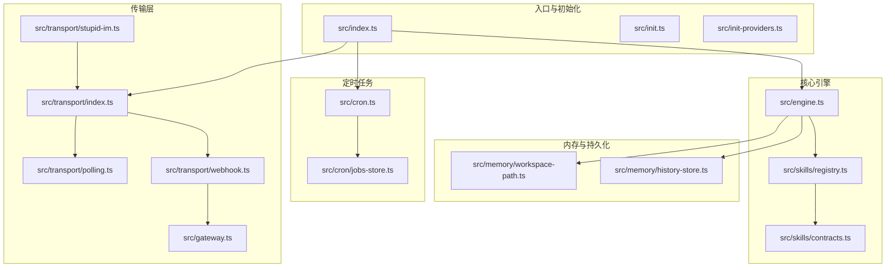
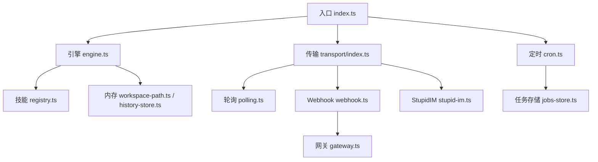
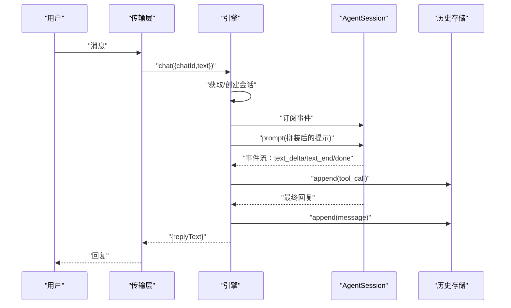
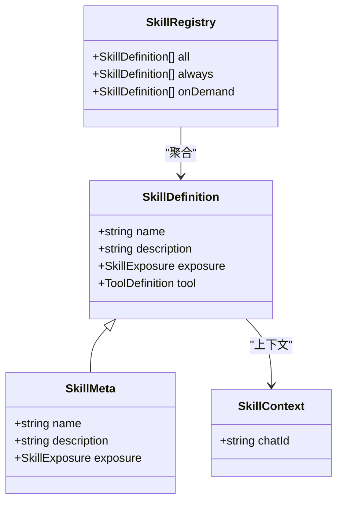
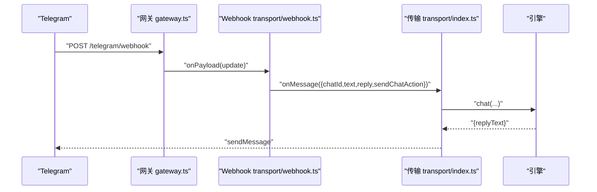
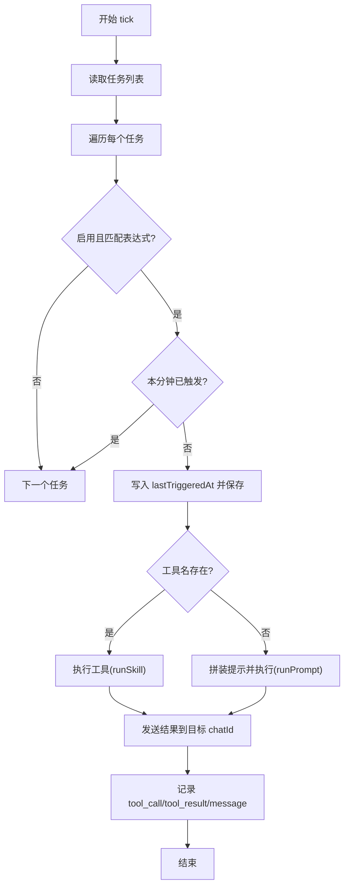
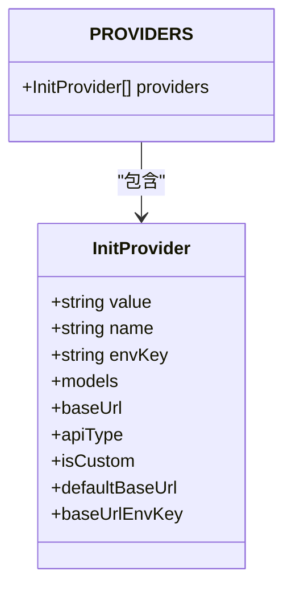
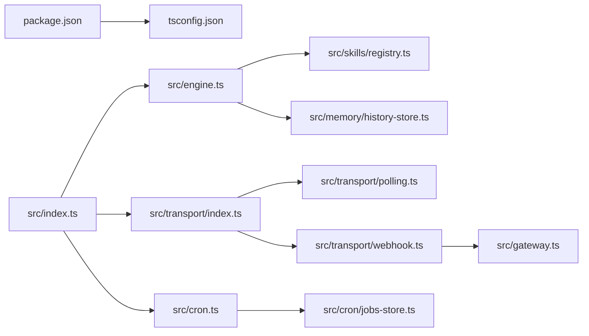

# 代码规范

<cite>
**本文引用的文件**
- [package.json](file://package.json)
- [tsconfig.json](file://tsconfig.json)
- [src/index.ts](file://src/index.ts)
- [src/engine.ts](file://src/engine.ts)
- [src/gateway.ts](file://src/gateway.ts)
- [src/init.ts](file://src/init.ts)
- [src/init-providers.ts](file://src/init-providers.ts)
- [src/skills/registry.ts](file://src/skills/registry.ts)
- [src/skills/contracts.ts](file://src/skills/contracts.ts)
- [src/memory/workspace-path.ts](file://src/memory/workspace-path.ts)
- [src/memory/history-store.ts](file://src/memory/history-store.ts)
- [src/cron.ts](file://src/cron.ts)
- [src/cron/jobs-store.ts](file://src/cron/jobs-store.ts)
- [src/transport/index.ts](file://src/transport/index.ts)
- [src/transport/polling.ts](file://src/transport/polling.ts)
- [src/transport/webhook.ts](file://src/transport/webhook.ts)
- [src/transport/stupid-im.ts](file://src/transport/stupid-im.ts)
- [src/skills/system/skill_creator.ts](file://src/skills/system/skill_creator.ts)
</cite>

## 目录
1. [引言](#引言)
2. [项目结构](#项目结构)
3. [核心组件](#核心组件)
4. [架构总览](#架构总览)
5. [详细组件分析](#详细组件分析)
6. [依赖关系分析](#依赖关系分析)
7. [性能考虑](#性能考虑)
8. [故障排查指南](#故障排查指南)
9. [结论](#结论)
10. [附录](#附录)

## 引言
本文件旨在为 StupidClaw 项目建立统一的代码规范与工程实践准则，覆盖 TypeScript 编码标准、命名约定、文件组织结构、架构原则与设计模式、代码复用策略、代码审查检查清单、质量门禁标准、持续集成配置、注释与文档规范、错误处理标准、性能优化与内存管理、安全性编码规范等方面。内容基于仓库现有实现进行提炼与总结，确保团队协作一致性与长期可维护性。

## 项目结构
StupidClaw 采用“功能域 + 层次化”的组织方式：
- 根目录包含构建脚本、配置与文档
- src 目录下按领域划分模块：
  - engine：对话引擎与会话管理
  - skills：技能系统（内置与扩展）
  - memory：工作区与历史记录
  - cron：定时任务调度
  - transport：消息传输（轮询、Webhook、StupidIM）
  - gateway：通用网关封装
  - init 与 init-providers：初始化向导与供应商配置
- public 文档与静态资源
- docs 文档与模型说明

图表来源
- [src/index.ts:1-216](file://src/index.ts#L1-L216)
- [src/engine.ts:1-706](file://src/engine.ts#L1-L706)
- [src/skills/registry.ts:1-55](file://src/skills/registry.ts#L1-L55)
- [src/memory/workspace-path.ts:1-42](file://src/memory/workspace-path.ts#L1-L42)
- [src/memory/history-store.ts:1-83](file://src/memory/history-store.ts#L1-L83)
- [src/cron.ts:1-265](file://src/cron.ts#L1-L265)
- [src/cron/jobs-store.ts:1-151](file://src/cron/jobs-store.ts#L1-L151)
- [src/transport/index.ts:1-71](file://src/transport/index.ts#L1-L71)
- [src/transport/polling.ts:1-243](file://src/transport/polling.ts#L1-L243)
- [src/transport/webhook.ts:1-86](file://src/transport/webhook.ts#L1-L86)
- [src/gateway.ts:1-79](file://src/gateway.ts#L1-L79)
- [src/transport/stupid-im.ts:1-105](file://src/transport/stupid-im.ts#L1-L105)

章节来源
- [src/index.ts:1-216](file://src/index.ts#L1-L216)
- [src/engine.ts:1-706](file://src/engine.ts#L1-L706)
- [src/skills/registry.ts:1-55](file://src/skills/registry.ts#L1-L55)
- [src/memory/workspace-path.ts:1-42](file://src/memory/workspace-path.ts#L1-L42)
- [src/memory/history-store.ts:1-83](file://src/memory/history-store.ts#L1-L83)
- [src/cron.ts:1-265](file://src/cron.ts#L1-L265)
- [src/cron/jobs-store.ts:1-151](file://src/cron/jobs-store.ts#L1-L151)
- [src/transport/index.ts:1-71](file://src/transport/index.ts#L1-L71)
- [src/transport/polling.ts:1-243](file://src/transport/polling.ts#L1-L243)
- [src/transport/webhook.ts:1-86](file://src/transport/webhook.ts#L1-L86)
- [src/gateway.ts:1-79](file://src/gateway.ts#L1-L79)
- [src/transport/stupid-im.ts:1-105](file://src/transport/stupid-im.ts#L1-L105)

## 核心组件
- 入口与生命周期
  - 单实例锁、优雅退出钩子、.env 加载、工作区初始化、传输层启动、定时任务调度
- 对话引擎
  - 会话创建与复用、模型选择与注册、系统提示拼装、工具日志调试、历史事件追加
- 技能系统
  - 技能注册表、内置技能集合、暴露策略（always/on_demand）、文件技能集成
- 内存与持久化
  - 工作区路径安全解析、目录确保、历史事件 JSONL 追加与查询
- 定时任务
  - Cron 表达式匹配、分钟粒度防抖、任务执行与结果回推、历史事件记录
- 传输层
  - 轮询模式、Webhook 模式、StupidIM 网页端、HTTP 网关封装、消息分片与 HTML 渲染
- 初始化向导
  - 供应商选择、API Key 输入、模型选择、端口与令牌生成、.env 输出

章节来源
- [src/index.ts:112-216](file://src/index.ts#L112-L216)
- [src/engine.ts:392-706](file://src/engine.ts#L392-L706)
- [src/skills/registry.ts:23-55](file://src/skills/registry.ts#L23-L55)
- [src/memory/workspace-path.ts:32-42](file://src/memory/workspace-path.ts#L32-L42)
- [src/memory/history-store.ts:37-83](file://src/memory/history-store.ts#L37-L83)
- [src/cron.ts:147-265](file://src/cron.ts#L147-L265)
- [src/transport/index.ts:47-71](file://src/transport/index.ts#L47-L71)
- [src/gateway.ts:27-79](file://src/gateway.ts#L27-L79)
- [src/init.ts:224-339](file://src/init.ts#L224-L339)

## 架构总览
StupidClaw 采用“引擎 + 技能 + 传输 + 定时 + 内存”的分层架构：
- 入口负责装配与编排
- 引擎负责对话与工具编排
- 技能系统提供可插拔能力
- 传输层抽象消息来源（Telegram 轮询/Webhook、StupidIM）
- 定时器驱动周期性任务
- 内存层保障工作区与历史数据安全持久

图表来源
- [src/index.ts:112-216](file://src/index.ts#L112-L216)
- [src/engine.ts:392-706](file://src/engine.ts#L392-L706)
- [src/skills/registry.ts:23-55](file://src/skills/registry.ts#L23-L55)
- [src/memory/workspace-path.ts:32-42](file://src/memory/workspace-path.ts#L32-L42)
- [src/memory/history-store.ts:37-83](file://src/memory/history-store.ts#L37-L83)
- [src/cron.ts:147-265](file://src/cron.ts#L147-L265)
- [src/cron/jobs-store.ts:124-151](file://src/cron/jobs-store.ts#L124-L151)
- [src/transport/index.ts:47-71](file://src/transport/index.ts#L47-L71)
- [src/transport/polling.ts:52-89](file://src/transport/polling.ts#L52-L89)
- [src/transport/webhook.ts:41-86](file://src/transport/webhook.ts#L41-L86)
- [src/gateway.ts:27-79](file://src/gateway.ts#L27-L79)
- [src/transport/stupid-im.ts:24-105](file://src/transport/stupid-im.ts#L24-L105)

## 详细组件分析

### 对话引擎与会话管理
- 设计要点
  - 使用内存会话缓存，按 chatId 复用 AgentSession
  - 动态模型注册与选择，支持多种供应商与自定义 OpenAI/Anthropic 兼容接口
  - 系统提示拼装，注入运行时上下文与长期记忆 profile
  - 订阅会话事件，记录工具调用与结果到历史
  - 统一错误归一化，提升 API Key 缺失提示的可诊断性
- 关键流程（聊天对话）

图表来源
- [src/engine.ts:484-607](file://src/engine.ts#L484-L607)
- [src/engine.ts:680-706](file://src/engine.ts#L680-L706)
- [src/memory/history-store.ts:37-42](file://src/memory/history-store.ts#L37-L42)

章节来源
- [src/engine.ts:392-706](file://src/engine.ts#L392-L706)
- [src/memory/history-store.ts:37-83](file://src/memory/history-store.ts#L37-L83)

### 技能系统与注册表
- 设计要点
  - 抽象 SkillDefinition，统一 name/description/exposure/tool
  - 注册表集中管理内置技能与文件技能元数据
  - 暴露策略控制技能是否始终可见或按需触发
- 类图

图表来源
- [src/skills/contracts.ts:4-20](file://src/skills/contracts.ts#L4-L20)
- [src/skills/registry.ts:13-55](file://src/skills/registry.ts#L13-L55)

章节来源
- [src/skills/contracts.ts:1-20](file://src/skills/contracts.ts#L1-L20)
- [src/skills/registry.ts:1-55](file://src/skills/registry.ts#L1-L55)

### 传输层与消息路由
- 设计要点
  - 轮询模式：拉取 Telegram updates，逐条处理
  - Webhook 模式：设置 webhook，通过 HTTP 网关接收推送
  - StupidIM：WebSocket + HTTP 静态页面，支持网页端对话
  - 网关封装：统一鉴权、路径校验、负载解析与响应
- 序列图（Webhook 接收）

图表来源
- [src/transport/webhook.ts:41-86](file://src/transport/webhook.ts#L41-L86)
- [src/gateway.ts:27-79](file://src/gateway.ts#L27-L79)
- [src/transport/index.ts:47-71](file://src/transport/index.ts#L47-L71)
- [src/engine.ts:680-706](file://src/engine.ts#L680-L706)

章节来源
- [src/transport/index.ts:1-71](file://src/transport/index.ts#L1-L71)
- [src/transport/polling.ts:1-243](file://src/transport/polling.ts#L1-L243)
- [src/transport/webhook.ts:1-86](file://src/transport/webhook.ts#L1-L86)
- [src/gateway.ts:1-79](file://src/gateway.ts#L1-L79)
- [src/transport/stupid-im.ts:1-105](file://src/transport/stupid-im.ts#L1-L105)

### 定时任务调度
- 设计要点
  - Cron 表达式解析与匹配（分/时/日/月/周）
  - 分钟级去重，避免任务在一轮 tick 内重复触发
  - 支持两类执行：直接工具调用或走引擎 prompt
  - 执行前后记录历史事件，并向目标 chatId 回推结果
- 流程图（tick 逻辑）

图表来源
- [src/cron.ts:171-265](file://src/cron.ts#L171-L265)
- [src/cron/jobs-store.ts:124-151](file://src/cron/jobs-store.ts#L124-L151)

章节来源
- [src/cron.ts:1-265](file://src/cron.ts#L1-L265)
- [src/cron/jobs-store.ts:1-151](file://src/cron/jobs-store.ts#L1-L151)

### 初始化向导与供应商配置
- 设计要点
  - 交互式问答：供应商、API Key、模型、Telegram/IM 配置
  - OpenRouter 模型优先级与过滤
  - 生成 .env 内容，含调试开关与端口
- 类图（供应商配置）

图表来源
- [src/init-providers.ts:3-180](file://src/init-providers.ts#L3-L180)

章节来源
- [src/init.ts:1-339](file://src/init.ts#L1-L339)
- [src/init-providers.ts:1-180](file://src/init-providers.ts#L1-L180)

## 依赖关系分析
- 构建与运行
  - TypeScript 编译配置严格模式、ESNext 模块、Bundler 解析
  - 开发脚本使用 tsx，生产构建 tsc，测试使用 tsx 导入
- 外部依赖
  - @mariozechner/pi-coding-agent、@mariozechner/pi-ai：引擎与工具
  - dotenv：环境变量加载
  - picocolors、@inquirer/prompts：初始化向导交互
  - ws：StupidIM WebSocket
- 模块耦合
  - engine 依赖 skills/registry 与 memory
  - transport 依赖 gateway 与 polling/webhook
  - cron 依赖 jobs-store 与 transport

图表来源
- [package.json:14-22](file://package.json#L14-L22)
- [tsconfig.json:2-16](file://tsconfig.json#L2-L16)
- [src/index.ts:112-216](file://src/index.ts#L112-L216)
- [src/engine.ts:17-17](file://src/engine.ts#L17-L17)
- [src/skills/registry.ts:1-11](file://src/skills/registry.ts#L1-L11)
- [src/memory/history-store.ts:1-3](file://src/memory/history-store.ts#L1-L3)
- [src/transport/index.ts:1-3](file://src/transport/index.ts#L1-L3)
- [src/transport/polling.ts:1-5](file://src/transport/polling.ts#L1-L5)
- [src/transport/webhook.ts:1-3](file://src/transport/webhook.ts#L1-L3)
- [src/gateway.ts:1-5](file://src/gateway.ts#L1-L5)
- [src/cron.ts:1-3](file://src/cron.ts#L1-L3)
- [src/cron/jobs-store.ts:1-2](file://src/cron/jobs-store.ts#L1-L2)

章节来源
- [package.json:1-39](file://package.json#L1-L39)
- [tsconfig.json:1-19](file://tsconfig.json#L1-L19)

## 性能考虑
- 会话复用
  - 引擎按 chatId 缓存 AgentSession，减少重复初始化开销
- 流式输出
  - 订阅 text_delta，避免等待完整回复，提升感知速度
- 历史写入
  - 异步追加 JSONL，失败静默记录日志，不影响主流程
- 传输分片
  - Telegram 消息按长度切片，优先 HTML 渲染，失败回退纯文本
- 定时任务节流
  - 分钟级 lastTriggeredAt 去重，避免高频触发

章节来源
- [src/engine.ts:461-475](file://src/engine.ts#L461-L475)
- [src/engine.ts:517-589](file://src/engine.ts#L517-L589)
- [src/memory/history-store.ts:37-42](file://src/memory/history-store.ts#L37-L42)
- [src/transport/polling.ts:144-176](file://src/transport/polling.ts#L144-L176)
- [src/cron.ts:192-194](file://src/cron.ts#L192-L194)

## 故障排查指南
- API Key 错误
  - 引擎捕获模型调用异常，根据缺失 provider 归一化提示，指引检查 .env 与 STUPID_MODEL
- Telegram 轮询冲突
  - 若 409 冲突，自动删除 webhook 后重试
- Webhook 配置
  - 缺少 TELEGRAM_WEBHOOK_URL 或端口无效时报错
- 单实例锁
  - 启动时创建锁文件，进程退出或信号时清理，避免并发运行
- StupidIM 认证
  - WebSocket 连接需携带 token，否则拒绝

章节来源
- [src/engine.ts:162-186](file://src/engine.ts#L162-L186)
- [src/transport/polling.ts:21-34](file://src/transport/polling.ts#L21-L34)
- [src/transport/webhook.ts:41-55](file://src/transport/webhook.ts#L41-L55)
- [src/index.ts:45-84](file://src/index.ts#L45-L84)
- [src/transport/stupid-im.ts:65-71](file://src/transport/stupid-im.ts#L65-L71)

## 结论
本规范以现有实现为基础，明确了 StupidClaw 的编码风格、文件组织、架构原则与工程实践。建议在后续迭代中持续完善测试覆盖率、文档与自动化质量门禁，确保系统在功能扩展与稳定性之间取得平衡。

## 附录

### TypeScript 编码标准与命名约定
- 文件与模块
  - 按功能域分目录，文件名采用小驼峰或名词短语，避免复数
  - 接口与类型统一前缀大写（如 ChatInput、HistoryEvent）
- 函数与变量
  - 函数名使用动词短语，布尔变量以 is/has/can 前缀
  - 常量全大写下划线分隔
- 类与接口
  - 类名首字母大写，接口以 I 前缀或抽象名词
- 导出与导入
  - 明确导出项，避免默认导出滥用
  - 相对路径优先，避免深层相对路径

章节来源
- [src/engine.ts:19-32](file://src/engine.ts#L19-L32)
- [src/skills/contracts.ts:6-19](file://src/skills/contracts.ts#L6-L19)
- [src/memory/history-store.ts:8-18](file://src/memory/history-store.ts#L8-L18)

### 代码审查检查清单
- 架构与设计
  - 是否遵循单一职责与分层原则
  - 是否存在循环依赖
  - 是否合理使用工具/技能扩展点
- 可靠性
  - 错误处理是否完备（网络、文件、API）
  - 是否有幂等与去重机制（定时任务）
  - 是否有优雅降级与回退策略
- 可维护性
  - 命名是否清晰一致
  - 注释是否解释“为什么”而非“是什么”
  - 是否有必要的日志与调试开关
- 安全性
  - 路径解析是否安全（禁止绝对路径与 ..）
  - 令牌与密钥是否通过环境变量注入
  - Webhook 与 IM 是否有鉴权

章节来源
- [src/memory/workspace-path.ts:6-26](file://src/memory/workspace-path.ts#L6-L26)
- [src/transport/webhook.ts:50-57](file://src/transport/webhook.ts#L50-L57)
- [src/transport/stupid-im.ts:65-71](file://src/transport/stupid-im.ts#L65-L71)

### 质量门禁标准
- 必须通过
  - 类型检查（tsc --noEmit）
  - 单元测试（node --import tsx --test src/**/*.test.ts）
  - 代码风格（遵循本规范）
- 建议通过
  - 覆盖率阈值（按关键路径与分支）
  - 性能回归基线（响应时间、吞吐量）

章节来源
- [package.json:19-21](file://package.json#L19-L21)
- [tsconfig.json:6-16](file://tsconfig.json#L6-L16)

### 持续集成配置
- 建议流水线阶段
  - 安装依赖（pnpm install）
  - 类型检查
  - 单测执行
  - 构建产物（tsc）
  - 可选：打包可执行文件（bun build）
- 触发条件
  - 主分支保护与 PR 校验
  - 变更文件范围（src/**/* 与 test/**/*）

章节来源
- [package.json:14-22](file://package.json#L14-L22)

### 注释规范与文档编写
- 注释位置
  - 函数/类上方简述用途与关键行为
  - 复杂分支添加行内注释说明业务背景
- 文档要求
  - README 与 docs 目录保持同步
  - 技能说明与使用示例（SKILL.md）
  - 初始化向导输出的 .env 注释清晰

章节来源
- [src/skills/system/skill_creator.ts:19-63](file://src/skills/system/skill_creator.ts#L19-L63)
- [src/init.ts:184-222](file://src/init.ts#L184-L222)

### 错误处理标准
- 统一错误包装
  - 将底层异常转换为可读提示，必要时归一化消息
- 失败回退
  - 传输层失败静默重试或回退策略
  - 历史写入失败不影响主流程
- 日志分级
  - fatal/warn/error/info 等级区分

章节来源
- [src/engine.ts:162-186](file://src/engine.ts#L162-L186)
- [src/transport/polling.ts:215-242](file://src/transport/polling.ts#L215-L242)
- [src/engine.ts:477-482](file://src/engine.ts#L477-L482)

### 性能优化与内存管理
- 会话与工具
  - 复用 AgentSession，避免频繁创建
  - 控制工具参数大小，避免超长提示
- I/O
  - 异步文件写入，批量追加历史
  - 传输分片与压缩（HTML）
- 定时任务
  - 分钟级去重，降低重复计算

章节来源
- [src/engine.ts:461-475](file://src/engine.ts#L461-L475)
- [src/memory/history-store.ts:37-42](file://src/memory/history-store.ts#L37-L42)
- [src/transport/polling.ts:144-176](file://src/transport/polling.ts#L144-L176)
- [src/cron.ts:192-194](file://src/cron.ts#L192-L194)

### 安全性编码规范
- 路径安全
  - 禁止绝对路径与路径穿越（..），统一归一化
- 令牌与密钥
  - 通过环境变量注入，避免硬编码
  - Webhook 与 IM 增加 secret token 校验
- 数据最小化
  - 仅记录必要历史事件，避免敏感信息泄露

章节来源
- [src/memory/workspace-path.ts:6-26](file://src/memory/workspace-path.ts#L6-L26)
- [src/gateway.ts:46-53](file://src/gateway.ts#L46-L53)
- [src/transport/stupid-im.ts:65-71](file://src/transport/stupid-im.ts#L65-L71)