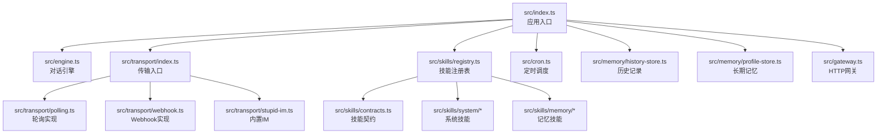
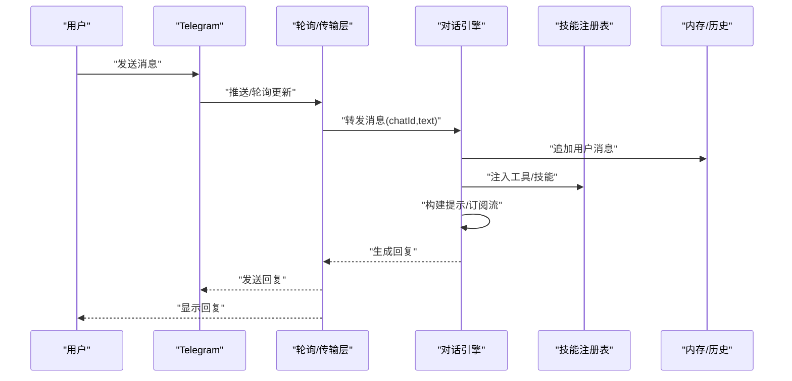
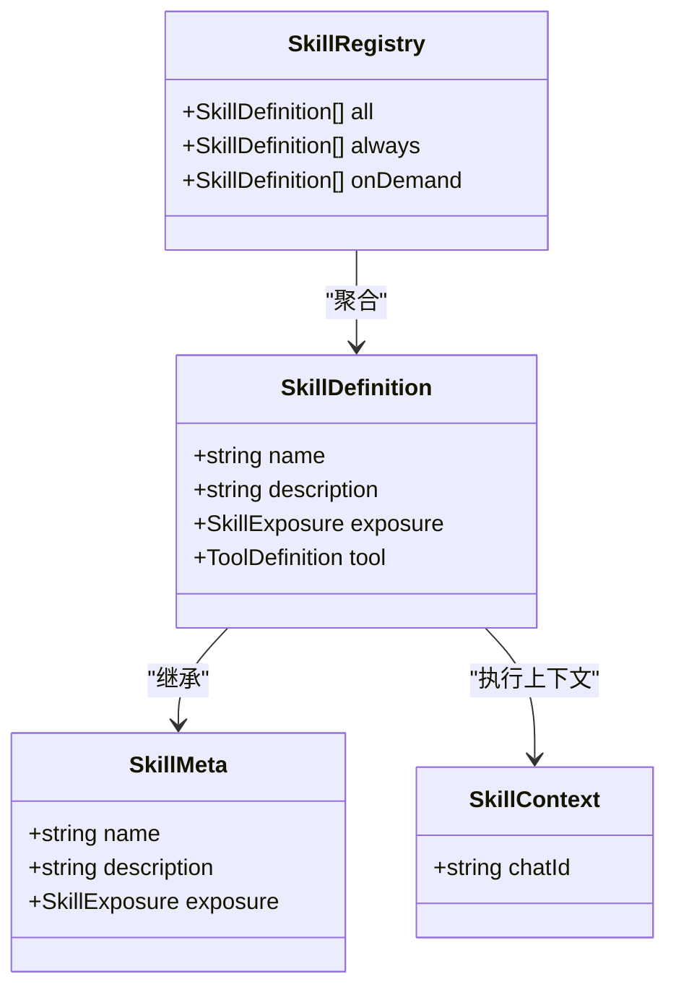
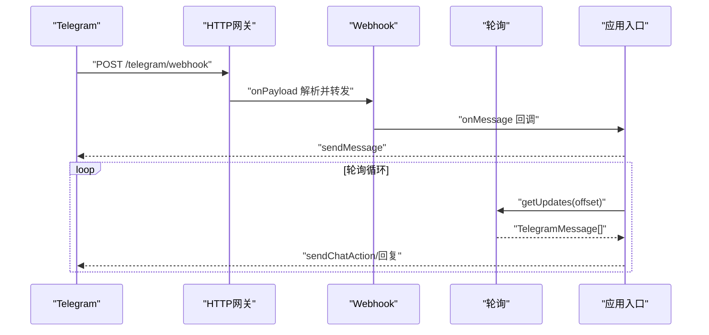
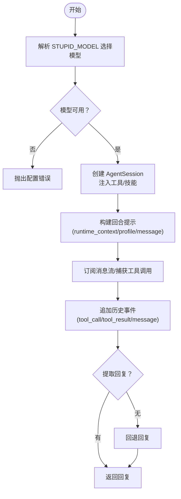
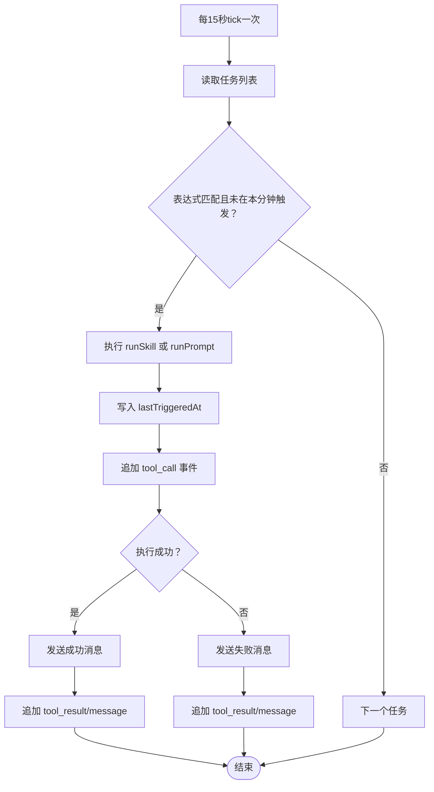
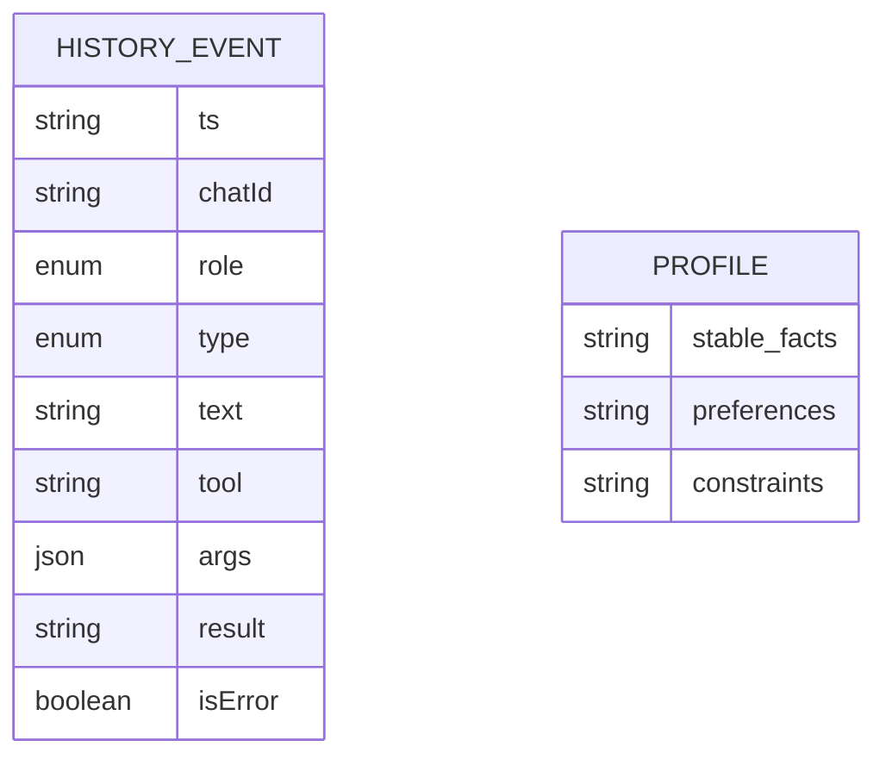
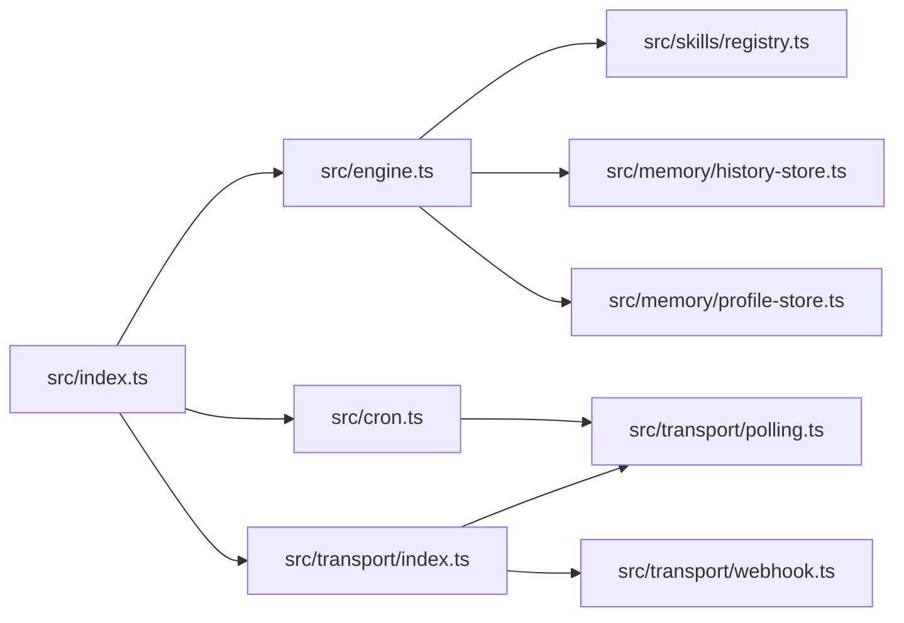

# 开发指南

<cite>
**本文引用的文件**
- [README.md](file://README.md)
- [package.json](file://package.json)
- [docs/getting-started.md](file://docs/getting-started.md)
- [src/index.ts](file://src/index.ts)
- [src/engine.ts](file://src/engine.ts)
- [src/gateway.ts](file://src/gateway.ts)
- [src/transport/index.ts](file://src/transport/index.ts)
- [src/transport/polling.ts](file://src/transport/polling.ts)
- [src/transport/webhook.ts](file://src/transport/webhook.ts)
- [src/transport/stupid-im.ts](file://src/transport/stupid-im.ts)
- [src/cron.ts](file://src/cron.ts)
- [src/memory/history-store.ts](file://src/memory/history-store.ts)
- [src/memory/profile-store.ts](file://src/memory/profile-store.ts)
- [src/memory/workspace-path.ts](file://src/memory/workspace-path.ts)
- [src/skills/contracts.ts](file://src/skills/contracts.ts)
- [src/skills/registry.ts](file://src/skills/registry.ts)
- [src/skills/system/get_system_time.ts](file://src/skills/system/get_system_time.ts)
- [src/skills/memory/update_profile.ts](file://src/skills/memory/update_profile.ts)
- [src/init.ts](file://src/init.ts)
- [src/init-providers.ts](file://src/init-providers.ts)
- [StupidClaw-第1期-先用Polling跑通消息闭环.md](file://StupidClaw-第1期-先用Polling跑通消息闭环.md)
- [StupidClaw-第2期-从Polling升级到Webhook.md](file://StupidClaw-第2期-从Polling升级到Webhook.md)
- [StupidClaw-第3期-Skills不是越多越好关键是按需披露.md](file://StupidClaw-第3期-Skills不是越多越好关键是按需披露.md)
- [StupidClaw-第4期-用profile做长期记忆让Agent记住你.md](file://StupidClaw-第4期-用profile做长期记忆让Agent记住你.md)
- [StupidClaw-第5期-安全沙盒PathJailing防止越权读写.md](file://StupidClaw-第5期-安全沙盒PathJailing防止越权读写.md)
- [StupidClaw-第6期-Cron主动触发让Agent自己干活.md](file://StupidClaw-第6期-Cron主动触发让Agent自己干活.md)
- [StupidClaw-第7期-发布与工程收口.md](file://StupidClaw-第7期-发布与工程收口.md)
- [StupidClaw-详细设计文档-v3.md](file://StupidClaw-详细设计文档-v3.md)
- [USER_STORIES.md](file://USER_STORIES.md)
</cite>

## 目录
1. [简介](#简介)
2. [项目结构](#项目结构)
3. [核心组件](#核心组件)
4. [架构总览](#架构总览)
5. [详细组件分析](#详细组件分析)
6. [依赖关系分析](#依赖关系分析)
7. [性能考量](#性能考量)
8. [故障排查指南](#故障排查指南)
9. [结论](#结论)
10. [附录](#附录)

## 简介
本开发指南面向希望参与 StupidClaw 项目开发与扩展的贡献者，覆盖开发环境搭建、代码结构理解、开发约定与最佳实践，并提供循序渐进的教程路径：从 Polling 到 Webhook，从基础技能到高级功能。同时给出扩展开发指导（新增 AI 供应商、自定义技能、扩展现有功能）、代码规范、测试策略与调试技巧，帮助你在“极简本地 Agent”的约束下高效迭代。

## 项目结构
仓库采用按功能域划分的组织方式，核心模块包括入口与引擎、传输层（轮询/Webhook/StupidIM）、技能系统、内存与历史记录、计划任务（Cron）等。顶层 README 与 docs 提供快速上手与模型配置指引；教程文档串联各阶段开发目标。

图示来源
- [src/index.ts:112-216](file://src/index.ts#L112-L216)
- [src/engine.ts:392-475](file://src/engine.ts#L392-L475)
- [src/transport/index.ts](file://src/transport/index.ts)
- [src/transport/polling.ts:52-89](file://src/transport/polling.ts#L52-L89)
- [src/transport/webhook.ts:41-86](file://src/transport/webhook.ts#L41-L86)
- [src/transport/stupid-im.ts](file://src/transport/stupid-im.ts)
- [src/skills/registry.ts:23-54](file://src/skills/registry.ts#L23-L54)
- [src/skills/contracts.ts:4-19](file://src/skills/contracts.ts#L4-L19)
- [src/skills/system/get_system_time.ts:4-37](file://src/skills/system/get_system_time.ts#L4-L37)
- [src/skills/memory/update_profile.ts:10-83](file://src/skills/memory/update_profile.ts#L10-L83)
- [src/cron.ts:251-265](file://src/cron.ts#L251-L265)
- [src/memory/history-store.ts:37-42](file://src/memory/history-store.ts#L37-L42)
- [src/memory/profile-store.ts:117-131](file://src/memory/profile-store.ts#L117-L131)
- [src/gateway.ts:27-78](file://src/gateway.ts#L27-L78)

章节来源
- [README.md:22-51](file://README.md#L22-L51)
- [package.json:14-22](file://package.json#L14-L22)
- [docs/getting-started.md:1-153](file://docs/getting-started.md#L1-L153)

## 核心组件
- 应用入口与生命周期
  - 初始化配置与锁文件、单实例保护、信号钩子、环境加载、工作区目录确保、技能注册表构建、传输层启动、定时任务调度。
- 对话引擎
  - 模型注册与选择、会话创建、系统提示拼装、工具注入、消息流订阅、历史记录追加、错误归一化与降噪。
- 传输层
  - 轮询：拉取消息、Markdown→HTML 转义、分片发送、typing 状态。
  - Webhook：设置/删除 Webhook、HTTP 网关、StupidIM 内置网页端。
- 技能系统
  - 技能契约（名称、描述、暴露策略、工具定义）、注册表聚合内置与文件技能、按需披露。
- 内存与历史
  - 历史事件 JSONL 追加与查询、长期记忆 profile.md（稳定事实/偏好/约束）。
- 计划任务
  - Cron 表达式匹配、分钟级节拍器、任务执行与结果回推、历史事件记录。
- 网关
  - HTTP 服务、路径校验、签名令牌校验、负载解析与响应。

章节来源
- [src/index.ts:112-216](file://src/index.ts#L112-L216)
- [src/engine.ts:392-475](file://src/engine.ts#L392-L475)
- [src/transport/polling.ts:52-89](file://src/transport/polling.ts#L52-L89)
- [src/transport/webhook.ts:41-86](file://src/transport/webhook.ts#L41-L86)
- [src/skills/contracts.ts:4-19](file://src/skills/contracts.ts#L4-L19)
- [src/skills/registry.ts:23-54](file://src/skills/registry.ts#L23-L54)
- [src/memory/history-store.ts:37-42](file://src/memory/history-store.ts#L37-L42)
- [src/memory/profile-store.ts:117-131](file://src/memory/profile-store.ts#L117-L131)
- [src/cron.ts:251-265](file://src/cron.ts#L251-L265)
- [src/gateway.ts:27-78](file://src/gateway.ts#L27-L78)

## 架构总览
下图展示了从用户消息到技能执行与回复的端到端流程，涵盖轮询与 Webhook 两种接入方式。

图示来源
- [src/index.ts:189-208](file://src/index.ts#L189-L208)
- [src/engine.ts:680-705](file://src/engine.ts#L680-L705)
- [src/transport/polling.ts:215-242](file://src/transport/polling.ts#L215-L242)
- [src/skills/registry.ts:23-54](file://src/skills/registry.ts#L23-L54)
- [src/memory/history-store.ts:37-42](file://src/memory/history-store.ts#L37-L42)

## 详细组件分析

### 组件A：技能系统与注册表
- 技能契约
  - 包含技能元数据（名称、描述、暴露策略）与工具定义（参数 Schema、执行函数）。
- 注册表
  - 聚合内置技能（系统、记忆、网络、编码、计划任务等），区分 always/on_demand，提供“列出可用技能”能力。
- 开发约定
  - 新增技能需实现 ToolDefinition 并在注册表中声明；暴露策略决定是否始终注入或按需披露。
  - 参数 Schema 使用 pi-ai 类型系统，保证类型安全与文档化。

图示来源
- [src/skills/contracts.ts:4-19](file://src/skills/contracts.ts#L4-L19)
- [src/skills/registry.ts:13-54](file://src/skills/registry.ts#L13-L54)

章节来源
- [src/skills/contracts.ts:4-19](file://src/skills/contracts.ts#L4-L19)
- [src/skills/registry.ts:23-54](file://src/skills/registry.ts#L23-L54)
- [src/skills/system/get_system_time.ts:4-37](file://src/skills/system/get_system_time.ts#L4-L37)
- [src/skills/memory/update_profile.ts:10-83](file://src/skills/memory/update_profile.ts#L10-L83)

### 组件B：传输层（轮询与 Webhook）
- 轮询
  - 拉取更新、409 冲突时禁用 Webhook、消息过滤、Markdown→HTML 转义、超长消息分片、typing 状态周期上报。
- Webhook
  - 设置/删除 Webhook、HTTP 网关、GET 路径处理 StupidIM、负载解析、消息回推、回复与 typing。
- 网关
  - 通用 HTTP 网关，支持路径校验、secret token 校验、GET 回显、错误处理。

图示来源
- [src/transport/webhook.ts:41-86](file://src/transport/webhook.ts#L41-L86)
- [src/transport/polling.ts:52-89](file://src/transport/polling.ts#L52-L89)
- [src/gateway.ts:27-78](file://src/gateway.ts#L27-L78)

章节来源
- [src/transport/polling.ts:52-89](file://src/transport/polling.ts#L52-L89)
- [src/transport/polling.ts:215-242](file://src/transport/polling.ts#L215-L242)
- [src/transport/webhook.ts:41-86](file://src/transport/webhook.ts#L41-L86)
- [src/gateway.ts:27-78](file://src/gateway.ts#L27-L78)

### 组件C：对话引擎与模型选择
- 模型注册与选择
  - 动态注册多供应商 Provider（含本地 Ollama/LM Studio/DeepSeek/Kimi/DashScope/bigmodel/custom-openai/custom-anthropic），支持从 STUPID_MODEL 解析 provider:model_id，回退与兜底策略。
- 会话与工具
  - 通过 SessionManager 创建 AgentSession，注入 coding 工具与自定义技能工具，订阅消息流以捕获 tool_call/tool_result。
- 历史与错误处理
  - 历史事件追加、错误归一化（API Key 缺失提示）、思考标签剥离、回退回复。

图示来源
- [src/engine.ts:196-244](file://src/engine.ts#L196-L244)
- [src/engine.ts:422-459](file://src/engine.ts#L422-L459)
- [src/engine.ts:511-607](file://src/engine.ts#L511-L607)
- [src/engine.ts:680-705](file://src/engine.ts#L680-L705)

章节来源
- [src/engine.ts:196-244](file://src/engine.ts#L196-L244)
- [src/engine.ts:422-459](file://src/engine.ts#L422-L459)
- [src/engine.ts:511-607](file://src/engine.ts#L511-L607)
- [src/engine.ts:680-705](file://src/engine.ts#L680-L705)

### 组件D：计划任务（Cron）
- Cron 表达式解析
  - 支持字段组合、范围、步进、通配符，严格校验数值范围。
- 触发与执行
  - 每分钟 tick，去重（同一分钟内不重复触发），先写入 lastTriggeredAt，再执行 runSkill/runPrompt，最后记录 tool_result/message。
- 输出与回推
  - 成功/失败统一格式，通过 sendMessage 回推至目标 chatId。

图示来源
- [src/cron.ts:171-249](file://src/cron.ts#L171-L249)
- [src/cron.ts:251-265](file://src/cron.ts#L251-L265)

章节来源
- [src/cron.ts:171-249](file://src/cron.ts#L171-L249)
- [src/cron.ts:251-265](file://src/cron.ts#L251-L265)

### 组件E：内存与历史
- 历史记录
  - 按日期分文件存储 JSONL，支持查询（chatId/date/limit），异常处理（ENOENT 返回空）。
- 长期记忆
  - profile.md 三段式结构（stable_facts/preferences/constraints），唯一化去重、Markdown 序列化/反序列化、更新模式（append/replace）。

图示来源
- [src/memory/history-store.ts:8-18](file://src/memory/history-store.ts#L8-L18)
- [src/memory/history-store.ts:50-82](file://src/memory/history-store.ts#L50-L82)
- [src/memory/profile-store.ts:6-16](file://src/memory/profile-store.ts#L6-L16)
- [src/memory/profile-store.ts:117-131](file://src/memory/profile-store.ts#L117-L131)

章节来源
- [src/memory/history-store.ts:37-42](file://src/memory/history-store.ts#L37-L42)
- [src/memory/history-store.ts:50-82](file://src/memory/history-store.ts#L50-L82)
- [src/memory/profile-store.ts:117-131](file://src/memory/profile-store.ts#L117-L131)

## 依赖关系分析
- 运行时依赖
  - @mariozechner/pi-coding-agent、@mariozechner/pi-ai：会话、工具、模型注册与资源加载。
  - dotenv：环境变量加载。
  - ws：WebSocket（StupidIM）。
- 开发依赖
  - TypeScript、tsx、bun、@types/*：编译、热重载、打包、类型检查。
- 关键耦合点
  - engine 依赖 skills/registry 与 memory/*；index.ts 串联 engine 与 transport；cron 依赖 transport/polling 与 memory。

图示来源
- [src/index.ts:8-10](file://src/index.ts#L8-L10)
- [src/engine.ts:16-17](file://src/engine.ts#L16-L17)
- [src/skills/registry.ts:1-11](file://src/skills/registry.ts#L1-L11)
- [src/cron.ts:1-3](file://src/cron.ts#L1-L3)

章节来源
- [package.json:30-37](file://package.json#L30-L37)
- [src/index.ts:8-10](file://src/index.ts#L8-L10)
- [src/engine.ts:16-17](file://src/engine.ts#L16-L17)
- [src/skills/registry.ts:1-11](file://src/skills/registry.ts#L1-L11)
- [src/cron.ts:1-3](file://src/cron.ts#L1-L3)

## 性能考量
- 传输层
  - 轮询：timeout 与 allowed_updates 控制长轮询；分片发送避免超长消息；typing 周期上报提升体验。
  - Webhook：HTTP 网关异步处理，减少阻塞；GET 路径用于 StupidIM 快速接入。
- 引擎
  - 会话复用（Map<chatId>）降低创建成本；消息流订阅按 delta/text_end/done 三阶段处理，避免重复拼接。
  - 工具注入按需披露，减少提示冗余。
- Cron
  - 15 秒节拍器，先写入 lastTriggeredAt 防抖；失败与成功均记录 tool_result/message，便于审计。
- I/O
  - 历史按日分文件，查询带 limit 上限，避免大文件扫描。

章节来源
- [src/transport/polling.ts:52-89](file://src/transport/polling.ts#L52-L89)
- [src/transport/polling.ts:215-242](file://src/transport/polling.ts#L215-L242)
- [src/engine.ts:392-475](file://src/engine.ts#L392-L475)
- [src/engine.ts:511-607](file://src/engine.ts#L511-L607)
- [src/cron.ts:251-265](file://src/cron.ts#L251-L265)
- [src/memory/history-store.ts:50-82](file://src/memory/history-store.ts#L50-L82)

## 故障排查指南
- 环境变量缺失
  - API Key 未配置或拼写错误：引擎会归一化错误，提示缺少具体 Provider 的 Key 或 STUPID_MODEL 配置问题。
- Telegram 相关
  - 轮询冲突：409 时自动禁用 Webhook 后重试；若仍失败，检查 TOKEN 权限与 allowed_updates。
  - Webhook 设置失败：检查 TELEGRAM_WEBHOOK_URL、PORT、TELEGRAM_WEBHOOK_PATH、TELEGRAM_WEBHOOK_SECRET。
- Cron
  - 表达式非法：字段数量或格式不正确；检查分钟/小时/日/月/周字段。
  - 重复触发：确认 lastTriggeredAt 更新与分钟粒度去重逻辑。
- StupidIM
  - 端口占用或 token 错误：查看启动日志中的端口与 token，确认浏览器连接参数。

章节来源
- [src/engine.ts:162-186](file://src/engine.ts#L162-L186)
- [src/transport/polling.ts:52-89](file://src/transport/polling.ts#L52-L89)
- [src/transport/webhook.ts:41-86](file://src/transport/webhook.ts#L41-L86)
- [src/cron.ts:85-109](file://src/cron.ts#L85-L109)
- [docs/getting-started.md:115-135](file://docs/getting-started.md#L115-L135)

## 结论
StupidClaw 以“极简本地 Agent”为核心理念，围绕 pi-mono 构建了可插拔的技能系统、可靠的传输层与安全的沙盒路径，辅以长期记忆与计划任务，形成从入门到进阶的完整开发路径。遵循本文档的开发约定与最佳实践，可高效扩展新功能、接入新供应商、完善技能生态。

## 附录

### 渐进式开发教程路径
- 第1期：先用 Polling 跑通消息闭环
  - 目标：理解轮询、消息收发、回复与 typing。
  - 参考：[StupidClaw-第1期-先用Polling跑通消息闭环.md](file://StupidClaw-第1期-先用Polling跑通消息闭环.md)
- 第2期：从 Polling 升级到 Webhook
  - 目标：设置 Webhook、HTTP 网关、StupidIM。
  - 参考：[StupidClaw-第2期-从Polling升级到Webhook.md](file://StupidClaw-第2期-从Polling升级到Webhook.md)
- 第3期：Skills 不是越多越好，关键是按需披露
  - 目标：理解技能契约、注册表、always/on_demand。
  - 参考：[StupidClaw-第3期-Skills不是越多越好关键是按需披露.md](file://StupidClaw-第3期-Skills不是越多越好关键是按需披露.md)
- 第4期：用 profile 做长期记忆让 Agent 记住你
  - 目标：profile.md 结构、更新与查询。
  - 参考：[StupidClaw-第4期-用profile做长期记忆让Agent记住你.md](file://StupidClaw-第4期-用profile做长期记忆让Agent记住你.md)
- 第5期：安全沙盒 PathJailing 防止越权读写
  - 目标：工作区路径解析与安全限制。
  - 参考：[StupidClaw-第5期-安全沙盒PathJailing防止越权读写.md](file://StupidClaw-第5期-安全沙盒PathJailing防止越权读写.md)
- 第6期：Cron 主动触发让 Agent 自己干活
  - 目标：Cron 表达式、任务管理、执行与回推。
  - 参考：[StupidClaw-第6期-Cron主动触发让Agent自己干活.md](file://StupidClaw-第6期-Cron主动触发让Agent自己干活.md)
- 第7期：发布与工程收口
  - 目标：打包、版本发布、脚本与配置。
  - 参考：[StupidClaw-第7期-发布与工程收口.md](file://StupidClaw-第7期-发布与工程收口.md)

章节来源
- [StupidClaw-第1期-先用Polling跑通消息闭环.md](file://StupidClaw-第1期-先用Polling跑通消息闭环.md)
- [StupidClaw-第2期-从Polling升级到Webhook.md](file://StupidClaw-第2期-从Polling升级到Webhook.md)
- [StupidClaw-第3期-Skills不是越多越好关键是按需披露.md](file://StupidClaw-第3期-Skills不是越多越好关键是按需披露.md)
- [StupidClaw-第4期-用profile做长期记忆让Agent记住你.md](file://StupidClaw-第4期-用profile做长期记忆让Agent记住你.md)
- [StupidClaw-第5期-安全沙盒PathJailing防止越权读写.md](file://StupidClaw-第5期-安全沙盒PathJailing防止越权读写.md)
- [StupidClaw-第6期-Cron主动触发让Agent自己干活.md](file://StupidClaw-第6期-Cron主动触发让Agent自己干活.md)
- [StupidClaw-第7期-发布与工程收口.md](file://StupidClaw-第7期-发布与工程收口.md)

### 开发约定与最佳实践
- 技能开发
  - 使用 SkillDefinition 契约，明确 exposure；参数使用 Type.Object 定义；execute 返回标准化内容结构。
  - 在注册表中集中声明，避免分散注册。
- 传输层
  - 轮询：处理 409 冲突、超长消息分片、typing 周期上报；Webhook：校验 secret token、路径校验、GET 回显。
- 引擎与模型
  - STUPID_MODEL 支持 provider:model_id；缺失 Key 时提供清晰错误；会话复用与消息流订阅。
- 内存与历史
  - 历史按日分文件，查询带上限；profile.md 三段式结构，唯一化去重。
- Cron
  - 表达式严格校验；分钟级去重；执行前后记录 tool_call/tool_result/message。
- 测试与调试
  - 使用测试脚本与类型检查；开启 DEBUG_STUPIDCLAW/DEBUG_PROMPT 查看内部日志；StupidIM 快速验证。

章节来源
- [src/skills/contracts.ts:4-19](file://src/skills/contracts.ts#L4-L19)
- [src/skills/registry.ts:23-54](file://src/skills/registry.ts#L23-L54)
- [src/transport/polling.ts:52-89](file://src/transport/polling.ts#L52-L89)
- [src/transport/webhook.ts:41-86](file://src/transport/webhook.ts#L41-L86)
- [src/engine.ts:162-186](file://src/engine.ts#L162-L186)
- [src/memory/history-store.ts:50-82](file://src/memory/history-store.ts#L50-L82)
- [src/memory/profile-store.ts:117-131](file://src/memory/profile-store.ts#L117-L131)
- [src/cron.ts:85-109](file://src/cron.ts#L85-L109)
- [package.json:19-21](file://package.json#L19-L21)

### 扩展开发指导
- 新增 AI 供应商
  - 在引擎中注册 Provider（参考现有 openrouter/deepseek/kimi/dashscope/bigmodel/custom-openai/custom-anthropic），设置 baseUrl/apiKey/api 类型与模型清单。
  - 若为本地模型（Ollama/LM Studio），通过环境变量配置 base_url 与 model_id。
- 创建自定义技能
  - 实现 ToolDefinition，定义参数 Schema 与 execute；在注册表中声明 exposure；如需文件技能，使用标准文件技能加载器。
- 扩展现有功能
  - 传输层：在 gateway/webhook/polling 增加路由或处理逻辑；注意安全与鉴权。
  - 计划任务：新增任务类型或参数，扩展 CronExecutor；确保输出格式一致。
  - 内存：扩展 profile.md 字段或历史事件类型，保持 JSONL 结构与查询接口兼容。

章节来源
- [src/engine.ts:246-383](file://src/engine.ts#L246-L383)
- [src/skills/registry.ts:23-54](file://src/skills/registry.ts#L23-L54)
- [src/gateway.ts:27-78](file://src/gateway.ts#L27-L78)
- [src/cron.ts:5-14](file://src/cron.ts#L5-L14)

### 代码规范与测试策略
- 代码规范
  - 使用 TypeScript，遵循模块化与按功能域划分；导出接口与类型清晰；错误处理与日志分级明确。
- 测试策略
  - 单元测试：针对 Cron 表达式匹配、历史查询、profile 更新等关键逻辑。
  - 集成测试：端到端验证轮询/Webhook、技能执行、Cron 触发链路。
  - 调试技巧：启用 DEBUG_STUPIDCLAW/DEBUG_PROMPT；使用 StupidIM 快速验证；观察 .stupidClaw 目录下的历史与 profile 文件。

章节来源
- [src/cron.ts:16-25](file://src/cron.ts#L16-L25)
- [src/memory/history-store.ts:50-82](file://src/memory/history-store.ts#L50-L82)
- [src/memory/profile-store.ts:117-131](file://src/memory/profile-store.ts#L117-L131)
- [package.json:19](file://package.json#L19)