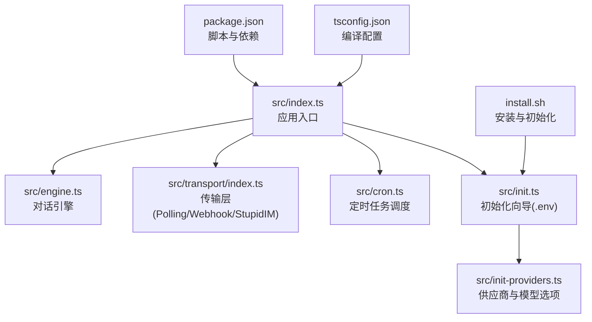
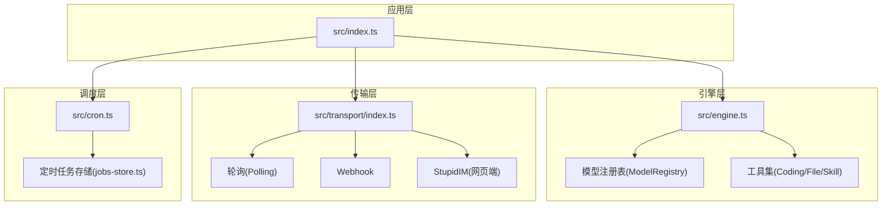
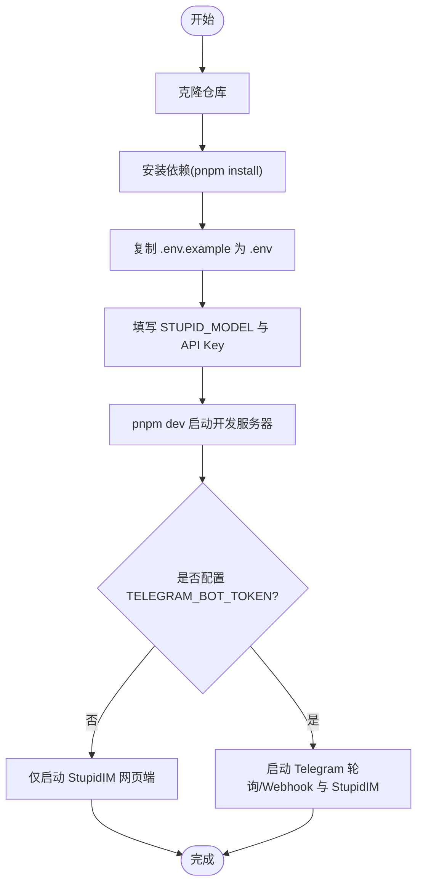
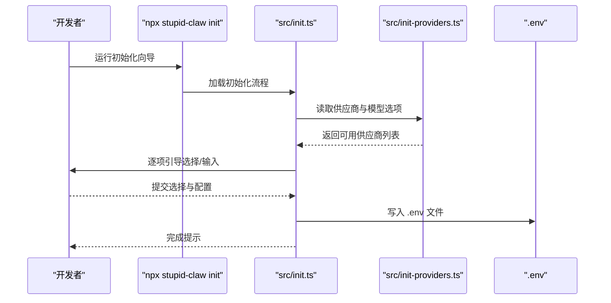
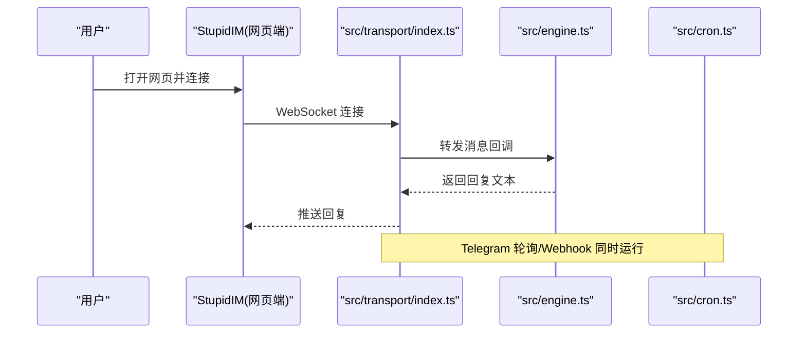
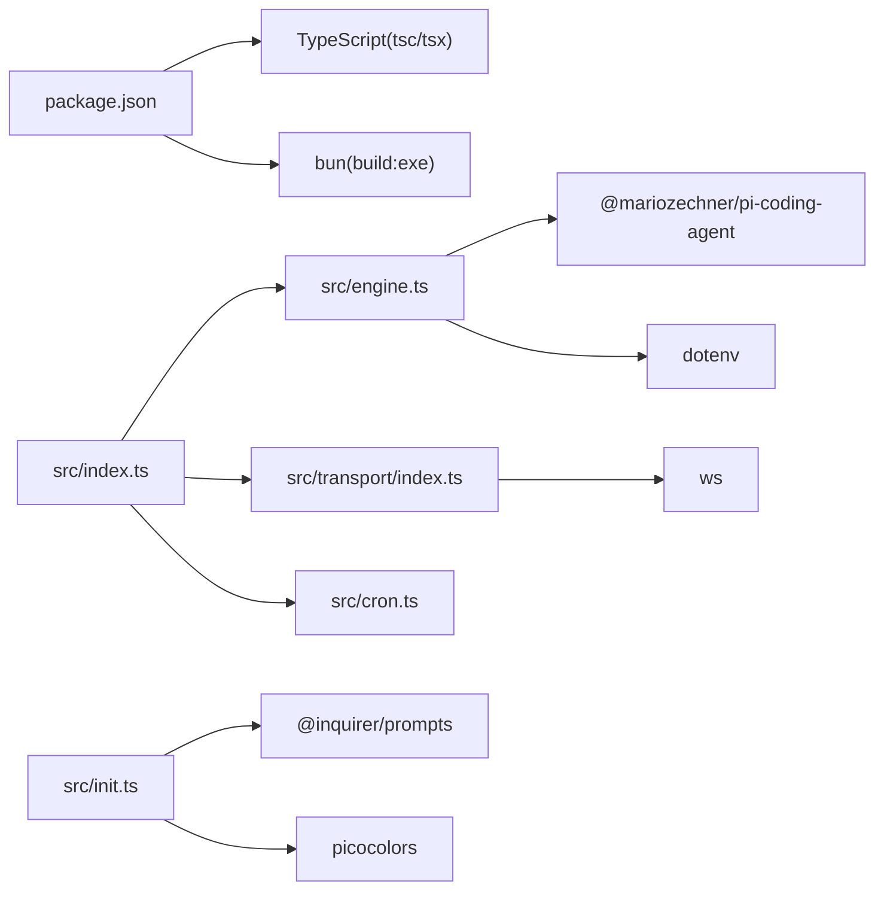

# 开发环境搭建

<cite>
**本文档引用的文件**
- [package.json](file://package.json)
- [tsconfig.json](file://tsconfig.json)
- [install.sh](file://install.sh)
- [README.md](file://README.md)
- [docs/getting-started.md](file://docs/getting-started.md)
- [docs/models.md](file://docs/models.md)
- [src/index.ts](file://src/index.ts)
- [src/engine.ts](file://src/engine.ts)
- [src/transport/index.ts](file://src/transport/index.ts)
- [src/cron.ts](file://src/cron.ts)
- [src/init.ts](file://src/init.ts)
- [src/init-providers.ts](file://src/init-providers.ts)
</cite>

## 目录
1. [简介](#简介)
2. [项目结构](#项目结构)
3. [核心组件](#核心组件)
4. [架构总览](#架构总览)
5. [详细组件分析](#详细组件分析)
6. [依赖关系分析](#依赖关系分析)
7. [性能考虑](#性能考虑)
8. [故障排查指南](#故障排查指南)
9. [结论](#结论)
10. [附录](#附录)

## 简介
本指南面向希望在本地搭建 StupidClaw 开发环境的开发者，覆盖 Node.js 环境要求、依赖安装、项目克隆与配置、TypeScript 开发环境设置（编译配置、开发服务器与热重载）、VSCode 推荐配置与调试、常见问题排查与解决。通过本指南，你将能够快速完成从零到可用的开发环境搭建。

## 项目结构
StupidClaw 采用模块化的 TypeScript 项目结构，核心入口位于 src/index.ts，业务能力通过引擎、传输层、定时任务、技能系统等模块协同实现。构建与运行脚本集中在 package.json 中，TypeScript 编译配置位于 tsconfig.json。安装与初始化流程由 install.sh 与 src/init.ts 提供自动化支持。

**图表来源**
- [package.json:14-22](file://package.json#L14-L22)
- [src/index.ts:1-216](file://src/index.ts#L1-L216)
- [src/engine.ts:1-706](file://src/engine.ts#L1-L706)
- [src/transport/index.ts:1-71](file://src/transport/index.ts#L1-L71)
- [src/cron.ts:1-265](file://src/cron.ts#L1-L265)
- [src/init.ts:1-339](file://src/init.ts#L1-L339)
- [src/init-providers.ts:1-180](file://src/init-providers.ts#L1-L180)
- [tsconfig.json:1-19](file://tsconfig.json#L1-L19)
- [install.sh:1-68](file://install.sh#L1-L68)

**章节来源**
- [package.json:14-22](file://package.json#L14-L22)
- [tsconfig.json:1-19](file://tsconfig.json#L1-L19)
- [install.sh:1-68](file://install.sh#L1-L68)
- [README.md:54-95](file://README.md#L54-L95)

## 核心组件
- 应用入口与生命周期
  - src/index.ts 负责解析命令行参数、加载 .env、单实例锁、初始化工作区、注册信号钩子、启动传输层与定时任务、处理消息回调。
- 对话引擎
  - src/engine.ts 负责模型选择、会话创建、提示词构建、工具注入、历史记录追加、错误归一化与回复提取。
- 传输层
  - src/transport/index.ts 提供轮询模式与 Webhook 模式的 Telegram 交互，以及 StupidIM 网页端的启动。
- 定时任务
  - src/cron.ts 实现基于 cron 表达式的任务调度，支持技能调用与提示词执行，并通过 Telegram 发送结果。
- 初始化向导
  - src/init.ts 与 src/init-providers.ts 提供交互式 .env 初始化，支持多家供应商与模型选择、本地模型与自定义接口配置。

**章节来源**
- [src/index.ts:112-216](file://src/index.ts#L112-L216)
- [src/engine.ts:19-706](file://src/engine.ts#L19-L706)
- [src/transport/index.ts:19-71](file://src/transport/index.ts#L19-L71)
- [src/cron.ts:5-265](file://src/cron.ts#L5-L265)
- [src/init.ts:224-339](file://src/init.ts#L224-L339)
- [src/init-providers.ts:23-180](file://src/init-providers.ts#L23-L180)

## 架构总览
下图展示了 StupidClaw 的运行时架构：应用入口协调引擎、传输层与定时任务；引擎通过模型注册表与工具集进行对话；传输层负责消息接收与发送；定时任务周期性触发技能或提示词执行并通过传输层反馈结果。

**图表来源**
- [src/index.ts:112-216](file://src/index.ts#L112-L216)
- [src/engine.ts:392-459](file://src/engine.ts#L392-L459)
- [src/transport/index.ts:47-71](file://src/transport/index.ts#L47-L71)
- [src/cron.ts:251-265](file://src/cron.ts#L251-L265)

## 详细组件分析

### TypeScript 开发环境设置
- Node.js 与包管理器
  - Node.js v20+ 推荐；使用 pnpm 作为包管理器。
  - 安装脚本会自动检测并安装 Node.js 与 pnpm，若系统无法自动识别，将提示手动安装。
- TypeScript 编译配置
  - 目标与模块：ES2022 与 ESNext，Bundler 解析策略。
  - 输出目录：dist；启用声明文件与 SourceMap；移除注释；允许合成默认导入；启用 esModuleInterop。
  - 包含范围：src/**/*.ts。
- 开发脚本
  - dev：使用 tsx 直接运行 src/index.ts，支持热重载与即时编译。
  - build：tsc 编译至 dist。
  - test：使用 tsx 导入执行测试文件。
  - typecheck：tsc 类型检查。
  - build:exe：使用 bun 将入口编译为独立可执行文件。
- VSCode 推荐配置
  - 安装扩展：TypeScript Importer、ESLint、Prettier、EditorConfig for VS Code。
  - 设置：
    - editor.formatOnSave: true
    - editor.codeActionsOnSave: { "source.fixAll.eslint": true }
    - typescript.preferences.importModuleSpecifier: "relative"
    - files.associations: { "*.ts": "typescript" }
  - 调试配置（launch.json）建议包含：
    - type: node
    - request: launch
    - program: "${workspaceFolder}/src/index.ts"
    - console: integratedTerminal
    - skipFiles: ["<node_internals>/**"]
    - env: { NODE_ENV: "development" }

**章节来源**
- [install.sh:17-46](file://install.sh#L17-L46)
- [package.json:14-22](file://package.json#L14-L22)
- [tsconfig.json:2-18](file://tsconfig.json#L2-L18)
- [README.md:58-95](file://README.md#L58-L95)

### 项目克隆与配置流程
- 克隆仓库与安装依赖
  - 使用 pnpm install 安装依赖。
- 初始化 .env
  - 复制 .env.example 为 .env 并填写必要配置项（至少包含 STUPID_MODEL 与对应供应商 API Key）。
  - 可使用 npx stupid-claw init 交互式生成 .env。
- 启动开发
  - pnpm dev 启动开发服务器，自动监听 TypeScript 变更并重启。
  - 若未配置 TELEGRAM_BOT_TOKEN，将仅启动 StupidIM 网页端；配置后可同时启用 Telegram 轮询或 Webhook。

**图表来源**
- [install.sh:48-68](file://install.sh#L48-L68)
- [docs/getting-started.md:68-103](file://docs/getting-started.md#L68-L103)
- [src/init.ts:224-339](file://src/init.ts#L224-L339)

**章节来源**
- [install.sh:48-68](file://install.sh#L48-L68)
- [docs/getting-started.md:68-103](file://docs/getting-started.md#L68-L103)
- [src/init.ts:224-339](file://src/init.ts#L224-L339)

### 初始化向导与模型配置
- 初始化向导流程
  - 选择供应商 → 输入 API Key（部分供应商无需）→ 选择或输入模型 → 可选 Telegram Bot Token → 配置 StupidIM Token 与端口 → 写入 .env。
- 模型配置要点
  - STUPID_MODEL=provider:model_id 格式；部分供应商支持自定义 baseUrl 与 API Key。
  - 本地模型（Ollama/LM Studio/vLLM）通过 ~/.pi/agent/models.json 注册，不在 .env 中直接配置。
  - 自定义兼容接口可通过初始化向导或 models.json 注册。

**图表来源**
- [src/init.ts:224-339](file://src/init.ts#L224-L339)
- [src/init-providers.ts:23-180](file://src/init-providers.ts#L23-L180)

**章节来源**
- [src/init.ts:224-339](file://src/init.ts#L224-L339)
- [src/init-providers.ts:23-180](file://src/init-providers.ts#L23-L180)
- [docs/models.md:9-32](file://docs/models.md#L9-L32)

### 传输层与消息循环
- 轮询模式
  - 通过 Telegram 轮询拉取消息，逐条处理并回复；异常时短暂休眠重试。
- Webhook 模式
  - 启动 Webhook 服务，接收推送消息；适用于公网可访问的部署场景。
- StupidIM 网页端
  - 启动本地 HTTP 服务，提供简易聊天界面；无需 Telegram 即可调试。

**图表来源**
- [src/transport/index.ts:19-71](file://src/transport/index.ts#L19-L71)
- [src/engine.ts:680-706](file://src/engine.ts#L680-L706)
- [src/cron.ts:251-265](file://src/cron.ts#L251-L265)

**章节来源**
- [src/transport/index.ts:19-71](file://src/transport/index.ts#L19-L71)
- [src/engine.ts:680-706](file://src/engine.ts#L680-L706)
- [src/cron.ts:251-265](file://src/cron.ts#L251-L265)

## 依赖关系分析
- 运行时依赖
  - @mariozechner/pi-coding-agent：对话引擎与工具集核心。
  - dotenv：加载 .env 环境变量。
  - ws：WebSocket 通信支持。
  - @inquirer/prompts、picocolors：初始化向导与彩色输出。
- 开发依赖
  - typescript、tsx、@types/node、@types/ws：TypeScript 编译与开发时类型支持。
  - bun：可选的独立可执行文件打包工具。
- 关键耦合点
  - src/index.ts 依赖 dotenv、engine、transport、cron、memory/skills 等模块。
  - src/engine.ts 依赖模型注册表与工具集，间接耦合多个供应商实现。
  - src/transport/index.ts 依赖轮询与 Webhook 实现，以及 StupidIM 启动逻辑。

**图表来源**
- [package.json:23-37](file://package.json#L23-L37)
- [src/index.ts:1-216](file://src/index.ts#L1-L216)
- [src/engine.ts:1-17](file://src/engine.ts#L1-L17)
- [src/transport/index.ts:1-3](file://src/transport/index.ts#L1-L3)
- [src/init.ts:1-6](file://src/init.ts#L1-L6)

**章节来源**
- [package.json:23-37](file://package.json#L23-L37)
- [src/index.ts:1-216](file://src/index.ts#L1-L216)

## 性能考虑
- 编译与运行
  - 使用 tsc 编译生产构建，tsx 用于开发热重载；合理配置 outDir 与 sourceMap 以平衡调试与体积。
- 传输层
  - 轮询模式默认每 1 秒重试一次错误；在高并发或网络不稳定时可适当增加延迟以降低失败率。
- 引擎与工具
  - 会话复用与工具缓存有助于减少重复初始化成本；注意避免在工具中执行阻塞操作。
- 定时任务
  - 调度间隔为 15 秒；确保任务执行时间短于间隔，避免重复触发；对长耗时任务建议异步化或拆分。

[本节为通用指导，无需特定文件来源]

## 故障排查指南
- Node.js 与 pnpm 未安装
  - 现象：命令不可用或安装失败。
  - 处理：参考 install.sh 的自动安装逻辑，或手动安装 Node.js v20+ 与 pnpm。
- .env 未配置或缺失关键字段
  - 现象：启动后提示未检测到 .env 或 TELEGRAM_BOT_TOKEN 未配置。
  - 处理：使用 npx stupid-claw init 生成 .env，或手动复制 .env.example 并填写 STUPID_MODEL 与对应 API Key。
- API Key 无效或模型不匹配
  - 现象：模型调用失败，提示缺少 API Key 或模型不可用。
  - 处理：核对 .env 中的 KEY 名称与模型 ID；若使用 OpenRouter，确认可用模型列表；本地模型需在 ~/.pi/agent/models.json 中注册。
- Telegram 无法接收消息
  - 现象：未收到轮询消息或 Webhook 推送失败。
  - 处理：检查 TELEGRAM_MODE（polling/webhook）与 TELEGRAM_BOT_TOKEN；确保网络可达或正确配置反向代理。
- 单实例冲突
  - 现象：提示另一个轮询实例已在运行。
  - 处理：清理 .stupidClaw/polling.lock 文件后重启。
- StupidIM 网页端无法连接
  - 现象：浏览器无法连接 WebSocket 或页面空白。
  - 处理：确认 STUPID_IM_TOKEN 与 PORT 配置；检查防火墙与端口占用；使用终端提示的链接打开网页端。

**章节来源**
- [install.sh:17-46](file://install.sh#L17-L46)
- [src/index.ts:22-40](file://src/index.ts#L22-L40)
- [src/engine.ts:162-186](file://src/engine.ts#L162-L186)
- [src/transport/index.ts:56-69](file://src/transport/index.ts#L56-L69)
- [src/index.ts:45-69](file://src/index.ts#L45-L69)
- [docs/getting-started.md:115-135](file://docs/getting-started.md#L115-L135)

## 结论
通过本指南，你可以基于 Node.js v20+ 与 pnpm 完成 StupidClaw 的开发环境搭建；借助 tsx 实现热重载与即时调试；使用初始化向导快速生成 .env 并配置模型；结合传输层与定时任务完成消息闭环与自动化执行。遇到问题时，可依据故障排查指南定位并解决常见问题，从而高效开展二次开发与功能扩展。

[本节为总结性内容，无需特定文件来源]

## 附录
- 快速命令清单
  - 安装依赖：pnpm install
  - 生成 .env：npx stupid-claw init 或复制 .env.example
  - 启动开发：pnpm dev
  - 类型检查：pnpm run typecheck
  - 生产构建：pnpm run build
  - 打包可执行文件：pnpm run build:exe
- VSCode 调试建议
  - 在 launch.json 中配置 TypeScript 入口为 src/index.ts，使用集成终端运行，便于查看日志与热重载行为。

[本节为辅助信息，无需特定文件来源]