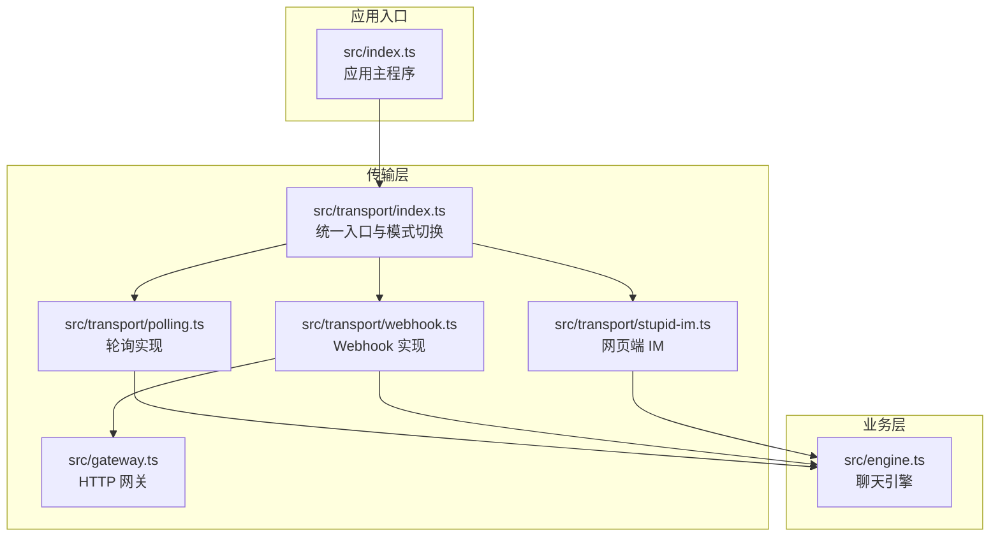
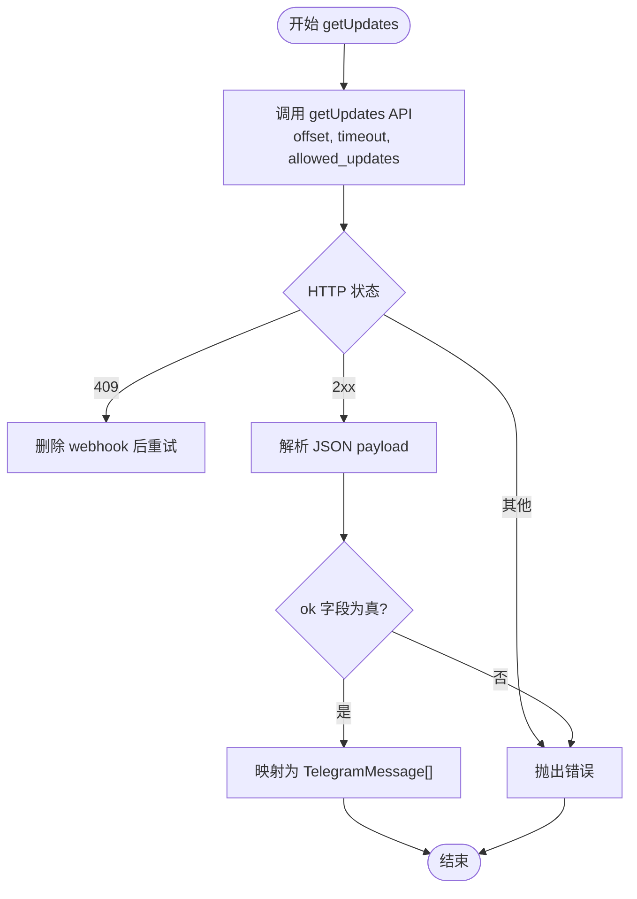
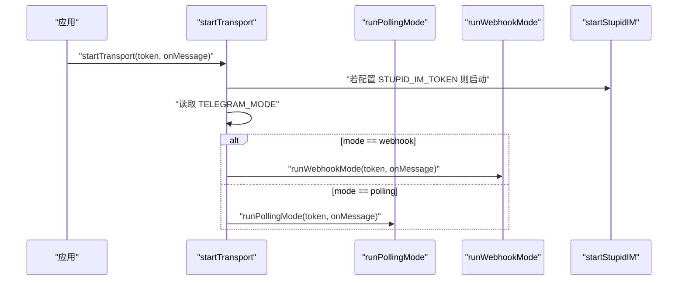
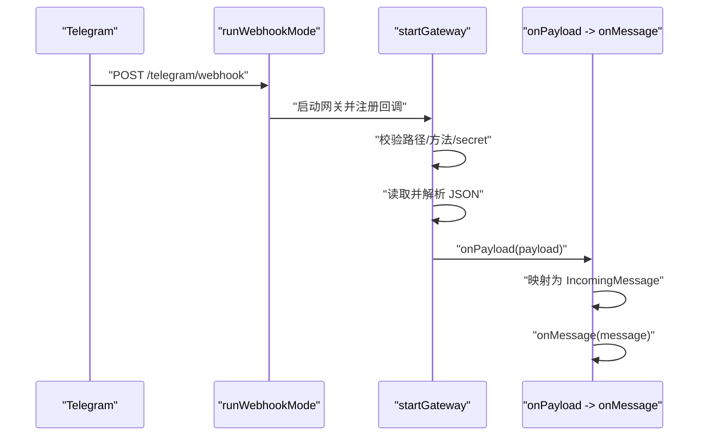
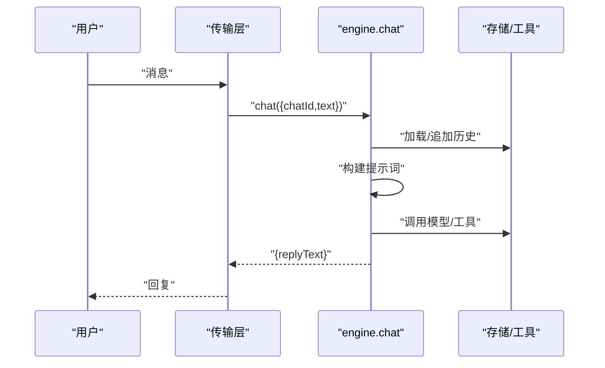
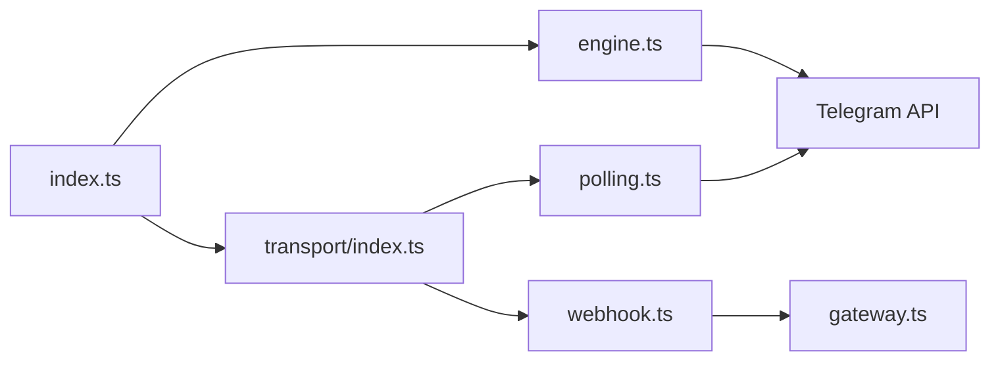

# Polling 模式扩展

<cite>
**本文档引用的文件**
- [src/transport/polling.ts](file://src/transport/polling.ts)
- [src/transport/index.ts](file://src/transport/index.ts)
- [src/transport/webhook.ts](file://src/transport/webhook.ts)
- [src/transport/stupid-im.ts](file://src/transport/stupid-im.ts)
- [src/gateway.ts](file://src/gateway.ts)
- [src/engine.ts](file://src/engine.ts)
- [src/index.ts](file://src/index.ts)
- [package.json](file://package.json)
- [README.md](file://README.md)
</cite>

## 目录
1. [简介](#简介)
2. [项目结构](#项目结构)
3. [核心组件](#核心组件)
4. [架构总览](#架构总览)
5. [详细组件分析](#详细组件分析)
6. [依赖关系分析](#依赖关系分析)
7. [性能考量](#性能考量)
8. [故障排查指南](#故障排查指南)
9. [结论](#结论)
10. [附录](#附录)

## 简介
本指南面向希望扩展和优化 Telegram Polling 模式的开发者，系统讲解长轮询的工作原理与实现机制，涵盖 getUpdates、sendMessage、sendChatAction 等核心函数的作用与调用流程，并提供轮询间隔、错误处理策略、offset 管理等关键参数的修改方法与最佳实践。同时给出完整的扩展示例，包括自定义轮询参数、新增轮询选项、性能优化建议，以及与 Telegram API 的交互方式与注意事项。

## 项目结构
本项目采用分层与模块化组织，传输层位于 src/transport 目录，包含轮询、Webhook、StupidIM 等多种接入方式，统一通过 startTransport 进行模式切换。业务层位于 src/engine.ts，对外暴露 chat 接口，消息经 transport 层转换后进入业务处理。



图表来源
- [src/index.ts:189-215](file://src/index.ts#L189-L215)
- [src/transport/index.ts:47-70](file://src/transport/index.ts#L47-L70)
- [src/transport/polling.ts:52-89](file://src/transport/polling.ts#L52-L89)
- [src/transport/webhook.ts:41-85](file://src/transport/webhook.ts#L41-L85)
- [src/gateway.ts:27-79](file://src/gateway.ts#L27-L79)
- [src/engine.ts:680-706](file://src/engine.ts#L680-L706)

章节来源
- [README.md:22-52](file://README.md#L22-L52)
- [src/transport/index.ts:1-71](file://src/transport/index.ts#L1-L71)

## 核心组件
- 传输层统一入口：负责根据 TELEGRAM_MODE 切换 Polling/Webhook 模式，同时支持 StupidIM 网页端。
- 轮询实现：封装 Telegram getUpdates、sendMessage、sendChatAction 等 API 调用，管理 offset 与错误处理。
- Webhook 实现：注册 webhook，接收 Telegram 回调并通过网关转发给业务层。
- 网关：轻量 HTTP 服务器，校验路径、方法与可选 secret token，解析 JSON 并回调业务层。
- 业务引擎：对外提供 chat 接口，处理消息并生成回复。

章节来源
- [src/transport/index.ts:47-70](file://src/transport/index.ts#L47-L70)
- [src/transport/polling.ts:52-89](file://src/transport/polling.ts#L52-L89)
- [src/transport/webhook.ts:41-85](file://src/transport/webhook.ts#L41-L85)
- [src/gateway.ts:27-79](file://src/gateway.ts#L27-L79)
- [src/engine.ts:680-706](file://src/engine.ts#L680-L706)

## 架构总览
下图展示了从 Telegram 到业务层的消息流转路径，以及两种传输模式的差异。

```mermaid
sequenceDiagram
participant T as "Telegram"
participant P as "Polling(getUpdates)"
participant W as "Webhook(setWebhook)"
participant G as "Gateway(HTTP)"
participant E as "Engine(chat)"
Note over T,P : 轮询模式：客户端主动拉取
T->>P : "getUpdates(offset, timeout)"
P-->>T : "更新列表"
P->>E : "IncomingMessage(chatId,text)"
Note over T,W,G : Webhook 模式：服务端推送
T->>W : "POST /telegram/webhook"
W->>G : "转发到网关"
G-->>W : "校验与解析"
W->>E : "IncomingMessage(chatId,text)"
```

图表来源
- [src/transport/polling.ts:52-89](file://src/transport/polling.ts#L52-L89)
- [src/transport/webhook.ts:41-85](file://src/transport/webhook.ts#L41-L85)
- [src/gateway.ts:27-79](file://src/gateway.ts#L27-L79)
- [src/engine.ts:680-706](file://src/engine.ts#L680-L706)

## 详细组件分析

### 轮询模式核心函数详解
- getUpdates(token, offset)
  - 功能：向 Telegram API 请求增量更新，支持 30 秒长轮询与仅监听 message 类型。
  - 错误处理：当返回 409 冲突时，自动禁用 webhook 后重试；非 2xx 抛出异常；Telegram 返回 ok=false 时同样抛错。
  - 输出：标准化为 TelegramMessage 数组，包含 updateId、chatId、text。
- sendMessage(token, chatId, text)
  - 功能：将 Markdown 转换为 Telegram 支持的 HTML 子集，按最大长度切片后发送；若 HTML 解析失败则回退为纯文本逐段发送。
  - 注意：发送过程对每个片段独立请求，遇到失败会抛出异常。
- sendChatAction(token, chatId)
  - 功能：发送 typing 状态，fire-and-forget，失败静默忽略。
  - 用途：用于模拟“正在输入”状态，提升用户体验。



图表来源
- [src/transport/polling.ts:52-89](file://src/transport/polling.ts#L52-L89)

章节来源
- [src/transport/polling.ts:52-89](file://src/transport/polling.ts#L52-L89)
- [src/transport/polling.ts:215-242](file://src/transport/polling.ts#L215-L242)
- [src/transport/polling.ts:202-213](file://src/transport/polling.ts#L202-L213)

### 传输层统一入口与模式切换
- startTransport(token, onMessage)
  - 功能：根据 TELEGRAM_MODE 选择 runPollingMode 或 runWebhookMode；若配置 STUPID_IM_TOKEN 则启动 StupidIM 网页端。
  - 轮询模式：维护 offset，循环调用 getUpdates，逐条触发 onMessage。
  - Webhook 模式：调用 setWebhook 注册回调地址，启动网关接收 Telegram 推送。



图表来源
- [src/transport/index.ts:47-70](file://src/transport/index.ts#L47-L70)
- [src/transport/index.ts:19-45](file://src/transport/index.ts#L19-L45)
- [src/transport/webhook.ts:41-85](file://src/transport/webhook.ts#L41-L85)

章节来源
- [src/transport/index.ts:47-70](file://src/transport/index.ts#L47-L70)
- [src/transport/index.ts:19-45](file://src/transport/index.ts#L19-L45)

### Webhook 模式与网关
- runWebhookMode(token, onMessage)
  - 功能：设置 webhook，启动网关，接收 Telegram 推送，映射为 IncomingMessage 并交给业务层。
  - 网关校验：路径、方法、可选 secret token，解析 JSON 后回调 onPayload。
- 网关 startGateway(options)
  - 功能：创建 HTTP 服务器，校验请求合法性，解析负载并回调 onPayload；返回标准响应。



图表来源
- [src/transport/webhook.ts:41-85](file://src/transport/webhook.ts#L41-L85)
- [src/gateway.ts:27-79](file://src/gateway.ts#L27-L79)

章节来源
- [src/transport/webhook.ts:41-85](file://src/transport/webhook.ts#L41-L85)
- [src/gateway.ts:27-79](file://src/gateway.ts#L27-L79)

### 业务层集成
- engine.chat(input)
  - 功能：将用户消息与上下文拼接为提示词，调用底层模型生成回复，记录历史并返回 replyText。
- 应用层调用链：index.ts 中启动传输层，收到消息后先发送 typing 状态，再调用 chat，最后回复消息。



图表来源
- [src/engine.ts:680-706](file://src/engine.ts#L680-L706)
- [src/index.ts:189-215](file://src/index.ts#L189-L215)

章节来源
- [src/engine.ts:680-706](file://src/engine.ts#L680-L706)
- [src/index.ts:189-215](file://src/index.ts#L189-L215)

## 依赖关系分析
- 传输层依赖
  - polling.ts 依赖 fetch 与 Telegram API，负责 getUpdates、sendMessage、sendChatAction。
  - webhook.ts 依赖 gateway.ts，负责 setWebhook 与 HTTP 接收。
  - index.ts 统一调度，决定运行模式。
- 业务层依赖
  - engine.ts 依赖外部模型与工具，提供 chat 接口。
- 运行时依赖
  - package.json 指定 Node.js 模块与运行脚本，支持 dev/build/test 等命令。



图表来源
- [src/transport/polling.ts:17-19](file://src/transport/polling.ts#L17-L19)
- [src/transport/webhook.ts:15-17](file://src/transport/webhook.ts#L15-L17)
- [src/transport/index.ts:1-3](file://src/transport/index.ts#L1-L3)
- [src/index.ts:189-215](file://src/index.ts#L189-L215)
- [src/engine.ts:680-706](file://src/engine.ts#L680-L706)

章节来源
- [package.json:14-22](file://package.json#L14-L22)

## 性能考量
- 轮询间隔与超时
  - getUpdates 使用 timeout=30 秒，建议在高并发场景适当降低以减少延迟，但需平衡网络抖动风险。
  - allowed_updates 限定为 ["message"]，可减少无关事件开销。
- offset 管理
  - 轮询模式通过 offset 避免重复消费，确保消息幂等性；建议在进程重启时持久化 offset，避免重复处理。
- 发送策略
  - sendMessage 优先使用 HTML 模式，失败回退纯文本；建议在业务层预处理长文本，减少多次 API 调用。
- 并发与稳定性
  - sendChatAction fire-and-forget，避免阻塞主流程；若需要更严格的可靠性，可在业务层增加重试与去重。
- 网络与资源
  - Webhook 模式依赖公网可达与固定域名，适合生产环境；轮询模式适合本地开发与测试。

[本节为通用性能建议，不直接分析具体文件]

## 故障排查指南
- 常见错误与处理
  - 409 冲突：轮询模式检测到 webhook 已启用，自动禁用后重试；若仍失败，检查 webhook 设置。
  - 非 2xx 响应：抛出异常并等待 1 秒后重试；检查 token 与网络连通性。
  - Telegram 返回 ok=false：抛出异常；检查 allowed_updates 与 payload 结构。
- 日志与调试
  - 传输层错误会打印 [error] 日志；业务层 chat 失败会返回 fallback 文案或错误提示。
  - 可通过 DEBUG_STUPIDCLAW、DEBUG_PROMPT 等环境变量开启调试输出。
- 环境变量
  - TELEGRAM_MODE：polling 或 webhook。
  - TELEGRAM_BOT_TOKEN：Telegram Bot Token。
  - TELEGRAM_WEBHOOK_URL/SECRET/PATH：Webhook 相关配置。
  - STUPID_IM_TOKEN：网页端 IM 访问密钥。
  - PORT：服务端口。

章节来源
- [src/transport/polling.ts:52-89](file://src/transport/polling.ts#L52-L89)
- [src/transport/index.ts:39-44](file://src/transport/index.ts#L39-L44)
- [src/engine.ts:154-156](file://src/engine.ts#L154-L156)

## 结论
通过将传输层抽象为统一入口，项目实现了“传输升级但业务层不变”的目标。轮询模式具备实现简单、易调试的优势，适合本地开发；Webhook 模式具备低延迟、高吞吐的优势，适合生产部署。结合合理的 offset 管理、错误处理与性能优化策略，可以在不同环境下稳定运行。

[本节为总结性内容，不直接分析具体文件]

## 附录

### 扩展示例：自定义轮询参数
- 修改 getUpdates 的 timeout 与 allowed_updates
  - 在 fetchUpdatesOnce 中调整 timeout 与 allowed_updates，以适应不同场景（如需要处理 callback_query 等）。
- 增加轮询间隔控制
  - 在 runPollingMode 中增加指数退避或动态间隔，避免频繁请求导致限流。
- 增加重试与熔断
  - 在 getUpdates 外层包裹重试逻辑，超过阈值后降级或报警。

章节来源
- [src/transport/polling.ts:36-50](file://src/transport/polling.ts#L36-L50)
- [src/transport/index.ts:19-45](file://src/transport/index.ts#L19-L45)

### 扩展示例：新增轮询选项
- 增加 offset 持久化
  - 在进程外存储 offset，重启后恢复，避免重复处理与消息丢失。
- 增加并发控制
  - 限制同时处理的消息数量，避免业务层过载。
- 增加速率限制
  - 对 sendMessage 添加令牌桶或漏桶算法，防止触发平台限流。

章节来源
- [src/transport/index.ts:23-30](file://src/transport/index.ts#L23-L30)
- [src/transport/polling.ts:215-242](file://src/transport/polling.ts#L215-L242)

### 与 Telegram API 的交互方式与最佳实践
- API 基础地址与方法
  - 使用 buildApiUrl 统一封装 bot/token/method，便于替换与测试。
- 权限与类型
  - allowed_updates 仅监听 message，减少无关事件；webhook 模式同样遵循此策略。
- 错误与回退
  - HTML 解析失败时回退纯文本；发送失败时抛出异常，由上层决定重试策略。
- 安全与鉴权
  - Webhook 模式支持 secret_token 校验，确保回调来源可信。

章节来源
- [src/transport/polling.ts:17-19](file://src/transport/polling.ts#L17-L19)
- [src/transport/webhook.ts:24-36](file://src/transport/webhook.ts#L24-L36)
- [src/transport/webhook.ts:41-85](file://src/transport/webhook.ts#L41-L85)