# StupidIM WebSocket 扩展

<cite>
**本文档引用的文件**
- [src/transport/index.ts](file://src/transport/index.ts)
- [src/transport/stupid-im.ts](file://src/transport/stupid-im.ts)
- [src/transport/polling.ts](file://src/transport/polling.ts)
- [src/transport/webhook.ts](file://src/transport/webhook.ts)
- [src/gateway.ts](file://src/gateway.ts)
- [src/engine.ts](file://src/engine.ts)
- [src/index.ts](file://src/index.ts)
- [public/im.html](file://public/im.html)
- [package.json](file://package.json)
</cite>

## 目录
1. [简介](#简介)
2. [项目结构](#项目结构)
3. [核心组件](#核心组件)
4. [架构概览](#架构概览)
5. [详细组件分析](#详细组件分析)
6. [依赖关系分析](#依赖关系分析)
7. [性能考虑](#性能考虑)
8. [故障排除指南](#故障排除指南)
9. [结论](#结论)
10. [附录](#附录)

## 简介

StupidIM 是一个基于 WebSocket 的实时通信传输层扩展，为 StupidClaw 项目提供了现代化的双向通信能力。本文档深入解析了 StupidIM 的 WebSocket 实现，包括连接建立、消息处理、心跳机制、认证机制等核心功能，并提供了完整的扩展示例和最佳实践指南。

StupidIM 通过 WebSocket 协议实现了与前端 im.html 的实时双向通信，支持消息推送、打字指示器、连接状态管理等功能。该实现遵循了传输层抽象的设计原则，保持了与业务层的解耦，使得系统可以在不修改业务逻辑的情况下升级传输层。

## 项目结构

StupidIM 项目采用模块化的文件组织结构，主要包含以下关键目录和文件：

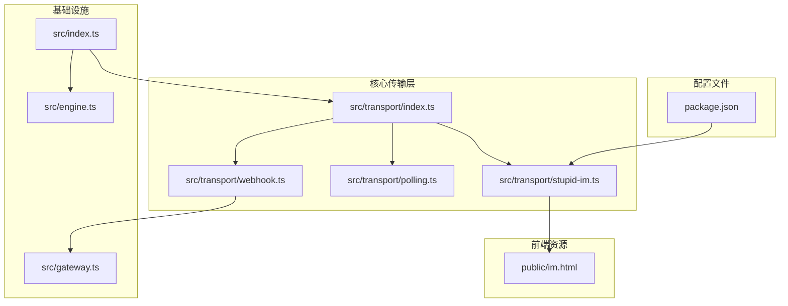

**图表来源**
- [src/transport/index.ts:1-71](file://src/transport/index.ts#L1-L71)
- [src/transport/stupid-im.ts:1-105](file://src/transport/stupid-im.ts#L1-L105)
- [src/gateway.ts:1-79](file://src/gateway.ts#L1-L79)

**章节来源**
- [src/transport/index.ts:1-71](file://src/transport/index.ts#L1-L71)
- [src/transport/stupid-im.ts:1-105](file://src/transport/stupid-im.ts#L1-L105)
- [src/gateway.ts:1-79](file://src/gateway.ts#L1-L79)

## 核心组件

### 传输层统一入口

StupidIM 的传输层通过统一入口文件实现了多种传输协议的支持：

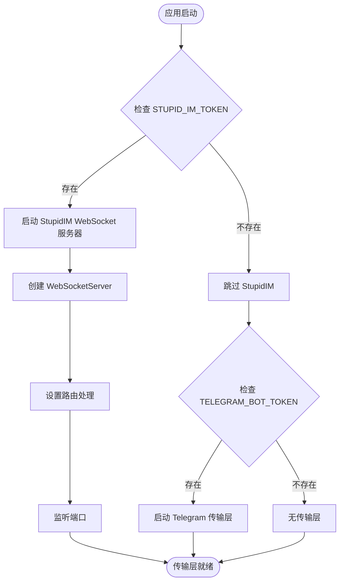

**图表来源**
- [src/transport/index.ts:47-70](file://src/transport/index.ts#L47-L70)
- [src/transport/stupid-im.ts:24-50](file://src/transport/stupid-im.ts#L24-L50)

### WebSocket 服务器实现

StupidIM 使用 ws 库实现了高性能的 WebSocket 服务器，支持以下核心功能：

- **连接认证**：基于 URL 参数的简单认证机制
- **消息路由**：将消息转发到业务处理层
- **状态管理**：维护连接状态和聊天会话
- **错误处理**：完善的异常捕获和错误响应

**章节来源**
- [src/transport/stupid-im.ts:24-105](file://src/transport/stupid-im.ts#L24-L105)

## 架构概览

StupidIM 采用了分层架构设计，实现了传输层与业务层的清晰分离：

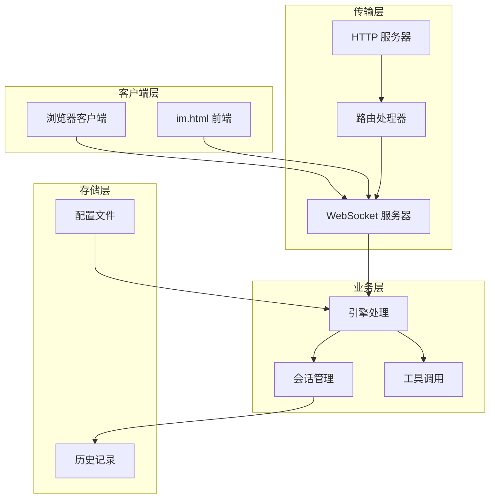

**图表来源**
- [src/transport/stupid-im.ts:24-105](file://src/transport/stupid-im.ts#L24-L105)
- [src/engine.ts:19-706](file://src/engine.ts#L19-L706)

## 详细组件分析

### WebSocket 连接建立

#### 连接认证机制

StupidIM 实现了基于 URL 参数的简单认证机制：

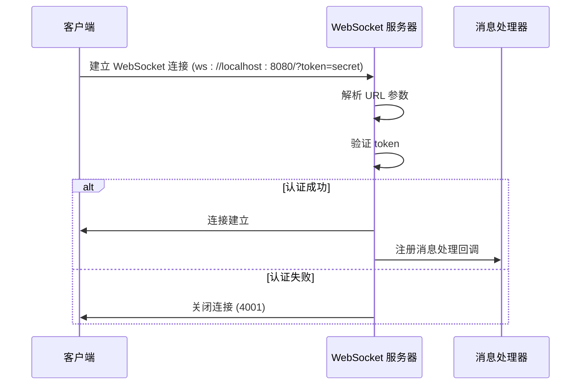

**图表来源**
- [src/transport/stupid-im.ts:65-71](file://src/transport/stupid-im.ts#L65-L71)

#### 连接参数配置

客户端连接时需要提供以下参数：

| 参数名称 | 必需性 | 描述 | 默认值 |
|---------|--------|------|--------|
| token | 必需 | 访问令牌 | 无 |
| chatId | 可选 | 聊天标识符 | 自动生成 |
| url | 必需 | WebSocket 服务器地址 | 无 |

**章节来源**
- [src/transport/stupid-im.ts:52-58](file://src/transport/stupid-im.ts#L52-L58)
- [public/im.html:357-362](file://public/im.html#L357-L362)

### 消息处理机制

#### 消息格式规范

StupidIM 支持两种消息格式：

1. **文本消息**：直接发送字符串
2. **结构化消息**：JSON 格式，包含类型和内容

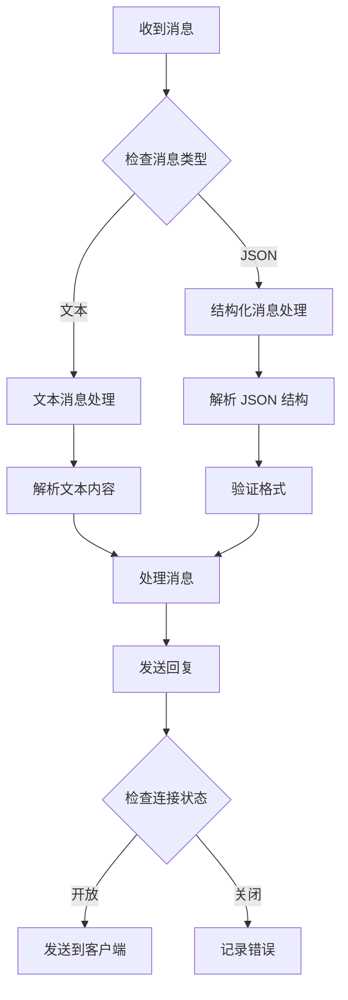

**图表来源**
- [src/transport/stupid-im.ts:76-98](file://src/transport/stupid-im.ts#L76-L98)

#### 业务层集成

消息处理流程与业务层的集成点：

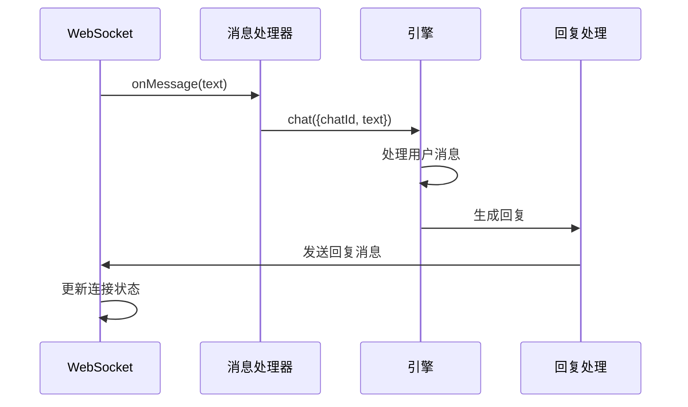

**图表来源**
- [src/transport/stupid-im.ts:80-94](file://src/transport/stupid-im.ts#L80-L94)
- [src/index.ts:189-208](file://src/index.ts#L189-L208)

**章节来源**
- [src/transport/stupid-im.ts:76-98](file://src/transport/stupid-im.ts#L76-L98)
- [src/index.ts:189-208](file://src/index.ts#L189-L208)

### 心跳机制实现

#### 打字指示器机制

StupidIM 实现了基于定时器的心跳机制，用于模拟打字状态：

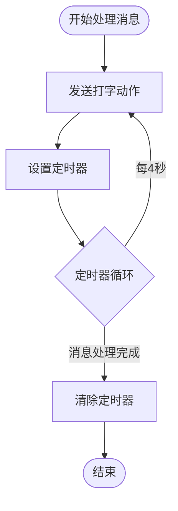

**图表来源**
- [src/index.ts:189-207](file://src/index.ts#L189-L207)

#### 连接状态监控

WebSocket 连接的状态监控和异常处理：

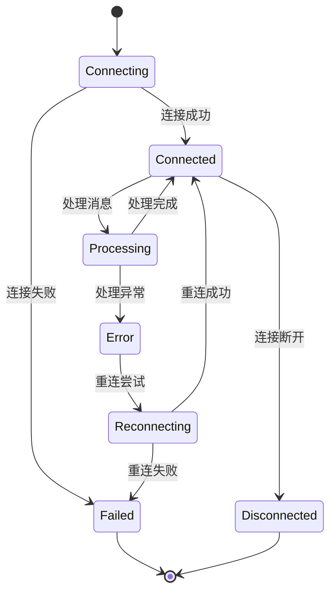

**图表来源**
- [src/transport/stupid-im.ts:100-103](file://src/transport/stupid-im.ts#L100-L103)
- [public/im.html:394-406](file://public/im.html#L394-L406)

**章节来源**
- [src/index.ts:189-207](file://src/index.ts#L189-L207)
- [src/transport/stupid-im.ts:100-103](file://src/transport/stupid-im.ts#L100-L103)

### 扩展示例

#### 扩展消息类型

要添加新的消息类型，需要修改以下组件：

1. **消息处理器**：更新消息解析逻辑
2. **前端界面**：添加相应的 UI 组件
3. **业务逻辑**：实现新类型的消息处理

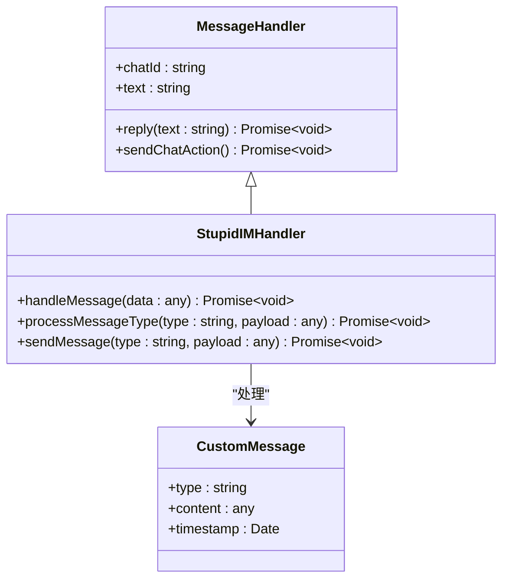

**图表来源**
- [src/transport/stupid-im.ts:80-94](file://src/transport/stupid-im.ts#L80-L94)

#### 添加认证机制

扩展认证机制的步骤：

1. **服务器端**：实现更复杂的认证逻辑
2. **客户端**：更新连接参数和认证流程
3. **安全策略**：添加令牌管理和过期处理

**章节来源**
- [src/transport/stupid-im.ts:65-71](file://src/transport/stupid-im.ts#L65-L71)
- [public/im.html:340-407](file://public/im.html#L340-L407)

#### 实现消息队列

为了支持异步消息处理，可以实现消息队列：

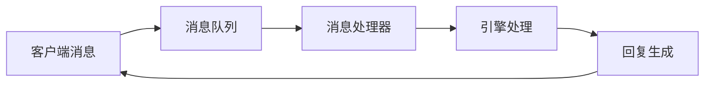

**图表来源**
- [src/transport/stupid-im.ts:76-98](file://src/transport/stupid-im.ts#L76-L98)

#### 处理连接异常

异常处理的最佳实践：

1. **连接异常**：重连机制和错误恢复
2. **消息异常**：消息重发和确认机制
3. **系统异常**：优雅降级和状态同步

**章节来源**
- [src/transport/stupid-im.ts:100-103](file://src/transport/stupid-im.ts#L100-L103)
- [public/im.html:387-406](file://public/im.html#L387-L406)

### 前端交互方式

#### im.html 与 WebSocket 的交互

前端通过 im.html 实现与 WebSocket 服务器的实时通信：

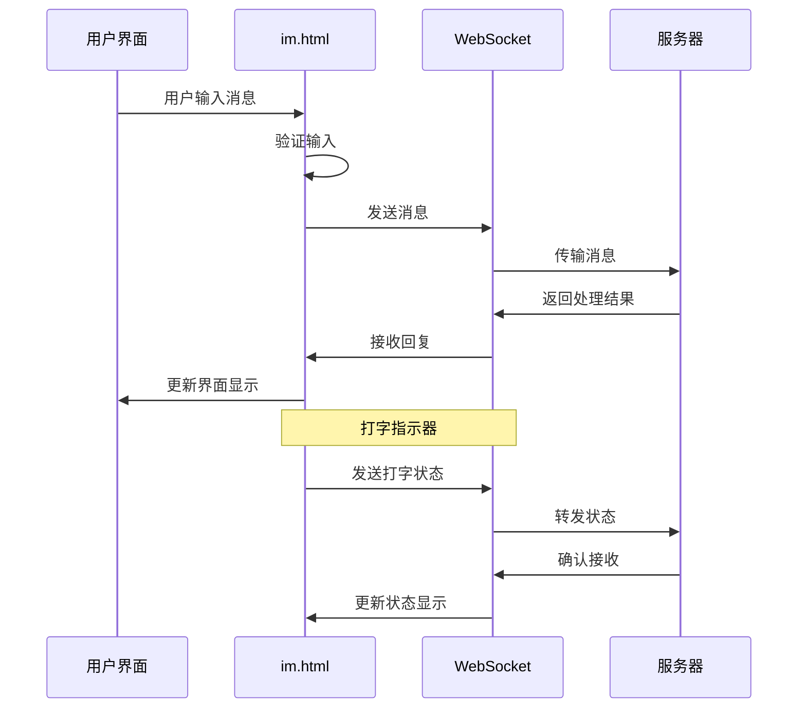

**图表来源**
- [public/im.html:278-425](file://public/im.html#L278-L425)

#### 实时通信最佳实践

1. **连接管理**：实现自动重连和连接状态监控
2. **消息处理**：确保消息的有序性和完整性
3. **用户体验**：提供流畅的交互反馈和状态指示
4. **错误处理**：优雅处理网络异常和服务器错误

**章节来源**
- [public/im.html:278-425](file://public/im.html#L278-L425)

## 依赖关系分析

### 外部依赖

StupidIM 主要依赖以下外部库：

```mermaid
graph TB
subgraph "核心依赖"
A[ws@^8.19.0]
B[@mariozechner/pi-coding-agent]
C[dotenv@^17.3.1]
end
subgraph "开发依赖"
D[@types/node]
E[@types/ws]
F[tsx]
G[typescript]
end
subgraph "应用层"
H[StupidIM 传输层]
I[引擎处理]
J[前端界面]
end
A --> H
B --> I
C --> H
D --> H
E --> H
F --> H
G --> H
H --> I
H --> J
```

**图表来源**
- [package.json:30-37](file://package.json#L30-L37)

### 内部模块依赖

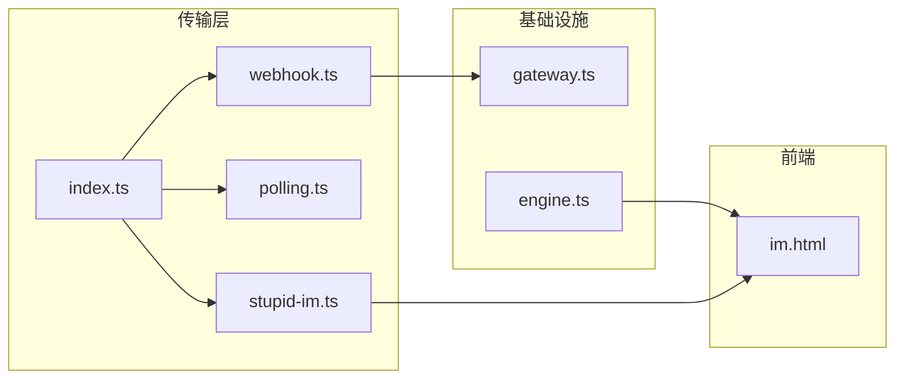

**图表来源**
- [src/transport/index.ts:1-71](file://src/transport/index.ts#L1-L71)
- [src/transport/stupid-im.ts:1-105](file://src/transport/stupid-im.ts#L1-L105)
- [src/gateway.ts:1-79](file://src/gateway.ts#L1-L79)

**章节来源**
- [package.json:30-37](file://package.json#L30-L37)
- [src/transport/index.ts:1-71](file://src/transport/index.ts#L1-L71)

## 性能考虑

### WebSocket 性能优化

1. **连接池管理**：合理管理 WebSocket 连接数量
2. **消息批处理**：批量处理相似消息减少开销
3. **内存管理**：及时清理不再使用的连接和消息
4. **网络优化**：压缩消息内容和优化传输协议

### 并发处理

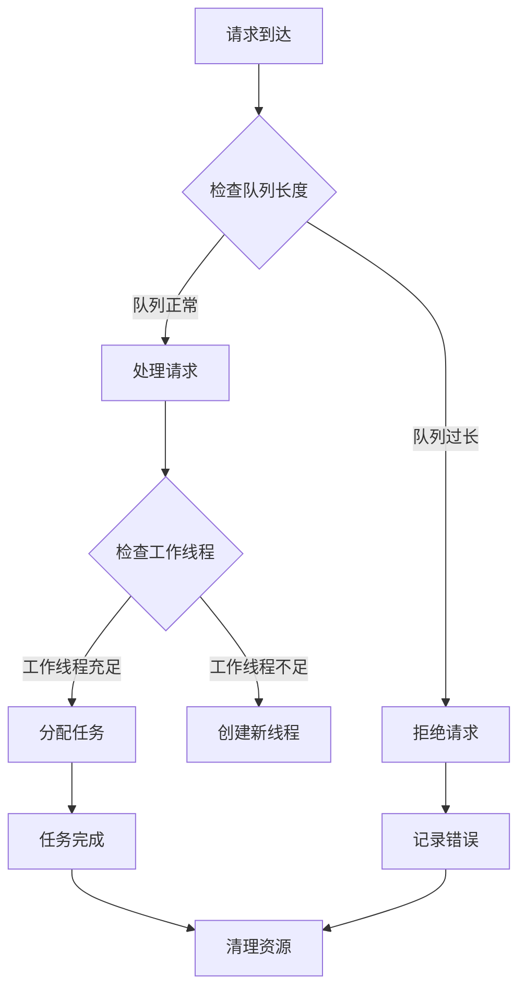

## 故障排除指南

### 常见问题诊断

#### 连接问题

| 问题症状 | 可能原因 | 解决方案 |
|---------|----------|----------|
| 连接被拒绝 | Token 错误 | 检查 STUPID_IM_TOKEN 配置 |
| 连接超时 | 端口不可达 | 检查防火墙和端口配置 |
| 连接断开 | 服务器重启 | 实现自动重连机制 |
| 认证失败 | URL 参数缺失 | 确保包含 token 和 chatId 参数 |

#### 消息处理问题

| 问题症状 | 可能原因 | 解决方案 |
|---------|----------|----------|
| 消息丢失 | 网络中断 | 实现消息确认和重发机制 |
| 消息乱序 | 并发处理 | 添加消息排序和去重逻辑 |
| 处理超时 | 业务逻辑阻塞 | 优化引擎处理性能 |
| 内存泄漏 | 连接未清理 | 实现连接生命周期管理 |

#### 前端交互问题

| 问题症状 | 可能原因 | 解决方案 |
|---------|----------|----------|
| 界面无响应 | JavaScript 错误 | 检查控制台错误信息 |
| 打字指示器不显示 | WebSocket 未连接 | 验证连接状态和事件监听 |
| 消息格式错误 | JSON 解析失败 | 检查消息格式和编码 |
| 状态显示异常 | DOM 更新问题 | 确保正确的状态更新逻辑 |

**章节来源**
- [src/transport/stupid-im.ts:65-71](file://src/transport/stupid-im.ts#L65-L71)
- [public/im.html:387-406](file://public/im.html#L387-L406)

## 结论

StupidIM WebSocket 传输层扩展为 StupidClaw 项目提供了强大的实时通信能力。通过模块化的架构设计和清晰的抽象层次，该实现成功地将传输层与业务层解耦，为后续的功能扩展奠定了坚实的基础。

### 主要优势

1. **架构清晰**：分层设计使得各组件职责明确，易于维护和扩展
2. **性能优秀**：基于 WebSocket 的实时通信提供了低延迟的消息传递
3. **扩展性强**：统一的接口设计支持多种传输协议的无缝切换
4. **用户体验好**：完整的前端界面和状态管理提供了流畅的交互体验

### 技术亮点

1. **认证机制**：简单的 URL 参数认证确保了基本的安全性
2. **心跳管理**：定时器机制实现了可靠的连接状态监控
3. **错误处理**：完善的异常捕获和恢复机制提高了系统稳定性
4. **前端集成**：完整的 HTML 界面提供了直观的用户交互

### 未来发展方向

1. **增强认证**：实现更复杂的身份验证和授权机制
2. **消息持久化**：添加消息存储和历史记录功能
3. **集群支持**：支持多实例部署和负载均衡
4. **监控告警**：添加详细的性能监控和异常告警

## 附录

### 配置参考

#### 环境变量配置

| 变量名称 | 类型 | 默认值 | 描述 |
|---------|------|--------|------|
| STUPID_IM_TOKEN | 字符串 | 无 | WebSocket 访问令牌 |
| PORT | 数字 | 8080 | 服务器监听端口 |
| STUPID_IM_CHAT_ID | 字符串 | 自动生成 | 默认聊天标识符 |

#### 前端配置参数

| 参数名称 | 类型 | 默认值 | 描述 |
|---------|------|--------|------|
| wsUrl | 字符串 | ws://localhost:8080 | WebSocket 服务器地址 |
| token | 字符串 | 无 | 认证令牌 |
| chatId | 字符串 | 自动生成 | 聊天会话标识符 |

### API 参考

#### WebSocket 消息格式

**发送消息**
```json
{
  "type": "message",
  "text": "用户消息内容"
}
```

**打字指示**
```json
{
  "type": "action",
  "action": "typing"
}
```

**系统通知**
```json
{
  "type": "system",
  "message": "系统消息",
  "level": "info"
}
```

### 扩展指南

#### 添加新的消息类型

1. **定义消息结构**：在前端和后端定义新的消息格式
2. **更新处理器**：添加消息类型的解析和处理逻辑
3. **实现 UI 组件**：为新消息类型添加前端显示组件
4. **测试验证**：确保新功能的正确性和稳定性

#### 实现自定义认证

1. **设计认证协议**：定义新的认证流程和令牌格式
2. **实现服务器端逻辑**：添加认证验证和令牌管理
3. **更新客户端实现**：修改前端连接和认证流程
4. **安全测试**：进行全面的安全性测试和验证