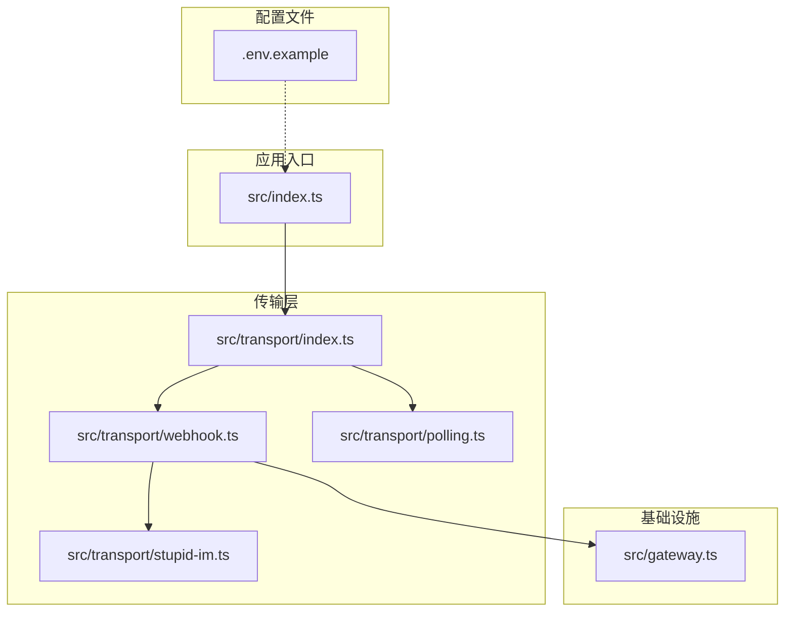
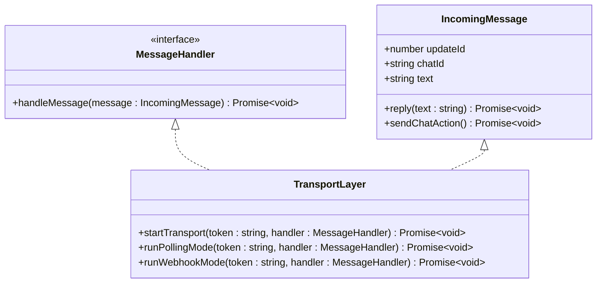
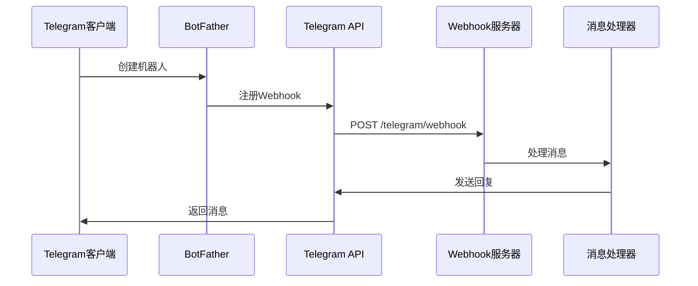
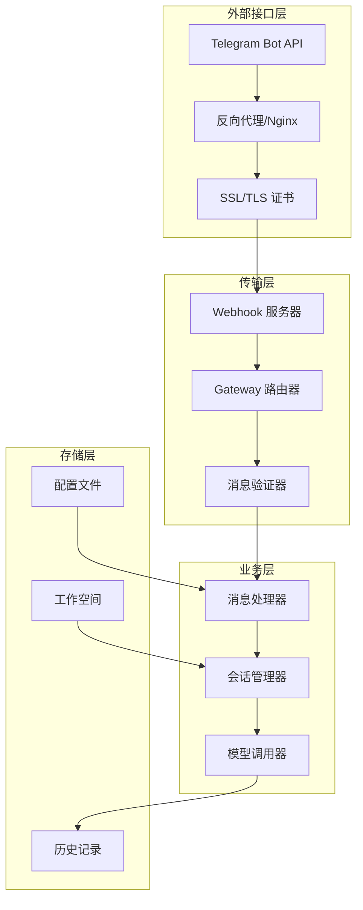
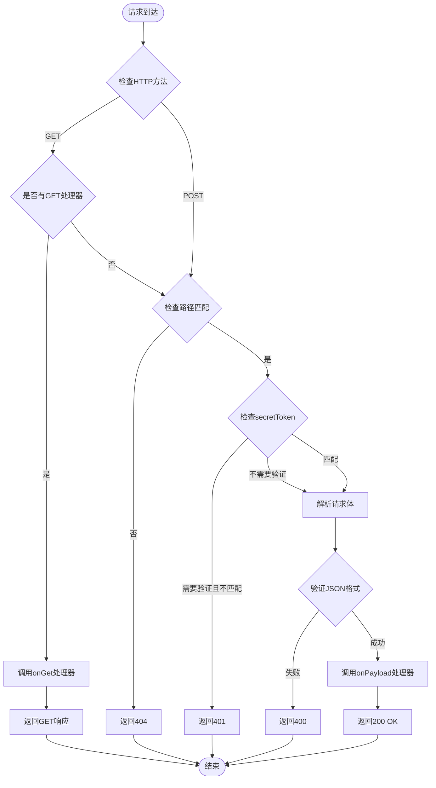
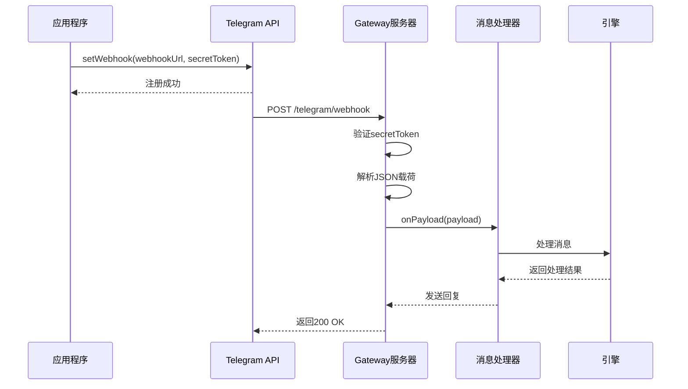
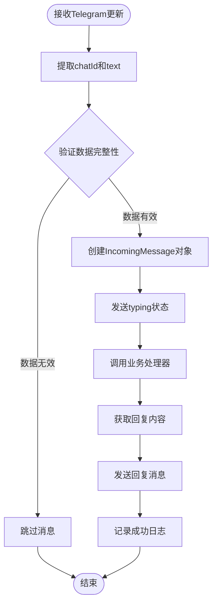
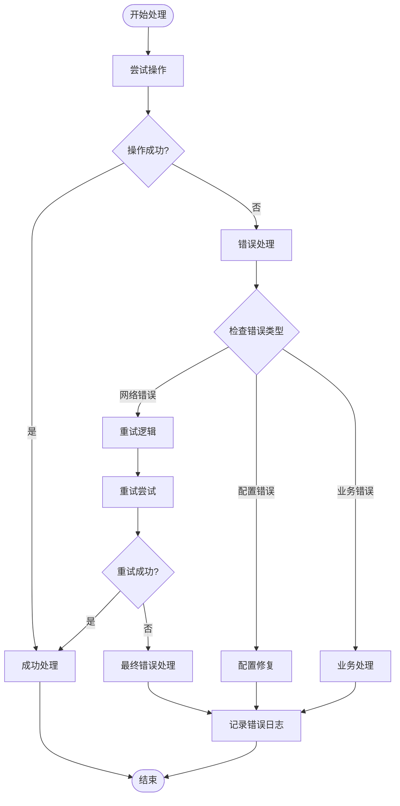
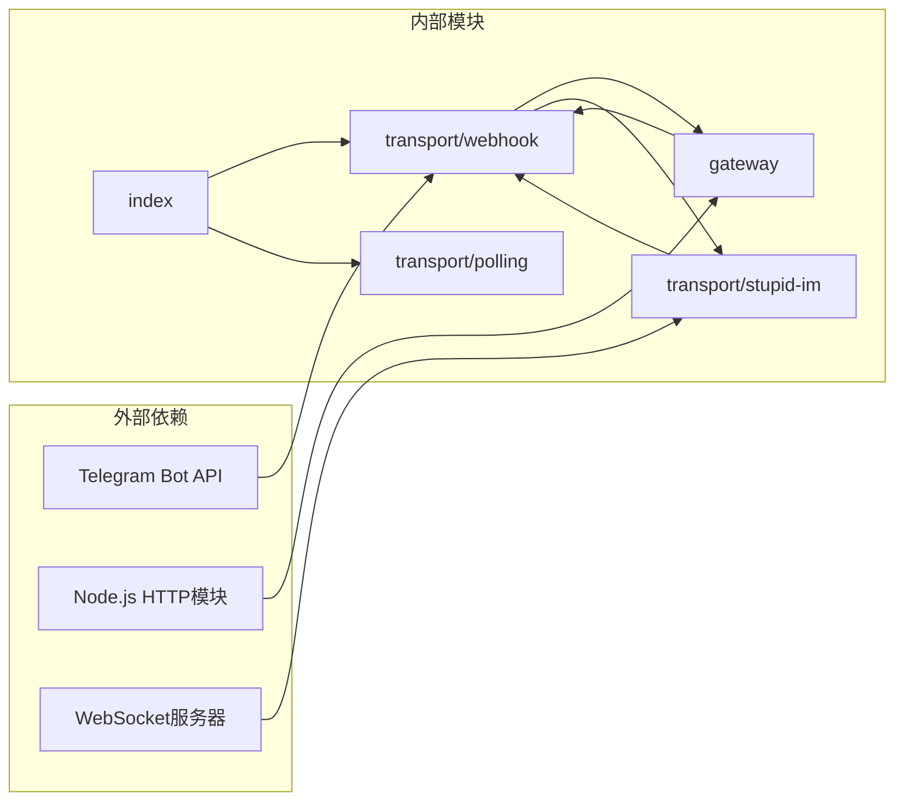

# Webhook 模式扩展

<cite>
**本文档引用的文件**
- [src/transport/webhook.ts](file://src/transport/webhook.ts)
- [src/transport/index.ts](file://src/transport/index.ts)
- [src/gateway.ts](file://src/gateway.ts)
- [src/transport/polling.ts](file://src/transport/polling.ts)
- [src/transport/stupid-im.ts](file://src/transport/stupid-im.ts)
- [src/index.ts](file://src/index.ts)
- [.env.example](file://.env.example)
- [StupidClaw-第2期-从Polling升级到Webhook.md](file://StupidClaw-第2期-从Polling升级到Webhook.md)
- [README.md](file://README.md)
</cite>

## 目录
1. [简介](#简介)
2. [项目结构](#项目结构)
3. [核心组件](#核心组件)
4. [架构概览](#架构概览)
5. [详细组件分析](#详细组件分析)
6. [依赖关系分析](#依赖关系分析)
7. [性能考虑](#性能考虑)
8. [故障排除指南](#故障排除指南)
9. [结论](#结论)
10. [附录](#附录)

## 简介

StupidClaw 项目实现了基于 Telegram Bot API 的 Webhook 模式传输层扩展，提供了从轮询模式到 Webhook 模式的无缝升级能力。本文档详细解释了 Webhook 的工作原理、HTTP 服务器实现、端口配置、路由处理、SSL 证书设置，以及如何处理 Webhook 请求、验证签名、实现错误恢复机制。

Webhook 模式相比轮询模式具有显著优势：无需持续轮询 API，减少服务器负载，提高响应速度，并支持更复杂的部署场景。该项目通过抽象传输层接口，实现了业务逻辑与传输方式的解耦，使得在不同传输模式间切换时无需修改核心业务代码。

## 项目结构

项目采用模块化的架构设计，将传输层功能分离到独立的模块中：



**图表来源**
- [src/index.ts:112-216](file://src/index.ts#L112-L216)
- [src/transport/index.ts:47-71](file://src/transport/index.ts#L47-L71)

**章节来源**
- [src/index.ts:112-216](file://src/index.ts#L112-L216)
- [src/transport/index.ts:1-71](file://src/transport/index.ts#L1-71)

## 核心组件

### 传输层统一接口

传输层通过统一的消息处理接口实现了模式切换的透明性：



**图表来源**
- [src/transport/index.ts:5-13](file://src/transport/index.ts#L5-L13)
- [src/transport/index.ts:47-71](file://src/transport/index.ts#L47-L71)

### Webhook 模式实现

Webhook 模式通过 Telegram Bot API 的 setWebhook 方法注册回调 URL，并使用轻量级 HTTP 服务器接收更新：



**图表来源**
- [src/transport/webhook.ts:19-37](file://src/transport/webhook.ts#L19-L37)
- [src/transport/webhook.ts:41-85](file://src/transport/webhook.ts#L41-L85)

**章节来源**
- [src/transport/index.ts:47-71](file://src/transport/index.ts#L47-L71)
- [src/transport/webhook.ts:1-86](file://src/transport/webhook.ts#L1-L86)

## 架构概览

Webhook 模式的整体架构分为四个层次：



**图表来源**
- [src/gateway.ts:27-79](file://src/gateway.ts#L27-L79)
- [src/transport/webhook.ts:57-85](file://src/transport/webhook.ts#L57-L85)

## 详细组件分析

### Gateway 服务器组件

Gateway 服务器是 Webhook 模式的核心组件，负责处理 HTTP 请求、验证签名和路由分发：



**图表来源**
- [src/gateway.ts:27-79](file://src/gateway.ts#L27-L79)

#### Gateway 配置参数

Gateway 服务器支持灵活的配置选项：

| 配置项 | 类型 | 默认值 | 描述 |
|--------|------|--------|------|
| port | number | 8787 | 服务器监听端口 |
| path | string | /telegram/webhook | Webhook 路径 |
| secretToken | string | undefined | 可选的签名验证令牌 |
| onPayload | function | 必需 | 处理消息载荷的回调函数 |
| onServerCreated | function | undefined | 服务器创建后的回调 |
| onGet | function | undefined | GET 请求处理器 |

**章节来源**
- [src/gateway.ts:7-14](file://src/gateway.ts#L7-L14)
- [src/gateway.ts:27-79](file://src/gateway.ts#L27-L79)

### Webhook 模式实现

Webhook 模式通过 Telegram Bot API 的 setWebhook 方法注册回调 URL，并实现完整的请求处理流程：



**图表来源**
- [src/transport/webhook.ts:41-85](file://src/transport/webhook.ts#L41-L85)

#### Webhook 配置选项

Webhook 模式的关键配置参数：

| 环境变量 | 类型 | 默认值 | 描述 |
|----------|------|--------|------|
| TELEGRAM_MODE | string | polling | 传输模式选择 |
| TELEGRAM_WEBHOOK_URL | string | 必需 | Webhook 回调URL |
| TELEGRAM_WEBHOOK_SECRET | string | undefined | Webhook 签名密钥 |
| TELEGRAM_WEBHOOK_PATH | string | /telegram/webhook | Webhook 路径 |
| PORT | number | 8787 | 服务器端口 |

**章节来源**
- [src/transport/webhook.ts:41-55](file://src/transport/webhook.ts#L41-L55)
- [.env.example:57-61](file://.env.example#L57-L61)

### 消息处理流程

Webhook 模式的消息处理流程确保了与轮询模式的完全兼容性：



**图表来源**
- [src/transport/webhook.ts:71-83](file://src/transport/webhook.ts#L71-L83)

**章节来源**
- [src/transport/webhook.ts:71-83](file://src/transport/webhook.ts#L71-L83)

### 错误处理和恢复机制

系统实现了多层次的错误处理和恢复机制：



**图表来源**
- [src/transport/polling.ts:39-44](file://src/transport/polling.ts#L39-L44)
- [src/transport/polling.ts:52-89](file://src/transport/polling.ts#L52-L89)

**章节来源**
- [src/transport/polling.ts:39-44](file://src/transport/polling.ts#L39-L44)
- [src/transport/polling.ts:52-89](file://src/transport/polling.ts#L52-L89)

## 依赖关系分析

Webhook 模式的依赖关系清晰明确，各组件职责分离：



**图表来源**
- [src/transport/webhook.ts:1-3](file://src/transport/webhook.ts#L1-L3)
- [src/gateway.ts:1-5](file://src/gateway.ts#L1-L5)

**章节来源**
- [src/transport/webhook.ts:1-3](file://src/transport/webhook.ts#L1-L3)
- [src/gateway.ts:1-5](file://src/gateway.ts#L1-L5)

## 性能考虑

Webhook 模式相比轮询模式具有显著的性能优势：

### 1. 资源效率优化

- **CPU 使用率降低**：避免了轮询模式的周期性请求开销
- **内存占用减少**：无需维护轮询状态和队列
- **网络带宽节省**：只在有新消息时建立连接

### 2. 响应延迟改善

- **实时性提升**：消息到达几乎无延迟
- **连接复用**：HTTP/1.1 Keep-Alive 减少连接建立开销
- **并发处理**：支持多请求并发处理

### 3. 扩展性考虑

- **水平扩展**：支持多实例部署和负载均衡
- **弹性伸缩**：根据流量动态调整实例数量
- **资源隔离**：每个实例独立处理请求

## 故障排除指南

### 常见问题诊断

#### 1. Webhook 注册失败

**症状**：应用程序启动时报错，提示 setWebhook 失败

**解决方案**：
- 检查 TELEGRAM_WEBHOOK_URL 是否为公网可访问的 HTTPS URL
- 验证 Telegram Bot Token 的有效性
- 确认防火墙允许入站连接到指定端口

#### 2. 请求验证失败

**症状**：收到 401 未授权错误

**解决方案**：
- 确认 TELEGRAM_WEBHOOK_SECRET 配置正确
- 检查请求头 `x-telegram-bot-api-secret-token` 是否包含正确的密钥
- 验证签名算法的一致性

#### 3. 消息处理异常

**症状**：消息到达但处理失败

**解决方案**：
- 检查业务处理器的日志输出
- 验证消息载荷的 JSON 格式
- 确认引擎模块的可用性

### 调试技巧

#### 1. 启用详细日志

```bash
DEBUG_STUPIDCLAW=1
DEBUG_PROMPT=1
```

#### 2. 网络连通性测试

```bash
# 测试端口连通性
telnet your-domain.com 443

# 测试 Webhook URL
curl -I https://your-domain.com/telegram/webhook
```

#### 3. 请求模拟

```bash
# 模拟 Telegram 请求
curl -X POST https://your-domain.com/telegram/webhook \
  -H "Content-Type: application/json" \
  -H "x-telegram-bot-api-secret-token: your-secret-token" \
  -d '{"message":{"text":"test","chat":{"id":123}}}'
```

**章节来源**
- [src/gateway.ts:46-53](file://src/gateway.ts#L46-L53)
- [src/transport/webhook.ts:45-55](file://src/transport/webhook.ts#L45-L55)

## 结论

StupidClaw 的 Webhook 模式传输层扩展成功实现了以下目标：

### 主要成就

1. **架构解耦**：通过抽象传输层接口，实现了业务逻辑与传输方式的完全解耦
2. **无缝迁移**：支持在轮询和 Webhook 模式间无缝切换，业务代码无需修改
3. **性能优化**：相比轮询模式显著降低了资源消耗和响应延迟
4. **安全性保障**：实现了完整的请求验证和错误处理机制

### 技术亮点

- **轻量级实现**：Gateway 服务器仅 50 行核心代码，专注于路由和验证
- **灵活配置**：支持多种配置选项，适应不同的部署场景
- **错误恢复**：完善的错误处理和重试机制
- **监控友好**：清晰的日志输出和状态报告

### 未来改进方向

1. **负载均衡支持**：扩展对多实例部署的支持
2. **健康检查**：添加服务器健康状态监控
3. **限流机制**：实现请求频率限制和防护
4. **指标收集**：集成性能指标和监控数据

## 附录

### 配置参考

#### 基础配置

```dotenv
# 传输模式选择
TELEGRAM_MODE=webhook

# Webhook 服务器配置
TELEGRAM_WEBHOOK_URL=https://your-domain.com/telegram/webhook
TELEGRAM_WEBHOOK_SECRET=your-secret-token
TELEGRAM_WEBHOOK_PATH=/telegram/webhook
PORT=8787
```

#### 高级配置

```dotenv
# SSL 证书配置
SSL_CERT_PATH=/path/to/certificate.pem
SSL_KEY_PATH=/path/to/private.key

# 反向代理配置
PROXY_PASS=http://localhost:8787
PROXY_TIMEOUT=300s
```

### 部署最佳实践

#### 1. 生产环境部署

- 使用 HTTPS 和有效的 SSL 证书
- 配置反向代理（Nginx/Apache）进行负载均衡
- 设置适当的超时和连接限制
- 启用访问日志和错误日志

#### 2. 安全配置

- 限制请求大小和频率
- 实施 CORS 策略
- 配置防火墙规则
- 定期更新和轮换密钥

#### 3. 监控和告警

- 监控服务器 CPU 和内存使用率
- 设置错误率和响应时间告警
- 记录关键业务指标
- 定期备份配置和日志

**章节来源**
- [.env.example:57-69](file://.env.example#L57-L69)
- [StupidClaw-第2期-从Polling升级到Webhook.md:98-113](file://StupidClaw-第2期-从Polling升级到Webhook.md#L98-L113)