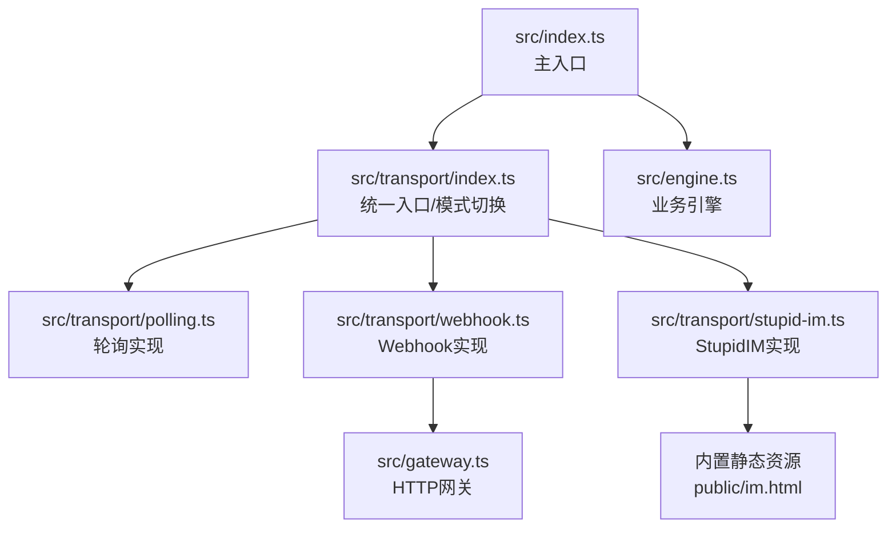
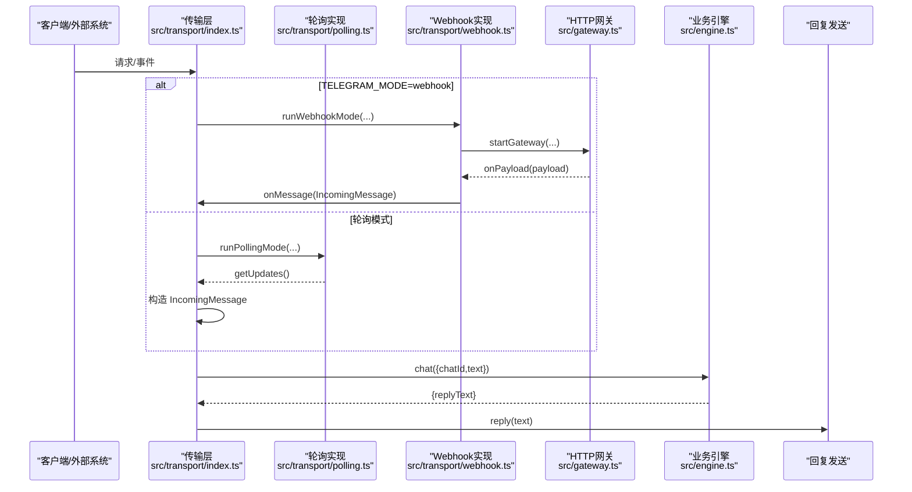
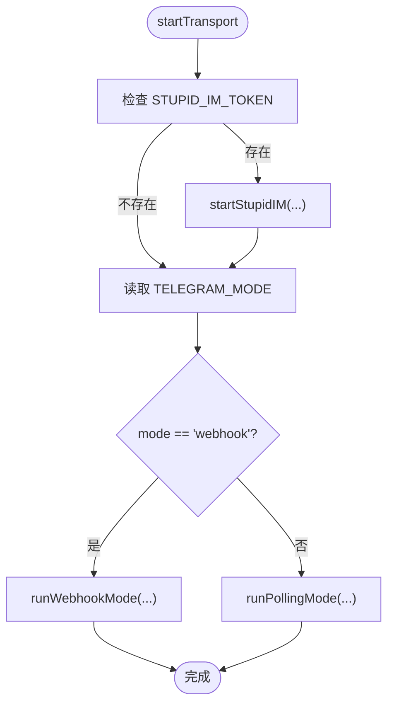
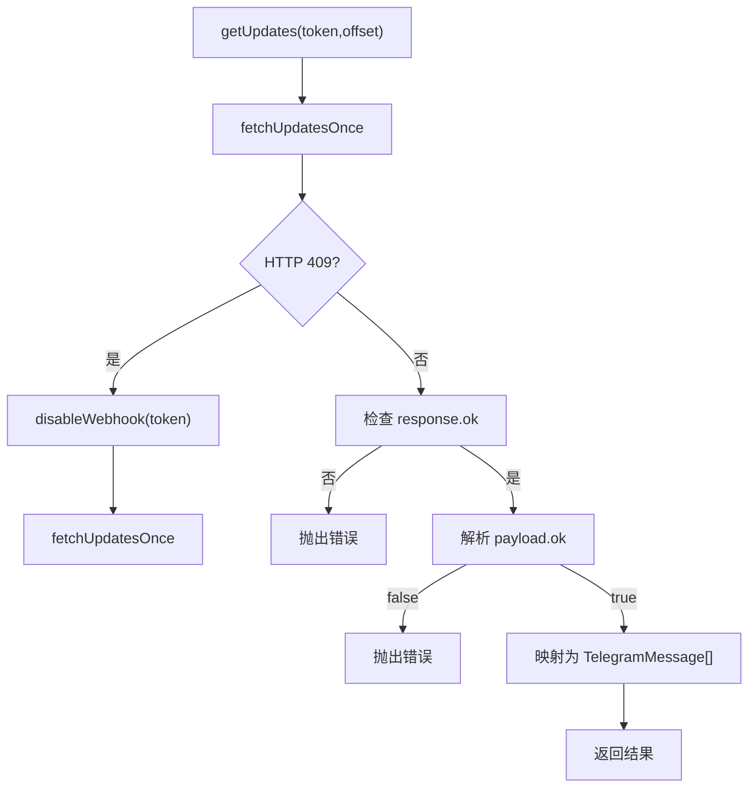
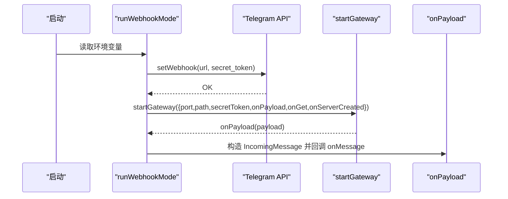
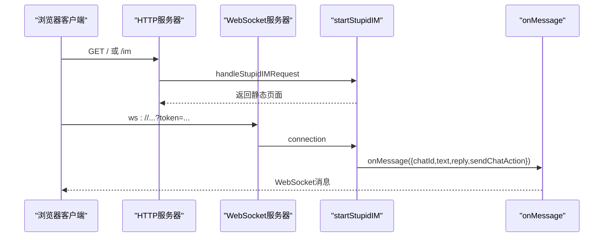
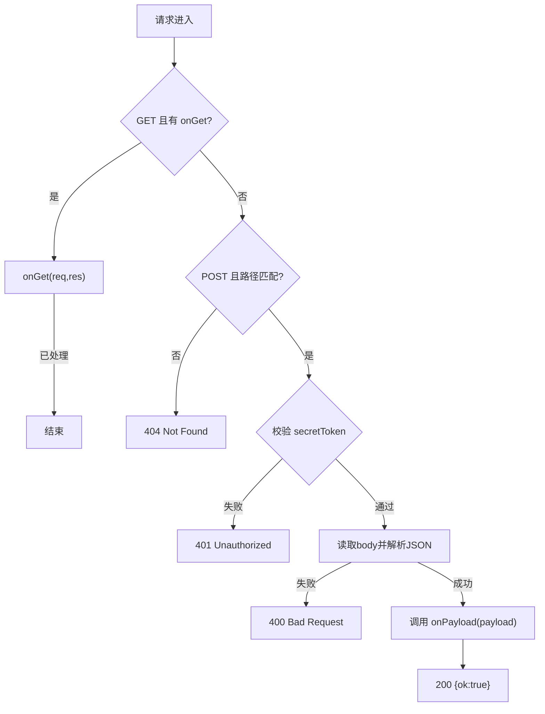
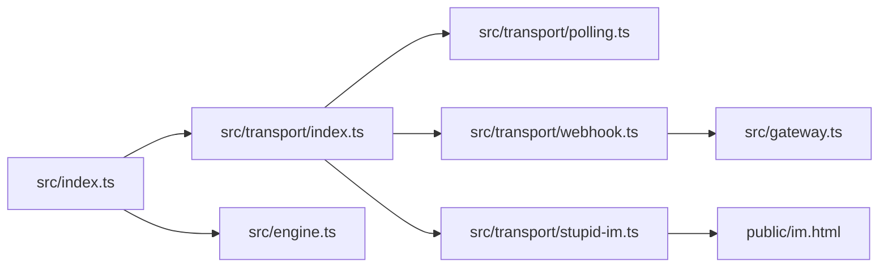

# 传输层扩展

<cite>
**本文引用的文件列表**
- [src/index.ts](file://src/index.ts)
- [src/engine.ts](file://src/engine.ts)
- [src/transport/index.ts](file://src/transport/index.ts)
- [src/transport/polling.ts](file://src/transport/polling.ts)
- [src/transport/webhook.ts](file://src/transport/webhook.ts)
- [src/transport/stupid-im.ts](file://src/transport/stupid-im.ts)
- [src/gateway.ts](file://src/gateway.ts)
- [README.md](file://README.md)
- [package.json](file://package.json)
</cite>

## 目录
1. [简介](#简介)
2. [项目结构](#项目结构)
3. [核心组件](#核心组件)
4. [架构总览](#架构总览)
5. [详细组件分析](#详细组件分析)
6. [依赖关系分析](#依赖关系分析)
7. [性能考量](#性能考量)
8. [故障排查指南](#故障排查指南)
9. [结论](#结论)
10. [附录](#附录)

## 简介
本指南面向需要扩展现有传输层架构的开发者，目标是帮助你在不改动业务层的前提下，新增传输协议或修改现有传输方式的实现。文档将系统讲解传输层的接口契约、消息格式规范、错误处理机制，并给出从接口定义到实现类编写、注册与测试的完整扩展流程。同时，针对 Polling、Webhook、StupidIM 三种传输方式，提供实现原理与扩展要点，确保你能够安全、可控地接入新的传输通道。

## 项目结构
传输层位于 src/transport 目录，核心文件包括：
- 统一入口与模式切换：src/transport/index.ts
- 轮询实现：src/transport/polling.ts
- Webhook 实现：src/transport/webhook.ts
- StupidIM 实现：src/transport/stupid-im.ts
- 通用网关：src/gateway.ts
- 主入口与业务集成：src/index.ts
- 业务引擎：src/engine.ts

图表来源
- [src/index.ts:112-209](file://src/index.ts#L112-L209)
- [src/transport/index.ts:47-70](file://src/transport/index.ts#L47-L70)
- [src/transport/polling.ts:52-89](file://src/transport/polling.ts#L52-L89)
- [src/transport/webhook.ts:41-85](file://src/transport/webhook.ts#L41-L85)
- [src/transport/stupid-im.ts:24-105](file://src/transport/stupid-im.ts#L24-L105)
- [src/gateway.ts:27-79](file://src/gateway.ts#L27-L79)

章节来源
- [src/index.ts:112-209](file://src/index.ts#L112-L209)
- [src/transport/index.ts:47-70](file://src/transport/index.ts#L47-L70)
- [README.md:22-52](file://README.md#L22-L52)

## 核心组件
- 统一消息契约
  - IncomingMessage：统一的消息输入结构，包含 chatId、text，以及 reply 与 sendChatAction 两个回调方法。
  - MessageHandler：接收 IncomingMessage 的异步处理函数类型。
- 传输层统一入口
  - startTransport：根据 TELEGRAM_MODE 切换到 polling 或 webhook；若配置 STUPID_IM_TOKEN，则同时启动 StupidIM。
- 通用网关
  - startGateway：提供 HTTP 服务器，负责校验请求、解析 JSON、回调 onPayload，支持可选 secretToken 校验。

章节来源
- [src/transport/index.ts:5-17](file://src/transport/index.ts#L5-L17)
- [src/transport/index.ts:47-70](file://src/transport/index.ts#L47-L70)
- [src/gateway.ts:7-14](file://src/gateway.ts#L7-L14)
- [src/gateway.ts:27-79](file://src/gateway.ts#L27-L79)

## 架构总览
传输层通过统一入口抽象不同传输协议，业务层仅依赖 MessageHandler 契约，从而实现“传输升级但业务不动”。

图表来源
- [src/transport/index.ts:47-70](file://src/transport/index.ts#L47-L70)
- [src/transport/webhook.ts:41-85](file://src/transport/webhook.ts#L41-L85)
- [src/transport/polling.ts:52-89](file://src/transport/polling.ts#L52-L89)
- [src/gateway.ts:27-79](file://src/gateway.ts#L27-L79)
- [src/engine.ts:680-706](file://src/engine.ts#L680-L706)

## 详细组件分析

### 统一入口与模式切换（src/transport/index.ts）
- 功能职责
  - 读取 TELEGRAM_MODE（默认 polling），决定启动轮询还是 Webhook。
  - 若配置 STUPID_IM_TOKEN，则启动 StupidIM。
  - 将外部消息转换为统一的 IncomingMessage 结构，注入 reply 与 sendChatAction 回调。
- 关键点
  - runPollingMode：循环拉取消息，遇到错误时休眠重试。
  - runWebhookMode：委托 startGateway，将 payload 映射为 IncomingMessage。
  - startStupidIM：在现有 HTTP 服务器或新建 HTTP 服务器上启动 WebSocket 服务。

图表来源
- [src/transport/index.ts:47-70](file://src/transport/index.ts#L47-L70)

章节来源
- [src/transport/index.ts:47-70](file://src/transport/index.ts#L47-L70)

### 轮询实现（src/transport/polling.ts）
- 功能职责
  - getUpdates：调用 Telegram API 获取更新，必要时禁用 Webhook 并重试。
  - sendMessage：将 Markdown 转为 HTML，按长度切片，优先使用 HTML 模式，失败则回退纯文本。
  - sendChatAction：发送 typing 状态（fire-and-forget，失败静默）。
- 错误处理
  - HTTP 状态非 2xx 抛出异常。
  - Telegram 返回 ok=false 抛出异常。
  - 发送消息失败时回退策略明确。
- 性能与可靠性
  - 使用 offset 避免重复消费。
  - 409 冲突时自动禁用 Webhook 并重试。
  - 消息长度限制与切片，避免超长导致失败。

图表来源
- [src/transport/polling.ts:52-89](file://src/transport/polling.ts#L52-L89)

章节来源
- [src/transport/polling.ts:52-89](file://src/transport/polling.ts#L52-L89)
- [src/transport/polling.ts:215-242](file://src/transport/polling.ts#L215-L242)
- [src/transport/polling.ts:202-213](file://src/transport/polling.ts#L202-L213)

### Webhook 实现（src/transport/webhook.ts）
- 功能职责
  - setWebhook：在启动时注册 Webhook URL，支持可选 secret_token。
  - runWebhookMode：调用 startGateway，设置 onPayload 将 TelegramUpdate 映射为 IncomingMessage。
  - onGet：支持 StupidIM 的 GET 请求，返回静态页面。
  - onServerCreated：在已有 HTTP 服务器上附加 StupidIM。
- 关键点
  - 通过 TELEGRAM_WEBHOOK_URL、TELEGRAM_WEBHOOK_SECRET、TELEGRAM_WEBHOOK_PATH、PORT 等环境变量控制行为。
  - 与 Gateway 的协作清晰，职责分离。

图表来源
- [src/transport/webhook.ts:41-85](file://src/transport/webhook.ts#L41-L85)
- [src/gateway.ts:27-79](file://src/gateway.ts#L27-L79)

章节来源
- [src/transport/webhook.ts:41-85](file://src/transport/webhook.ts#L41-L85)

### StupidIM 实现（src/transport/stupid-im.ts）
- 功能职责
  - handleStupidIMRequest：处理 GET / 或 /im，返回内置 HTML 页面。
  - startStupidIM：启动 WebSocket 服务，支持在已有 HTTP 服务器或新建 HTTP 服务器上运行。
  - 认证：通过 URL 参数 token 校验。
  - 消息处理：将客户端消息转为 IncomingMessage，调用 onMessage；支持发送消息与 typing 动作。
- 关键点
  - 与 Webhook 的 onGet 协作，共享 HTTP 服务器。
  - 通过环境变量控制端口、默认 chatId 等。

图表来源
- [src/transport/stupid-im.ts:11-22](file://src/transport/stupid-im.ts#L11-L22)
- [src/transport/stupid-im.ts:24-105](file://src/transport/stupid-im.ts#L24-L105)

章节来源
- [src/transport/stupid-im.ts:11-22](file://src/transport/stupid-im.ts#L11-L22)
- [src/transport/stupid-im.ts:24-105](file://src/transport/stupid-im.ts#L24-L105)

### 通用网关（src/gateway.ts）
- 功能职责
  - 创建 HTTP 服务器，校验路径与方法，支持可选 secretToken 校验。
  - 读取请求体并解析 JSON，回调 onPayload。
  - onGet 可选，用于处理 GET 请求（如 StupidIM）。
  - onServerCreated 可选，用于在服务器创建后附加其他服务。
- 错误处理
  - 方法/路径不匹配返回 404。
  - 缺少或不匹配 secretToken 返回 401。
  - 解析失败或回调异常返回 400。
  - 成功返回 200 并包含 { ok: true }。

图表来源
- [src/gateway.ts:27-79](file://src/gateway.ts#L27-L79)

章节来源
- [src/gateway.ts:27-79](file://src/gateway.ts#L27-L79)

## 依赖关系分析
- 模块耦合
  - index.ts 仅依赖 transport/index.ts，业务层依赖 engine.ts，形成清晰的分层。
  - transport/index.ts 仅导入各传输实现模块，不直接依赖业务层。
  - gateway.ts 与 transport/webhook.ts 协作，不依赖业务层。
- 外部依赖
  - ws：用于 StupidIM 的 WebSocket 服务。
  - node:http：用于 HTTP 服务器与网关。
  - Telegram API：轮询与 Webhook 的上游依赖。

图表来源
- [src/index.ts:10-10](file://src/index.ts#L10-L10)
- [src/transport/index.ts:1-3](file://src/transport/index.ts#L1-L3)
- [src/transport/webhook.ts:1-3](file://src/transport/webhook.ts#L1-L3)
- [src/transport/stupid-im.ts:1-6](file://src/transport/stupid-im.ts#L1-L6)

章节来源
- [package.json:30-37](file://package.json#L30-L37)
- [src/index.ts:10-10](file://src/index.ts#L10-L10)
- [src/transport/index.ts:1-3](file://src/transport/index.ts#L1-L3)

## 性能考量
- 轮询
  - 使用 offset 避免重复消费，减少无效请求。
  - 出错时 1 秒休眠重试，避免频繁拉取。
  - 消息长度切片与 HTML 优先策略，提升成功率与渲染质量。
- Webhook
  - 依赖 HTTP 网关，避免轮询开销。
  - secretToken 校验降低无效请求带来的压力。
- StupidIM
  - WebSocket 连接复用，消息即时送达。
  - 认证通过后仅在 OPEN 状态发送消息，避免无效写入。

章节来源
- [src/transport/index.ts:26-44](file://src/transport/index.ts#L26-L44)
- [src/transport/polling.ts:215-242](file://src/transport/polling.ts#L215-L242)
- [src/transport/webhook.ts:41-85](file://src/transport/webhook.ts#L41-L85)
- [src/gateway.ts:46-53](file://src/gateway.ts#L46-L53)
- [src/transport/stupid-im.ts:65-103](file://src/transport/stupid-im.ts#L65-L103)

## 故障排查指南
- 常见错误与定位
  - TELEGRAM_MODE 未配置：startTransport 会跳过 Telegram 轮询。
  - TELEGRAM_BOT_TOKEN 未配置：主入口会警告，Telegram 轮询与定时任务不会启动。
  - Webhook 启动失败：检查 TELEGRAM_WEBHOOK_URL、PORT、secretToken 设置。
  - 409 冲突：轮询实现会自动禁用 Webhook 并重试。
  - 401 未授权：secretToken 不匹配。
  - 400 请求体解析失败：请求体非 JSON 或路径/方法不匹配。
- 日志与调试
  - 传输层错误会打印 [error] 前缀的日志。
  - 主入口捕获致命错误并退出进程。
  - 可通过 DEBUG_STUPIDCLAW、DEBUG_PROMPT 等环境变量辅助调试。

章节来源
- [src/transport/index.ts:56-59](file://src/transport/index.ts#L56-L59)
- [src/index.ts:117-120](file://src/index.ts#L117-L120)
- [src/transport/polling.ts:57-60](file://src/transport/polling.ts#L57-L60)
- [src/gateway.ts:46-64](file://src/gateway.ts#L46-L64)
- [src/index.ts:211-215](file://src/index.ts#L211-L215)

## 结论
通过统一入口与消息契约，传输层实现了“传输升级但业务不动”的目标。轮询、Webhook、StupidIM 三种方式均以相同的数据结构与回调注入业务层，保证了扩展性与稳定性。按照本文提供的扩展流程，你可以安全地新增传输协议或修改现有实现，而不影响业务逻辑。

## 附录

### 扩展流程：从接口定义到实现与测试
- 步骤 1：定义传输接口契约
  - 在 src/transport/index.ts 中定义 IncomingMessage 与 MessageHandler 类型，确保新传输实现遵循同一契约。
- 步骤 2：实现传输适配器
  - 新建文件 src/transport/my-transport.ts，实现：
    - getUpdates 或接收事件的方法（轮询或事件回调）
    - sendMessage 与 sendChatAction（或等价的发送与动作通知）
    - 将外部消息映射为 IncomingMessage
- 步骤 3：注册与模式切换
  - 在 src/transport/index.ts 中：
    - 导入你的实现模块
    - 在 startTransport 中增加 TELEGRAM_MODE 的分支，调用你的 runMyTransportMode
- 步骤 4：集成网关（如需）
  - 若你的传输依赖 HTTP/WebSocket，参考 src/gateway.ts 与 src/transport/webhook.ts 的协作方式，提供 onPayload/onGet/onServerCreated。
- 步骤 5：测试与验证
  - 使用 TELEGRAM_MODE 切换到你的新传输，结合 TELEGRAM_BOT_TOKEN 或 STUPID_IM_TOKEN 进行端到端测试。
  - 观察日志中的 [error]/[ok] 输出，确认消息闭环与回复链路正常。
- 步骤 6：文档与配置
  - 在 README 或文档中补充新传输的环境变量与使用说明。

章节来源
- [src/transport/index.ts:5-17](file://src/transport/index.ts#L5-L17)
- [src/transport/index.ts:47-70](file://src/transport/index.ts#L47-L70)
- [src/transport/webhook.ts:41-85](file://src/transport/webhook.ts#L41-L85)
- [src/gateway.ts:27-79](file://src/gateway.ts#L27-L79)

### 三种传输方式的实现原理与扩展要点
- 轮询（Polling）
  - 原理：周期性调用 Telegram API 获取消息，使用 offset 避免重复。
  - 扩展要点：实现 getUpdates 与 sendMessage/sendChatAction；处理 409 冲突与失败重试。
- Webhook
  - 原理：注册 Webhook URL，由 Telegram 推送消息；通过 startGateway 解析与校验。
  - 扩展要点：实现 setWebhook 与 startGateway 的协作；支持可选 secretToken。
- StupidIM
  - 原理：内置 HTTP 服务器与 WebSocket 服务，浏览器直连，适合本地调试。
  - 扩展要点：实现 handleStupidIMRequest 与 startStupidIM；支持在已有 HTTP 服务器上附加。

章节来源
- [src/transport/polling.ts:52-89](file://src/transport/polling.ts#L52-L89)
- [src/transport/webhook.ts:41-85](file://src/transport/webhook.ts#L41-L85)
- [src/transport/stupid-im.ts:11-22](file://src/transport/stupid-im.ts#L11-L22)
- [src/transport/stupid-im.ts:24-105](file://src/transport/stupid-im.ts#L24-L105)