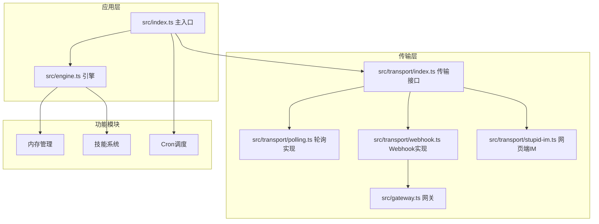
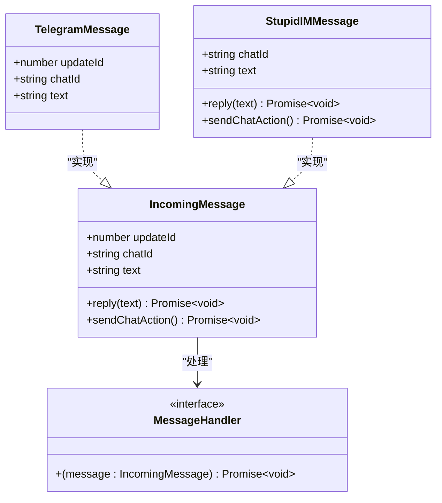
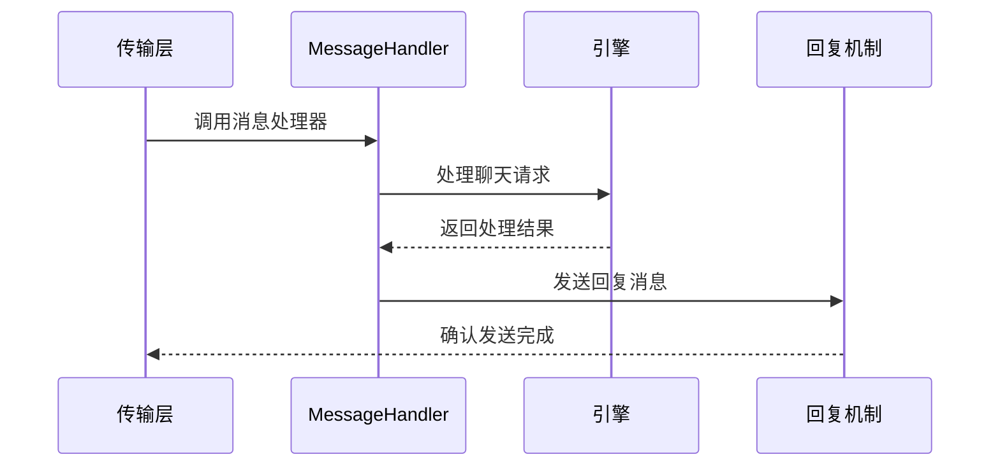
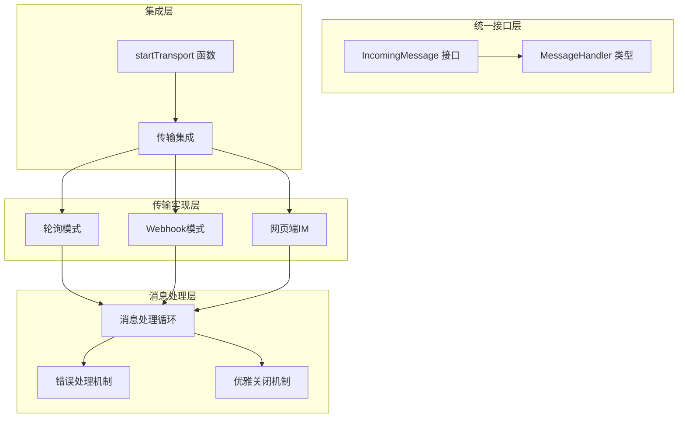
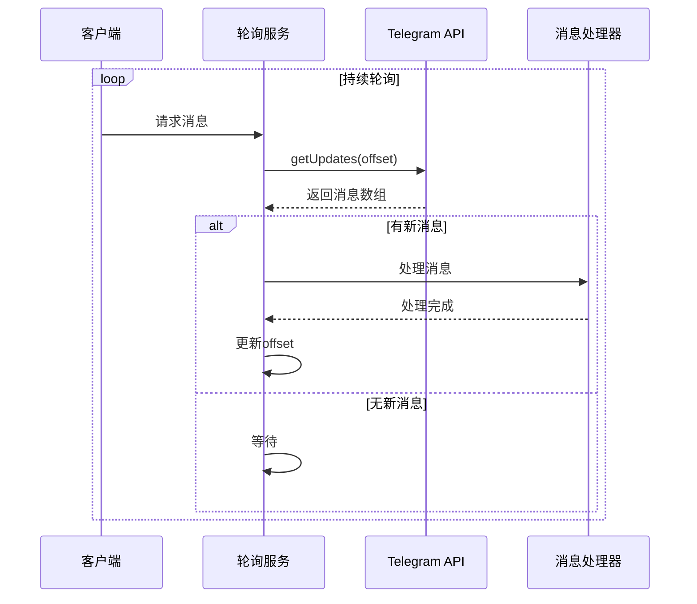
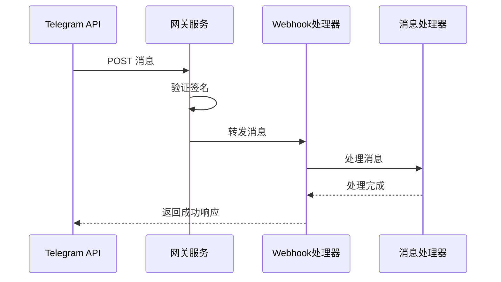
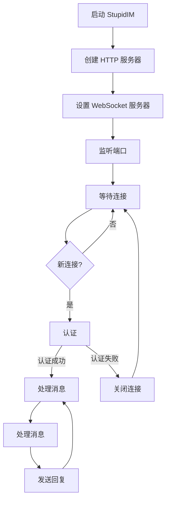
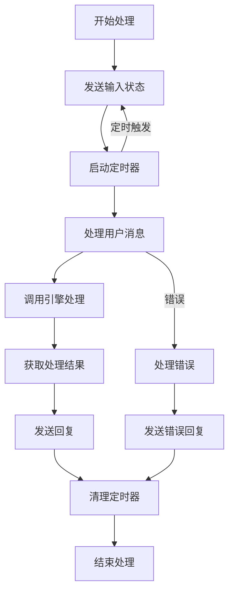
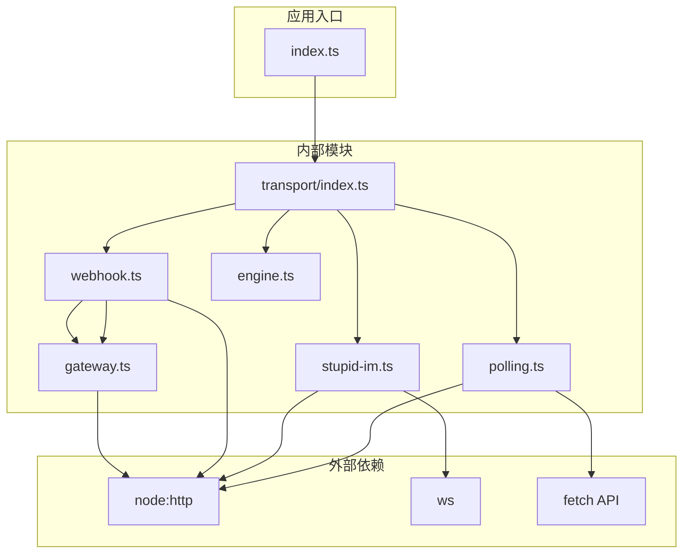

# 自定义传输接口实现

<cite>
**本文档引用的文件**
- [src/transport/index.ts](file://src/transport/index.ts)
- [src/transport/polling.ts](file://src/transport/polling.ts)
- [src/transport/stupid-im.ts](file://src/transport/stupid-im.ts)
- [src/transport/webhook.ts](file://src/transport/webhook.ts)
- [src/gateway.ts](file://src/gateway.ts)
- [src/engine.ts](file://src/engine.ts)
- [src/index.ts](file://src/index.ts)
- [README.md](file://README.md)
- [docs/getting-started.md](file://docs/getting-started.md)
</cite>

## 目录
1. [简介](#简介)
2. [项目结构](#项目结构)
3. [核心组件](#核心组件)
4. [架构概览](#架构概览)
5. [详细组件分析](#详细组件分析)
6. [依赖关系分析](#依赖关系分析)
7. [性能考虑](#性能考虑)
8. [故障排除指南](#故障排除指南)
9. [结论](#结论)
10. [附录](#附录)

## 简介

StupidClaw 是一个基于 pi-mono 底座的极简本地 Agent 系统，专门设计用于创建自定义传输协议实现。本文档提供了完整的指南，详细说明如何实现新的传输协议，包括接口契约、消息格式规范、错误处理机制，并提供实现模板和示例代码。

该项目的核心特性包括：
- 基于文件系统的纯文本存储，不引入数据库
- 支持多种传输方式：轮询模式、Webhook 模式、内置网页端 IM
- 极简设计，严格限制在指定目录内操作
- 支持多种 AI 模型供应商

## 项目结构

StupidClaw 采用模块化的架构设计，主要分为以下几个核心部分：



**图表来源**
- [src/index.ts:112-209](file://src/index.ts#L112-L209)
- [src/transport/index.ts:47-70](file://src/transport/index.ts#L47-L70)

**章节来源**
- [README.md:22-52](file://README.md#L22-L52)
- [src/index.ts:112-209](file://src/index.ts#L112-L209)

## 核心组件

### IncomingMessage 接口定义

IncomingMessage 接口是所有传输协议的统一抽象，定义了消息处理的标准契约：



**图表来源**
- [src/transport/index.ts:5-13](file://src/transport/index.ts#L5-L13)

### MessageHandler 类型定义

MessageHandler 是一个函数类型，负责处理传入的消息：



**图表来源**
- [src/transport/index.ts:19-45](file://src/transport/index.ts#L19-L45)
- [src/index.ts:189-208](file://src/index.ts#L189-L208)

**章节来源**
- [src/transport/index.ts:5-13](file://src/transport/index.ts#L5-L13)
- [src/index.ts:189-208](file://src/index.ts#L189-L208)

## 架构概览

StupidClaw 的传输层架构采用了统一接口设计，支持多种传输协议的无缝集成：



**图表来源**
- [src/transport/index.ts:47-70](file://src/transport/index.ts#L47-L70)
- [src/transport/polling.ts:19-45](file://src/transport/polling.ts#L19-L45)
- [src/transport/webhook.ts:41-85](file://src/transport/webhook.ts#L41-L85)
- [src/transport/stupid-im.ts:24-105](file://src/transport/stupid-im.ts#L24-L105)

## 详细组件分析

### 轮询模式实现

轮询模式是最基础的传输方式，通过定期轮询 API 获取新消息：



**图表来源**
- [src/transport/polling.ts:52-89](file://src/transport/polling.ts#L52-L89)
- [src/transport/index.ts:19-45](file://src/transport/index.ts#L19-L45)

#### 关键特性
- **offset 机制**：防止重复接收消息
- **错误重试**：网络异常时自动重试
- **消息过滤**：只处理有效的文本消息

**章节来源**
- [src/transport/polling.ts:52-89](file://src/transport/polling.ts#L52-L89)
- [src/transport/index.ts:19-45](file://src/transport/index.ts#L19-L45)

### Webhook 模式实现

Webhook 模式提供了更高效的实时消息传输：



**图表来源**
- [src/transport/webhook.ts:41-85](file://src/transport/webhook.ts#L41-L85)
- [src/gateway.ts:27-79](file://src/gateway.ts#L27-L79)

#### 关键特性
- **HTTP 网关**：统一的 HTTP 服务器
- **签名验证**：确保消息来源可信
- **并发处理**：支持多消息并发处理

**章节来源**
- [src/transport/webhook.ts:41-85](file://src/transport/webhook.ts#L41-L85)
- [src/gateway.ts:27-79](file://src/gateway.ts#L27-L79)

### 网页端 IM 实现

StupidIM 提供了内置的网页客户端，支持 WebSocket 通信：



**图表来源**
- [src/transport/stupid-im.ts:24-105](file://src/transport/stupid-im.ts#L24-L105)

#### 关键特性
- **WebSocket 通信**：实时双向通信
- **HTML 页面**：内置网页客户端
- **令牌认证**：URL 参数认证机制

**章节来源**
- [src/transport/stupid-im.ts:24-105](file://src/transport/stupid-im.ts#L24-L105)

### 消息处理循环

消息处理循环是传输层的核心逻辑：



**图表来源**
- [src/index.ts:189-208](file://src/index.ts#L189-L208)

**章节来源**
- [src/index.ts:189-208](file://src/index.ts#L189-L208)

## 依赖关系分析

传输层的依赖关系展现了清晰的层次结构：



**图表来源**
- [src/transport/index.ts:1-3](file://src/transport/index.ts#L1-L3)
- [src/transport/stupid-im.ts:1-6](file://src/transport/stupid-im.ts#L1-L6)
- [src/transport/webhook.ts:1-3](file://src/transport/webhook.ts#L1-L3)
- [src/gateway.ts:1-5](file://src/gateway.ts#L1-L5)

**章节来源**
- [src/transport/index.ts:1-3](file://src/transport/index.ts#L1-L3)
- [src/transport/stupid-im.ts:1-6](file://src/transport/stupid-im.ts#L1-L6)
- [src/transport/webhook.ts:1-3](file://src/transport/webhook.ts#L1-L3)

## 性能考虑

### 并发处理优化

传输层支持多消息并发处理，提高了系统吞吐量：

- **轮询模式**：单线程处理，适合低并发场景
- **Webhook 模式**：支持多连接并发，适合高并发场景
- **WebSocket 模式**：每个连接独立处理，适合实时交互

### 错误恢复机制

系统实现了多层次的错误处理和恢复机制：

- **网络异常重试**：自动重试失败的网络请求
- **连接异常处理**：WebSocket 连接断开后的自动重连
- **资源清理**：确保异常情况下资源得到正确释放

### 资源管理

- **连接池管理**：合理管理 HTTP 连接
- **内存使用优化**：避免内存泄漏
- **文件句柄管理**：确保文件操作的安全性

## 故障排除指南

### 常见问题诊断

#### 传输连接问题
1. **检查环境变量配置**
   - `TELEGRAM_BOT_TOKEN`：Telegram 机器人 Token
   - `TELEGRAM_MODE`：传输模式（polling/webhook）
   - `TELEGRAM_WEBHOOK_URL`：Webhook URL
   - `STUPID_IM_TOKEN`：网页端访问令牌

2. **验证网络连接**
   - 确认能够访问 Telegram API
   - 检查防火墙设置
   - 验证端口是否被占用

#### 消息处理问题
1. **检查消息格式**
   - 确认消息包含必要的字段
   - 验证消息编码格式
   - 检查消息长度限制

2. **调试消息处理**
   - 查看控制台日志
   - 检查错误堆栈信息
   - 验证回调函数执行

**章节来源**
- [src/index.ts:112-216](file://src/index.ts#L112-L216)
- [src/transport/index.ts:47-70](file://src/transport/index.ts#L47-L70)

## 结论

StupidClaw 的传输层设计展现了优秀的架构原则：

1. **统一接口设计**：通过 IncomingMessage 接口实现了传输协议的标准化
2. **模块化架构**：清晰的模块分离便于扩展和维护
3. **错误处理机制**：完善的错误处理和恢复机制确保系统稳定性
4. **性能优化**：支持多种传输模式适应不同场景需求

对于实现新的传输协议，开发者可以参考现有的三种实现模式，结合具体需求进行定制化开发。

## 附录

### 实现新传输协议的步骤

#### 1. 定义消息接口
```typescript
// 继承 IncomingMessage 接口
interface CustomMessage extends IncomingMessage {
  // 添加自定义字段
  customField?: string;
}
```

#### 2. 实现消息处理器
```typescript
// 实现 MessageHandler 类型
const customMessageHandler: MessageHandler = async (message) => {
  // 处理自定义消息
  await processCustomMessage(message);
};
```

#### 3. 集成到 startTransport 函数
```typescript
export async function startTransport(
  token: string | undefined,
  onMessage: MessageHandler
): Promise<void> {
  // 添加新传输方式的检测逻辑
  if (shouldUseCustomTransport()) {
    startCustomTransport(token, onMessage);
    return;
  }
  
  // 保持原有逻辑
  // ...
}
```

#### 4. 实现传输连接
```typescript
function startCustomTransport(token: string, onMessage: MessageHandler): void {
  // 实现自定义传输连接逻辑
  // 包括连接建立、消息监听、错误处理等
}
```

#### 5. 实现消息发送
```typescript
async function sendMessage(token: string, chatId: string, text: string): Promise<void> {
  // 实现自定义消息发送逻辑
  // 包括消息格式转换、发送、确认等
}
```

### 最佳实践建议

1. **遵循接口契约**：严格实现 IncomingMessage 接口的所有方法
2. **错误处理**：实现完善的错误处理和重试机制
3. **资源管理**：确保连接和资源的正确管理和释放
4. **性能优化**：考虑并发处理和连接池管理
5. **测试覆盖**：编写全面的单元测试和集成测试
6. **文档完善**：提供详细的使用说明和配置指南

通过遵循这些指导原则，开发者可以成功实现新的传输协议，为 StupidClaw 系统增加更多的通信方式选择。