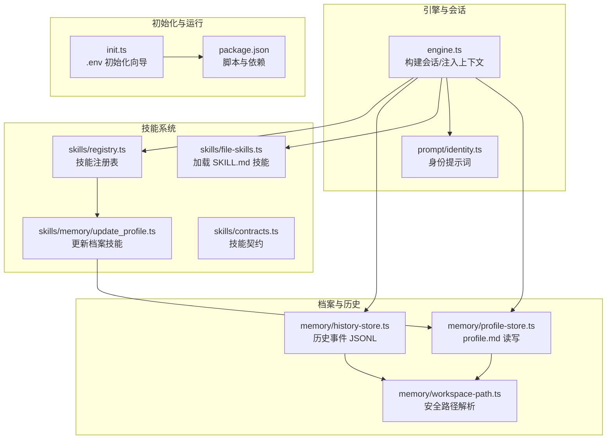
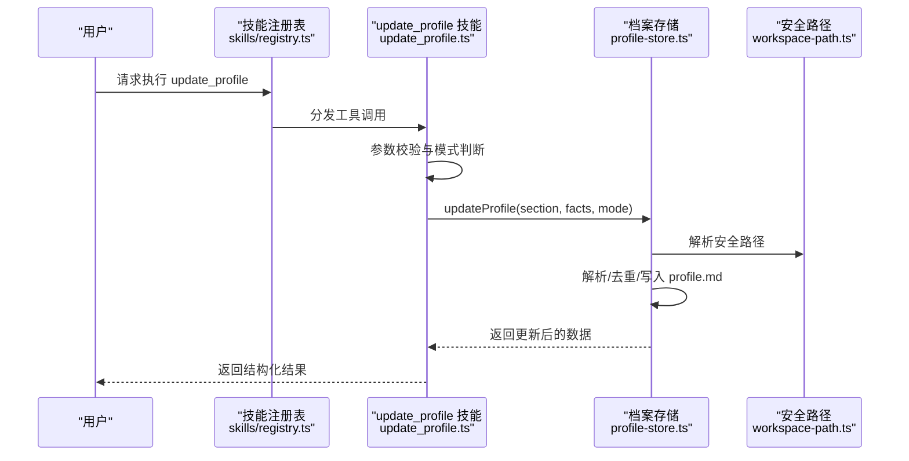
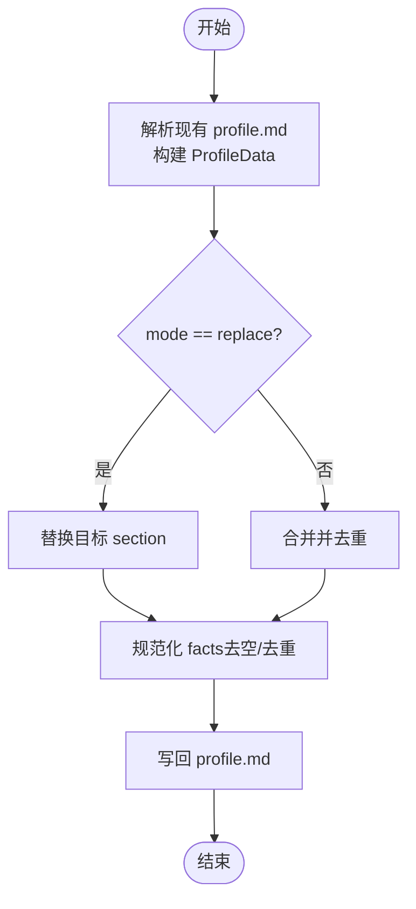
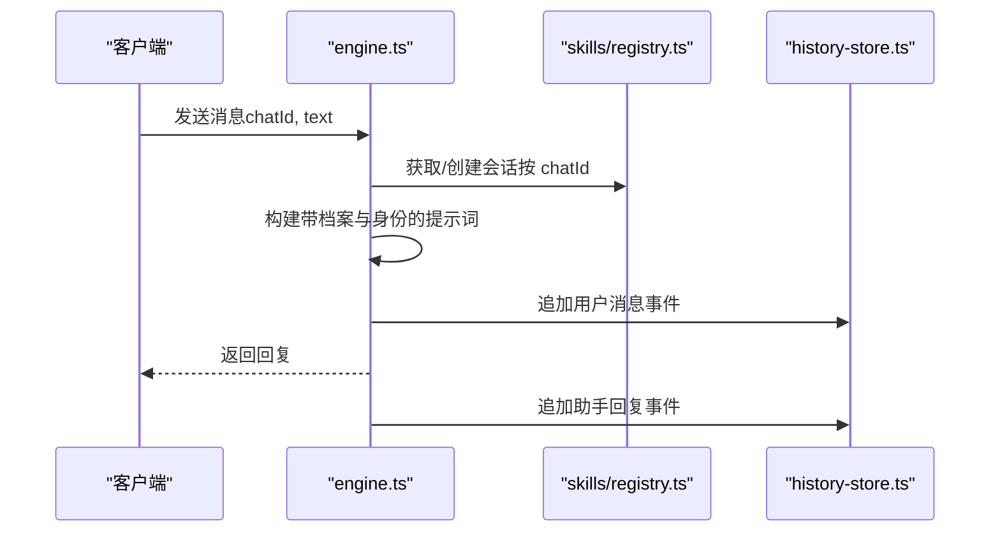
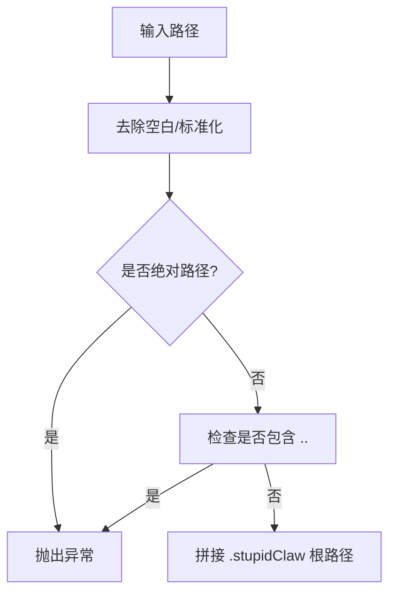
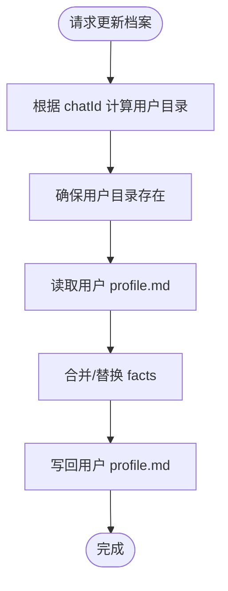
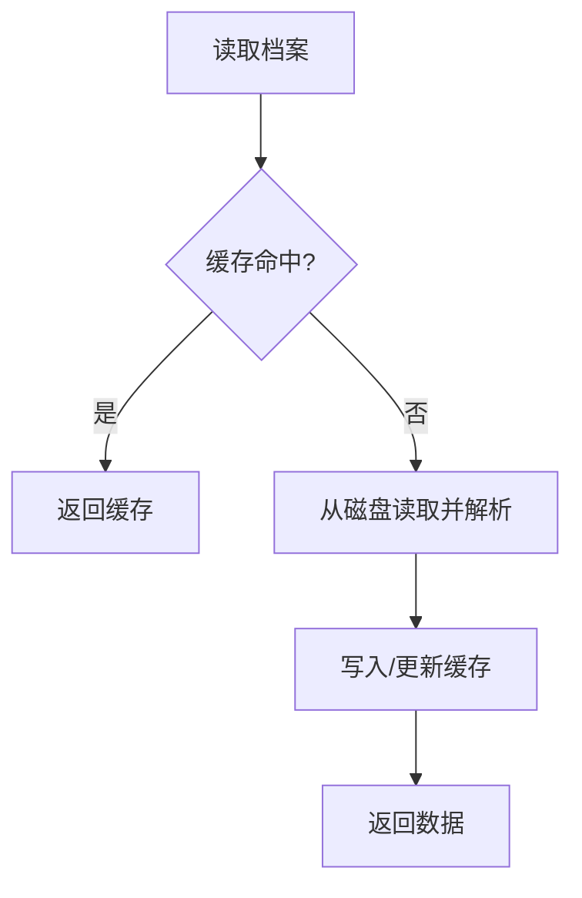
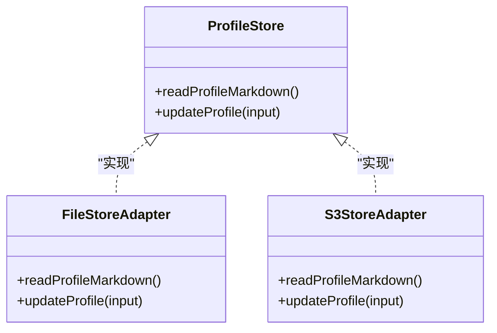
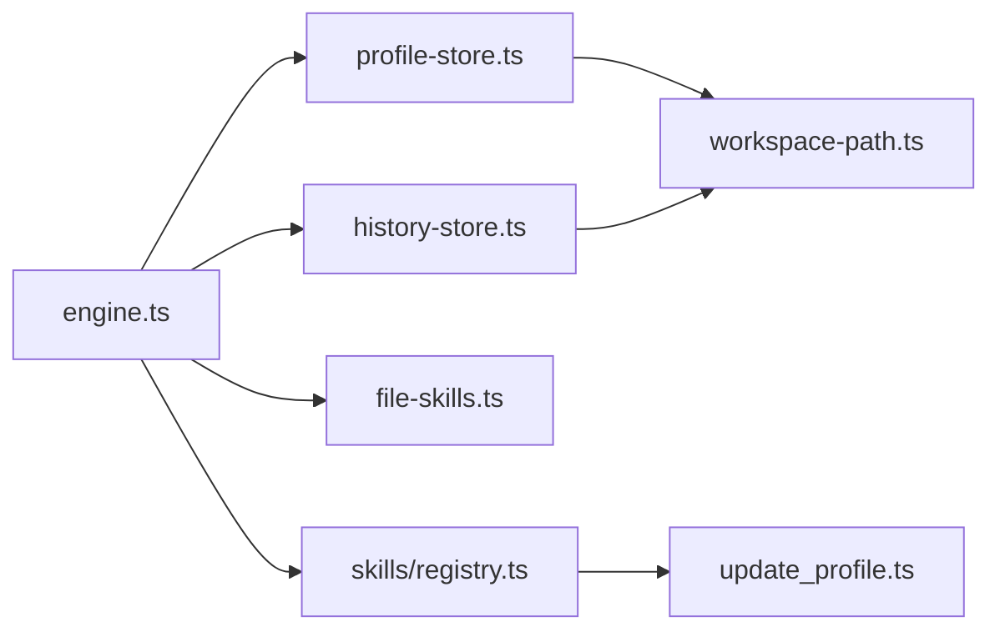

# 个人档案扩展

<cite>
**本文引用的文件**
- [src/memory/profile-store.ts](file://src/memory/profile-store.ts)
- [src/skills/memory/update_profile.ts](file://src/skills/memory/update_profile.ts)
- [src/memory/history-store.ts](file://src/memory/history-store.ts)
- [src/memory/workspace-path.ts](file://src/memory/workspace-path.ts)
- [src/prompt/identity.ts](file://src/prompt/identity.ts)
- [src/engine.ts](file://src/engine.ts)
- [src/skills/registry.ts](file://src/skills/registry.ts)
- [src/skills/contracts.ts](file://src/skills/contracts.ts)
- [src/skills/file-skills.ts](file://src/skills/file-skills.ts)
- [src/init.ts](file://src/init.ts)
- [package.json](file://package.json)
- [StupidClaw-第4期-用profile做长期记忆让Agent记住你.md](file://StupidClaw-第4期-用profile做长期记忆让Agent记住你.md)
- [StupidClaw-第5期-安全沙盒PathJailing防止越权读写.md](file://StupidClaw-第5期-安全沙盒PathJailing防止越权读写.md)
- [docs/index.html](file://docs/index.html)
</cite>

## 目录
1. [简介](#简介)
2. [项目结构](#项目结构)
3. [核心组件](#核心组件)
4. [架构总览](#架构总览)
5. [组件详解](#组件详解)
6. [依赖关系分析](#依赖关系分析)
7. [性能与扩展性](#性能与扩展性)
8. [故障排查](#故障排查)
9. [结论](#结论)
10. [附录](#附录)

## 简介
本指南围绕现有个人档案（Profile）管理能力进行扩展开发，帮助你在不破坏现有稳定结构的前提下，新增档案字段、引入个性化配置、支持多用户场景，并确保敏感信息保护、数据一致性与可维护性。文档同时给出自定义档案存储后端的实现思路（文件存储、内存缓存、分布式存储），以及版本管理、迁移策略与性能优化建议。

## 项目结构
围绕“个人档案”的关键模块与文件如下：
- 数据层：profile.md 文本档案与解析/写入逻辑
- 技能层：update_profile 技能对外暴露可控的写入入口
- 引擎层：在每轮对话前注入档案与身份提示词
- 安全层：工作区路径解析与越权防护
- 文件技能：将项目内的 SKILL.md 注入为可遵循的“记忆型技能”
- 初始化：.env 配置生成与运行参数

**图表来源**
- [src/engine.ts:1-706](file://src/engine.ts#L1-L706)
- [src/prompt/identity.ts:1-9](file://src/prompt/identity.ts#L1-L9)
- [src/memory/profile-store.ts:1-132](file://src/memory/profile-store.ts#L1-L132)
- [src/memory/history-store.ts:1-83](file://src/memory/history-store.ts#L1-L83)
- [src/memory/workspace-path.ts:1-42](file://src/memory/workspace-path.ts#L1-L42)
- [src/skills/registry.ts:1-55](file://src/skills/registry.ts#L1-L55)
- [src/skills/memory/update_profile.ts:1-84](file://src/skills/memory/update_profile.ts#L1-L84)
- [src/skills/file-skills.ts:1-65](file://src/skills/file-skills.ts#L1-L65)
- [src/skills/contracts.ts:1-20](file://src/skills/contracts.ts#L1-L20)
- [src/init.ts:1-339](file://src/init.ts#L1-L339)
- [package.json:1-39](file://package.json#L1-L39)

**章节来源**
- [src/engine.ts:1-706](file://src/engine.ts#L1-L706)
- [src/memory/profile-store.ts:1-132](file://src/memory/profile-store.ts#L1-L132)
- [src/skills/memory/update_profile.ts:1-84](file://src/skills/memory/update_profile.ts#L1-L84)
- [src/memory/history-store.ts:1-83](file://src/memory/history-store.ts#L1-L83)
- [src/memory/workspace-path.ts:1-42](file://src/memory/workspace-path.ts#L1-L42)
- [src/skills/registry.ts:1-55](file://src/skills/registry.ts#L1-L55)
- [src/skills/file-skills.ts:1-65](file://src/skills/file-skills.ts#L1-L65)
- [src/init.ts:1-339](file://src/init.ts#L1-L339)
- [package.json:1-39](file://package.json#L1-L39)

## 核心组件
- 档案数据层（profile-store.ts）
  - 固定 section 结构：stable_facts、preferences、constraints
  - 读取/写入 profile.md，解析与序列化
  - 去重、空值过滤、模式化写入（append/replace）
- 更新档案技能（update_profile.ts）
  - 对外暴露受控的写入工具，限制 section 与参数
  - 返回结构化结果，便于调试与审计
- 历史事件层（history-store.ts）
  - 按日期切分的 JSONL 文件，记录消息、工具调用与结果
  - 支持按 chatId 与 limit 查询
- 工作区安全路径（workspace-path.ts）
  - 统一的安全路径解析与越权防护
  - 保证所有读写限定在 .stupidClaw 工作区内
- 引擎上下文注入（engine.ts）
  - 每轮对话前注入身份提示词、档案内容与文件技能
  - 将 profile 作为长期记忆注入模型提示词
- 技能注册与契约（registry.ts、contracts.ts、file-skills.ts）
  - 统一注册内置与项目自定义技能
  - 通过 SKILL.md 自动加载“记忆型技能”
- 初始化与运行（init.ts、package.json）
  - 提供 .env 初始化向导，生成运行所需配置
  - 脚本与依赖管理

**章节来源**
- [src/memory/profile-store.ts:1-132](file://src/memory/profile-store.ts#L1-L132)
- [src/skills/memory/update_profile.ts:1-84](file://src/skills/memory/update_profile.ts#L1-L84)
- [src/memory/history-store.ts:1-83](file://src/memory/history-store.ts#L1-L83)
- [src/memory/workspace-path.ts:1-42](file://src/memory/workspace-path.ts#L1-L42)
- [src/engine.ts:1-706](file://src/engine.ts#L1-L706)
- [src/skills/registry.ts:1-55](file://src/skills/registry.ts#L1-L55)
- [src/skills/contracts.ts:1-20](file://src/skills/contracts.ts#L1-L20)
- [src/skills/file-skills.ts:1-65](file://src/skills/file-skills.ts#L1-L65)
- [src/init.ts:1-339](file://src/init.ts#L1-L339)
- [package.json:1-39](file://package.json#L1-L39)

## 架构总览
下面的时序图展示了“更新档案”与“对话注入档案”的关键流程：

**图表来源**
- [src/skills/registry.ts:1-55](file://src/skills/registry.ts#L1-L55)
- [src/skills/memory/update_profile.ts:1-84](file://src/skills/memory/update_profile.ts#L1-L84)
- [src/memory/profile-store.ts:1-132](file://src/memory/profile-store.ts#L1-L132)
- [src/memory/workspace-path.ts:1-42](file://src/memory/workspace-path.ts#L1-L42)

**章节来源**
- [src/skills/registry.ts:1-55](file://src/skills/registry.ts#L1-L55)
- [src/skills/memory/update_profile.ts:1-84](file://src/skills/memory/update_profile.ts#L1-L84)
- [src/memory/profile-store.ts:1-132](file://src/memory/profile-store.ts#L1-L132)
- [src/memory/workspace-path.ts:1-42](file://src/memory/workspace-path.ts#L1-L42)

## 组件详解

### 档案数据结构与更新协议
- 固定 section：stable_facts、preferences、constraints
- 更新模式：append（默认，去重合并）、replace（整段替换）
- 写入约束：仅允许写入固定 section，拒绝自由拼写
- 去重策略：按行 trim 后去重，忽略空行
- 文件格式：Markdown 分节 + 无序列表，便于人工审阅与修改

**图表来源**
- [src/memory/profile-store.ts:50-131](file://src/memory/profile-store.ts#L50-L131)

**章节来源**
- [src/memory/profile-store.ts:1-132](file://src/memory/profile-store.ts#L1-L132)
- [StupidClaw-第4期-用profile做长期记忆让Agent记住你.md:13-46](file://StupidClaw-第4期-用profile做长期记忆让Agent记住你.md#L13-L46)

### 多用户支持机制
- 会话维度：engine.ts 使用 Map 以 chatId 为键缓存 AgentSession，实现多用户并发
- 档案维度：当前 profile.md 是全局唯一；若需多用户档案，可在后续章节中引入“用户级档案目录”
- 历史维度：history-store.ts 以日期与 chatId 切分文件，天然支持多用户隔离

**图表来源**
- [src/engine.ts:392-705](file://src/engine.ts#L392-L705)
- [src/skills/registry.ts:461-475](file://src/skills/registry.ts#L461-L475)
- [src/memory/history-store.ts:37-42](file://src/memory/history-store.ts#L37-L42)

**章节来源**
- [src/engine.ts:392-705](file://src/engine.ts#L392-L705)
- [src/memory/history-store.ts:1-83](file://src/memory/history-store.ts#L1-L83)

### 档案同步与备份方案
- 同步策略：基于文件系统落盘，天然具备跨进程/跨会话持久化
- 备份建议：
  - 定期复制 .stupidClaw/profile.md 与 history 目录
  - 使用版本控制（如 git）跟踪 profile.md 的演进
  - 对历史 JSONL 文件进行周期性归档与压缩
- 一致性保障：写入前解析与去重，避免重复与空值污染

**章节来源**
- [src/memory/profile-store.ts:103-131](file://src/memory/profile-store.ts#L103-L131)
- [src/memory/history-store.ts:37-82](file://src/memory/history-store.ts#L37-L82)

### 敏感信息保护策略
- 路径安全：workspace-path.ts 统一解析与越权检测，禁止绝对路径与 .. 穿透
- 环境变量：init.ts 生成 .env，API Key 与令牌集中管理
- 日志脱敏：engine.ts 对敏感字段进行掩码处理
- 透明可审计：档案与历史均为明文文件，便于人工审查

**图表来源**
- [src/memory/workspace-path.ts:6-35](file://src/memory/workspace-path.ts#L6-L35)

**章节来源**
- [src/memory/workspace-path.ts:1-42](file://src/memory/workspace-path.ts#L1-L42)
- [src/init.ts:224-339](file://src/init.ts#L224-L339)
- [src/engine.ts:144-152](file://src/engine.ts#L144-L152)
- [docs/index.html:651-661](file://docs/index.html#L651-L661)

### 自定义档案存储后端实现示例

#### 文件存储（基于现有结构扩展）
- 在 profile-store.ts 基础上增加“用户级目录”与“多用户 profile”
- 通过 chatId 映射到子目录，实现天然隔离
- 保持 Markdown 格式不变，便于人工审阅

**图表来源**
- [src/memory/profile-store.ts:103-131](file://src/memory/profile-store.ts#L103-L131)
- [src/memory/workspace-path.ts:32-35](file://src/memory/workspace-path.ts#L32-L35)

**章节来源**
- [src/memory/profile-store.ts:1-132](file://src/memory/profile-store.ts#L1-L132)
- [src/memory/workspace-path.ts:1-42](file://src/memory/workspace-path.ts#L1-L42)

#### 内存缓存（提升读取性能）
- 在 engine.ts 中引入 Map 缓存最近 N 个用户的 profile
- 写入时同步更新缓存与磁盘，读取时优先命中缓存
- 设置 TTL 或 LRU 清理策略，避免内存膨胀

**图表来源**
- [src/engine.ts:484-509](file://src/engine.ts#L484-L509)
- [src/memory/profile-store.ts:112-131](file://src/memory/profile-store.ts#L112-L131)

**章节来源**
- [src/engine.ts:484-509](file://src/engine.ts#L484-L509)
- [src/memory/profile-store.ts:112-131](file://src/memory/profile-store.ts#L112-L131)

#### 分布式存储（共享与高可用）
- 使用对象存储（S3、MinIO）或 KV 存储（Consul、etcd）存放用户档案
- 通过网关层抽象存储接口，保持 updateProfile 与 readProfileMarkdown 的签名不变
- 引入版本号与 ETag，支持冲突检测与回滚

**图表来源**
- [src/memory/profile-store.ts:112-131](file://src/memory/profile-store.ts#L112-L131)

**章节来源**
- [src/memory/profile-store.ts:1-132](file://src/memory/profile-store.ts#L1-L132)

### 版本管理与迁移策略
- 版本标识：在 profile.md 添加版本元信息（如注释行）
- 迁移流程：读取旧版结构 → 转换为新版 → 写回新结构
- 回滚策略：保留旧版本文件，失败时恢复
- 兼容性：新增字段时保持默认值，避免破坏既有逻辑

**章节来源**
- [StupidClaw-第4期-用profile做长期记忆让Agent记住你.md:13-46](file://StupidClaw-第4期-用profile做长期记忆让Agent记住你.md#L13-L46)

### 性能优化技巧
- 读取优化：缓存最近读取的 profile，减少磁盘 IO
- 写入优化：批量写入、异步落盘，必要时合并多次更新
- 去重与过滤：在写入前完成，避免重复写入
- 历史查询：限制返回条数与日期范围，避免大文件扫描

**章节来源**
- [src/engine.ts:477-482](file://src/engine.ts#L477-L482)
- [src/memory/profile-store.ts:34-48](file://src/memory/profile-store.ts#L34-L48)
- [src/memory/history-store.ts:50-71](file://src/memory/history-store.ts#L50-L71)

## 依赖关系分析
- engine.ts 依赖 profile-store.ts 与 history-store.ts，负责上下文注入与事件记录
- skills/registry.ts 负责组装技能，update_profile.ts 作为 on-demand 技能参与
- workspace-path.ts 被 profile-store.ts 与 history-store.ts 间接依赖，保障路径安全
- file-skills.ts 加载项目与内置 SKILL.md，作为“记忆型技能”注入提示词

**图表来源**
- [src/engine.ts:1-706](file://src/engine.ts#L1-L706)
- [src/memory/profile-store.ts:1-132](file://src/memory/profile-store.ts#L1-L132)
- [src/memory/history-store.ts:1-83](file://src/memory/history-store.ts#L1-L83)
- [src/skills/registry.ts:1-55](file://src/skills/registry.ts#L1-L55)
- [src/skills/memory/update_profile.ts:1-84](file://src/skills/memory/update_profile.ts#L1-L84)
- [src/skills/file-skills.ts:1-65](file://src/skills/file-skills.ts#L1-L65)
- [src/memory/workspace-path.ts:1-42](file://src/memory/workspace-path.ts#L1-L42)

**章节来源**
- [src/engine.ts:1-706](file://src/engine.ts#L1-L706)
- [src/skills/registry.ts:1-55](file://src/skills/registry.ts#L1-L55)
- [src/skills/memory/update_profile.ts:1-84](file://src/skills/memory/update_profile.ts#L1-L84)
- [src/memory/profile-store.ts:1-132](file://src/memory/profile-store.ts#L1-L132)
- [src/memory/history-store.ts:1-83](file://src/memory/history-store.ts#L1-L83)
- [src/skills/file-skills.ts:1-65](file://src/skills/file-skills.ts#L1-L65)
- [src/memory/workspace-path.ts:1-42](file://src/memory/workspace-path.ts#L1-L42)

## 性能与扩展性
- 单机多用户：通过 chatId 缓存会话与档案，避免重复解析
- I/O 优化：profile 与 history 采用文本格式，便于压缩与归档
- 可扩展性：通过接口抽象（如 ProfileStore）支持多种后端实现
- 可观测性：DEBUG_PROMPT 与 DEBUG_STUPIDCLAW 便于定位问题

[本节为通用指导，无需列出具体文件来源]

## 故障排查
- 档案未更新
  - 检查 update_profile 的 section 与参数是否符合约束
  - 确认 profile.md 是否存在且可写
- 路径越权报错
  - 检查传入路径是否相对且不包含 .. 或绝对路径
- 历史查询为空
  - 确认日期格式与 chatId 是否正确
  - 检查历史文件是否存在
- API Key 错误
  - 使用 DEBUG_PROMPT 与 DEBUG_STUPIDCLAW 观察日志
  - 按提示修复 .env 中的密钥配置

**章节来源**
- [src/skills/memory/update_profile.ts:42-52](file://src/skills/memory/update_profile.ts#L42-L52)
- [src/memory/workspace-path.ts:6-26](file://src/memory/workspace-path.ts#L6-L26)
- [src/memory/history-store.ts:57-81](file://src/memory/history-store.ts#L57-L81)
- [src/engine.ts:162-186](file://src/engine.ts#L162-L186)

## 结论
通过对现有 profile-store、update_profile 技能与 engine 上下文注入的深入理解，可以安全地扩展个人档案能力：新增字段、引入用户级隔离、接入内存/分布式存储后端，并在不破坏现有稳定性的前提下实现版本管理与性能优化。配合安全路径解析与日志脱敏，整体方案具备良好的可维护性与可审计性。

[本节为总结性内容，无需列出具体文件来源]

## 附录

### 新增档案字段的实施步骤
- 在 profile-store.ts 中扩展 ProfileData 与解析/序列化逻辑
- 在 update_profile.ts 中开放新字段的写入入口与参数校验
- 在 engine.ts 的提示词注入处添加新字段的上下文
- 为历史查询与审计提供必要的索引与过滤条件

**章节来源**
- [src/memory/profile-store.ts:12-101](file://src/memory/profile-store.ts#L12-L101)
- [src/skills/memory/update_profile.ts:19-34](file://src/skills/memory/update_profile.ts#L19-L34)
- [src/engine.ts:484-509](file://src/engine.ts#L484-L509)

### 多用户支持的落地建议
- 以 chatId 为维度划分用户目录，保持 profile.md 结构一致
- 在缓存层按用户维度进行 LRU 策略，避免内存泄漏
- 对历史文件按用户与日期双重维度归档，便于检索与备份

**章节来源**
- [src/engine.ts:392-475](file://src/engine.ts#L392-L475)
- [src/memory/history-store.ts:29-31](file://src/memory/history-store.ts#L29-L31)

### 安全与合规要点
- 严格限制路径解析，杜绝越权读写
- 对敏感日志进行掩码处理
- 通过版本控制与归档策略保障可追溯性

**章节来源**
- [src/memory/workspace-path.ts:6-35](file://src/memory/workspace-path.ts#L6-L35)
- [src/engine.ts:144-152](file://src/engine.ts#L144-L152)
- [docs/index.html:651-661](file://docs/index.html#L651-L661)