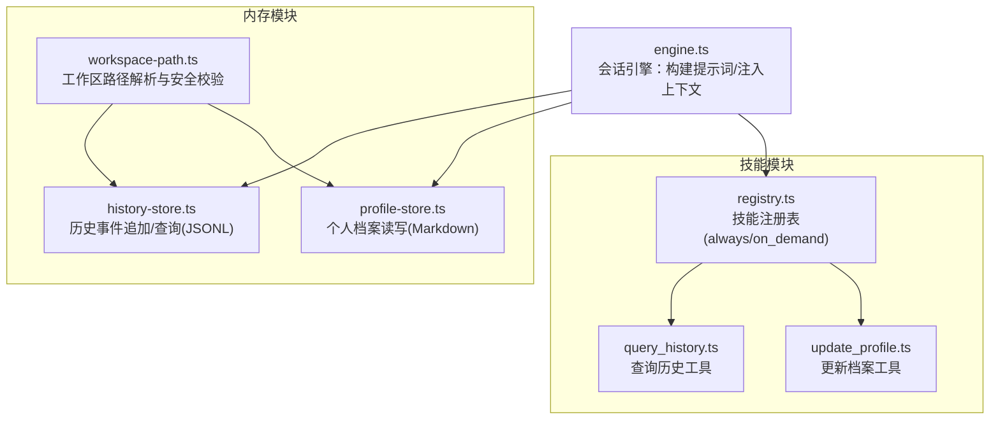
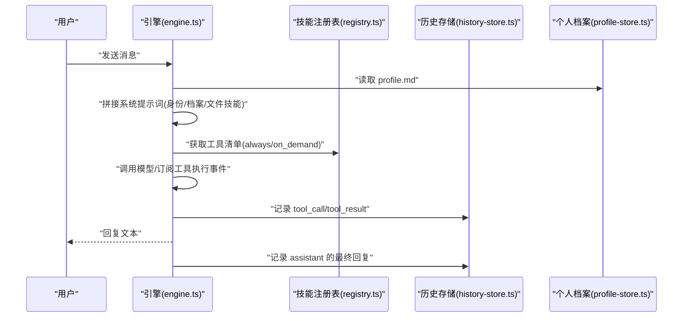
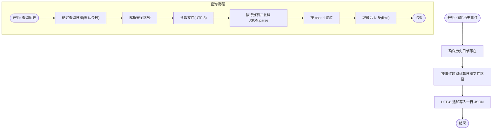
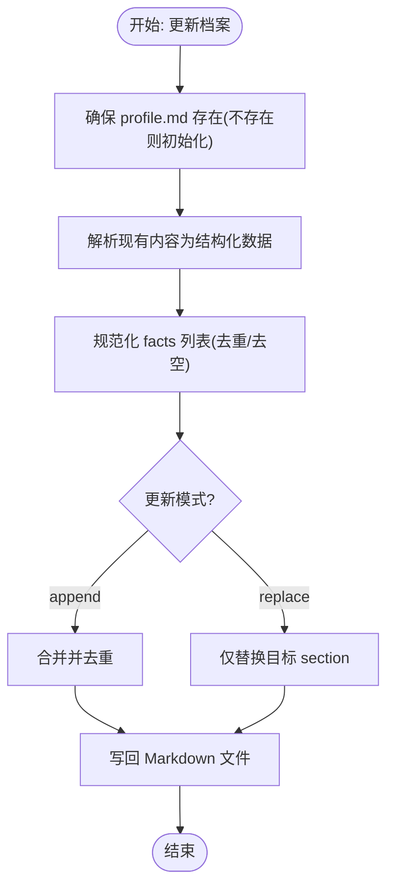
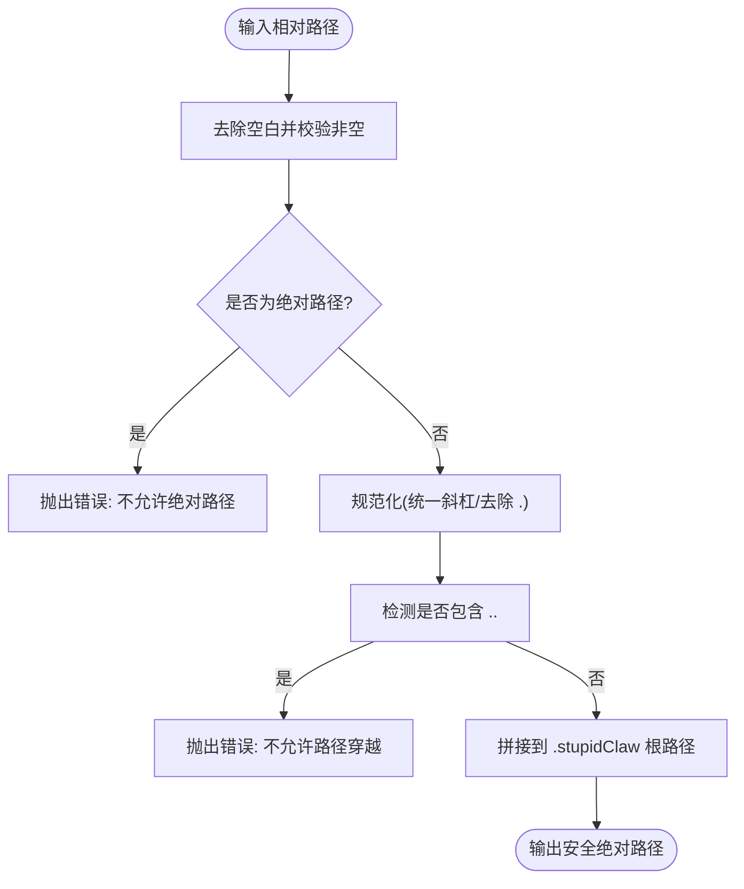
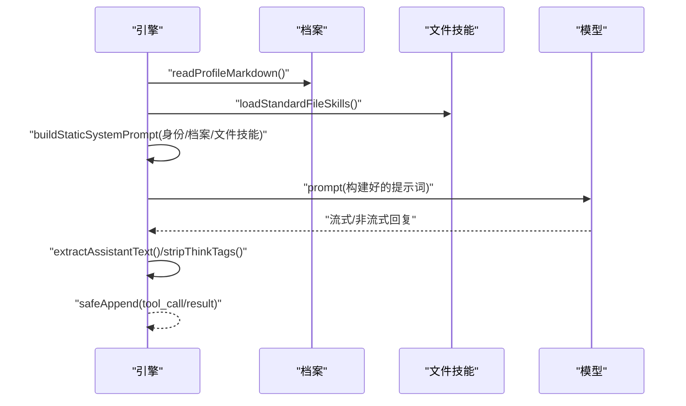
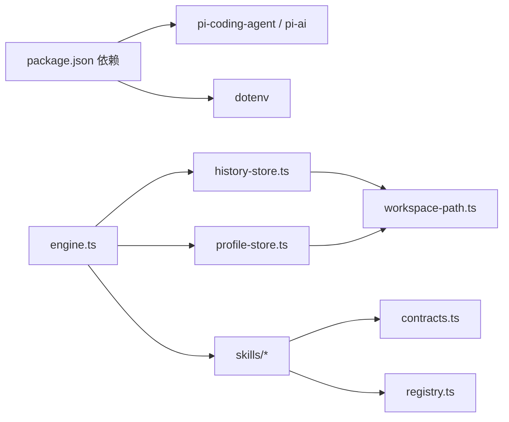

# 内存系统扩展

<cite>
**本文引用的文件**
- [src/memory/history-store.ts](file://src/memory/history-store.ts)
- [src/memory/profile-store.ts](file://src/memory/profile-store.ts)
- [src/memory/workspace-path.ts](file://src/memory/workspace-path.ts)
- [src/memory/workspace-path.test.ts](file://src/memory/workspace-path.test.ts)
- [src/skills/memory/query_history.ts](file://src/skills/memory/query_history.ts)
- [src/skills/memory/update_profile.ts](file://src/skills/memory/update_profile.ts)
- [src/skills/registry.ts](file://src/skills/registry.ts)
- [src/skills/contracts.ts](file://src/skills/contracts.ts)
- [src/engine.ts](file://src/engine.ts)
- [src/init.ts](file://src/init.ts)
- [src/init-providers.ts](file://src/init-providers.ts)
- [package.json](file://package.json)
- [README.md](file://README.md)
- [StupidClaw-第3期-Skills不是越多越好关键是按需披露.md](file://StupidClaw-第3期-Skills不是越多越好关键是按需披露.md)
- [StupidClaw-第4期-用profile做长期记忆让Agent记住你.md](file://StupidClaw-第4期-用profile做长期记忆让Agent记住你.md)
</cite>

## 目录
1. [简介](#简介)
2. [项目结构](#项目结构)
3. [核心组件](#核心组件)
4. [架构总览](#架构总览)
5. [组件详解](#组件详解)
6. [依赖关系分析](#依赖关系分析)
7. [性能考量](#性能考量)
8. [故障排查指南](#故障排查指南)
9. [结论](#结论)
10. [附录](#附录)

## 简介
本指南面向希望扩展现有内存管理功能的开发者，围绕历史存储、个人档案、工作区路径三大核心组件，系统阐述其设计原理、扩展点与最佳实践。内容涵盖：
- 如何新增存储后端（文件系统以外的介质）
- 如何自定义存储格式（从纯文本到结构化文件）
- 如何引入内存优化策略（缓存、压缩、分片、索引）
- 架构设计原则、数据持久化策略与性能优化方案
- 实际扩展实现示例与落地建议

## 项目结构
内存系统位于 src/memory，配套技能位于 src/skills/memory，引擎在 src/engine 中负责组装上下文与调用工具。



图示来源
- [src/memory/workspace-path.ts:1-42](file://src/memory/workspace-path.ts#L1-L42)
- [src/memory/history-store.ts:1-83](file://src/memory/history-store.ts#L1-L83)
- [src/memory/profile-store.ts:1-132](file://src/memory/profile-store.ts#L1-L132)
- [src/skills/registry.ts:1-55](file://src/skills/registry.ts#L1-L55)
- [src/skills/memory/query_history.ts:1-57](file://src/skills/memory/query_history.ts#L1-L57)
- [src/skills/memory/update_profile.ts:1-84](file://src/skills/memory/update_profile.ts#L1-L84)
- [src/engine.ts:1-706](file://src/engine.ts#L1-L706)

章节来源
- [README.md:22-52](file://README.md#L22-L52)
- [src/memory/workspace-path.ts:1-42](file://src/memory/workspace-path.ts#L1-L42)
- [src/memory/history-store.ts:1-83](file://src/memory/history-store.ts#L1-L83)
- [src/memory/profile-store.ts:1-132](file://src/memory/profile-store.ts#L1-L132)
- [src/skills/registry.ts:1-55](file://src/skills/registry.ts#L1-L55)
- [src/skills/memory/query_history.ts:1-57](file://src/skills/memory/query_history.ts#L1-L57)
- [src/skills/memory/update_profile.ts:1-84](file://src/skills/memory/update_profile.ts#L1-L84)
- [src/engine.ts:1-706](file://src/engine.ts#L1-L706)

## 核心组件
- 历史存储（history-store）
  - 作用：以追加只写的方式将对话事件落盘为每日 JSONL 文件，支持按日期与 chatId 查询，并具备坏行容错。
  - 关键点：按 UTC 日期分片、UTF-8 追加、查询限流与去重。
- 个人档案（profile-store）
  - 作用：维护稳定的长期记忆，采用 Markdown 结构化分段，提供 append/replace 更新策略。
  - 关键点：固定 section、去重与空值过滤、文件不存在时自动初始化。
- 工作区路径（workspace-path）
  - 作用：统一解析与校验 .stupidClaw 下的安全路径，拒绝绝对路径与路径穿越，确保 AI 只能在沙盒内读写。
  - 关键点：规范化相对路径、强制相对、禁止 ..、根目录自动创建。

章节来源
- [src/memory/history-store.ts:8-83](file://src/memory/history-store.ts#L8-L83)
- [src/memory/profile-store.ts:4-132](file://src/memory/profile-store.ts#L4-L132)
- [src/memory/workspace-path.ts:6-42](file://src/memory/workspace-path.ts#L6-L42)
- [StupidClaw-第3期-Skills不是越多越好关键是按需披露.md:49-69](file://StupidClaw-第3期-Skills不是越多越好关键是按需披露.md#L49-L69)
- [StupidClaw-第4期-用profile做长期记忆让Agent记住你.md:67-76](file://StupidClaw-第4期-用profile做长期记忆让Agent记住你.md#L67-L76)

## 架构总览
引擎在每次对话前，将身份提示、个人档案与文件技能注入系统提示词，随后根据模型输出与工具调用，动态记录历史事件。技能注册表采用 always/on_demand 分层，控制工具的首次可见性与按需披露。



图示来源
- [src/engine.ts:484-509](file://src/engine.ts#L484-L509)
- [src/engine.ts:511-607](file://src/engine.ts#L511-L607)
- [src/engine.ts:680-705](file://src/engine.ts#L680-L705)
- [src/skills/registry.ts:23-54](file://src/skills/registry.ts#L23-L54)
- [src/memory/history-store.ts:37-82](file://src/memory/history-store.ts#L37-L82)
- [src/memory/profile-store.ts:112-131](file://src/memory/profile-store.ts#L112-L131)

章节来源
- [src/engine.ts:484-705](file://src/engine.ts#L484-L705)
- [src/skills/registry.ts:23-54](file://src/skills/registry.ts#L23-L54)

## 组件详解

### 历史存储（history-store）
- 数据模型
  - 事件字段：时间戳、会话标识、角色、事件类型、文本、工具名、参数、结果、错误标记等。
  - 存储格式：每日 JSONL 文件，UTF-8 追加写入。
- 查询策略
  - 支持按日期、chatId 过滤与 limit 上限（默认 20，最大 200）。
  - 读取时跳过非法行，保证健壮性。
- 安全与可靠性
  - 使用 resolveSafePath 将目标路径解析到 .stupidClaw 下，避免越权访问。
  - 目录不存在时自动创建，减少运行时异常。



图示来源
- [src/memory/history-store.ts:37-82](file://src/memory/history-store.ts#L37-L82)

章节来源
- [src/memory/history-store.ts:8-83](file://src/memory/history-store.ts#L8-L83)
- [src/memory/workspace-path.ts:32-35](file://src/memory/workspace-path.ts#L32-L35)

### 个人档案（profile-store）
- 数据模型
  - 固定 section：stable_facts、preferences、constraints。
  - 值为去重后的字符串列表，空值与重复项自动过滤。
- 更新策略
  - append：合并去重（默认）。
  - replace：仅替换目标 section。
- 文件格式
  - Markdown 文档，带注释说明用途，便于人工审计与修改。



图示来源
- [src/memory/profile-store.ts:117-131](file://src/memory/profile-store.ts#L117-L131)

章节来源
- [src/memory/profile-store.ts:4-132](file://src/memory/profile-store.ts#L4-L132)
- [src/skills/memory/update_profile.ts:10-84](file://src/skills/memory/update_profile.ts#L10-L84)

### 工作区路径（workspace-path）
- 职责
  - 将相对路径规范化为 .stupidClaw 下的绝对路径，拒绝绝对路径与路径穿越。
  - 提供工作区目录批量创建能力。
- 安全要点
  - 严格的输入校验与路径段检查，防止逃逸到沙盒外。
  - 与历史与档案模块配合，确保所有 IO 均在安全范围内。



图示来源
- [src/memory/workspace-path.ts:6-35](file://src/memory/workspace-path.ts#L6-L35)

章节来源
- [src/memory/workspace-path.ts:1-42](file://src/memory/workspace-path.ts#L1-L42)
- [src/memory/workspace-path.test.ts:6-28](file://src/memory/workspace-path.test.ts#L6-L28)

### 技能与工具集成
- 注册表
  - always：首轮可见的基础能力（如系统时间、列出可用技能）。
  - on_demand：按需发现的能力（如查询历史、创建技能、管理 Cron 任务）。
- 工具定义
  - 每个工具包含名称、描述、参数 Schema 与执行函数，返回可序列化结果。
- 历史与档案工具
  - query_history：按日期/聊天过滤查询历史。
  - update_profile：更新档案 section。

```mermaid
classDiagram
class SkillDefinition {
+string name
+string description
+SkillExposure exposure
+ToolDefinition tool
}
class SkillExposure {
<<enum>>
"always"
"on_demand"
}
class SkillRegistry {
+SkillDefinition[] all
+SkillDefinition[] always
+SkillDefinition[] onDemand
}
SkillRegistry --> SkillDefinition : "组合"
SkillDefinition --> SkillExposure : "使用"
```

图示来源
- [src/skills/contracts.ts:4-20](file://src/skills/contracts.ts#L4-L20)
- [src/skills/registry.ts:13-54](file://src/skills/registry.ts#L13-L54)

章节来源
- [src/skills/registry.ts:23-54](file://src/skills/registry.ts#L23-L54)
- [src/skills/contracts.ts:1-20](file://src/skills/contracts.ts#L1-L20)
- [src/skills/memory/query_history.ts:5-57](file://src/skills/memory/query_history.ts#L5-L57)
- [src/skills/memory/update_profile.ts:10-84](file://src/skills/memory/update_profile.ts#L10-L84)

### 引擎上下文注入
- 每次对话前，引擎读取个人档案，拼接身份提示与文件技能提示，形成稳定的系统提示词。
- 订阅模型事件，将工具调用与结果写入历史，确保可回溯。



图示来源
- [src/engine.ts:484-509](file://src/engine.ts#L484-L509)
- [src/engine.ts:511-607](file://src/engine.ts#L511-L607)

章节来源
- [src/engine.ts:484-705](file://src/engine.ts#L484-L705)

## 依赖关系分析
- 外部依赖
  - @mariozechner/pi-coding-agent 与 @mariozechner/pi-ai：提供会话、工具与模型集成能力。
  - dotenv：读取 .env 环境变量。
- 内部依赖
  - engine.ts 依赖 memory 与 skills 模块，负责组装上下文与记录历史。
  - skills 依赖 contracts 定义工具契约，registry 统一注册与分层。
  - memory 依赖 workspace-path 进行路径安全校验。



图示来源
- [package.json:30-38](file://package.json#L30-L38)
- [src/engine.ts:12-17](file://src/engine.ts#L12-L17)
- [src/skills/registry.ts:1-11](file://src/skills/registry.ts#L1-L11)
- [src/skills/contracts.ts:1-3](file://src/skills/contracts.ts#L1-L3)
- [src/memory/history-store.ts:1-3](file://src/memory/history-store.ts#L1-L3)
- [src/memory/profile-store.ts:1-2](file://src/memory/profile-store.ts#L1-L2)

章节来源
- [package.json:14-22](file://package.json#L14-L22)
- [src/engine.ts:12-17](file://src/engine.ts#L12-L17)
- [src/skills/registry.ts:1-11](file://src/skills/registry.ts#L1-L11)

## 性能考量
- I/O 层面
  - 历史存储采用 UTF-8 追加写入，避免随机写带来的磁盘抖动；按日期分片降低单文件过大风险。
  - 档案读写采用一次性文件操作，适合小体量长期记忆。
- 查询层面
  - 历史查询支持 limit 与 chatId 过滤，避免全量扫描；坏行容错提升稳定性。
- 缓存与索引
  - 可在应用层引入内存缓存（如 LRU）加速近期查询；对历史文件建立按日期的索引文件以支持快速定位。
- 压缩与归档
  - 对历史文件启用 gzip 压缩；超过阈值的日期文件可归档至冷存储。
- 并发与锁
  - 多会话并发写入同一日期文件时，建议引入文件级互斥或队列化写入，避免竞争条件。

## 故障排查指南
- 路径安全错误
  - 现象：抛出“路径不能为空/不允许绝对路径/不允许路径穿越”等错误。
  - 排查：检查传入路径是否为相对路径、是否包含 ..、是否为空。
- 历史查询异常
  - 现象：查询时报错或返回空数组。
  - 排查：确认目标日期文件是否存在；检查文件编码与行格式；坏行已被跳过，确认 limit 设置是否合理。
- 档案更新无效
  - 现象：更新后未生效或 section 未变化。
  - 排查：确认 section 是否在允许列表；检查 facts 是否为空或重复；确认 mode 是否为 append/replace。
- 引擎初始化失败
  - 现象：创建会话失败或提示 API Key 无效。
  - 排查：核对 .env 中的 STUPID_MODEL 与对应供应商密钥；确认 provider 与 model_id 匹配。

章节来源
- [src/memory/workspace-path.test.ts:14-28](file://src/memory/workspace-path.test.ts#L14-L28)
- [src/memory/history-store.ts:72-81](file://src/memory/history-store.ts#L72-L81)
- [src/skills/memory/update_profile.ts:42-52](file://src/skills/memory/update_profile.ts#L42-L52)
- [src/engine.ts:162-186](file://src/engine.ts#L162-L186)

## 结论
本内存系统以“纯文本 + 沙盒路径”为核心，通过历史 JSONL 与档案 Markdown 实现可回溯、可审计、可扩展的记忆体系。扩展方向建议遵循以下原则：
- 保持路径安全与最小权限，所有 IO 限定在 .stupidClaw 沙盒内。
- 以“追加只写”和“结构化分段”为主的数据策略，兼顾可读性与可维护性。
- 在应用层引入缓存、索引与压缩，平衡性能与可靠性。
- 通过 always/on_demand 分层控制工具披露，降低误调用风险。

## 附录

### 扩展新存储后端（以数据库为例）
- 设计原则
  - 保持与现有接口一致：提供追加/查询/更新等方法签名，以便无缝替换。
  - 仍使用 resolveSafePath 作为根目录约束，确保数据库文件位于 .stupidClaw 下。
- 实施步骤
  - 定义适配器：封装数据库连接、事务与索引。
  - 替换历史/档案的底层实现：history-store 与 profile-store 的具体落盘逻辑。
  - 保持上层调用不变，确保兼容性。
- 注意事项
  - 事务一致性与并发控制。
  - 索引策略与查询性能，避免全表扫描。

章节来源
- [src/memory/history-store.ts:37-82](file://src/memory/history-store.ts#L37-L82)
- [src/memory/profile-store.ts:117-131](file://src/memory/profile-store.ts#L117-L131)
- [src/memory/workspace-path.ts:32-35](file://src/memory/workspace-path.ts#L32-L35)

### 自定义存储格式（从 JSONL 到 Parquet）
- 设计原则
  - 保持查询语义：按日期/聊天过滤、limit 控制。
  - 兼容现有工具：query_history 的参数与返回结构保持一致。
- 实施步骤
  - 读取阶段：支持多格式解析（JSONL/Parquet），统一转换为内部事件对象。
  - 写入阶段：按日期分片写入 Parquet 文件，必要时生成索引文件。
  - 查询阶段：利用索引快速定位日期文件，再进行过滤与截断。
- 注意事项
  - 文件格式迁移脚本与版本兼容。
  - 压缩与列式存储对查询性能的提升与维护成本。

章节来源
- [src/skills/memory/query_history.ts:31-54](file://src/skills/memory/query_history.ts#L31-L54)
- [src/memory/history-store.ts:50-82](file://src/memory/history-store.ts#L50-L82)

### 内存优化策略
- 缓存
  - 近期档案与常用历史片段放入内存缓存，设置 TTL 与容量上限。
- 压缩
  - 历史文件启用压缩，降低磁盘占用与 IO 延迟。
- 分片与归档
  - 按月/季度归档历史文件，保留热数据在 SSD，冷数据迁移至 HDD。
- 索引
  - 为历史文件建立按 chatId 的二级索引，加速过滤。
- 并发写入
  - 使用写入队列与文件级锁，避免竞态与数据损坏。

章节来源
- [src/engine.ts:484-705](file://src/engine.ts#L484-L705)

### 最佳实践
- 严格遵循 always/on_demand 分层，避免首轮工具爆炸。
- 始终通过 resolveSafePath 解析路径，杜绝绝对路径与路径穿越。
- 历史与档案的写入采用 UTF-8 追加与一次性写回，保证原子性与可回溯。
- 在生产环境开启调试开关，定位工具未触发或模型未采纳的原因。
- 对外部依赖进行版本锁定与变更评估，确保升级不影响内存格式。

章节来源
- [src/skills/registry.ts:23-54](file://src/skills/registry.ts#L23-L54)
- [src/memory/workspace-path.ts:6-35](file://src/memory/workspace-path.ts#L6-L35)
- [src/engine.ts:65-73](file://src/engine.ts#L65-L73)