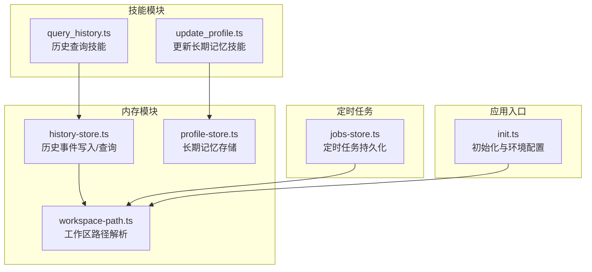
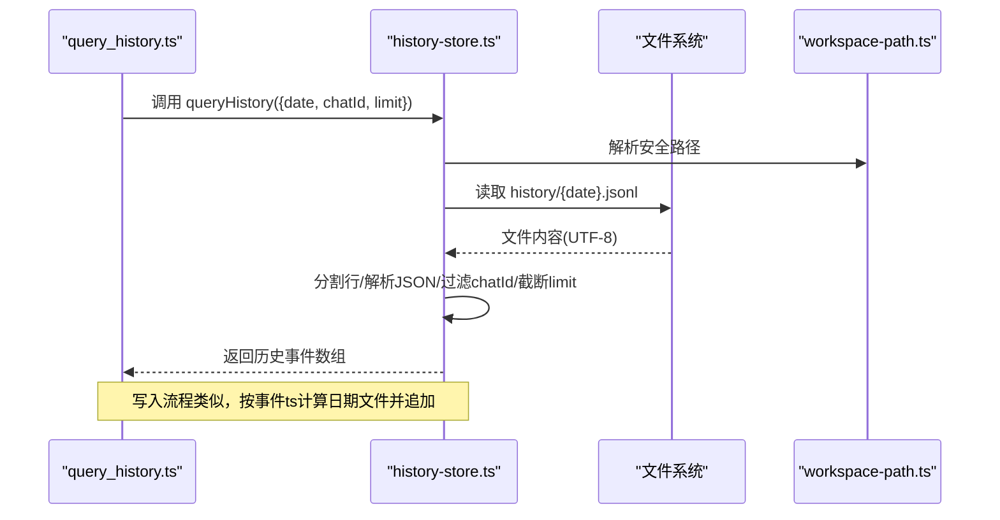
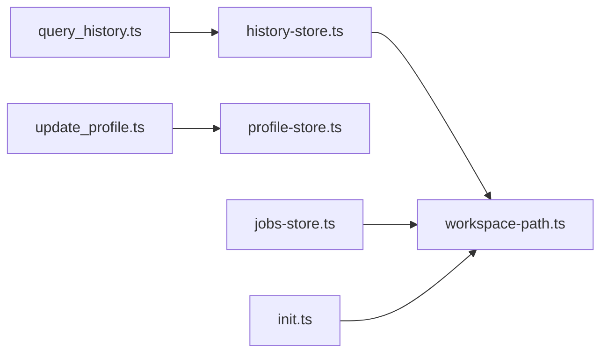

# 历史存储扩展

<cite>
**本文引用的文件**
- [history-store.ts](file://src/memory/history-store.ts)
- [query_history.ts](file://src/skills/memory/query_history.ts)
- [jobs-store.ts](file://src/cron/jobs-store.ts)
- [workspace-path.ts](file://src/memory/workspace-path.ts)
- [profile-store.ts](file://src/memory/profile-store.ts)
- [update_profile.ts](file://src/skills/memory/update_profile.ts)
- [init.ts](file://src/init.ts)
- [package.json](file://package.json)
</cite>

## 目录
1. [简介](#简介)
2. [项目结构](#项目结构)
3. [核心组件](#核心组件)
4. [架构总览](#架构总览)
5. [详细组件分析](#详细组件分析)
6. [依赖关系分析](#依赖关系分析)
7. [性能考虑](#性能考虑)
8. [故障排查指南](#故障排查指南)
9. [结论](#结论)
10. [附录](#附录)

## 简介
本指南面向需要扩展现有历史事件存储能力的开发者，围绕以下主题提供系统化的扩展建议与最佳实践：
- 新的存储格式支持（如二进制、列式、压缩格式）
- 查询优化策略（索引、缓存、分页、过滤）
- 批量操作实现（批量写入、批量查询、批量清理）
- HistoryEvent 接口的设计原理与演进方向
- JSONL 文件格式的选择原因与替代方案
- 时间序列存储策略与数据生命周期管理
- 自定义历史存储后端（内存、数据库、云存储）的实现思路
- 压缩、归档、清理策略与性能优化建议

## 项目结构
现有历史存储位于内存模块中，采用按日期切分的 JSONL 文本文件进行持久化，配套提供查询技能与工作区路径解析工具。核心文件如下：
- 历史存储与查询：src/memory/history-store.ts
- 历史查询技能：src/skills/memory/query_history.ts
- 工作区路径解析：src/memory/workspace-path.ts
- 长期记忆（profile）：src/memory/profile-store.ts 与 src/skills/memory/update_profile.ts
- 定时任务存储：src/cron/jobs-store.ts（作为对比参考）

图表来源
- [history-store.ts:1-83](file://src/memory/history-store.ts#L1-L83)
- [query_history.ts:1-57](file://src/skills/memory/query_history.ts#L1-L57)
- [workspace-path.ts:1-42](file://src/memory/workspace-path.ts#L1-L42)
- [profile-store.ts:1-132](file://src/memory/profile-store.ts#L1-L132)
- [update_profile.ts:1-84](file://src/skills/memory/update_profile.ts#L1-L84)
- [jobs-store.ts:1-151](file://src/cron/jobs-store.ts#L1-L151)
- [init.ts:1-339](file://src/init.ts#L1-L339)

章节来源
- [history-store.ts:1-83](file://src/memory/history-store.ts#L1-L83)
- [query_history.ts:1-57](file://src/skills/memory/query_history.ts#L1-L57)
- [workspace-path.ts:1-42](file://src/memory/workspace-path.ts#L1-L42)
- [profile-store.ts:1-132](file://src/memory/profile-store.ts#L1-L132)
- [update_profile.ts:1-84](file://src/skills/memory/update_profile.ts#L1-L84)
- [jobs-store.ts:1-151](file://src/cron/jobs-store.ts#L1-L151)
- [init.ts:1-339](file://src/init.ts#L1-L339)

## 核心组件
- HistoryEvent 接口：统一描述历史事件的时间戳、会话标识、角色、类型及可选字段（文本、工具名、参数、结果、错误标记），便于后续扩展不同事件类型与元数据。
- appendHistoryEvent：基于事件时间戳按日期切分文件，采用 JSONL 追加写入，确保写入原子性与可恢复性。
- queryHistory：按日期读取 JSONL 文件，逐行解析并过滤 chatId，支持限制返回数量，对异常行进行容错处理。
- workspace-path：提供安全路径解析与工作区根目录管理，确保所有文件操作在受控范围内。
- profile-store：提供长期记忆的分段存储与更新，与历史存储形成互补（短期对话 vs 长期稳定事实）。

章节来源
- [history-store.ts:8-18](file://src/memory/history-store.ts#L8-L18)
- [history-store.ts:37-42](file://src/memory/history-store.ts#L37-L42)
- [history-store.ts:50-82](file://src/memory/history-store.ts#L50-L82)
- [workspace-path.ts:32-35](file://src/memory/workspace-path.ts#L32-L35)
- [profile-store.ts:12-16](file://src/memory/profile-store.ts#L12-L16)

## 架构总览
历史存储的运行时交互流程如下：外部调用通过技能触发，技能调用历史查询函数，查询函数根据日期定位 JSONL 文件并解析返回；同时，历史写入函数根据事件时间戳生成文件路径并追加写入。

图表来源
- [query_history.ts:31-53](file://src/skills/memory/query_history.ts#L31-L53)
- [history-store.ts:50-82](file://src/memory/history-store.ts#L50-L82)
- [workspace-path.ts:32-35](file://src/memory/workspace-path.ts#L32-L35)

## 详细组件分析

### HistoryEvent 接口设计原理
- 字段语义清晰：ts、chatId、role、type 为核心筛选维度；text、tool、args、result、isError 提供事件细节与工具调用信息。
- 可扩展性：新增事件类型（如 tool_call、tool_result）无需破坏现有结构；可按需添加元数据字段。
- 与 JSONL 的契合：单行 JSON 对象便于流式解析与增量处理。

章节来源
- [history-store.ts:8-18](file://src/memory/history-store.ts#L8-L18)

### JSONL 文件格式的选择原因
- 流式可读写：逐行追加，无需重建整个文件；适合 append-only 场景。
- 容错性强：单行损坏不影响其他行；查询时可跳过异常行继续返回有效数据。
- 简洁易维护：无需索引或 ORM，降低复杂度与运维成本。
- 与现有实现契合：appendHistoryEvent 与 queryHistory 的实现均基于 JSONL 行式结构。

章节来源
- [history-store.ts:37-42](file://src/memory/history-store.ts#L37-L42)
- [history-store.ts:57-82](file://src/memory/history-store.ts#L57-L82)

### 时间序列存储策略
- 按日切分：根据事件时间戳生成日期文件名，天然支持时间范围查询与归档。
- 顺序写入：JSONL 追加写入，避免随机 IO，提升吞吐。
- 限制返回：查询时限制最大返回条数，控制内存占用与响应时间。

章节来源
- [history-store.ts:22-31](file://src/memory/history-store.ts#L22-L31)
- [history-store.ts:53-55](file://src/memory/history-store.ts#L53-L55)
- [history-store.ts:70-71](file://src/memory/history-store.ts#L70-L71)

### 查询优化策略
- 过滤优先：先按 chatId 过滤，减少后续解析与排序成本。
- 限制返回：限制最大返回条数，避免大文件全量解析。
- 容错处理：对非法 JSON 行进行跳过，保证查询稳定性。
- 可选索引（扩展建议）：为常用查询维度建立轻量索引（如按日期/会话的行偏移索引），以支持更快的范围查询与分页。

章节来源
- [history-store.ts:69-71](file://src/memory/history-store.ts#L69-L71)
- [history-store.ts:72-81](file://src/memory/history-store.ts#L72-L81)

### 批量操作实现
- 批量写入：将多个事件合并为 JSONL 行集合，一次性写入对应日期文件，减少系统调用次数。
- 批量查询：按日期范围批量读取文件，合并结果后再进行过滤与排序。
- 批量清理：按日期范围删除文件或清空内容，配合归档策略进行周期性清理。

章节来源
- [history-store.ts:37-42](file://src/memory/history-store.ts#L37-L42)
- [history-store.ts:50-82](file://src/memory/history-store.ts#L50-L82)

### 自定义历史存储后端实现示例

#### 内存存储（适合测试与短时会话）
- 设计要点：使用内存 Map 存储 {日期: Event[]}，提供写入与查询接口；支持按 chatId 过滤与 limit 截断。
- 适用场景：单元测试、本地调试、临时会话。
- 注意事项：进程重启即丢失，不适合生产持久化。

章节来源
- [history-store.ts:8-18](file://src/memory/history-store.ts#L8-L18)
- [history-store.ts:50-82](file://src/memory/history-store.ts#L50-L82)

#### 数据库存储（适合生产与可查询性）
- 设计要点：引入关系型表或文档型集合，字段映射 HistoryEvent；建立索引（ts、chatId、type）；支持事务写入与范围查询。
- 适用场景：需要复杂查询、统计分析、跨会话检索。
- 注意事项：需考虑写入放大与查询性能平衡。

章节来源
- [history-store.ts:8-18](file://src/memory/history-store.ts#L8-L18)
- [history-store.ts:50-82](file://src/memory/history-store.ts#L50-L82)

#### 云存储（适合分布式与高可用）
- 设计要点：将 JSONL 文件上传至对象存储（如 S3、OSS），结合 CDN 加速；提供签名下载与访问控制；支持冷热分层与生命周期策略。
- 适用场景：多实例共享、异地备份、合规归档。
- 注意事项：网络延迟与带宽限制，需考虑本地缓存与批量上传。

章节来源
- [history-store.ts:29-31](file://src/memory/history-store.ts#L29-L31)
- [workspace-path.ts:32-35](file://src/memory/workspace-path.ts#L32-L35)

### 压缩、归档、清理策略
- 压缩：对历史文件启用 gzip/brotli 压缩，降低存储与传输成本；查询时按需解压。
- 归档：将历史文件移动到归档目录或对象存储冷存储层，设置生命周期规则自动迁移。
- 清理：按会话或日期维度定期清理过期数据；保留关键摘要或元数据以满足审计需求。

章节来源
- [history-store.ts:29-31](file://src/memory/history-store.ts#L29-L31)
- [jobs-store.ts:1-151](file://src/cron/jobs-store.ts#L1-L151)

### 性能优化最佳实践
- 写入优化：批量写入、异步写入、背压控制；避免频繁打开/关闭文件句柄。
- 查询优化：预读取与缓存、行级过滤、限制返回条数；必要时建立轻量索引。
- 存储优化：按日期切分、压缩存储、冷热分层；合理设置文件大小阈值。
- 安全与可靠性：路径白名单、只读模式、校验完整性；异常处理与重试机制。

章节来源
- [history-store.ts:37-42](file://src/memory/history-store.ts#L37-L42)
- [history-store.ts:50-82](file://src/memory/history-store.ts#L50-L82)
- [workspace-path.ts:32-35](file://src/memory/workspace-path.ts#L32-L35)

## 依赖关系分析
历史存储模块与其他模块的耦合关系如下：
- history-store.ts 依赖 workspace-path.ts 进行安全路径解析。
- query_history.ts 依赖 history-store.ts 提供查询能力。
- profile-store.ts 与 update_profile.ts 提供长期记忆，与历史存储形成互补。
- jobs-store.ts 展示了另一种持久化模式（JSON 文件），可作为扩展参考。

图表来源
- [query_history.ts:1-57](file://src/skills/memory/query_history.ts#L1-L57)
- [history-store.ts:1-83](file://src/memory/history-store.ts#L1-L83)
- [workspace-path.ts:1-42](file://src/memory/workspace-path.ts#L1-L42)
- [update_profile.ts:1-84](file://src/skills/memory/update_profile.ts#L1-L84)
- [profile-store.ts:1-132](file://src/memory/profile-store.ts#L1-L132)
- [jobs-store.ts:1-151](file://src/cron/jobs-store.ts#L1-L151)
- [init.ts:1-339](file://src/init.ts#L1-L339)

章节来源
- [query_history.ts:1-57](file://src/skills/memory/query_history.ts#L1-L57)
- [history-store.ts:1-83](file://src/memory/history-store.ts#L1-L83)
- [workspace-path.ts:1-42](file://src/memory/workspace-path.ts#L1-L42)
- [update_profile.ts:1-84](file://src/skills/memory/update_profile.ts#L1-L84)
- [profile-store.ts:1-132](file://src/memory/profile-store.ts#L1-L132)
- [jobs-store.ts:1-151](file://src/cron/jobs-store.ts#L1-L151)
- [init.ts:1-339](file://src/init.ts#L1-L339)

## 性能考虑
- I/O 模式：JSONL 追加写入为顺序 I/O，适合高吞吐写入；查询为顺序扫描，建议配合限制返回条数与过滤条件。
- 内存占用：按日切分文件，避免单文件过大；查询时仅解析有效行，跳过异常行。
- 并发与锁：在多进程/多实例场景下，需考虑文件并发写入冲突与一致性；可引入写入队列或分布式锁。
- 缓存策略：对热点日期文件进行缓存，减少重复读取；对查询结果进行短期缓存以提升响应速度。

章节来源
- [history-store.ts:37-42](file://src/memory/history-store.ts#L37-L42)
- [history-store.ts:50-82](file://src/memory/history-store.ts#L50-L82)

## 故障排查指南
- 文件不存在：当目标日期文件不存在时，查询返回空数组；确认日期格式与文件命名规则。
- 权限问题：确保工作区目录具有读写权限；使用安全路径解析避免路径穿越。
- 异常行导致查询失败：当前实现会跳过异常行并继续返回有效数据；如需严格校验，可在上层增加校验逻辑。
- 路径解析错误：检查相对路径是否合法、是否包含上层目录片段；确保路径在工作区根目录内。

章节来源
- [history-store.ts:72-81](file://src/memory/history-store.ts#L72-L81)
- [workspace-path.ts:6-26](file://src/memory/workspace-path.ts#L6-L26)

## 结论
现有历史存储以 JSONL 为基础，实现了按日切分、追加写入与基本查询能力。扩展方向可围绕存储格式多样化、查询性能优化、批量操作与生命周期管理展开。通过引入索引、缓存、压缩与归档策略，可在保证可追踪性的前提下显著提升性能与可维护性。

## 附录

### 扩展清单与实施建议
- 新存储格式支持
  - 列式存储：适合大规模分析与聚合查询；需实现行转列转换与增量更新。
  - 压缩格式：在 JSONL 基础上启用压缩；注意查询时的解压策略。
  - 二进制格式：提高写入与读取效率；需定义版本兼容与迁移策略。
- 查询优化
  - 建立轻量索引（按日期/会话/类型）；实现分页与游标查询。
  - 引入内存缓存与本地磁盘缓存；设置 TTL 与失效策略。
- 批量操作
  - 批量写入：合并事件为批次，减少系统调用；支持事务写入。
  - 批量查询：按日期范围批量读取，合并结果后再过滤。
  - 批量清理：按策略删除过期数据，保留元数据。
- 生命周期管理
  - 压缩：对历史文件启用压缩；设置压缩级别与策略。
  - 归档：将历史文件迁移到冷存储；设置生命周期规则。
  - 清理：定期清理过期数据；保留关键摘要或元数据。

### 代码级扩展点参考
- 历史事件接口扩展：在 HistoryEvent 中新增字段以支持新事件类型与元数据。
- 写入流程扩展：在 appendHistoryEvent 中增加格式转换与压缩逻辑。
- 查询流程扩展：在 queryHistory 中增加索引查询与缓存命中逻辑。
- 路径解析扩展：在 workspace-path.ts 中增加更多安全校验与路径规范化。

章节来源
- [history-store.ts:8-18](file://src/memory/history-store.ts#L8-L18)
- [history-store.ts:37-42](file://src/memory/history-store.ts#L37-L42)
- [history-store.ts:50-82](file://src/memory/history-store.ts#L50-L82)
- [workspace-path.ts:32-35](file://src/memory/workspace-path.ts#L32-L35)