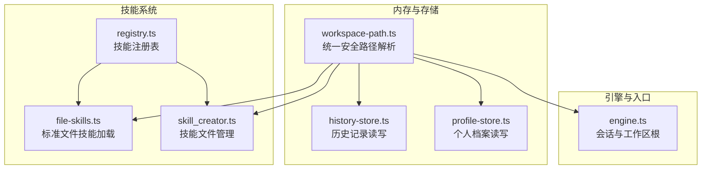
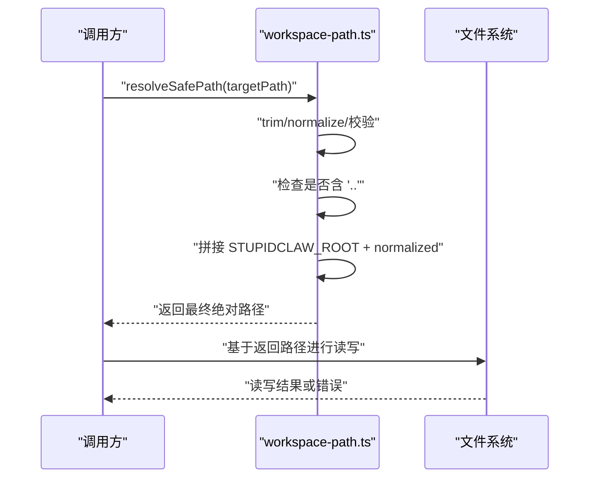
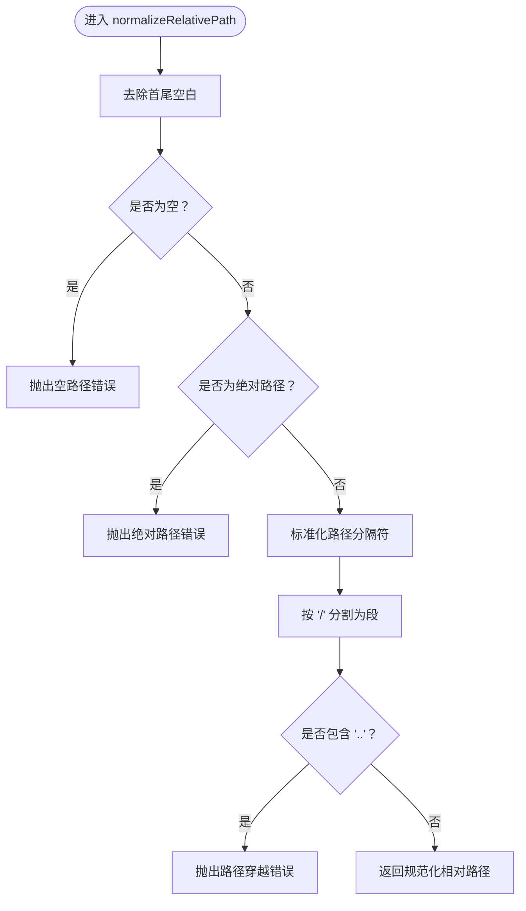
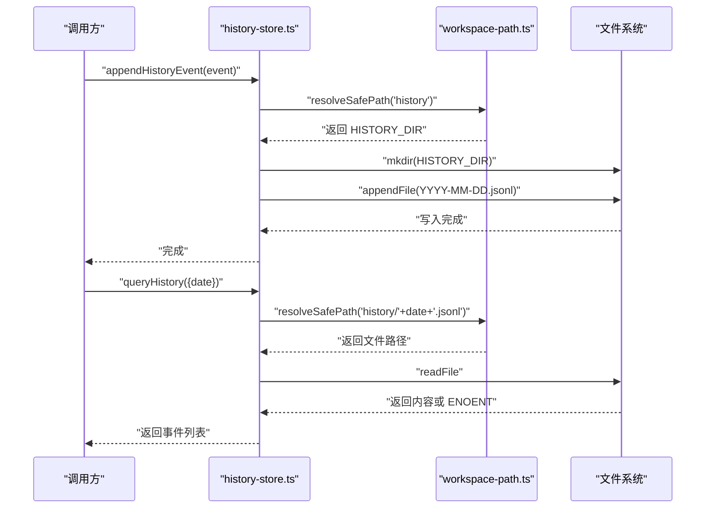
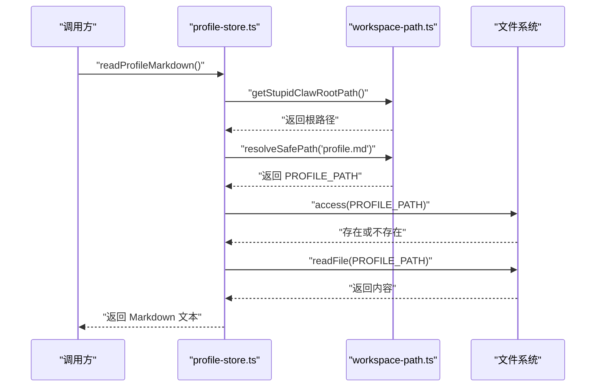
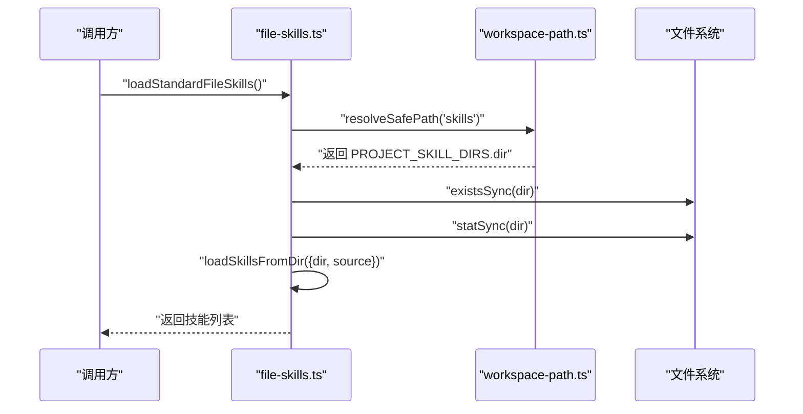
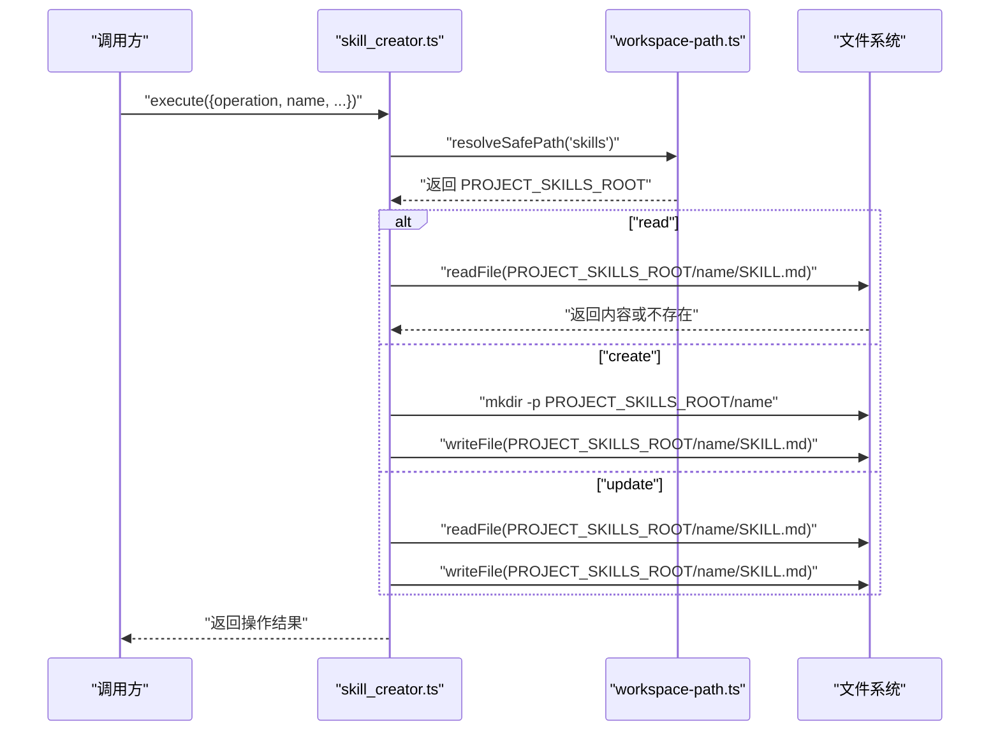
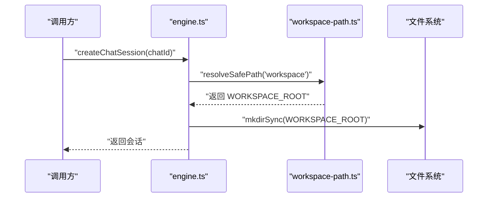
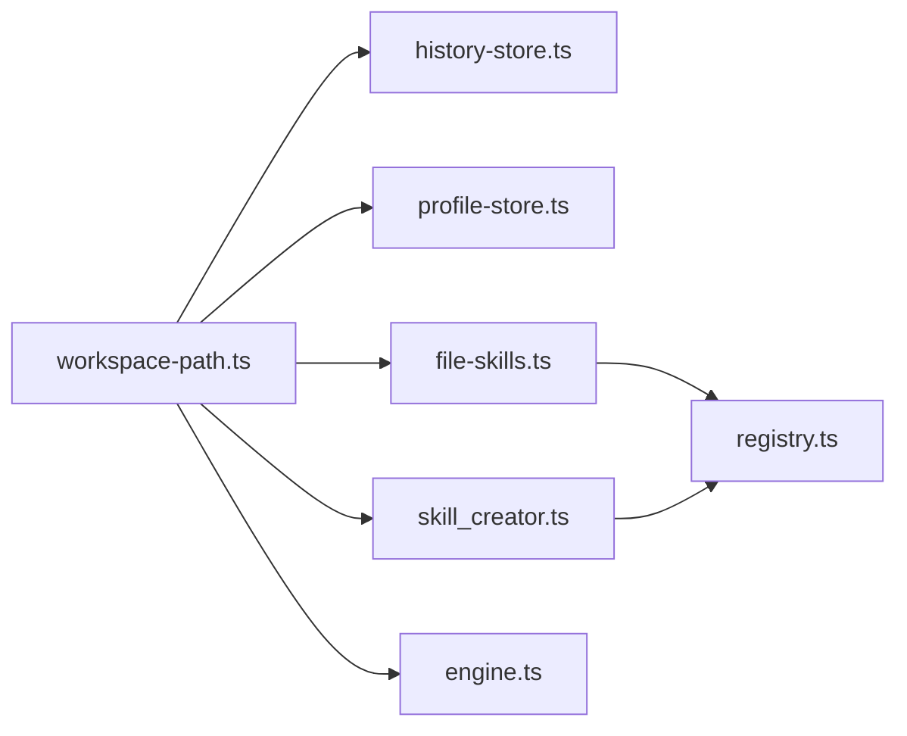

# 工作区路径扩展

<cite>
**本文档引用的文件**
- [workspace-path.ts](file://src/memory/workspace-path.ts)
- [workspace-path.test.ts](file://src/memory/workspace-path.test.ts)
- [StupidClaw-第5期-安全沙盒PathJailing防止越权读写.md](file://StupidClaw-第5期-安全沙盒PathJailing防止越权读写.md)
- [history-store.ts](file://src/memory/history-store.ts)
- [profile-store.ts](file://src/memory/profile-store.ts)
- [file-skills.ts](file://src/skills/file-skills.ts)
- [skill_creator.ts](file://src/skills/system/skill_creator.ts)
- [engine.ts](file://src/engine.ts)
- [registry.ts](file://src/skills/registry.ts)
- [package.json](file://package.json)
</cite>

## 目录
1. [简介](#简介)
2. [项目结构](#项目结构)
3. [核心组件](#核心组件)
4. [架构总览](#架构总览)
5. [详细组件分析](#详细组件分析)
6. [依赖关系分析](#依赖关系分析)
7. [性能考量](#性能考量)
8. [故障排查指南](#故障排查指南)
9. [结论](#结论)
10. [附录](#附录)

## 简介
本指南围绕现有安全路径沙盒机制，系统性讲解如何扩展工作区路径能力，包括新增路径验证规则、访问控制策略与权限管理方案。重点解释 resolveSafePath 函数的安全设计原理、路径规范化处理与越权访问防护机制，并提供自定义路径策略的实现示例（白名单机制、路径映射、虚拟文件系统），以及安全审计、访问日志与异常处理的最佳实践。目标是在不破坏现有边界的前提下，平滑引入更细粒度的访问控制与审计能力。

## 项目结构
本项目采用分层与功能模块结合的组织方式，安全路径沙盒集中于 memory 层的 workspace-path.ts，其他模块通过统一入口接入，确保所有文件落点收敛到 .stupidClaw 根目录下，避免越权访问。

图表来源
- [workspace-path.ts:1-42](file://src/memory/workspace-path.ts#L1-L42)
- [history-store.ts:1-83](file://src/memory/history-store.ts#L1-L83)
- [profile-store.ts:1-132](file://src/memory/profile-store.ts#L1-L132)
- [file-skills.ts:1-65](file://src/skills/file-skills.ts#L1-L65)
- [skill_creator.ts:1-312](file://src/skills/system/skill_creator.ts#L1-L312)
- [engine.ts:1-706](file://src/engine.ts#L1-L706)
- [registry.ts:1-55](file://src/skills/registry.ts#L1-L55)

章节来源
- [workspace-path.ts:1-42](file://src/memory/workspace-path.ts#L1-L42)
- [engine.ts:37-421](file://src/engine.ts#L37-L421)

## 核心组件
- 统一安全路径解析器：提供 getStupidClawRootPath 与 resolveSafePath，负责路径规范化、越权检测与最终路径生成。
- 历史记录存储：通过 resolveSafePath 将历史按日期落盘至 .stupidClaw/history。
- 个人档案存储：通过 resolveSafePath 确保 profile.md 在 .stupidClaw 根目录下。
- 文件技能加载：统一从 .stupidClaw/skills 加载技能文件。
- 技能文件管理：通过 resolveSafePath 创建/读取/更新 .stupidClaw/skills/<name>/SKILL.md。
- 引擎工作区根：通过 resolveSafePath 设置 Agent 工作区根目录为 .stupidClaw/workspace。

章节来源
- [workspace-path.ts:28-42](file://src/memory/workspace-path.ts#L28-L42)
- [history-store.ts:20-35](file://src/memory/history-store.ts#L20-L35)
- [profile-store.ts:18-19](file://src/memory/profile-store.ts#L18-L19)
- [file-skills.ts:15-24](file://src/skills/file-skills.ts#L15-L24)
- [skill_creator.ts:7-150](file://src/skills/system/skill_creator.ts#L7-L150)
- [engine.ts:37-421](file://src/engine.ts#L37-L421)

## 架构总览
安全路径沙盒以“一处定义、多处复用”为核心原则，所有文件落点统一收敛到 .stupidClaw 根目录，路径解析阶段即刻拒绝越权路径，形成硬约束的访问边界。

图表来源
- [workspace-path.ts:6-35](file://src/memory/workspace-path.ts#L6-L35)
- [engine.ts:421-421](file://src/engine.ts#L421-L421)

## 详细组件分析

### 组件A：统一安全路径解析器（workspace-path.ts）
- 设计要点
  - 规范化处理：去除首尾空白、标准化分隔符、禁止空路径。
  - 越权防护：拒绝绝对路径与包含 “..” 的路径段。
  - 边界固化：最终路径通过 path.resolve(STUPIDCLAW_ROOT, normalized) 生成，保证始终位于 .stupidClaw 下。
- 复杂度分析
  - 时间复杂度：O(n)，n 为路径字符串长度（主要由 normalize 与 split 操作决定）。
  - 空间复杂度：O(n)，用于存储规范化后的路径与分割后的段。
- 错误处理
  - 对空路径、绝对路径、包含 “..” 的路径抛出明确错误，便于上层捕获与审计。
- 性能影响
  - 单次解析开销极低，适合高频调用场景。

图表来源
- [workspace-path.ts:6-26](file://src/memory/workspace-path.ts#L6-L26)

章节来源
- [workspace-path.ts:6-35](file://src/memory/workspace-path.ts#L6-L35)
- [workspace-path.test.ts:6-28](file://src/memory/workspace-path.test.ts#L6-L28)

### 组件B：历史记录存储（history-store.ts）
- 访问控制策略
  - 使用 resolveSafePath 固定历史目录为 .stupidClaw/history。
  - 日期文件命名规范，避免跨目录越权。
- 权限管理方案
  - 通过 ensureHistoryDir 递归创建目录，确保写入权限。
  - 查询时对 ENOENT 进行特殊处理，避免异常传播。
- 审计与日志
  - appendHistoryEvent 与 queryHistory 均在上层通过 safeAppend 与错误捕获进行统一处理，便于审计。

图表来源
- [history-store.ts:20-82](file://src/memory/history-store.ts#L20-L82)
- [workspace-path.ts:32-35](file://src/memory/workspace-path.ts#L32-L35)

章节来源
- [history-store.ts:20-82](file://src/memory/history-store.ts#L20-L82)

### 组件C：个人档案存储（profile-store.ts）
- 访问控制策略
  - PROFILE_PATH 通过 resolveSafePath 固定为 .stupidClaw/profile.md。
  - WORKSPACE_DIR 通过 getStupidClawRootPath 获取根目录，确保写入在 .stupidClaw 下。
- 权限管理方案
  - ensureProfileFile 在根目录不存在时自动创建，保证后续读写可用。
  - 读写均采用 UTF-8 编码，避免编码问题导致的越权。
- 审计与日志
  - 读写操作在上层统一处理，便于记录访问日志与异常。

图表来源
- [profile-store.ts:18-115](file://src/memory/profile-store.ts#L18-L115)
- [workspace-path.ts:28-35](file://src/memory/workspace-path.ts#L28-L35)

章节来源
- [profile-store.ts:18-115](file://src/memory/profile-store.ts#L18-L115)

### 组件D：文件技能加载（file-skills.ts）
- 访问控制策略
  - PROJECT_SKILL_DIRS 中的 dir 通过 resolveSafePath("skills") 固定为 .stupidClaw/skills。
  - 仅从该项目技能目录加载，避免外部越权路径。
- 权限管理方案
  - 通过 loadSkillsFromDir 从目录中加载技能，保持只读访问。
- 审计与日志
  - 加载完成后汇总技能元信息，便于后续审计与展示。

图表来源
- [file-skills.ts:15-48](file://src/skills/file-skills.ts#L15-L48)
- [workspace-path.ts:32-35](file://src/memory/workspace-path.ts#L32-L35)

章节来源
- [file-skills.ts:15-48](file://src/skills/file-skills.ts#L15-L48)

### 组件E：技能文件管理（skill_creator.ts）
- 访问控制策略
  - PROJECT_SKILLS_ROOT 通过 resolveSafePath("skills") 固定为 .stupidClaw/skills。
  - 每个技能独立子目录，避免跨目录越权。
- 权限管理方案
  - create：创建目录与 SKILL.md，确保目录存在。
  - read：读取现有内容，若不存在返回明确提示。
  - update：支持完整替换或仅更新 description，保留原有 body。
- 审计与日志
  - 所有操作均返回结构化结果，便于上层记录操作日志与审计。

图表来源
- [skill_creator.ts:7-300](file://src/skills/system/skill_creator.ts#L7-L300)
- [workspace-path.ts:32-35](file://src/memory/workspace-path.ts#L32-L35)

章节来源
- [skill_creator.ts:7-300](file://src/skills/system/skill_creator.ts#L7-L300)

### 组件F：引擎工作区根（engine.ts）
- 访问控制策略
  - WORKSPACE_ROOT 通过 resolveSafePath("workspace") 固定为 .stupidClaw/workspace。
  - Agent 会话的 cwd 与工具链均基于此根路径，确保所有文件操作在沙盒内。
- 权限管理方案
  - 会话创建前确保目录存在，避免权限不足导致的失败。
- 审计与日志
  - safeAppend 将工具调用与结果写入历史，便于审计与回溯。

图表来源
- [engine.ts:37-421](file://src/engine.ts#L37-L421)
- [workspace-path.ts:32-35](file://src/memory/workspace-path.ts#L32-L35)

章节来源
- [engine.ts:37-421](file://src/engine.ts#L37-L421)

### 组件G：技能注册表（registry.ts）
- 访问控制策略
  - 通过 createSkillRegistry 组织技能集合，文件技能与系统技能分离，便于统一管理。
- 权限管理方案
  - 仅暴露必要的元信息与工具定义，不直接暴露底层路径。
- 审计与日志
  - 列出可用技能时包含 exposure 信息，便于审计技能暴露面。

章节来源
- [registry.ts:23-54](file://src/skills/registry.ts#L23-L54)

## 依赖关系分析
- workspace-path.ts 是所有文件落点的唯一入口，耦合度低、内聚性强。
- history-store.ts、profile-store.ts、file-skills.ts、skill_creator.ts、engine.ts 均依赖 workspace-path.ts 提供的路径解析能力。
- registry.ts 间接依赖 file-skills.ts 与 skill_creator.ts，从而间接依赖 workspace-path.ts。

图表来源
- [workspace-path.ts:1-42](file://src/memory/workspace-path.ts#L1-L42)
- [history-store.ts:1-83](file://src/memory/history-store.ts#L1-L83)
- [profile-store.ts:1-132](file://src/memory/profile-store.ts#L1-L132)
- [file-skills.ts:1-65](file://src/skills/file-skills.ts#L1-L65)
- [skill_creator.ts:1-312](file://src/skills/system/skill_creator.ts#L1-L312)
- [engine.ts:1-706](file://src/engine.ts#L1-L706)
- [registry.ts:1-55](file://src/skills/registry.ts#L1-L55)

章节来源
- [workspace-path.ts:1-42](file://src/memory/workspace-path.ts#L1-L42)
- [registry.ts:1-55](file://src/skills/registry.ts#L1-L55)

## 性能考量
- resolveSafePath 为常数级开销，适合高频调用。
- 文件系统操作（mkdir、readFile、appendFile）为 I/O 密集，建议批量写入与缓存策略优化。
- 历史记录与个人档案的读写频率较高，建议在上层增加异步队列与去抖策略，减少频繁 I/O。

## 故障排查指南
- 路径错误
  - 空路径：检查输入是否为空或仅包含空白字符。
  - 绝对路径：确保传入的是相对路径。
  - 路径穿越：避免包含 “..” 的路径段。
- 文件系统错误
  - ENOENT：查询历史或读取档案时文件不存在属预期，应返回空结果或默认值。
  - 权限不足：确保 .stupidClaw 目录存在且具备写权限。
- 引擎错误
  - API Key 无效：根据 normalizeApiKeyError 的提示检查 .env 配置。
  - 会话创建失败：确认 WORKSPACE_ROOT 已正确创建。

章节来源
- [workspace-path.test.ts:14-28](file://src/memory/workspace-path.test.ts#L14-L28)
- [history-store.ts:72-82](file://src/memory/history-store.ts#L72-L82)
- [engine.ts:453-455](file://src/engine.ts#L453-L455)

## 结论
通过统一安全路径解析器与严格的路径规范化、越权检测机制，项目实现了“一处定义、多处复用”的安全边界。在此基础上，可进一步引入白名单机制、路径映射与虚拟文件系统等方案，以满足更复杂的访问控制需求。同时，完善的审计与异常处理流程能够有效提升系统的可观测性与安全性。

## 附录

### 自定义路径策略实现示例

- 白名单机制
  - 在 resolveSafePath 前增加白名单校验，仅允许特定前缀或目录下的路径通过。
  - 示例思路：维护允许的路径前缀数组，若目标路径不在任何前缀下则拒绝。
- 路径映射
  - 通过映射表将外部可见路径映射到 .stupidClaw 内部真实路径，实现逻辑隔离。
  - 示例思路：建立 { externalPath: internalPath } 映射，解析时先查找映射再进行规范化。
- 虚拟文件系统
  - 在 resolveSafePath 之后，对最终路径进行二次校验，结合权限矩阵判断是否允许访问。
  - 示例思路：为不同模块分配访问令牌，访问时比对令牌与路径权限矩阵。

章节来源
- [workspace-path.ts:6-35](file://src/memory/workspace-path.ts#L6-L35)

### 安全审计与访问日志最佳实践
- 审计范围
  - 记录 resolveSafePath 的调用参数、返回路径与调用时间。
  - 记录文件系统操作（读、写、删除）的路径、操作类型与结果。
- 日志格式
  - 包含时间戳、操作类型、路径、调用者标识、结果状态与错误信息。
- 异常处理
  - 对所有 I/O 操作进行 try/catch，并在上层统一记录与上报。
  - 对越权路径与权限不足进行明确告警，便于追踪。

章节来源
- [engine.ts:477-482](file://src/engine.ts#L477-L482)
- [history-store.ts:72-82](file://src/memory/history-store.ts#L72-L82)
- [profile-store.ts:103-110](file://src/memory/profile-store.ts#L103-L110)