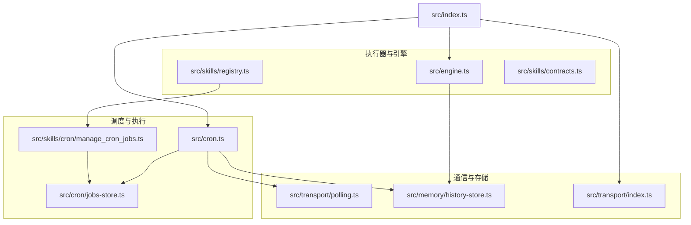
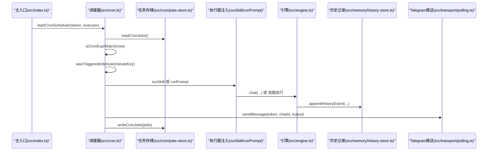
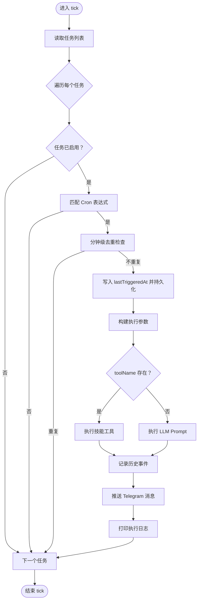
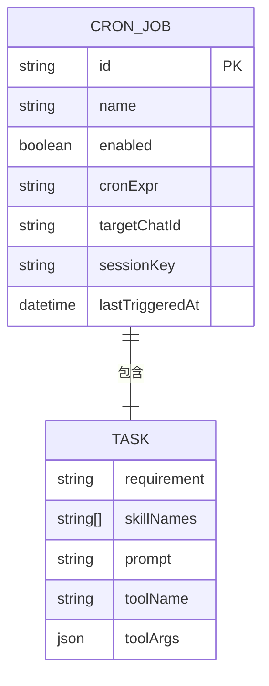
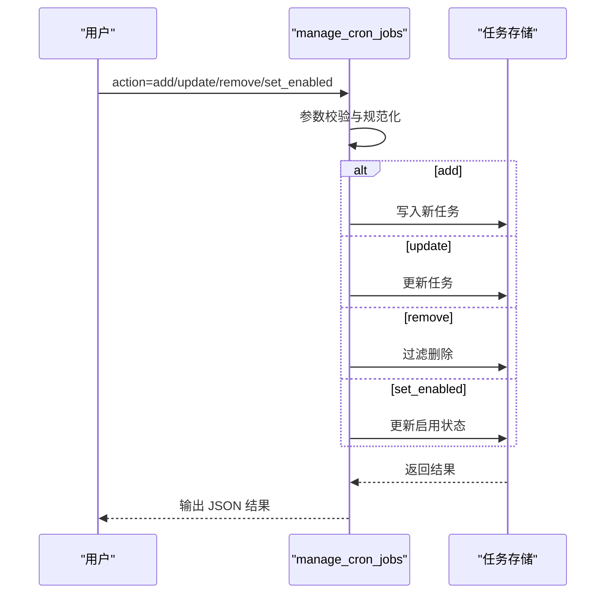
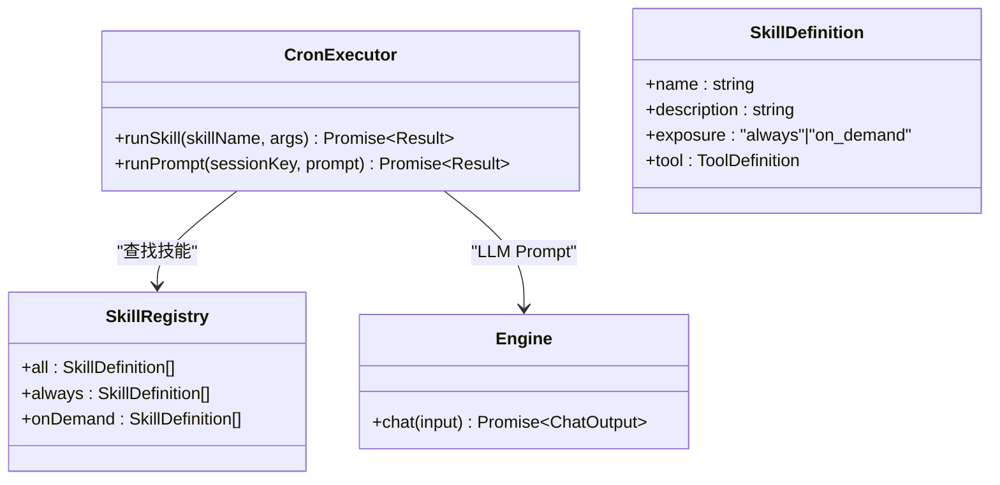
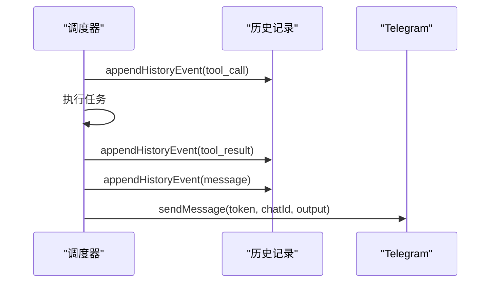
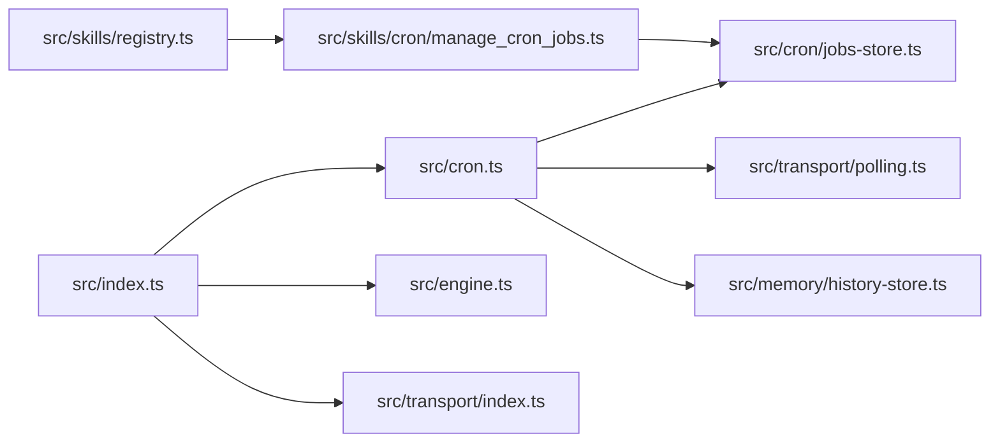

# 定时任务系统扩展

<cite>
**本文档引用的文件**
- [src/cron.ts](file://src/cron.ts)
- [src/cron/jobs-store.ts](file://src/cron/jobs-store.ts)
- [src/skills/cron/manage_cron_jobs.ts](file://src/skills/cron/manage_cron_jobs.ts)
- [src/engine.ts](file://src/engine.ts)
- [src/memory/history-store.ts](file://src/memory/history-store.ts)
- [src/transport/polling.ts](file://src/transport/polling.ts)
- [src/skills/contracts.ts](file://src/skills/contracts.ts)
- [src/skills/registry.ts](file://src/skills/registry.ts)
- [src/transport/index.ts](file://src/transport/index.ts)
- [src/index.ts](file://src/index.ts)
- [src/cron/cron.test.ts](file://src/cron/cron.test.ts)
</cite>

## 目录
1. [简介](#简介)
2. [项目结构](#项目结构)
3. [核心组件](#核心组件)
4. [架构总览](#架构总览)
5. [详细组件分析](#详细组件分析)
6. [依赖关系分析](#依赖关系分析)
7. [性能考量](#性能考量)
8. [故障排查指南](#故障排查指南)
9. [结论](#结论)
10. [附录](#附录)

## 简介
本指南面向希望扩展现有定时任务系统的开发者，围绕 Cron 调度功能提供从任务定义、调度实现到执行结果处理的完整扩展流程。重点涵盖：
- 新的任务类型与执行路径（直接工具调用 vs LLM 驱动 Prompt）
- 自定义调度策略的扩展点（基于现有五段 Cron 表达式的解析与匹配）
- 任务管理接口（增删改查与启用/禁用）
- 任务存储机制（单文件 JSON 持久化与兼容旧格式）
- 调度算法与执行监控（分钟级去重、历史事件记录、错误恢复与通知）
- 高级特性建议（任务优先级、并发控制、错误重试与幂等）

## 项目结构
定时任务系统主要由以下模块组成：
- 调度与执行：负责 Cron 表达式匹配、调度循环、任务触发与执行结果上报
- 任务存储：负责任务数据的读写、校验与兼容旧格式
- 任务管理技能：提供对外管理任务的工具接口
- 执行器注入：在主入口将技能与引擎注入到调度器
- 历史与通信：记录执行历史与向 Telegram 推送结果

**图表来源**
- [src/cron.ts:1-265](file://src/cron.ts#L1-L265)
- [src/cron/jobs-store.ts:1-151](file://src/cron/jobs-store.ts#L1-L151)
- [src/skills/cron/manage_cron_jobs.ts:1-336](file://src/skills/cron/manage_cron_jobs.ts#L1-L336)
- [src/engine.ts:1-706](file://src/engine.ts#L1-L706)
- [src/transport/polling.ts:1-243](file://src/transport/polling.ts#L1-L243)
- [src/memory/history-store.ts:1-83](file://src/memory/history-store.ts#L1-L83)
- [src/transport/index.ts:1-71](file://src/transport/index.ts#L1-L71)
- [src/index.ts:1-216](file://src/index.ts#L1-L216)

**章节来源**
- [src/cron.ts:1-265](file://src/cron.ts#L1-L265)
- [src/cron/jobs-store.ts:1-151](file://src/cron/jobs-store.ts#L1-L151)
- [src/skills/cron/manage_cron_jobs.ts:1-336](file://src/skills/cron/manage_cron_jobs.ts#L1-L336)
- [src/index.ts:112-187](file://src/index.ts#L112-L187)

## 核心组件
- Cron 调度器与执行器
  - Cron 表达式解析与匹配（分钟/小时/日/月/周五段）
  - 分钟级去重，避免同一分钟重复触发
  - 两种执行路径：直接工具调用（toolName）与 LLM Prompt 驱动
  - 执行历史记录与 Telegram 主动推送
- 任务存储
  - 单文件 JSON 持久化，包含任务列表与最后触发时间
  - 兼容旧格式字段（如 chatId、mode=tool 的 legacy 字段）
- 任务管理技能
  - 支持 list/add/update/remove/set_enabled
  - 参数校验与五段 Cron 格式校验
- 执行器注入
  - 在主入口将技能与引擎注入到调度器，统一 runSkill/runPrompt 接口
- 历史与通信
  - 历史事件按日期分文件追加
  - Telegram 消息分片与 HTML 渲染

**章节来源**
- [src/cron.ts:85-109](file://src/cron.ts#L85-L109)
- [src/cron.ts:171-249](file://src/cron.ts#L171-L249)
- [src/cron/jobs-store.ts:29-113](file://src/cron/jobs-store.ts#L29-L113)
- [src/skills/cron/manage_cron_jobs.ts:10-336](file://src/skills/cron/manage_cron_jobs.ts#L10-L336)
- [src/index.ts:125-187](file://src/index.ts#L125-L187)
- [src/memory/history-store.ts:37-42](file://src/memory/history-store.ts#L37-L42)
- [src/transport/polling.ts:215-242](file://src/transport/polling.ts#L215-L242)

## 架构总览
下图展示从主入口启动到任务触发与结果推送的全链路：

**图表来源**
- [src/index.ts:125-187](file://src/index.ts#L125-L187)
- [src/cron.ts:171-249](file://src/cron.ts#L171-L249)
- [src/cron/jobs-store.ts:124-142](file://src/cron/jobs-store.ts#L124-L142)
- [src/engine.ts:680-705](file://src/engine.ts#L680-L705)
- [src/memory/history-store.ts:37-42](file://src/memory/history-store.ts#L37-L42)
- [src/transport/polling.ts:215-242](file://src/transport/polling.ts#L215-L242)

## 详细组件分析

### 组件一：Cron 调度与执行
- Cron 表达式匹配
  - 支持通配符、列表、范围与步进语法
  - 严格校验五段格式与数值范围
- 调度循环与去重
  - 每 15 秒 tick 一次
  - 使用分钟级时间戳去重，避免重复触发
- 两种执行路径
  - toolName 存在：直接调用技能工具（绕过 LLM）
  - 无 toolName：构造 Prompt 并交由引擎执行
- 执行监控
  - 记录 tool_call/tool_result/message 事件
  - 异常时记录错误并主动推送 Telegram

**图表来源**
- [src/cron.ts:171-249](file://src/cron.ts#L171-L249)

**章节来源**
- [src/cron.ts:16-109](file://src/cron.ts#L16-L109)
- [src/cron.ts:171-249](file://src/cron.ts#L171-L249)

### 组件二：任务存储与兼容
- 数据结构
  - 任务对象包含 id/name/enabled/cronExpr/targetChatId/sessionKey/task(lastTriggeredAt)
  - task 对象包含 requirement/skillNames/prompt/toolName/toolArgs
- 文件读写
  - 不存在则初始化空任务列表
  - 读取时进行最小结构校验，过滤非法项
  - 写入时整文件覆盖
- 兼容旧格式
  - 支持 legacy chatId、mode=tool 的 legacy skill 与 args
  - 自动迁移与校验

**图表来源**
- [src/cron/jobs-store.ts:4-21](file://src/cron/jobs-store.ts#L4-L21)

**章节来源**
- [src/cron/jobs-store.ts:29-142](file://src/cron/jobs-store.ts#L29-L142)

### 组件三：任务管理技能
- 支持动作
  - list：列出所有任务
  - add：新增任务（校验必填与 Cron 格式）
  - update：更新任务（支持部分字段更新）
  - remove：删除任务
  - set_enabled：启用/禁用任务
- 参数校验
  - action 合法性
  - Cron 表达式必须为五段
  - toolName 存在时无需 skillNames/prompt
  - 无 toolName 时至少提供 skillNames/prompt/requirement 之一

**图表来源**
- [src/skills/cron/manage_cron_jobs.ts:98-332](file://src/skills/cron/manage_cron_jobs.ts#L98-L332)
- [src/cron/jobs-store.ts:124-142](file://src/cron/jobs-store.ts#L124-L142)

**章节来源**
- [src/skills/cron/manage_cron_jobs.ts:10-336](file://src/skills/cron/manage_cron_jobs.ts#L10-L336)

### 组件四：执行器注入与引擎集成
- 执行器接口
  - runSkill(skillName, args)：执行技能工具
  - runPrompt(sessionKey, prompt)：执行 LLM Prompt
- 注入方式
  - 主入口根据技能注册表动态查找技能并执行
  - LLM 路径通过引擎 chat(...) 实现
- 错误处理
  - 统一封装错误输出，便于历史记录与 Telegram 推送

**图表来源**
- [src/cron.ts:5-14](file://src/cron.ts#L5-L14)
- [src/skills/registry.ts:23-54](file://src/skills/registry.ts#L23-L54)
- [src/engine.ts:680-705](file://src/engine.ts#L680-L705)

**章节来源**
- [src/cron.ts:5-14](file://src/cron.ts#L5-L14)
- [src/index.ts:125-187](file://src/index.ts#L125-L187)
- [src/skills/registry.ts:23-54](file://src/skills/registry.ts#L23-L54)
- [src/engine.ts:680-705](file://src/engine.ts#L680-L705)

### 组件五：历史记录与通信
- 历史记录
  - 按日期分文件追加 JSONL
  - 支持查询历史事件（按 chatId/date/limit）
- 通信
  - Telegram 消息分片与 HTML 渲染
  - 支持发送 typing 状态与错误回退

**图表来源**
- [src/cron.ts:197-224](file://src/cron.ts#L197-L224)
- [src/memory/history-store.ts:37-42](file://src/memory/history-store.ts#L37-L42)
- [src/transport/polling.ts:215-242](file://src/transport/polling.ts#L215-L242)

**章节来源**
- [src/memory/history-store.ts:37-82](file://src/memory/history-store.ts#L37-L82)
- [src/transport/polling.ts:96-242](file://src/transport/polling.ts#L96-L242)

## 依赖关系分析
- 组件耦合
  - cron.ts 依赖 jobs-store.ts（读写）、transport/polling.ts（推送）、memory/history-store.ts（记录）
  - manage_cron_jobs.ts 依赖 jobs-store.ts（读写）
  - index.ts 依赖 cron.ts（启动）、engine.ts（LLM 执行）、transport/index.ts（消息通道）
- 外部依赖
  - Telegram Bot API（轮询与 Webhook）
  - pi-coding-agent（引擎与工具系统）

**图表来源**
- [src/index.ts:1-216](file://src/index.ts#L1-L216)
- [src/cron.ts:1-265](file://src/cron.ts#L1-L265)
- [src/cron/jobs-store.ts:1-151](file://src/cron/jobs-store.ts#L1-L151)
- [src/skills/cron/manage_cron_jobs.ts:1-336](file://src/skills/cron/manage_cron_jobs.ts#L1-L336)
- [src/skills/registry.ts:1-55](file://src/skills/registry.ts#L1-L55)
- [src/transport/index.ts:1-71](file://src/transport/index.ts#L1-L71)
- [src/transport/polling.ts:1-243](file://src/transport/polling.ts#L1-L243)
- [src/memory/history-store.ts:1-83](file://src/memory/history-store.ts#L1-L83)
- [src/engine.ts:1-706](file://src/engine.ts#L1-L706)

**章节来源**
- [src/index.ts:1-216](file://src/index.ts#L1-L216)
- [src/cron.ts:1-265](file://src/cron.ts#L1-L265)
- [src/cron/jobs-store.ts:1-151](file://src/cron/jobs-store.ts#L1-L151)
- [src/skills/cron/manage_cron_jobs.ts:1-336](file://src/skills/cron/manage_cron_jobs.ts#L1-L336)
- [src/skills/registry.ts:1-55](file://src/skills/registry.ts#L1-L55)
- [src/transport/index.ts:1-71](file://src/transport/index.ts#L1-L71)
- [src/transport/polling.ts:1-243](file://src/transport/polling.ts#L1-L243)
- [src/memory/history-store.ts:1-83](file://src/memory/history-store.ts#L1-L83)
- [src/engine.ts:1-706](file://src/engine.ts#L1-L706)

## 性能考量
- 调度频率
  - 每 15 秒 tick 一次，平衡实时性与资源消耗
- IO 优化
  - 任务列表每次 tick 读取，写入仅在触发前更新 lastTriggeredAt 并持久化
  - 历史记录采用追加写，避免大文件随机写
- 通信优化
  - Telegram 消息分片与 HTML 渲染，失败时回退纯文本
- 并发与去重
  - 分钟级去重避免重复触发
  - 建议扩展：为不同任务分配独立锁或队列，避免长耗时任务阻塞后续触发

[本节为通用指导，不直接分析具体文件]

## 故障排查指南
- 常见问题
  - TELEGRAM_BOT_TOKEN 未配置：Telegram 轮询与定时任务不会启动
  - Cron 表达式非法：匹配返回 false，任务不会触发
  - 任务参数缺失：toolName 缺失时需提供 skillNames/prompt/requirement 至少一项
  - 技能不存在：runSkill 时找不到技能名称
  - 历史文件异常：JSONL 坏行不影响查询，但需检查文件完整性
- 排查步骤
  - 检查 .env 配置与 TELEGRAM_MODE
  - 校验 cron_jobs.json 格式与字段
  - 查看控制台日志与历史记录文件
  - 使用 manage_cron_jobs 的 list 功能核对任务状态

**章节来源**
- [src/index.ts:117-120](file://src/index.ts#L117-L120)
- [src/skills/cron/manage_cron_jobs.ts:164-188](file://src/skills/cron/manage_cron_jobs.ts#L164-L188)
- [src/cron.ts:225-246](file://src/cron.ts#L225-L246)
- [src/memory/history-store.ts:72-82](file://src/memory/history-store.ts#L72-L82)

## 结论
该定时任务系统以简洁的五段 Cron 表达式为核心，结合单文件任务存储与统一执行器接口，实现了从任务定义到执行监控的完整闭环。通过扩展任务类型（toolName 固定参数 vs LLM 动态生成）、自定义调度策略（表达式语法增强）、以及完善的历史记录与错误恢复机制，可在不引入复杂第三方调度库的前提下满足多数自动化场景需求。

[本节为总结性内容，不直接分析具体文件]

## 附录

### 扩展流程（从任务定义到调度实现再到执行结果处理）
- 定义任务
  - 通过 manage_cron_jobs 的 add 动作创建任务，确保 cronExpr 为五段格式
  - 根据场景选择 toolName（固定参数）或 skillNames/prompt（LLM 动态生成）
- 启动调度
  - 主入口启动 startCronScheduler(token, executor)，周期性执行 tick
  - tick 读取任务、匹配表达式、分钟级去重、执行并记录历史
- 执行结果处理
  - 执行成功/失败均记录 tool_result 与 message 事件
  - 通过 Telegram 主动推送结果，便于运维与审计

**章节来源**
- [src/skills/cron/manage_cron_jobs.ts:136-214](file://src/skills/cron/manage_cron_jobs.ts#L136-L214)
- [src/cron.ts:171-249](file://src/cron.ts#L171-L249)
- [src/memory/history-store.ts:37-42](file://src/memory/history-store.ts#L37-L42)
- [src/transport/polling.ts:215-242](file://src/transport/polling.ts#L215-L242)

### 高级特性建议（实现方法）
- 任务优先级管理
  - 在任务对象中增加 priority 字段，调度时按优先级排序执行
  - 或在 tick 中按优先级分组串行执行
- 并发控制
  - 为每个任务维护执行队列与并发计数，超过阈值的任务延迟至下一周期
- 错误恢复与重试
  - 在异常分支记录错误并可选地增加重试次数与退避策略
  - 对于 Telegram 推送失败，记录失败原因并异步重试
- 幂等性
  - 为任务执行引入唯一标识（如任务 id+时间戳），避免重复处理

[本节为概念性建议，不直接分析具体文件]

### 测试参考
- Cron 表达式匹配测试
  - 覆盖每小时特定时间命中、步进与列表语法、非法表达式返回 false

**章节来源**
- [src/cron/cron.test.ts:1-26](file://src/cron/cron.test.ts#L1-L26)