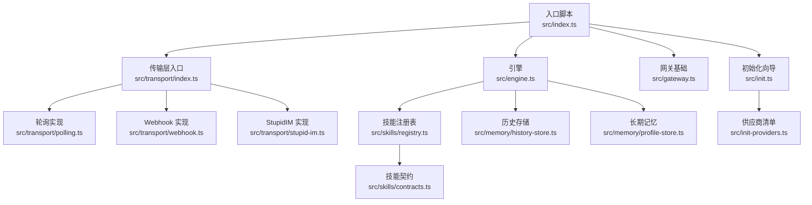
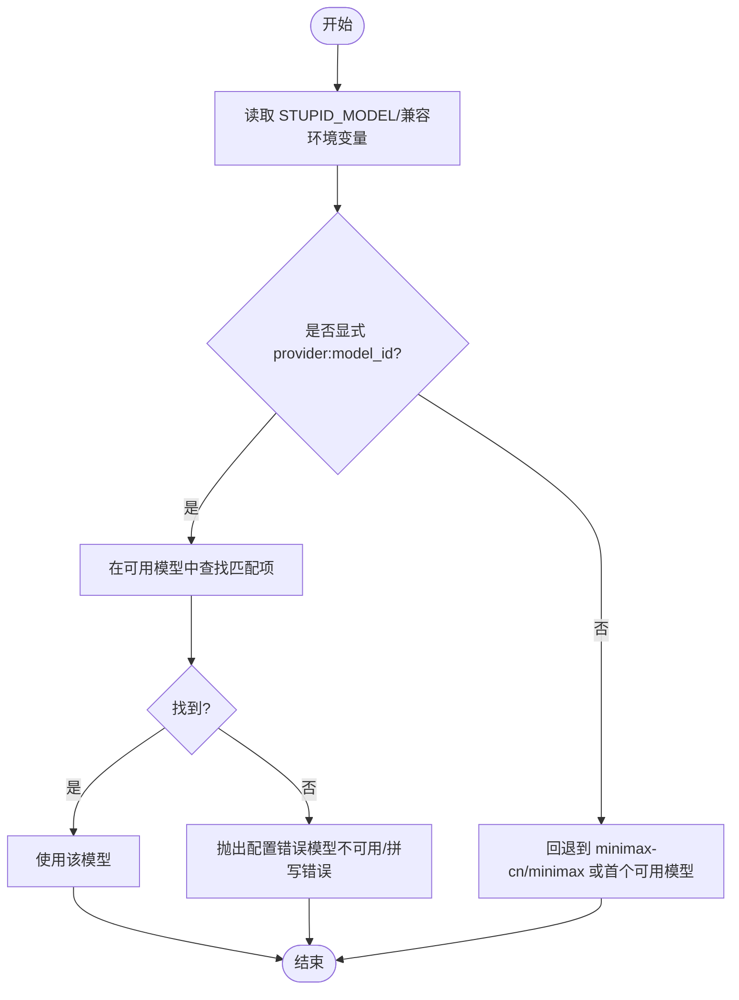
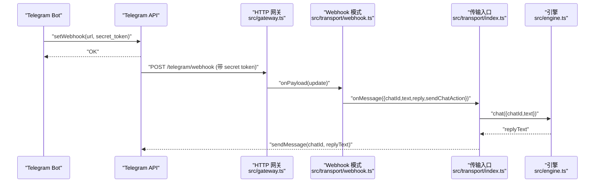
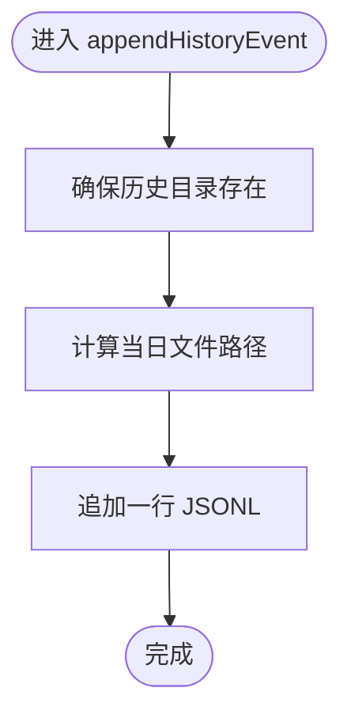
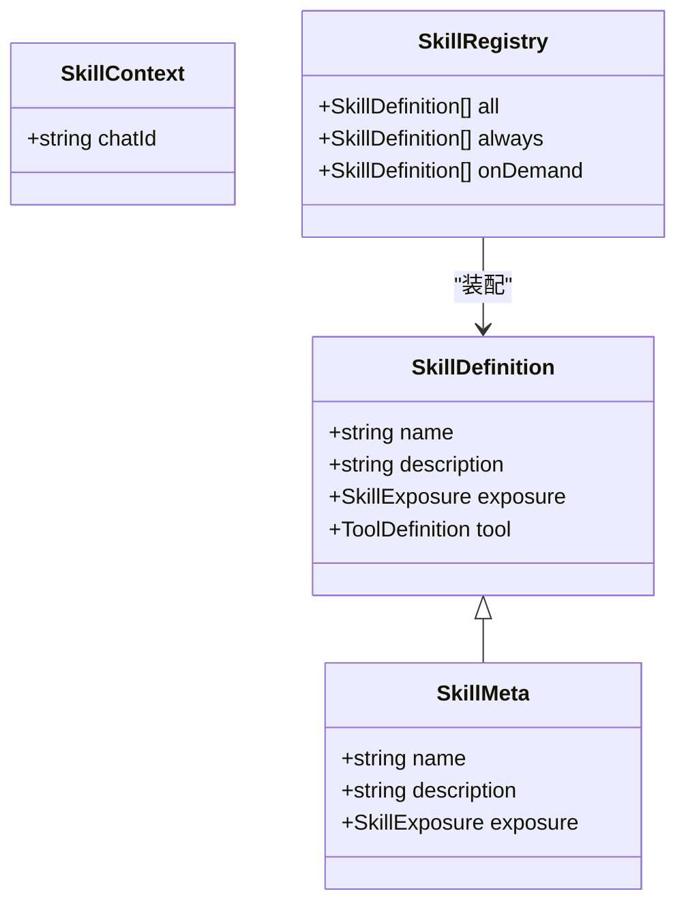
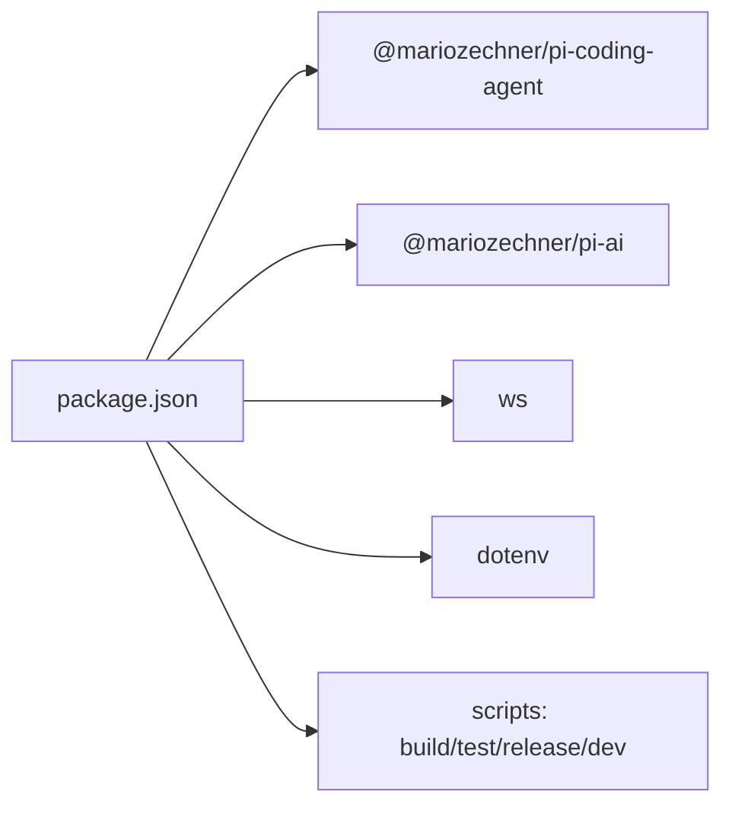

# 扩展开发

<cite>
**本文引用的文件**
- [src/index.ts](file://src/index.ts)
- [src/engine.ts](file://src/engine.ts)
- [src/init.ts](file://src/init.ts)
- [src/init-providers.ts](file://src/init-providers.ts)
- [src/gateway.ts](file://src/gateway.ts)
- [src/transport/index.ts](file://src/transport/index.ts)
- [src/transport/polling.ts](file://src/transport/polling.ts)
- [src/transport/webhook.ts](file://src/transport/webhook.ts)
- [src/transport/stupid-im.ts](file://src/transport/stupid-im.ts)
- [src/skills/registry.ts](file://src/skills/registry.ts)
- [src/skills/contracts.ts](file://src/skills/contracts.ts)
- [src/memory/history-store.ts](file://src/memory/history-store.ts)
- [src/memory/profile-store.ts](file://src/memory/profile-store.ts)
- [package.json](file://package.json)
- [README.md](file://README.md)
</cite>

## 目录
1. [简介](#简介)
2. [项目结构](#项目结构)
3. [核心组件](#核心组件)
4. [架构总览](#架构总览)
5. [详细组件分析](#详细组件分析)
6. [依赖关系分析](#依赖关系分析)
7. [性能考量](#性能考量)
8. [故障排查指南](#故障排查指南)
9. [结论](#结论)
10. [附录](#附录)

## 简介
本指南面向希望对 StupidClaw 进行扩展开发的工程师，涵盖以下主题：
- 新增 AI 供应商支持（含 OpenAI 兼容与 Anthropic 兼容）
- 扩展现有传输层（Polling/Webhook/StupidIM）
- 开发新的内存管理功能（历史与长期记忆）
- 插件化架构设计、依赖注入机制、模块间通信与接口契约
- 从需求分析到代码实现再到测试部署的完整流程
- 架构设计原则、兼容性考虑、版本管理等高级主题

## 项目结构
StupidClaw 采用“入口脚本 + 引擎 + 传输层 + 技能注册表 + 内存存储”的分层组织方式。核心入口负责初始化、工作区准备、定时任务调度与传输启动；引擎负责会话管理、模型选择与提示构建；传输层负责消息接入与回复；技能注册表提供内置与动态技能；内存模块负责历史与长期记忆。

**图示来源**
- [src/index.ts:112-209](file://src/index.ts#L112-L209)
- [src/engine.ts:392-475](file://src/engine.ts#L392-L475)
- [src/transport/index.ts:47-70](file://src/transport/index.ts#L47-L70)
- [src/transport/polling.ts:52-89](file://src/transport/polling.ts#L52-L89)
- [src/transport/webhook.ts:41-85](file://src/transport/webhook.ts#L41-L85)
- [src/transport/stupid-im.ts:24-104](file://src/transport/stupid-im.ts#L24-L104)
- [src/gateway.ts:27-78](file://src/gateway.ts#L27-L78)
- [src/skills/registry.ts:23-54](file://src/skills/registry.ts#L23-L54)
- [src/skills/contracts.ts:16-19](file://src/skills/contracts.ts#L16-L19)
- [src/memory/history-store.ts:37-42](file://src/memory/history-store.ts#L37-L42)
- [src/memory/profile-store.ts:117-131](file://src/memory/profile-store.ts#L117-L131)
- [src/init.ts:224-338](file://src/init.ts#L224-338)
- [src/init-providers.ts:23-179](file://src/init-providers.ts#L23-L179)

**章节来源**
- [README.md:22-52](file://README.md#L22-L52)
- [package.json:14-22](file://package.json#L14-L22)

## 核心组件
- 入口与生命周期
  - 单实例锁、优雅退出钩子、工作区准备、定时任务调度、传输启动与消息处理回调。
- 引擎与会话
  - 模型注册表、会话创建与复用、提示构建、工具订阅与历史记录追加、回复提取与降噪。
- 传输层
  - 轮询模式、Webhook 模式、StupidIM 网页端、HTTP 网关与安全校验。
- 技能系统
  - 技能契约、注册表装配、内置技能与动态技能暴露策略。
- 内存管理
  - 历史事件日志（JSONL）、长期记忆（profile.md）、工作区路径安全解析。

**章节来源**
- [src/index.ts:45-84](file://src/index.ts#L45-L84)
- [src/engine.ts:392-475](file://src/engine.ts#L392-L475)
- [src/transport/index.ts:47-70](file://src/transport/index.ts#L47-L70)
- [src/skills/registry.ts:23-54](file://src/skills/registry.ts#L23-L54)
- [src/memory/history-store.ts:37-42](file://src/memory/history-store.ts#L37-L42)
- [src/memory/profile-store.ts:117-131](file://src/memory/profile-store.ts#L117-L131)

## 架构总览
StupidClaw 的扩展点主要集中在以下位置：
- 供应商扩展：通过模型注册表与环境变量映射，新增 OpenAI/Anthropic 兼容或自定义兼容服务。
- 传输扩展：在传输入口增加新协议适配器，并在网关中统一接入。
- 技能扩展：遵循技能契约，注册到注册表，控制“总是暴露”或“按需暴露”。
- 内存扩展：在现有历史与长期记忆之上，新增数据源或持久化策略。

**图示来源**
- [src/index.ts:189-208](file://src/index.ts#L189-L208)
- [src/transport/index.ts:47-70](file://src/transport/index.ts#L47-L70)
- [src/engine.ts:680-705](file://src/engine.ts#L680-L705)
- [src/skills/registry.ts:23-54](file://src/skills/registry.ts#L23-L54)
- [src/memory/history-store.ts:37-42](file://src/memory/history-store.ts#L37-L42)
- [src/memory/profile-store.ts:117-131](file://src/memory/profile-store.ts#L117-L131)

## 详细组件分析

### 组件一：新增 AI 供应商支持（OpenAI/Anthropic/自定义兼容）
- 设计要点
  - 通过环境变量映射与模型注册表动态注册新供应商。
  - 支持 OpenAI 兼容与 Anthropic Messages 两种 API 类型。
  - 本地模型（Ollama/LM Studio）与自定义兼容接口通过“自定义”模式注入。
- 关键实现位置
  - 模型注册与选择：[src/engine.ts:246-383](file://src/engine.ts#L246-L383)、[src/engine.ts:392-475](file://src/engine.ts#L392-L475)
  - 初始化向导与供应商清单：[src/init.ts:224-338](file://src/init.ts#L224-338)、[src/init-providers.ts:23-179](file://src/init-providers.ts#L23-L179)
- 扩展步骤
  1) 在初始化清单中新增供应商项（含 envKey、baseUrl、apiType、isCustom 等字段）。
  2) 在引擎的模型注册逻辑中，依据环境变量条件注册新供应商。
  3) 若为自定义兼容，确保提供正确的 BASE_URL 与 API Key。
  4) 在 .env 中配置相应变量并验证模型可用性。
- 流程图（模型注册与选择）

**图示来源**
- [src/engine.ts:196-244](file://src/engine.ts#L196-L244)
- [src/engine.ts:246-383](file://src/engine.ts#L246-L383)

**章节来源**
- [src/engine.ts:246-383](file://src/engine.ts#L246-L383)
- [src/init.ts:224-338](file://src/init.ts#L224-338)
- [src/init-providers.ts:23-179](file://src/init-providers.ts#L23-L179)

### 组件二：扩展现有传输层（Polling/Webhook/StupidIM）
- 设计要点
  - 传输入口根据 TELEGRAM_MODE 选择轮询或 Webhook；同时支持 StupidIM 网页端。
  - Webhook 使用独立网关，支持 Secret Token 校验与 GET 路由透传。
  - 轮询与 Webhook 均通过统一的 IncomingMessage 接口与 MessageHandler 回调对接引擎。
- 关键实现位置
  - 传输入口与模式切换：[src/transport/index.ts:47-70](file://src/transport/index.ts#L47-L70)
  - 轮询实现（拉取消息、Markdown 转 Telegram HTML、分片发送）：[src/transport/polling.ts:52-89](file://src/transport/polling.ts#L52-L89)、[src/transport/polling.ts:215-242](file://src/transport/polling.ts#L215-L242)
  - Webhook 设置与网关：[src/transport/webhook.ts:19-37](file://src/transport/webhook.ts#L19-L37)、[src/transport/webhook.ts:57-84](file://src/transport/webhook.ts#L57-L84)、[src/gateway.ts:27-78](file://src/gateway.ts#L27-L78)
  - StupidIM 网页端与 WebSocket：[src/transport/stupid-im.ts:24-104](file://src/transport/stupid-im.ts#L24-L104)
- 扩展步骤
  1) 在传输入口新增协议分支（参考 Webhook 模式），实现 set/get 与 payload 解析。
  2) 在网关中增加路径与安全校验（可复用 Secret Token 机制）。
  3) 保持 IncomingMessage 接口一致，确保引擎 onMessage 回调不受影响。
  4) 在 README 或文档中标注新协议的环境变量与配置项。
- 时序图（Webhook 模式接入）

**图示来源**
- [src/transport/webhook.ts:19-37](file://src/transport/webhook.ts#L19-L37)
- [src/transport/webhook.ts:57-84](file://src/transport/webhook.ts#L57-L84)
- [src/gateway.ts:27-78](file://src/gateway.ts#L27-L78)
- [src/transport/index.ts:47-70](file://src/transport/index.ts#L47-L70)
- [src/engine.ts:680-705](file://src/engine.ts#L680-L705)

**章节来源**
- [src/transport/index.ts:47-70](file://src/transport/index.ts#L47-L70)
- [src/transport/polling.ts:52-89](file://src/transport/polling.ts#L52-L89)
- [src/transport/polling.ts:215-242](file://src/transport/polling.ts#L215-L242)
- [src/transport/webhook.ts:19-37](file://src/transport/webhook.ts#L19-L37)
- [src/transport/webhook.ts:57-84](file://src/transport/webhook.ts#L57-L84)
- [src/gateway.ts:27-78](file://src/gateway.ts#L27-L78)
- [src/transport/stupid-im.ts:24-104](file://src/transport/stupid-im.ts#L24-L104)

### 组件三：开发新的内存管理功能（历史与长期记忆）
- 设计要点
  - 历史事件采用 JSONL 按日期分片存储，支持查询与限制条数。
  - 长期记忆以 Markdown 结构化保存，分为稳定事实、偏好与约束三段。
  - 工作区路径安全解析，确保 AI 只能在限定目录读写。
- 关键实现位置
  - 历史事件追加与查询：[src/memory/history-store.ts:37-82](file://src/memory/history-store.ts#L37-L82)
  - 长期记忆读取与更新：[src/memory/profile-store.ts:112-131](file://src/memory/profile-store.ts#L112-L131)
  - 工作区路径解析与安全校验：[src/engine.ts:37](file://src/engine.ts#L37)、[src/engine.ts:421-422](file://src/engine.ts#L421-L422)
- 扩展步骤
  1) 在现有接口基础上新增数据源（如 CSV/TSV/外部服务），保持事件结构一致。
  2) 在引擎提示构建阶段整合新数据源，避免泄露敏感信息。
  3) 为新数据源提供安全的读写路径与权限控制。
  4) 编写单元测试覆盖读写与边界场景。
- 流程图（历史事件写入）

**图示来源**
- [src/memory/history-store.ts:37-42](file://src/memory/history-store.ts#L37-L42)

**章节来源**
- [src/memory/history-store.ts:37-82](file://src/memory/history-store.ts#L37-L82)
- [src/memory/profile-store.ts:112-131](file://src/memory/profile-store.ts#L112-L131)
- [src/engine.ts:37](file://src/engine.ts#L37)
- [src/engine.ts:421-422](file://src/engine.ts#L421-L422)

### 组件四：插件化架构设计与接口契约
- 设计要点
  - 技能契约定义名称、描述、暴露策略与工具定义。
  - 注册表集中装配内置与动态技能，区分“总是暴露”和“按需暴露”。
  - 引擎通过工具集合与资源加载器集成技能，形成可插拔能力。
- 关键实现位置
  - 技能契约：[src/skills/contracts.ts:6-19](file://src/skills/contracts.ts#L6-L19)
  - 注册表装配与暴露策略：[src/skills/registry.ts:23-54](file://src/skills/registry.ts#L23-L54)
  - 引擎工具注入与资源加载：[src/engine.ts:422-452](file://src/engine.ts#L422-L452)
- 扩展步骤
  1) 定义技能元数据与 ToolDefinition，遵循契约。
  2) 在注册表中注册技能，设置 exposure 为 "always" 或 "on_demand"。
  3) 在引擎中确保资源加载器与工具集合正确注入。
  4) 编写测试覆盖工具执行与错误处理。
- 类图（技能与注册表）

**图示来源**
- [src/skills/contracts.ts:6-19](file://src/skills/contracts.ts#L6-L19)
- [src/skills/registry.ts:13-54](file://src/skills/registry.ts#L13-L54)

**章节来源**
- [src/skills/contracts.ts:6-19](file://src/skills/contracts.ts#L6-L19)
- [src/skills/registry.ts:23-54](file://src/skills/registry.ts#L23-L54)
- [src/engine.ts:422-452](file://src/engine.ts#L422-L452)

### 组件五：依赖注入与模块间通信
- 设计要点
  - 入口通过函数参数注入 MessageHandler，引擎通过构造参数注入 AuthStorage、ModelRegistry、SessionManager、工具集合与资源加载器。
  - 传输层通过统一接口与引擎解耦，便于替换与扩展。
- 关键实现位置
  - 入口注入 MessageHandler 并启动传输：[src/index.ts:189-208](file://src/index.ts#L189-L208)
  - 引擎会话创建与依赖注入：[src/engine.ts:442-452](file://src/engine.ts#L442-L452)
  - 传输入口与模式切换：[src/transport/index.ts:47-70](file://src/transport/index.ts#L47-L70)
- 扩展建议
  - 保持接口最小化，避免跨模块强耦合。
  - 通过工厂函数或配置对象传递依赖，便于测试替身注入。

**章节来源**
- [src/index.ts:189-208](file://src/index.ts#L189-L208)
- [src/engine.ts:442-452](file://src/engine.ts#L442-L452)
- [src/transport/index.ts:47-70](file://src/transport/index.ts#L47-L70)

### 组件六：初始化向导与供应商配置
- 设计要点
  - 初始化向导交互式选择供应商、API Key、模型与附加配置，生成 .env。
  - 供应商清单定义 envKey、baseUrl、apiType、isCustom 等元信息。
- 关键实现位置
  - 初始化主流程与 .env 生成：[src/init.ts:224-338](file://src/init.ts#L224-338)
  - 供应商清单与模型推荐：[src/init-providers.ts:23-179](file://src/init-providers.ts#L23-L179)
- 扩展建议
  - 新增供应商时同步完善初始化清单与推荐逻辑。
  - 为自定义兼容提供默认 baseUrl 与环境变量命名规范。

**章节来源**
- [src/init.ts:224-338](file://src/init.ts#L224-338)
- [src/init-providers.ts:23-179](file://src/init-providers.ts#L23-L179)

## 依赖关系分析
- 运行时依赖
  - @mariozechner/pi-coding-agent 与 @mariozechner/pi-ai 提供会话、工具与模型能力。
  - ws 用于 StupidIM WebSocket。
  - dotenv 用于 .env 加载。
- 构建与脚本
  - TypeScript 编译、测试（tsx）、发布（npm version + npm publish）。
- 文件与目录
  - dist、public、builtin-skills、.env.example 作为发布产物与示例。

**图示来源**
- [package.json:30-37](file://package.json#L30-L37)
- [package.json:14-22](file://package.json#L14-L22)

**章节来源**
- [package.json:30-37](file://package.json#L30-L37)
- [package.json:14-22](file://package.json#L14-L22)

## 性能考量
- 传输层
  - 轮询模式：长轮询 + 错误重试，注意并发与速率限制。
  - Webhook 模式：减少轮询开销，需保证网关稳定性与 Secret Token 校验。
- 引擎
  - 会话复用与工具订阅，避免重复创建与资源浪费。
  - 提示构建与工具日志调试开关，生产环境建议关闭详细日志。
- 内存
  - 历史事件 JSONL 追加写入，注意磁盘 IO；按天分片降低单文件过大风险。
  - 长期记忆小文件读写，避免频繁刷新。

[本节为通用指导，不直接分析具体文件]

## 故障排查指南
- API Key 相关
  - 引擎在模型调用失败时进行错误归一化，提示缺失 Key 或配置错误。
  - 初始化向导对空 Key 进行即时校验。
- 传输层
  - 轮询：409 冲突时自动禁用 Webhook 并重试。
  - Webhook：校验 TELEGRAM_WEBHOOK_URL、PORT、Secret Token。
  - StupidIM：WebSocket 认证失败会返回 4001。
- 内存
  - 历史与长期记忆文件读写异常会捕获并记录错误，不影响主流程。
- 建议
  - 生产环境开启最小日志级别，使用调试开关定位问题。
  - 逐步替换组件（传输/供应商/技能）验证兼容性。

**章节来源**
- [src/engine.ts:162-186](file://src/engine.ts#L162-L186)
- [src/init.ts:58-66](file://src/init.ts#L58-L66)
- [src/transport/polling.ts:21-34](file://src/transport/polling.ts#L21-L34)
- [src/transport/webhook.ts:45-55](file://src/transport/webhook.ts#L45-L55)
- [src/transport/stupid-im.ts:65-71](file://src/transport/stupid-im.ts#L65-L71)
- [src/memory/history-store.ts:477-481](file://src/memory/history-store.ts#L477-L481)

## 结论
StupidClaw 通过清晰的分层与契约化设计，提供了稳定的扩展面：可在供应商、传输、技能与内存四个维度进行增量演进。遵循本文档的扩展流程与最佳实践，可快速、安全地交付高质量扩展。

[本节为总结性内容，不直接分析具体文件]

## 附录
- 扩展开发流程（建议）
  1) 需求分析：明确扩展目标、兼容性与性能要求。
  2) 设计接口：定义契约、配置项与环境变量。
  3) 实现与测试：按模块实现并编写单元测试。
  4) 集成验证：在入口与引擎中集成，验证消息闭环。
  5) 文档与发布：更新 README、发布版本并进行回归测试。
- 版本管理
  - 使用 npm version patch 与 npm publish 进行发布。
  - 保持语义化版本，变更记录在发布说明中体现。

**章节来源**
- [package.json:17](file://package.json#L17)
- [README.md:54-94](file://README.md#L54-L94)