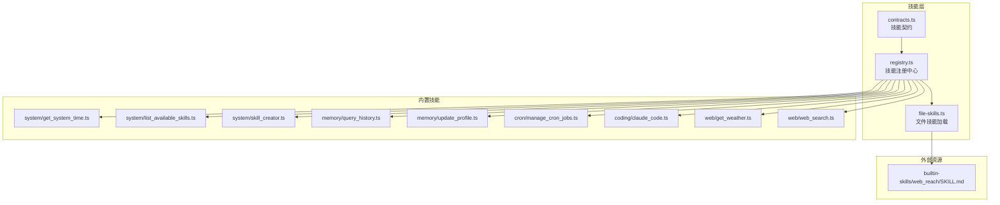
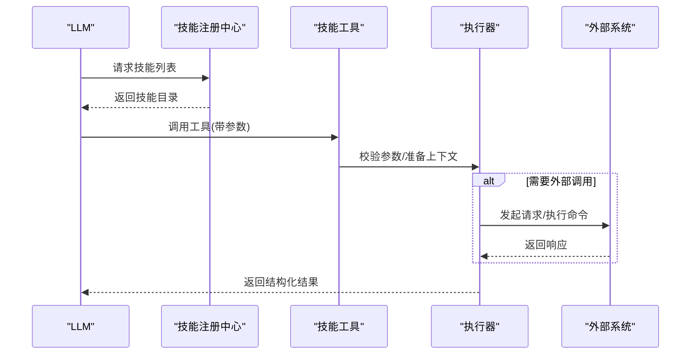
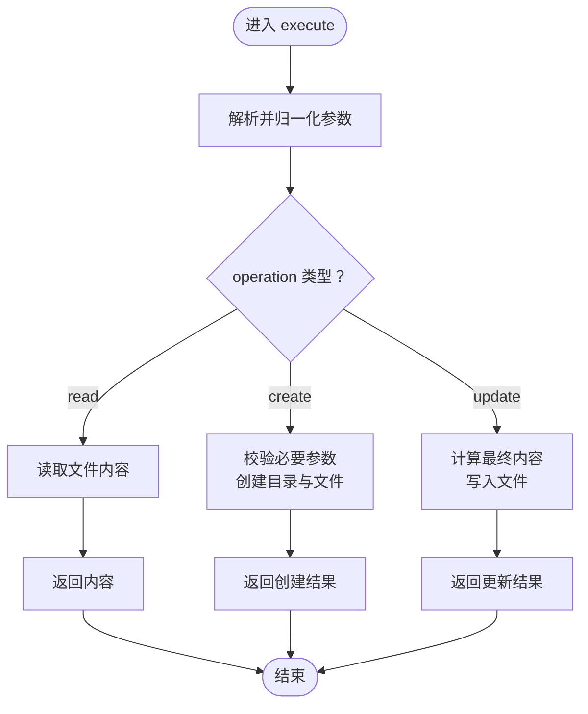
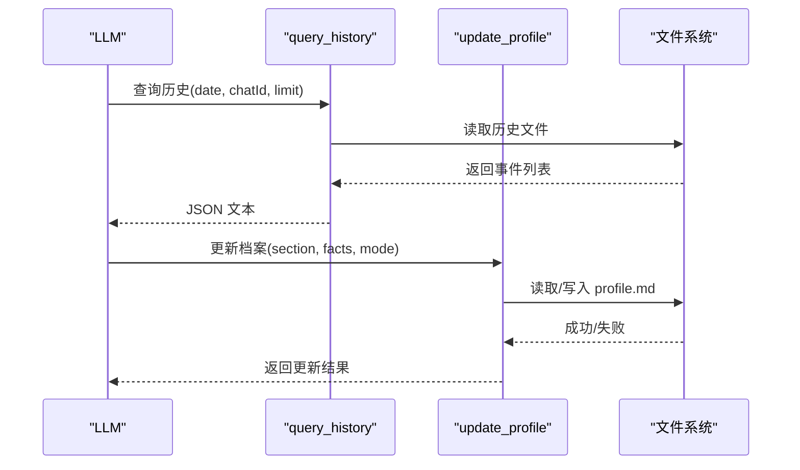
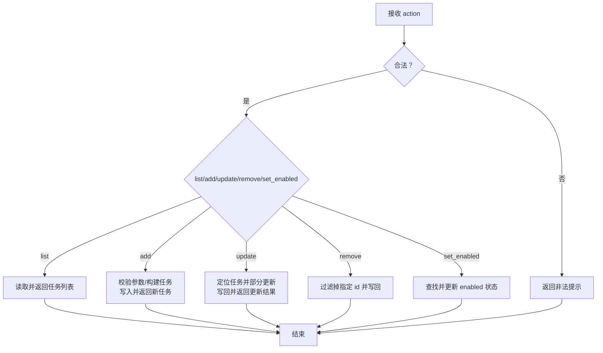
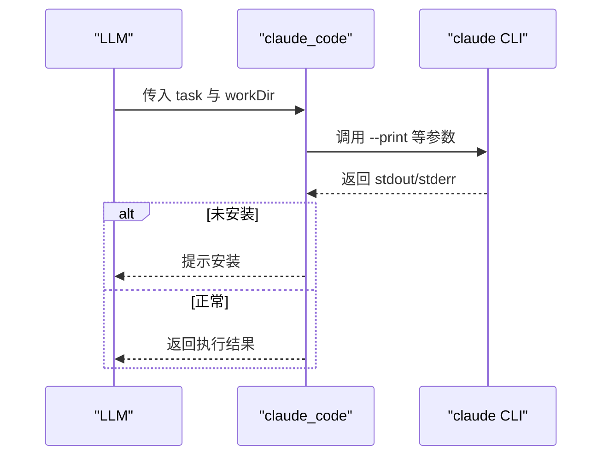
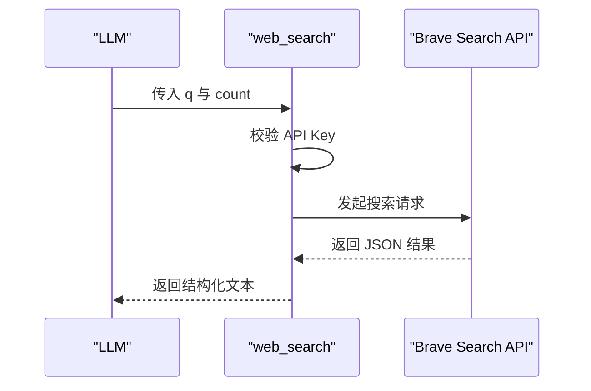
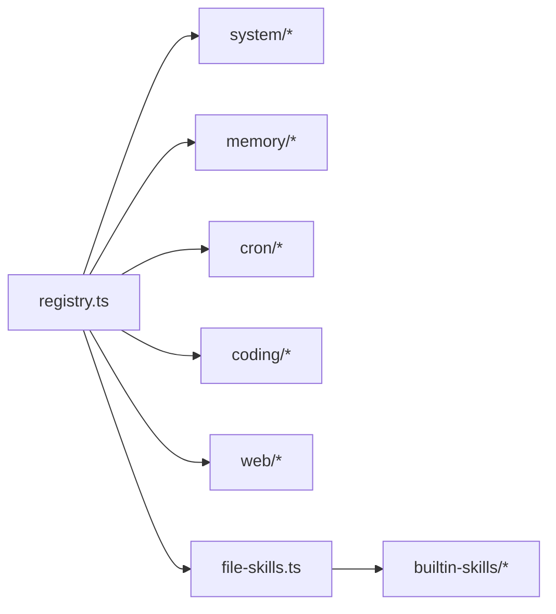

# 技能实现指南

<cite>
**本文引用的文件**
- [src/skills/registry.ts](file://src/skills/registry.ts)
- [src/skills/contracts.ts](file://src/skills/contracts.ts)
- [src/skills/file-skills.ts](file://src/skills/file-skills.ts)
- [src/skills/system/get_system_time.ts](file://src/skills/system/get_system_time.ts)
- [src/skills/system/list_available_skills.ts](file://src/skills/system/list_available_skills.ts)
- [src/skills/system/skill_creator.ts](file://src/skills/system/skill_creator.ts)
- [src/skills/memory/query_history.ts](file://src/skills/memory/query_history.ts)
- [src/skills/memory/update_profile.ts](file://src/skills/memory/update_profile.ts)
- [src/skills/cron/manage_cron_jobs.ts](file://src/skills/cron/manage_cron_jobs.ts)
- [src/skills/coding/claude_code.ts](file://src/skills/coding/claude_code.ts)
- [src/skills/web/get_weather.ts](file://src/skills/web/get_weather.ts)
- [src/skills/web/web_search.ts](file://src/skills/web/web_search.ts)
- [builtin-skills/web_reach/SKILL.md](file://builtin-skills/web_reach/SKILL.md)
- [README.md](file://README.md)
- [AGENTS.md](file://AGENTS.md)
</cite>

## 目录
1. [引言](#引言)
2. [项目结构](#项目结构)
3. [核心组件](#核心组件)
4. [架构总览](#架构总览)
5. [详细组件分析](#详细组件分析)
6. [依赖关系分析](#依赖关系分析)
7. [性能考量](#性能考量)
8. [故障排查指南](#故障排查指南)
9. [结论](#结论)
10. [附录](#附录)

## 引言
本指南面向希望在 StupidClaw 体系中实现“技能”的开发者，系统讲解不同类型的技能实现模式，包括系统技能、内存技能、文件技能、Web 技能、编码技能等。文档覆盖工具函数编写规范、参数验证机制、错误处理策略、返回值格式化等关键技术点，并提供从简单到复杂的完整实现示例，涵盖基本文件操作、API 调用、数据库查询等场景。

## 项目结构
StupidClaw 的技能体系围绕统一的技能契约与注册中心组织，所有技能均以“工具函数”形式暴露给 LLM，由 LLM 决定何时调用、如何传参。技能分为内置技能与项目自定义技能两类，后者通过文件系统加载并动态注入。

图表来源
- [src/skills/registry.ts:23-54](file://src/skills/registry.ts#L23-L54)
- [src/skills/contracts.ts:1-20](file://src/skills/contracts.ts#L1-L20)
- [src/skills/file-skills.ts:26-64](file://src/skills/file-skills.ts#L26-L64)
- [src/skills/system/get_system_time.ts:4-37](file://src/skills/system/get_system_time.ts#L4-L37)
- [src/skills/system/list_available_skills.ts:4-39](file://src/skills/system/list_available_skills.ts#L4-L39)
- [src/skills/system/skill_creator.ts:65-311](file://src/skills/system/skill_creator.ts#L65-L311)
- [src/skills/memory/query_history.ts:5-56](file://src/skills/memory/query_history.ts#L5-L56)
- [src/skills/memory/update_profile.ts:10-83](file://src/skills/memory/update_profile.ts#L10-L83)
- [src/skills/cron/manage_cron_jobs.ts:32-335](file://src/skills/cron/manage_cron_jobs.ts#L32-L335)
- [src/skills/coding/claude_code.ts:8-98](file://src/skills/coding/claude_code.ts#L8-L98)
- [src/skills/web/get_weather.ts:30-109](file://src/skills/web/get_weather.ts#L30-L109)
- [src/skills/web/web_search.ts:16-94](file://src/skills/web/web_search.ts#L16-L94)
- [builtin-skills/web_reach/SKILL.md:1-122](file://builtin-skills/web_reach/SKILL.md#L1-L122)

章节来源
- [README.md:15-52](file://README.md#L15-L52)
- [AGENTS.md:166-196](file://AGENTS.md#L166-L196)

## 核心组件
- 技能契约与上下文
  - 技能元信息：名称、描述、曝光级别（always/on_demand）
  - 技能上下文：包含 chatId 等会话标识
  - 工具定义：参数 Schema、执行函数、返回内容结构
- 技能注册中心
  - 负责组装内置技能、动态加载文件技能、按曝光级别分类
  - 提供 all/always/onDemand 三类视图，便于引擎按需披露
- 文件技能加载
  - 从项目目录与内置目录加载标准技能清单，去重合并，统一暴露

章节来源
- [src/skills/contracts.ts:4-19](file://src/skills/contracts.ts#L4-L19)
- [src/skills/registry.ts:13-54](file://src/skills/registry.ts#L13-L54)
- [src/skills/file-skills.ts:15-64](file://src/skills/file-skills.ts#L15-L64)

## 架构总览
技能的生命周期：定义 → 注册 → 暴露给 LLM → LLM 调用 → 执行器执行 → 返回结果。执行器负责参数校验、错误处理、返回值格式化。

图表来源
- [src/skills/registry.ts:40-47](file://src/skills/registry.ts#L40-L47)
- [src/skills/system/list_available_skills.ts:16-36](file://src/skills/system/list_available_skills.ts#L16-L36)
- [src/skills/web/web_search.ts:32-91](file://src/skills/web/web_search.ts#L32-L91)
- [src/skills/coding/claude_code.ts:30-95](file://src/skills/coding/claude_code.ts#L30-L95)

## 详细组件分析

### 系统技能
系统技能通常提供基础能力，如获取系统时间、列举可用技能、创建/管理技能文件等。它们常以“always”曝光，确保 LLM 总是可见。

- 获取系统时间
  - 参数：无
  - 返回：包含 ISO 时间与本地时间字符串的文本内容
  - 错误处理：无外部依赖，异常极少
- 列举可用技能
  - 参数：无
  - 返回：技能清单（含名称、曝光级别、描述）与使用指引
  - 暴露策略：always
- 技能创建器
  - 功能：在 .stupidClaw/skills/ 下创建/读取/更新 SKILL.md
  - 参数：operation（read/create/update）、name、description、body、content
  - 校验：名称规范化、目录存在性、必要参数校验、文件读写权限
  - 返回：结构化结果，含操作状态与路径信息

图表来源
- [src/skills/system/skill_creator.ts:127-308](file://src/skills/system/skill_creator.ts#L127-L308)

章节来源
- [src/skills/system/get_system_time.ts:4-37](file://src/skills/system/get_system_time.ts#L4-L37)
- [src/skills/system/list_available_skills.ts:4-39](file://src/skills/system/list_available_skills.ts#L4-L39)
- [src/skills/system/skill_creator.ts:65-311](file://src/skills/system/skill_creator.ts#L65-L311)

### 内存技能
内存技能围绕“.stupidClaw/”沙盒内的长期记忆与历史记录进行读写，强调安全路径与结构化存储。

- 查询历史
  - 参数：date（YYYY-MM-DD，默认当天）、chatId（过滤条件）、limit（默认20，最大200）
  - 返回：事件数组的 JSON 文本
  - 安全：通过安全路径解析，限定读取范围
- 更新档案
  - 参数：section（stable_facts/preferences/constraints）、facts（字符串数组）、mode（append/replace，默认 append）
  - 返回：更新后的档案内容
  - 校验：section 白名单、facts 数组校验

图表来源
- [src/skills/memory/query_history.ts:31-53](file://src/skills/memory/query_history.ts#L31-L53)
- [src/skills/memory/update_profile.ts:35-80](file://src/skills/memory/update_profile.ts#L35-L80)

章节来源
- [src/skills/memory/query_history.ts:5-56](file://src/skills/memory/query_history.ts#L5-L56)
- [src/skills/memory/update_profile.ts:10-83](file://src/skills/memory/update_profile.ts#L10-L83)

### 定时任务技能
定时任务技能负责对 .stupidClaw/cron_jobs.json 的增删改查与启用/禁用控制，支持两种执行路径：由 LLM 动态生成内容，或直接以固定参数调用工具。

- 参数要点
  - action：list/add/update/remove/set_enabled
  - add：name、cronExpr（5 段）、chatId、sessionKey、requirement、skillNames、prompt、toolName、toolArgs
  - update：id 与上述字段的部分更新
  - remove：id
  - set_enabled：id 与 enabled(boolean)
- 校验规则
  - cronExpr 必须为 5 段
  - add 时若未指定 toolName，则 skillNames/prompt/requirement 至少一项必填
  - id 必填于 update/remove/set_enabled
- 返回值
  - 结构化 JSON，包含操作状态与受影响对象

图表来源
- [src/skills/cron/manage_cron_jobs.ts:98-332](file://src/skills/cron/manage_cron_jobs.ts#L98-L332)

章节来源
- [src/skills/cron/manage_cron_jobs.ts:32-335](file://src/skills/cron/manage_cron_jobs.ts#L32-L335)

### 编码技能
编码技能通过本地已安装的 Claude Code CLI 执行编程任务，适合写代码、修复 bug、重构、阅读项目等场景。

- 参数
  - task：自然语言描述的任务
  - workDir：目标工作目录（可选）
- 执行细节
  - 设置超时与缓冲区上限，避免长时间占用
  - 捕获 ENOENT（未安装）等错误并给出明确提示
  - 汇总 stdout/stderr 输出，作为文本返回
- 返回
  - 执行结果文本，details 中携带 cwd

图表来源
- [src/skills/coding/claude_code.ts:30-95](file://src/skills/coding/claude_code.ts#L30-L95)

章节来源
- [src/skills/coding/claude_code.ts:8-98](file://src/skills/coding/claude_code.ts#L8-L98)

### Web 技能
Web 技能通过 HTTP API 获取外部信息，如天气与网络搜索。

- 天气查询
  - 参数：city（支持中文/英文城市名）
  - 流程：构造 wttr.in API 请求，解析 JSON，拼装人类可读文本
  - 错误：网络异常、HTTP 非 OK、JSON 解析失败、数据缺失
- 网络搜索
  - 参数：q（关键词）、count（默认 5，最多 10）
  - 流程：校验 BRAVE_SEARCH_API_KEY，调用 Brave Search API，拼装结果列表
  - 错误：未配置 API Key、HTTP 非 OK、空结果

图表来源
- [src/skills/web/web_search.ts:32-91](file://src/skills/web/web_search.ts#L32-L91)

章节来源
- [src/skills/web/get_weather.ts:30-109](file://src/skills/web/get_weather.ts#L30-L109)
- [src/skills/web/web_search.ts:16-94](file://src/skills/web/web_search.ts#L16-L94)

### 文件技能
文件技能通过扫描项目与内置目录下的 SKILL.md，动态构建技能目录，支持按需披露。

- 加载流程
  - 遍历项目与内置目录，跳过不存在或非目录项
  - 使用统一加载器提取技能元信息，去重后合并
- 暴露方式
  - 作为 on_demand 技能元信息列表，供“列出可用技能”技能展示

章节来源
- [src/skills/file-skills.ts:26-64](file://src/skills/file-skills.ts#L26-L64)
- [builtin-skills/web_reach/SKILL.md:1-7](file://builtin-skills/web_reach/SKILL.md#L1-L7)

## 依赖关系分析
- 技能注册中心依赖各技能模块的工厂函数，统一装配为 SkillDefinition 列表
- 文件技能加载依赖安全路径解析，确保只在允许范围内读取
- Web 技能依赖外部 API，需关注环境变量与网络稳定性
- 编码技能依赖本地 CLI，需关注安装状态与工作目录

图表来源
- [src/skills/registry.ts:23-54](file://src/skills/registry.ts#L23-L54)
- [src/skills/file-skills.ts:15-24](file://src/skills/file-skills.ts#L15-L24)

章节来源
- [src/skills/registry.ts:23-54](file://src/skills/registry.ts#L23-L54)
- [src/skills/file-skills.ts:15-24](file://src/skills/file-skills.ts#L15-L24)

## 性能考量
- I/O 与缓冲
  - Web 技能设置合理的超时与响应体大小限制，避免阻塞
  - 编码技能设置超时与缓冲上限，防止长时间运行
- 资源隔离
  - 文件技能加载仅限于安全路径，避免越权访问
  - 定时任务的执行路径可选择“直接工具调用”，减少 LLM 生成开销
- 数据规模
  - 历史查询限制返回条数，避免一次性输出过大
  - 档案更新支持 append/replace，按需选择更高效模式

## 故障排查指南
- 未配置 API Key
  - 现象：网络搜索技能返回“未配置 API Key”
  - 处理：在 .env 中填写 BRAVE_SEARCH_API_KEY 并重启
- 未安装本地 CLI
  - 现象：编码技能返回“未安装 claude CLI”
  - 处理：安装 @anthropic-ai/claude-code 并确保 PATH 可用
- 参数非法
  - 现象：定时任务技能返回“参数非法/必填项缺失”
  - 处理：核对 action、id、cronExpr（5 段）、chatId 等
- 文件读写失败
  - 现象：技能创建器返回“文件不存在/已存在/权限不足”
  - 处理：确认 .stupidClaw/skills/ 目录存在且有写权限；检查名称规范化规则

章节来源
- [src/skills/web/web_search.ts:36-46](file://src/skills/web/web_search.ts#L36-L46)
- [src/skills/coding/claude_code.ts:61-71](file://src/skills/coding/claude_code.ts#L61-L71)
- [src/skills/cron/manage_cron_jobs.ts:114-125](file://src/skills/cron/manage_cron_jobs.ts#L114-L125)
- [src/skills/system/skill_creator.ts:136-147](file://src/skills/system/skill_creator.ts#L136-L147)

## 结论
本指南总结了 StupidClaw 中各类技能的实现范式：以统一契约定义技能、通过注册中心集中管理、按需披露与安全路径控制、严格的参数校验与错误处理、规范化的返回值格式。遵循这些模式，可在保证安全性与可维护性的前提下，快速扩展新的技能，覆盖从文件操作、API 调用到编码与定时任务等多种场景。

## 附录

### 技能实现最佳实践
- 参数验证
  - 使用类型系统与 Schema 校验参数合法性
  - 对外部输入进行归一化（去除空白、大小写转换、长度限制）
- 错误处理
  - 区分“参数错误”“外部依赖不可用”“业务数据缺失”等场景
  - 统一返回结构：content（数组，元素含 type 与 text）、details（附加信息）
- 返回值格式化
  - 文本内容优先采用人类可读格式；结构化数据使用 JSON 字符串
  - 对大文本进行分段或摘要，避免单次输出过大
- 安全与隔离
  - 文件读写严格限制在安全路径内
  - 外部命令执行设置超时与缓冲上限
- 曝光策略
  - always：基础能力，如系统时间、技能目录
  - on_demand：按需能力，如历史查询、档案更新、网络搜索、天气查询、编码执行

### 示例路径索引（不含代码内容）
- 系统技能
  - 获取系统时间：[src/skills/system/get_system_time.ts:4-37](file://src/skills/system/get_system_time.ts#L4-L37)
  - 列举可用技能：[src/skills/system/list_available_skills.ts:4-39](file://src/skills/system/list_available_skills.ts#L4-L39)
  - 技能创建器：[src/skills/system/skill_creator.ts:65-311](file://src/skills/system/skill_creator.ts#L65-L311)
- 内存技能
  - 查询历史：[src/skills/memory/query_history.ts:5-56](file://src/skills/memory/query_history.ts#L5-L56)
  - 更新档案：[src/skills/memory/update_profile.ts:10-83](file://src/skills/memory/update_profile.ts#L10-L83)
- 定时任务技能
  - 管理任务：[src/skills/cron/manage_cron_jobs.ts:32-335](file://src/skills/cron/manage_cron_jobs.ts#L32-L335)
- 编码技能
  - 调用本地 CLI：[src/skills/coding/claude_code.ts:8-98](file://src/skills/coding/claude_code.ts#L8-L98)
- Web 技能
  - 天气查询：[src/skills/web/get_weather.ts:30-109](file://src/skills/web/get_weather.ts#L30-L109)
  - 网络搜索：[src/skills/web/web_search.ts:16-94](file://src/skills/web/web_search.ts#L16-L94)
- 文件技能
  - 加载与暴露：[src/skills/file-skills.ts:26-64](file://src/skills/file-skills.ts#L26-L64)
  - 内置示例：[builtin-skills/web_reach/SKILL.md:1-122](file://builtin-skills/web_reach/SKILL.md#L1-L122)