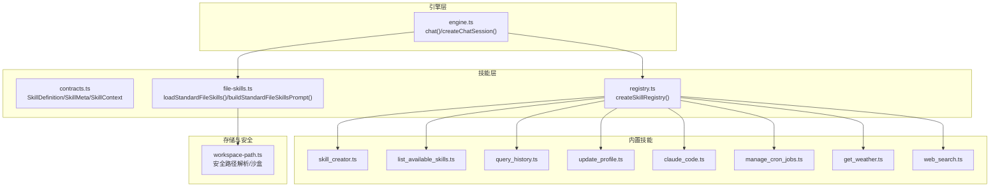
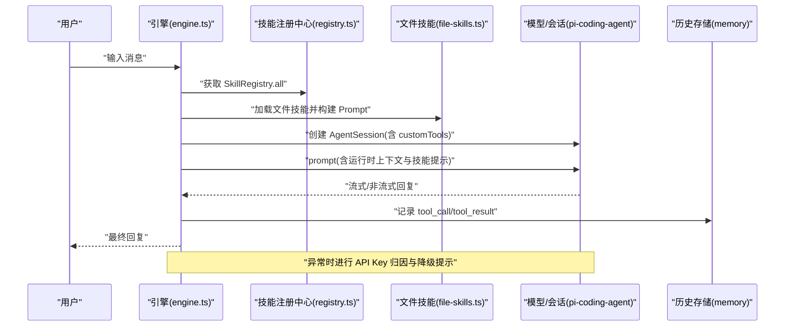
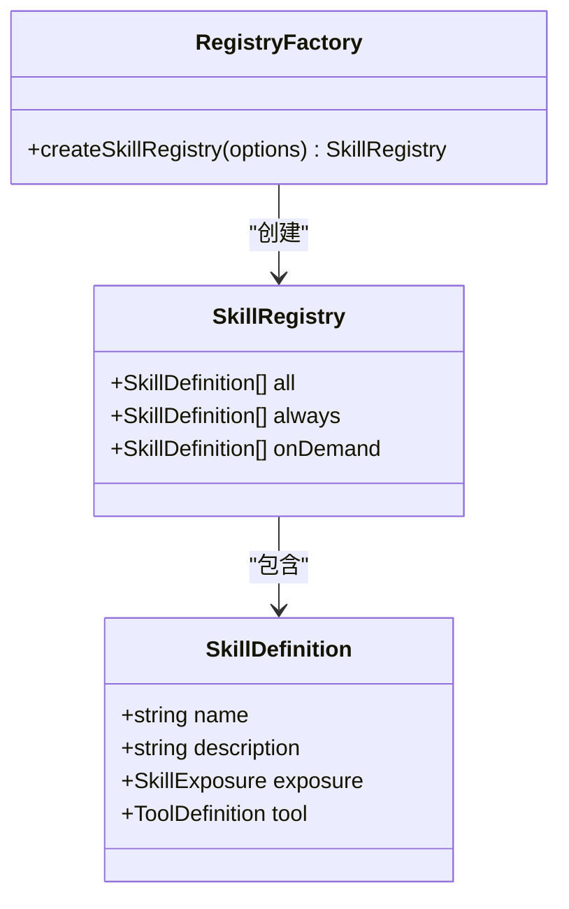
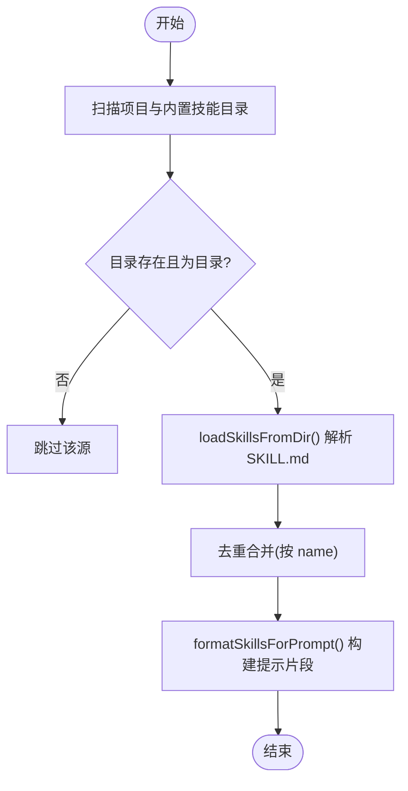
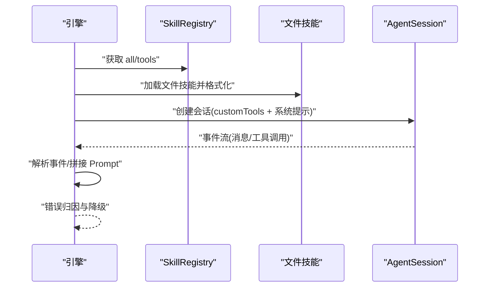
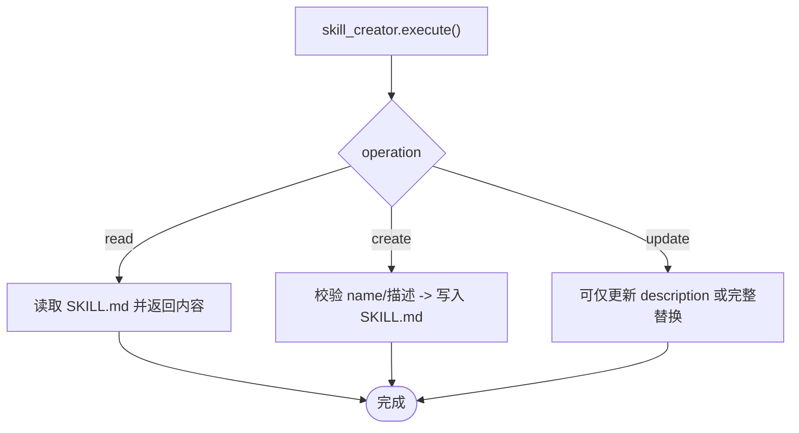
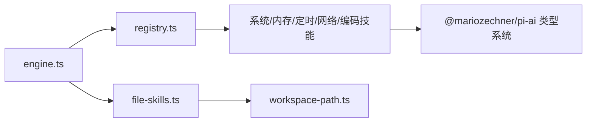

# 技能扩展开发

<cite>
**本文引用的文件**
- [contracts.ts](file://src/skills/contracts.ts)
- [registry.ts](file://src/skills/registry.ts)
- [file-skills.ts](file://src/skills/file-skills.ts)
- [engine.ts](file://src/engine.ts)
- [workspace-path.ts](file://src/memory/workspace-path.ts)
- [skill_creator.ts](file://src/skills/system/skill_creator.ts)
- [list_available_skills.ts](file://src/skills/system/list_available_skills.ts)
- [query_history.ts](file://src/skills/memory/query_history.ts)
- [update_profile.ts](file://src/skills/memory/update_profile.ts)
- [claude_code.ts](file://src/skills/coding/claude_code.ts)
- [manage_cron_jobs.ts](file://src/skills/cron/manage_cron_jobs.ts)
- [get_weather.ts](file://src/skills/web/get_weather.ts)
- [web_search.ts](file://src/skills/web/web_search.ts)
- [README.md](file://README.md)
</cite>

## 目录
1. [简介](#简介)
2. [项目结构](#项目结构)
3. [核心组件](#核心组件)
4. [架构总览](#架构总览)
5. [详细组件分析](#详细组件分析)
6. [依赖关系分析](#依赖关系分析)
7. [性能考量](#性能考量)
8. [故障排查指南](#故障排查指南)
9. [结论](#结论)
10. [附录](#附录)

## 简介
本指南面向希望为 StupidClaw 开发“技能”的工程师与产品同学，系统讲解技能接口定义、工具函数实现、技能注册机制，以及生命周期管理、参数校验、错误处理与安全控制等关键要素。文档还提供从需求分析到代码实现、测试与部署的完整流程，并深入解析内置技能的实现原理与扩展方法，最后给出文件技能系统的使用指南。

## 项目结构
StupidClaw 将“技能”抽象为统一的 SkillDefinition，通过 SkillRegistry 统一注册与分类（always/on-demand），并通过引擎在每次对话中注入到 LLM 的工具集合中。文件技能系统支持从项目目录与内置目录加载 SKILL.md 描述文件，动态构建技能清单并注入系统提示词。

**图示来源**
- [engine.ts:392-459](file://src/engine.ts#L392-L459)
- [registry.ts:23-54](file://src/skills/registry.ts#L23-L54)
- [file-skills.ts:26-64](file://src/skills/file-skills.ts#L26-L64)
- [workspace-path.ts:32-35](file://src/memory/workspace-path.ts#L32-L35)

**章节来源**
- [README.md:22-52](file://README.md#L22-L52)
- [engine.ts:392-459](file://src/engine.ts#L392-L459)
- [registry.ts:23-54](file://src/skills/registry.ts#L23-L54)
- [file-skills.ts:26-64](file://src/skills/file-skills.ts#L26-L64)

## 核心组件
- 技能契约与上下文
  - SkillMeta：技能元信息（名称、描述、曝光级别）
  - SkillContext：技能执行上下文（如 chatId）
  - SkillDefinition：技能定义（继承 SkillMeta 并附加 ToolDefinition）

- 技能注册中心
  - SkillRegistry：聚合所有技能，按 exposure 划分为 always 与 on_demand
  - createSkillRegistry：集中创建内置技能并注入“可用技能列表”

- 文件技能系统
  - 加载策略：项目 skills 与内置 builtin-skills 两路，去重合并
  - Prompt 注入：将文件技能汇总为系统提示的一部分

- 引擎集成
  - chat/createChatSession：创建会话时注入 customTools（来自 SkillRegistry.all）
  - 会话订阅：捕获 tool_execution_start/end，写入历史

**章节来源**
- [contracts.ts:4-19](file://src/skills/contracts.ts#L4-L19)
- [registry.ts:13-54](file://src/skills/registry.ts#L13-L54)
- [file-skills.ts:26-64](file://src/skills/file-skills.ts#L26-L64)
- [engine.ts:422-459](file://src/engine.ts#L422-L459)

## 架构总览
下面的序列图展示了从用户输入到技能执行与结果返回的关键流程，以及错误处理与历史记录的集成点。

**图示来源**
- [engine.ts:511-607](file://src/engine.ts#L511-L607)
- [engine.ts:422-459](file://src/engine.ts#L422-L459)
- [registry.ts:40-47](file://src/skills/registry.ts#L40-L47)
- [file-skills.ts:50-56](file://src/skills/file-skills.ts#L50-L56)

## 详细组件分析

### 技能接口与契约
- SkillExposure：always（始终可用）、on_demand（按需调用）
- SkillMeta：name/description/exposure
- SkillContext：chatId 等上下文
- SkillDefinition：在 SkillMeta 基础上附加 ToolDefinition（名称、标签、描述、参数 Schema、execute 回调）

实现要点
- 参数 Schema 使用 Type.Object/Type.Union 等类型系统定义，确保 LLM 与工具调用的参数一致性
- execute 回调返回标准结构：content（数组，元素含 type/text）、details（附加信息）

**章节来源**
- [contracts.ts:4-19](file://src/skills/contracts.ts#L4-L19)

### 技能注册机制
- createSkillRegistry：集中创建内置技能（系统、内存、定时、网络、编码等），并注入“列出可用技能”
- 暴露 all/always/on_demand 三类集合，供引擎在会话创建时注入 customTools
- “列出可用技能”技能通过回调聚合当前可用技能（含文件技能元数据）

**图示来源**
- [registry.ts:13-54](file://src/skills/registry.ts#L13-L54)
- [contracts.ts:16-19](file://src/skills/contracts.ts#L16-L19)

**章节来源**
- [registry.ts:23-54](file://src/skills/registry.ts#L23-L54)

### 文件技能系统
- 目录扫描：项目 skills 与内置 builtin-skills 两路，去重后合并
- Prompt 注入：将文件技能转换为统一格式，拼接到系统提示词中
- 安全路径：resolveSafePath 保证只在 .stupidClaw 沙盒内读取

**图示来源**
- [file-skills.ts:26-64](file://src/skills/file-skills.ts#L26-L64)
- [workspace-path.ts:32-35](file://src/memory/workspace-path.ts#L32-L35)

**章节来源**
- [file-skills.ts:15-64](file://src/skills/file-skills.ts#L15-L64)
- [workspace-path.ts:32-35](file://src/memory/workspace-path.ts#L32-L35)

### 引擎中的技能集成
- 会话创建：createChatSession 中注入 customTools（SkillRegistry.all）
- Prompt 构建：将文件技能提示与运行时上下文、profile 等拼接
- 订阅事件：捕获 tool_execution_start/end，写入历史
- 错误归因：对 API Key 缺失等错误进行友好提示

**图示来源**
- [engine.ts:422-459](file://src/engine.ts#L422-L459)
- [engine.ts:511-607](file://src/engine.ts#L511-L607)

**章节来源**
- [engine.ts:422-459](file://src/engine.ts#L422-L459)
- [engine.ts:511-607](file://src/engine.ts#L511-L607)

### 内置技能实现原理与扩展方法

#### 系统技能
- 列出可用技能：返回当前可用技能清单与使用指引
- 技能创建器：在 .stupidClaw/skills 下创建/读取/更新 SKILL.md，支持模板化与参考文档组织

**图示来源**
- [skill_creator.ts:127-311](file://src/skills/system/skill_creator.ts#L127-L311)

**章节来源**
- [list_available_skills.ts:4-39](file://src/skills/system/list_available_skills.ts#L4-L39)
- [skill_creator.ts:65-311](file://src/skills/system/skill_creator.ts#L65-L311)

#### 内存技能
- 查询历史：按日期/聊天标识/数量查询历史事件
- 更新 Profile：更新 profile.md 的特定 section（稳定事实/偏好/约束）

实现要点
- 参数校验：必填项与可选项清晰标注
- 安全性：通过 workspace-path 限定读写范围

**章节来源**
- [query_history.ts:5-56](file://src/skills/memory/query_history.ts#L5-L56)
- [update_profile.ts:10-83](file://src/skills/memory/update_profile.ts#L10-L83)
- [workspace-path.ts:32-35](file://src/memory/workspace-path.ts#L32-L35)

#### 编程技能
- Claude Code：调用本地 Claude Code CLI 执行任务，支持工作目录与超时/缓冲限制

实现要点
- 超时与缓冲上限：避免长时间执行导致资源占用
- 错误处理：ENOENT 等错误区分并返回用户可理解的信息

**章节来源**
- [claude_code.ts:8-98](file://src/skills/coding/claude_code.ts#L8-L98)

#### 定时任务技能
- 管理定时任务：增删改查、启用/禁用、固定工具调用或 LLM 动态生成内容
- 参数校验：action 合法性、cron 表达式五段格式、必要字段齐全

实现要点
- 会话键与 chatId：支持多会话隔离
- 固定工具调用：无需 LLM，直接以固定参数触发工具

**章节来源**
- [manage_cron_jobs.ts:32-335](file://src/skills/cron/manage_cron_jobs.ts#L32-L335)

#### 网络技能
- 天气查询：调用 wttr.in 获取实时天气与当日预报
- 网页搜索：调用 Brave Search API 获取搜索结果

实现要点
- 环境变量校验：缺失时返回明确提示
- 结果格式化：结构化文本输出

**章节来源**
- [get_weather.ts:30-109](file://src/skills/web/get_weather.ts#L30-L109)
- [web_search.ts:16-94](file://src/skills/web/web_search.ts#L16-L94)

## 依赖关系分析
- 引擎依赖技能注册中心与文件技能系统，将技能注入 AgentSession 的 tools/customTools
- 技能实现依赖类型系统(Type.Object/Union/Literal)与 Schema 校验
- 文件技能系统依赖安全路径解析，确保只在沙盒内读取
- 定时任务与内存技能依赖持久化存储（history/profile/cron_jobs）

**图示来源**
- [engine.ts:422-459](file://src/engine.ts#L422-L459)
- [registry.ts:23-54](file://src/skills/registry.ts#L23-L54)
- [file-skills.ts:26-64](file://src/skills/file-skills.ts#L26-L64)
- [workspace-path.ts:32-35](file://src/memory/workspace-path.ts#L32-L35)

**章节来源**
- [engine.ts:422-459](file://src/engine.ts#L422-L459)
- [registry.ts:23-54](file://src/skills/registry.ts#L23-L54)

## 性能考量
- 流式输出：引擎订阅消息流，优先拼接 text_delta，避免重复与丢失
- 工具调用：按需暴露 on_demand 技能，减少不必要的工具开销
- 文件技能提示：仅在存在文件技能时注入，避免冗余提示
- 超时与缓冲：编程类技能设置合理超时与输出缓冲上限，防止阻塞

[本节为通用指导，无需特定文件来源]

## 故障排查指南
- API Key 缺失/错误
  - 引擎会将底层错误归因为 provider 不匹配或缺配，并给出明确提示
  - 建议核对 .env 中对应 PROVIDER_API_KEY 与 STUPID_MODEL 的 provider/model_id

- 文件技能未生效
  - 确认 SKILL.md 路径与名称符合规范（目录名与 name 一致）
  - 确认文件位于项目 skills 或内置 builtin-skills 目录
  - 检查是否被去重逻辑覆盖

- 工具调用失败
  - 查看历史记录中 tool_call/tool_result 的错误标记
  - 检查环境变量（如 BRAVE_SEARCH_API_KEY）与网络连通性

**章节来源**
- [engine.ts:162-186](file://src/engine.ts#L162-L186)
- [engine.ts:550-575](file://src/engine.ts#L550-L575)
- [web_search.ts:34-46](file://src/skills/web/web_search.ts#L34-L46)

## 结论
通过统一的技能契约、注册中心与文件技能系统，StupidClaw 实现了“按需披露”的技能体系：内置 always 技能保障基本能力，on_demand 技能按需扩展，文件技能支持社区化与项目化扩展。配合严格的沙盒路径与错误归因机制，开发者可以在安全可控的前提下快速迭代技能，提升 Agent 的实用性与可维护性。

[本节为总结，无需特定文件来源]

## 附录

### 技能开发流程（从需求到上线）
- 需求分析
  - 明确技能目标、触发条件、期望输出格式
  - 评估是否需要 LLM 动态生成内容（若完全固定可走“固定工具调用”路径）

- 设计与实现
  - 定义 SkillDefinition：name/description/exposure
  - 使用 Type.* 定义参数 Schema，确保可验证性
  - 在 execute 中实现幂等、可重试、带超时与错误降级

- 注册与测试
  - 在 createSkillRegistry 中注册技能
  - 使用“列出可用技能”确认可见性
  - 通过引擎对话验证工具调用链路与历史记录

- 部署与运维
  - 将 SKILL.md 放入项目 skills 目录或内置目录
  - 配置所需环境变量
  - 监控错误日志与历史记录，持续优化触发描述与参数约束

[本节为流程概述，无需特定文件来源]

### 文件技能系统使用指南
- 目录结构
  - 项目技能：.stupidClaw/skills/<name>/SKILL.md
  - 内置技能：builtin-skills/<name>/SKILL.md
- 触发机制
  - SKILL.md 的 YAML frontmatter 中的 description 即主要触发描述
  - 建议描述 WHAT 与 WHEN，尽量具体
- 输出格式
  - execute 返回 content 数组，元素为 { type: "text", text }，便于引擎统一处理
- 安全与合规
  - 仅在 .stupidClaw 沙盒内读取，禁止绝对路径与路径穿越
  - 通过 resolveSafePath 与 workspace-path 保障路径安全

**章节来源**
- [file-skills.ts:15-64](file://src/skills/file-skills.ts#L15-L64)
- [workspace-path.ts:32-35](file://src/memory/workspace-path.ts#L32-L35)