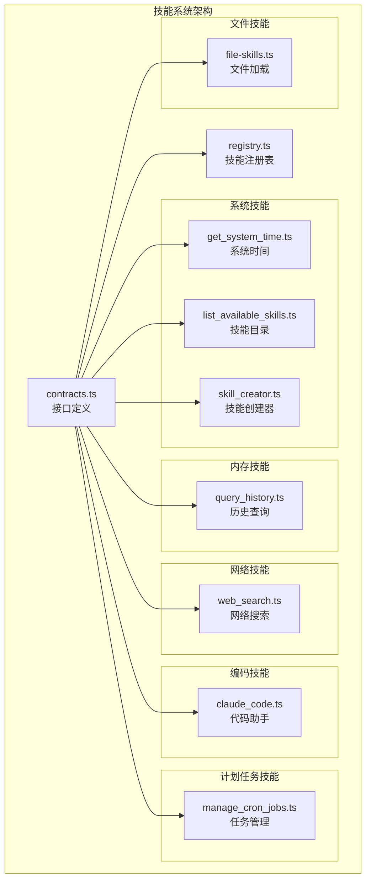
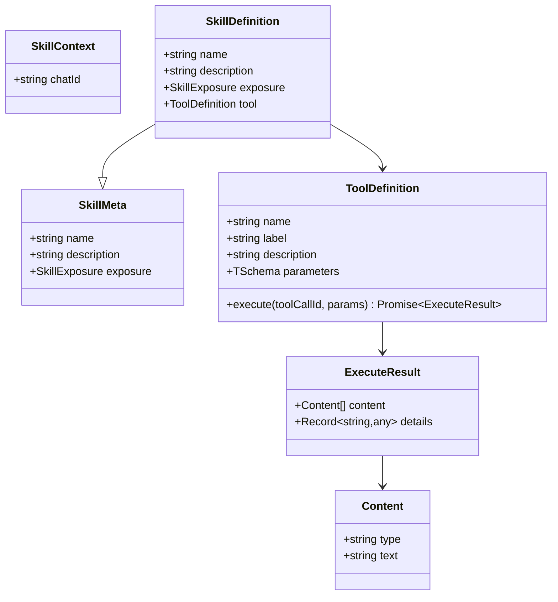
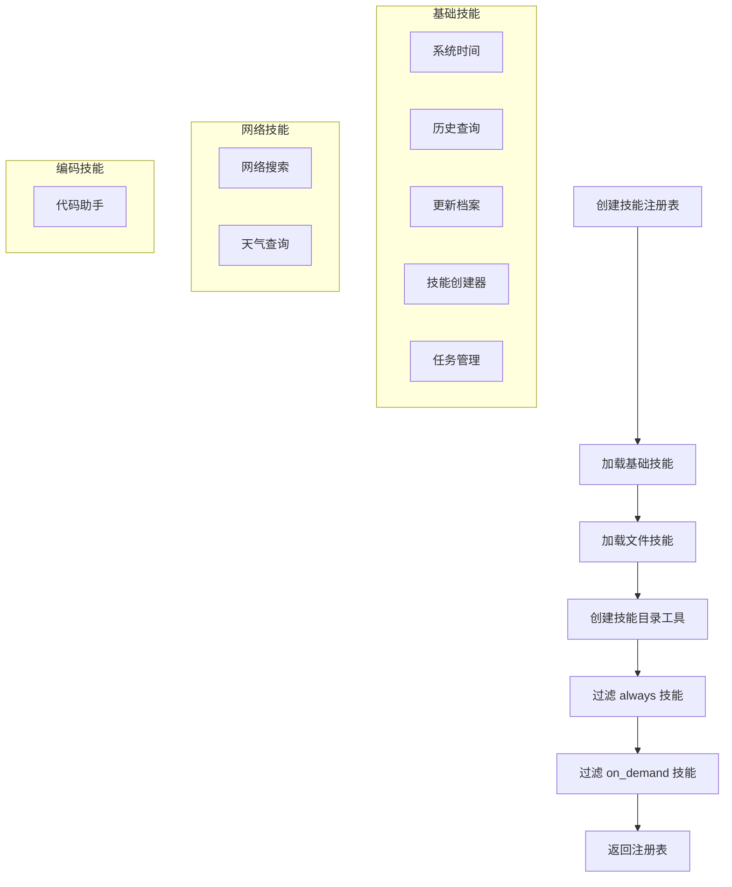
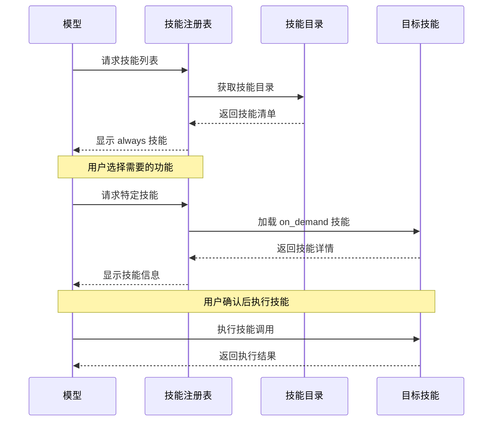
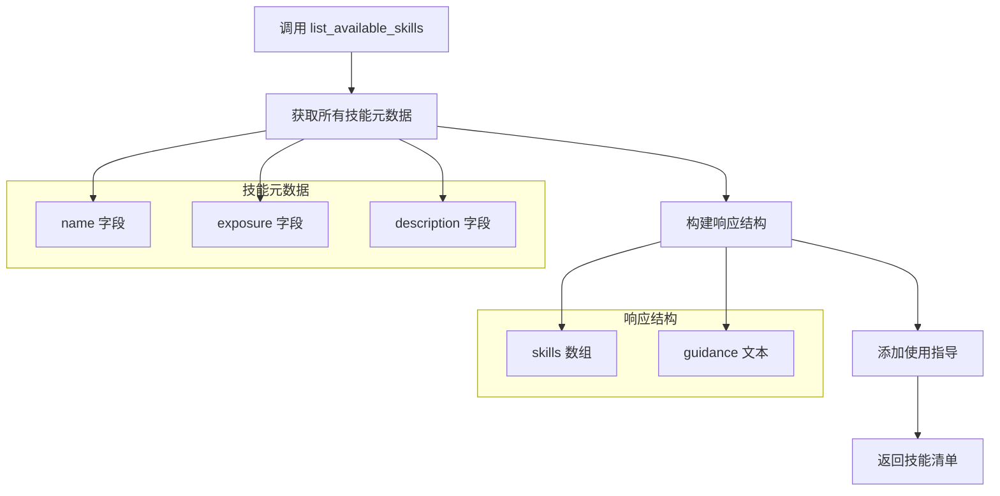
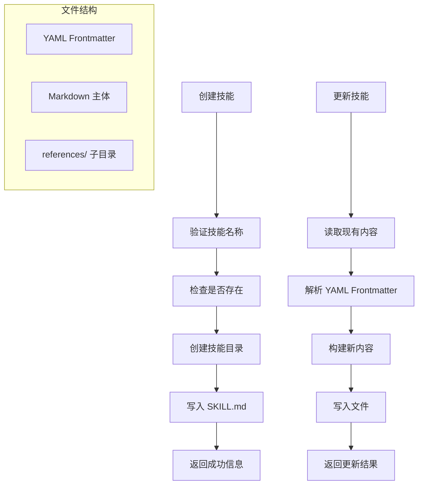
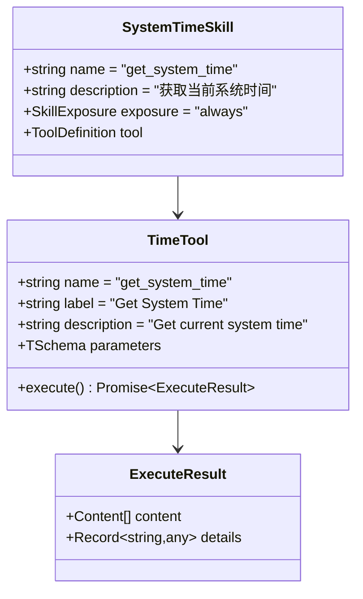
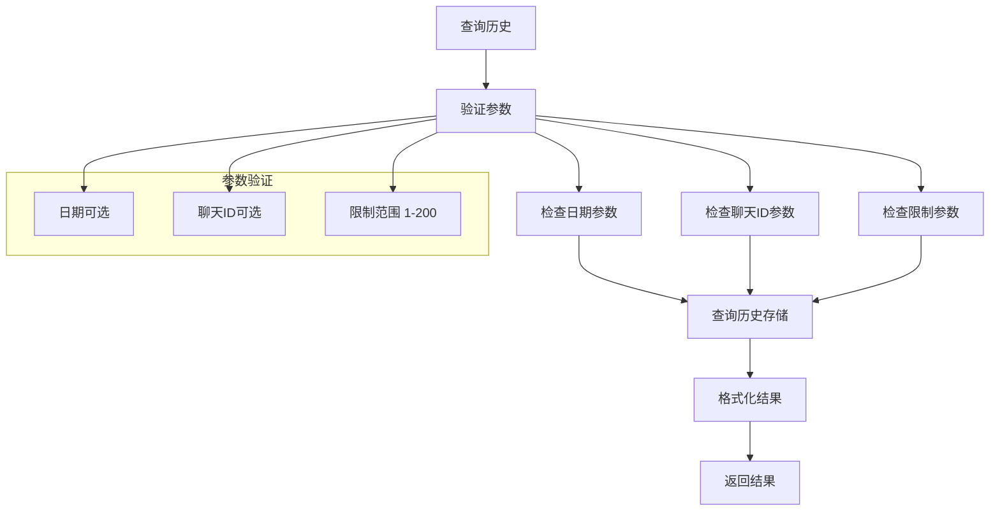

# 技能接口定义

<cite>
**本文档引用的文件**
- [contracts.ts](file://src/skills/contracts.ts)
- [registry.ts](file://src/skills/registry.ts)
- [list_available_skills.ts](file://src/skills/system/list_available_skills.ts)
- [skill_creator.ts](file://src/skills/system/skill_creator.ts)
- [get_system_time.ts](file://src/skills/system/get_system_time.ts)
- [query_history.ts](file://src/skills/memory/query_history.ts)
- [web_search.ts](file://src/skills/web/web_search.ts)
- [claude_code.ts](file://src/skills/coding/claude_code.ts)
- [manage_cron_jobs.ts](file://src/skills/cron/manage_cron_jobs.ts)
- [file-skills.ts](file://src/skills/file-skills.ts)
- [StupidClaw-第3期-Skills不是越多越好关键是按需披露.md](file://StupidClaw-第3期-Skills不是越多越好关键是按需披露.md)
</cite>

## 目录
1. [简介](#简介)
2. [项目结构](#项目结构)
3. [核心组件](#核心组件)
4. [架构概览](#架构概览)
5. [详细组件分析](#详细组件分析)
6. [依赖关系分析](#依赖关系分析)
7. [性能考虑](#性能考虑)
8. [故障排除指南](#故障排除指南)
9. [结论](#结论)

## 简介

本文档详细阐述了 StupidClaw 项目中技能接口定义的设计原理和实现细节。技能系统采用"按需披露"策略，通过 `always` 和 `on_demand` 两种暴露策略来控制技能的可见性和使用时机，确保模型能够有序地发现和使用技能，避免过度暴露导致的误调用问题。

## 项目结构

技能系统位于 `src/skills/` 目录下，采用模块化设计，包含以下主要子模块：



**图表来源**
- [contracts.ts:1-20](file://src/skills/contracts.ts#L1-L20)
- [registry.ts:1-55](file://src/skills/registry.ts#L1-L55)

**章节来源**
- [contracts.ts:1-20](file://src/skills/contracts.ts#L1-L20)
- [registry.ts:1-55](file://src/skills/registry.ts#L1-L55)

## 核心组件

### 技能元数据结构

技能系统的核心是 `SkillMeta` 接口，定义了技能的基本元数据信息：



**图表来源**
- [contracts.ts:6-19](file://src/skills/contracts.ts#L6-L19)

技能暴露策略定义了两种不同的暴露级别：

- **always**: 始终可见，作为模型的"入口能力"
- **on_demand**: 按需可见，通过技能目录发现

**章节来源**
- [contracts.ts:4-19](file://src/skills/contracts.ts#L4-L19)

### 技能注册表

技能注册表负责管理和组织所有可用技能，提供三种视图：



**图表来源**
- [registry.ts:23-54](file://src/skills/registry.ts#L23-L54)

**章节来源**
- [registry.ts:13-54](file://src/skills/registry.ts#L13-L54)

## 架构概览

技能系统的整体架构遵循"渐进式披露"原则，通过精心设计的暴露策略来控制技能的可见性：



**图表来源**
- [registry.ts:23-54](file://src/skills/registry.ts#L23-L54)
- [list_available_skills.ts:4-39](file://src/skills/system/list_available_skills.ts#L4-L39)

## 详细组件分析

### 技能暴露策略详解

#### always 技能策略

`always` 技能作为模型的"入口能力"，具有以下特点：

1. **始终可见**: 在技能注册表中始终包含
2. **基础功能**: 提供最核心、最稳定的技能
3. **低风险**: 不涉及敏感操作或外部依赖
4. **高频使用**: 通常被模型频繁调用

**实现示例**:
- 系统时间查询 (`get_system_time`)
- 技能目录浏览 (`list_available_skills`)

#### on_demand 技能策略

`on_demand` 技能通过技能目录发现机制按需加载：

1. **延迟加载**: 仅在需要时才加载
2. **按需披露**: 通过 `list_available_skills` 工具展示
3. **高风险控制**: 限制访问范围和权限
4. **功能扩展**: 提供更专业的功能

**实现示例**:
- 历史记录查询 (`query_history`)
- 技能创建管理 (`skill_creator`)
- 网络搜索 (`web_search`)
- 代码辅助 (`claude_code`)
- 计划任务管理 (`manage_cron_jobs`)

### 技能目录工具

技能目录工具 (`list_available_skills`) 提供统一的技能发现接口：



**图表来源**
- [list_available_skills.ts:4-39](file://src/skills/system/list_available_skills.ts#L4-L39)

### 技能创建器

技能创建器 (`skill_creator`) 提供完整的技能生命周期管理：



**图表来源**
- [skill_creator.ts:65-312](file://src/skills/system/skill_creator.ts#L65-L312)

**章节来源**
- [list_available_skills.ts:1-40](file://src/skills/system/list_available_skills.ts#L1-L40)
- [skill_creator.ts:1-312](file://src/skills/system/skill_creator.ts#L1-L312)

### 实际技能实现示例

#### 系统时间技能

系统时间技能展示了最简单的技能实现模式：



**图表来源**
- [get_system_time.ts:4-38](file://src/skills/system/get_system_time.ts#L4-L38)

#### 历史查询技能

历史查询技能展示了参数验证和错误处理的最佳实践：



**图表来源**
- [query_history.ts:5-57](file://src/skills/memory/query_history.ts#L5-L57)

**章节来源**
- [get_system_time.ts:1-38](file://src/skills/system/get_system_time.ts#L1-L38)
- [query_history.ts:1-57](file://src/skills/memory/query_history.ts#L1-L57)

## 依赖关系分析

技能系统采用清晰的依赖层次结构：

```mermaid
graph TB
subgraph "核心依赖"
PI_AI[@mariozechner/pi-ai<br/>Type Schema]
PI_CODING_AGENT[@mariozechner/pi-coding-agent<br/>Tool Definition]
end
subgraph "系统依赖"
NodeFS[node:fs/promises<br/>文件系统]
NodeChildProcess[node:child_process<br/>子进程]
NodeFetch[node-fetch<br/>HTTP 请求]
end
subgraph "内部依赖"
Contracts[contracts.ts<br/>接口定义]
Registry[registry.ts<br/>技能注册表]
Memory[memory/*<br/>内存管理]
Cron[cron/*<br/>计划任务]
Transport[transport/*<br/>传输层]
end
PI_AI --> Contracts
PI_CODING_AGENT --> Contracts
NodeFS --> Memory
NodeChildProcess --> Cron
NodeFetch --> Web
Contracts --> Registry
Contracts --> Memory
Contracts --> Cron
Contracts --> Transport
```

**图表来源**
- [contracts.ts:1-2](file://src/skills/contracts.ts#L1-L2)
- [registry.ts:1-11](file://src/skills/registry.ts#L1-L11)

**章节来源**
- [contracts.ts:1-3](file://src/skills/contracts.ts#L1-L3)
- [registry.ts:1-11](file://src/skills/registry.ts#L1-L11)

## 性能考虑

技能系统的性能优化主要体现在以下几个方面：

### 1. 延迟加载机制
- `on_demand` 技能仅在需要时加载，减少启动时间和内存占用
- 技能目录工具提供统一的发现接口，避免不必要的技能加载

### 2. 缓存策略
- 技能元数据在内存中缓存，避免重复解析
- 文件技能通过去重机制避免重复加载相同技能

### 3. 错误处理优化
- 网络请求设置合理的超时时间（5分钟）
- 文件操作设置适当的缓冲区大小（10MB）
- 异步操作避免阻塞主线程

### 4. 数据结构优化
- 使用扁平化的技能元数据结构，便于快速遍历
- 执行结果采用标准化的数据格式，便于序列化和传输

## 故障排除指南

### 常见问题及解决方案

#### 技能加载失败

**问题**: 技能无法正常加载
**原因**: 
- 技能文件路径错误
- YAML Frontmatter 格式不正确
- 依赖的外部服务不可用

**解决方案**:
1. 检查技能文件路径是否正确
2. 验证 YAML Frontmatter 的语法
3. 确认外部服务的可用性

#### 参数验证错误

**问题**: 技能执行时报参数错误
**原因**:
- 参数类型不匹配
- 必填参数缺失
- 参数值超出范围

**解决方案**:
1. 检查参数类型定义
2. 确认必填参数是否提供
3. 验证参数值的有效范围

#### 权限问题

**问题**: 技能执行时权限不足
**原因**:
- 文件系统权限限制
- 外部服务认证失败
- 环境变量配置错误

**解决方案**:
1. 检查文件系统权限设置
2. 验证外部服务的认证配置
3. 确认环境变量的正确性

**章节来源**
- [claude_code.ts:56-82](file://src/skills/coding/claude_code.ts#L56-L82)
- [web_search.ts:36-46](file://src/skills/web/web_search.ts#L36-L46)

## 结论

技能接口定义系统通过精心设计的暴露策略和标准化的接口规范，实现了技能系统的模块化和可扩展性。`always` 和 `on_demand` 两种暴露策略的结合使用，确保了模型能够有序地发现和使用技能，避免了过度暴露导致的误调用问题。

系统的关键优势包括：

1. **渐进式披露**: 通过技能目录工具实现有序的技能发现
2. **模块化设计**: 清晰的职责分离和依赖关系
3. **标准化接口**: 统一的技能定义和执行协议
4. **错误处理**: 完善的异常处理和恢复机制
5. **性能优化**: 延迟加载和缓存策略提升系统性能

这种设计原则不仅适用于当前的技能系统，也为未来的功能扩展提供了坚实的基础。通过遵循这些设计模式，开发者可以轻松地添加新的技能，而不会破坏现有的系统稳定性。