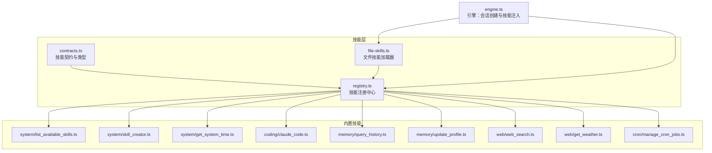
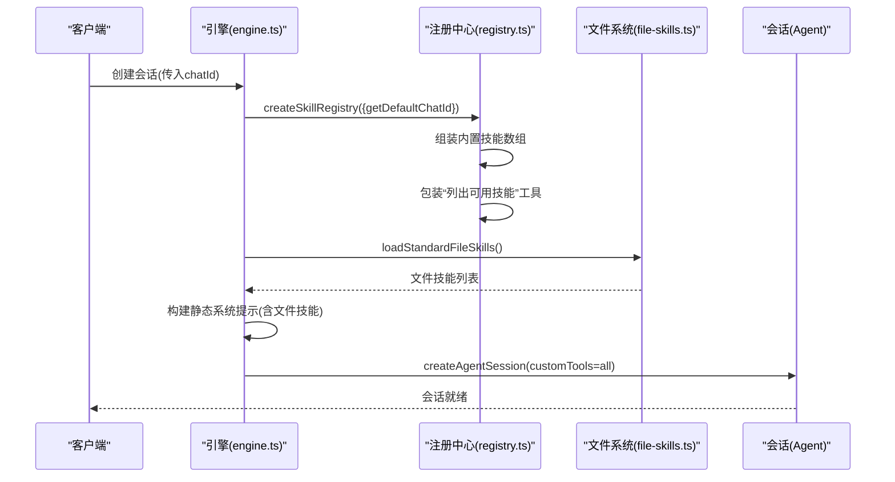
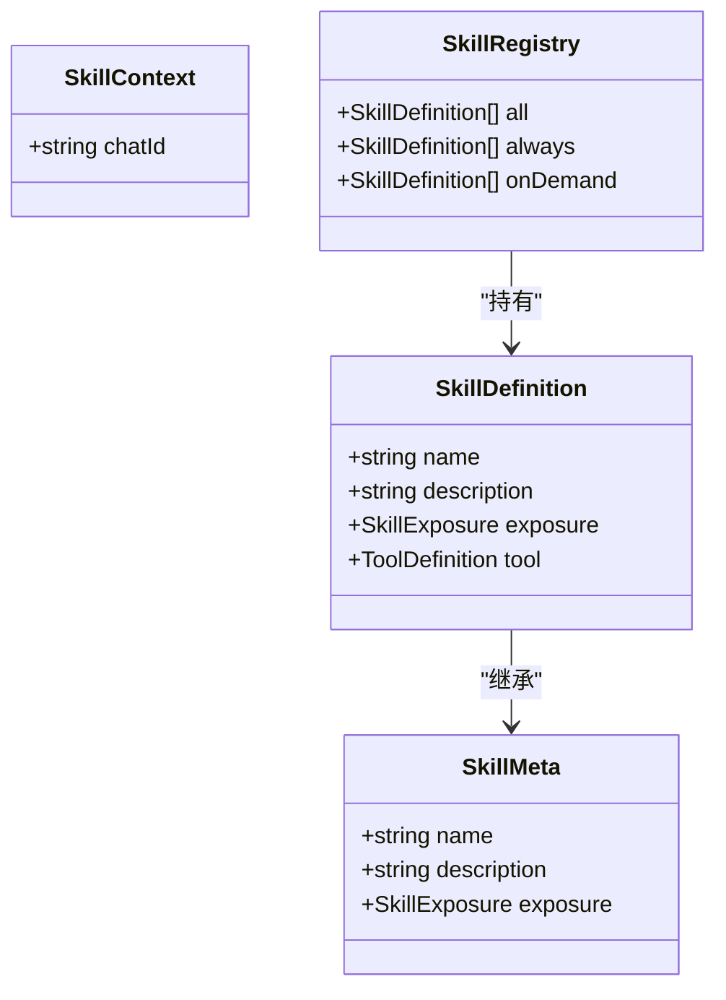
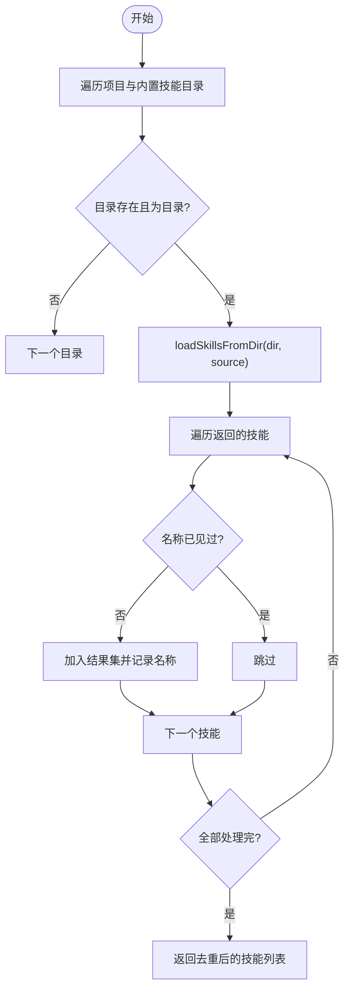
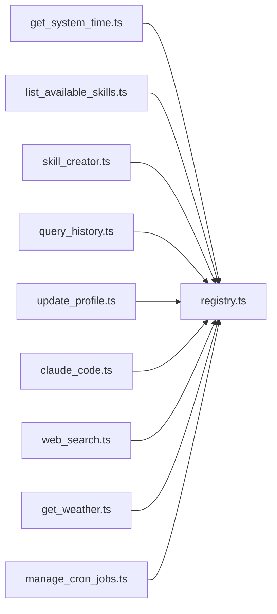
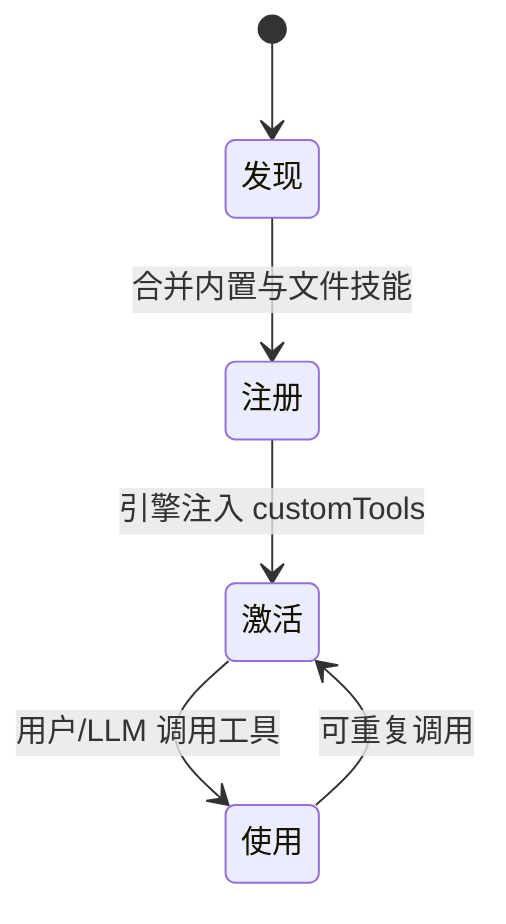
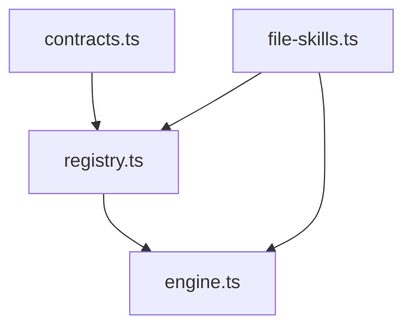

# 技能注册系统

<cite>
**本文档引用的文件**
- [src/skills/registry.ts](file://src/skills/registry.ts)
- [src/skills/contracts.ts](file://src/skills/contracts.ts)
- [src/skills/file-skills.ts](file://src/skills/file-skills.ts)
- [src/engine.ts](file://src/engine.ts)
- [src/skills/system/list_available_skills.ts](file://src/skills/system/list_available_skills.ts)
- [src/skills/system/skill_creator.ts](file://src/skills/system/skill_creator.ts)
- [src/skills/system/get_system_time.ts](file://src/skills/system/get_system_time.ts)
- [src/skills/coding/claude_code.ts](file://src/skills/coding/claude_code.ts)
- [src/skills/memory/query_history.ts](file://src/skills/memory/query_history.ts)
- [src/skills/memory/update_profile.ts](file://src/skills/memory/update_profile.ts)
- [src/skills/web/web_search.ts](file://src/skills/web/web_search.ts)
- [src/skills/web/get_weather.ts](file://src/skills/web/get_weather.ts)
- [src/skills/cron/manage_cron_jobs.ts](file://src/skills/cron/manage_cron_jobs.ts)
- [builtin-skills/web_reach/SKILL.md](file://builtin-skills/web_reach/SKILL.md)
</cite>

## 目录
1. [简介](#简介)
2. [项目结构](#项目结构)
3. [核心组件](#核心组件)
4. [架构总览](#架构总览)
5. [详细组件分析](#详细组件分析)
6. [依赖关系分析](#依赖关系分析)
7. [性能考量](#性能考量)
8. [故障排查指南](#故障排查指南)
9. [结论](#结论)
10. [附录](#附录)

## 简介
本文件系统性阐述“技能注册系统”的设计与实现，重点覆盖以下方面：
- 技能发现机制：内置技能与项目技能的扫描与去重策略
- 动态加载流程：技能元数据与工具定义的构建与注入
- 注册过程管理：技能暴露级别（always/on-demand）与集合划分
- 生命周期管理：从技能发现到激活使用的完整流程
- 最佳实践：命名规范、冲突处理、版本管理与扩展建议
- 完整示例与故障排查：基于仓库现有实现的实操指引

## 项目结构
技能注册系统位于 src/skills 目录下，围绕“合约定义—注册中心—文件技能—内置技能”四层组织，引擎模块负责在会话创建阶段完成技能装配。

**图表来源**
- [src/skills/registry.ts:1-55](file://src/skills/registry.ts#L1-L55)
- [src/skills/contracts.ts:1-20](file://src/skills/contracts.ts#L1-L20)
- [src/skills/file-skills.ts:1-65](file://src/skills/file-skills.ts#L1-L65)
- [src/engine.ts:17-459](file://src/engine.ts#L17-L459)

**章节来源**
- [src/skills/registry.ts:1-55](file://src/skills/registry.ts#L1-L55)
- [src/skills/contracts.ts:1-20](file://src/skills/contracts.ts#L1-L20)
- [src/skills/file-skills.ts:1-65](file://src/skills/file-skills.ts#L1-L65)
- [src/engine.ts:17-459](file://src/engine.ts#L17-L459)

## 核心组件
- 技能契约与类型
  - 定义技能元数据（名称、描述、暴露级别）与工具定义（ToolDefinition）的统一结构，确保所有技能遵循一致的接口形态。
- 技能注册中心
  - 负责聚合内置技能与文件技能，构建 all/always/onDemand 三类集合，并提供“列出可用技能”的能力。
- 文件技能加载器
  - 扫描项目与内置技能目录，去重后生成标准技能元数据，供注册中心统一纳入。
- 引擎集成
  - 在会话创建阶段，加载文件技能、构建静态系统提示、注入自定义工具，完成技能生命周期的初始化与激活。

**章节来源**
- [src/skills/contracts.ts:4-20](file://src/skills/contracts.ts#L4-L20)
- [src/skills/registry.ts:13-55](file://src/skills/registry.ts#L13-L55)
- [src/skills/file-skills.ts:15-65](file://src/skills/file-skills.ts#L15-L65)
- [src/engine.ts:422-459](file://src/engine.ts#L422-L459)

## 架构总览
技能注册系统采用“集中注册 + 动态加载”的架构模式：
- 注册中心集中管理技能集合，按暴露级别分类
- 文件技能加载器负责从磁盘目录动态发现与去重
- 引擎在会话创建时完成技能注入与系统提示拼装

**图表来源**
- [src/engine.ts:422-459](file://src/engine.ts#L422-L459)
- [src/skills/registry.ts:23-54](file://src/skills/registry.ts#L23-L54)
- [src/skills/file-skills.ts:26-48](file://src/skills/file-skills.ts#L26-L48)

## 详细组件分析

### 注册中心与技能暴露级别
注册中心负责：
- 聚合内置技能（系统工具、内存工具、网络工具、编码工具、定时任务等）
- 生成“列出可用技能”的 always 技能
- 将文件技能元数据加入集合
- 按 exposure 划分 all/always/onDemand

**图表来源**
- [src/skills/contracts.ts:6-20](file://src/skills/contracts.ts#L6-L20)
- [src/skills/registry.ts:13-17](file://src/skills/registry.ts#L13-L17)

**章节来源**
- [src/skills/registry.ts:23-54](file://src/skills/registry.ts#L23-L54)
- [src/skills/contracts.ts:4-20](file://src/skills/contracts.ts#L4-L20)

### 文件技能发现与去重
文件技能加载器：
- 定义项目技能目录与内置技能目录
- 逐个目录扫描，使用统一工具加载技能
- 基于技能名称去重，保证唯一性
- 输出技能元数据（name/description/exposure）

**图表来源**
- [src/skills/file-skills.ts:15-48](file://src/skills/file-skills.ts#L15-L48)

**章节来源**
- [src/skills/file-skills.ts:15-65](file://src/skills/file-skills.ts#L15-L65)

### 内置技能示例与职责边界
- 系统工具：获取系统时间、列出可用技能
- 内存工具：查询历史、更新 profile
- 编码工具：调用 Claude Code 执行编程任务
- 网络工具：网页搜索、天气查询
- 定时任务：管理 cron 任务

**图表来源**
- [src/skills/system/get_system_time.ts:4-38](file://src/skills/system/get_system_time.ts#L4-L38)
- [src/skills/system/list_available_skills.ts:4-40](file://src/skills/system/list_available_skills.ts#L4-L40)
- [src/skills/system/skill_creator.ts:65-312](file://src/skills/system/skill_creator.ts#L65-L312)
- [src/skills/memory/query_history.ts:5-57](file://src/skills/memory/query_history.ts#L5-L57)
- [src/skills/memory/update_profile.ts:10-84](file://src/skills/memory/update_profile.ts#L10-L84)
- [src/skills/coding/claude_code.ts:8-99](file://src/skills/coding/claude_code.ts#L8-L99)
- [src/skills/web/web_search.ts:16-95](file://src/skills/web/web_search.ts#L16-L95)
- [src/skills/web/get_weather.ts:30-110](file://src/skills/web/get_weather.ts#L30-L110)
- [src/skills/cron/manage_cron_jobs.ts:32-336](file://src/skills/cron/manage_cron_jobs.ts#L32-L336)

**章节来源**
- [src/skills/system/get_system_time.ts:4-38](file://src/skills/system/get_system_time.ts#L4-L38)
- [src/skills/system/list_available_skills.ts:4-40](file://src/skills/system/list_available_skills.ts#L4-L40)
- [src/skills/system/skill_creator.ts:65-312](file://src/skills/system/skill_creator.ts#L65-L312)
- [src/skills/memory/query_history.ts:5-57](file://src/skills/memory/query_history.ts#L5-L57)
- [src/skills/memory/update_profile.ts:10-84](file://src/skills/memory/update_profile.ts#L10-L84)
- [src/skills/coding/claude_code.ts:8-99](file://src/skills/coding/claude_code.ts#L8-L99)
- [src/skills/web/web_search.ts:16-95](file://src/skills/web/web_search.ts#L16-L95)
- [src/skills/web/get_weather.ts:30-110](file://src/skills/web/get_weather.ts#L30-L110)
- [src/skills/cron/manage_cron_jobs.ts:32-336](file://src/skills/cron/manage_cron_jobs.ts#L32-L336)

### 技能生命周期管理
从发现到激活的关键节点：
- 发现：文件技能扫描与去重
- 注册：内置技能与文件技能合并，生成 all/always/onDemand
- 激活：引擎在会话创建时注入 customTools，并拼装静态系统提示
- 使用：用户或 LLM 调用工具，执行相应逻辑

**图表来源**
- [src/skills/registry.ts:23-54](file://src/skills/registry.ts#L23-L54)
- [src/engine.ts:422-459](file://src/engine.ts#L422-L459)

**章节来源**
- [src/skills/registry.ts:23-54](file://src/skills/registry.ts#L23-L54)
- [src/engine.ts:422-459](file://src/engine.ts#L422-L459)

## 依赖关系分析
- 注册中心依赖：内置技能工厂函数、文件技能元数据生成器
- 文件技能加载器依赖：外部工具库（用于从目录加载技能）、安全路径解析
- 引擎依赖：注册中心、文件技能加载器、系统提示构建器

**图表来源**
- [src/skills/registry.ts:1-11](file://src/skills/registry.ts#L1-L11)
- [src/skills/file-skills.ts:1-9](file://src/skills/file-skills.ts#L1-L9)
- [src/engine.ts:16-17](file://src/engine.ts#L16-L17)

**章节来源**
- [src/skills/registry.ts:1-11](file://src/skills/registry.ts#L1-L11)
- [src/skills/file-skills.ts:1-9](file://src/skills/file-skills.ts#L1-L9)
- [src/engine.ts:16-17](file://src/engine.ts#L16-L17)

## 性能考量
- 文件技能扫描：按目录顺序遍历，遇到不存在或非目录即跳过，避免 IO 错误
- 去重策略：基于技能名称的集合去重，时间复杂度近似 O(n)
- 注册中心：一次性构建 all/always/onDemand，后续查询为 O(1) 访问
- 引擎注入：将所有工具一次性注入 Agent，减少运行时查找开销

[本节为通用性能讨论，不直接分析具体文件]

## 故障排查指南
常见问题与定位要点：
- 缺少 API Key 导致会话创建失败
  - 现象：会话创建抛错，提示缺少特定 provider 的 API Key
  - 处理：检查 .env 中对应环境变量是否配置正确
  - 参考
    - [src/engine.ts:453-455](file://src/engine.ts#L453-L455)
    - [src/engine.ts:162-186](file://src/engine.ts#L162-L186)
- BRAVE_SEARCH_API_KEY 未配置导致网页搜索失败
  - 现象：调用 web_search 报错提示未配置
  - 处理：在 .env 中添加 BRAVE_SEARCH_API_KEY 并重启
  - 参考
    - [src/skills/web/web_search.ts:34-46](file://src/skills/web/web_search.ts#L34-L46)
- Claude Code 未安装导致编码任务失败
  - 现象：调用 claude_code 报错提示未安装
  - 处理：安装 @anthropic-ai/claude-code 并确保 CLI 可用
  - 参考
    - [src/skills/coding/claude_code.ts:61-71](file://src/skills/coding/claude_code.ts#L61-L71)
- 定时任务 cron 表达式格式错误
  - 现象：新增/更新任务时报错，提示 cron 表达式必须为 5 段
  - 处理：修正为标准 5 段表达式（秒 分 时 日 月 周）
  - 参考
    - [src/skills/cron/manage_cron_jobs.ts:164-174](file://src/skills/cron/manage_cron_jobs.ts#L164-L174)
- 技能名称非法或重复
  - 现象：创建/更新技能时报错，提示名称无效或已存在
  - 处理：使用小写字母、数字、连字符，且与目录同名
  - 参考
    - [src/skills/system/skill_creator.ts:10-17](file://src/skills/system/skill_creator.ts#L10-L17)
    - [src/skills/system/skill_creator.ts:136-147](file://src/skills/system/skill_creator.ts#L136-L147)
    - [src/skills/system/skill_creator.ts:194-212](file://src/skills/system/skill_creator.ts#L194-L212)

**章节来源**
- [src/engine.ts:162-186](file://src/engine.ts#L162-L186)
- [src/skills/web/web_search.ts:34-46](file://src/skills/web/web_search.ts#L34-L46)
- [src/skills/coding/claude_code.ts:61-71](file://src/skills/coding/claude_code.ts#L61-L71)
- [src/skills/cron/manage_cron_jobs.ts:164-174](file://src/skills/cron/manage_cron_jobs.ts#L164-L174)
- [src/skills/system/skill_creator.ts:10-17](file://src/skills/system/skill_creator.ts#L10-L17)
- [src/skills/system/skill_creator.ts:136-147](file://src/skills/system/skill_creator.ts#L136-L147)
- [src/skills/system/skill_creator.ts:194-212](file://src/skills/system/skill_creator.ts#L194-L212)

## 结论
技能注册系统通过“契约统一—集中注册—动态加载—引擎注入”的设计，实现了从内置与文件技能到 Agent 工具的无缝衔接。其暴露级别与集合划分使系统具备“按需披露”的能力，既保证了核心能力的随时可用，又允许用户在需要时调用更广泛的工具集。结合本文提供的最佳实践与故障排查指南，可有效提升技能扩展的稳定性与可维护性。

[本节为总结性内容，不直接分析具体文件]

## 附录

### 技能注册最佳实践
- 命名规范
  - 技能名称仅允许小写字母、数字、连字符，且与所在目录同名
  - 参考
    - [src/skills/system/skill_creator.ts:10-17](file://src/skills/system/skill_creator.ts#L10-L17)
- 冲突处理
  - 文件技能按名称去重，若同名技能来自不同源，后者会被忽略
  - 参考
    - [src/skills/file-skills.ts:38-44](file://src/skills/file-skills.ts#L38-L44)
- 版本管理
  - 建议在 SKILL.md 中记录变更日志与触发条件，便于追溯与回归
  - 参考
    - [builtin-skills/web_reach/SKILL.md:1-122](file://builtin-skills/web_reach/SKILL.md#L1-L122)
- 触发描述
  - 为每个技能编写明确的触发描述，描述“做什么”和“何时触发”，提升 LLM 的意图识别准确率
  - 参考
    - [src/skills/system/skill_creator.ts:80-89](file://src/skills/system/skill_creator.ts#L80-L89)

### 完整注册示例（步骤说明）
- 新增一个 on-demand 技能
  - 在项目 skills 目录下创建以技能名为名的子目录，并在其中创建 SKILL.md
  - 在 SKILL.md 的 YAML frontmatter 中填写 name 与 description
  - 在 body 中描述步骤、示例与注意事项
  - 重启服务后，该技能将被文件加载器发现并加入 on-demand 列表
  - 参考
    - [src/skills/file-skills.ts:26-48](file://src/skills/file-skills.ts#L26-L48)
    - [builtin-skills/web_reach/SKILL.md:1-122](file://builtin-skills/web_reach/SKILL.md#L1-L122)

**章节来源**
- [src/skills/system/skill_creator.ts:10-17](file://src/skills/system/skill_creator.ts#L10-L17)
- [src/skills/file-skills.ts:26-48](file://src/skills/file-skills.ts#L26-L48)
- [builtin-skills/web_reach/SKILL.md:1-122](file://builtin-skills/web_reach/SKILL.md#L1-L122)