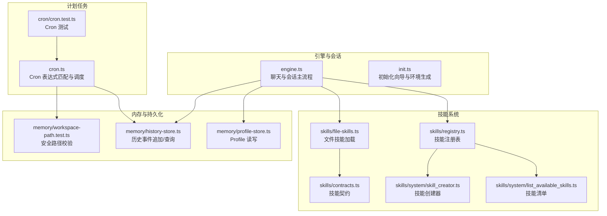
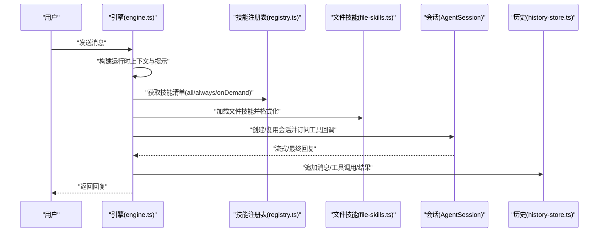
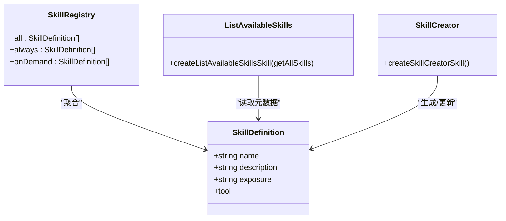
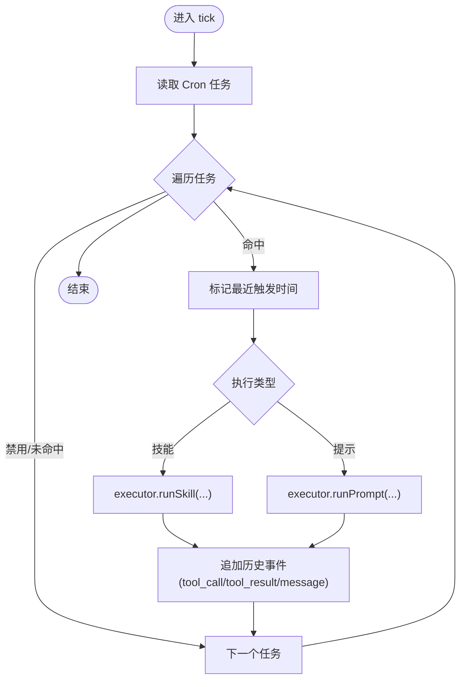
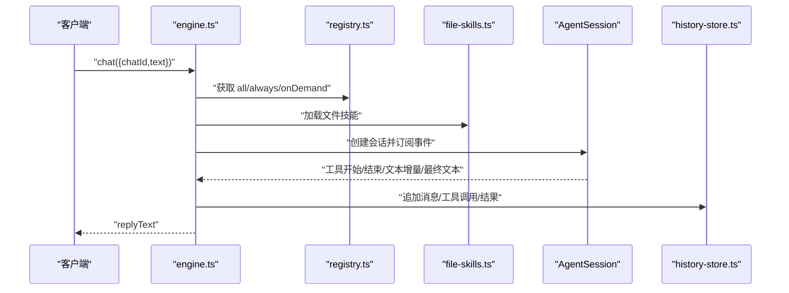
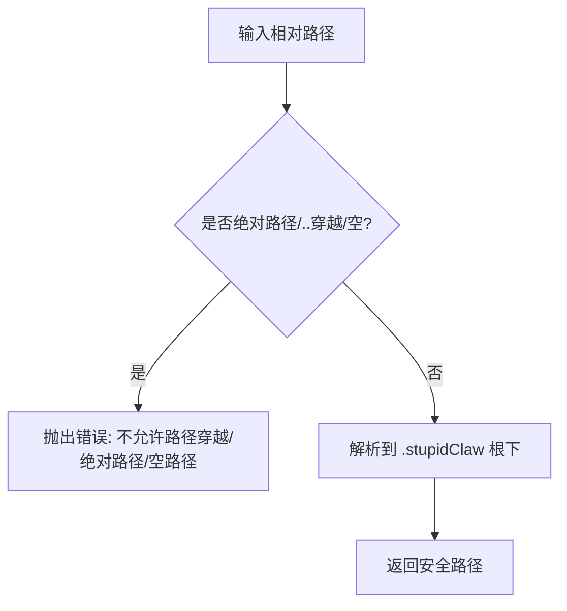
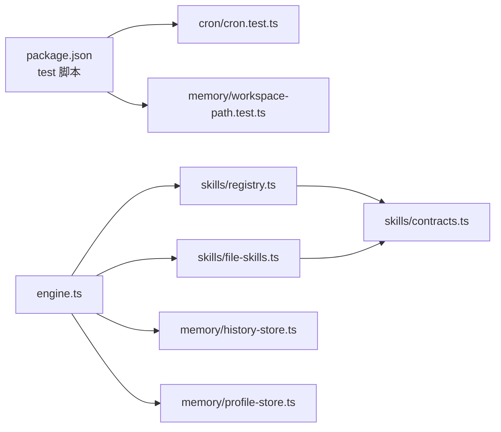

# 技能测试与调试

<cite>
**本文引用的文件**
- [README.md](file://README.md)
- [package.json](file://package.json)
- [src/engine.ts](file://src/engine.ts)
- [src/init.ts](file://src/init.ts)
- [src/skills/registry.ts](file://src/skills/registry.ts)
- [src/skills/contracts.ts](file://src/skills/contracts.ts)
- [src/skills/file-skills.ts](file://src/skills/file-skills.ts)
- [src/skills/system/skill_creator.ts](file://src/skills/system/skill_creator.ts)
- [src/skills/system/list_available_skills.ts](file://src/skills/system/list_available_skills.ts)
- [src/cron.ts](file://src/cron.ts)
- [src/cron/cron.test.ts](file://src/cron/cron.test.ts)
- [src/memory/workspace-path.test.ts](file://src/memory/workspace-path.test.ts)
- [src/memory/history-store.ts](file://src/memory/history-store.ts)
- [src/memory/profile-store.ts](file://src/memory/profile-store.ts)
</cite>

## 目录
1. [引言](#引言)
2. [项目结构](#项目结构)
3. [核心组件](#核心组件)
4. [架构总览](#架构总览)
5. [详细组件分析](#详细组件分析)
6. [依赖分析](#依赖分析)
7. [性能考虑](#性能考虑)
8. [故障排查指南](#故障排查指南)
9. [结论](#结论)
10. [附录](#附录)

## 引言
本指南面向技能开发者与维护者，聚焦于技能开发过程中的测试策略与调试实践。内容覆盖单元测试、集成测试与性能测试的关键环节，并结合仓库现有实现，给出日志记录、错误追踪、参数验证等调试方法，以及针对技能注册失败、参数验证错误、工具调用异常等常见问题的诊断与解决方案。

## 项目结构
该项目采用“功能域+分层”的组织方式：引擎与传输层负责消息编排与会话管理，技能层提供可插拔的能力集合，内存与持久化模块保障长期记忆与历史记录的安全存储。测试脚本通过 Node 标准测试框架运行，覆盖关键算法与安全路径。

图表来源
- [src/engine.ts:1-706](file://src/engine.ts#L1-L706)
- [src/init.ts:1-339](file://src/init.ts#L1-L339)
- [src/skills/registry.ts:1-55](file://src/skills/registry.ts#L1-L55)
- [src/skills/file-skills.ts:1-65](file://src/skills/file-skills.ts#L1-L65)
- [src/skills/contracts.ts:1-20](file://src/skills/contracts.ts#L1-L20)
- [src/skills/system/skill_creator.ts:1-312](file://src/skills/system/skill_creator.ts#L1-L312)
- [src/skills/system/list_available_skills.ts:1-40](file://src/skills/system/list_available_skills.ts#L1-L40)
- [src/cron.ts:1-265](file://src/cron.ts#L1-L265)
- [src/cron/cron.test.ts:1-26](file://src/cron/cron.test.ts#L1-L26)
- [src/memory/workspace-path.test.ts:1-29](file://src/memory/workspace-path.test.ts#L1-L29)
- [src/memory/history-store.ts:1-83](file://src/memory/history-store.ts#L1-L83)
- [src/memory/profile-store.ts:1-132](file://src/memory/profile-store.ts#L1-L132)

章节来源
- [README.md:1-95](file://README.md#L1-L95)
- [package.json:1-39](file://package.json#L1-L39)

## 核心组件
- 引擎与会话管理：负责模型选择、会话创建、提示构建、工具调用订阅、回复提取与历史记录追加。
- 技能注册表：集中管理内置与文件技能，按暴露级别分类，供引擎动态注入。
- 文件技能加载：从项目与内置目录加载技能，去重合并，统一格式化为提示。
- 计划任务：基于 Cron 表达式触发技能或预设提示，记录执行结果与错误。
- 内存与持久化：安全路径解析、历史事件 JSONL 追加与查询、Profile 结构化存储。

章节来源
- [src/engine.ts:1-706](file://src/engine.ts#L1-L706)
- [src/skills/registry.ts:1-55](file://src/skills/registry.ts#L1-L55)
- [src/skills/file-skills.ts:1-65](file://src/skills/file-skills.ts#L1-L65)
- [src/cron.ts:1-265](file://src/cron.ts#L1-L265)
- [src/memory/history-store.ts:1-83](file://src/memory/history-store.ts#L1-L83)
- [src/memory/profile-store.ts:1-132](file://src/memory/profile-store.ts#L1-L132)

## 架构总览
下图展示从用户输入到技能执行与结果回传的端到端流程，以及调试开关对日志输出的影响。

图表来源
- [src/engine.ts:484-705](file://src/engine.ts#L484-L705)
- [src/skills/registry.ts:23-54](file://src/skills/registry.ts#L23-L54)
- [src/skills/file-skills.ts:26-56](file://src/skills/file-skills.ts#L26-L56)
- [src/memory/history-store.ts:37-42](file://src/memory/history-store.ts#L37-L42)

## 详细组件分析

### 组件一：技能注册与暴露控制
- 注册表将内置技能与文件技能合并，按 exposure 分类，供引擎按需注入。
- 列出可用技能工具，便于用户了解能力范围与使用建议。
- 创建器技能支持读取、创建、更新 SKILL.md，规范技能结构与触发描述。

图表来源
- [src/skills/registry.ts:13-54](file://src/skills/registry.ts#L13-L54)
- [src/skills/system/list_available_skills.ts:4-39](file://src/skills/system/list_available_skills.ts#L4-L39)
- [src/skills/system/skill_creator.ts:65-312](file://src/skills/system/skill_creator.ts#L65-L312)
- [src/skills/contracts.ts:6-19](file://src/skills/contracts.ts#L6-L19)

章节来源
- [src/skills/registry.ts:1-55](file://src/skills/registry.ts#L1-L55)
- [src/skills/system/list_available_skills.ts:1-40](file://src/skills/system/list_available_skills.ts#L1-L40)
- [src/skills/system/skill_creator.ts:1-312](file://src/skills/system/skill_creator.ts#L1-L312)
- [src/skills/contracts.ts:1-20](file://src/skills/contracts.ts#L1-L20)

### 组件二：Cron 表达式匹配与调度
- 实现分钟/小时/日/月/周五段匹配，支持通配符、范围、步进与列表。
- 调度器每 15 秒扫描一次，避免重复触发，记录工具调用与结果，并通过历史事件持久化。

图表来源
- [src/cron.ts:171-249](file://src/cron.ts#L171-L249)

章节来源
- [src/cron.ts:1-265](file://src/cron.ts#L1-L265)
- [src/cron/cron.test.ts:1-26](file://src/cron/cron.test.ts#L1-L26)

### 组件三：引擎聊天与工具调用链路
- 模型选择与认证：根据配置与环境变量选择模型，必要时进行 API Key 归一化与错误提示。
- 会话创建：注入自定义工具与文件技能，订阅工具执行事件，构建运行时提示。
- 回复提取：优先处理流式增量，其次提取最终消息，最后回退错误信息。
- 历史记录：将用户消息、工具调用与结果写入历史文件，便于审计与回放。

图表来源
- [src/engine.ts:392-705](file://src/engine.ts#L392-L705)
- [src/skills/registry.ts:23-54](file://src/skills/registry.ts#L23-L54)
- [src/skills/file-skills.ts:26-56](file://src/skills/file-skills.ts#L26-L56)
- [src/memory/history-store.ts:37-42](file://src/memory/history-store.ts#L37-L42)

章节来源
- [src/engine.ts:1-706](file://src/engine.ts#L1-L706)
- [src/memory/history-store.ts:1-83](file://src/memory/history-store.ts#L1-L83)

### 组件四：安全路径与文件技能加载
- 安全路径解析：拒绝绝对路径、路径穿越与空路径，确保所有文件操作限定在沙盒根下。
- 文件技能加载：从项目与内置目录加载，去重合并，统一格式化为提示。

图表来源
- [src/memory/workspace-path.test.ts:6-28](file://src/memory/workspace-path.test.ts#L6-L28)

章节来源
- [src/memory/workspace-path.test.ts:1-29](file://src/memory/workspace-path.test.ts#L1-L29)
- [src/skills/file-skills.ts:1-65](file://src/skills/file-skills.ts#L1-L65)

## 依赖分析
- 测试命令：通过 Node 测试入口运行所有 *.test.ts 文件，覆盖 Cron 表达式与安全路径等关键逻辑。
- 引擎依赖：技能注册表、文件技能、历史存储、Profile 存储与模型注册表。
- 技能依赖：合约定义、文件技能加载、安全路径解析。

图表来源
- [package.json:19-19](file://package.json#L19-L19)
- [src/engine.ts:1-17](file://src/engine.ts#L1-L17)
- [src/skills/registry.ts:1-11](file://src/skills/registry.ts#L1-L11)
- [src/skills/file-skills.ts:1-9](file://src/skills/file-skills.ts#L1-L9)
- [src/cron/cron.test.ts:1-26](file://src/cron/cron.test.ts#L1-L26)
- [src/memory/workspace-path.test.ts:1-4](file://src/memory/workspace-path.test.ts#L1-L4)

章节来源
- [package.json:1-39](file://package.json#L1-L39)
- [src/engine.ts:1-706](file://src/engine.ts#L1-L706)
- [src/skills/registry.ts:1-55](file://src/skills/registry.ts#L1-L55)
- [src/skills/file-skills.ts:1-65](file://src/skills/file-skills.ts#L1-L65)
- [src/memory/history-store.ts:1-83](file://src/memory/history-store.ts#L1-L83)
- [src/memory/profile-store.ts:1-132](file://src/memory/profile-store.ts#L1-L132)

## 性能考虑
- 会话复用：按 chatId 缓存会话，减少重复创建成本。
- 流式响应：优先处理增量文本，降低首字节延迟。
- 历史写入：异步追加历史事件，避免阻塞主流程。
- Cron 调度：固定 15 秒轮询，兼顾及时性与资源占用。
- 模型选择：优先内置可用模型，减少网络探测开销。

章节来源
- [src/engine.ts:461-475](file://src/engine.ts#L461-L475)
- [src/engine.ts:511-607](file://src/engine.ts#L511-L607)
- [src/cron.ts:251-264](file://src/cron.ts#L251-L264)

## 故障排查指南

### 1. 技能注册失败
现象
- 新增技能未出现在可用列表或无法被调用。
可能原因
- 文件技能未放置在正确目录或命名不符合规范。
- 目录中存在重复名称导致去重后被忽略。
- 描述字段缺失或触发描述不够明确，导致意图识别不足。
排查步骤
- 使用“列出可用技能”工具确认技能是否被发现。
- 检查 SKILL.md 的 YAML frontmatter 与正文结构。
- 确认技能目录名与 name 字段一致，且仅包含小写字母、数字与连字符。
- 若为创建器生成，确认 operation 与参数组合正确。

章节来源
- [src/skills/system/list_available_skills.ts:1-40](file://src/skills/system/list_available_skills.ts#L1-L40)
- [src/skills/system/skill_creator.ts:65-312](file://src/skills/system/skill_creator.ts#L65-L312)
- [src/skills/file-skills.ts:1-65](file://src/skills/file-skills.ts#L1-L65)

### 2. 参数验证错误
现象
- 工具调用返回参数非法或必填项缺失。
可能原因
- 调用参数类型与 Schema 不匹配。
- 必填字段未提供或为空字符串。
排查步骤
- 在调试模式下启用提示与工具日志，核对工具参数 Schema。
- 使用创建器的 read 功能查看当前描述与模板，再以 update 重写。
- 对于复杂参数，优先提供最小可复现输入，逐步缩小范围。

章节来源
- [src/engine.ts:58-142](file://src/engine.ts#L58-L142)
- [src/skills/system/skill_creator.ts:127-308](file://src/skills/system/skill_creator.ts#L127-L308)

### 3. 工具调用异常
现象
- 工具执行报错或无响应。
可能原因
- 模型未配置 API Key 或 Key 与模型不匹配。
- 工具内部抛出异常，未被捕获或未写入历史。
排查步骤
- 检查环境变量与模型配置，确认 Provider 与 Key 匹配。
- 观察历史事件中是否存在 tool_call 与 tool_result，定位失败点。
- 若为 Cron 任务，检查最近触发时间与错误消息是否写入历史。

章节来源
- [src/engine.ts:162-186](file://src/engine.ts#L162-L186)
- [src/engine.ts:550-575](file://src/engine.ts#L550-L575)
- [src/cron.ts:147-247](file://src/cron.ts#L147-L247)

### 4. Cron 表达式不生效
现象
- 任务未按预期触发。
可能原因
- Cron 表达式格式不正确或数值越界。
- 任务在当前分钟已被触发（防重复机制）。
排查步骤
- 使用现有测试用例作为参考，逐段验证分钟/小时/日/月/周字段。
- 手动构造时间点，调用表达式匹配函数验证。
- 检查任务 enabled 状态与最近触发时间戳。

章节来源
- [src/cron/cron.test.ts:1-26](file://src/cron/cron.test.ts#L1-L26)
- [src/cron.ts:85-109](file://src/cron.ts#L85-L109)
- [src/cron.ts:171-194](file://src/cron.ts#L171-L194)

### 5. 路径穿越与权限问题
现象
- 文件读写失败或抛出路径相关错误。
可能原因
- 试图访问沙盒根之外的路径。
- 使用绝对路径或包含 “..”。
排查步骤
- 使用安全路径解析函数，确认返回路径位于沙盒根下。
- 对外部输入进行白名单校验，拒绝特殊字符与路径分隔符。

章节来源
- [src/memory/workspace-path.test.ts:14-28](file://src/memory/workspace-path.test.ts#L14-L28)

### 6. 日志与调试开关
- 引擎级调试：设置环境变量以开启引擎与提示日志，观察工具集合与参数摘要。
- 提示调试：打印当前回合提示与工具清单，辅助定位触发与参数问题。

章节来源
- [src/engine.ts:59-73](file://src/engine.ts#L59-L73)
- [src/engine.ts:122-142](file://src/engine.ts#L122-L142)

## 结论
通过规范化的技能结构、完善的测试覆盖与可观测的日志体系，本项目在易用性与可维护性之间取得平衡。建议在新增技能时遵循“最小可用原则”，配合单元与集成测试，结合调试开关与历史事件，快速定位并解决问题。

## 附录

### A. 测试策略与最佳实践
- 单元测试
  - Cron 表达式：覆盖命中/步进/列表/非法输入等场景。
  - 安全路径：覆盖路径穿越、绝对路径、空路径等边界。
- 集成测试
  - 从初始化向导生成 .env，启动引擎，调用技能，断言历史事件与回复。
  - 验证不同 Provider 的模型选择与 Key 归一化。
- 性能测试
  - 并发调用多个技能，测量首字节与尾字节延迟。
  - 模拟长历史与大 Profile，评估提示长度与上下文窗口影响。

章节来源
- [src/cron/cron.test.ts:1-26](file://src/cron/cron.test.ts#L1-L26)
- [src/memory/workspace-path.test.ts:1-29](file://src/memory/workspace-path.test.ts#L1-L29)
- [src/init.ts:224-339](file://src/init.ts#L224-L339)
- [src/engine.ts:680-705](file://src/engine.ts#L680-L705)