# 新供应商集成

<cite>
**本文档引用的文件**
- [init-providers.ts](file://src/init-providers.ts)
- [init.ts](file://src/init.ts)
- [engine.ts](file://src/engine.ts)
- [index.ts](file://src/index.ts)
- [models.md](file://docs/models.md)
- [getting-started.md](file://docs/getting-started.md)
- [gateway.ts](file://src/gateway.ts)
</cite>

## 目录
1. [简介](#简介)
2. [项目结构概览](#项目结构概览)
3. [核心组件分析](#核心组件分析)
4. [供应商集成架构](#供应商集成架构)
5. [详细集成流程](#详细集成流程)
6. [不同供应商类型适配方法](#不同供应商类型适配方法)
7. [配置字段详解](#配置字段详解)
8. [集成最佳实践](#集成最佳实践)
9. [常见问题与解决方案](#常见问题与解决方案)
10. [故障排除指南](#故障排除指南)
11. [总结](#总结)

## 简介

StupidClaw 是一个基于 pi-mono 底座的极简本地 Agent 系统，支持多种 AI 供应商集成。本文档详细说明如何在 PROVIDERS 数组中添加新的 AI 供应商，包括 InitProvider 接口的各个字段含义、不同供应商类型的适配方法，以及完整的集成流程。

## 项目结构概览

StupidClaw 采用模块化架构设计，主要组件包括：

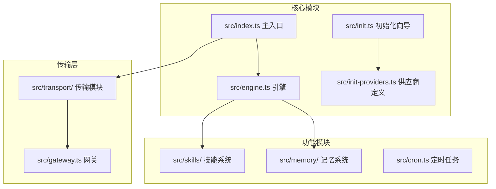

**图表来源**
- [index.ts:1-216](file://src/index.ts#L1-L216)
- [engine.ts:1-706](file://src/engine.ts#L1-L706)
- [init-providers.ts:1-180](file://src/init-providers.ts#L1-L180)

## 核心组件分析

### InitProvider 类型定义

InitProvider 接口是供应商集成的核心数据结构，定义了供应商的基本信息和配置选项：

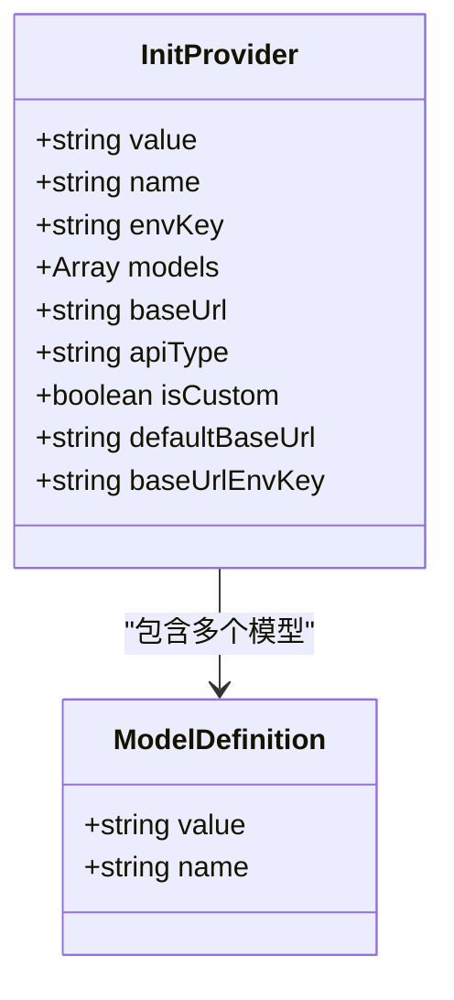

**图表来源**
- [init-providers.ts:3-19](file://src/init-providers.ts#L3-L19)

### 供应商注册机制

系统通过两种方式注册供应商：

1. **静态注册**：在启动时根据环境变量动态注册
2. **初始化向导**：通过交互式向导配置新供应商

**章节来源**
- [engine.ts:246-383](file://src/engine.ts#L246-L383)
- [init.ts:224-338](file://src/init.ts#L224-L338)

## 供应商集成架构

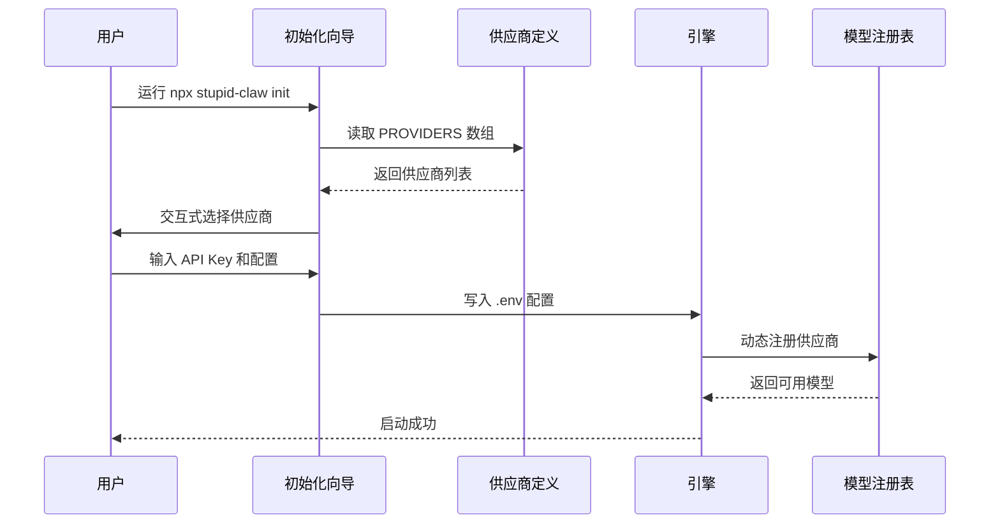

**图表来源**
- [init.ts:224-338](file://src/init.ts#L224-L338)
- [engine.ts:392-459](file://src/engine.ts#L392-L459)

## 详细集成流程

### 第一步：添加供应商定义

在 `src/init-providers.ts` 中的 PROVIDERS 数组中添加新的供应商条目：

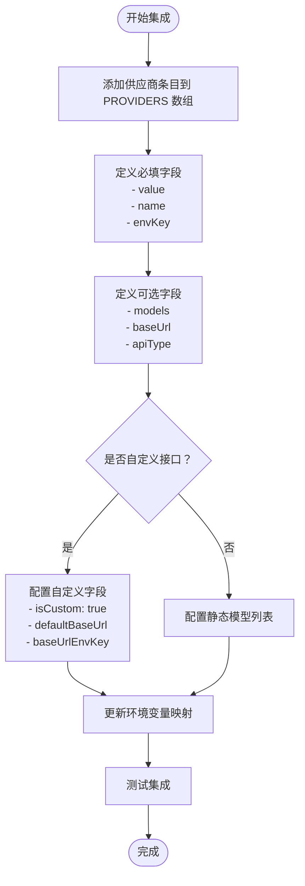

**图表来源**
- [init-providers.ts:23-180](file://src/init-providers.ts#L23-L180)

### 第二步：配置环境变量映射

在 `src/engine.ts` 的 PROVIDER_ENV_KEY_MAP 中添加新的供应商映射：

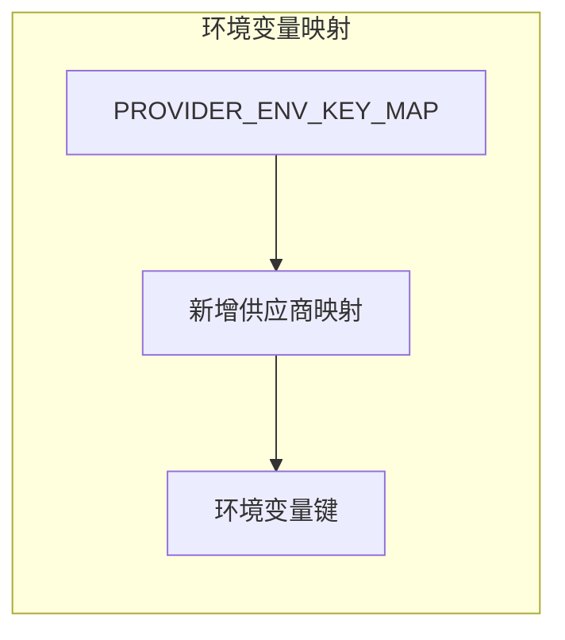

**图表来源**
- [engine.ts:39-57](file://src/engine.ts#L39-L57)

### 第三步：实现动态注册

在 `src/engine.ts` 的 createModelRegistry 函数中添加供应商注册逻辑：

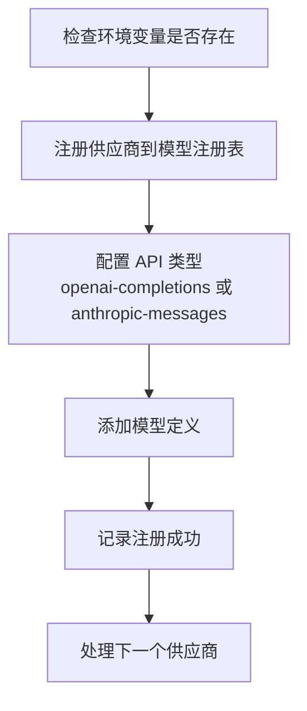

**图表来源**
- [engine.ts:291-383](file://src/engine.ts#L291-L383)

**章节来源**
- [init-providers.ts:23-180](file://src/init-providers.ts#L23-L180)
- [engine.ts:39-57](file://src/engine.ts#L39-L57)
- [engine.ts:291-383](file://src/engine.ts#L291-L383)

## 不同供应商类型适配方法

### OpenAI 兼容接口

适用于支持 OpenAI API 规范的供应商：

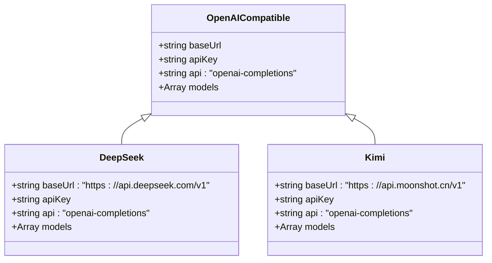

**图表来源**
- [init-providers.ts:41-62](file://src/init-providers.ts#L41-L62)
- [engine.ts:291-320](file://src/engine.ts#L291-L320)

### Anthropic 接口

适用于支持 Anthropic Messages API 的供应商：

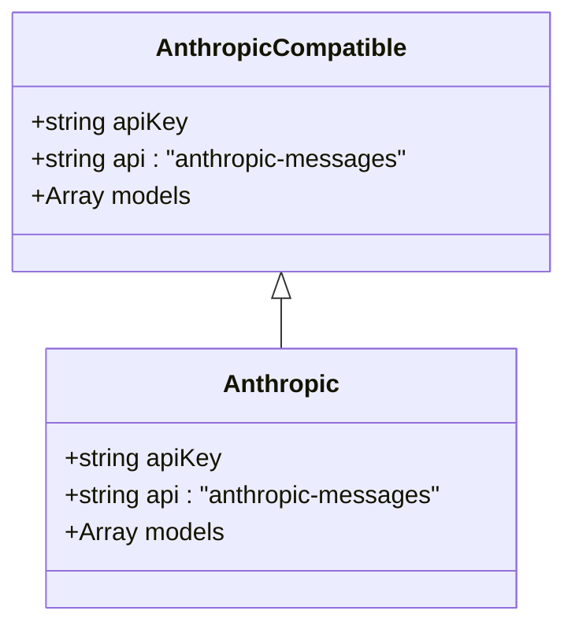

**图表来源**
- [init-providers.ts:96-106](file://src/init-providers.ts#L96-L106)
- [engine.ts:321-352](file://src/engine.ts#L321-L352)

### 自定义接口

支持任意兼容 OpenAI 或 Anthropic 规范的自定义服务：

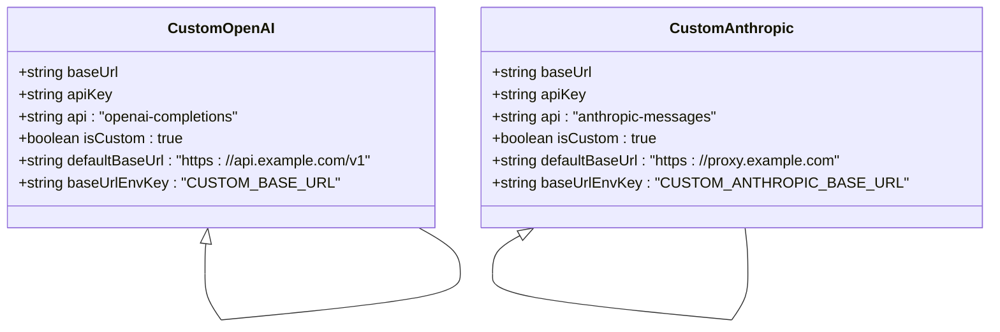

**图表来源**
- [init-providers.ts:164-179](file://src/init-providers.ts#L164-L179)
- [engine.ts:354-380](file://src/engine.ts#L354-L380)

**章节来源**
- [init-providers.ts:41-179](file://src/init-providers.ts#L41-L179)
- [engine.ts:291-380](file://src/engine.ts#L291-L380)

## 配置字段详解

### InitProvider 字段说明

| 字段名 | 类型 | 必填 | 描述 | 示例 |
|--------|------|------|------|------|
| `value` | string | 是 | 供应商标识符，用于 STUPID_MODEL 中 | `"openai"` |
| `name` | string | 是 | 供应商显示名称 | `"OpenAI"` |
| `envKey` | string | 是 | API Key 对应的环境变量名 | `"OPENAI_API_KEY"` |
| `models` | Array | 否 | 静态模型列表，用于初始化向导 | `[{value:"gpt-4o", name:"GPT-4o"}]` |
| `baseUrl` | string | 否 | 固定的 API 基础 URL | `"https://api.openai.com/v1"` |
| `apiType` | enum | 否 | API 协议类型 | `"openai-completions"` |
| `isCustom` | boolean | 否 | 是否为自定义接口 | `true` |
| `defaultBaseUrl` | string | 否 | 自定义接口默认基础 URL | `"http://localhost:11434/v1"` |
| `baseUrlEnvKey` | string | 否 | 自定义接口环境变量名 | `"OLLAMA_BASE_URL"` |

### 环境变量映射规则

系统通过 PROVIDER_ENV_KEY_MAP 实现供应商标识符到环境变量的映射：

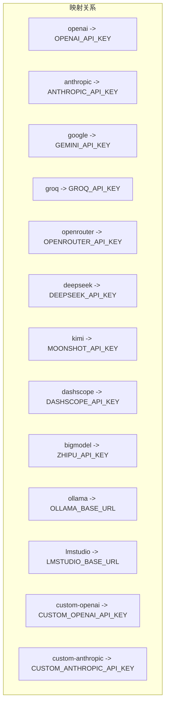

**图表来源**
- [engine.ts:39-57](file://src/engine.ts#L39-L57)

**章节来源**
- [init-providers.ts:3-19](file://src/init-providers.ts#L3-L19)
- [engine.ts:39-57](file://src/engine.ts#L39-L57)

## 集成最佳实践

### 1. 供应商命名规范

- 使用小写字母和短横线组合
- 避免使用特殊字符和空格
- 保持与供应商官方标识符一致

### 2. 模型定义策略

- 优先提供静态模型列表，提升用户体验
- 对于动态模型，考虑实现模型发现机制
- 确保模型 ID 与供应商 API 完全匹配

### 3. 错误处理机制

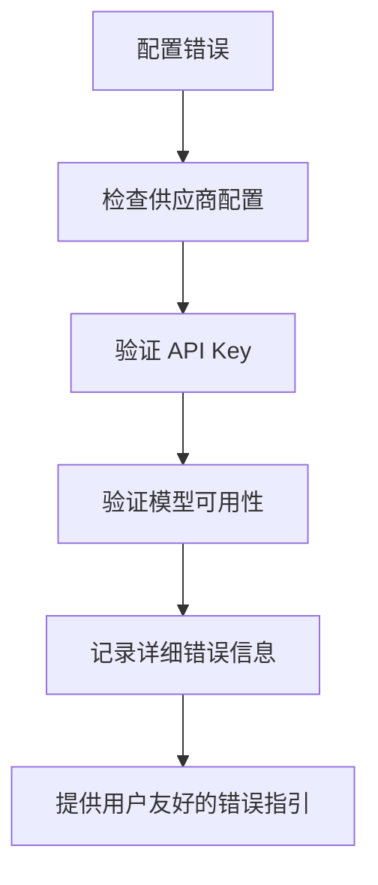

**图表来源**
- [engine.ts:162-186](file://src/engine.ts#L162-L186)

### 4. 性能优化建议

- 缓存供应商元数据
- 实现连接池管理
- 添加超时和重试机制

**章节来源**
- [engine.ts:162-186](file://src/engine.ts#L162-L186)

## 常见问题与解决方案

### 1. API Key 验证失败

**问题描述**：系统提示 API Key 无效或未配置

**解决方案**：
- 检查环境变量是否正确设置
- 验证 API Key 格式是否正确
- 确认供应商账户状态正常

### 2. 模型不可用

**问题描述**：选择的模型在供应商处不可用

**解决方案**：
- 查看供应商提供的可用模型列表
- 更新模型 ID 为供应商支持的版本
- 检查订阅状态和配额限制

### 3. 自定义接口连接失败

**问题描述**：自定义 Base URL 无法连接

**解决方案**：
- 验证 Base URL 格式正确性
- 检查网络连通性和防火墙设置
- 确认代理配置正确

### 4. 初始化向导异常

**问题描述**：初始化向导无法正常运行

**解决方案**：
- 检查 Node.js 版本要求
- 验证依赖包完整性
- 清理缓存后重新运行

**章节来源**
- [init.ts:58-66](file://src/init.ts#L58-L66)
- [engine.ts:162-186](file://src/engine.ts#L162-L186)

## 故障排除指南

### 1. 配置文件问题

**症状**：程序启动时报错，提示缺少配置文件

**解决步骤**：
1. 运行 `npx stupid-claw init` 重新生成配置
2. 检查 .env 文件权限设置
3. 验证配置文件语法正确性

### 2. 环境变量冲突

**症状**：多个供应商配置相互影响

**解决步骤**：
1. 检查是否存在重复的环境变量
2. 验证供应商标识符唯一性
3. 清理不必要的配置项

### 3. 模型注册失败

**症状**：供应商已配置但无法使用

**解决步骤**：
1. 检查供应商 API 端点可达性
2. 验证 API Key 权限范围
3. 查看系统日志获取详细错误信息

**章节来源**
- [index.ts:28-40](file://src/index.ts#L28-L40)
- [engine.ts:392-459](file://src/engine.ts#L392-L459)

## 总结

新 AI 供应商集成涉及多个层面的配置和实现，包括数据结构定义、环境变量映射、动态注册机制和用户交互流程。通过遵循本文档的指导原则和最佳实践，可以确保新供应商的顺利集成和稳定运行。

关键要点：
- 严格按照 InitProvider 接口定义配置供应商信息
- 实现正确的环境变量映射和动态注册
- 提供清晰的用户交互体验和错误处理机制
- 遵循性能优化和安全最佳实践

通过系统化的集成流程和完善的测试验证，新的 AI 供应商可以无缝融入 StupidClaw 生态系统，为用户提供一致的使用体验。