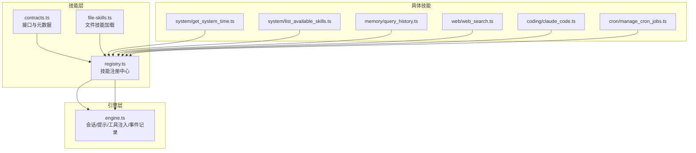
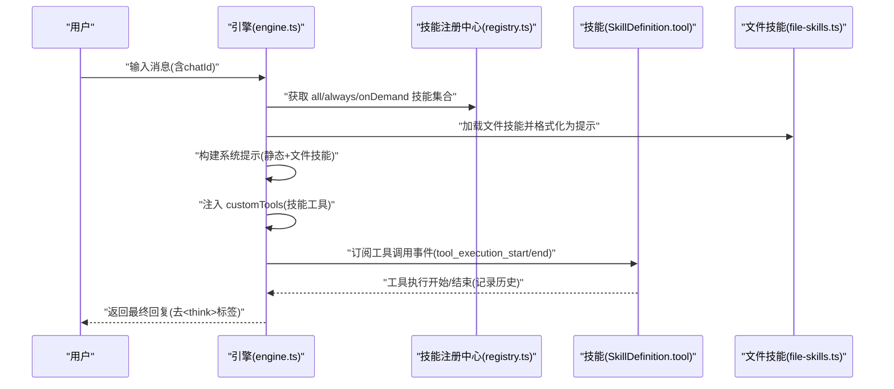
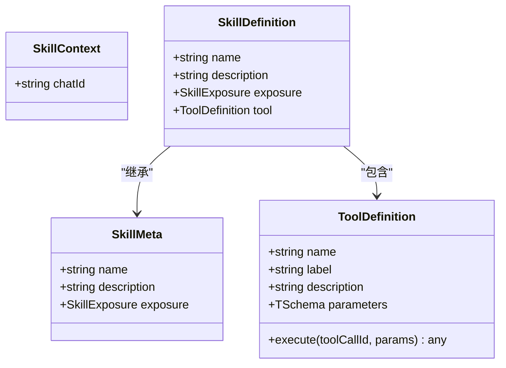
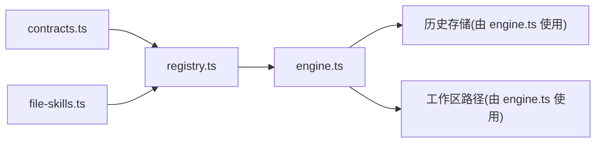

# 技能开发

<cite>
**本文引用的文件**
- [contracts.ts](file://src/skills/contracts.ts)
- [registry.ts](file://src/skills/registry.ts)
- [file-skills.ts](file://src/skills/file-skills.ts)
- [engine.ts](file://src/engine.ts)
- [get_system_time.ts](file://src/skills/system/get_system_time.ts)
- [list_available_skills.ts](file://src/skills/system/list_available_skills.ts)
- [query_history.ts](file://src/skills/memory/query_history.ts)
- [claude_code.ts](file://src/skills/coding/claude_code.ts)
- [web_search.ts](file://src/skills/web/web_search.ts)
- [manage_cron_jobs.ts](file://src/skills/cron/manage_cron_jobs.ts)
- [workspace-path.test.ts](file://src/memory/workspace-path.test.ts)
- [cron.test.ts](file://src/cron/cron.test.ts)
- [package.json](file://package.json)
- [README.md](file://README.md)
- [docs/getting-started.md](file://docs/getting-started.md)
</cite>

## 目录
1. [简介](#简介)
2. [项目结构](#项目结构)
3. [核心组件](#核心组件)
4. [架构总览](#架构总览)
5. [详细组件分析](#详细组件分析)
6. [依赖关系分析](#依赖关系分析)
7. [性能考量](#性能考量)
8. [故障排查指南](#故障排查指南)
9. [结论](#结论)
10. [附录](#附录)

## 简介
本指南面向希望在 StupidClaw 平台上开发“技能”的工程师与技术作者。StupidClaw 基于 pi-mono 底座，采用“文件系统即知识库”的极简架构，严格限制 AI 的工作范围在 .stupidClaw 沙盒内，不引入数据库或向量库。技能是可被 LLM 调用的工具函数，分为两类暴露策略：always（始终可用）与 on_demand（按需披露）。本指南将系统讲解技能接口定义、元数据配置、工具函数编写规范、注册与暴露策略、上下文传递、最佳实践、测试与调试方法，并给出系统技能、文件技能、内存技能等类型的实际开发范式。

## 项目结构
StupidClaw 的技能体系位于 src/skills 目录，围绕以下关键模块组织：
- contracts.ts：技能接口与元数据定义（SkillDefinition、SkillMeta、SkillContext、SkillExposure）
- registry.ts：技能注册中心，负责聚合内置技能与文件技能，按暴露策略分类
- file-skills.ts：标准文件技能加载器，从项目与内置目录加载技能并格式化为提示
- 各类技能实现：system、memory、web、cron、coding 等子目录下的具体技能
- engine.ts：引擎层，负责会话创建、系统提示构建、工具注入、事件记录与回复抽取

图表来源
- [contracts.ts:1-20](file://src/skills/contracts.ts#L1-L20)
- [registry.ts:1-55](file://src/skills/registry.ts#L1-L55)
- [file-skills.ts:1-65](file://src/skills/file-skills.ts#L1-L65)
- [engine.ts:1-706](file://src/engine.ts#L1-L706)

章节来源
- [README.md:1-95](file://README.md#L1-L95)
- [contracts.ts:1-20](file://src/skills/contracts.ts#L1-L20)
- [registry.ts:1-55](file://src/skills/registry.ts#L1-L55)
- [file-skills.ts:1-65](file://src/skills/file-skills.ts#L1-L65)
- [engine.ts:1-706](file://src/engine.ts#L1-L706)

## 核心组件
- 技能接口与元数据
  - SkillDefinition：扩展 SkillMeta，附加 ToolDefinition，统一技能名称、描述、暴露策略与工具定义
  - SkillMeta：技能元数据，包含 name、description、exposure
  - SkillContext：技能执行上下文，当前 chatId
  - SkillExposure：暴露策略，"always" 或 "on_demand"

- 技能注册中心
  - 聚合内置技能与文件技能，按 exposure 分类为 all、always、onDemand
  - 提供 getDefaultChatId 选项，用于 cron 等需要默认会话标识的技能

- 文件技能加载
  - 从项目 skills 目录与内置 builtin-skills 目录加载技能
  - 去重、格式化为提示，便于注入到系统提示中

- 引擎集成
  - 引擎在创建 AgentSession 时注入 customTools（来自技能注册中心）
  - 订阅工具调用事件，记录历史事件，构建每回合提示，抽取最终回复

章节来源
- [contracts.ts:1-20](file://src/skills/contracts.ts#L1-L20)
- [registry.ts:1-55](file://src/skills/registry.ts#L1-L55)
- [file-skills.ts:1-65](file://src/skills/file-skills.ts#L1-L65)
- [engine.ts:1-706](file://src/engine.ts#L1-L706)

## 架构总览
下面的序列图展示了从用户输入到技能执行与结果返回的关键流程，包括工具注入、事件记录与回复抽取。

图表来源
- [engine.ts:420-460](file://src/engine.ts#L420-L460)
- [engine.ts:510-607](file://src/engine.ts#L510-L607)
- [registry.ts:23-54](file://src/skills/registry.ts#L23-L54)
- [file-skills.ts:26-56](file://src/skills/file-skills.ts#L26-L56)

章节来源
- [engine.ts:420-460](file://src/engine.ts#L420-L460)
- [engine.ts:510-607](file://src/engine.ts#L510-L607)
- [registry.ts:23-54](file://src/skills/registry.ts#L23-L54)
- [file-skills.ts:26-56](file://src/skills/file-skills.ts#L26-L56)

## 详细组件分析

### 接口与元数据：SkillDefinition 与 SkillMeta
- 设计要点
  - 使用 ToolDefinition 描述工具名称、标签、描述、参数 Schema 与执行函数
  - 参数 Schema 使用 Type.Object(...) 声明，便于运行时校验与提示
  - exposure 控制技能是否默认注入到 LLM 工具池
  - chatId 通过 SkillContext 传递，便于技能按会话维度进行读写与调度

- 复杂度与性能
  - 参数 Schema 的声明与校验在工具调用前完成，避免运行时反复解析
  - ToolDefinition.execute 返回结构化内容，利于后续事件记录与 UI 展示

- 错误处理
  - 对异常进行捕获与归一化，保证对外输出一致的错误信息

章节来源
- [contracts.ts:1-20](file://src/skills/contracts.ts#L1-L20)

### 注册中心：createSkillRegistry
- 职责
  - 组装内置技能（系统、内存、文件、网络、编码、定时等）
  - 生成 list_available_skills 技能，动态返回当前可用技能清单
  - 按 exposure 过滤 all/always/onDemand 三类集合

- 上下文注入
  - 支持 getDefaultChatId，使需要默认 chatId 的技能（如定时任务）可稳定获取

- 与文件技能协作
  - 通过 getStandardFileSkillMetas 将文件技能纳入“可按需披露”清单

章节来源
- [registry.ts:1-55](file://src/skills/registry.ts#L1-L55)

### 文件技能：loadStandardFileSkills 与 buildStandardFileSkillsPrompt
- 加载策略
  - 优先项目 skills 目录，其次内置 builtin-skills 目录
  - 去重同名技能，避免重复注入
  - 使用 formatSkillsForPrompt 将技能集合格式化为提示文本

- 暴露策略
  - 文件技能统一标记为 on_demand，避免过度披露

章节来源
- [file-skills.ts:1-65](file://src/skills/file-skills.ts#L1-L65)

### 引擎：会话创建、工具注入与事件记录
- 会话创建
  - 选择模型、注册多提供商、构建系统提示（静态提示 + 文件技能提示）
  - 注入 customTools（技能工具）与 coding 工具

- 工具调用事件
  - 订阅 tool_execution_start/end，记录工具调用与结果到历史
  - 对异常进行归一化，提升用户体验

- 回复抽取
  - 优先从流式增量中拼接，其次从会话状态中提取最新助手消息
  - 去除<think>标签，保证输出简洁

章节来源
- [engine.ts:392-460](file://src/engine.ts#L392-L460)
- [engine.ts:510-607](file://src/engine.ts#L510-L607)
- [engine.ts:680-706](file://src/engine.ts#L680-L706)

### 系统技能：get_system_time 与 list_available_skills
- get_system_time
  - always 暴露，无参数，返回 ISO 与本地时间字符串
  - 适合作为基础能力，帮助 LLM 了解运行时上下文

- list_available_skills
  - always 暴露，动态列举 all 技能（含文件技能），并附带使用指引
  - 有助于用户了解技能目录与调用策略

章节来源
- [get_system_time.ts:1-38](file://src/skills/system/get_system_time.ts#L1-L38)
- [list_available_skills.ts:1-40](file://src/skills/system/list_available_skills.ts#L1-L40)

### 内存技能：query_history
- 功能
  - 查询历史事件，支持按日期、chatId 过滤与限制数量
  - 适合需要回顾对话历史的场景

- 参数验证
  - 使用 Type.Object 声明可选参数，确保调用时的健壮性

章节来源
- [query_history.ts:1-57](file://src/skills/memory/query_history.ts#L1-L57)

### 编码技能：claude_code
- 功能
  - 调用本机安装的 Claude Code CLI 执行编程任务
  - 支持工作目录参数，具备超时与缓冲区限制

- 错误处理
  - 对未安装 CLI、执行失败等情况进行友好提示
  - 输出 stdout/stderr 汇总，便于排障

章节来源
- [claude_code.ts:1-99](file://src/skills/coding/claude_code.ts#L1-L99)

### 网络技能：web_search
- 功能
  - 通过 Brave Search API 搜索互联网，返回标题、链接与摘要
  - 支持结果数量上限控制

- 安全与配置
  - 依赖 BRAVE_SEARCH_API_KEY 环境变量，未配置时返回明确错误

章节来源
- [web_search.ts:1-95](file://src/skills/web/web_search.ts#L1-L95)

### 定时技能：manage_cron_jobs
- 功能
  - 支持 list/add/update/remove/set_enabled 操作
  - 支持固定工具调用（绕过 LLM）与动态生成内容两种模式
  - 支持指定 chatId 与 sessionKey，便于跨会话调度

- 参数与约束
  - cron 表达式必须为 5 段
  - 新增时若未指定 toolName，需提供 skillNames/prompt/requirement 至少一项
  - 更新时对 cron 表达式进行合法性校验

章节来源
- [manage_cron_jobs.ts:1-336](file://src/skills/cron/manage_cron_jobs.ts#L1-L336)

### 类图：技能接口与实现关系

图表来源
- [contracts.ts:6-19](file://src/skills/contracts.ts#L6-L19)

## 依赖关系分析
- 技能层依赖
  - contracts.ts 为所有技能提供统一接口
  - registry.ts 聚合技能并按暴露策略分类
  - file-skills.ts 为文件技能提供加载与格式化能力

- 引擎层依赖
  - engine.ts 依赖 registry.ts 与 file-skills.ts，注入工具并记录事件
  - engine.ts 依赖历史存储与工作区路径解析，保障安全与一致性

图表来源
- [contracts.ts:1-20](file://src/skills/contracts.ts#L1-L20)
- [registry.ts:1-55](file://src/skills/registry.ts#L1-L55)
- [file-skills.ts:1-65](file://src/skills/file-skills.ts#L1-L65)
- [engine.ts:1-706](file://src/engine.ts#L1-L706)

章节来源
- [engine.ts:1-706](file://src/engine.ts#L1-L706)
- [registry.ts:1-55](file://src/skills/registry.ts#L1-L55)
- [file-skills.ts:1-65](file://src/skills/file-skills.ts#L1-L65)

## 性能考量
- 工具注入与提示构建
  - 通过 formatSkillsForPrompt 将文件技能一次性格式化为提示，减少重复计算
  - 引擎在创建会话时一次性注入 customTools，避免运行时频繁组装

- 事件记录与流式输出
  - 订阅工具执行事件，避免阻塞主流程
  - 流式增量文本优先拼接，降低延迟

- 超时与资源限制
  - 编码技能设置执行超时与输出缓冲区上限，防止长时间阻塞
  - 模型选择与提供商注册在启动阶段完成，避免运行时切换带来的抖动

章节来源
- [engine.ts:420-460](file://src/engine.ts#L420-L460)
- [engine.ts:510-607](file://src/engine.ts#L510-L607)
- [claude_code.ts:30-95](file://src/skills/coding/claude_code.ts#L30-L95)

## 故障排查指南
- API Key 问题
  - 引擎对 API Key 缺失或无效进行归一化提示，包含缺失 provider 与建议配置项
  - 建议核对 .env 中对应 provider 的密钥配置，或检查 STUPID_MODEL 的 provider/model_id 拼写

- 路径安全
  - 工作区路径解析拒绝绝对路径、路径穿越与空路径，测试用例覆盖典型非法输入
  - 若出现“不允许路径穿越”等错误，请检查传入路径是否位于 .stupidClaw 沙盒内

- 定时任务表达式
  - cron 表达式必须为 5 段，否则返回明确错误
  - 测试用例覆盖每天 8 点命中、步进与列表语法、非法表达式等场景

- 文件技能加载
  - 确认项目 skills 目录与内置 builtin-skills 目录存在且可读
  - 同名技能会被去重，确保唯一性

章节来源
- [engine.ts:162-186](file://src/engine.ts#L162-L186)
- [workspace-path.test.ts:1-29](file://src/memory/workspace-path.test.ts#L1-L29)
- [cron.test.ts:1-26](file://src/cron/cron.test.ts#L1-L26)
- [file-skills.ts:26-48](file://src/skills/file-skills.ts#L26-L48)

## 结论
StupidClaw 的技能体系以清晰的接口定义、严格的暴露策略与安全的上下文传递为核心，结合文件技能加载与引擎层的工具注入机制，实现了“按需披露、最小暴露、可控执行”的技能生态。遵循本文的最佳实践与规范，可在保证安全与性能的前提下，快速开发并迭代各类技能，满足多样化的业务需求。

## 附录

### 技能开发最佳实践
- 接口与元数据
  - 使用 Type.Object 声明参数 Schema，确保参数可验证、可提示
  - 明确 exposure 策略：always 仅用于基础能力，on_demand 用于敏感或昂贵操作
  - 在 SkillContext 中传递 chatId，便于按会话维度进行读写与调度

- 工具函数编写
  - execute 返回结构化内容，包含 content 与 details，便于事件记录与 UI 展示
  - 对外部依赖（如 CLI、API）进行显式错误处理与用户友好提示
  - 设置合理的超时与资源限制，避免阻塞与资源耗尽

- 注册与暴露
  - 在 registry.ts 中注册技能，确保 always 与 on_demand 的合理分布
  - 文件技能统一标记为 on_demand，并通过 file-skills.ts 格式化注入

- 参数验证与错误处理
  - 对必填参数与格式进行前置校验（如 cron 表达式、chatId）
  - 对异常进行归一化，避免泄露内部细节

- 安全性考虑
  - 严格限制工作区路径，拒绝绝对路径与路径穿越
  - 仅注入必要的工具，避免过度披露

- 测试与调试
  - 使用 Node 内置测试框架编写单元测试，覆盖关键分支与边界条件
  - 启用 DEBUG_STUPIDCLAW 与 DEBUG_PROMPT 查看运行时日志与提示内容
  - 使用 StupidIM 或 Telegram 进行端到端验证

章节来源
- [contracts.ts:1-20](file://src/skills/contracts.ts#L1-L20)
- [registry.ts:1-55](file://src/skills/registry.ts#L1-L55)
- [file-skills.ts:1-65](file://src/skills/file-skills.ts#L1-L65)
- [engine.ts:59-73](file://src/engine.ts#L59-L73)
- [workspace-path.test.ts:1-29](file://src/memory/workspace-path.test.ts#L1-L29)
- [cron.test.ts:1-26](file://src/cron/cron.test.ts#L1-L26)
- [package.json:14-21](file://package.json#L14-L21)

### 实际开发范式示例（路径指引）
- 系统技能：always 暴露的基础能力
  - 示例：[get_system_time.ts:1-38](file://src/skills/system/get_system_time.ts#L1-L38)
  - 示例：[list_available_skills.ts:1-40](file://src/skills/system/list_available_skills.ts#L1-L40)

- 内存技能：on_demand 按需披露
  - 示例：[query_history.ts:1-57](file://src/skills/memory/query_history.ts#L1-L57)

- 文件技能：从目录加载并注入
  - 示例：[file-skills.ts:1-65](file://src/skills/file-skills.ts#L1-L65)

- 编码技能：调用外部 CLI
  - 示例：[claude_code.ts:1-99](file://src/skills/coding/claude_code.ts#L1-L99)

- 网络技能：调用外部 API
  - 示例：[web_search.ts:1-95](file://src/skills/web/web_search.ts#L1-L95)

- 定时技能：复杂参数与多动作
  - 示例：[manage_cron_jobs.ts:1-336](file://src/skills/cron/manage_cron_jobs.ts#L1-L336)

章节来源
- [get_system_time.ts:1-38](file://src/skills/system/get_system_time.ts#L1-L38)
- [list_available_skills.ts:1-40](file://src/skills/system/list_available_skills.ts#L1-L40)
- [query_history.ts:1-57](file://src/skills/memory/query_history.ts#L1-L57)
- [file-skills.ts:1-65](file://src/skills/file-skills.ts#L1-L65)
- [claude_code.ts:1-99](file://src/skills/coding/claude_code.ts#L1-L99)
- [web_search.ts:1-95](file://src/skills/web/web_search.ts#L1-L95)
- [manage_cron_jobs.ts:1-336](file://src/skills/cron/manage_cron_jobs.ts#L1-L336)

### 测试方法与调试技巧
- 单元测试
  - 使用 Node 测试框架与 tsx 导入，覆盖参数校验、错误分支与边界条件
  - 示例：[workspace-path.test.ts:1-29](file://src/memory/workspace-path.test.ts#L1-L29)、[cron.test.ts:1-26](file://src/cron/cron.test.ts#L1-L26)

- 端到端调试
  - 启用 DEBUG_STUPIDCLAW 与 DEBUG_PROMPT，查看工具列表与提示内容
  - 使用 StupidIM 或 Telegram 进行交互验证

- 性能优化
  - 减少不必要的工具注入，优先使用 always 技能
  - 对外部调用设置超时与缓冲区上限
  - 合理使用文件技能提示，避免过长提示影响上下文窗口

章节来源
- [workspace-path.test.ts:1-29](file://src/memory/workspace-path.test.ts#L1-L29)
- [cron.test.ts:1-26](file://src/cron/cron.test.ts#L1-L26)
- [engine.ts:59-73](file://src/engine.ts#L59-L73)
- [docs/getting-started.md:1-153](file://docs/getting-started.md#L1-L153)