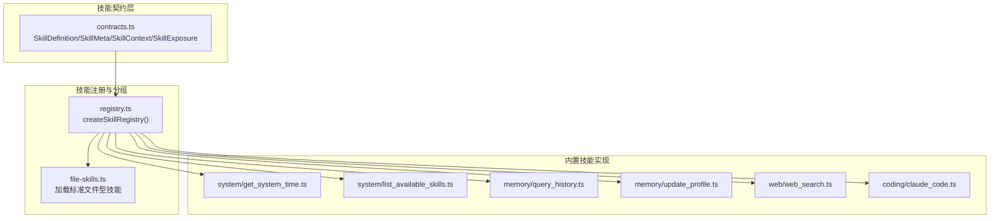
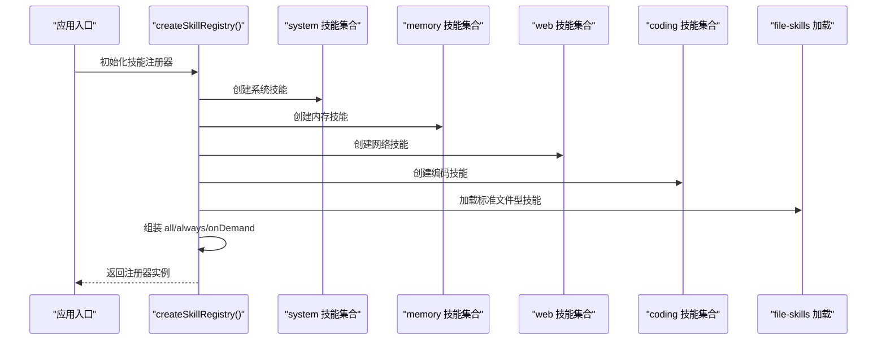
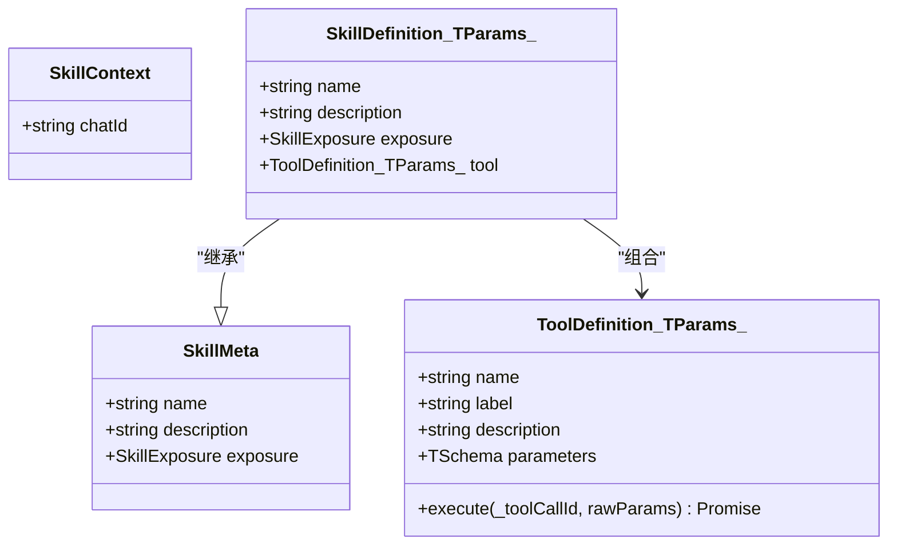
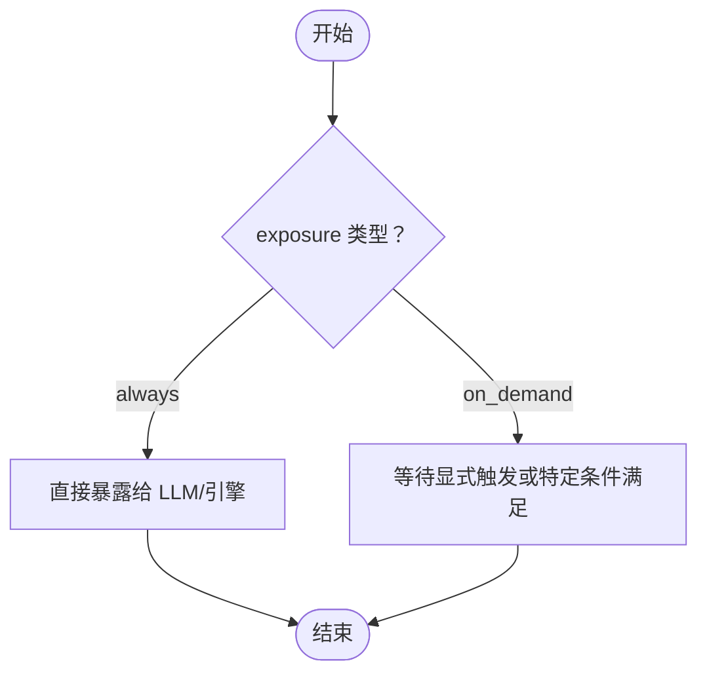
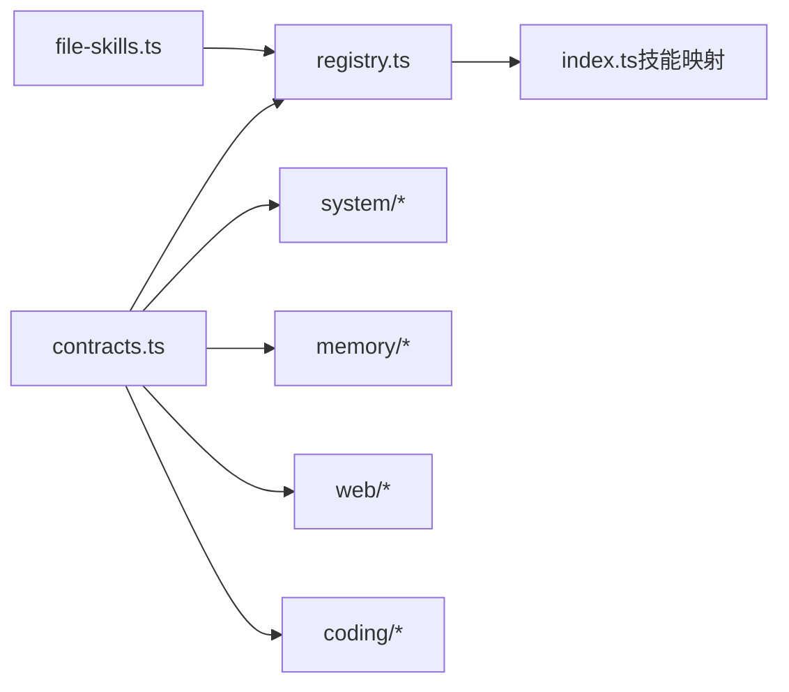

# 技能接口定义

<cite>
**本文档引用的文件**
- [src/skills/contracts.ts](file://src/skills/contracts.ts)
- [src/skills/registry.ts](file://src/skills/registry.ts)
- [src/skills/system/get_system_time.ts](file://src/skills/system/get_system_time.ts)
- [src/skills/system/list_available_skills.ts](file://src/skills/system/list_available_skills.ts)
- [src/skills/memory/query_history.ts](file://src/skills/memory/query_history.ts)
- [src/skills/memory/update_profile.ts](file://src/skills/memory/update_profile.ts)
- [src/skills/web/web_search.ts](file://src/skills/web/web_search.ts)
- [src/skills/coding/claude_code.ts](file://src/skills/coding/claude_code.ts)
- [src/skills/file-skills.ts](file://src/skills/file-skills.ts)
- [src/index.ts](file://src/index.ts)
</cite>

## 目录
1. [简介](#简介)
2. [项目结构](#项目结构)
3. [核心组件](#核心组件)
4. [架构总览](#架构总览)
5. [详细组件分析](#详细组件分析)
6. [依赖分析](#依赖分析)
7. [性能考虑](#性能考虑)
8. [故障排查指南](#故障排查指南)
9. [结论](#结论)
10. [附录](#附录)

## 简介
本文件系统性阐述技能接口定义的设计与实现，重点围绕以下主题：
- SkillDefinition 接口的结构与职责
- SkillMeta（name、description、exposure）与 ToolDefinition 的组合关系
- SkillExposure 类型（always/on_demand）的语义、区别与使用场景
- SkillContext 上下文的作用与传递机制
- TypeScript 接口定义说明，含泛型参数 TParams 的使用
- 实现技能接口的最佳实践：参数类型定义、返回值规范、错误处理模式

## 项目结构
技能接口定义位于 src/skills/contracts.ts，技能注册与分组逻辑位于 src/skills/registry.ts。典型技能实现分布在 system、memory、web、coding 等子目录中，并通过 file-skills.ts 加载标准文件型技能。

图表来源
- [src/skills/contracts.ts:1-19](file://src/skills/contracts.ts#L1-L19)
- [src/skills/registry.ts:1-55](file://src/skills/registry.ts#L1-L55)
- [src/skills/file-skills.ts:1-65](file://src/skills/file-skills.ts#L1-L65)

章节来源
- [src/skills/contracts.ts:1-19](file://src/skills/contracts.ts#L1-L19)
- [src/skills/registry.ts:1-55](file://src/skills/registry.ts#L1-L55)
- [src/skills/file-skills.ts:1-65](file://src/skills/file-skills.ts#L1-L65)

## 核心组件
本节聚焦技能接口的核心数据结构与类型定义。

- SkillExposure：技能暴露级别，取值为 "always" 或 "on_demand"。前者表示技能始终可用，后者表示按需调用。
- SkillMeta：技能元信息，包含 name、description、exposure。
- SkillContext：技能上下文，当前包含 chatId 字段，用于标识会话。
- SkillDefinition<TParams>：技能定义，继承自 SkillMeta，并组合 ToolDefinition<TParams>，其中 TParams 为参数模式类型，来自 "@mariozechner/pi-ai" 的 TSchema。

章节来源
- [src/skills/contracts.ts:4-19](file://src/skills/contracts.ts#L4-L19)

## 架构总览
技能注册器负责收集所有内置技能与标准文件型技能，按 exposure 分类为 all、always、onDemand 三类集合，供上层引擎按策略选择使用。

图表来源
- [src/skills/registry.ts:23-54](file://src/skills/registry.ts#L23-L54)
- [src/skills/file-skills.ts:26-64](file://src/skills/file-skills.ts#L26-L64)

章节来源
- [src/skills/registry.ts:23-54](file://src/skills/registry.ts#L23-L54)
- [src/skills/file-skills.ts:26-64](file://src/skills/file-skills.ts#L26-L64)

## 详细组件分析

### SkillDefinition 接口与 ToolDefinition 组合
- SkillDefinition 通过 extends SkillMeta 将元信息与工具定义组合，形成“元信息 + 工具”的统一技能单元。
- 泛型参数 TParams 约束为 TSchema，确保 ToolDefinition 的 parameters 字段具备强类型参数模式，便于运行时校验与文档生成。

图表来源
- [src/skills/contracts.ts:6-19](file://src/skills/contracts.ts#L6-L19)

章节来源
- [src/skills/contracts.ts:6-19](file://src/skills/contracts.ts#L6-L19)

### SkillExposure 类型与使用场景
- always：技能始终可用，通常为通用、低风险、高频使用的功能，如获取系统时间、列出可用技能等。
- on_demand：技能按需调用，通常涉及敏感或高开销操作，如查询历史、更新 profile、网络搜索、外部工具调用等。

图表来源
- [src/skills/registry.ts:50-51](file://src/skills/registry.ts#L50-L51)
- [src/skills/system/get_system_time.ts:8](file://src/skills/system/get_system_time.ts#L8)
- [src/skills/memory/query_history.ts:9](file://src/skills/memory/query_history.ts#L9)

章节来源
- [src/skills/registry.ts:50-51](file://src/skills/registry.ts#L50-L51)
- [src/skills/system/get_system_time.ts:8](file://src/skills/system/get_system_time.ts#L8)
- [src/skills/memory/query_history.ts:9](file://src/skills/memory/query_history.ts#L9)

### SkillContext 上下文与传递机制
- SkillContext 当前包含 chatId，用于标识会话上下文，便于跨技能共享会话状态。
- 在技能实现中，可通过注入选项或运行时参数携带 chatId，从而在不同技能间保持一致性。
- 示例：定时任务管理技能在创建任务时，若未显式提供 chatId，则回退到注册器提供的默认 chatId。

章节来源
- [src/skills/contracts.ts:12-14](file://src/skills/contracts.ts#L12-L14)
- [src/skills/registry.ts:27-29](file://src/skills/registry.ts#L27-L29)
- [src/skills/cron/manage_cron_jobs.ts:139-141](file://src/skills/cron/manage_cron_jobs.ts#L139-L141)

### TypeScript 接口定义说明（含泛型）
- SkillDefinition<TParams extends TSchema>
  - TParams 约束为 TSchema，确保 ToolDefinition.parameters 具备强类型参数模式。
  - execute 回调签名接收 _toolCallId 与 rawParams，返回 Promise<Result>，Result 包含 content 与 details。
- ToolDefinition<TParams>
  - parameters 采用 "@mariozechner/pi-ai" 的 Type.Object/Type.String 等构造参数模式。
  - execute 的返回值结构遵循统一约定：content 数组（元素含 type 与 text 等）、details 对象。

章节来源
- [src/skills/contracts.ts:16-19](file://src/skills/contracts.ts#L16-L19)
- [src/skills/system/get_system_time.ts:13-35](file://src/skills/system/get_system_time.ts#L13-L35)
- [src/skills/memory/query_history.ts:30-54](file://src/skills/memory/query_history.ts#L30-L54)

### 完整实现示例与最佳实践

#### 示例一：always 技能（获取系统时间）
- 元信息：name、description、exposure="always"
- ToolDefinition：parameters 为空对象，execute 返回当前时间的结构化文本
- 适用场景：无需权限、无副作用、高频调用

章节来源
- [src/skills/system/get_system_time.ts:4-37](file://src/skills/system/get_system_time.ts#L4-L37)

#### 示例二：on_demand 技能（查询历史）
- 元信息：exposure="on_demand"
- ToolDefinition：parameters 含 date、chatId、limit 等可选字段
- 返回值：content 为文本数组，details 为空对象
- 错误处理：参数缺失或查询无结果时返回结构化错误文本

章节来源
- [src/skills/memory/query_history.ts:5-56](file://src/skills/memory/query_history.ts#L5-L56)

#### 示例三：on_demand 技能（更新 profile）
- 元信息：exposure="on_demand"
- ToolDefinition：parameters 含 section、facts、mode
- 返回值：content 为包含更新后 profile 的 JSON 文本
- 错误处理：非法 section 时返回结构化错误文本

章节来源
- [src/skills/memory/update_profile.ts:10-83](file://src/skills/memory/update_profile.ts#L10-L83)

#### 示例四：on_demand 技能（网络搜索）
- 元信息：exposure="on_demand"
- ToolDefinition：parameters 含 q、count
- 返回值：content 为搜索结果文本
- 错误处理：未配置 API Key 或 HTTP 请求失败时返回结构化错误文本

章节来源
- [src/skills/web/web_search.ts:16-94](file://src/skills/web/web_search.ts#L16-L94)

#### 示例五：on_demand 技能（外部工具调用）
- 元信息：exposure="on_demand"
- ToolDefinition：parameters 为复杂对象，execute 内部捕获异常并返回结构化错误
- 返回值：成功时返回工具输出文本，失败时返回错误信息

章节来源
- [src/skills/coding/claude_code.ts:34-98](file://src/skills/coding/claude_code.ts#L34-L98)

#### 示例六：标准文件型技能（按需暴露）
- 通过 file-skills.ts 加载 SKILL.md 形式的技能，统一映射为 SkillMeta 并标记 exposure="on_demand"
- 作用：将项目级或内置技能以文件形式标准化管理，按需注入到注册器

章节来源
- [src/skills/file-skills.ts:58-64](file://src/skills/file-skills.ts#L58-L64)

## 依赖分析
- contracts.ts 提供技能契约与类型定义，被所有技能实现与注册器引用。
- registry.ts 聚合各类技能，按 exposure 进行分类，供引擎按策略选择。
- file-skills.ts 作为扩展点，允许从文件系统加载标准技能元信息。
- 典型技能实现依赖 "@mariozechner/pi-ai" 的 Type.* 构造参数模式，依赖 "@mariozechner/pi-coding-agent" 的 ToolDefinition 类型。

图表来源
- [src/skills/contracts.ts:1-19](file://src/skills/contracts.ts#L1-L19)
- [src/skills/registry.ts:1-11](file://src/skills/registry.ts#L1-L11)
- [src/skills/file-skills.ts:1-9](file://src/skills/file-skills.ts#L1-L9)
- [src/index.ts:122-123](file://src/index.ts#L122-L123)

章节来源
- [src/skills/contracts.ts:1-19](file://src/skills/contracts.ts#L1-L19)
- [src/skills/registry.ts:1-11](file://src/skills/registry.ts#L1-L11)
- [src/skills/file-skills.ts:1-9](file://src/skills/file-skills.ts#L1-L9)
- [src/index.ts:122-123](file://src/index.ts#L122-L123)

## 性能考虑
- always 技能应保持轻量、无副作用，避免阻塞或高开销操作。
- on_demand 技能可能涉及网络请求、文件读写或外部工具调用，需设置合理的超时与缓冲区限制。
- 对于大文件或高成本操作，建议在技能内部进行必要的输入校验与限流，减少不必要的资源消耗。

## 故障排查指南
- 参数校验失败：技能实现中对参数进行严格校验，返回结构化错误文本，便于前端或引擎展示。
- 外部服务异常：如网络搜索 API Key 未配置或 HTTP 请求失败，返回明确的错误信息。
- 外部工具不可用：如 claude CLI 未安装，返回提示信息并指导用户安装。
- 结果序列化问题：引擎在输出阶段尝试将结果序列化为文本，若失败则返回提示信息。

章节来源
- [src/skills/web/web_search.ts:36-46](file://src/skills/web/web_search.ts#L36-L46)
- [src/skills/web/web_search.ts:58-68](file://src/skills/web/web_search.ts#L58-L68)
- [src/skills/coding/claude_code.ts:61-71](file://src/skills/coding/claude_code.ts#L61-L71)
- [src/index.ts:86-110](file://src/index.ts#L86-L110)

## 结论
技能接口定义通过清晰的契约（SkillMeta + ToolDefinition）与暴露级别（always/on_demand），实现了“按需披露、安全可控”的技能体系。结合 SkillContext 的会话维度，以及 file-skills 的文件化扩展，形成了可维护、可演进的技能生态。实现技能时应遵循统一的参数模式、返回值规范与错误处理模式，确保系统稳定性与可调试性。

## 附录
- 注册器初始化与技能映射：应用入口通过 createSkillRegistry 构建 all/always/onDemand 三类集合，并建立 name 到技能的映射，供后续流程使用。

章节来源
- [src/skills/registry.ts:23-54](file://src/skills/registry.ts#L23-L54)
- [src/index.ts:122-123](file://src/index.ts#L122-L123)