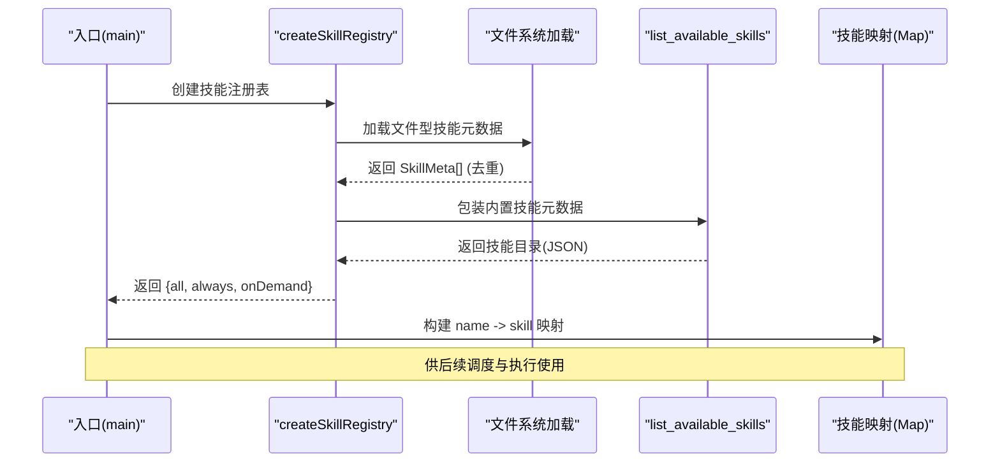
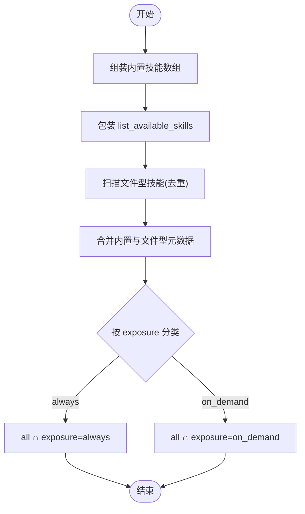
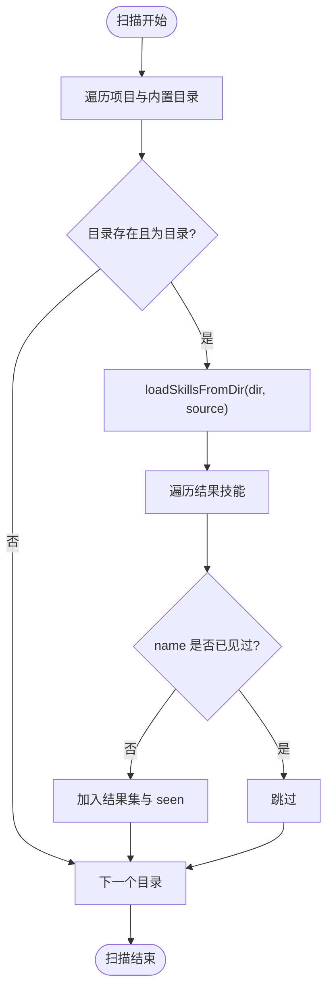
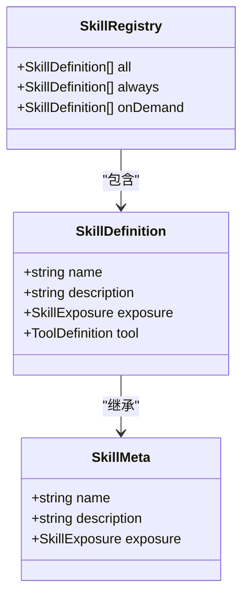
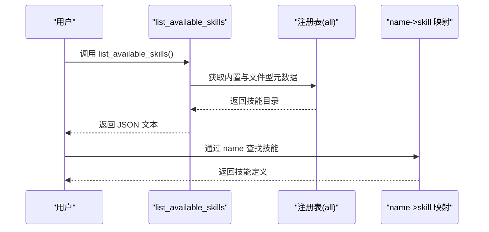
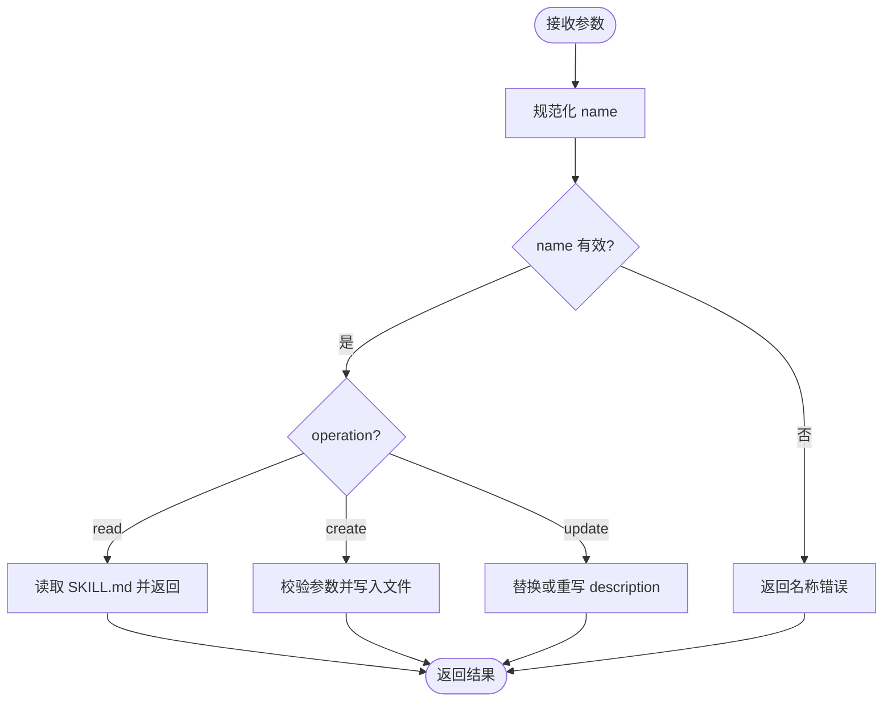
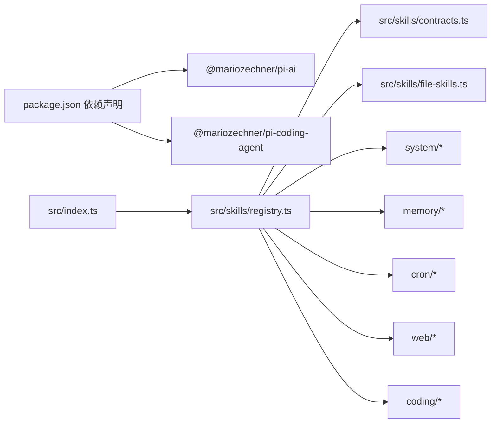

# 技能注册系统

<cite>
**本文引用的文件**
- [src/skills/registry.ts](file://src/skills/registry.ts)
- [src/skills/contracts.ts](file://src/skills/contracts.ts)
- [src/skills/file-skills.ts](file://src/skills/file-skills.ts)
- [src/skills/system/list_available_skills.ts](file://src/skills/system/list_available_skills.ts)
- [src/skills/system/skill_creator.ts](file://src/skills/system/skill_creator.ts)
- [src/skills/system/get_system_time.ts](file://src/skills/system/get_system_time.ts)
- [src/skills/memory/query_history.ts](file://src/skills/memory/query_history.ts)
- [src/skills/memory/update_profile.ts](file://src/skills/memory/update_profile.ts)
- [src/skills/cron/manage_cron_jobs.ts](file://src/skills/cron/manage_cron_jobs.ts)
- [src/skills/web/web_search.ts](file://src/skills/web/web_search.ts)
- [src/skills/web/get_weather.ts](file://src/skills/web/get_weather.ts)
- [src/skills/coding/claude_code.ts](file://src/skills/coding/claude_code.ts)
- [builtin-skills/web_reach/SKILL.md](file://builtin-skills/web_reach/SKILL.md)
- [src/index.ts](file://src/index.ts)
- [package.json](file://package.json)
</cite>

## 目录
1. [简介](#简介)
2. [项目结构](#项目结构)
3. [核心组件](#核心组件)
4. [架构总览](#架构总览)
5. [详细组件分析](#详细组件分析)
6. [依赖分析](#依赖分析)
7. [性能考虑](#性能考虑)
8. [故障排查指南](#故障排查指南)
9. [结论](#结论)
10. [附录](#附录)

## 简介
本文件系统性阐述“技能注册系统”的设计与实现，涵盖技能注册表的工作原理、技能暴露策略（always 与 on_demand）、数据结构与索引机制、查询优化、生命周期管理、最佳实践与典型用法。读者将了解如何注册新技能、查询技能信息、管理技能依赖关系，并掌握命名规范、冲突处理与版本管理策略。

## 项目结构
技能注册系统位于 src/skills 目录下，采用“按功能域分层 + 合约接口统一”的组织方式：
- contracts.ts：定义技能元数据与工具契约
- registry.ts：构建技能注册表，聚合内置与文件型技能
- system/：系统级技能（always 暴露）
- memory/：内存/历史相关技能（on_demand 暴露）
- cron/：定时任务管理技能（on_demand 暴露）
- web/：网络检索与天气技能（on_demand 暴露）
- coding/：本地 Claude Code 编程辅助技能（on_demand 暴露）
- file-skills.ts：从文件系统加载标准技能元数据（on_demand 暴露）

图表来源
- [src/skills/registry.ts:1-55](file://src/skills/registry.ts#L1-L55)
- [src/skills/contracts.ts:1-20](file://src/skills/contracts.ts#L1-L20)
- [src/skills/file-skills.ts:1-65](file://src/skills/file-skills.ts#L1-L65)
- [src/skills/system/get_system_time.ts:1-38](file://src/skills/system/get_system_time.ts#L1-L38)
- [src/skills/system/list_available_skills.ts:1-40](file://src/skills/system/list_available_skills.ts#L1-L40)
- [src/skills/system/skill_creator.ts:1-312](file://src/skills/system/skill_creator.ts#L1-L312)
- [src/skills/memory/query_history.ts:1-57](file://src/skills/memory/query_history.ts#L1-L57)
- [src/skills/memory/update_profile.ts:1-84](file://src/skills/memory/update_profile.ts#L1-L84)
- [src/skills/cron/manage_cron_jobs.ts:1-336](file://src/skills/cron/manage_cron_jobs.ts#L1-L336)
- [src/skills/web/web_search.ts:1-95](file://src/skills/web/web_search.ts#L1-L95)
- [src/skills/web/get_weather.ts:1-110](file://src/skills/web/get_weather.ts#L1-L110)
- [src/skills/coding/claude_code.ts:1-99](file://src/skills/coding/claude_code.ts#L1-L99)

章节来源
- [src/skills/registry.ts:1-55](file://src/skills/registry.ts#L1-L55)
- [src/skills/contracts.ts:1-20](file://src/skills/contracts.ts#L1-L20)
- [src/skills/file-skills.ts:1-65](file://src/skills/file-skills.ts#L1-L65)

## 核心组件
- 技能元数据与工具契约
  - SkillMeta：包含 name、description、exposure
  - SkillDefinition：扩展自 SkillMeta，附加 tool（工具定义）
  - SkillExposure：枚举值 "always" | "on_demand"

- 技能注册表
  - SkillRegistry：包含 all、always、onDemand 三类集合
  - createSkillRegistry：组装内置技能、动态加载文件型技能，按 exposure 进行分类

- 文件型技能加载
  - 从项目 skills 目录与内置 builtin-skills 两处扫描
  - 去重策略：同一 name 的技能仅保留首次出现者
  - 输出为 SkillMeta[]，统一 exposure 为 "on_demand"

- 列表技能
  - list_available_skills：提供技能目录与暴露级别，帮助用户按需选择

章节来源
- [src/skills/contracts.ts:4-19](file://src/skills/contracts.ts#L4-L19)
- [src/skills/registry.ts:13-54](file://src/skills/registry.ts#L13-L54)
- [src/skills/file-skills.ts:58-65](file://src/skills/file-skills.ts#L58-L65)
- [src/skills/system/list_available_skills.ts:4-39](file://src/skills/system/list_available_skills.ts#L4-L39)

## 架构总览
技能注册系统围绕“注册表 + 合约 + 文件加载”三大支柱构建：
- 注册表负责聚合与分类
- 合约定义统一的数据结构与执行接口
- 文件加载负责从磁盘动态发现技能，形成“内置 + 文件型”的技能池

图表来源
- [src/index.ts:122-124](file://src/index.ts#L122-L124)
- [src/skills/registry.ts:23-54](file://src/skills/registry.ts#L23-L54)
- [src/skills/file-skills.ts:26-48](file://src/skills/file-skills.ts#L26-L48)
- [src/skills/system/list_available_skills.ts:4-39](file://src/skills/system/list_available_skills.ts#L4-L39)

## 详细组件分析

### 组件A：技能注册表与暴露策略
- 注册流程
  - 组装内置技能数组
  - 包装 list_available_skills，使其可被 always 暴露
  - 合并文件型技能元数据（去重）
  - 按 exposure 分类：always 与 on_demand
- 查找机制
  - 使用 Map 以 name 为键进行 O(1) 查找
- 生命周期管理
  - 注册表在应用启动时一次性构建，运行期内只读
  - 文件型技能通过文件系统扫描，随文件变更而变化

图表来源
- [src/skills/registry.ts:23-54](file://src/skills/registry.ts#L23-L54)
- [src/skills/file-skills.ts:26-48](file://src/skills/file-skills.ts#L26-L48)

章节来源
- [src/skills/registry.ts:23-54](file://src/skills/registry.ts#L23-L54)
- [src/index.ts:122-124](file://src/index.ts#L122-L124)

### 组件B：文件型技能加载与去重
- 数据结构
  - 项目技能目录与内置技能目录并行扫描
  - 去重集合 seen：以 name 为键，避免重复
- 查询优化
  - 仅在注册表构建时扫描一次，后续复用
  - 返回 SkillMeta[]，统一 exposure 为 "on_demand"
- 依赖关系
  - 依赖 @mariozechner/pi-coding-agent 的工具函数进行目录扫描与格式化

图表来源
- [src/skills/file-skills.ts:26-48](file://src/skills/file-skills.ts#L26-L48)

章节来源
- [src/skills/file-skills.ts:1-65](file://src/skills/file-skills.ts#L1-L65)

### 组件C：技能暴露策略实现
- always 模式
  - 特点：始终可用，无需用户显式请求
  - 示例：get_system_time、list_available_skills
- on_demand 模式
  - 特点：按需调用，减少上下文负担
  - 示例：query_history、update_profile、manage_cron_jobs、web_search、get_weather、claude_code、skill_creator

图表来源
- [src/skills/contracts.ts:6-19](file://src/skills/contracts.ts#L6-L19)
- [src/skills/registry.ts:13-17](file://src/skills/registry.ts#L13-L17)

章节来源
- [src/skills/contracts.ts:4-19](file://src/skills/contracts.ts#L4-L19)
- [src/skills/system/get_system_time.ts:4-8](file://src/skills/system/get_system_time.ts#L4-L8)
- [src/skills/system/list_available_skills.ts:4-10](file://src/skills/system/list_available_skills.ts#L4-L10)
- [src/skills/memory/query_history.ts:6-9](file://src/skills/memory/query_history.ts#L6-L9)
- [src/skills/memory/update_profile.ts:10-14](file://src/skills/memory/update_profile.ts#L10-L14)
- [src/skills/cron/manage_cron_jobs.ts:32-38](file://src/skills/cron/manage_cron_jobs.ts#L32-L38)
- [src/skills/web/web_search.ts:16-20](file://src/skills/web/web_search.ts#L16-L20)
- [src/skills/web/get_weather.ts:30-34](file://src/skills/web/get_weather.ts#L30-L34)
- [src/skills/coding/claude_code.ts:8-13](file://src/skills/coding/claude_code.ts#L8-L13)
- [src/skills/system/skill_creator.ts:65-76](file://src/skills/system/skill_creator.ts#L65-L76)

### 组件D：技能目录与查询
- list_available_skills
  - 暴露 level：always
  - 输出：技能名称、描述、暴露级别
  - 提示：按 always → on_demand 的顺序使用
- 查询流程
  - 注册表构建后，入口将 all 转换为 Map，便于按 name 快速定位

图表来源
- [src/skills/system/list_available_skills.ts:4-39](file://src/skills/system/list_available_skills.ts#L4-L39)
- [src/skills/registry.ts:40-47](file://src/skills/registry.ts#L40-L47)
- [src/index.ts:122-124](file://src/index.ts#L122-L124)

章节来源
- [src/skills/system/list_available_skills.ts:1-40](file://src/skills/system/list_available_skills.ts#L1-L40)
- [src/index.ts:122-124](file://src/index.ts#L122-L124)

### 组件E：技能创建与管理（skill_creator）
- 功能
  - 读取、创建、更新 SKILL.md
  - 自动规范化技能名（仅允许小写字母、数字、连字符）
  - 生成标准模板与 YAML frontmatter
- 参数与行为
  - operation: read | create | update
  - name: 规范化后的技能名
  - description: 触发描述（主触发机制）
  - body/content: 内容体或完整文件内容
- 错误处理
  - 名称非法、文件不存在、重复创建、参数缺失等均返回明确错误信息

图表来源
- [src/skills/system/skill_creator.ts:127-310](file://src/skills/system/skill_creator.ts#L127-L310)

章节来源
- [src/skills/system/skill_creator.ts:1-312](file://src/skills/system/skill_creator.ts#L1-L312)

### 组件F：内置技能示例
- 系统时间：always 暴露，返回 ISO 与本地时间
- 历史查询：on_demand 暴露，支持按日期与 chatId 过滤
- 更新档案：on_demand 暴露，支持稳定事实、偏好、约束三类 section
- 定时任务：on_demand 暴露，支持 list/add/update/remove/set_enabled
- 网络搜索：on_demand 暴露，基于 Brave Search API
- 天气查询：on_demand 暴露，基于 wttr.in
- 编程助手：on_demand 暴露，调用本地 Claude Code CLI
- 内置 web_reach 技能：通过 bash 工具访问多平台资源

章节来源
- [src/skills/system/get_system_time.ts:4-37](file://src/skills/system/get_system_time.ts#L4-L37)
- [src/skills/memory/query_history.ts:5-56](file://src/skills/memory/query_history.ts#L5-L56)
- [src/skills/memory/update_profile.ts:10-83](file://src/skills/memory/update_profile.ts#L10-L83)
- [src/skills/cron/manage_cron_jobs.ts:32-335](file://src/skills/cron/manage_cron_jobs.ts#L32-L335)
- [src/skills/web/web_search.ts:16-94](file://src/skills/web/web_search.ts#L16-L94)
- [src/skills/web/get_weather.ts:30-109](file://src/skills/web/get_weather.ts#L30-L109)
- [src/skills/coding/claude_code.ts:8-98](file://src/skills/coding/claude_code.ts#L8-L98)
- [builtin-skills/web_reach/SKILL.md:1-122](file://builtin-skills/web_reach/SKILL.md#L1-L122)

## 依赖分析
- 外部依赖
  - @mariozechner/pi-ai：类型与工具定义
  - @mariozechner/pi-coding-agent：文件扫描与格式化工具
- 内部依赖
  - registry.ts 依赖各技能模块与 file-skills.ts
  - index.ts 依赖 registry.ts 与传输层，负责调度与执行

图表来源
- [package.json:30-37](file://package.json#L30-L37)
- [src/index.ts:8-10](file://src/index.ts#L8-L10)
- [src/skills/registry.ts:1-11](file://src/skills/registry.ts#L1-L11)

章节来源
- [package.json:30-37](file://package.json#L30-L37)
- [src/index.ts:8-10](file://src/index.ts#L8-L10)

## 性能考虑
- 注册阶段一次性构建
  - 注册表在启动时构建，后续仅做 Map 查找，避免重复扫描
- 文件型技能去重
  - 使用 Set 记录已见 name，O(1) 判重，降低重复加载成本
- 查询优化
  - Map 以 name 为键，查找复杂度 O(1)，满足高频调用需求
- I/O 与网络
  - on_demand 技能按需触发，减少不必要的外部请求与磁盘访问

## 故障排查指南
- BRAVE_SEARCH_API_KEY 未配置
  - 现象：web_search 返回错误提示
  - 处理：在环境变量中设置并重启
  - 参考：[src/skills/web/web_search.ts:34-46](file://src/skills/web/web_search.ts#L34-L46)
- claude CLI 未安装
  - 现象：claude_code 执行失败，提示未安装
  - 处理：安装 @anthropic-ai/claude-code 并确保可执行
  - 参考：[src/skills/coding/claude_code.ts:61-71](file://src/skills/coding/claude_code.ts#L61-L71)
- 技能名不合法或重复
  - 现象：skill_creator 返回名称错误或重复创建
  - 处理：使用规范化规则（小写字母、数字、连字符），确保唯一性
  - 参考：[src/skills/system/skill_creator.ts:10-17](file://src/skills/system/skill_creator.ts#L10-L17)
- 定时任务参数不完整
  - 现象：manage_cron_jobs 新增失败，提示必填项缺失
  - 处理：补齐 name、cronExpr、chatId；或提供 toolName/toolArgs 固定参数
  - 参考：[src/skills/cron/manage_cron_jobs.ts:152-188](file://src/skills/cron/manage_cron_jobs.ts#L152-L188)

章节来源
- [src/skills/web/web_search.ts:34-46](file://src/skills/web/web_search.ts#L34-L46)
- [src/skills/coding/claude_code.ts:61-71](file://src/skills/coding/claude_code.ts#L61-L71)
- [src/skills/system/skill_creator.ts:10-17](file://src/skills/system/skill_creator.ts#L10-L17)
- [src/skills/cron/manage_cron_jobs.ts:152-188](file://src/skills/cron/manage_cron_jobs.ts#L152-L188)

## 结论
技能注册系统通过“合约统一 + 注册表聚合 + 文件型动态加载”的架构，实现了灵活、可扩展、可按需披露的技能体系。always 与 on_demand 的暴露策略分别服务于高频与低频场景，配合 Map 快速查找与文件扫描去重，兼顾易用性与性能。遵循命名规范、冲突处理与版本管理策略，可进一步提升系统的稳定性与可维护性。

## 附录

### 最佳实践
- 命名规范
  - 仅使用小写字母、数字、连字符；与目录名一致
  - 参考：[src/skills/system/skill_creator.ts:10-17](file://src/skills/system/skill_creator.ts#L10-L17)
- 冲突处理
  - 文件型技能按 name 去重，优先保留首次出现者
  - 参考：[src/skills/file-skills.ts:39-44](file://src/skills/file-skills.ts#L39-L44)
- 版本管理
  - 通过目录层级与 SKILL.md 内容版本化，结合 Git 管理变更
  - 参考：[builtin-skills/web_reach/SKILL.md:1-122](file://builtin-skills/web_reach/SKILL.md#L1-L122)

### 实际用法示例（路径指引）
- 注册新技能
  - 使用 skill_creator 的 create 操作，提供 name 与 description
  - 参考：[src/skills/system/skill_creator.ts:184-241](file://src/skills/system/skill_creator.ts#L184-L241)
- 查询技能信息
  - 调用 list_available_skills，查看技能目录与暴露级别
  - 参考：[src/skills/system/list_available_skills.ts:4-39](file://src/skills/system/list_available_skills.ts#L4-L39)
- 管理技能依赖关系
  - 在 SKILL.md 中描述触发条件与调用场景，必要时通过 prompt 指定依赖技能
  - 参考：[builtin-skills/web_reach/SKILL.md:1-122](file://builtin-skills/web_reach/SKILL.md#L1-L122)