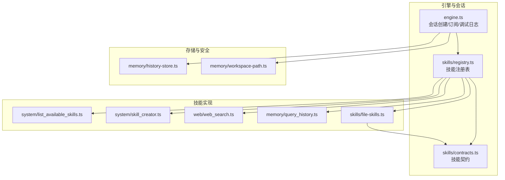
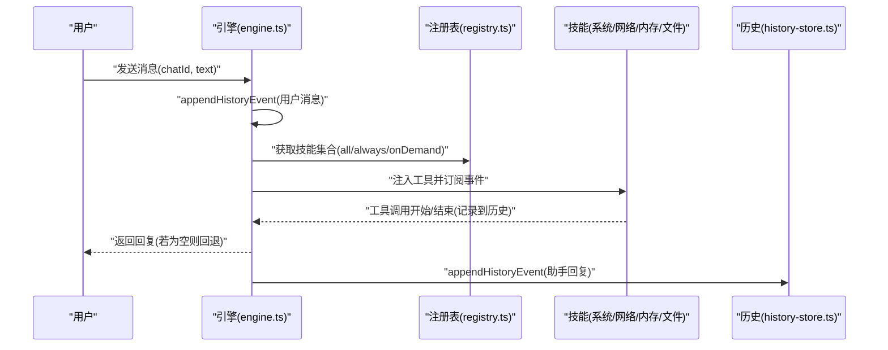
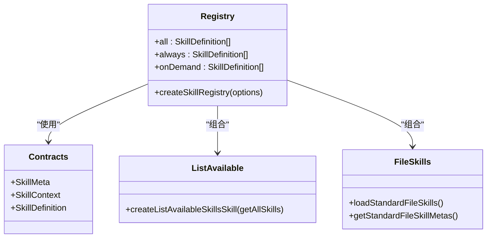
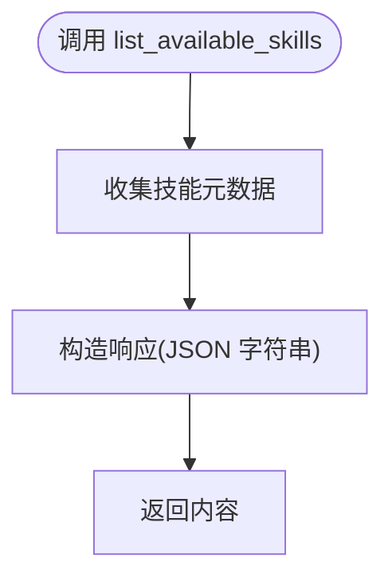
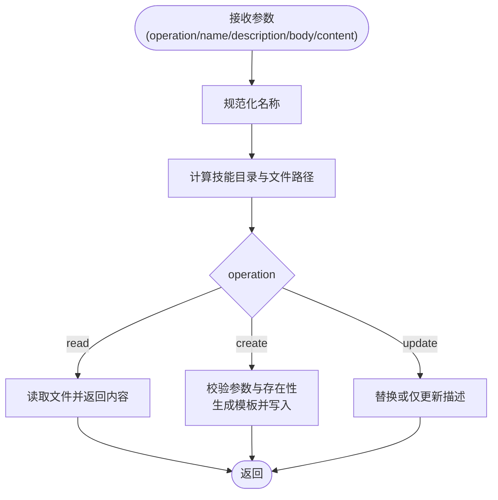
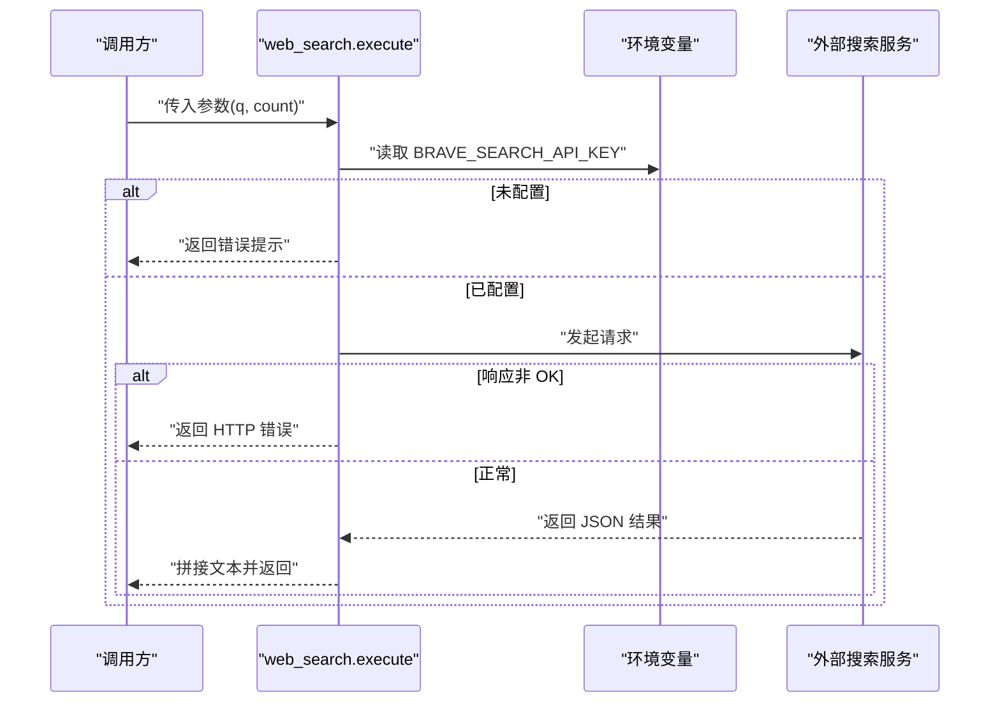
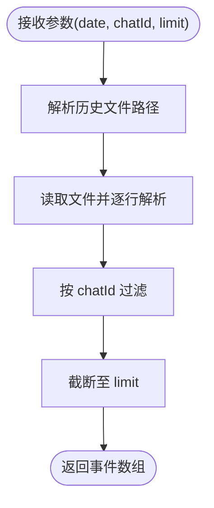
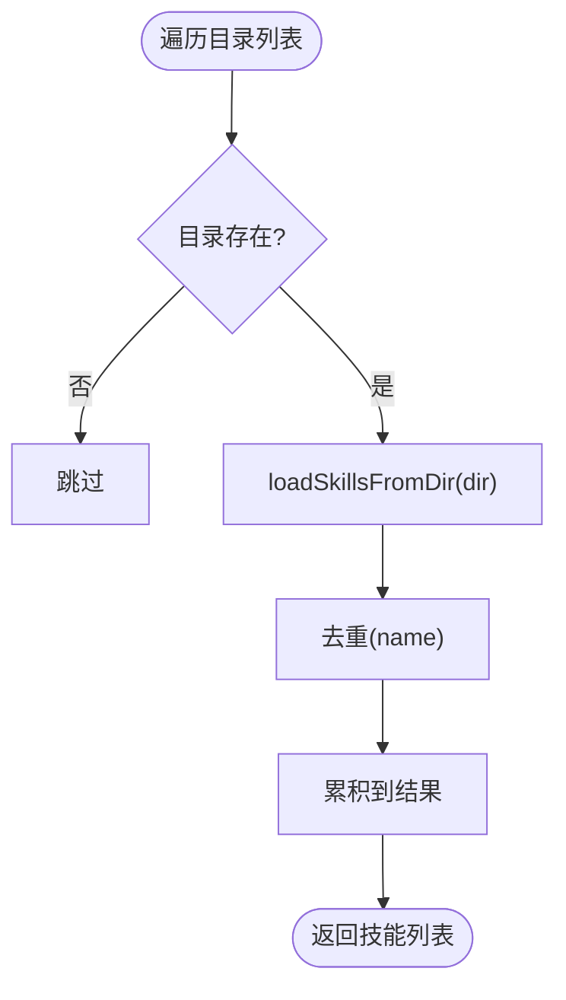
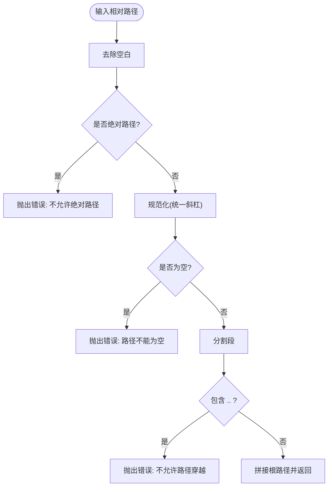
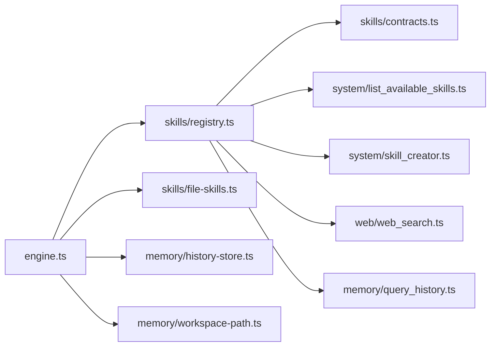

# 技能测试与调试

<cite>
**本文档引用的文件**
- [package.json](file://package.json)
- [src/engine.ts](file://src/engine.ts)
- [src/skills/registry.ts](file://src/skills/registry.ts)
- [src/skills/contracts.ts](file://src/skills/contracts.ts)
- [src/skills/system/list_available_skills.ts](file://src/skills/system/list_available_skills.ts)
- [src/skills/system/skill_creator.ts](file://src/skills/system/skill_creator.ts)
- [src/skills/web/web_search.ts](file://src/skills/web/web_search.ts)
- [src/skills/memory/query_history.ts](file://src/skills/memory/query_history.ts)
- [src/skills/file-skills.ts](file://src/skills/file-skills.ts)
- [src/memory/history-store.ts](file://src/memory/history-store.ts)
- [src/memory/workspace-path.ts](file://src/memory/workspace-path.ts)
- [src/cron/cron.test.ts](file://src/cron/cron.test.ts)
- [src/memory/workspace-path.test.ts](file://src/memory/workspace-path.test.ts)
</cite>

## 目录
1. [简介](#简介)
2. [项目结构](#项目结构)
3. [核心组件](#核心组件)
4. [架构总览](#架构总览)
5. [详细组件分析](#详细组件分析)
6. [依赖关系分析](#依赖关系分析)
7. [性能考量](#性能考量)
8. [故障排查指南](#故障排查指南)
9. [结论](#结论)
10. [附录](#附录)

## 简介
本指南面向技能开发与测试工程师，系统讲解如何在本项目中开展技能测试与调试工作。内容覆盖：
- 测试方法论：单元测试、集成测试与端到端测试策略
- 调试技术：日志记录、断点调试、性能分析
- 测试用例设计模式：参数边界、异常处理、并发场景
- 技能注册表测试：技能发现、加载与执行
- 可测试性实践：模拟依赖、测试数据准备、结果验证
- 常见问题与解决方案

## 项目结构
本项目采用“功能域+分层”的组织方式，核心与技能相关的关键模块如下：
- 引擎与会话管理：负责模型选择、会话创建、工具注入、历史记录与调试日志
- 技能注册表：集中构建内置技能与文件型技能，划分暴露级别
- 技能实现：系统类、内存类、网络类、文件类技能
- 存储与路径安全：历史事件存储、工作区路径解析与安全校验
- 测试：Node 内置测试框架驱动的单元测试

图表来源
- [src/engine.ts:1-706](file://src/engine.ts#L1-L706)
- [src/skills/registry.ts:1-55](file://src/skills/registry.ts#L1-L55)
- [src/skills/contracts.ts:1-20](file://src/skills/contracts.ts#L1-L20)
- [src/skills/system/list_available_skills.ts:1-40](file://src/skills/system/list_available_skills.ts#L1-L40)
- [src/skills/system/skill_creator.ts:1-312](file://src/skills/system/skill_creator.ts#L1-L312)
- [src/skills/web/web_search.ts:1-95](file://src/skills/web/web_search.ts#L1-L95)
- [src/skills/memory/query_history.ts:1-57](file://src/skills/memory/query_history.ts#L1-L57)
- [src/skills/file-skills.ts:1-65](file://src/skills/file-skills.ts#L1-L65)
- [src/memory/history-store.ts:1-83](file://src/memory/history-store.ts#L1-L83)
- [src/memory/workspace-path.ts:1-42](file://src/memory/workspace-path.ts#L1-L42)

章节来源
- [package.json:19](file://package.json#L19)
- [src/engine.ts:1-706](file://src/engine.ts#L1-L706)
- [src/skills/registry.ts:1-55](file://src/skills/registry.ts#L1-L55)
- [src/skills/contracts.ts:1-20](file://src/skills/contracts.ts#L1-L20)
- [src/skills/system/list_available_skills.ts:1-40](file://src/skills/system/list_available_skills.ts#L1-L40)
- [src/skills/system/skill_creator.ts:1-312](file://src/skills/system/skill_creator.ts#L1-L312)
- [src/skills/web/web_search.ts:1-95](file://src/skills/web/web_search.ts#L1-L95)
- [src/skills/memory/query_history.ts:1-57](file://src/skills/memory/query_history.ts#L1-L57)
- [src/skills/file-skills.ts:1-65](file://src/skills/file-skills.ts#L1-L65)
- [src/memory/history-store.ts:1-83](file://src/memory/history-store.ts#L1-L83)
- [src/memory/workspace-path.ts:1-42](file://src/memory/workspace-path.ts#L1-L42)

## 核心组件
- 技能契约与元数据：定义技能名称、描述、暴露级别与工具定义
- 技能注册表：聚合内置与文件型技能，按暴露级别分类
- 系统技能：列出可用技能、创建/读取/更新技能文件
- 网络技能：基于外部 API 的检索能力
- 内存技能：历史事件查询与写入
- 文件型技能：从标准目录加载技能元数据
- 存储与路径安全：历史文件落盘与工作区路径安全解析
- 引擎：会话生命周期、工具注入、调试日志、错误归一化

章节来源
- [src/skills/contracts.ts:1-20](file://src/skills/contracts.ts#L1-L20)
- [src/skills/registry.ts:1-55](file://src/skills/registry.ts#L1-L55)
- [src/skills/system/list_available_skills.ts:1-40](file://src/skills/system/list_available_skills.ts#L1-L40)
- [src/skills/system/skill_creator.ts:1-312](file://src/skills/system/skill_creator.ts#L1-L312)
- [src/skills/web/web_search.ts:1-95](file://src/skills/web/web_search.ts#L1-L95)
- [src/skills/memory/query_history.ts:1-57](file://src/skills/memory/query_history.ts#L1-L57)
- [src/skills/file-skills.ts:1-65](file://src/skills/file-skills.ts#L1-L65)
- [src/memory/history-store.ts:1-83](file://src/memory/history-store.ts#L1-L83)
- [src/memory/workspace-path.ts:1-42](file://src/memory/workspace-path.ts#L1-L42)
- [src/engine.ts:1-706](file://src/engine.ts#L1-L706)

## 架构总览
下图展示了从用户输入到技能执行与结果返回的端到端流程，以及调试日志与历史记录的贯穿。

图表来源
- [src/engine.ts:680-706](file://src/engine.ts#L680-L706)
- [src/skills/registry.ts:23-54](file://src/skills/registry.ts#L23-L54)
- [src/memory/history-store.ts:37-42](file://src/memory/history-store.ts#L37-L42)

章节来源
- [src/engine.ts:1-706](file://src/engine.ts#L1-L706)
- [src/skills/registry.ts:1-55](file://src/skills/registry.ts#L1-L55)
- [src/memory/history-store.ts:1-83](file://src/memory/history-store.ts#L1-L83)

## 详细组件分析

### 技能注册表与暴露级别
- 注册表负责组装内置技能与文件型技能，导出 all/always/onDemand 三类集合
- 暴露级别由技能元数据决定，用于控制是否默认可用与按需调用
- 列出可用技能技能作为 always 类别，便于用户了解技能目录与触发方式

图表来源
- [src/skills/registry.ts:13-54](file://src/skills/registry.ts#L13-L54)
- [src/skills/contracts.ts:6-19](file://src/skills/contracts.ts#L6-L19)
- [src/skills/system/list_available_skills.ts:4-38](file://src/skills/system/list_available_skills.ts#L4-L38)
- [src/skills/file-skills.ts:26-64](file://src/skills/file-skills.ts#L26-L64)

章节来源
- [src/skills/registry.ts:1-55](file://src/skills/registry.ts#L1-L55)
- [src/skills/contracts.ts:1-20](file://src/skills/contracts.ts#L1-L20)
- [src/skills/system/list_available_skills.ts:1-40](file://src/skills/system/list_available_skills.ts#L1-L40)
- [src/skills/file-skills.ts:1-65](file://src/skills/file-skills.ts#L1-L65)

### 系统技能：列出可用技能
- 功能：返回当前可用技能清单与使用指引
- 测试要点：清单完整性、暴露级别标注、返回内容格式

图表来源
- [src/skills/system/list_available_skills.ts:16-36](file://src/skills/system/list_available_skills.ts#L16-L36)

章节来源
- [src/skills/system/list_available_skills.ts:1-40](file://src/skills/system/list_available_skills.ts#L1-L40)

### 系统技能：技能创建器
- 功能：在工作区内创建/读取/更新 SKILL.md 文件，支持标准化模板与触发描述
- 关键行为：名称规范化、路径安全解析、文件存在性判断、内容替换/增量更新
- 测试要点：操作类型分支、参数校验、文件读写、错误消息

图表来源
- [src/skills/system/skill_creator.ts:127-308](file://src/skills/system/skill_creator.ts#L127-L308)

章节来源
- [src/skills/system/skill_creator.ts:1-312](file://src/skills/system/skill_creator.ts#L1-L312)

### 网络技能：网页搜索
- 功能：调用外部搜索 API 获取结果，返回标题、链接与摘要
- 关键行为：环境变量校验、请求构造、状态码与空结果处理
- 测试要点：API Key 缺失、HTTP 错误、空结果、参数边界(count)

图表来源
- [src/skills/web/web_search.ts:32-91](file://src/skills/web/web_search.ts#L32-L91)

章节来源
- [src/skills/web/web_search.ts:1-95](file://src/skills/web/web_search.ts#L1-L95)

### 内存技能：历史查询
- 功能：按日期/会话过滤查询历史事件，限制返回数量
- 关键行为：日期文件路径解析、文件读取与解析、过滤与截断
- 测试要点：日期格式、chatId 过滤、limit 边界、文件不存在

图表来源
- [src/skills/memory/query_history.ts:31-53](file://src/skills/memory/query_history.ts#L31-L53)
- [src/memory/history-store.ts:50-82](file://src/memory/history-store.ts#L50-L82)

章节来源
- [src/skills/memory/query_history.ts:1-57](file://src/skills/memory/query_history.ts#L1-L57)
- [src/memory/history-store.ts:1-83](file://src/memory/history-store.ts#L1-L83)

### 文件型技能：加载与去重
- 功能：从项目与内置目录加载技能，去重后汇总
- 关键行为：目录存在性检查、加载与去重、元数据透出
- 测试要点：目录存在性、重复名称过滤、元数据一致性

图表来源
- [src/skills/file-skills.ts:26-48](file://src/skills/file-skills.ts#L26-L48)

章节来源
- [src/skills/file-skills.ts:1-65](file://src/skills/file-skills.ts#L1-L65)

### 路径安全与工作区
- 功能：工作区根路径解析、相对路径规范化、拒绝路径穿越与绝对路径
- 关键行为：路径校验、根目录确保、工作区子目录初始化
- 测试要点：空路径、绝对路径、路径穿越、相对路径解析

图表来源
- [src/memory/workspace-path.ts:6-26](file://src/memory/workspace-path.ts#L6-L26)

章节来源
- [src/memory/workspace-path.ts:1-42](file://src/memory/workspace-path.ts#L1-L42)

## 依赖关系分析
- 引擎依赖注册表与文件型技能，注入工具并订阅会话事件
- 注册表依赖各技能工厂函数与文件型技能元数据
- 技能实现依赖合约类型与存储/路径模块
- 测试脚本通过 Node 测试入口运行所有 *.test.ts

图表来源
- [src/engine.ts:17-17](file://src/engine.ts#L17-L17)
- [src/skills/registry.ts:1-11](file://src/skills/registry.ts#L1-L11)
- [src/skills/contracts.ts:1-20](file://src/skills/contracts.ts#L1-L20)
- [src/skills/system/list_available_skills.ts:1-40](file://src/skills/system/list_available_skills.ts#L1-L40)
- [src/skills/system/skill_creator.ts:1-312](file://src/skills/system/skill_creator.ts#L1-L312)
- [src/skills/web/web_search.ts:1-95](file://src/skills/web/web_search.ts#L1-L95)
- [src/skills/memory/query_history.ts:1-57](file://src/skills/memory/query_history.ts#L1-L57)
- [src/skills/file-skills.ts:1-65](file://src/skills/file-skills.ts#L1-L65)
- [src/memory/history-store.ts:1-83](file://src/memory/history-store.ts#L1-L83)
- [src/memory/workspace-path.ts:1-42](file://src/memory/workspace-path.ts#L1-L42)

章节来源
- [package.json:19](file://package.json#L19)
- [src/engine.ts:1-706](file://src/engine.ts#L1-L706)
- [src/skills/registry.ts:1-55](file://src/skills/registry.ts#L1-L55)

## 性能考量
- 日志开销：调试开关开启时会产生额外 IO 与序列化成本，建议仅在定位问题时启用
- 工具注入规模：技能数量增加会增大提示词与工具描述体积，注意参数 Schema 的大小
- 外部 API：网络技能的延迟与限流会影响端到端响应时间，建议在测试中模拟网络层
- 文件 I/O：历史与技能文件读写集中在磁盘，建议批量写入与合理缓存

## 故障排查指南
- API Key 未配置或无效
  - 现象：模型调用失败或提示缺少密钥
  - 排查：检查环境变量映射、模型配置、回退提示
  - 参考
    - [src/engine.ts:162-186](file://src/engine.ts#L162-L186)
    - [src/engine.ts:453-455](file://src/engine.ts#L453-L455)
- 路径安全违规
  - 现象：抛出“不允许路径穿越”“不允许绝对路径”“路径不能为空”
  - 排查：检查输入路径是否相对、是否包含 .. 或以 / 开头
  - 参考
    - [src/memory/workspace-path.ts:6-26](file://src/memory/workspace-path.ts#L6-L26)
- 网络技能失败
  - 现象：返回 HTTP 错误或未配置 API Key
  - 排查：确认环境变量、请求 URL 与外部服务状态
  - 参考
    - [src/skills/web/web_search.ts:34-46](file://src/skills/web/web_search.ts#L34-L46)
    - [src/skills/web/web_search.ts:58-68](file://src/skills/web/web_search.ts#L58-L68)
- 历史文件读取异常
  - 现象：文件不存在返回空列表，其他错误向上抛出
  - 排查：确认历史目录存在、文件编码与格式
  - 参考
    - [src/memory/history-store.ts:72-82](file://src/memory/history-store.ts#L72-L82)

章节来源
- [src/engine.ts:1-706](file://src/engine.ts#L1-L706)
- [src/memory/workspace-path.ts:1-42](file://src/memory/workspace-path.ts#L1-L42)
- [src/skills/web/web_search.ts:1-95](file://src/skills/web/web_search.ts#L1-L95)
- [src/memory/history-store.ts:1-83](file://src/memory/history-store.ts#L1-L83)

## 结论
通过将测试覆盖到技能注册表、技能实现与引擎集成层面，并结合日志与路径安全机制，可以系统性提升技能的稳定性与可维护性。建议在开发流程中坚持“先单元后集成再端到端”的策略，配合模拟与断点调试，快速定位问题并完善测试用例。

## 附录

### 测试方法论与用例设计模式
- 单元测试
  - 针对纯函数与边界条件：如路径解析、参数校验、Schema 序列化
  - 使用断言验证返回值与错误消息
  - 示例参考
    - [src/cron/cron.test.ts:1-26](file://src/cron/cron.test.ts#L1-L26)
    - [src/memory/workspace-path.test.ts:1-29](file://src/memory/workspace-path.test.ts#L1-L29)
- 集成测试
  - 组合技能注册表与引擎，验证工具注入与事件订阅
  - 场景：always 与 on-demand 技能的可见性与执行
  - 参考
    - [src/skills/registry.ts:23-54](file://src/skills/registry.ts#L23-L54)
    - [src/engine.ts:442-459](file://src/engine.ts#L442-L459)
- 端到端测试
  - 模拟用户输入，验证历史记录、回复与错误处理
  - 参考
    - [src/engine.ts:680-706](file://src/engine.ts#L680-L706)
    - [src/memory/history-store.ts:37-42](file://src/memory/history-store.ts#L37-L42)

### 调试工具与技术
- 日志记录
  - 引擎提供调试开关与提示词/工具列表打印
  - 参考
    - [src/engine.ts:59-73](file://src/engine.ts#L59-L73)
    - [src/engine.ts:122-142](file://src/engine.ts#L122-L142)
- 断点调试
  - 在技能 execute 与引擎会话回调处设置断点
  - 参考
    - [src/skills/web/web_search.ts:32-91](file://src/skills/web/web_search.ts#L32-L91)
    - [src/engine.ts:511-590](file://src/engine.ts#L511-L590)
- 性能分析
  - 使用 Node 分析器对长会话与大量工具注入进行采样
  - 关注 I/O 与外部 API 调用耗时

### 技能注册表测试要点
- 技能发现
  - 验证内置与文件型技能均被加载
  - 参考
    - [src/skills/registry.ts:30-39](file://src/skills/registry.ts#L30-L39)
    - [src/skills/file-skills.ts:26-48](file://src/skills/file-skills.ts#L26-L48)
- 加载与去重
  - 相同名称技能仅保留一次
  - 参考
    - [src/skills/file-skills.ts:38-44](file://src/skills/file-skills.ts#L38-L44)
- 执行测试
  - always 技能应可直接调用
  - on-demand 技能应在暴露后可调用
  - 参考
    - [src/skills/system/list_available_skills.ts:16-36](file://src/skills/system/list_available_skills.ts#L16-L36)

### 可测试性实践
- 模拟依赖
  - 对外部 API 使用拦截或 Mock
  - 对文件系统使用临时目录与虚拟 FS
- 测试数据准备
  - 准备历史文件、技能文件与环境变量
- 结果验证
  - 验证返回内容格式、错误消息与副作用（历史写入）