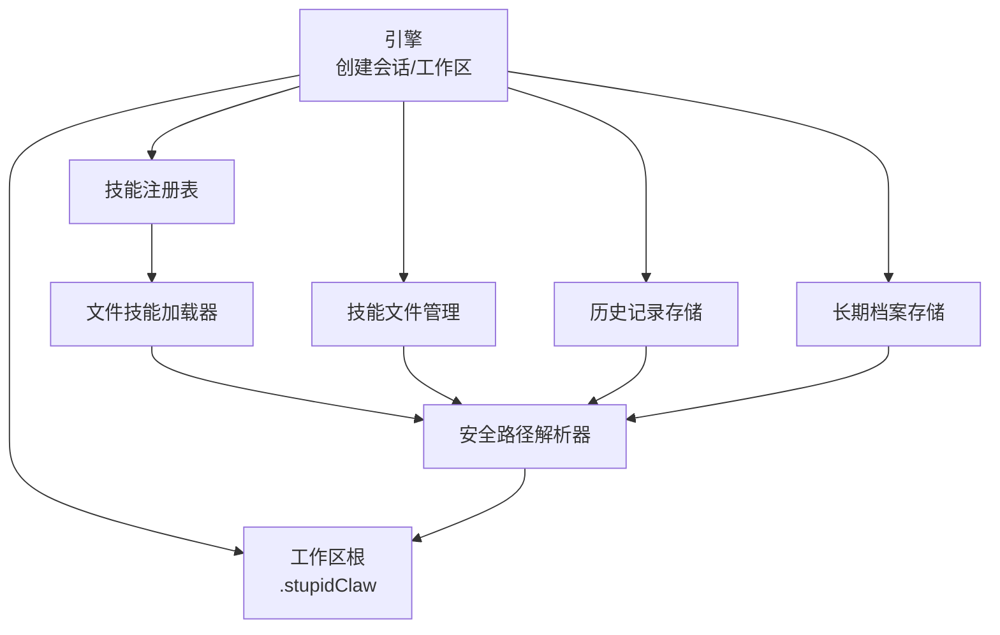
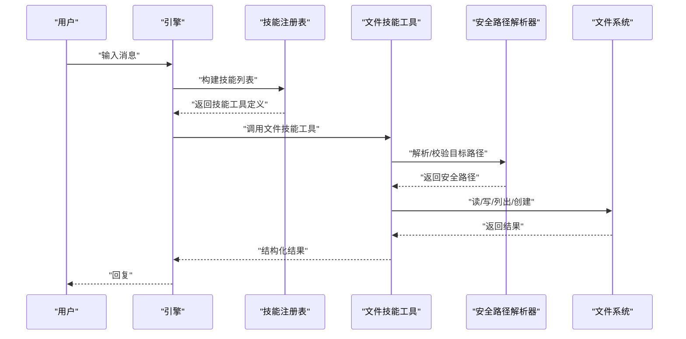
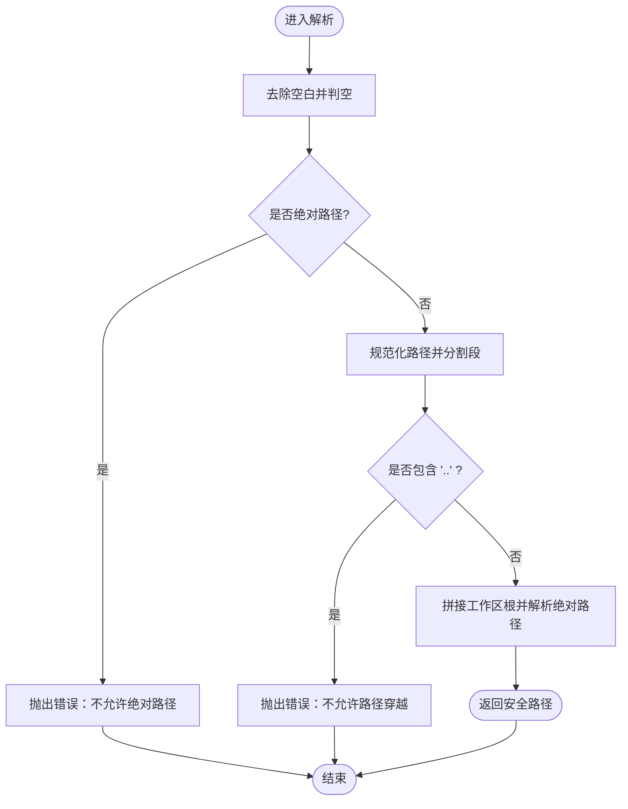
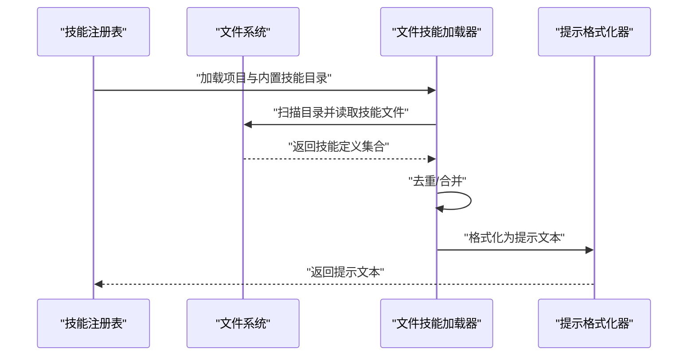
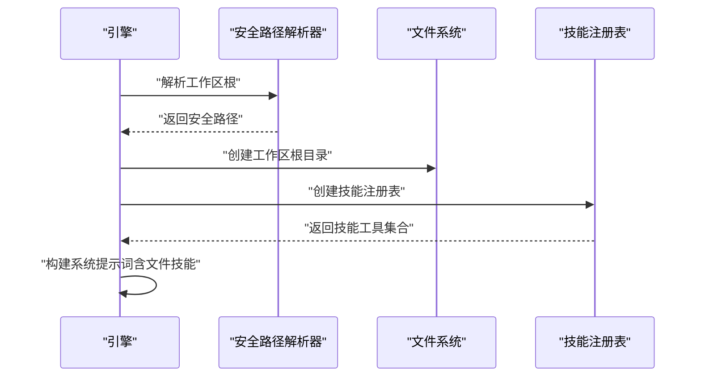
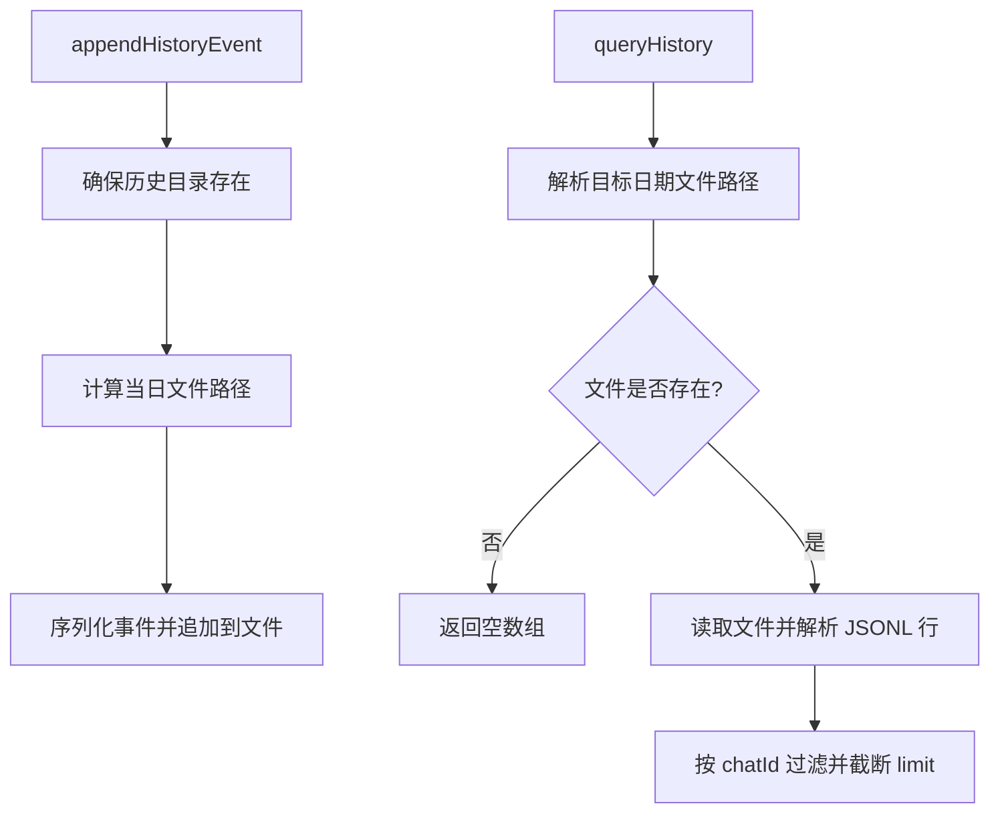
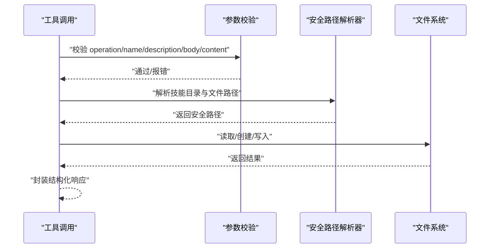
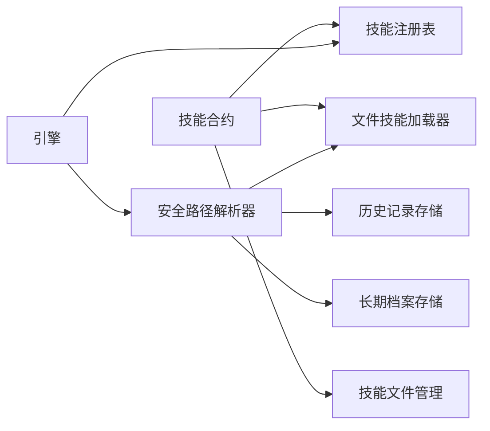

# 文件技能开发

<cite>
**本文引用的文件**
- [src/skills/file-skills.ts](file://src/skills/file-skills.ts)
- [src/memory/workspace-path.ts](file://src/memory/workspace-path.ts)
- [src/memory/workspace-path.test.ts](file://src/memory/workspace-path.test.ts)
- [src/skills/contracts.ts](file://src/skills/contracts.ts)
- [src/skills/registry.ts](file://src/skills/registry.ts)
- [src/engine.ts](file://src/engine.ts)
- [src/skills/system/skill_creator.ts](file://src/skills/system/skill_creator.ts)
- [src/memory/history-store.ts](file://src/memory/history-store.ts)
- [src/memory/profile-store.ts](file://src/memory/profile-store.ts)
- [StupidClaw-第5期-安全沙盒PathJailing防止越权读写.md](file://StupidClaw-第5期-安全沙盒PathJailing防止越权读写.md)
- [builtin-skills/web_reach/SKILL.md](file://builtin-skills/web_reach/SKILL.md)
</cite>

## 目录
1. [引言](#引言)
2. [项目结构](#项目结构)
3. [核心组件](#核心组件)
4. [架构总览](#架构总览)
5. [详细组件分析](#详细组件分析)
6. [依赖关系分析](#依赖关系分析)
7. [性能考量](#性能考量)
8. [故障排查指南](#故障排查指南)
9. [结论](#结论)
10. [附录](#附录)

## 引言
本指南面向希望在 StupidClaw 体系中开发“文件技能”的工程师与产品人员。文档聚焦于文件系统操作的安全性与沙盒限制，系统讲解路径管理、权限控制、访问日志与错误处理，并提供读写、目录操作、技能文件管理等常见文件技能的开发范式与最佳实践。

## 项目结构
围绕文件技能的关键模块与职责如下：
- 安全路径解析：统一的“安全路径解析器”，拒绝越权路径，确保所有落盘路径位于工作区根下。
- 文件技能注册：集中加载标准文件技能，注入到系统提示词中，供智能体按需调用。
- 会话与工作区：引擎初始化时创建工作区根目录，作为所有文件操作的沙盒边界。
- 历史与档案：历史记录与长期档案均通过安全路径解析器落盘，保证一致性与安全性。
- 技能文件管理：提供创建/读取/更新 SKILL.md 的能力，严格遵循安全路径与命名规范。

图表来源
- [src/engine.ts:37-421](file://src/engine.ts#L37-L421)
- [src/skills/file-skills.ts:26-48](file://src/skills/file-skills.ts#L26-L48)
- [src/memory/workspace-path.ts:32-35](file://src/memory/workspace-path.ts#L32-L35)
- [src/skills/system/skill_creator.ts:7-150](file://src/skills/system/skill_creator.ts#L7-L150)
- [src/memory/history-store.ts:20-42](file://src/memory/history-store.ts#L20-L42)
- [src/memory/profile-store.ts:18-110](file://src/memory/profile-store.ts#L18-L110)

章节来源
- [src/engine.ts:37-421](file://src/engine.ts#L37-L421)
- [src/skills/file-skills.ts:26-48](file://src/skills/file-skills.ts#L26-L48)
- [src/memory/workspace-path.ts:32-35](file://src/memory/workspace-path.ts#L32-L35)

## 核心组件
- 安全路径解析器
  - 提供工作区根路径与安全路径解析能力，拒绝空路径、绝对路径与路径穿越。
  - 统一约束所有文件落盘位置，避免越权访问。
- 文件技能加载器
  - 加载项目与内置技能目录中的技能文件，去重并格式化为系统提示词。
- 技能注册表
  - 聚合基础技能与标准文件技能元数据，区分“总是可用/按需触发”两类暴露方式。
- 会话与工作区
  - 初始化工作区根目录，注入工具与自定义技能，建立文件操作的沙盒边界。
- 历史与档案
  - 历史事件按日期落盘；长期档案以 Markdown 结构化存储，均通过安全路径解析器。
- 技能文件管理
  - 创建/读取/更新 SKILL.md，严格校验名称与参数，确保内容结构化与可审计。

章节来源
- [src/memory/workspace-path.ts:32-35](file://src/memory/workspace-path.ts#L32-L35)
- [src/skills/file-skills.ts:26-64](file://src/skills/file-skills.ts#L26-L64)
- [src/skills/registry.ts:23-54](file://src/skills/registry.ts#L23-L54)
- [src/engine.ts:37-421](file://src/engine.ts#L37-L421)
- [src/memory/history-store.ts:37-82](file://src/memory/history-store.ts#L37-L82)
- [src/memory/profile-store.ts:117-131](file://src/memory/profile-store.ts#L117-L131)
- [src/skills/system/skill_creator.ts:65-311](file://src/skills/system/skill_creator.ts#L65-L311)

## 架构总览
文件技能在系统中的调用链路如下：
- 用户输入经由引擎构建回合提示，注入标准文件技能描述。
- 智能体根据上下文选择调用相应文件技能工具。
- 工具执行时通过安全路径解析器进行路径校验与规范化，随后进行文件读写或目录操作。
- 历史事件与工具结果被记录，便于审计与排障。

图表来源
- [src/engine.ts:426-459](file://src/engine.ts#L426-L459)
- [src/skills/registry.ts:40-47](file://src/skills/registry.ts#L40-L47)
- [src/skills/file-skills.ts:50-56](file://src/skills/file-skills.ts#L50-L56)
- [src/memory/workspace-path.ts:32-35](file://src/memory/workspace-path.ts#L32-L35)

## 详细组件分析

### 安全路径解析器
- 设计要点
  - 仅接受相对路径，拒绝绝对路径与空路径。
  - 规范化路径后禁止出现“..”片段，确保不越权访问上级目录。
  - 最终路径固定落在工作区根目录之下，形成强约束的沙盒边界。
- 错误处理
  - 对非法路径抛出明确错误，便于上层工具捕获并反馈给智能体。
- 测试覆盖
  - 单元测试覆盖路径穿越、绝对路径、空路径等典型边界场景。

图表来源
- [src/memory/workspace-path.ts:6-26](file://src/memory/workspace-path.ts#L6-L26)

章节来源
- [src/memory/workspace-path.ts:6-26](file://src/memory/workspace-path.ts#L6-L26)
- [src/memory/workspace-path.test.ts:6-28](file://src/memory/workspace-path.test.ts#L6-L28)

### 文件技能加载与提示注入
- 加载策略
  - 从项目 skills 与内置 builtin-skills 两处目录加载技能，去重后合并。
  - 将技能描述格式化为系统提示词的一部分，供智能体识别与触发。
- 元数据暴露
  - 标准文件技能以“按需触发”方式暴露，避免过度披露。

图表来源
- [src/skills/file-skills.ts:26-56](file://src/skills/file-skills.ts#L26-L56)
- [src/skills/registry.ts:40-47](file://src/skills/registry.ts#L40-L47)

章节来源
- [src/skills/file-skills.ts:26-64](file://src/skills/file-skills.ts#L26-L64)
- [src/skills/registry.ts:23-54](file://src/skills/registry.ts#L23-L54)

### 会话与工作区初始化
- 工作区根
  - 会话创建时解析工作区根路径并确保目录存在，作为所有文件操作的沙盒边界。
- 工具与资源
  - 注入编码工具与自定义技能，构建系统提示词，开启流式回调记录工具调用。

图表来源
- [src/engine.ts:37-421](file://src/engine.ts#L37-L421)

章节来源
- [src/engine.ts:37-421](file://src/engine.ts#L37-L421)

### 历史记录与档案存储
- 历史记录
  - 按 UTC 日期拆分文件，逐行追加 JSONL 记录；查询时按日期与 chatId 过滤，限制返回条数。
- 长期档案
  - 以 Markdown 结构化存储三类 section，写入前解析安全路径，避免越权。

图表来源
- [src/memory/history-store.ts:37-82](file://src/memory/history-store.ts#L37-L82)
- [src/memory/profile-store.ts:117-131](file://src/memory/profile-store.ts#L117-L131)

章节来源
- [src/memory/history-store.ts:37-82](file://src/memory/history-store.ts#L37-L82)
- [src/memory/profile-store.ts:117-131](file://src/memory/profile-store.ts#L117-L131)

### 技能文件管理（创建/读取/更新）
- 命名规范
  - 技能名称仅允许小写字母、数字与连字符，首尾去空白并归一化。
- 目录布局
  - 每个技能独立子目录，主文件为 SKILL.md，必要时可在同级创建 references 子目录存放参考文档。
- 参数校验与错误处理
  - 读取：若文件不存在，返回明确提示；成功时返回结构化内容。
  - 创建：必需提供描述；若目标已存在，提示先读取再更新。
  - 更新：支持完整替换或仅更新触发描述，保留正文内容。
- 安全约束
  - 所有路径通过安全解析器，拒绝越权路径；创建前确保目录存在。

图表来源
- [src/skills/system/skill_creator.ts:127-308](file://src/skills/system/skill_creator.ts#L127-L308)
- [src/memory/workspace-path.ts:32-35](file://src/memory/workspace-path.ts#L32-L35)

章节来源
- [src/skills/system/skill_creator.ts:65-311](file://src/skills/system/skill_creator.ts#L65-L311)

### 文件技能开发范式与最佳实践
- 路径遍历防护
  - 一律使用安全路径解析器，拒绝绝对路径与“..”片段；对用户输入进行严格归一化。
- 文件大小限制
  - 在工具参数中引入“最大字节数”限制，读取前先 stat 获取大小并拒绝超限文件。
- 恶意文件检测
  - 基于扩展名白名单与 MIME 类型探测（如可用），对可疑文件进行拦截。
- 权限控制
  - 仅授予最小必要权限：读取只读、写入限定目录、不可跨目录访问。
- 访问日志记录
  - 使用历史记录模块记录工具调用与结果，便于审计与回溯。
- 参数验证与错误处理
  - 使用类型定义与参数校验库，对必填字段、范围与格式进行前置校验；捕获并转换底层错误，提供可理解的提示信息。

章节来源
- [StupidClaw-第5期-安全沙盒PathJailing防止越权读写.md:26-31](file://StupidClaw-第5期-安全沙盒PathJailing防止越权读写.md#L26-L31)
- [src/skills/system/skill_creator.ts:127-308](file://src/skills/system/skill_creator.ts#L127-L308)
- [src/memory/history-store.ts:37-82](file://src/memory/history-store.ts#L37-L82)

## 依赖关系分析
- 组件耦合
  - 文件技能加载器依赖安全路径解析器与技能合约；技能注册表聚合多种技能并暴露元数据。
  - 引擎负责工作区初始化与工具注入，历史与档案模块均依赖安全路径解析器。
- 外部依赖
  - 使用统一的工具定义与类型系统，确保参数 schema 与执行流程一致。
- 潜在循环依赖
  - 当前模块间为单向依赖，无明显循环；若未来扩展更多文件技能，仍需保持对安全路径解析器的单向依赖。

图表来源
- [src/skills/contracts.ts:1-20](file://src/skills/contracts.ts#L1-L20)
- [src/skills/file-skills.ts:1-10](file://src/skills/file-skills.ts#L1-L10)
- [src/skills/registry.ts:1-11](file://src/skills/registry.ts#L1-L11)
- [src/skills/system/skill_creator.ts:1-6](file://src/skills/system/skill_creator.ts#L1-L6)
- [src/memory/workspace-path.ts:1-4](file://src/memory/workspace-path.ts#L1-L4)
- [src/memory/history-store.ts:1-3](file://src/memory/history-store.ts#L1-L3)
- [src/memory/profile-store.ts:1-2](file://src/memory/profile-store.ts#L1-L2)
- [src/engine.ts:1-17](file://src/engine.ts#L1-L17)

章节来源
- [src/skills/contracts.ts:1-20](file://src/skills/contracts.ts#L1-L20)
- [src/skills/file-skills.ts:1-10](file://src/skills/file-skills.ts#L1-L10)
- [src/skills/registry.ts:1-11](file://src/skills/registry.ts#L1-L11)
- [src/skills/system/skill_creator.ts:1-6](file://src/skills/system/skill_creator.ts#L1-L6)
- [src/memory/workspace-path.ts:1-4](file://src/memory/workspace-path.ts#L1-L4)
- [src/memory/history-store.ts:1-3](file://src/memory/history-store.ts#L1-L3)
- [src/memory/profile-store.ts:1-2](file://src/memory/profile-store.ts#L1-L2)
- [src/engine.ts:1-17](file://src/engine.ts#L1-L17)

## 性能考量
- I/O 批量化
  - 对多行 JSONL 的读取与解析采用流式处理，避免一次性加载大文件。
- 缓存与去重
  - 文件技能加载时进行去重，减少重复扫描与重复提示注入。
- 路径解析成本
  - 安全路径解析为常数时间操作，开销极低；建议在工具入口统一执行一次。
- 日志与审计
  - 历史记录采用追加写，避免频繁随机写；按日期切分文件，降低单文件过大风险。

## 故障排查指南
- 路径相关错误
  - 现象：调用失败并提示“路径为空/不允许绝对路径/路径穿越”。
  - 排查：确认输入路径为相对路径，不含“..”与空白；检查工作区根是否正确解析。
- 文件不存在
  - 现象：读取技能或历史文件时报错。
  - 排查：确认目标文件是否存在；检查日期与目录结构；查看工作区根是否正确。
- 权限不足
  - 现象：写入失败。
  - 排查：确认工作区根目录权限；检查安全路径解析器是否拒绝了目标路径。
- 工具参数错误
  - 现象：创建/更新技能时报错。
  - 排查：核对 operation、name、description、content 等参数；遵循命名规范与必填项。

章节来源
- [src/memory/workspace-path.test.ts:14-28](file://src/memory/workspace-path.test.ts#L14-L28)
- [src/skills/system/skill_creator.ts:136-147](file://src/skills/system/skill_creator.ts#L136-L147)
- [src/memory/history-store.ts:72-81](file://src/memory/history-store.ts#L72-L81)

## 结论
通过统一的安全路径解析器与严格的文件落盘约束，StupidClaw 将文件技能的开发与使用置于可控的沙盒环境中。结合参数校验、访问日志与错误处理的最佳实践，开发者可以快速构建安全、可靠且可审计的文件操作技能，满足日常读写、目录管理与技能文件治理等需求。

## 附录
- 示例参考
  - 技能文件模板与结构参考：[builtin-skills/web_reach/SKILL.md:1-122](file://builtin-skills/web_reach/SKILL.md#L1-L122)
- 相关设计文档
  - 安全沙盒设计与验收清单：[StupidClaw-第5期-安全沙盒PathJailing防止越权读写.md:105-111](file://StupidClaw-第5期-安全沙盒PathJailing防止越权读写.md#L105-L111)