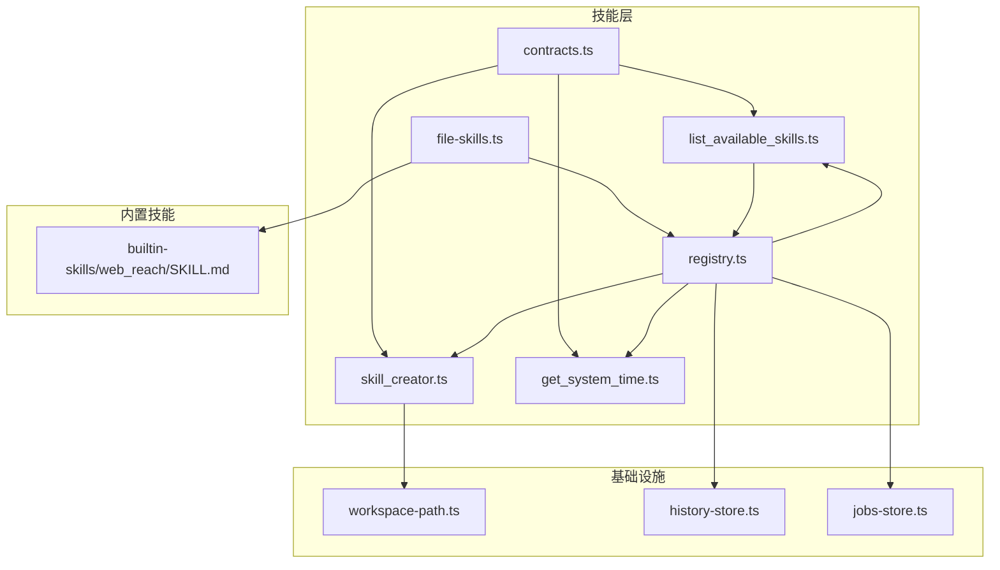
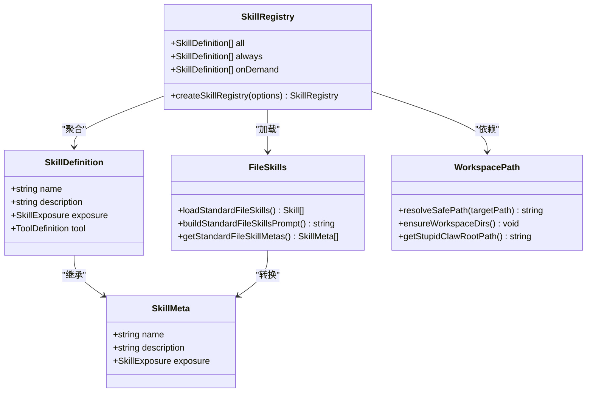
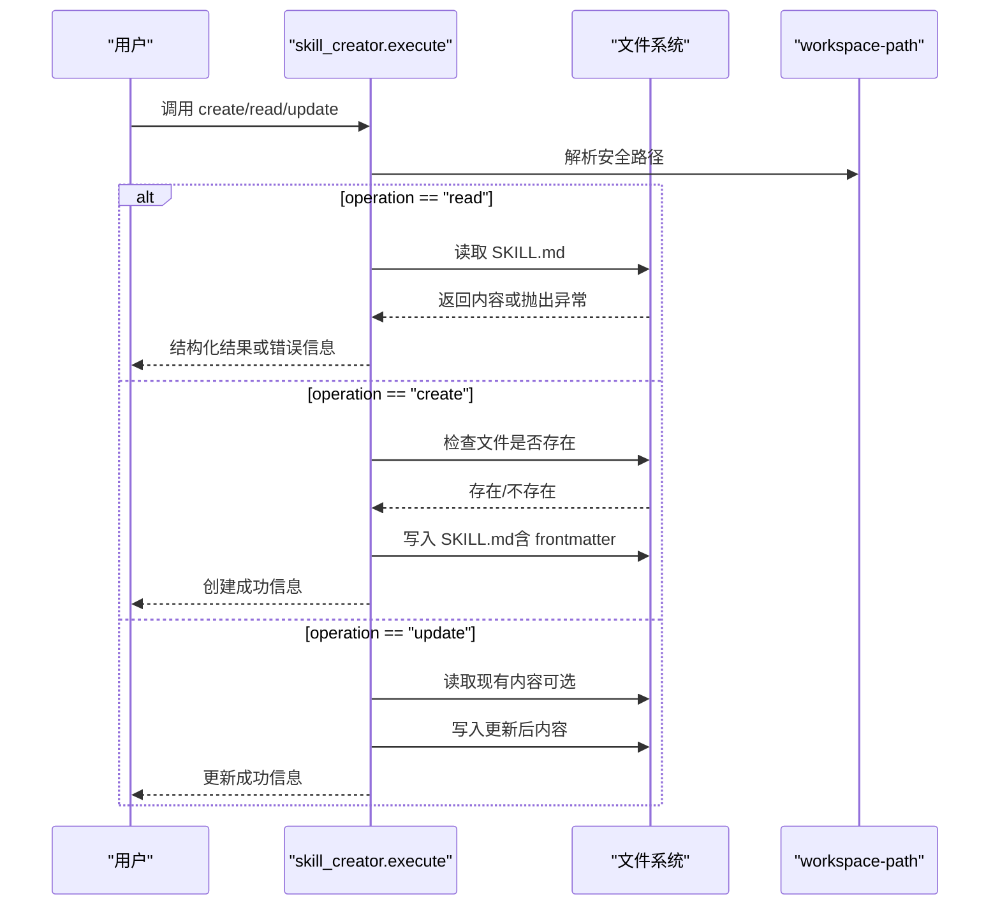
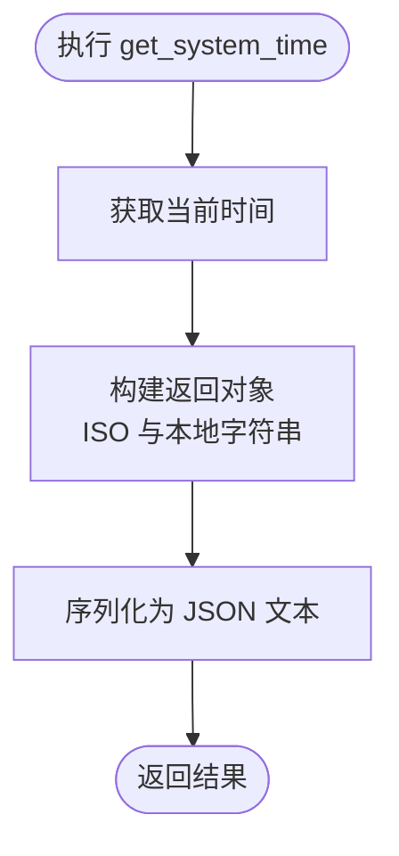
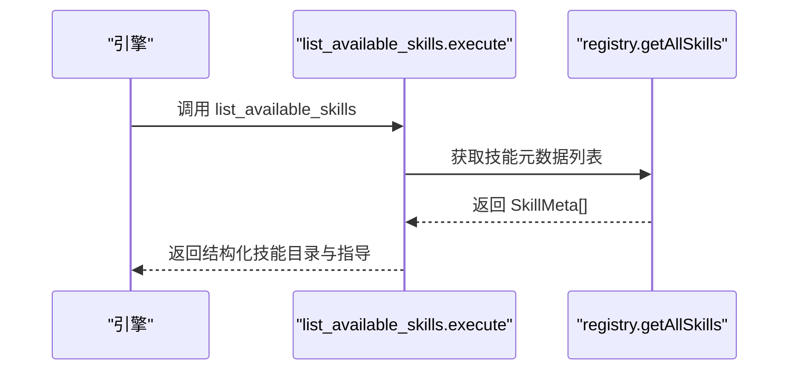
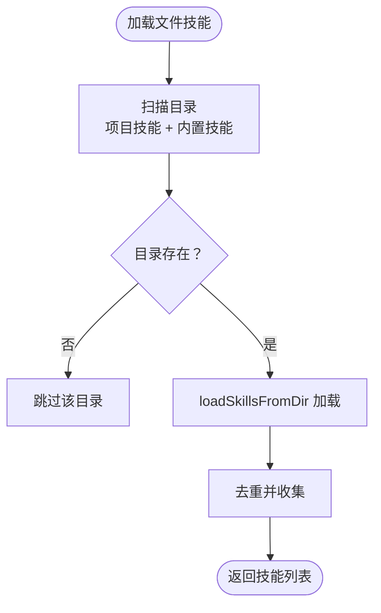
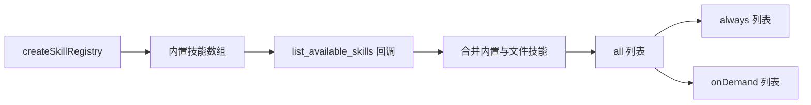
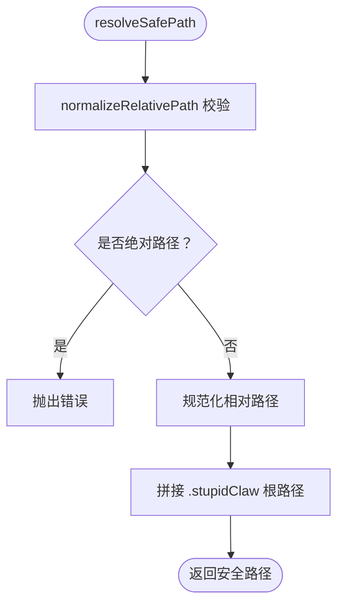
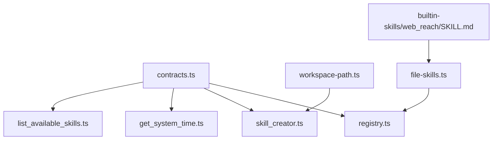

# 系统技能开发

<cite>
**本文档引用的文件**
- [src/skills/system/skill_creator.ts](file://src/skills/system/skill_creator.ts)
- [src/skills/system/get_system_time.ts](file://src/skills/system/get_system_time.ts)
- [src/skills/system/list_available_skills.ts](file://src/skills/system/list_available_skills.ts)
- [src/skills/contracts.ts](file://src/skills/contracts.ts)
- [src/skills/registry.ts](file://src/skills/registry.ts)
- [src/skills/file-skills.ts](file://src/skills/file-skills.ts)
- [src/memory/workspace-path.ts](file://src/memory/workspace-path.ts)
- [builtin-skills/web_reach/SKILL.md](file://builtin-skills/web_reach/SKILL.md)
- [src/cron/jobs-store.ts](file://src/cron/jobs-store.ts)
- [src/memory/history-store.ts](file://src/memory/history-store.ts)
- [README.md](file://README.md)
</cite>

## 目录
1. [简介](#简介)
2. [项目结构](#项目结构)
3. [核心组件](#核心组件)
4. [架构总览](#架构总览)
5. [详细组件分析](#详细组件分析)
6. [依赖关系分析](#依赖关系分析)
7. [性能考虑](#性能考虑)
8. [故障排除指南](#故障排除指南)
9. [结论](#结论)
10. [附录](#附录)

## 简介
本文件面向系统技能开发者，系统性阐述 StupidClaw 中“系统技能”的设计理念与实现模式，重点涵盖：
- 系统工具的封装与抽象：统一的技能接口、暴露级别控制、参数校验与执行流程
- 技能创建器（skill_creator）：动态技能生成、模板使用、参数注入与文件系统安全
- 通用接口设计：时间获取、技能列表查询等系统级能力
- 最佳实践：错误处理、日志记录、性能优化与安全约束
- 实战示例：配置管理、环境检测、系统信息获取与持久化

## 项目结构
系统技能位于 src/skills/system 目录，配合通用契约、注册中心与文件技能加载机制共同构成技能体系。关键目录与文件如下：
- 系统技能：get_system_time.ts、list_available_skills.ts、skill_creator.ts
- 技能契约：contracts.ts（定义 SkillDefinition、SkillMeta、暴露级别）
- 注册中心：registry.ts（聚合内置技能与文件技能，按暴露级别分类）
- 文件技能：file-skills.ts（扫描 .stupidClaw/skills 与 builtin-skills，构建 on-demand 技能目录）
- 工作区路径：workspace-path.ts（.stupidClaw 根路径解析与安全路径校验）
- 内置示例：builtin-skills/web_reach/SKILL.md（标准技能文档模板）

图表来源
- [src/skills/system/skill_creator.ts:1-312](file://src/skills/system/skill_creator.ts#L1-L312)
- [src/skills/system/get_system_time.ts:1-38](file://src/skills/system/get_system_time.ts#L1-L38)
- [src/skills/system/list_available_skills.ts:1-40](file://src/skills/system/list_available_skills.ts#L1-L40)
- [src/skills/registry.ts:1-55](file://src/skills/registry.ts#L1-L55)
- [src/skills/file-skills.ts:1-65](file://src/skills/file-skills.ts#L1-L65)
- [src/memory/workspace-path.ts:1-42](file://src/memory/workspace-path.ts#L1-L42)
- [builtin-skills/web_reach/SKILL.md:1-122](file://builtin-skills/web_reach/SKILL.md#L1-L122)

章节来源
- [README.md:22-52](file://README.md#L22-L52)

## 核心组件
- 技能契约（contracts.ts）：定义 SkillDefinition、SkillMeta 与暴露级别（always/on_demand），统一技能元数据与工具定义接口
- 注册中心（registry.ts）：聚合内置系统技能与文件技能，按暴露级别分类，提供统一查询入口
- 文件技能加载（file-skills.ts）：扫描项目技能目录与内置技能目录，去重并构建 on-demand 技能清单
- 工作区路径（workspace-path.ts）：提供安全路径解析与目录确保，保障文件操作在沙盒内进行

章节来源
- [src/skills/contracts.ts:1-20](file://src/skills/contracts.ts#L1-L20)
- [src/skills/registry.ts:1-55](file://src/skills/registry.ts#L1-L55)
- [src/skills/file-skills.ts:1-65](file://src/skills/file-skills.ts#L1-L65)
- [src/memory/workspace-path.ts:1-42](file://src/memory/workspace-path.ts#L1-L42)

## 架构总览
系统技能采用“契约 + 注册中心 + 文件技能加载”的分层架构：
- 契约层：标准化技能元数据与工具定义，保证不同技能的一致性
- 注册中心：集中管理技能集合，区分 always 与 on_demand，便于引擎按需调度
- 文件技能层：从文件系统加载技能文档，动态扩展技能目录
- 基础设施层：工作区路径、历史记录、定时任务等支撑能力

图表来源
- [src/skills/contracts.ts:1-20](file://src/skills/contracts.ts#L1-L20)
- [src/skills/registry.ts:1-55](file://src/skills/registry.ts#L1-L55)
- [src/skills/file-skills.ts:1-65](file://src/skills/file-skills.ts#L1-L65)
- [src/memory/workspace-path.ts:1-42](file://src/memory/workspace-path.ts#L1-L42)

## 详细组件分析

### 技能创建器（skill_creator）
功能概述
- 动态技能生成：根据用户输入创建 SKILL.md 文档，支持标准化模板与自定义 body
- 模板使用：内置模板包含 Steps、Examples、Notes 等结构化字段
- 参数注入：通过 description 描述触发条件，body 支持引用 references/ 子目录
- 文件系统安全：使用安全路径解析，限制在 .stupidClaw/skills 目录内

实现要点
- 名称规范化：只允许小写字母、数字、连字符，去除多余连字符与首尾连字符
- Markdown 构建：frontmatter 包含 name 与 description，body 为标准模板或自定义内容
- 操作类型：
  - read：读取现有 SKILL.md 内容
  - create：新建技能，若已存在则报错
  - update：全量替换或仅更新 description，保留原有 body
- 错误处理：参数校验、文件存在性检查、异常捕获与结构化返回

图表来源
- [src/skills/system/skill_creator.ts:127-308](file://src/skills/system/skill_creator.ts#L127-L308)
- [src/memory/workspace-path.ts:32-35](file://src/memory/workspace-path.ts#L32-L35)

章节来源
- [src/skills/system/skill_creator.ts:1-312](file://src/skills/system/skill_creator.ts#L1-L312)
- [src/memory/workspace-path.ts:1-42](file://src/memory/workspace-path.ts#L1-L42)

### 时间获取技能（get_system_time）
功能概述
- 提供当前系统时间（ISO 与本地字符串），用于时间戳记录与日志对齐
- 暴露级别为 always，确保随时可用

实现要点
- 使用 Type.Object 定义空参数
- 执行时构造包含 ISO 与本地时间的对象，序列化为 JSON 文本返回

图表来源
- [src/skills/system/get_system_time.ts:14-34](file://src/skills/system/get_system_time.ts#L14-L34)

章节来源
- [src/skills/system/get_system_time.ts:1-38](file://src/skills/system/get_system_time.ts#L1-L38)

### 技能列表查询（list_available_skills）
功能概述
- 列出所有可按需调用的技能目录与用途，区分 always 与 on_demand
- 提供使用指导：优先使用 always 技能，必要时调用 on_demand 技能

实现要点
- 依赖 getAllSkills 回调，返回 SkillMeta 数组
- 输出包含技能名称、暴露级别与描述，并给出使用建议

图表来源
- [src/skills/system/list_available_skills.ts:4-37](file://src/skills/system/list_available_skills.ts#L4-L37)
- [src/skills/registry.ts:40-47](file://src/skills/registry.ts#L40-L47)

章节来源
- [src/skills/system/list_available_skills.ts:1-40](file://src/skills/system/list_available_skills.ts#L1-L40)
- [src/skills/registry.ts:1-55](file://src/skills/registry.ts#L1-L55)

### 文件技能加载（file-skills）
功能概述
- 扫描项目技能目录与内置技能目录，去重后构建 on-demand 技能清单
- 支持将技能内容格式化为提示文本，供引擎注入上下文

实现要点
- 项目技能目录与内置技能目录分别处理，避免重复
- 使用 loadSkillsFromDir 加载，formatSkillsForPrompt 格式化输出
- getStandardFileSkillMetas 返回固定暴露级别为 on_demand 的元数据

图表来源
- [src/skills/file-skills.ts:26-48](file://src/skills/file-skills.ts#L26-L48)

章节来源
- [src/skills/file-skills.ts:1-65](file://src/skills/file-skills.ts#L1-L65)

### 注册中心（registry）
功能概述
- 聚合内置系统技能与文件技能，按暴露级别分类
- 提供 getAllSkills 回调，供 list_available_skills 查询

实现要点
- 内置技能：系统时间、技能创建器、内存查询/更新、文件技能、网络搜索、天气、代码生成、定时任务管理
- 分类逻辑：always 与 on_demand 两套列表，便于引擎按需调度
- 统一入口：createSkillRegistry 返回 { all, always, onDemand }

图表来源
- [src/skills/registry.ts:23-54](file://src/skills/registry.ts#L23-L54)

章节来源
- [src/skills/registry.ts:1-55](file://src/skills/registry.ts#L1-L55)

### 工作区路径（workspace-path）
功能概述
- 解析 .stupidClaw 根路径，提供安全路径解析与目录确保
- 防止绝对路径与路径穿越（..），确保文件操作在沙盒内

实现要点
- normalizeRelativePath：校验相对路径、禁止绝对路径与 ..，规范化为安全路径
- resolveSafePath：结合 .stupidClaw 根路径与相对路径，得到最终安全路径
- ensureWorkspaceDirs：确保 workspace、history、skills 目录存在

图表来源
- [src/memory/workspace-path.ts:6-26](file://src/memory/workspace-path.ts#L6-L26)
- [src/memory/workspace-path.ts:32-35](file://src/memory/workspace-path.ts#L32-L35)

章节来源
- [src/memory/workspace-path.ts:1-42](file://src/memory/workspace-path.ts#L1-L42)

### 内置技能示例（web_reach）
功能概述
- 展示标准技能文档模板：frontmatter + 结构化正文
- 提供多平台联网工具使用指南与注意事项

实现要点
- frontmatter 包含 name 与 description（多行 YAML > 块标量）
- 正文包含 Steps、Examples、Notes 等结构化字段
- 作为参考模板，指导开发者编写 SKILL.md

章节来源
- [builtin-skills/web_reach/SKILL.md:1-122](file://builtin-skills/web_reach/SKILL.md#L1-L122)

## 依赖关系分析
- 技能契约与注册中心耦合度低，通过 SkillDefinition 接口解耦
- 文件技能加载依赖工作区路径，确保扫描范围在沙盒内
- 技能创建器依赖工作区路径与文件系统，负责安全地写入 SKILL.md
- 注册中心聚合多种技能来源，形成统一的技能目录

图表来源
- [src/skills/contracts.ts:1-20](file://src/skills/contracts.ts#L1-L20)
- [src/skills/registry.ts:1-55](file://src/skills/registry.ts#L1-L55)
- [src/skills/system/skill_creator.ts:1-7](file://src/skills/system/skill_creator.ts#L1-L7)
- [src/skills/file-skills.ts:1-9](file://src/skills/file-skills.ts#L1-L9)
- [builtin-skills/web_reach/SKILL.md:1-7](file://builtin-skills/web_reach/SKILL.md#L1-L7)

章节来源
- [src/skills/registry.ts:1-55](file://src/skills/registry.ts#L1-L55)
- [src/skills/file-skills.ts:1-65](file://src/skills/file-skills.ts#L1-L65)

## 性能考虑
- 文件扫描与去重：文件技能加载时对多个目录进行扫描并去重，建议合理组织技能目录，避免过多层级
- JSON 序列化：系统时间与技能列表返回均采用 JSON 序列化，注意大对象的序列化开销
- I/O 操作：技能创建器与文件技能加载涉及文件读写，建议批量操作与缓存策略减少频繁 I/O
- 安全路径解析：每次文件操作前进行路径校验，避免路径穿越带来的额外开销

## 故障排除指南
- 路径错误
  - 现象：创建技能时报错“路径非法”或“不允许绝对路径”
  - 处理：检查传入的技能名称与路径是否为相对路径，避免包含 .. 或绝对路径
  - 参考：workspace-path.ts 的路径校验逻辑
- 文件不存在
  - 现象：read 操作返回“技能不存在”
  - 处理：确认 SKILL.md 是否存在于 .stupidClaw/skills/<name>/ 目录
  - 参考：skill_creator.ts 的 read 分支
- 权限不足
  - 现象：写入失败或无法创建目录
  - 处理：确保 .stupidClaw 目录具有写权限，使用 ensureWorkspaceDirs 确保目录存在
  - 参考：workspace-path.ts 的 ensureWorkspaceDirs
- 历史记录读取异常
  - 现象：查询历史记录时报错
  - 处理：检查历史文件是否存在，注意 ENOENT 异常的处理
  - 参考：history-store.ts 的查询逻辑
- 定时任务配置错误
  - 现象：定时任务无法解析或执行
  - 处理：检查 cron_jobs.json 的格式与字段完整性，遵循 CronJob 接口规范
  - 参考：jobs-store.ts 的任务解析与校验

章节来源
- [src/memory/workspace-path.ts:1-42](file://src/memory/workspace-path.ts#L1-L42)
- [src/skills/system/skill_creator.ts:153-181](file://src/skills/system/skill_creator.ts#L153-L181)
- [src/memory/history-store.ts:72-82](file://src/memory/history-store.ts#L72-L82)
- [src/cron/jobs-store.ts:29-113](file://src/cron/jobs-store.ts#L29-L113)

## 结论
系统技能通过统一的契约与注册中心实现了高度模块化的扩展能力，结合文件技能加载与安全路径解析，既保证了灵活性又确保了安全性。技能创建器提供了强大的动态生成能力，配合标准化模板与参数注入，能够快速构建高质量的系统级技能。建议在开发过程中遵循本文最佳实践，注重错误处理、日志记录与性能优化，持续完善技能生态。

## 附录

### 最佳实践清单
- 错误处理
  - 对外部 I/O 操作进行 try/catch 包裹，返回结构化错误信息
  - 对用户输入进行参数校验与路径安全检查
- 日志记录
  - 在关键节点输出结构化日志，便于调试与审计
  - 使用统一的日志格式，包含时间戳、技能名称与操作类型
- 性能优化
  - 缓存文件技能加载结果，避免重复扫描
  - 批量处理文件写入，减少磁盘 I/O
  - 控制 JSON 序列化大小，避免超大对象频繁序列化
- 安全约束
  - 严格使用安全路径解析，禁止绝对路径与路径穿越
  - 限制技能目录范围，确保所有文件操作在 .stupidClaw 沙盒内
- 配置管理
  - 使用环境变量管理敏感配置，避免硬编码
  - 提供初始化向导，简化首次配置流程
- 环境检测
  - 在执行前检测所需工具与依赖是否存在
  - 对不可用的工具提供替代方案或明确提示
- 系统信息获取
  - 使用 get_system_time 获取一致的时间戳，便于历史记录与日志对齐
  - 通过 list_available_skills 提供清晰的技能目录与使用指导

### 实战示例（路径指引）
- 开发一个系统级技能
  - 参考：[src/skills/system/get_system_time.ts:1-38](file://src/skills/system/get_system_time.ts#L1-L38)
  - 关键点：使用 SkillDefinition 接口，定义空参数，返回结构化 JSON
- 创建动态技能
  - 参考：[src/skills/system/skill_creator.ts:127-308](file://src/skills/system/skill_creator.ts#L127-L308)
  - 关键点：名称规范化、frontmatter 构建、文件写入与错误处理
- 查询技能目录
  - 参考：[src/skills/system/list_available_skills.ts:4-37](file://src/skills/system/list_available_skills.ts#L4-L37)
  - 关键点：getAllSkills 回调、暴露级别分类、使用指导输出
- 加载文件技能
  - 参考：[src/skills/file-skills.ts:26-48](file://src/skills/file-skills.ts#L26-L48)
  - 关键点：目录扫描、去重、格式化提示文本
- 安全路径解析
  - 参考：[src/memory/workspace-path.ts:32-35](file://src/memory/workspace-path.ts#L32-L35)
  - 关键点：相对路径校验、规范化、拼接根路径