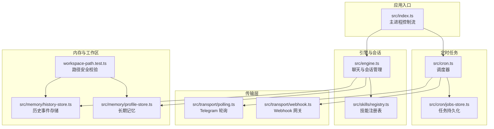
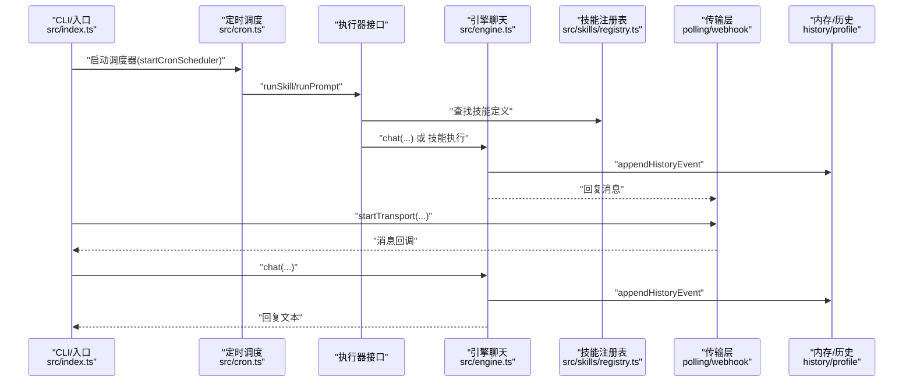
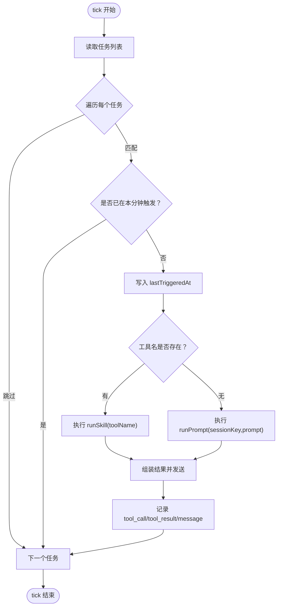
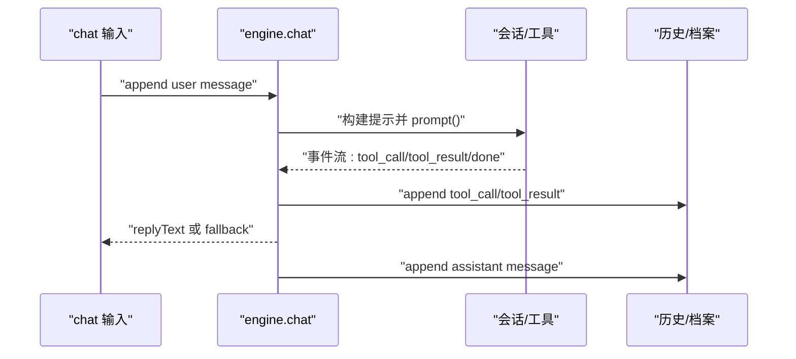
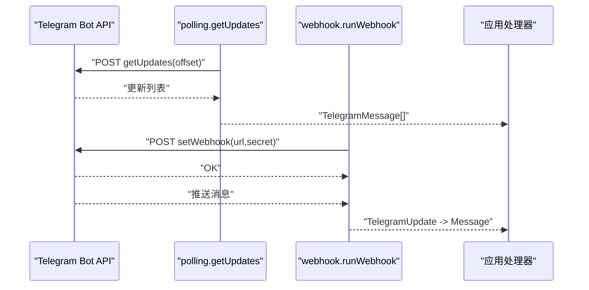
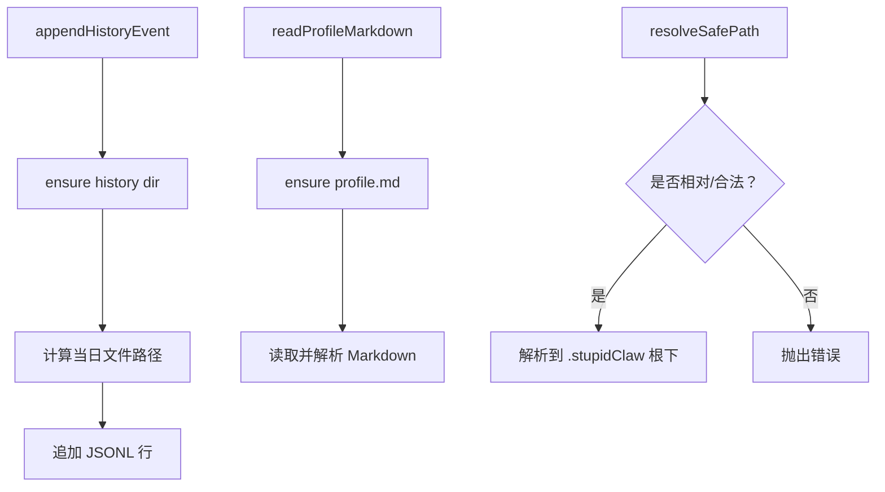
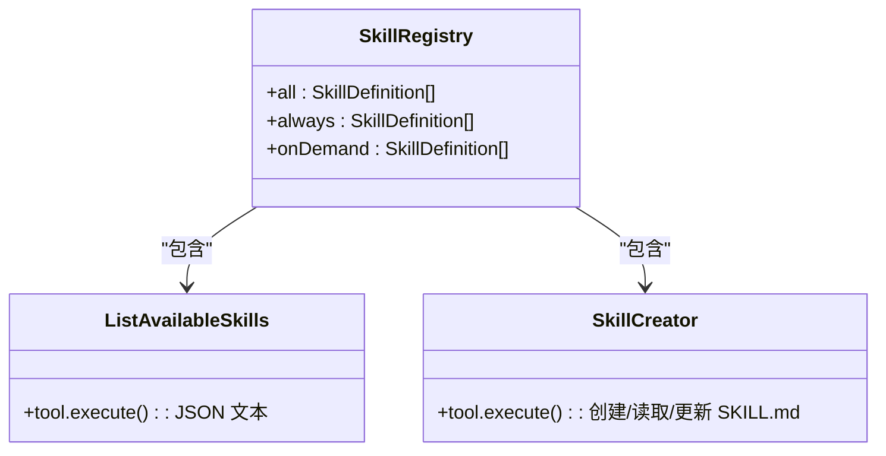
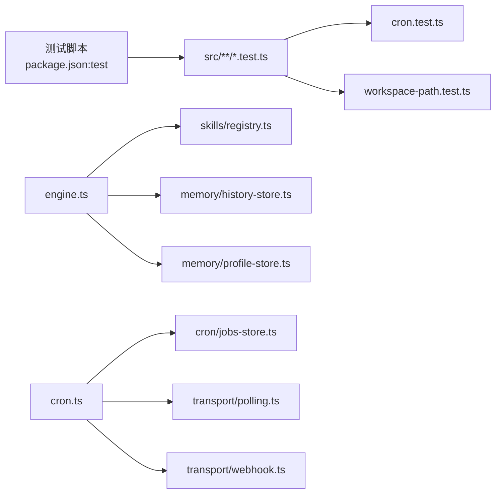

# 测试与调试

<cite>
**本文引用的文件**
- [package.json](file://package.json)
- [tsconfig.json](file://tsconfig.json)
- [src/index.ts](file://src/index.ts)
- [src/engine.ts](file://src/engine.ts)
- [src/cron.ts](file://src/cron.ts)
- [src/cron/jobs-store.ts](file://src/cron/jobs-store.ts)
- [src/memory/history-store.ts](file://src/memory/history-store.ts)
- [src/memory/profile-store.ts](file://src/memory/profile-store.ts)
- [src/memory/workspace-path.test.ts](file://src/memory/workspace-path.test.ts)
- [src/cron/cron.test.ts](file://src/cron/cron.test.ts)
- [src/skills/registry.ts](file://src/skills/registry.ts)
- [src/skills/system/list_available_skills.ts](file://src/skills/system/list_available_skills.ts)
- [src/skills/system/skill_creator.ts](file://src/skills/system/skill_creator.ts)
- [src/transport/polling.ts](file://src/transport/polling.ts)
- [src/transport/webhook.ts](file://src/transport/webhook.ts)
</cite>

## 目录
1. [简介](#简介)
2. [项目结构](#项目结构)
3. [核心组件](#核心组件)
4. [架构总览](#架构总览)
5. [详细组件分析](#详细组件分析)
6. [依赖分析](#依赖分析)
7. [性能考虑](#性能考虑)
8. [故障排查指南](#故障排查指南)
9. [结论](#结论)
10. [附录](#附录)

## 简介
本指南面向 StupidClaw 的开发者与维护者，系统性地阐述测试与调试方法论，覆盖单元测试编写、集成测试策略、覆盖率要求、调试技巧（日志、断点、性能分析）、测试环境搭建、模拟数据准备、自动化测试流程，以及安全测试、边界条件测试、并发测试等专业主题。文档以仓库现有实现为依据，结合可操作的实践建议，帮助团队建立稳健的质量保障体系。

## 项目结构
StupidClaw 采用模块化组织方式，核心功能围绕“引擎聊天”“定时任务”“传输层（轮询/Webhook）”“内存与工作区”“技能注册表”展开。测试集中在 cron 表达式匹配、工作区路径安全解析等关键模块，并通过 package.json 的测试脚本统一入口。

图示来源
- [src/index.ts:112-216](file://src/index.ts#L112-L216)
- [src/engine.ts:392-475](file://src/engine.ts#L392-L475)
- [src/cron.ts:251-265](file://src/cron.ts#L251-L265)
- [src/cron/jobs-store.ts:124-142](file://src/cron/jobs-store.ts#L124-L142)
- [src/transport/polling.ts:52-89](file://src/transport/polling.ts#L52-L89)
- [src/transport/webhook.ts:41-85](file://src/transport/webhook.ts#L41-L85)
- [src/memory/history-store.ts:37-42](file://src/memory/history-store.ts#L37-L42)
- [src/memory/profile-store.ts:112-131](file://src/memory/profile-store.ts#L112-L131)
- [src/memory/workspace-path.test.ts:1-29](file://src/memory/workspace-path.test.ts#L1-L29)

章节来源
- [package.json:14-22](file://package.json#L14-L22)
- [tsconfig.json:1-19](file://tsconfig.json#L1-L19)

## 核心组件
- 引擎与会话管理：负责模型选择、会话创建、提示构建、工具调用与历史记录追加。
- 定时任务：基于 cron 表达式触发技能或 prompt，支持去重与历史事件记录。
- 传输层：轮询模式拉取消息并回复，Webhook 模式设置回调并转发消息。
- 内存与工作区：历史事件按日期写入 JSONL，长期记忆以 Markdown 维护，路径解析严格限制。
- 技能注册表：集中管理内置与扩展技能，区分 always/on-demand 暴露级别。

章节来源
- [src/engine.ts:392-475](file://src/engine.ts#L392-L475)
- [src/cron.ts:171-249](file://src/cron.ts#L171-L249)
- [src/transport/polling.ts:52-89](file://src/transport/polling.ts#L52-L89)
- [src/transport/webhook.ts:41-85](file://src/transport/webhook.ts#L41-L85)
- [src/memory/history-store.ts:37-42](file://src/memory/history-store.ts#L37-L42)
- [src/memory/profile-store.ts:112-131](file://src/memory/profile-store.ts#L112-L131)
- [src/skills/registry.ts:23-54](file://src/skills/registry.ts#L23-L54)

## 架构总览
下图展示从入口到引擎、定时任务与传输层的关键交互，以及内存与技能模块的协作关系。

图示来源
- [src/index.ts:112-216](file://src/index.ts#L112-L216)
- [src/cron.ts:171-249](file://src/cron.ts#L171-L249)
- [src/engine.ts:680-705](file://src/engine.ts#L680-L705)
- [src/skills/registry.ts:23-54](file://src/skills/registry.ts#L23-L54)
- [src/transport/polling.ts:52-89](file://src/transport/polling.ts#L52-L89)
- [src/transport/webhook.ts:41-85](file://src/transport/webhook.ts#L41-L85)
- [src/memory/history-store.ts:37-42](file://src/memory/history-store.ts#L37-L42)

## 详细组件分析

### 组件 A：定时任务与任务持久化
- 功能要点
  - cron 表达式解析与匹配，支持步进、范围、列表组合。
  - 任务去重：按分钟粒度避免重复触发。
  - 执行器接口抽象：runSkill 与 runPrompt 两通道。
  - 历史事件记录：工具调用、结果与最终消息。
- 关键测试
  - cron 表达式命中/未命中用例。
  - 非法表达式与越界值处理。
- 并发与稳定性
  - 每次 tick 先写入 lastTriggeredAt，降低跨 tick 的重复风险。
  - 错误捕获后仍写入失败历史并通知。

图示来源
- [src/cron.ts:171-249](file://src/cron.ts#L171-L249)
- [src/cron/jobs-store.ts:124-142](file://src/cron/jobs-store.ts#L124-L142)

章节来源
- [src/cron.ts:1-265](file://src/cron.ts#L1-L265)
- [src/cron/jobs-store.ts:1-151](file://src/cron/jobs-store.ts#L1-L151)
- [src/cron/cron.test.ts:1-26](file://src/cron/cron.test.ts#L1-L26)

### 组件 B：引擎与会话管理
- 功能要点
  - 模型选择：支持多 Provider 与自定义 OpenAI/Anthropic 兼容接口。
  - 会话创建：注入工具集（含技能与文件技能），订阅事件流。
  - 提示构建：拼接运行时上下文、长期记忆与用户消息。
  - 历史记录：事件写入与错误兜底。
- 调试开关
  - DEBUG_STUPIDCLAW 与 DEBUG_PROMPT 控制引擎与提示日志。
- 边界与错误
  - API Key 缺失/无效的归一化提示。
  - 多种 Provider 的环境变量映射与回退策略。

图示来源
- [src/engine.ts:680-705](file://src/engine.ts#L680-L705)
- [src/engine.ts:511-607](file://src/engine.ts#L511-L607)
- [src/memory/history-store.ts:37-42](file://src/memory/history-store.ts#L37-L42)

章节来源
- [src/engine.ts:1-706](file://src/engine.ts#L1-L706)

### 组件 C：传输层（轮询与 Webhook）
- 功能要点
  - 轮询：getUpdates 拉取消息，禁用 webhook 以避免冲突；消息分片与 HTML 渲染。
  - Webhook：setWebhook 注册回调，网关接收消息并转交处理器。
- 关键测试
  - 轮询消息解析与长度切片。
  - Webhook 必备环境变量校验。

图示来源
- [src/transport/polling.ts:52-89](file://src/transport/polling.ts#L52-L89)
- [src/transport/webhook.ts:41-85](file://src/transport/webhook.ts#L41-L85)

章节来源
- [src/transport/polling.ts:1-243](file://src/transport/polling.ts#L1-L243)
- [src/transport/webhook.ts:1-86](file://src/transport/webhook.ts#L1-L86)

### 组件 D：内存与工作区
- 功能要点
  - 历史事件：按 UTC 日切分 JSONL 文件，支持查询与限制条数。
  - 长期记忆：profile.md 分节维护稳定事实、偏好与约束。
  - 路径安全：严格限制相对路径、拒绝绝对路径与路径穿越。
- 关键测试
  - 路径安全解析与异常抛出。

图示来源
- [src/memory/history-store.ts:37-82](file://src/memory/history-store.ts#L37-L82)
- [src/memory/profile-store.ts:112-131](file://src/memory/profile-store.ts#L112-L131)
- [src/memory/workspace-path.test.ts:1-29](file://src/memory/workspace-path.test.ts#L1-L29)

章节来源
- [src/memory/history-store.ts:1-83](file://src/memory/history-store.ts#L1-L83)
- [src/memory/profile-store.ts:1-132](file://src/memory/profile-store.ts#L1-L132)
- [src/memory/workspace-path.test.ts:1-29](file://src/memory/workspace-path.test.ts#L1-L29)

### 组件 E：技能注册表与系统技能
- 功能要点
  - 注册内置技能：系统时间、历史查询、档案更新、技能创建、Web 搜索、天气、代码生成等。
  - 暴露级别：always（始终可用）、on-demand（按需调用）。
  - 列表技能：动态列举技能元信息与使用指引。
- 关键测试
  - 注册表聚合与暴露分类。

图示来源
- [src/skills/registry.ts:23-54](file://src/skills/registry.ts#L23-L54)
- [src/skills/system/list_available_skills.ts:4-39](file://src/skills/system/list_available_skills.ts#L4-L39)
- [src/skills/system/skill_creator.ts:65-311](file://src/skills/system/skill_creator.ts#L65-L311)

章节来源
- [src/skills/registry.ts:1-55](file://src/skills/registry.ts#L1-L55)
- [src/skills/system/list_available_skills.ts:1-40](file://src/skills/system/list_available_skills.ts#L1-L40)
- [src/skills/system/skill_creator.ts:1-312](file://src/skills/system/skill_creator.ts#L1-L312)

## 依赖分析
- 测试入口与编译配置
  - 测试脚本通过 tsx 导入执行 src/**/*.test.ts。
  - TypeScript 输出目录 dist，声明文件与 source map 开启。
- 组件耦合
  - 引擎依赖技能注册表与文件技能，同时与历史/档案模块交互。
  - 定时任务依赖任务持久化与传输层发送能力。
  - 传输层与网关解耦，便于替换实现。

图示来源
- [package.json:14-22](file://package.json#L14-L22)
- [tsconfig.json:1-19](file://tsconfig.json#L1-L19)
- [src/cron.ts:1-265](file://src/cron.ts#L1-L265)
- [src/engine.ts:1-706](file://src/engine.ts#L1-L706)

章节来源
- [package.json:1-39](file://package.json#L1-L39)
- [tsconfig.json:1-19](file://tsconfig.json#L1-L19)

## 性能考虑
- 会话复用：按 chatId 缓存会话，减少重复初始化成本。
- 事件流处理：按 delta/text_end/done 三阶段拼接，避免重复内容。
- 定时任务去重：按分钟键去重，降低重复触发与外部调用开销。
- 传输层分片：按 Telegram 最大长度切片发送，减少失败重试。
- 日志与调试：通过环境变量开关调试日志，避免生产环境冗余输出。

章节来源
- [src/engine.ts:461-475](file://src/engine.ts#L461-L475)
- [src/engine.ts:511-607](file://src/engine.ts#L511-L607)
- [src/cron.ts:171-249](file://src/cron.ts#L171-L249)
- [src/transport/polling.ts:144-176](file://src/transport/polling.ts#L144-L176)

## 故障排查指南
- 常见问题
  - API Key 缺失/无效：引擎对多种 Provider 的 Key 缺失进行归一化提示，建议核对 .env 对应键名。
  - Telegram 配置缺失：轮询模式需 TELEGRAM_BOT_TOKEN；Webhook 模式需 TELEGRAM_WEBHOOK_URL、PORT 等。
  - 路径安全：resolveSafePath 拒绝绝对路径与路径穿越，确保所有外部输入经由安全解析。
- 排查步骤
  - 启用调试日志：设置 DEBUG_STUPIDCLAW 与 DEBUG_PROMPT 观察提示与工具列表。
  - 核对模型选择：STUPID_MODEL 或兼容变量，确认可用模型列表与 Provider Key。
  - 检查历史与档案：确认 .stupidClaw/history 与 profile.md 是否存在且可写。
  - 验证定时任务：检查 cron_jobs.json 格式与 lastTriggeredAt 更新。
- 性能优化建议
  - 减少不必要的工具暴露，按需调用 on-demand 技能。
  - 合理设置定时任务频率，避免高并发重复触发。
  - 使用会话复用与事件流增量拼接，降低网络与渲染压力。

章节来源
- [src/engine.ts:162-186](file://src/engine.ts#L162-L186)
- [src/engine.ts:392-475](file://src/engine.ts#L392-L475)
- [src/memory/history-store.ts:37-82](file://src/memory/history-store.ts#L37-L82)
- [src/memory/profile-store.ts:112-131](file://src/memory/profile-store.ts#L112-L131)
- [src/cron/jobs-store.ts:124-142](file://src/cron/jobs-store.ts#L124-L142)

## 结论
通过将单元测试与集成测试相结合，配合严格的路径安全与日志调试机制，StupidClaw 在功能正确性、安全性与可维护性方面具备良好基础。建议持续完善测试矩阵，覆盖更多边界条件与并发场景，并在 CI 中引入覆盖率门槛与静态检查，以进一步提升质量与交付效率。

## 附录

### 单元测试编写方法
- 测试组织
  - 使用 Node 内置 test 模块，按功能模块拆分测试文件。
  - 使用 strict assert 进行断言，确保测试失败明确。
- 示例参考
  - cron 表达式匹配：覆盖命中、步进、范围、非法表达式。
  - 路径安全解析：相对路径、绝对路径、路径穿越、空路径。
- 测试脚本
  - 通过 package.json 的 test 脚本统一执行 src/**/*.test.ts。

章节来源
- [src/cron/cron.test.ts:1-26](file://src/cron/cron.test.ts#L1-L26)
- [src/memory/workspace-path.test.ts:1-29](file://src/memory/workspace-path.test.ts#L1-L29)
- [package.json:19](file://package.json#L19)

### 集成测试策略
- 场景覆盖
  - 轮询模式端到端：消息拉取、回复、分片与 HTML 渲染。
  - Webhook 模式端到端：setWebhook、网关回调、消息转发。
  - 定时任务端到端：任务持久化、去重、历史记录与发送。
  - 引擎端到端：会话创建、工具调用、历史追加与回复。
- 数据准备
  - 使用 .stupidClaw 作为工作区根，确保历史与档案文件存在。
  - 准备合法 cron_jobs.json，包含若干任务样例。
- 自动化流程
  - 在 CI 中执行测试脚本，结合覆盖率报告与静态类型检查。

章节来源
- [src/transport/polling.ts:52-89](file://src/transport/polling.ts#L52-L89)
- [src/transport/webhook.ts:41-85](file://src/transport/webhook.ts#L41-L85)
- [src/cron.ts:171-249](file://src/cron.ts#L171-L249)
- [src/engine.ts:680-705](file://src/engine.ts#L680-L705)
- [src/cron/jobs-store.ts:124-142](file://src/cron/jobs-store.ts#L124-L142)

### 测试覆盖率要求
- 建议指标
  - 语句覆盖率：≥80%
  - 分支覆盖率：≥70%
  - 函数覆盖率：≥85%
  - 行覆盖率：≥80%
- 覆盖重点
  - cron 表达式解析分支、任务去重逻辑、路径安全校验。
  - 传输层消息解析与分片策略、错误回退路径。
  - 引擎事件流处理与历史记录写入。

章节来源
- [src/cron.ts:85-109](file://src/cron.ts#L85-L109)
- [src/transport/polling.ts:144-176](file://src/transport/polling.ts#L144-L176)
- [src/engine.ts:511-607](file://src/engine.ts#L511-L607)

### 调试技巧
- 日志记录
  - 设置 DEBUG_STUPIDCLAW 与 DEBUG_PROMPT 输出引擎与提示详情。
  - 观察历史事件写入与工具调用轨迹。
- 断点调试
  - 使用 Node --inspect 或 IDE 断点，在关键函数入口设置断点（如 engine.chat、cron.tick）。
- 性能分析
  - 使用 Node profiler 分析会话创建与事件流处理热点。
  - 关注定时任务 tick 间隔内的执行耗时与重复触发风险。

章节来源
- [src/engine.ts:59-73](file://src/engine.ts#L59-L73)
- [src/cron.ts:251-265](file://src/cron.ts#L251-L265)

### 安全测试、边界条件测试、并发测试
- 安全测试
  - 路径穿越与绝对路径：确保 resolveSafePath 对非法路径抛错。
  - API Key 有效性：模拟缺 Key/错 Key 场景，验证归一化提示。
- 边界条件测试
  - cron 表达式：空值、越界、非法字符、仅步进/仅列表/混合。
  - 传输层：超长消息、HTML 解析失败、分片后仍超限。
- 并发测试
  - 多个定时任务在同一分钟触发：验证去重逻辑。
  - 多个聊天会话并发：验证会话缓存与事件流互不干扰。

章节来源
- [src/memory/workspace-path.test.ts:14-28](file://src/memory/workspace-path.test.ts#L14-L28)
- [src/engine.ts:162-186](file://src/engine.ts#L162-L186)
- [src/cron.ts:171-249](file://src/cron.ts#L171-L249)
- [src/transport/polling.ts:144-176](file://src/transport/polling.ts#L144-L176)