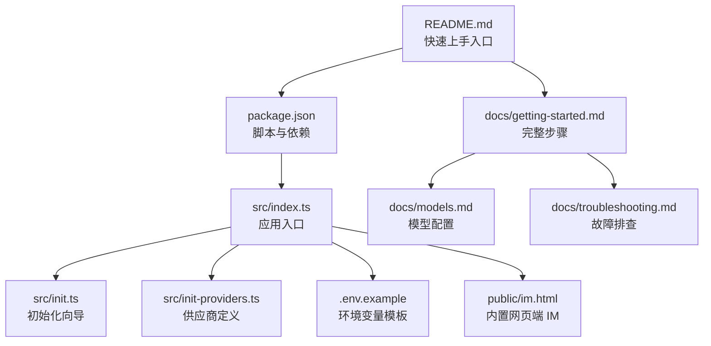
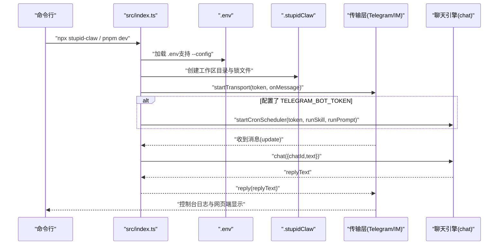
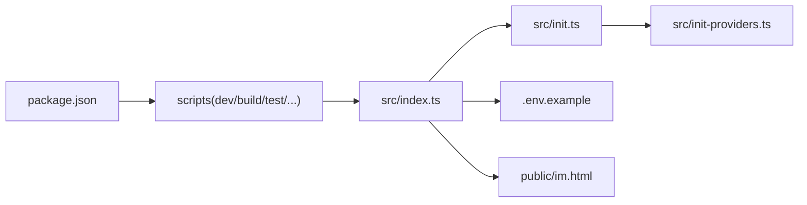

# 快速开始

<cite>
**本文引用的文件**
- [README.md](file://README.md)
- [docs/getting-started.md](file://docs/getting-started.md)
- [docs/models.md](file://docs/models.md)
- [docs/troubleshooting.md](file://docs/troubleshooting.md)
- [package.json](file://package.json)
- [src/index.ts](file://src/index.ts)
- [src/init.ts](file://src/init.ts)
- [src/init-providers.ts](file://src/init-providers.ts)
- [.env.example](file://.env.example)
- [public/im.html](file://public/im.html)
- [install.sh](file://install.sh)
</cite>

## 目录
1. [简介](#简介)
2. [项目结构](#项目结构)
3. [核心组件](#核心组件)
4. [架构总览](#架构总览)
5. [详细组件分析](#详细组件分析)
6. [依赖关系分析](#依赖关系分析)
7. [性能与资源](#性能与资源)
8. [故障排查指南](#故障排查指南)
9. [结论](#结论)
10. [附录](#附录)

## 简介
本指南面向初学者，帮助你在最短时间内启动 StupidClaw。你将学会两种启动方式：npx 极速启动与源码运行方式；掌握环境准备、环境变量配置、首次初始化流程、内置网页端 IM 的使用方法，并获得常见问题与故障排查建议。

## 项目结构
- 顶层入口与构建脚本位于 package.json，提供 dev、build、release、test 等常用命令。
- 源码入口在 src/index.ts，负责加载 .env、初始化工作区、启动传输层（Telegram 轮询/Webhook）、启动定时任务与聊天处理。
- 初始化向导在 src/init.ts，提供交互式配置生成 .env 的能力。
- 模型与供应商配置参考 docs/models.md 与 .env.example。
- 内置网页端 IM 的前端页面在 public/im.html。
- 故障排查参考 docs/troubleshooting.md。

图表来源
- [README.md:54-95](file://README.md#L54-L95)
- [package.json:14-22](file://package.json#L14-L22)
- [src/index.ts:112-216](file://src/index.ts#L112-L216)
- [src/init.ts:224-339](file://src/init.ts#L224-L339)
- [src/init-providers.ts:23-180](file://src/init-providers.ts#L23-L180)
- [.env.example:1-69](file://.env.example#L1-L69)
- [public/im.html:1-428](file://public/im.html#L1-L428)
- [docs/getting-started.md:1-153](file://docs/getting-started.md#L1-L153)
- [docs/models.md:1-281](file://docs/models.md#L1-L281)
- [docs/troubleshooting.md:1-194](file://docs/troubleshooting.md#L1-L194)

章节来源
- [README.md:54-95](file://README.md#L54-L95)
- [package.json:14-22](file://package.json#L14-L22)

## 核心组件
- 应用入口与生命周期
  - 加载 .env（支持 --config 指定路径），若缺失则给出友好提示。
  - 创建单实例锁文件，避免重复运行。
  - 初始化工作区目录，注册信号处理，优雅退出。
  - 启动定时任务调度器（当配置了 TELEGRAM_BOT_TOKEN）。
  - 启动传输层（Telegram 轮询或 Webhook），处理消息并调用聊天引擎。
- 初始化向导
  - 交互式选择供应商、输入 API Key、选择模型、生成 .env。
  - 支持自定义兼容接口（OpenAI/Anthropic 兼容）与本地模型（Ollama/LM Studio）。
- 内置网页端 IM
  - 提供 WebSocket 连接、登录配置、消息收发、打字指示器与状态提示。
  - 支持通过 URL 参数预填 token、url、chatId。

章节来源
- [src/index.ts:112-216](file://src/index.ts#L112-L216)
- [src/init.ts:224-339](file://src/init.ts#L224-L339)
- [public/im.html:240-428](file://public/im.html#L240-L428)

## 架构总览
下图展示了从启动到消息处理的关键流程：入口加载配置与工作区，初始化传输层，启动定时任务（可选），接收消息后调用聊天引擎并回复。

图表来源
- [src/index.ts:112-216](file://src/index.ts#L112-L216)

## 详细组件分析

### 启动方式一：npx 极速启动
- 前置条件
  - 已安装 Node.js（推荐 v20+）。
- 步骤
  - 在任意目录运行 npx stupid-claw。
  - 首次运行会提示缺少 .env，可按提示运行 npx stupid-claw init 生成配置，或手动创建 .env 并填写必要字段。
  - 再次运行即可启动。
- 注意事项
  - 若指定 --config 指向不存在的 .env，会直接报错。
  - 若未检测到 .env，程序会给出友好提示，而非直接崩溃。

章节来源
- [README.md:58-66](file://README.md#L58-L66)
- [docs/getting-started.md:42-55](file://docs/getting-started.md#L42-L55)
- [src/index.ts:22-40](file://src/index.ts#L22-L40)

### 启动方式二：源码运行
- 前置条件
  - 已安装 Node.js（推荐 v20+）与 pnpm。
- 步骤
  - 安装依赖：pnpm install。
  - 复制示例配置：cp .env.example .env。
  - 至少填写 STUPID_MODEL 与对应供应商的 API Key，以及 TELEGRAM_BOT_TOKEN（可选，留空则仅用 StupidIM）。
  - 启动：pnpm dev。
- 注意事项
  - 启动后若未配置 TELEGRAM_BOT_TOKEN，仍可通过内置网页端 IM 对话。
  - 若出现“另一个轮询实例已在运行”，删除 .stupidClaw/polling.lock 后重试。

章节来源
- [README.md:68-95](file://README.md#L68-L95)
- [docs/getting-started.md:57-104](file://docs/getting-started.md#L57-L104)
- [docs/troubleshooting.md:17-29](file://docs/troubleshooting.md#L17-L29)

### 环境变量配置详解
- 必填项
  - STUPID_MODEL：模型选择，格式为 provider:model_id，如 deepseek:deepseek-chat、openai:gpt-4o、minimax:MiniMax-M2.5 等。
  - 对应供应商的 API Key：如 DEEPSEEK_API_KEY、OPENAI_API_KEY、MINIMAX_CN_API_KEY 等。
  - TELEGRAM_BOT_TOKEN：用于 Telegram 交互（可选，留空则仅用 StupidIM）。
- 可选项
  - TELEGRAM_MODE：polling（默认）或 webhook。
  - TELEGRAM_WEBHOOK_URL、TELEGRAM_WEBHOOK_SECRET、TELEGRAM_WEBHOOK_PATH：Webhook 模式所需。
  - STUPID_IM_TOKEN：网页端 IM 访问密钥。
  - PORT：服务端口，默认 8080。
  - DEBUG_STUPIDCLAW、DEBUG_PROMPT：调试开关。
- 本地模型与自定义接口
  - 本地模型（Ollama/LM Studio）通过 ~/.pi/agent/models.json 注册，.env 中以 provider:model_id 形式选择。
  - 自定义兼容接口（custom-openai/custom-anthropic）可在初始化向导中配置，或通过 ~/.pi/agent/models.json 精细控制。

章节来源
- [.env.example:1-69](file://.env.example#L1-L69)
- [docs/models.md:9-32](file://docs/models.md#L9-L32)
- [docs/models.md:155-228](file://docs/models.md#L155-L228)
- [docs/models.md:231-278](file://docs/models.md#L231-L278)
- [docs/troubleshooting.md:171-194](file://docs/troubleshooting.md#L171-L194)

### 首次运行初始化流程
- 交互式向导
  - 选择供应商（如 deepseek/openai/ollama 等）。
  - 输入 API Key（部分供应商无需 API Key，如 Ollama）。
  - 选择模型（或手动输入 model_id）。
  - 输入 TELEGRAM_BOT_TOKEN（可留空）。
  - 输入 STUPID_IM_TOKEN（默认随机生成）与 PORT（默认 8080）。
  - 自动生成 .env 并提示下一步启动命令。
- 自动配置
  - .env 中包含 STUPID_MODEL、供应商密钥、Telegram 与 StupidIM 配置、端口与调试开关。

章节来源
- [src/init.ts:224-339](file://src/init.ts#L224-L339)
- [src/init-providers.ts:23-180](file://src/init-providers.ts#L23-L180)

### 内置网页端 IM 使用说明
- 启动后，终端会打印 StupidIM HTTP Server 启动信息与访问链接。
- 在浏览器中点击链接或按住 Command/Ctrl 点击蓝色链接打开网页。
- 页面自动填充 token、url、chatId（可选），点击“连接”后右上角显示“已连接”，即可在网页端与 StupidClaw 对话。
- 支持打字指示器与错误状态提示。

章节来源
- [docs/getting-started.md:115-135](file://docs/getting-started.md#L115-L135)
- [public/im.html:240-428](file://public/im.html#L240-L428)

### 传输层与消息处理
- 传输层
  - Telegram 轮询（默认）：适用于本地开发与无公网域名场景。
  - Telegram Webhook：需公网 HTTPS 地址与有效证书，适合生产部署。
- 消息处理
  - 收到消息后，发送“正在输入”动作，调用聊天引擎生成回复，最后回复消息并输出控制台日志。

章节来源
- [src/index.ts:189-208](file://src/index.ts#L189-L208)
- [docs/troubleshooting.md:88-113](file://docs/troubleshooting.md#L88-L113)

## 依赖关系分析
- 包管理与脚本
  - package.json 定义了 dev、build、release、test、typecheck、build:exe 等脚本。
  - 依赖 @inquirer/prompts、dotenv、picocolors、ws、@mariozechner/pi-ai 等。
- 入口与初始化
  - src/index.ts 作为入口，依赖 dotenv 加载 .env，依赖 src/init.ts 生成 .env。
  - 初始化向导依赖 src/init-providers.ts 提供供应商与模型选项。

图表来源
- [package.json:14-22](file://package.json#L14-L22)
- [src/index.ts:112-216](file://src/index.ts#L112-L216)
- [src/init.ts:224-339](file://src/init.ts#L224-L339)
- [src/init-providers.ts:23-180](file://src/init-providers.ts#L23-L180)
- [.env.example:1-69](file://.env.example#L1-L69)
- [public/im.html:1-428](file://public/im.html#L1-L428)

章节来源
- [package.json:14-22](file://package.json#L14-L22)
- [src/index.ts:112-216](file://src/index.ts#L112-L216)

## 性能与资源
- 启动性能
  - npx 方式无需下载源码，启动更快。
  - 源码方式需安装依赖，首次启动略慢，后续启动较快。
- 资源占用
  - Telegram 轮询模式对服务器压力较小，适合个人开发。
  - Webhook 模式需公网 HTTPS 与稳定网络，适合生产部署。
- 调试建议
  - 开启 DEBUG_STUPIDCLAW 与 DEBUG_PROMPT 查看详细日志与 prompt 内容，便于定位问题。

章节来源
- [docs/troubleshooting.md:39-45](file://docs/troubleshooting.md#L39-L45)

## 故障排查指南
- 启动即崩溃
  - 缺少 TELEGRAM_BOT_TOKEN：按提示生成 .env 并填写。
  - 重复启动：删除 .stupidClaw/polling.lock 后重试。
- Bot 收到消息但无回复
  - 检查 STUPID_MODEL 对应的 API Key 是否填写且账户有余额。
  - 开启 DEBUG_STUPIDCLAW 查看引擎日志。
  - 无 API Key 时会回显输入，属预期行为。
- Telegram Polling 报错 HTTP 409
  - 同一 Bot 不可同时存在多个 getUpdates 连接；关闭其他实例或清除 Webhook。
- Webhook 模式收不到消息
  - 确保 TELEGRAM_WEBHOOK_URL 为公网 HTTPS 地址，证书有效，PORT 与实际监听一致。
- Cron 定时任务未触发
  - 检查 .stupidClaw/cron_jobs.json 中 enabled 与 cronExpr 是否正确，查看当日 history 文件确认。
- 技能调用失败
  - 确认技能已注册，参数格式正确；文件类技能仅限操作 .stupidClaw/ 目录。
- Profile 记忆丢失
  - profile.md 在 .stupidClaw/ 目录下，清空该目录会丢失；重启进程不会丢失。

章节来源
- [docs/troubleshooting.md:5-50](file://docs/troubleshooting.md#L5-L50)
- [docs/troubleshooting.md:53-113](file://docs/troubleshooting.md#L53-L113)
- [docs/troubleshooting.md:116-144](file://docs/troubleshooting.md#L116-L144)
- [docs/troubleshooting.md:147-159](file://docs/troubleshooting.md#L147-L159)
- [docs/troubleshooting.md:161-168](file://docs/troubleshooting.md#L161-L168)

## 结论
通过本指南，你可以快速完成 StupidClaw 的环境准备与启动。推荐新手优先使用 npx 极速启动体验功能，再切换到源码运行进行深入配置与二次开发。遇到问题时，结合内置网页端 IM 与调试日志，通常能快速定位并解决。

## 附录
- 快速命令速查
  - npx 极速启动：npx stupid-claw
  - 源码安装依赖：pnpm install
  - 生成配置：cp .env.example .env
  - 启动：pnpm dev
  - 初始化向导：npx stupid-claw init
  - 打包为可执行文件：pnpm run build:exe
- 自动化安装脚本
  - install.sh 会自动检测并安装 Node.js、pnpm，安装依赖并生成 .env（如不存在）。

章节来源
- [docs/getting-started.md:138-153](file://docs/getting-started.md#L138-L153)
- [install.sh:17-68](file://install.sh#L17-L68)