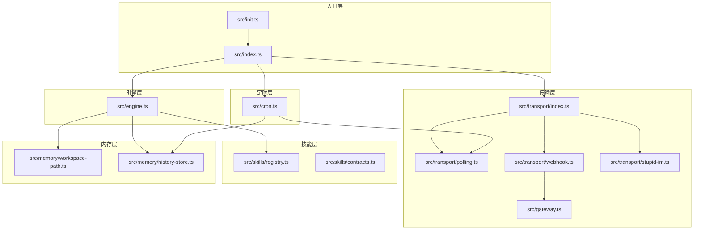
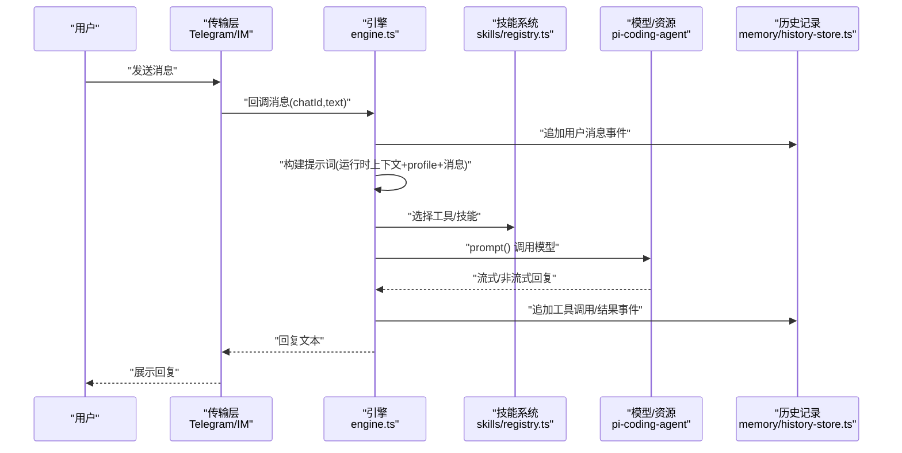
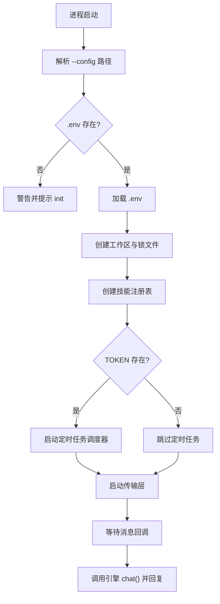
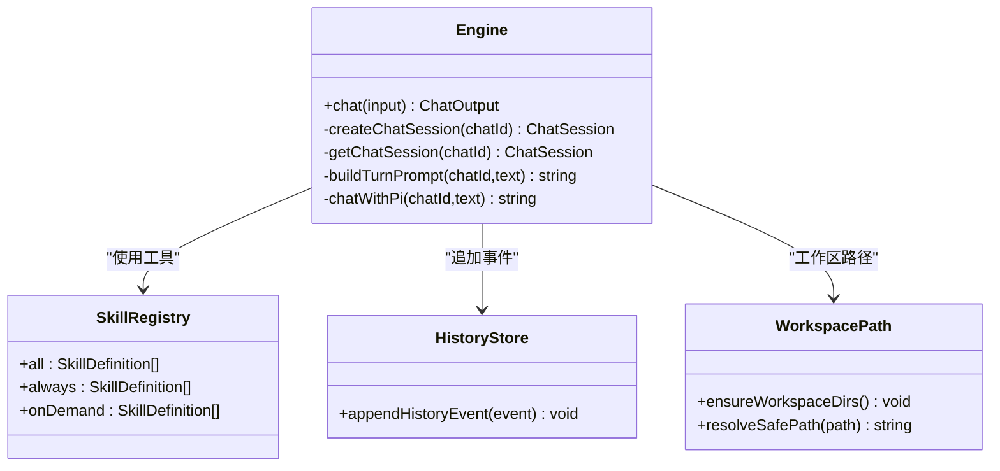
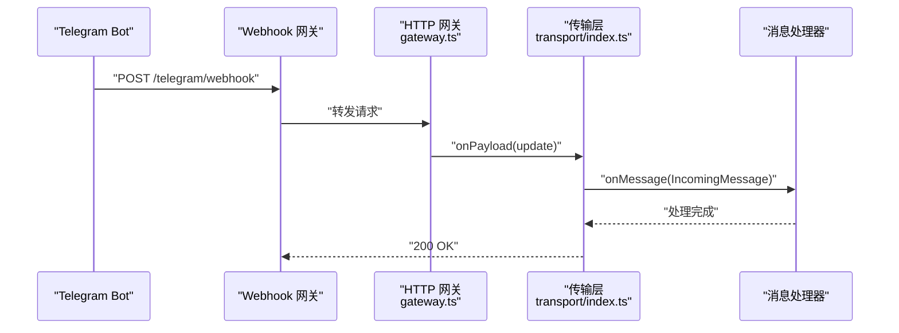
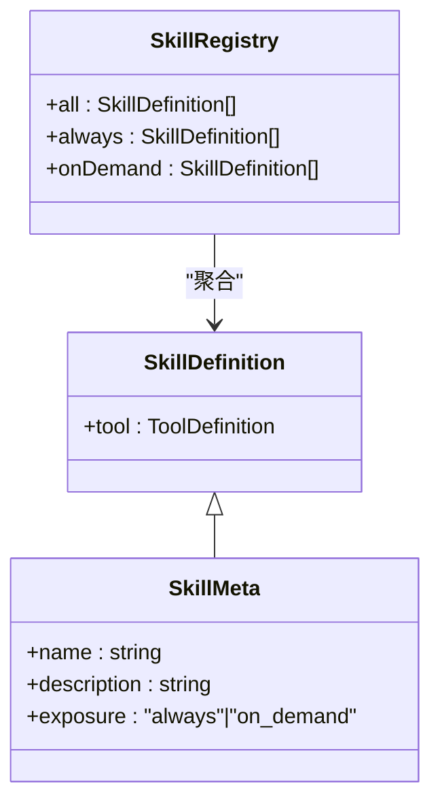
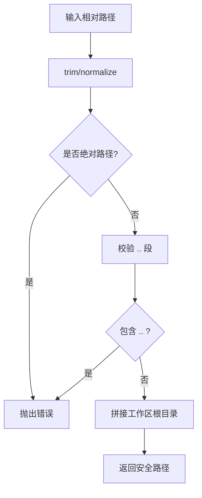
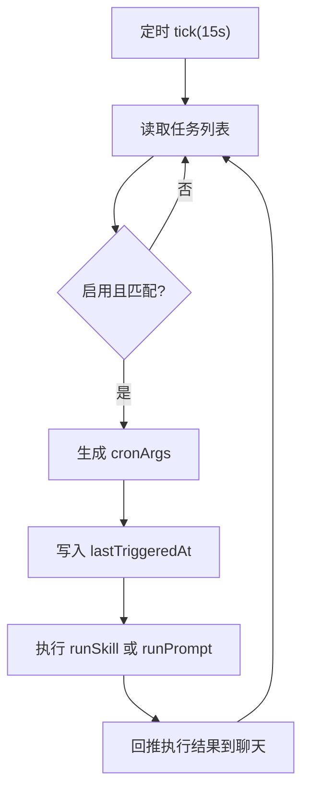
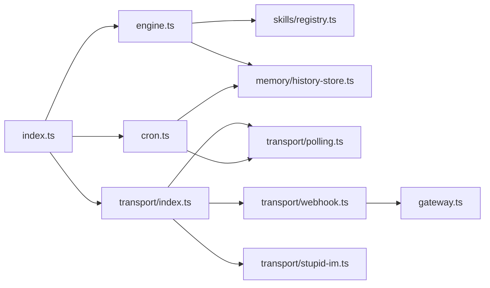

# 技术架构

<cite>
**本文档引用的文件**
- [src/index.ts](file://src/index.ts)
- [src/engine.ts](file://src/engine.ts)
- [src/transport/index.ts](file://src/transport/index.ts)
- [src/transport/polling.ts](file://src/transport/polling.ts)
- [src/transport/webhook.ts](file://src/transport/webhook.ts)
- [src/transport/stupid-im.ts](file://src/transport/stupid-im.ts)
- [src/gateway.ts](file://src/gateway.ts)
- [src/skills/registry.ts](file://src/skills/registry.ts)
- [src/skills/contracts.ts](file://src/skills/contracts.ts)
- [src/memory/workspace-path.ts](file://src/memory/workspace-path.ts)
- [src/memory/history-store.ts](file://src/memory/history-store.ts)
- [src/cron.ts](file://src/cron.ts)
- [src/init.ts](file://src/init.ts)
- [src/init-providers.ts](file://src/init-providers.ts)
- [package.json](file://package.json)
</cite>

## 目录
1. [引言](#引言)
2. [项目结构](#项目结构)
3. [核心组件](#核心组件)
4. [架构总览](#架构总览)
5. [详细组件分析](#详细组件分析)
6. [依赖分析](#依赖分析)
7. [性能考虑](#性能考虑)
8. [故障排查指南](#故障排查指南)
9. [结论](#结论)
10. [附录](#附录)

## 引言
本技术架构文档面向 StupidClaw 的开发者与维护者，系统性阐述系统的高层设计与架构模式，包括分层架构、插件化设计、策略模式等核心理念；明确入口点、核心引擎、传输层、技能系统、内存管理、定时任务等模块的职责与交互；梳理“消息输入 → 传输层 → 引擎 → 技能系统 → 模型调用 → 响应输出”的完整数据流；总结设计决策与技术权衡（如文件系统存储、路径沙盒机制），并给出架构图与组件分解图，帮助快速理解与扩展。

## 项目结构
StupidClaw 采用以功能域为中心的分层组织方式：
- 入口层：命令行入口与初始化引导
- 传输层：Telegram 轮询/Webhook 与 StupidIM 网页端
- 引擎层：会话管理、模型注册与调度、提示词构建
- 技能层：内置技能注册与按需暴露
- 内存层：工作区路径沙盒、历史记录持久化
- 定时层：基于 Cron 的计划任务调度
- 网关层：HTTP/Webhook 通用网关

**图表来源**
- [src/index.ts:112-210](file://src/index.ts#L112-L210)
- [src/engine.ts:392-475](file://src/engine.ts#L392-L475)
- [src/transport/index.ts:47-71](file://src/transport/index.ts#L47-L71)
- [src/transport/webhook.ts:41-86](file://src/transport/webhook.ts#L41-L86)
- [src/transport/stupid-im.ts:24-105](file://src/transport/stupid-im.ts#L24-L105)
- [src/gateway.ts:27-79](file://src/gateway.ts#L27-L79)
- [src/skills/registry.ts:23-55](file://src/skills/registry.ts#L23-L55)
- [src/memory/workspace-path.ts:32-42](file://src/memory/workspace-path.ts#L32-L42)
- [src/memory/history-store.ts:37-83](file://src/memory/history-store.ts#L37-L83)
- [src/cron.ts:251-265](file://src/cron.ts#L251-L265)

**章节来源**
- [src/index.ts:112-210](file://src/index.ts#L112-L210)
- [src/transport/index.ts:19-71](file://src/transport/index.ts#L19-L71)
- [src/engine.ts:392-475](file://src/engine.ts#L392-L475)
- [src/skills/registry.ts:23-55](file://src/skills/registry.ts#L23-L55)
- [src/memory/workspace-path.ts:32-42](file://src/memory/workspace-path.ts#L32-L42)
- [src/memory/history-store.ts:37-83](file://src/memory/history-store.ts#L37-L83)
- [src/cron.ts:251-265](file://src/cron.ts#L251-L265)

## 核心组件
- 入口点（index.ts）
  - 解析命令行参数与 .env 配置
  - 单实例锁与优雅退出钩子
  - 初始化工作区目录与技能注册表
  - 启动传输层与定时任务调度器
  - 将消息回调转交给引擎进行对话处理
- 核心引擎（engine.ts）
  - 会话生命周期管理（按 chatId 复用）
  - 模型注册与选择（支持多供应商与自定义）
  - 提示词构建（含运行时上下文、profile、用户消息）
  - 工具执行事件追踪与历史记录追加
  - 错误归一化与降噪（去除<think>标签）
- 传输层（transport/）
  - 轮询模式：拉取 Telegram 更新，逐条派发
  - Webhook 模式：设置 Telegram Webhook，本地 HTTP 网关接收推送
  - StupidIM：HTTP 静态页面 + WebSocket 实时对话
- 技能系统（skills/registry.ts）
  - 统一技能契约（contracts.ts）
  - 内置技能注册与暴露策略（always/on_demand）
  - 动态加载标准文件技能
- 内存管理（memory/）
  - 路径沙盒：相对路径规范化与禁止穿越
  - 历史记录：按日写入 JSONL 文件，支持查询
- 定时任务（cron/）
  - Cron 表达式解析与分钟粒度去重触发
  - 任务执行器抽象（runSkill/runPrompt）
  - 执行结果回推至聊天目标

**章节来源**
- [src/index.ts:112-210](file://src/index.ts#L112-L210)
- [src/engine.ts:392-475](file://src/engine.ts#L392-L475)
- [src/transport/index.ts:19-71](file://src/transport/index.ts#L19-L71)
- [src/skills/registry.ts:23-55](file://src/skills/registry.ts#L23-L55)
- [src/memory/workspace-path.ts:32-42](file://src/memory/workspace-path.ts#L32-L42)
- [src/memory/history-store.ts:37-83](file://src/memory/history-store.ts#L37-L83)
- [src/cron.ts:251-265](file://src/cron.ts#L251-L265)

## 架构总览
StupidClaw 采用“入口层 → 传输层 → 引擎层 → 技能层/内存层/定时层”的分层架构，结合插件化（技能注册表）与策略模式（轮询/Webhook/StupidIM、always/on_demand 暴露策略）实现高内聚低耦合。数据流以消息为驱动，通过传输层进入引擎，引擎根据会话状态与技能工具链调用模型，最终将回复回推至传输层。

**图表来源**
- [src/index.ts:189-208](file://src/index.ts#L189-L208)
- [src/engine.ts:680-705](file://src/engine.ts#L680-L705)
- [src/engine.ts:511-607](file://src/engine.ts#L511-L607)
- [src/skills/registry.ts:23-55](file://src/skills/registry.ts#L23-L55)
- [src/memory/history-store.ts:37-42](file://src/memory/history-store.ts#L37-L42)

## 详细组件分析

### 入口点（index.ts）
- 职责
  - 命令行参数解析与 .env 加载
  - 单实例锁与信号处理
  - 初始化工作区与技能注册
  - 启动传输层与定时任务调度器
  - 将消息回调转交引擎处理
- 关键流程
  - acquireSingleInstanceLock → ensureWorkspaceDirs → registerShutdownHooks
  - startCronScheduler(token, {runSkill, runPrompt}) → startTransport(token, handler)
  - handler(message) → chat({chatId,text}) → message.reply()

**图表来源**
- [src/index.ts:22-40](file://src/index.ts#L22-L40)
- [src/index.ts:112-210](file://src/index.ts#L112-L210)

**章节来源**
- [src/index.ts:112-210](file://src/index.ts#L112-L210)

### 核心引擎（engine.ts）
- 职责
  - 会话管理：按 chatId 缓存 AgentSession，复用工具与资源
  - 模型注册：统一注册多供应商与自定义 OpenAI/Anthropic 兼容接口
  - 提示词构建：注入运行时上下文、profile、用户消息
  - 工具事件追踪：订阅工具调用开始/结束，写入历史
  - 错误归一化：对 API Key 缺失等错误进行友好提示
- 关键实现
  - createChatSession/getChatSession：延迟创建与缓存
  - buildTurnPrompt：拼装运行时上下文与 profile
  - chatWithPi/chat：prompt 调用与回复提取
  - normalizeApiKeyError：错误消息标准化

**图表来源**
- [src/engine.ts:392-475](file://src/engine.ts#L392-L475)
- [src/engine.ts:484-509](file://src/engine.ts#L484-L509)
- [src/engine.ts:680-705](file://src/engine.ts#L680-L705)
- [src/skills/registry.ts:23-55](file://src/skills/registry.ts#L23-L55)
- [src/memory/history-store.ts:37-42](file://src/memory/history-store.ts#L37-L42)
- [src/memory/workspace-path.ts:37-42](file://src/memory/workspace-path.ts#L37-L42)

**章节来源**
- [src/engine.ts:392-475](file://src/engine.ts#L392-L475)
- [src/engine.ts:484-509](file://src/engine.ts#L484-L509)
- [src/engine.ts:680-705](file://src/engine.ts#L680-L705)

### 传输层（transport/）
- 职责
  - 轮询模式：周期性拉取 Telegram 更新，逐条派发消息
  - Webhook 模式：设置 Telegram Webhook，本地 HTTP 网关接收推送
  - StupidIM：提供静态页面与 WebSocket，支持网页端实时对话
- 关键实现
  - startTransport：根据 TELEGRAM_MODE 选择轮询或 Webhook
  - runWebhookMode：setWebhook + startGateway
  - startStupidIM：WebSocketServer + 认证 + 回调派发
  - polling：getUpdates/sendMessage/sendChatAction

**图表来源**
- [src/transport/webhook.ts:41-86](file://src/transport/webhook.ts#L41-L86)
- [src/gateway.ts:27-79](file://src/gateway.ts#L27-L79)
- [src/transport/index.ts:47-71](file://src/transport/index.ts#L47-L71)

**章节来源**
- [src/transport/index.ts:19-71](file://src/transport/index.ts#L19-L71)
- [src/transport/webhook.ts:41-86](file://src/transport/webhook.ts#L41-L86)
- [src/transport/stupid-im.ts:24-105](file://src/transport/stupid-im.ts#L24-L105)
- [src/transport/polling.ts:52-89](file://src/transport/polling.ts#L52-L89)

### 技能系统（skills/registry.ts 与 contracts.ts）
- 职责
  - 统一技能契约（名称、描述、暴露策略、工具定义）
  - 注册内置技能（时间、天气、搜索、代码、历史查询、profile 更新、技能创建、定时任务管理）
  - 按策略暴露（always/on_demand），动态合并标准文件技能元数据
- 关键实现
  - createSkillRegistry：组装 baseSkills 与 listAvailable
  - exposure 字段控制工具链可见性

**图表来源**
- [src/skills/contracts.ts:6-20](file://src/skills/contracts.ts#L6-L20)
- [src/skills/registry.ts:23-55](file://src/skills/registry.ts#L23-L55)

**章节来源**
- [src/skills/registry.ts:23-55](file://src/skills/registry.ts#L23-L55)
- [src/skills/contracts.ts:6-20](file://src/skills/contracts.ts#L6-L20)

### 内存管理（memory/）
- 路径沙盒（workspace-path.ts）
  - 禁止绝对路径与路径穿越（..）
  - 统一相对路径规范化与工作区根目录解析
- 历史记录（history-store.ts）
  - 按 UTC 日切分 JSONL 文件
  - 支持按 chatId/date/limit 查询
  - 追加事件时自动创建目录

**图表来源**
- [src/memory/workspace-path.ts:6-35](file://src/memory/workspace-path.ts#L6-L35)

**章节来源**
- [src/memory/workspace-path.ts:32-42](file://src/memory/workspace-path.ts#L32-L42)
- [src/memory/history-store.ts:37-83](file://src/memory/history-store.ts#L37-L83)

### 定时任务（cron.ts）
- 职责
  - 解析 Cron 表达式（分钟/小时/日/月/周）
  - 每 15 秒扫描一次，按分钟粒度去重触发
  - 执行器抽象：runSkill 与 runPrompt
  - 将执行结果回推至目标聊天
- 关键实现
  - isCronExprMatch：字段匹配与范围/步进/区间解析
  - triggerJob：根据 task 类型选择工具或 prompt
  - startCronScheduler：定时器与首次启动

**图表来源**
- [src/cron.ts:171-249](file://src/cron.ts#L171-L249)
- [src/cron.ts:251-265](file://src/cron.ts#L251-L265)

**章节来源**
- [src/cron.ts:85-109](file://src/cron.ts#L85-L109)
- [src/cron.ts:171-249](file://src/cron.ts#L171-L249)
- [src/cron.ts:251-265](file://src/cron.ts#L251-L265)

### 初始化向导（init.ts 与 init-providers.ts）
- 职责
  - 交互式选择供应商与模型，生成 .env
  - 支持 OpenRouter 自动推荐与手动输入
  - 自定义 OpenAI/Anthropic 兼容接口的 Base URL 输入
- 关键实现
  - runInit：问答式收集配置并写入 .env
  - PROVIDERS：供应商与模型清单、环境变量映射

**章节来源**
- [src/init.ts:224-339](file://src/init.ts#L224-L339)
- [src/init-providers.ts:23-180](file://src/init-providers.ts#L23-L180)

## 依赖分析
- 外部依赖
  - @mariozechner/pi-coding-agent：会话、工具、模型注册与资源加载
  - dotenv：.env 加载
  - ws：WebSocket 支持
  - @inquirer/prompts、picocolors：初始化向导交互
- 内部模块耦合
  - index.ts 依赖 engine.ts、transport/index.ts、cron.ts、memory/workspace-path.ts、skills/registry.ts
  - engine.ts 依赖 skills/registry.ts、memory/*、prompt/*、pi-* 包
  - transport/* 依赖 gateway.ts 与 polling.ts
  - cron.ts 依赖 transport/polling.ts 与 memory/history-store.ts

**图表来源**
- [src/index.ts:8-10](file://src/index.ts#L8-L10)
- [src/engine.ts:16-17](file://src/engine.ts#L16-L17)
- [src/transport/index.ts:1-3](file://src/transport/index.ts#L1-L3)
- [src/cron.ts:1-3](file://src/cron.ts#L1-L3)

**章节来源**
- [package.json:30-37](file://package.json#L30-L37)
- [src/index.ts:8-10](file://src/index.ts#L8-L10)
- [src/engine.ts:16-17](file://src/engine.ts#L16-L17)
- [src/transport/index.ts:1-3](file://src/transport/index.ts#L1-L3)
- [src/cron.ts:1-3](file://src/cron.ts#L1-L3)

## 性能考虑
- 会话复用：按 chatId 缓存 AgentSession，减少模型初始化开销
- 流式输出：订阅消息增量更新，尽早感知回复片段
- 历史记录异步：appendHistoryEvent 使用异步写入，避免阻塞主流程
- Cron 触发去重：按分钟粒度标记 lastTriggeredAt，避免长时间 LLM 调用导致重复触发
- 轮询与 Webhook：Webhook 模式降低轮询轮次与延迟，提升吞吐

[本节为通用性能讨论，不直接分析具体文件]

## 故障排查指南
- API Key 错误
  - 现象：模型调用失败，提示缺少 API Key
  - 处理：使用初始化向导向导或检查 .env 中对应供应商密钥
  - 参考：normalizeApiKeyError 与 PROVIDERS 映射
- Telegram Webhook 设置失败
  - 现象：setWebhook 返回错误
  - 处理：检查 TELEGRAM_WEBHOOK_URL、PORT、secret_token；确认服务器可达
  - 参考：runWebhookMode、gateway.ts
- 路径穿越/权限问题
  - 现象：文件操作失败或被拒绝
  - 处理：确保使用 resolveSafePath 与相对路径，避免 .. 与绝对路径
  - 参考：workspace-path.ts
- 历史记录读取异常
  - 现象：查询历史为空或报错
  - 处理：确认历史文件存在与权限，限制 limit 范围
  - 参考：history-store.ts

**章节来源**
- [src/engine.ts:162-186](file://src/engine.ts#L162-L186)
- [src/transport/webhook.ts:41-86](file://src/transport/webhook.ts#L41-L86)
- [src/gateway.ts:27-79](file://src/gateway.ts#L27-L79)
- [src/memory/workspace-path.ts:6-35](file://src/memory/workspace-path.ts#L6-L35)
- [src/memory/history-store.ts:50-83](file://src/memory/history-store.ts#L50-L83)

## 结论
StupidClaw 通过清晰的分层架构与插件化设计，实现了从消息输入到模型响应的闭环。文件系统存储与路径沙盒确保了安全性与可运维性；多供应商模型注册与 Webhook/轮询双通道传输提升了灵活性与性能。建议在生产环境中优先使用 Webhook 模式，并配合初始化向导完成供应商与模型配置，同时利用 Cron 与技能系统实现自动化与智能化扩展。

[本节为总结性内容，不直接分析具体文件]

## 附录
- 系统边界
  - 传输层：负责外部消息接入（Telegram 轮询/Webhook、StupidIM）
  - 引擎层：负责会话、模型与工具链编排
  - 技能层：负责能力暴露与按需披露
  - 内存层：负责工作区与历史记录
  - 定时层：负责计划任务与自动触发
- 设计决策与权衡
  - 文件系统存储：简单可靠、便于审计与备份，替代数据库降低部署复杂度
  - 路径沙盒：杜绝越权读写，保障工作区安全
  - 插件化与策略模式：技能暴露策略与传输模式切换，提升可扩展性与可维护性

[本节为概念性内容，不直接分析具体文件]