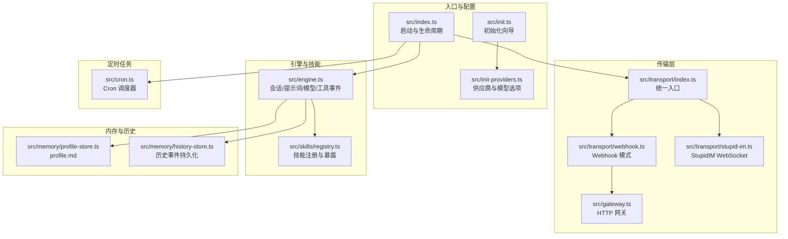
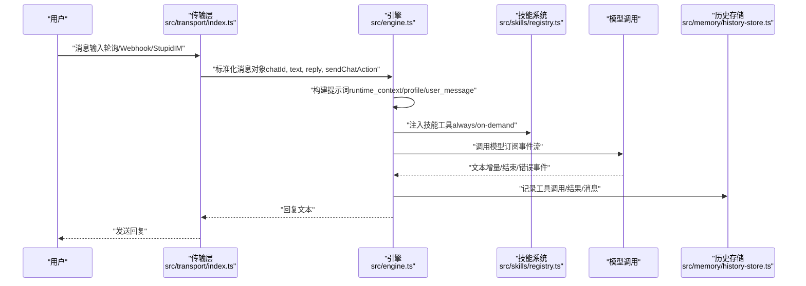
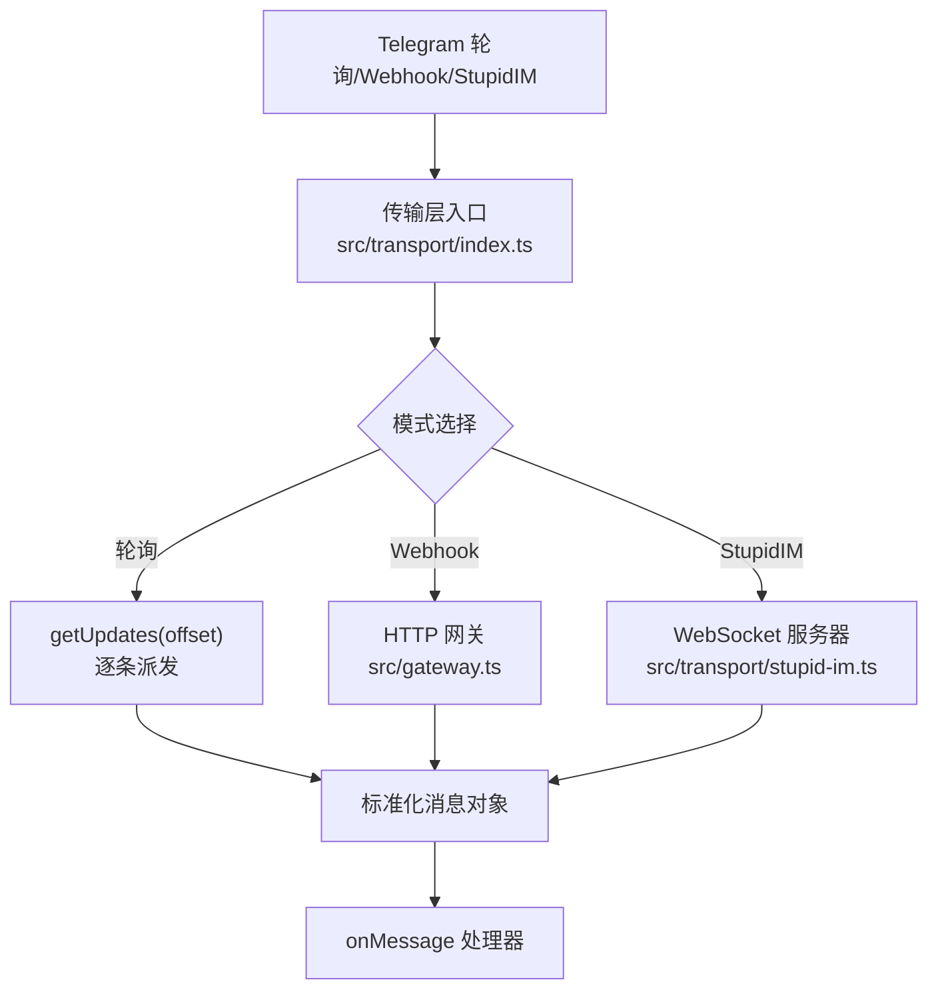
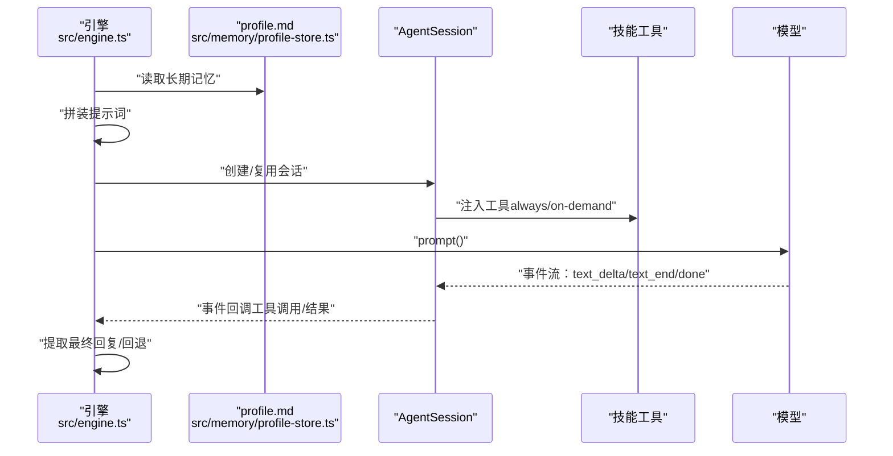
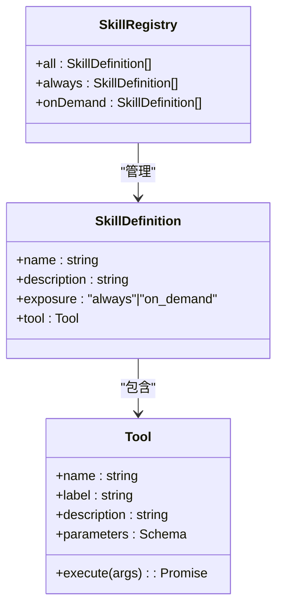
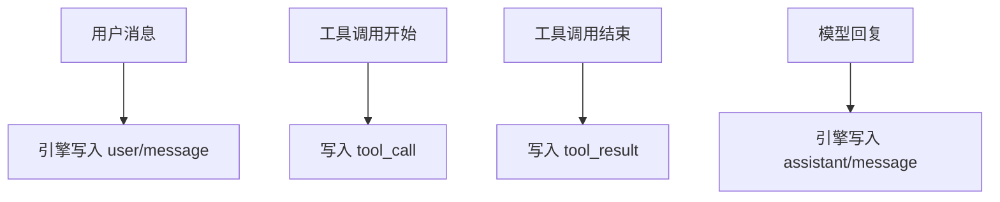
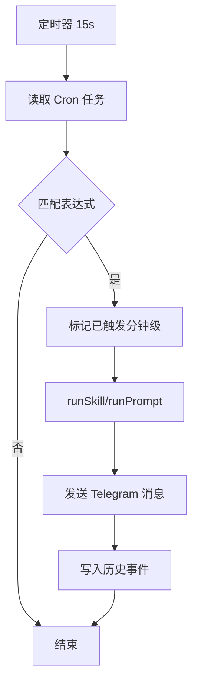
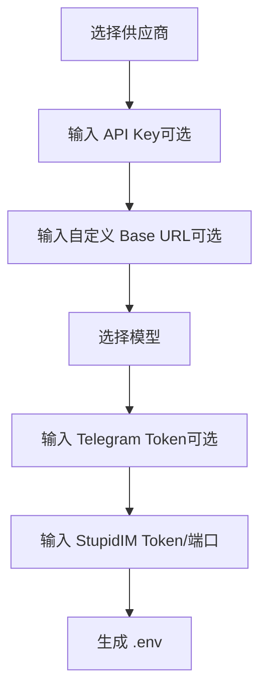
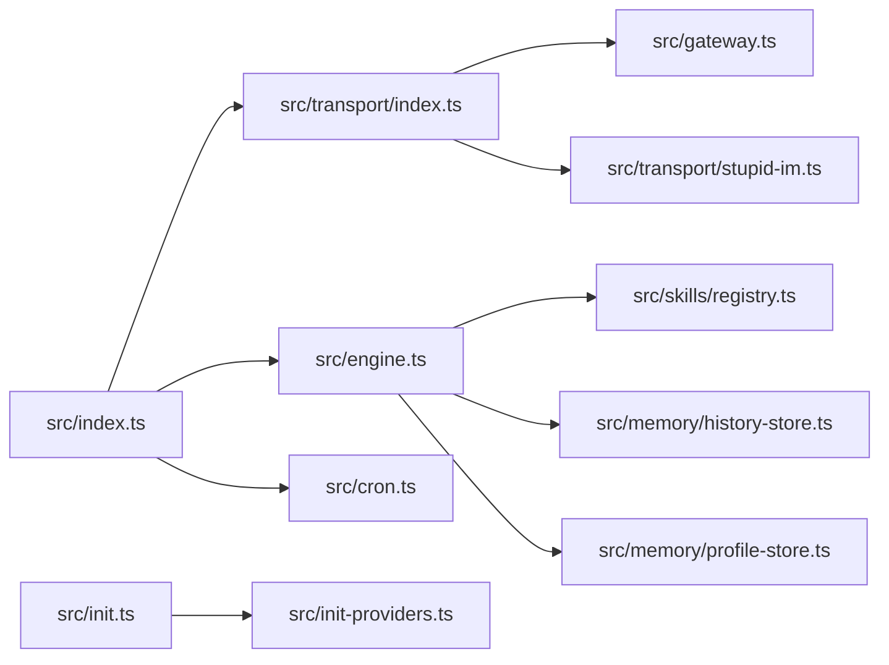
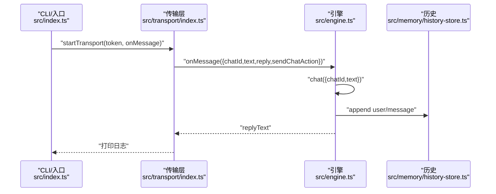

# 数据流分析

<cite>
**本文引用的文件**
- [src/index.ts](file://src/index.ts)
- [src/engine.ts](file://src/engine.ts)
- [src/transport/index.ts](file://src/transport/index.ts)
- [src/transport/webhook.ts](file://src/transport/webhook.ts)
- [src/transport/stupid-im.ts](file://src/transport/stupid-im.ts)
- [src/gateway.ts](file://src/gateway.ts)
- [src/skills/registry.ts](file://src/skills/registry.ts)
- [src/memory/history-store.ts](file://src/memory/history-store.ts)
- [src/memory/profile-store.ts](file://src/memory/profile-store.ts)
- [src/cron.ts](file://src/cron.ts)
- [src/init.ts](file://src/init.ts)
- [src/init-providers.ts](file://src/init-providers.ts)
- [public/im.html](file://public/im.html)
</cite>

## 目录
1. [引言](#引言)
2. [项目结构](#项目结构)
3. [核心组件](#核心组件)
4. [架构总览](#架构总览)
5. [详细组件分析](#详细组件分析)
6. [依赖关系分析](#依赖关系分析)
7. [性能考量](#性能考量)
8. [故障排查指南](#故障排查指南)
9. [结论](#结论)
10. [附录](#附录)

## 引言
本文件面向开发者，系统性梳理 StupidClaw 的数据流与处理链路，覆盖从消息输入（Telegram 轮询/Webhook/StupidIM）→ 传输层接收 → 引擎处理 → 技能系统调用 → 模型调用 → 结果返回的完整闭环。文档重点解释：
- 消息格式标准化与会话状态管理
- 技能参数传递与工具调用
- 模型响应处理与错误恢复
- 异常场景下的数据处理策略
- 提供数据流图与时序图，帮助快速定位问题与优化路径

## 项目结构
StupidClaw 采用分层与功能模块化组织：
- 入口与生命周期：入口脚本负责初始化、锁文件、环境加载、定时任务与传输层启动
- 传输层：统一抽象消息输入来源（轮询、Webhook、StupidIM），输出标准化消息对象
- 引擎层：会话管理、提示词构建、模型选择与调用、工具事件记录
- 技能系统：内置技能注册与暴露策略（always/on-demand）
- 内存与历史：profile 长期记忆注入、历史事件持久化
- 定时任务：基于 cron 表达式的任务调度与主动推送

图表来源
- [src/index.ts:112-216](file://src/index.ts#L112-L216)
- [src/transport/index.ts:47-71](file://src/transport/index.ts#L47-L71)
- [src/transport/webhook.ts:41-86](file://src/transport/webhook.ts#L41-L86)
- [src/gateway.ts:27-79](file://src/gateway.ts#L27-L79)
- [src/transport/stupid-im.ts:24-105](file://src/transport/stupid-im.ts#L24-L105)
- [src/engine.ts:392-475](file://src/engine.ts#L392-L475)
- [src/skills/registry.ts:23-55](file://src/skills/registry.ts#L23-L55)
- [src/memory/profile-store.ts:112-132](file://src/memory/profile-store.ts#L112-L132)
- [src/memory/history-store.ts:37-83](file://src/memory/history-store.ts#L37-L83)
- [src/cron.ts:251-265](file://src/cron.ts#L251-L265)
- [src/init.ts:224-339](file://src/init.ts#L224-L339)
- [src/init-providers.ts:23-180](file://src/init-providers.ts#L23-L180)

章节来源
- [src/index.ts:112-216](file://src/index.ts#L112-L216)
- [src/transport/index.ts:47-71](file://src/transport/index.ts#L47-L71)
- [src/engine.ts:392-475](file://src/engine.ts#L392-L475)
- [src/skills/registry.ts:23-55](file://src/skills/registry.ts#L23-L55)
- [src/memory/profile-store.ts:112-132](file://src/memory/profile-store.ts#L112-L132)
- [src/memory/history-store.ts:37-83](file://src/memory/history-store.ts#L37-L83)
- [src/cron.ts:251-265](file://src/cron.ts#L251-L265)
- [src/init.ts:224-339](file://src/init.ts#L224-L339)
- [src/init-providers.ts:23-180](file://src/init-providers.ts#L23-L180)

## 核心组件
- 入口与生命周期：负责 .env 加载、单实例锁、工作目录准备、定时任务与传输层启动
- 传输层：统一抽象消息输入，输出标准化消息对象（包含 chatId、text、reply、sendChatAction）
- 引擎：会话复用/创建、提示词构建、模型选择与调用、工具事件记录、错误归一化
- 技能系统：内置技能注册、暴露策略（always/on-demand）、动态列表
- 内存与历史：profile.md 注入、历史事件按日写入 JSONL
- 定时任务：Cron 调度、任务触发、工具调用或 prompt 执行、主动推送

章节来源
- [src/index.ts:112-216](file://src/index.ts#L112-L216)
- [src/transport/index.ts:5-14](file://src/transport/index.ts#L5-L14)
- [src/engine.ts:19-32](file://src/engine.ts#L19-L32)
- [src/skills/registry.ts:13-17](file://src/skills/registry.ts#L13-L17)
- [src/memory/history-store.ts:8-18](file://src/memory/history-store.ts#L8-L18)
- [src/cron.ts:5-14](file://src/cron.ts#L5-L14)

## 架构总览
下图展示从消息输入到结果返回的端到端数据流：

图表来源
- [src/transport/index.ts:19-45](file://src/transport/index.ts#L19-L45)
- [src/engine.ts:484-509](file://src/engine.ts#L484-L509)
- [src/engine.ts:511-589](file://src/engine.ts#L511-L589)
- [src/skills/registry.ts:23-55](file://src/skills/registry.ts#L23-L55)
- [src/memory/history-store.ts:37-42](file://src/memory/history-store.ts#L37-L42)

## 详细组件分析

### 传输层：消息输入与标准化
- 轮询模式：持续拉取 Telegram 更新，逐条派发消息处理器
- Webhook 模式：设置 Telegram Webhook，启动 HTTP 网关接收回调，同时兼容 StupidIM GET 请求
- StupidIM：独立 HTTP 服务器 + WebSocket，支持网页端对话与打字态通知
- 标准化消息对象：包含 updateId、chatId、text、reply、sendChatAction

图表来源
- [src/transport/index.ts:19-71](file://src/transport/index.ts#L19-L71)
- [src/transport/webhook.ts:41-86](file://src/transport/webhook.ts#L41-L86)
- [src/gateway.ts:27-79](file://src/gateway.ts#L27-L79)
- [src/transport/stupid-im.ts:24-105](file://src/transport/stupid-im.ts#L24-L105)

章节来源
- [src/transport/index.ts:19-71](file://src/transport/index.ts#L19-L71)
- [src/transport/webhook.ts:41-86](file://src/transport/webhook.ts#L41-L86)
- [src/gateway.ts:27-79](file://src/gateway.ts#L27-L79)
- [src/transport/stupid-im.ts:24-105](file://src/transport/stupid-im.ts#L24-L105)

### 引擎：会话、提示词与模型调用
- 会话管理：按 chatId 复用 AgentSession，首次创建时注入模型、工具、资源加载器
- 提示词构建：runtime_context（chat_id、时间）、profile.md 长期记忆、用户消息
- 工具事件：订阅工具执行开始/结束，记录到历史
- 错误归一化：将 API Key 缺失等错误映射为更友好的提示
- 回退策略：若模型无输出，回退到“收到：xxx”

图表来源
- [src/engine.ts:392-475](file://src/engine.ts#L392-L475)
- [src/engine.ts:484-509](file://src/engine.ts#L484-L509)
- [src/engine.ts:511-589](file://src/engine.ts#L511-L589)
- [src/memory/profile-store.ts:112-132](file://src/memory/profile-store.ts#L112-L132)

章节来源
- [src/engine.ts:392-475](file://src/engine.ts#L392-L475)
- [src/engine.ts:484-509](file://src/engine.ts#L484-L509)
- [src/engine.ts:511-589](file://src/engine.ts#L511-L589)
- [src/memory/profile-store.ts:112-132](file://src/memory/profile-store.ts#L112-L132)

### 技能系统：注册与暴露策略
- 注册：内置技能集合（系统、内存、网络、编码等）
- 暴露策略：always（默认始终可用）、on-demand（按需披露）
- 动态列表：提供“列出可用技能”的工具，指导用户按需调用

图表来源
- [src/skills/registry.ts:13-55](file://src/skills/registry.ts#L13-L55)

章节来源
- [src/skills/registry.ts:13-55](file://src/skills/registry.ts#L13-L55)

### 历史与记忆：profile.md 注入与事件持久化
- profile.md：长期稳定事实，注入到每回合提示词中
- 历史事件：按日 JSONL 追加写入，支持查询与限流
- 工具事件：工具调用与结果写入历史，便于审计与回溯

图表来源
- [src/memory/history-store.ts:37-83](file://src/memory/history-store.ts#L37-L83)
- [src/engine.ts:550-575](file://src/engine.ts#L550-L575)
- [src/engine.ts:682-702](file://src/engine.ts#L682-L702)

章节来源
- [src/memory/history-store.ts:37-83](file://src/memory/history-store.ts#L37-L83)
- [src/engine.ts:550-575](file://src/engine.ts#L550-L575)
- [src/engine.ts:682-702](file://src/engine.ts#L682-L702)

### 定时任务：Cron 调度与主动推送
- Cron 表达式匹配：分钟/小时/日/月/周
- 触发策略：去重（按分钟粒度）、写入 lastTriggeredAt、记录工具调用
- 执行方式：runSkill 或 runPrompt，失败/成功均记录并主动推送

图表来源
- [src/cron.ts:85-109](file://src/cron.ts#L85-L109)
- [src/cron.ts:147-249](file://src/cron.ts#L147-L249)
- [src/cron.ts:251-265](file://src/cron.ts#L251-L265)

章节来源
- [src/cron.ts:85-109](file://src/cron.ts#L85-L109)
- [src/cron.ts:147-249](file://src/cron.ts#L147-L249)
- [src/cron.ts:251-265](file://src/cron.ts#L251-L265)

### 初始化向导：供应商与模型配置
- 交互式选择供应商、模型、API Key、自定义 Base URL
- 生成 .env 配置，包含 Telegram、StupidIM、调试开关等

图表来源
- [src/init.ts:224-339](file://src/init.ts#L224-L339)
- [src/init-providers.ts:23-180](file://src/init-providers.ts#L23-L180)

章节来源
- [src/init.ts:224-339](file://src/init.ts#L224-L339)
- [src/init-providers.ts:23-180](file://src/init-providers.ts#L23-L180)

## 依赖关系分析
- 入口依赖传输层与引擎，传输层依赖网关与 StupidIM，引擎依赖技能注册与内存模块
- 定时任务依赖传输层发送能力与 Cron 任务存储
- 初始化向导依赖供应商配置与交互式问答

图表来源
- [src/index.ts:112-216](file://src/index.ts#L112-L216)
- [src/transport/index.ts:47-71](file://src/transport/index.ts#L47-L71)
- [src/gateway.ts:27-79](file://src/gateway.ts#L27-L79)
- [src/transport/stupid-im.ts:24-105](file://src/transport/stupid-im.ts#L24-L105)
- [src/engine.ts:392-475](file://src/engine.ts#L392-L475)
- [src/skills/registry.ts:23-55](file://src/skills/registry.ts#L23-L55)
- [src/memory/history-store.ts:37-83](file://src/memory/history-store.ts#L37-L83)
- [src/memory/profile-store.ts:112-132](file://src/memory/profile-store.ts#L112-L132)
- [src/cron.ts:251-265](file://src/cron.ts#L251-L265)
- [src/init.ts:224-339](file://src/init.ts#L224-L339)
- [src/init-providers.ts:23-180](file://src/init-providers.ts#L23-L180)

章节来源
- [src/index.ts:112-216](file://src/index.ts#L112-L216)
- [src/transport/index.ts:47-71](file://src/transport/index.ts#L47-L71)
- [src/engine.ts:392-475](file://src/engine.ts#L392-L475)
- [src/skills/registry.ts:23-55](file://src/skills/registry.ts#L23-L55)
- [src/memory/history-store.ts:37-83](file://src/memory/history-store.ts#L37-L83)
- [src/memory/profile-store.ts:112-132](file://src/memory/profile-store.ts#L112-L132)
- [src/cron.ts:251-265](file://src/cron.ts#L251-L265)
- [src/init.ts:224-339](file://src/init.ts#L224-L339)
- [src/init-providers.ts:23-180](file://src/init-providers.ts#L23-L180)

## 性能考量
- 会话复用：按 chatId 复用 AgentSession，减少模型初始化开销
- 事件流订阅：按增量文本拼接，避免一次性大块内容
- 历史写入：异步追加写入，失败不影响主流程
- Cron 间隔：15 秒扫描，兼顾实时性与资源占用
- Webhook 与 StupidIM 并行：减少端到端延迟

## 故障排查指南
- API Key 缺失/错误：引擎对模型调用错误进行归一化，提示检查 .env 中对应 provider 的密钥
- Telegram Webhook 设置失败：检查 TELEGRAM_WEBHOOK_URL、端口与 SECRET_TOKEN
- StupidIM 连接失败：确认 STUPID_IM_TOKEN、端口与 WebSocket URL 参数
- 历史文件损坏：查询逻辑已跳过坏行，确保可回溯优先
- 定时任务重复触发：分钟级去重，检查 lastTriggeredAt 更新

章节来源
- [src/engine.ts:162-186](file://src/engine.ts#L162-L186)
- [src/transport/webhook.ts:41-86](file://src/transport/webhook.ts#L41-L86)
- [src/transport/stupid-im.ts:65-104](file://src/transport/stupid-im.ts#L65-L104)
- [src/memory/history-store.ts:50-82](file://src/memory/history-store.ts#L50-L82)
- [src/cron.ts:120-129](file://src/cron.ts#L120-L129)

## 结论
StupidClaw 的数据流以“传输层标准化 + 引擎会话/提示词 + 技能工具 + 模型事件流”为核心，配合 profile 注入与历史持久化，形成清晰的闭环。通过 always/on-demand 的技能暴露策略与错误归一化，系统在易用性与可控性之间取得平衡。建议在生产环境中关注：
- 传输层与模型调用的超时与重试策略
- 历史文件的监控与清理
- Cron 任务的幂等与可观测性

## 附录
- 端到端时序（入口到回复）

图表来源
- [src/index.ts:189-210](file://src/index.ts#L189-L210)
- [src/transport/index.ts:47-71](file://src/transport/index.ts#L47-L71)
- [src/engine.ts:680-705](file://src/engine.ts#L680-L705)
- [src/memory/history-store.ts:37-42](file://src/memory/history-store.ts#L37-L42)