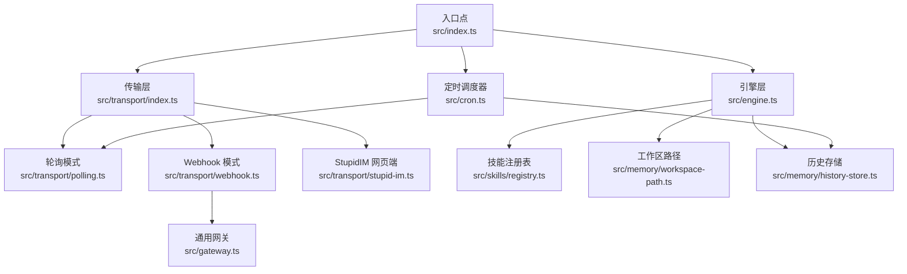
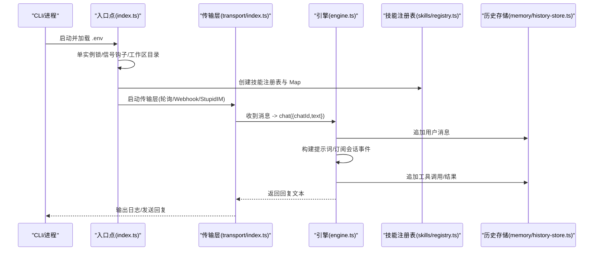
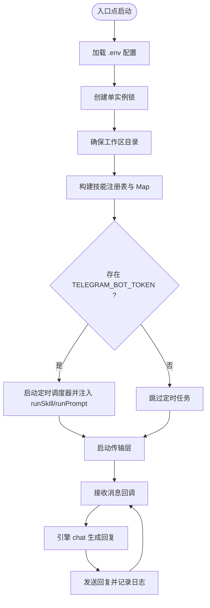
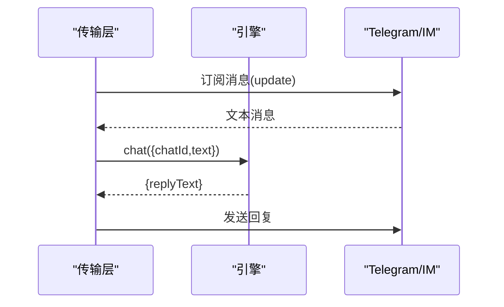
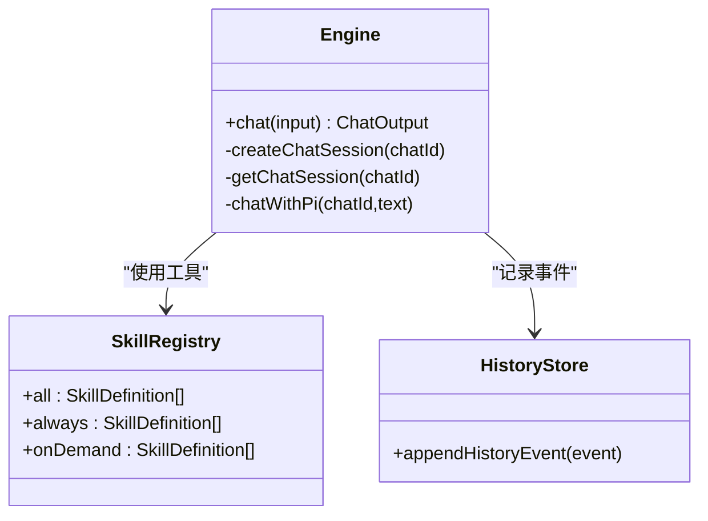
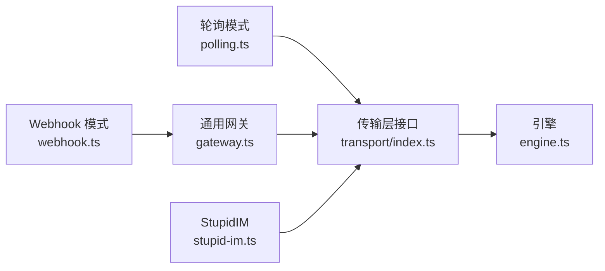
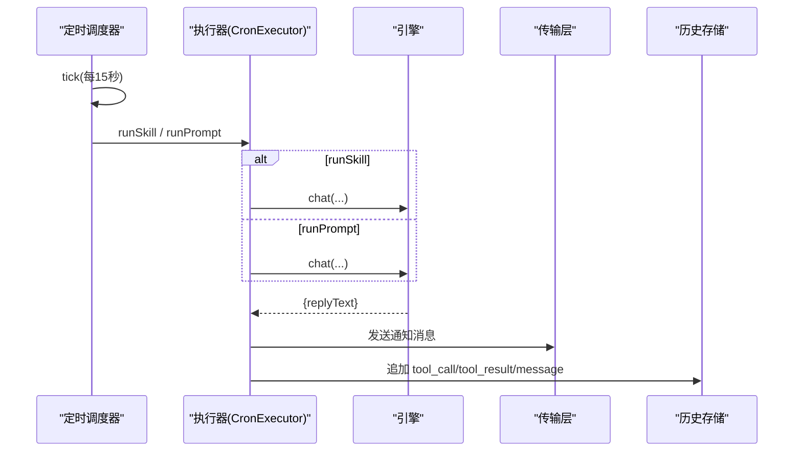
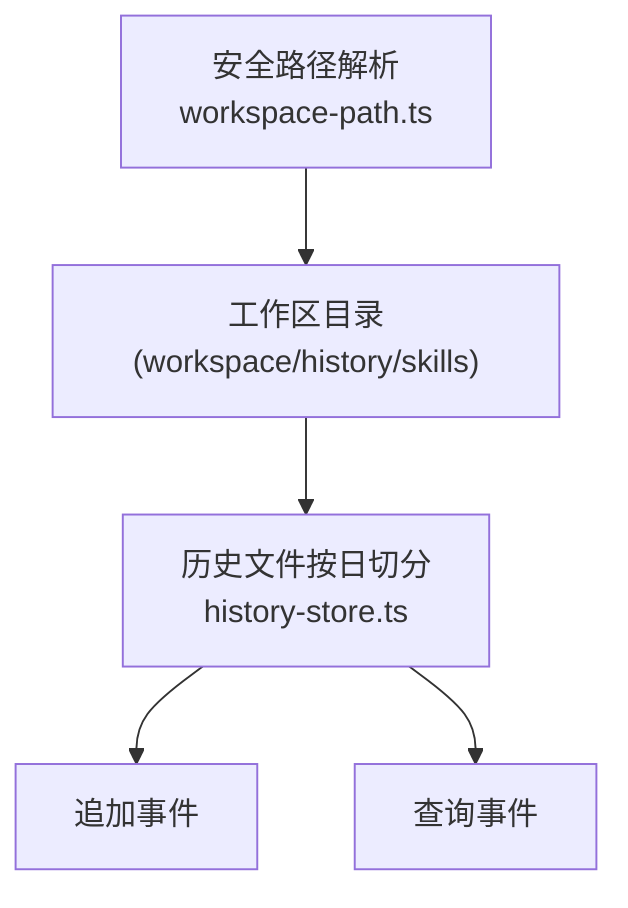
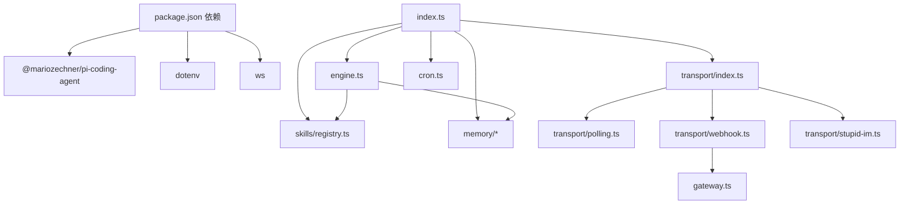

# 核心组件关系

<cite>
**本文档引用的文件**
- [src/index.ts](file://src/index.ts)
- [src/engine.ts](file://src/engine.ts)
- [src/transport/index.ts](file://src/transport/index.ts)
- [src/transport/polling.ts](file://src/transport/polling.ts)
- [src/transport/webhook.ts](file://src/transport/webhook.ts)
- [src/transport/stupid-im.ts](file://src/transport/stupid-im.ts)
- [src/gateway.ts](file://src/gateway.ts)
- [src/skills/registry.ts](file://src/skills/registry.ts)
- [src/skills/contracts.ts](file://src/skills/contracts.ts)
- [src/memory/workspace-path.ts](file://src/memory/workspace-path.ts)
- [src/memory/history-store.ts](file://src/memory/history-store.ts)
- [src/cron.ts](file://src/cron.ts)
- [package.json](file://package.json)
</cite>

## 目录
1. [简介](#简介)
2. [项目结构](#项目结构)
3. [核心组件](#核心组件)
4. [架构总览](#架构总览)
5. [详细组件分析](#详细组件分析)
6. [依赖分析](#依赖分析)
7. [性能考虑](#性能考虑)
8. [故障排查指南](#故障排查指南)
9. [结论](#结论)

## 简介
本文件面向 StupidClaw 的开发者与维护者，系统性梳理核心组件之间的依赖关系与交互模式，重点覆盖：
- 入口点如何协调各组件启动与生命周期
- 核心引擎如何与技能系统协作
- 传输层如何与引擎通信
- 内存管理如何为其他组件提供数据支持
- 组件间接口契约与数据传递格式
- 生命周期管理、初始化顺序、依赖注入方式、错误传播机制
- 组件依赖图与交互时序图

## 项目结构
StupidClaw 采用“入口点驱动 + 分层职责”的组织方式：
- 入口点负责环境准备、单实例锁、信号钩子、配置加载与组件编排
- 传输层抽象 Telegram 轮询/Webhook 与 StupidIM 网页端接入
- 引擎层封装会话、模型选择、工具注册、历史记录与回复生成
- 技能系统通过注册表集中管理内置与文件型技能
- 内存与工作区通过安全路径解析与历史存储保障数据持久化与隔离
- 定时调度器在后台周期性触发技能或提示词任务

图表来源
- [src/index.ts:112-216](file://src/index.ts#L112-L216)
- [src/transport/index.ts:47-71](file://src/transport/index.ts#L47-L71)
- [src/engine.ts:392-475](file://src/engine.ts#L392-L475)
- [src/cron.ts:251-265](file://src/cron.ts#L251-L265)

章节来源
- [src/index.ts:112-216](file://src/index.ts#L112-L216)
- [src/transport/index.ts:47-71](file://src/transport/index.ts#L47-L71)
- [src/engine.ts:392-475](file://src/engine.ts#L392-L475)
- [src/cron.ts:251-265](file://src/cron.ts#L251-L265)

## 核心组件
- 入口点（index.ts）
  - 负责 .env 加载、单实例锁、信号钩子、工作区目录确保
  - 构建技能注册表与 Map，注入定时调度器与传输层
  - 将引擎聊天能力暴露给传输层与定时器
- 传输层（transport/index.ts）
  - 统一对外消息接口，支持轮询、Webhook 与 StupidIM
  - 将上游消息转换为引擎可消费的结构
- 引擎（engine.ts）
  - 会话管理、模型选择、工具注册、系统提示拼装
  - 订阅会话事件，记录历史，生成最终回复
- 技能系统（skills/registry.ts）
  - 聚合内置技能与文件型技能元数据，区分 always/on-demand
- 内存与工作区（memory/*）
  - 安全路径解析与工作区目录创建
  - 历史事件追加与查询
- 定时调度器（cron.ts）
  - 解析 cron 表达式，周期性触发技能或提示词任务
  - 通过传输层发送通知消息

章节来源
- [src/index.ts:112-216](file://src/index.ts#L112-L216)
- [src/transport/index.ts:5-14](file://src/transport/index.ts#L5-L14)
- [src/engine.ts:19-32](file://src/engine.ts#L19-L32)
- [src/skills/registry.ts:13-17](file://src/skills/registry.ts#L13-L17)
- [src/memory/workspace-path.ts:37-42](file://src/memory/workspace-path.ts#L37-L42)
- [src/memory/history-store.ts:37-42](file://src/memory/history-store.ts#L37-L42)
- [src/cron.ts:5-14](file://src/cron.ts#L5-L14)

## 架构总览
下图展示从入口点到引擎、传输层、技能系统与内存的历史记录的总体交互：

图表来源
- [src/index.ts:112-216](file://src/index.ts#L112-L216)
- [src/transport/index.ts:47-71](file://src/transport/index.ts#L47-L71)
- [src/engine.ts:680-705](file://src/engine.ts#L680-L705)
- [src/memory/history-store.ts:37-42](file://src/memory/history-store.ts#L37-L42)

## 详细组件分析

### 入口点（index.ts）生命周期与依赖注入
- 初始化阶段
  - 解析命令行参数，支持 --config 指定 .env 路径；若未找到则给出友好提示
  - 创建单实例锁，注册 SIGINT/SIGTERM 与 exit 钩子，保证优雅退出
  - 确保工作区目录存在
- 组件装配
  - 创建技能注册表并构建 name->skill 的 Map
  - 若存在 TELEGRAM_BOT_TOKEN，则启动定时调度器，并注入：
    - runSkill：根据 skillName 从 Map 取出技能并执行
    - runPrompt：将 sessionKey 与 prompt 交由引擎 chat 生成回复
  - 启动传输层，注入消息回调：
    - 发送 typing 动作
    - 调用引擎 chat 生成回复
    - 发送最终回复并输出日志
- 错误传播
  - 顶层 main 捕获异常并输出致命错误，进程以非零码退出

图表来源
- [src/index.ts:112-216](file://src/index.ts#L112-L216)

章节来源
- [src/index.ts:112-216](file://src/index.ts#L112-L216)

### 传输层（transport/index.ts）与引擎交互契约
- 接口契约
  - IncomingMessage：包含 updateId、chatId、text、reply、sendChatAction
  - MessageHandler：接收 IncomingMessage 并异步处理
- 模式选择
  - 若配置 STUPID_IM_TOKEN 则启动 StupidIM 网页端
  - 若未配置 TELEGRAM_BOT_TOKEN 则跳过 Telegram
  - 根据 TELEGRAM_MODE 选择轮询或 Webhook
- 与引擎的交互
  - 在消息到达时，调用引擎 chat({ chatId, text })，得到 { replyText }
  - 将回复通过底层 sendMessage 发送

图表来源
- [src/transport/index.ts:47-71](file://src/transport/index.ts#L47-L71)
- [src/engine.ts:680-705](file://src/engine.ts#L680-L705)

章节来源
- [src/transport/index.ts:5-14](file://src/transport/index.ts#L5-L14)
- [src/transport/index.ts:47-71](file://src/transport/index.ts#L47-L71)
- [src/engine.ts:19-32](file://src/engine.ts#L19-L32)

### 引擎（engine.ts）与技能系统交互
- 会话与工具
  - 通过 createAgentSession 创建 AgentSession，注入：
    - 模型注册表与选定模型
    - 工作区路径与资源加载器
    - 编程工具与自定义工具（来自技能注册表）
- 技能暴露策略
  - 注册表区分 always 与 on-demand 技能，引擎在系统提示中按需注入
- 历史记录
  - 订阅会话事件，将工具调用与结果写入历史存储
- 错误处理
  - 对模型 API Key 缺失进行归一化提示
  - 对回复为空时提供回退策略

图表来源
- [src/engine.ts:392-475](file://src/engine.ts#L392-L475)
- [src/skills/registry.ts:23-54](file://src/skills/registry.ts#L23-L54)
- [src/memory/history-store.ts:37-42](file://src/memory/history-store.ts#L37-L42)

章节来源
- [src/engine.ts:392-475](file://src/engine.ts#L392-L475)
- [src/skills/registry.ts:23-54](file://src/skills/registry.ts#L23-L54)
- [src/memory/history-store.ts:37-42](file://src/memory/history-store.ts#L37-L42)

### 传输层具体实现（轮询/Webhook/StupidIM）
- 轮询模式（polling.ts）
  - 持续拉取 Telegram 更新，过滤有效消息，转换为 IncomingMessage
  - 发送 typing 动作与最终回复
- Webhook 模式（webhook.ts）
  - 设置 Telegram Webhook，启动通用网关（gateway.ts），校验 secret token
  - 将网关收到的 JSON payload 转换为 IncomingMessage
- StupidIM 网页端（stupid-im.ts）
  - 提供静态页面与 WebSocket 服务，基于 URL 参数鉴权
  - 将前端消息转为 IncomingMessage 并回调处理

图表来源
- [src/transport/polling.ts:52-89](file://src/transport/polling.ts#L52-L89)
- [src/transport/webhook.ts:41-85](file://src/transport/webhook.ts#L41-L85)
- [src/transport/stupid-im.ts:24-105](file://src/transport/stupid-im.ts#L24-L105)
- [src/gateway.ts:27-79](file://src/gateway.ts#L27-L79)

章节来源
- [src/transport/polling.ts:52-89](file://src/transport/polling.ts#L52-L89)
- [src/transport/webhook.ts:41-85](file://src/transport/webhook.ts#L41-L85)
- [src/transport/stupid-im.ts:24-105](file://src/transport/stupid-im.ts#L24-L105)
- [src/gateway.ts:27-79](file://src/gateway.ts#L27-L79)

### 定时调度器（cron.ts）与引擎/传输层集成
- 执行器契约（CronExecutor）
  - runSkill(skillName, args)：执行技能并返回 { ok, output }
  - runPrompt(sessionKey, prompt)：执行引擎 chat 并返回 { ok, output }
- 触发流程
  - 每 15 秒扫描一次任务
  - 匹配 cron 表达式且未在当前分钟触发过
  - 先写入 lastTriggeredAt，再调用执行器
  - 通过传输层发送通知消息，并记录历史事件

图表来源
- [src/cron.ts:147-249](file://src/cron.ts#L147-L249)
- [src/engine.ts:680-705](file://src/engine.ts#L680-L705)
- [src/transport/polling.ts:215-242](file://src/transport/polling.ts#L215-L242)
- [src/memory/history-store.ts:37-42](file://src/memory/history-store.ts#L37-L42)

章节来源
- [src/cron.ts:5-14](file://src/cron.ts#L5-L14)
- [src/cron.ts:251-265](file://src/cron.ts#L251-L265)

### 内存管理与数据支持
- 工作区路径（workspace-path.ts）
  - 提供安全路径解析与工作区目录确保
  - 限制相对路径、禁止 .. 跨越
- 历史存储（history-store.ts）
  - 按日期切分 JSONL 文件，支持追加与查询
  - 事件类型涵盖 message、tool_call、tool_result

图表来源
- [src/memory/workspace-path.ts:32-42](file://src/memory/workspace-path.ts#L32-L42)
- [src/memory/history-store.ts:29-82](file://src/memory/history-store.ts#L29-L82)

章节来源
- [src/memory/workspace-path.ts:32-42](file://src/memory/workspace-path.ts#L32-L42)
- [src/memory/history-store.ts:29-82](file://src/memory/history-store.ts#L29-L82)

## 依赖分析
- 外部依赖
  - @mariozechner/pi-coding-agent：引擎会话、模型注册表、工具定义
  - dotenv：.env 加载
  - ws：WebSocket 支持（StupidIM）
- 内部模块耦合
  - index.ts 依赖 transport、engine、skills、memory、cron
  - engine.ts 依赖 skills、memory、workspace-path
  - transport/* 依赖 polling/webhook/stupid-im 与 gateway
  - cron.ts 依赖 transport/polling 与 memory/history-store

图表来源
- [package.json:30-37](file://package.json#L30-L37)
- [src/index.ts:6-10](file://src/index.ts#L6-L10)
- [src/engine.ts:11-17](file://src/engine.ts#L11-L17)
- [src/transport/index.ts:1-4](file://src/transport/index.ts#L1-L4)
- [src/cron.ts:1-4](file://src/cron.ts#L1-L4)

章节来源
- [package.json:30-37](file://package.json#L30-L37)
- [src/index.ts:6-10](file://src/index.ts#L6-L10)
- [src/engine.ts:11-17](file://src/engine.ts#L11-L17)
- [src/transport/index.ts:1-4](file://src/transport/index.ts#L1-L4)
- [src/cron.ts:1-4](file://src/cron.ts#L1-L4)

## 性能考虑
- 传输层
  - 轮询模式采用长轮询与错误重试，避免频繁短连接开销
  - Webhook 模式减少轮询等待，降低延迟
- 引擎
  - 会话复用（按 chatId 缓存），避免重复初始化
  - 流式事件订阅，尽早输出增量文本
- 历史存储
  - JSONL 按日切分，避免单文件过大
  - 追加写入，减少随机 IO
- 定时调度
  - 固定 15 秒 tick，避免过于频繁的 LLM 调用

## 故障排查指南
- API Key 缺失或错误
  - 引擎对模型调用异常进行归一化，提示缺失 provider 或配置错误
- Telegram Webhook 冲突
  - 轮询模式遇到 409 时自动禁用 webhook 再次拉取
- Webhook 校验失败
  - secret token 不匹配返回 401，检查 TELEGRAM_WEBHOOK_SECRET
- StupidIM 未授权
  - WebSocket 连接需携带正确 token，否则 4001 关闭
- 历史文件读取异常
  - 未找到返回空列表；其他错误抛出以便上层捕获

章节来源
- [src/engine.ts:162-186](file://src/engine.ts#L162-L186)
- [src/transport/polling.ts:57-60](file://src/transport/polling.ts#L57-L60)
- [src/transport/webhook.ts:45-57](file://src/transport/webhook.ts#L45-L57)
- [src/transport/stupid-im.ts:65-71](file://src/transport/stupid-im.ts#L65-L71)
- [src/memory/history-store.ts:72-82](file://src/memory/history-store.ts#L72-L82)

## 结论
StupidClaw 通过入口点统一编排，形成“传输层—引擎—技能系统—内存”的清晰流水线。引擎以会话为中心，结合技能注册表与历史记录，实现可控的工具披露与长期记忆；传输层提供多种接入方式，满足不同部署场景；定时调度器在后台维持自动化能力。整体设计强调可扩展、可维护与可观测性，便于后续迭代与问题定位。