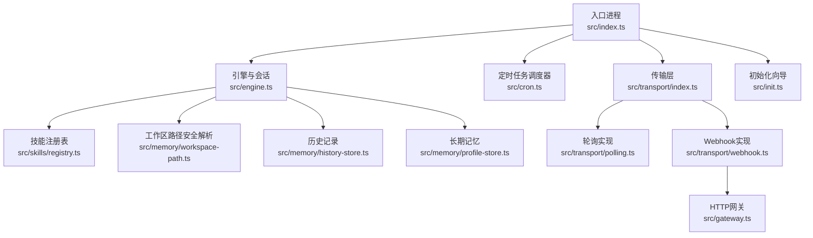
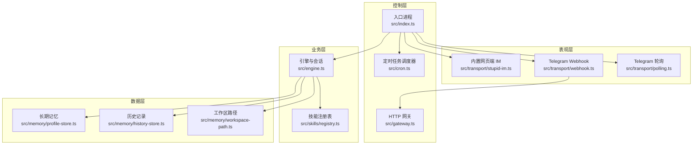
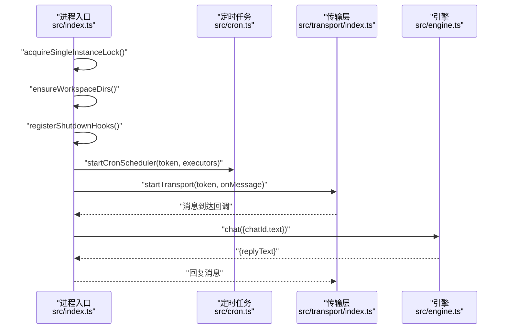
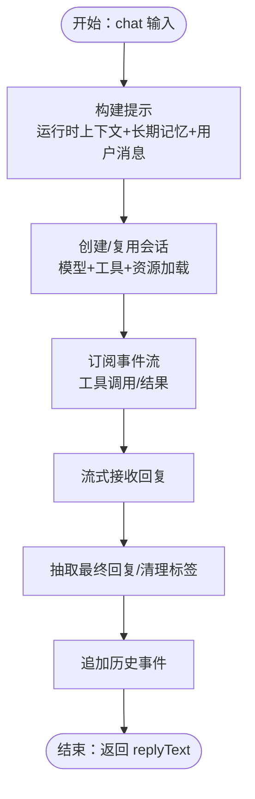
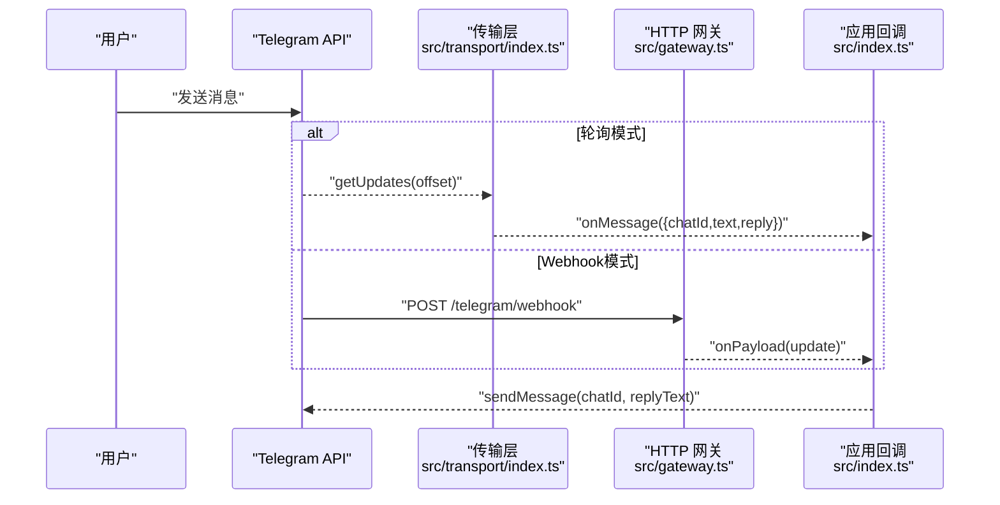
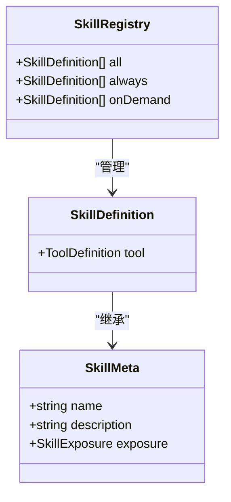
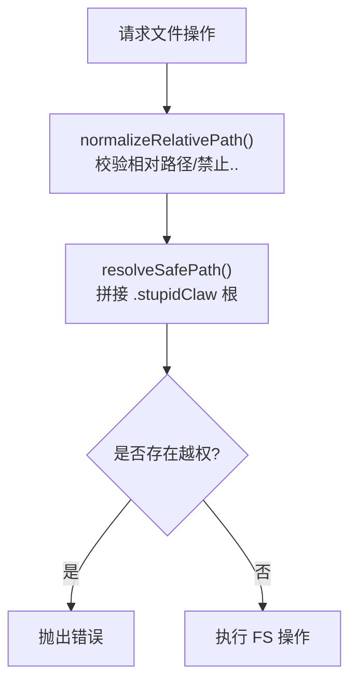
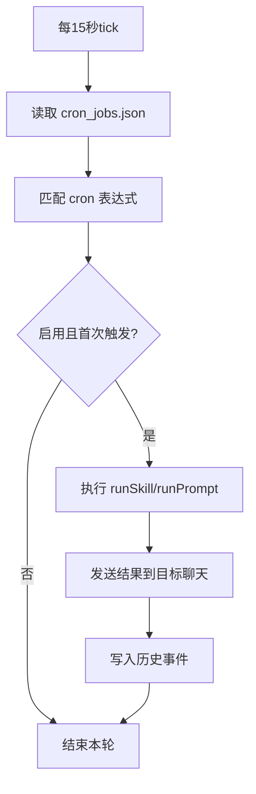
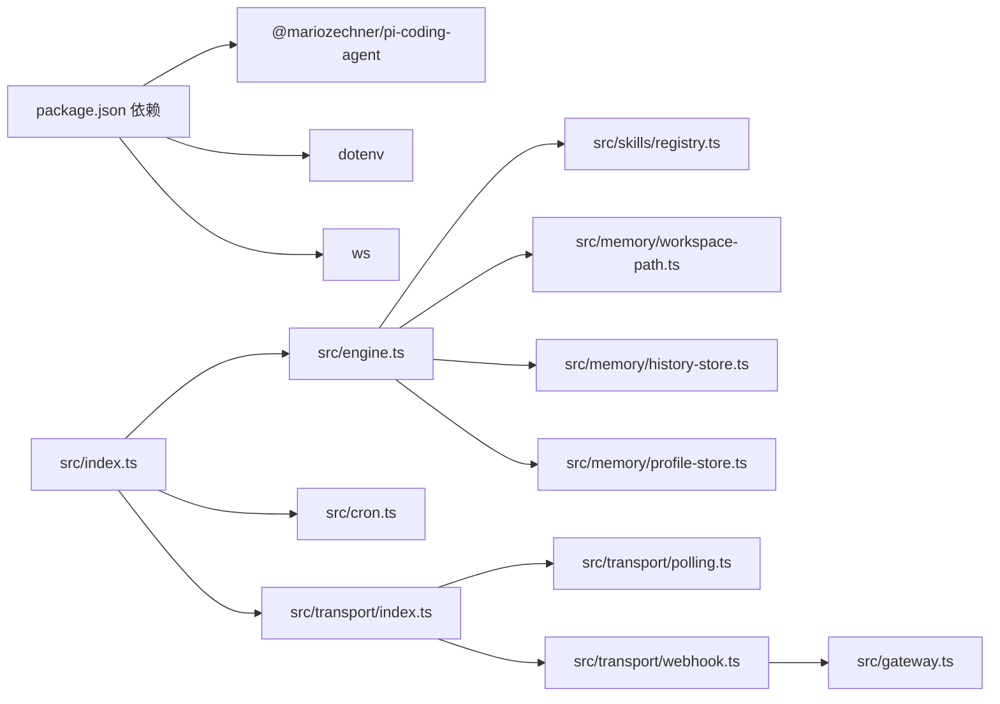

# 系统设计概述

<cite>
**本文档引用的文件**
- [README.md](file://README.md)
- [package.json](file://package.json)
- [src/index.ts](file://src/index.ts)
- [src/engine.ts](file://src/engine.ts)
- [src/gateway.ts](file://src/gateway.ts)
- [src/init.ts](file://src/init.ts)
- [src/skills/registry.ts](file://src/skills/registry.ts)
- [src/skills/contracts.ts](file://src/skills/contracts.ts)
- [src/transport/index.ts](file://src/transport/index.ts)
- [src/transport/polling.ts](file://src/transport/polling.ts)
- [src/transport/webhook.ts](file://src/transport/webhook.ts)
- [src/cron.ts](file://src/cron.ts)
- [src/memory/workspace-path.ts](file://src/memory/workspace-path.ts)
- [src/memory/history-store.ts](file://src/memory/history-store.ts)
- [src/memory/profile-store.ts](file://src/memory/profile-store.ts)
</cite>

## 目录
1. [引言](#引言)
2. [项目结构](#项目结构)
3. [核心组件](#核心组件)
4. [架构总览](#架构总览)
5. [详细组件分析](#详细组件分析)
6. [依赖分析](#依赖分析)
7. [性能考虑](#性能考虑)
8. [故障排查指南](#故障排查指南)
9. [结论](#结论)

## 引言
本系统旨在提供一个“极简”的本地 Agent 运行平台，基于统一的引擎与可插拔技能体系，通过轮询或 Webhook 接收消息，结合长期记忆与历史记录，实现可控、可审计、可扩展的对话与自动化能力。系统强调：
- 极简主义：最小依赖、纯文本存储、无数据库与向量库。
- 安全性：沙盒路径限制、单实例锁、严格的文件系统访问控制。
- 可扩展性：插件化技能注册表、可按需披露的工具集。
- 易用性：一键初始化配置、内置网页端 IM、默认 Telegram 轮询。

## 项目结构
系统采用按功能域分层的模块化组织方式：
- 入口与生命周期：src/index.ts 负责进程初始化、单实例锁、优雅关闭、传输层启动与调度器启动。
- 引擎与会话：src/engine.ts 负责模型选择、会话创建、提示构建、工具订阅与回复抽取。
- 传输层：src/transport/* 实现 Telegram 轮询与 Webhook，以及内置网页端 IM。
- 技能系统：src/skills/* 定义技能契约与注册表，支持内置技能与文件型技能。
- 内存与持久化：src/memory/* 提供工作区路径安全解析、历史事件追加与查询、长期记忆 profile 管理。
- 网关与网关式 Webhook：src/gateway.ts 提供通用 HTTP 网关，供 Webhook 模式使用。
- 定时任务：src/cron.ts 提供基于 cron 表达式的定时触发与执行。
- 初始化：src/init.ts 提供交互式初始化向导，生成 .env 配置。

**图表来源**
- [src/index.ts:112-216](file://src/index.ts#L112-L216)
- [src/engine.ts:392-475](file://src/engine.ts#L392-L475)
- [src/transport/index.ts:47-71](file://src/transport/index.ts#L47-L71)
- [src/transport/polling.ts:52-89](file://src/transport/polling.ts#L52-L89)
- [src/transport/webhook.ts:41-86](file://src/transport/webhook.ts#L41-L86)
- [src/gateway.ts:27-79](file://src/gateway.ts#L27-L79)
- [src/cron.ts:251-265](file://src/cron.ts#L251-L265)
- [src/memory/workspace-path.ts:37-42](file://src/memory/workspace-path.ts#L37-L42)
- [src/memory/history-store.ts:37-42](file://src/memory/history-store.ts#L37-L42)
- [src/memory/profile-store.ts:112-132](file://src/memory/profile-store.ts#L112-L132)
- [src/skills/registry.ts:23-55](file://src/skills/registry.ts#L23-L55)
- [src/init.ts:224-339](file://src/init.ts#L224-L339)

**章节来源**
- [README.md:22-52](file://README.md#L22-L52)
- [package.json:1-39](file://package.json#L1-L39)

## 核心组件
- 进程生命周期与单实例锁
  - 在入口处创建工作区目录与锁文件，确保同一时间仅有一个实例运行；监听 SIGINT/SIGTERM 与 exit，释放锁后退出。
  - 参考：[src/index.ts:45-84](file://src/index.ts#L45-L84)
- 引擎与会话管理
  - 动态选择模型与供应商，创建 Agent 会话，订阅工具执行事件并写入历史；构建带运行时上下文与长期记忆的提示。
  - 参考：[src/engine.ts:392-475](file://src/engine.ts#L392-L475)、[src/engine.ts:484-509](file://src/engine.ts#L484-L509)
- 传输层
  - 支持 Telegram 轮询与 Webhook 两种模式；Webhook 模式通过内置 HTTP 网关接收更新并转发给消息处理器。
  - 参考：[src/transport/index.ts:47-71](file://src/transport/index.ts#L47-L71)、[src/transport/webhook.ts:41-86](file://src/transport/webhook.ts#L41-L86)
- 技能系统
  - 通过注册表集中管理内置技能与文件型技能，支持“总是暴露”和“按需暴露”，并提供技能列表查询。
  - 参考：[src/skills/registry.ts:23-55](file://src/skills/registry.ts#L23-L55)、[src/skills/contracts.ts:6-20](file://src/skills/contracts.ts#L6-L20)
- 内存与持久化
  - 工作区路径安全解析，防止路径穿越；历史记录采用每日 JSONL 追加；长期记忆以 Markdown 结构化存储。
  - 参考：[src/memory/workspace-path.ts:32-42](file://src/memory/workspace-path.ts#L32-L42)、[src/memory/history-store.ts:37-83](file://src/memory/history-store.ts#L37-L83)、[src/memory/profile-store.ts:112-132](file://src/memory/profile-store.ts#L112-L132)
- 定时任务
  - 基于 cron 表达式逐分钟扫描，去重触发，支持技能调用与提示驱动两类任务，并向目标聊天发送结果。
  - 参考：[src/cron.ts:85-109](file://src/cron.ts#L85-L109)、[src/cron.ts:171-249](file://src/cron.ts#L171-L249)
- 初始化向导
  - 交互式引导用户选择供应商、模型、密钥、Telegram 与网页端配置，生成 .env。
  - 参考：[src/init.ts:224-339](file://src/init.ts#L224-L339)

**章节来源**
- [src/index.ts:112-216](file://src/index.ts#L112-L216)
- [src/engine.ts:392-475](file://src/engine.ts#L392-L475)
- [src/transport/index.ts:47-71](file://src/transport/index.ts#L47-L71)
- [src/skills/registry.ts:23-55](file://src/skills/registry.ts#L23-L55)
- [src/memory/workspace-path.ts:32-42](file://src/memory/workspace-path.ts#L32-L42)
- [src/memory/history-store.ts:37-83](file://src/memory/history-store.ts#L37-L83)
- [src/memory/profile-store.ts:112-132](file://src/memory/profile-store.ts#L112-L132)
- [src/cron.ts:85-109](file://src/cron.ts#L85-L109)
- [src/cron.ts:171-249](file://src/cron.ts#L171-L249)
- [src/init.ts:224-339](file://src/init.ts#L224-L339)

## 架构总览
系统采用“入口进程 + 多模块协作”的分层架构：
- 表现层：传输层负责消息接入（轮询/Webhook），内置网页端 IM 作为替代入口。
- 控制层：入口进程协调生命周期、单实例锁、传输层与定时任务调度器。
- 业务层：引擎负责对话与工具执行，技能注册表提供工具集合。
- 数据层：工作区路径安全解析 + 历史与长期记忆文件存储。

**图表来源**
- [src/index.ts:112-216](file://src/index.ts#L112-L216)
- [src/transport/polling.ts:52-89](file://src/transport/polling.ts#L52-L89)
- [src/transport/webhook.ts:41-86](file://src/transport/webhook.ts#L41-L86)
- [src/gateway.ts:27-79](file://src/gateway.ts#L27-L79)
- [src/cron.ts:251-265](file://src/cron.ts#L251-L265)
- [src/engine.ts:392-475](file://src/engine.ts#L392-L475)
- [src/skills/registry.ts:23-55](file://src/skills/registry.ts#L23-L55)
- [src/memory/workspace-path.ts:32-42](file://src/memory/workspace-path.ts#L32-L42)
- [src/memory/history-store.ts:37-83](file://src/memory/history-store.ts#L37-L83)
- [src/memory/profile-store.ts:112-132](file://src/memory/profile-store.ts#L112-L132)

## 详细组件分析

### 组件A：入口进程与生命周期管理
- 职责
  - 解析命令行参数，支持 --config 指定 .env 路径。
  - 初始化工作区目录与单实例锁，监听信号进行优雅关闭。
  - 启动定时任务调度器与传输层，注入消息处理回调。
- 关键流程
  - 获取 TELEGRAM_BOT_TOKEN，若存在则启动定时任务与传输层。
  - 传输层回调中调用引擎 chat，处理消息并回复。
- 优雅关闭
  - 注册 SIGINT/SIGTERM 与 exit 钩子，释放锁后退出，保证资源回收。

**图表来源**
- [src/index.ts:112-216](file://src/index.ts#L112-L216)
- [src/cron.ts:251-265](file://src/cron.ts#L251-L265)
- [src/transport/index.ts:47-71](file://src/transport/index.ts#L47-L71)
- [src/engine.ts:680-705](file://src/engine.ts#L680-L705)

**章节来源**
- [src/index.ts:45-84](file://src/index.ts#L45-L84)
- [src/index.ts:112-216](file://src/index.ts#L112-L216)

### 组件B：引擎与会话（对话与工具执行）
- 职责
  - 选择模型与供应商，创建 Agent 会话，订阅工具执行事件，构建提示并抽取最终回复。
- 设计要点
  - 使用静态系统提示 + 文件型技能提示 + 运行时上下文 + 长期记忆，形成多模态提示。
  - 订阅事件流，将工具调用与结果写入历史，便于审计与回溯。
- 错误处理
  - 对 API Key 缺失等错误进行归一化提示，提升可诊断性。

**图表来源**
- [src/engine.ts:484-509](file://src/engine.ts#L484-L509)
- [src/engine.ts:511-607](file://src/engine.ts#L511-L607)
- [src/engine.ts:680-705](file://src/engine.ts#L680-L705)

**章节来源**
- [src/engine.ts:392-475](file://src/engine.ts#L392-L475)
- [src/engine.ts:484-509](file://src/engine.ts#L484-L509)
- [src/engine.ts:511-607](file://src/engine.ts#L511-L607)
- [src/engine.ts:680-705](file://src/engine.ts#L680-L705)

### 组件C：传输层（轮询与 Webhook）
- 职责
  - 轮询模式：周期性拉取消息，逐条处理并回复。
  - Webhook 模式：设置 Telegram Webhook，由网关接收更新并通过回调处理。
- 安全与健壮性
  - Webhook 模式支持 secret token 校验；轮询模式自动禁用冲突的 webhook 并恢复轮询。
  - 发送消息时优先 HTML 模式，失败时回退纯文本；超长消息自动切片。

**图表来源**
- [src/transport/index.ts:19-45](file://src/transport/index.ts#L19-L45)
- [src/transport/webhook.ts:41-86](file://src/transport/webhook.ts#L41-L86)
- [src/gateway.ts:27-79](file://src/gateway.ts#L27-L79)
- [src/transport/polling.ts:52-89](file://src/transport/polling.ts#L52-L89)

**章节来源**
- [src/transport/index.ts:47-71](file://src/transport/index.ts#L47-L71)
- [src/transport/webhook.ts:41-86](file://src/transport/webhook.ts#L41-L86)
- [src/transport/polling.ts:52-89](file://src/transport/polling.ts#L52-L89)
- [src/gateway.ts:27-79](file://src/gateway.ts#L27-L79)

### 组件D：技能系统（插件化扩展）
- 职责
  - 定义技能元数据与工具契约，集中注册内置技能与文件型技能。
  - 按“总是暴露/按需暴露”策略控制工具可见性，提供技能列表查询。
- 扩展机制
  - 新增技能只需实现 ToolDefinition 并加入注册表，即可被引擎动态发现与使用。

**图表来源**
- [src/skills/contracts.ts:6-20](file://src/skills/contracts.ts#L6-L20)
- [src/skills/registry.ts:13-55](file://src/skills/registry.ts#L13-L55)

**章节来源**
- [src/skills/contracts.ts:6-20](file://src/skills/contracts.ts#L6-L20)
- [src/skills/registry.ts:23-55](file://src/skills/registry.ts#L23-L55)

### 组件E：内存与持久化（安全沙盒与历史/记忆）
- 职责
  - 工作区路径安全解析：禁止绝对路径与路径穿越，限定在 .stupidClaw 根目录下。
  - 历史记录：按日切分 JSONL 文件，支持查询与限制条数。
  - 长期记忆：以 Markdown 结构化存储稳定事实、偏好与约束。
- 设计原则
  - 严格沙盒：所有文件操作均通过 resolveSafePath，避免越权访问。
  - 可审计：工具调用与结果均写入历史，便于追踪。

**图表来源**
- [src/memory/workspace-path.ts:6-35](file://src/memory/workspace-path.ts#L6-L35)

**章节来源**
- [src/memory/workspace-path.ts:32-42](file://src/memory/workspace-path.ts#L32-L42)
- [src/memory/history-store.ts:37-83](file://src/memory/history-store.ts#L37-L83)
- [src/memory/profile-store.ts:112-132](file://src/memory/profile-store.ts#L112-L132)

### 组件F：定时任务（Cron）
- 职责
  - 每 15 秒扫描一次，匹配 cron 表达式，去重触发，支持两类任务：
    - 技能调用：runSkill(skillName, args)
    - 提示驱动：runPrompt(sessionKey, prompt)
- 输出
  - 将执行结果通过 Telegram 发送至目标聊天，并写入历史事件。

**图表来源**
- [src/cron.ts:251-265](file://src/cron.ts#L251-L265)
- [src/cron.ts:171-249](file://src/cron.ts#L171-L249)

**章节来源**
- [src/cron.ts:85-109](file://src/cron.ts#L85-L109)
- [src/cron.ts:171-249](file://src/cron.ts#L171-L249)
- [src/cron.ts:251-265](file://src/cron.ts#L251-L265)

## 依赖分析
- 外部依赖
  - @mariozechner/pi-coding-agent：提供模型注册、会话管理、工具执行与资源加载。
  - dotenv：加载 .env 环境变量。
  - ws：WebSocket 支持（用于网页端 IM）。
- 内部模块耦合
  - 入口进程依赖传输层、定时任务、引擎与技能注册表。
  - 引擎依赖技能注册表、工作区路径、历史与长期记忆。
  - 传输层依赖轮询/网关实现，Webhook 依赖网关。
  - 定时任务依赖传输层消息发送与历史记录。

**图表来源**
- [package.json:30-37](file://package.json#L30-L37)
- [src/index.ts:112-216](file://src/index.ts#L112-L216)
- [src/engine.ts:392-475](file://src/engine.ts#L392-L475)
- [src/transport/index.ts:47-71](file://src/transport/index.ts#L47-L71)
- [src/transport/webhook.ts:41-86](file://src/transport/webhook.ts#L41-L86)
- [src/gateway.ts:27-79](file://src/gateway.ts#L27-L79)
- [src/cron.ts:251-265](file://src/cron.ts#L251-L265)

**章节来源**
- [package.json:30-37](file://package.json#L30-L37)
- [src/index.ts:112-216](file://src/index.ts#L112-L216)

## 性能考虑
- 会话复用：按 chatId 复用引擎会话，减少模型初始化开销。
- 流式回复：订阅事件流，尽早输出中间结果，改善感知延迟。
- 历史写入：异步追加历史事件，避免阻塞主流程。
- 定时任务：固定 15 秒扫描间隔，兼顾实时性与资源占用。
- 发送策略：优先 HTML 模式，失败回退纯文本；超长消息切片发送，降低失败概率。

## 故障排查指南
- 无法启动或提示缺少 Token
  - 检查 .env 是否存在与配置完整，必要时使用初始化向导生成配置。
  - 参考：[src/index.ts:28-40](file://src/index.ts#L28-L40)、[src/init.ts:224-339](file://src/init.ts#L224-L339)
- 单实例冲突
  - 若出现“另一个轮询实例已在运行”，删除 .stupidClaw/polling.lock 后重启。
  - 参考：[src/index.ts:45-63](file://src/index.ts#L45-L63)
- Telegram Webhook 冲突
  - 轮询模式会自动禁用冲突的 webhook；若使用 Webhook，确保 TELEGRAM_WEBHOOK_URL 与端口配置正确。
  - 参考：[src/transport/polling.ts:21-34](file://src/transport/polling.ts#L21-L34)、[src/transport/webhook.ts:41-57](file://src/transport/webhook.ts#L41-L57)
- 发送消息失败
  - 检查 TELEGRAM_BOT_TOKEN 与消息长度；系统会自动回退纯文本并切片发送。
  - 参考：[src/transport/polling.ts:215-242](file://src/transport/polling.ts#L215-L242)
- 定时任务未触发
  - 检查 cron 表达式、任务状态与目标聊天 ID；查看历史事件确认触发与结果。
  - 参考：[src/cron.ts:85-109](file://src/cron.ts#L85-L109)、[src/cron.ts:171-249](file://src/cron.ts#L171-L249)

**章节来源**
- [src/index.ts:28-40](file://src/index.ts#L28-L40)
- [src/index.ts:45-63](file://src/index.ts#L45-L63)
- [src/transport/polling.ts:21-34](file://src/transport/polling.ts#L21-L34)
- [src/transport/webhook.ts:41-57](file://src/transport/webhook.ts#L41-L57)
- [src/transport/polling.ts:215-242](file://src/transport/polling.ts#L215-L242)
- [src/cron.ts:85-109](file://src/cron.ts#L85-L109)
- [src/cron.ts:171-249](file://src/cron.ts#L171-L249)

## 结论
本系统通过清晰的分层与模块化设计，在保持极简与安全的前提下，提供了可扩展的对话与自动化能力。入口进程统一编排生命周期与传输、调度与引擎；引擎以会话为中心整合模型与工具；技能注册表实现插件化扩展；沙盒路径与历史/记忆持久化保障安全与可审计。配合轮询与 Webhook 的双通道接入，以及内置网页端 IM，系统在易用性与工程落地之间取得良好平衡。