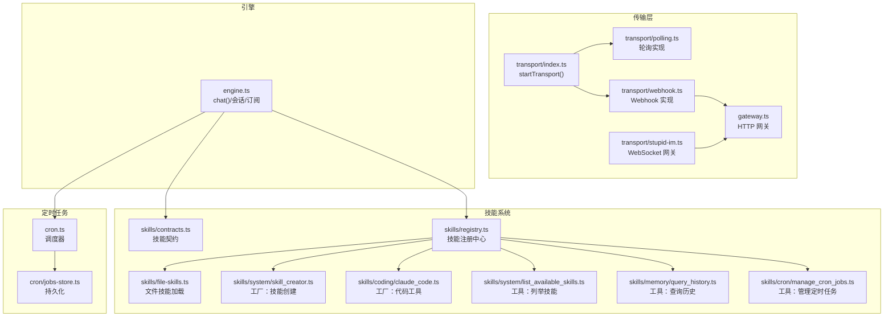
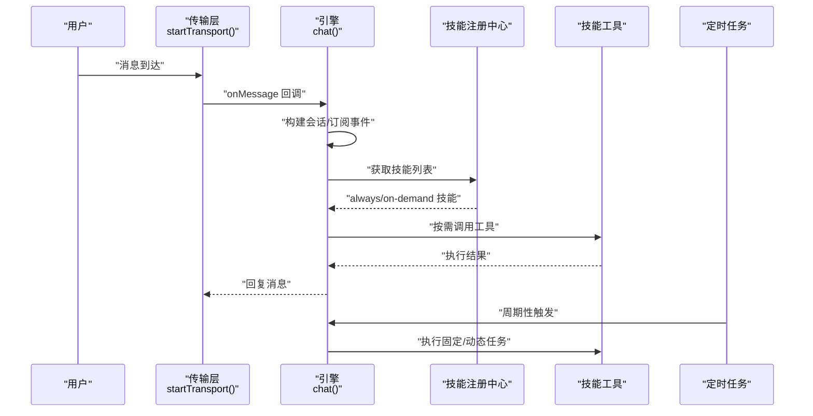
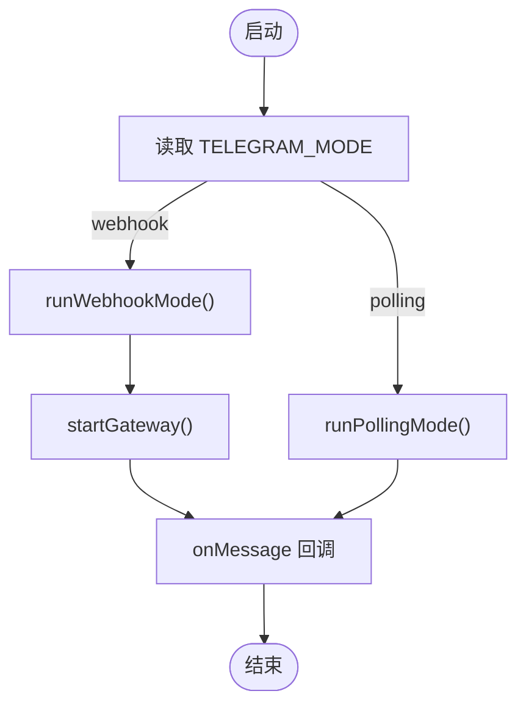
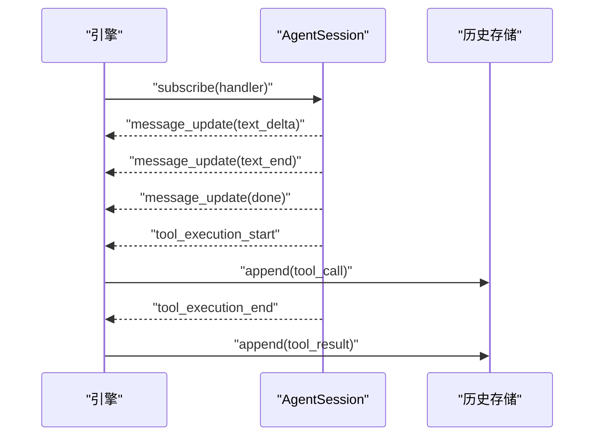
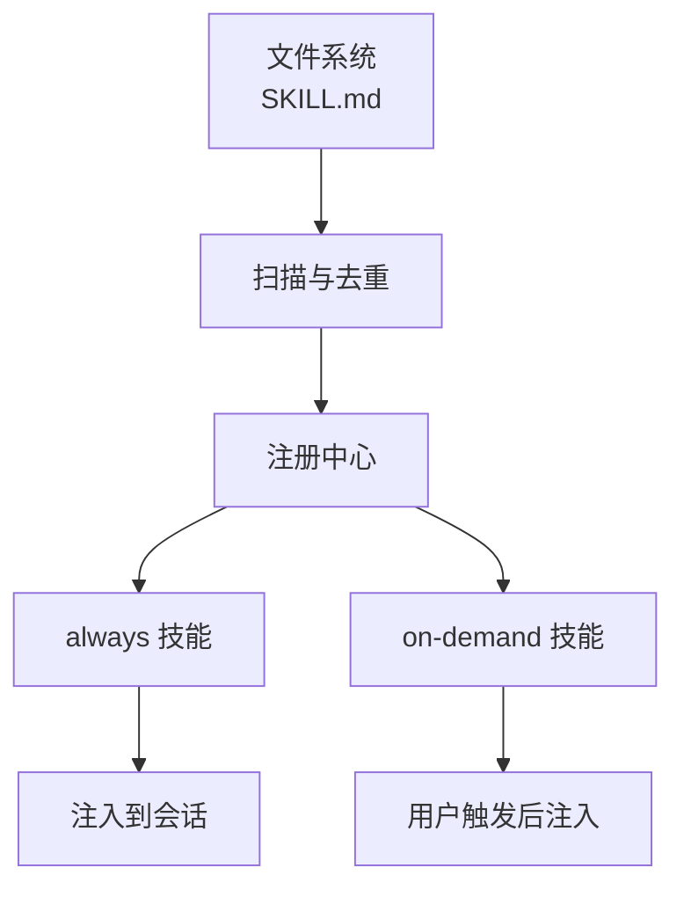
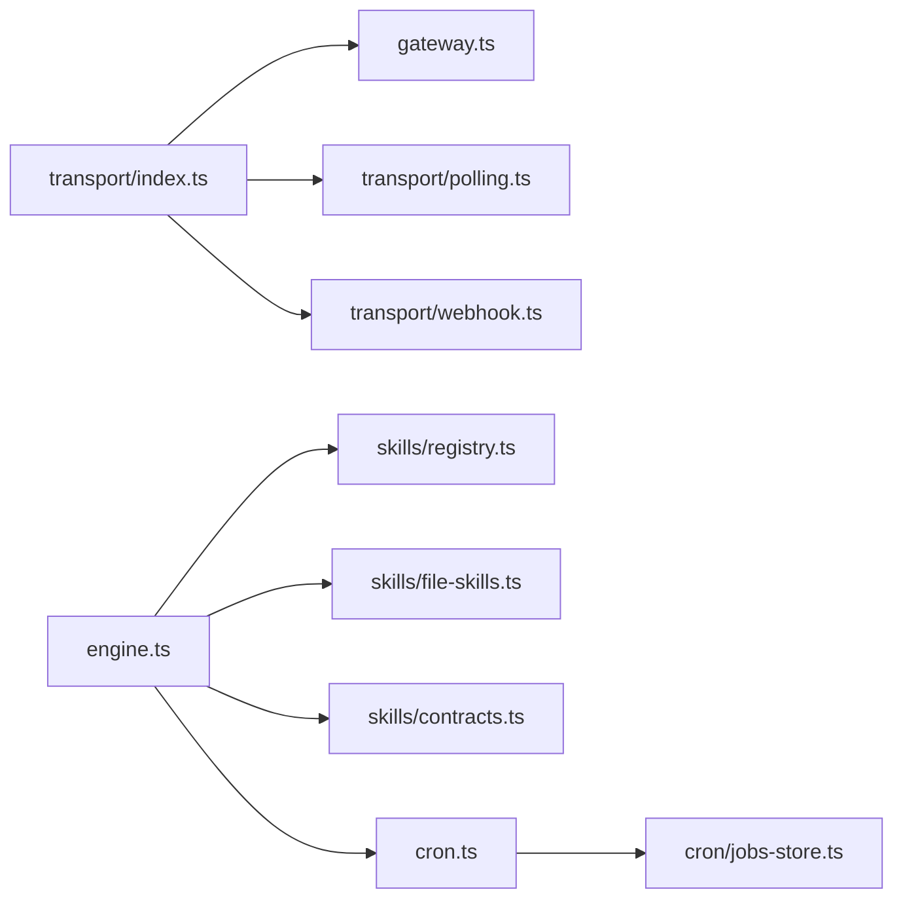

# 设计模式应用

<cite>
**本文引用的文件**
- [src/transport/index.ts](file://src/transport/index.ts)
- [src/transport/polling.ts](file://src/transport/polling.ts)
- [src/transport/webhook.ts](file://src/transport/webhook.ts)
- [src/transport/stupid-im.ts](file://src/transport/stupid-im.ts)
- [src/gateway.ts](file://src/gateway.ts)
- [src/engine.ts](file://src/engine.ts)
- [src/skills/registry.ts](file://src/skills/registry.ts)
- [src/skills/contracts.ts](file://src/skills/contracts.ts)
- [src/skills/system/skill_creator.ts](file://src/skills/system/skill_creator.ts)
- [src/skills/coding/claude_code.ts](file://src/skills/coding/claude_code.ts)
- [src/skills/memory/query_history.ts](file://src/skills/memory/query_history.ts)
- [src/skills/system/list_available_skills.ts](file://src/skills/system/list_available_skills.ts)
- [src/skills/cron/manage_cron_jobs.ts](file://src/skills/cron/manage_cron_jobs.ts)
- [src/skills/file-skills.ts](file://src/skills/file-skills.ts)
- [src/cron/jobs-store.ts](file://src/cron/jobs-store.ts)
- [src/cron.ts](file://src/cron.ts)
- [src/init.ts](file://src/init.ts)
</cite>

## 目录
1. [引言](#引言)
2. [项目结构](#项目结构)
3. [核心组件](#核心组件)
4. [架构总览](#架构总览)
5. [详细组件分析](#详细组件分析)
6. [依赖关系分析](#依赖关系分析)
7. [性能考量](#性能考量)
8. [故障排查指南](#故障排查指南)
9. [结论](#结论)
10. [附录](#附录)

## 引言
本文件聚焦于 StupidClaw 在实际业务中的设计模式落地实践，围绕以下主题展开：
- 策略模式：在传输层根据环境变量动态选择轮询或 Webhook 的运行策略
- 工厂模式：在技能系统中统一创建不同技能实例，屏蔽外部工具差异
- 观察者模式：在引擎中订阅会话事件流，实现对工具调用过程的可观测与记录
- 插件化模式：通过文件技能加载与技能注册中心，实现“按需披露”的可扩展技能生态

我们将结合代码路径与图示，解释每种模式如何解决特定的架构问题，并阐述它们之间的协同作用。

## 项目结构
StupidClaw 的核心模块分布清晰，围绕“传输层-引擎-技能系统-定时任务-网关”组织：
- 传输层：负责消息入口与出站，支持轮询、Webhook 与 StupidIM
- 引擎：封装会话、模型选择、工具注册与事件订阅
- 技能系统：技能契约、注册中心、文件技能加载、内置技能与工厂方法
- 定时任务：基于 cron 表达式的调度器与持久化存储
- 网关：HTTP/WebSocket 网关抽象，供 Webhook 与 StupidIM 使用



**图表来源**
- [src/transport/index.ts:47-70](file://src/transport/index.ts#L47-L70)
- [src/transport/polling.ts:52-89](file://src/transport/polling.ts#L52-L89)
- [src/transport/webhook.ts:41-84](file://src/transport/webhook.ts#L41-L84)
- [src/transport/stupid-im.ts:24-104](file://src/transport/stupid-im.ts#L24-L104)
- [src/gateway.ts:27-78](file://src/gateway.ts#L27-L78)
- [src/engine.ts:422-459](file://src/engine.ts#L422-L459)
- [src/skills/registry.ts:23-54](file://src/skills/registry.ts#L23-L54)
- [src/skills/file-skills.ts:26-48](file://src/skills/file-skills.ts#L26-L48)
- [src/skills/system/skill_creator.ts:65-311](file://src/skills/system/skill_creator.ts#L65-L311)
- [src/skills/coding/claude_code.ts:8-98](file://src/skills/coding/claude_code.ts#L8-L98)
- [src/skills/system/list_available_skills.ts:4-39](file://src/skills/system/list_available_skills.ts#L4-L39)
- [src/skills/memory/query_history.ts:5-56](file://src/skills/memory/query_history.ts#L5-L56)
- [src/skills/cron/manage_cron_jobs.ts:32-335](file://src/skills/cron/manage_cron_jobs.ts#L32-L335)
- [src/cron.ts:251-264](file://src/cron.ts#L251-L264)
- [src/cron/jobs-store.ts:124-146](file://src/cron/jobs-store.ts#L124-L146)

**章节来源**
- [src/transport/index.ts:1-71](file://src/transport/index.ts#L1-L71)
- [src/engine.ts:1-706](file://src/engine.ts#L1-L706)
- [src/skills/registry.ts:1-55](file://src/skills/registry.ts#L1-L55)
- [src/cron.ts:1-265](file://src/cron.ts#L1-L265)

## 核心组件
- 传输层选择器：根据环境变量在轮询与 Webhook 之间切换，隐藏底层差异
- 技能注册中心：集中创建与分类技能，暴露“always/on-demand”两类能力
- 引擎会话与订阅：统一接入模型与工具，订阅事件流用于可观测性
- 定时任务调度器：解析 cron 表达式，持久化任务状态，触发执行
- 网关抽象：统一处理 HTTP/WebSocket 请求，校验与解码

**章节来源**
- [src/transport/index.ts:47-70](file://src/transport/index.ts#L47-L70)
- [src/skills/registry.ts:23-54](file://src/skills/registry.ts#L23-L54)
- [src/engine.ts:520-590](file://src/engine.ts#L520-L590)
- [src/cron.ts:251-264](file://src/cron.ts#L251-L264)
- [src/gateway.ts:27-78](file://src/gateway.ts#L27-L78)

## 架构总览
下图展示从消息入口到技能执行的关键流程，以及设计模式的落点：



**图表来源**
- [src/transport/index.ts:47-70](file://src/transport/index.ts#L47-L70)
- [src/engine.ts:680-705](file://src/engine.ts#L680-L705)
- [src/skills/registry.ts:23-54](file://src/skills/registry.ts#L23-L54)
- [src/cron.ts:171-249](file://src/cron.ts#L171-L249)

## 详细组件分析

### 策略模式：传输层的选择机制
- 目标：在“轮询/ Webhook/StupidIM”之间按环境变量动态选择，保持上层调用一致
- 关键实现：
  - 传输入口根据 TELEGRAM_MODE 选择轮询或 Webhook
  - Webhook 模式通过网关抽象处理 HTTP 请求并转发给 onMessage
  - StupidIM 通过 WebSocket 注入 onMessage，形成统一回调
- 优势：无需上层感知底层差异，便于部署与运维切换



**图表来源**
- [src/transport/index.ts:61-69](file://src/transport/index.ts#L61-L69)
- [src/transport/webhook.ts:41-84](file://src/transport/webhook.ts#L41-L84)
- [src/gateway.ts:27-78](file://src/gateway.ts#L27-L78)

**章节来源**
- [src/transport/index.ts:47-70](file://src/transport/index.ts#L47-L70)
- [src/transport/webhook.ts:19-84](file://src/transport/webhook.ts#L19-L84)
- [src/transport/stupid-im.ts:24-104](file://src/transport/stupid-im.ts#L24-L104)
- [src/gateway.ts:27-78](file://src/gateway.ts#L27-L78)

### 工厂模式：技能创建与扩展
- 目标：以统一接口创建不同技能，屏蔽外部工具差异，支持“按需披露”
- 关键实现：
  - 技能契约定义工具元数据与参数 Schema
  - 注册中心集中创建内置技能与文件技能，区分 always/on-demand
  - 工具方法（如 Claude Code、技能创建器）以工厂函数返回标准化 SkillDefinition
  - 文件技能通过目录扫描与去重，统一纳入注册中心
- 优势：新增技能只需遵循契约与工厂规范，即可无缝接入

```mermaid
classDiagram
class Contracts {
+SkillMeta
+SkillDefinition
+SkillExposure
}
class Registry {
+createSkillRegistry()
+all
+always
+onDemand
}
class FileSkills {
+loadStandardFileSkills()
+getStandardFileSkillMetas()
}
class SkillCreator {
+createSkillCreatorSkill()
}
class ClaudeCode {
+createClaudeCodeSkill()
}
class ListAvailableSkills {
+createListAvailableSkillsSkill()
}
class QueryHistory {
+createQueryHistorySkill()
}
class ManageCron {
+createManageCronJobsSkill()
Contracts <|.. Registry
Registry --> FileSkills
Registry --> SkillCreator
Registry --> ClaudeCode
Registry --> ListAvailableSkills
Registry --> QueryHistory
Registry --> ManageCron
```

**图表来源**
- [src/skills/contracts.ts:4-19](file://src/skills/contracts.ts#L4-L19)
- [src/skills/registry.ts:23-54](file://src/skills/registry.ts#L23-L54)
- [src/skills/file-skills.ts:26-64](file://src/skills/file-skills.ts#L26-L64)
- [src/skills/system/skill_creator.ts:65-311](file://src/skills/system/skill_creator.ts#L65-L311)
- [src/skills/coding/claude_code.ts:8-98](file://src/skills/coding/claude_code.ts#L8-L98)
- [src/skills/system/list_available_skills.ts:4-39](file://src/skills/system/list_available_skills.ts#L4-L39)
- [src/skills/memory/query_history.ts:5-56](file://src/skills/memory/query_history.ts#L5-L56)
- [src/skills/cron/manage_cron_jobs.ts:32-335](file://src/skills/cron/manage_cron_jobs.ts#L32-L335)

**章节来源**
- [src/skills/contracts.ts:1-20](file://src/skills/contracts.ts#L1-L20)
- [src/skills/registry.ts:23-54](file://src/skills/registry.ts#L23-L54)
- [src/skills/file-skills.ts:26-64](file://src/skills/file-skills.ts#L26-L64)
- [src/skills/system/skill_creator.ts:65-311](file://src/skills/system/skill_creator.ts#L65-L311)
- [src/skills/coding/claude_code.ts:8-98](file://src/skills/coding/claude_code.ts#L8-L98)
- [src/skills/system/list_available_skills.ts:4-39](file://src/skills/system/list_available_skills.ts#L4-L39)
- [src/skills/memory/query_history.ts:5-56](file://src/skills/memory/query_history.ts#L5-L56)
- [src/skills/cron/manage_cron_jobs.ts:32-335](file://src/skills/cron/manage_cron_jobs.ts#L32-L335)

### 观察者模式：引擎中的事件订阅
- 目标：在会话生命周期中捕获工具调用与输出，实现可观测与历史记录
- 关键实现：
  - 引擎订阅 AgentSession 事件流，收集工具调用开始/结束与最终文本
  - 将事件写入历史存储，便于后续审计与调试
- 优势：无需在各工具内部重复实现日志逻辑，集中处理、统一格式



**图表来源**
- [src/engine.ts:520-590](file://src/engine.ts#L520-L590)
- [src/engine.ts:477-482](file://src/engine.ts#L477-L482)

**章节来源**
- [src/engine.ts:520-590](file://src/engine.ts#L520-L590)
- [src/engine.ts:477-482](file://src/engine.ts#L477-L482)

### 插件化模式：技能扩展与“按需披露”
- 目标：通过文件系统与注册中心实现技能的动态发现与加载，控制暴露级别
- 关键实现：
  - 文件技能从内置与项目目录扫描，去重后统一纳入注册中心
  - 注册中心将技能分为 always 与 on-demand 两类，前者默认注入，后者按需调用
  - 技能创建器允许用户在运行时创建/更新 SKILL.md，形成可扩展的技能生态
- 优势：降低耦合，提升可维护性与可扩展性



**图表来源**
- [src/skills/file-skills.ts:26-48](file://src/skills/file-skills.ts#L26-L48)
- [src/skills/registry.ts:23-54](file://src/skills/registry.ts#L23-L54)
- [src/skills/system/skill_creator.ts:136-311](file://src/skills/system/skill_creator.ts#L136-L311)

**章节来源**
- [src/skills/file-skills.ts:26-64](file://src/skills/file-skills.ts#L26-L64)
- [src/skills/registry.ts:23-54](file://src/skills/registry.ts#L23-L54)
- [src/skills/system/skill_creator.ts:136-311](file://src/skills/system/skill_creator.ts#L136-L311)

## 依赖关系分析
- 传输层依赖网关与消息发送模块，对外暴露统一的 onMessage 回调
- 引擎依赖技能注册中心与文件技能，订阅会话事件并写入历史
- 定时任务依赖任务存储与引擎执行器，按分钟粒度检查并触发
- 技能系统依赖文件扫描与工具工厂，形成可扩展的工具集合



**图表来源**
- [src/transport/index.ts:1-71](file://src/transport/index.ts#L1-L71)
- [src/gateway.ts:1-79](file://src/gateway.ts#L1-L79)
- [src/engine.ts:1-706](file://src/engine.ts#L1-L706)
- [src/skills/registry.ts:1-55](file://src/skills/registry.ts#L1-L55)
- [src/skills/file-skills.ts:1-65](file://src/skills/file-skills.ts#L1-L65)
- [src/skills/contracts.ts:1-20](file://src/skills/contracts.ts#L1-L20)
- [src/cron.ts:1-265](file://src/cron.ts#L1-L265)
- [src/cron/jobs-store.ts:1-151](file://src/cron/jobs-store.ts#L1-L151)

**章节来源**
- [src/transport/index.ts:1-71](file://src/transport/index.ts#L1-L71)
- [src/engine.ts:1-706](file://src/engine.ts#L1-L706)
- [src/cron.ts:1-265](file://src/cron.ts#L1-L265)

## 性能考量
- 传输层
  - 轮询模式：长轮询 + 错误重试，适合简单部署；可通过 TELEGRAM_MODE 切换至 Webhook 降低延迟
  - Webhook 模式：依赖网关与服务器资源，需合理设置端口与并发
- 引擎
  - 会话复用：按 chatId 缓存会话，减少初始化开销
  - 订阅事件：仅在必要时开启，避免过多日志写入影响性能
- 技能系统
  - 文件技能扫描：避免重复扫描与重复注入，确保去重逻辑高效
  - 工具执行：对外部命令/网络调用设置超时与缓冲区限制
- 定时任务
  - 调度间隔：15 秒一次，避免过于频繁的 IO；任务执行前写入 lastTriggeredAt，防止重复触发

[本节为通用指导，不直接分析具体文件]

## 故障排查指南
- 传输层
  - Webhook 模式缺少 TELEGRAM_WEBHOOK_URL 或端口非法：检查环境变量与端口配置
  - Webhook 密钥不匹配：核对 x-telegram-bot-api-secret-token
- 引擎
  - API Key 未配置或无效：根据错误信息定位缺失的密钥环境变量
  - 会话订阅异常：检查事件处理器是否正确注册与注销
- 技能系统
  - 技能创建失败：确认 name 合法、description 存在、文件未重复创建
  - 外部工具不可用：如 claude CLI 未安装，按提示安装或调整执行路径
- 定时任务
  - cron 表达式不合法：确保五段格式正确
  - 任务重复触发：确认 lastTriggeredAt 写入与去重逻辑

**章节来源**
- [src/transport/webhook.ts:41-84](file://src/transport/webhook.ts#L41-L84)
- [src/engine.ts:162-186](file://src/engine.ts#L162-L186)
- [src/skills/system/skill_creator.ts:136-311](file://src/skills/system/skill_creator.ts#L136-L311)
- [src/skills/coding/claude_code.ts:56-95](file://src/skills/coding/claude_code.ts#L56-L95)
- [src/cron.ts:85-109](file://src/cron.ts#L85-L109)

## 结论
StupidClaw 通过策略模式、工厂模式、观察者模式与插件化模式，实现了“可配置、可扩展、可观测”的智能体系统：
- 策略模式让传输层在多种协议间灵活切换
- 工厂模式统一技能创建，降低外部依赖差异带来的复杂度
- 观察者模式将可观测性内聚在引擎层，简化工具侧实现
- 插件化模式通过文件系统与注册中心，实现“按需披露”的技能生态

这些模式协同工作，既满足了快速迭代的需求，也为后续的功能扩展与维护提供了清晰的架构基线。

[本节为总结性内容，不直接分析具体文件]

## 附录
- 初始化向导：提供交互式配置，生成 .env 并提示下一步启动方式
- 环境变量要点：STUPID_MODEL、TELEGRAM_MODE、TELEGRAM_WEBHOOK_URL、STUPID_IM_TOKEN、PORT 等

**章节来源**
- [src/init.ts:224-338](file://src/init.ts#L224-L338)