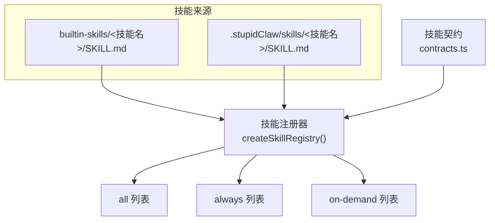
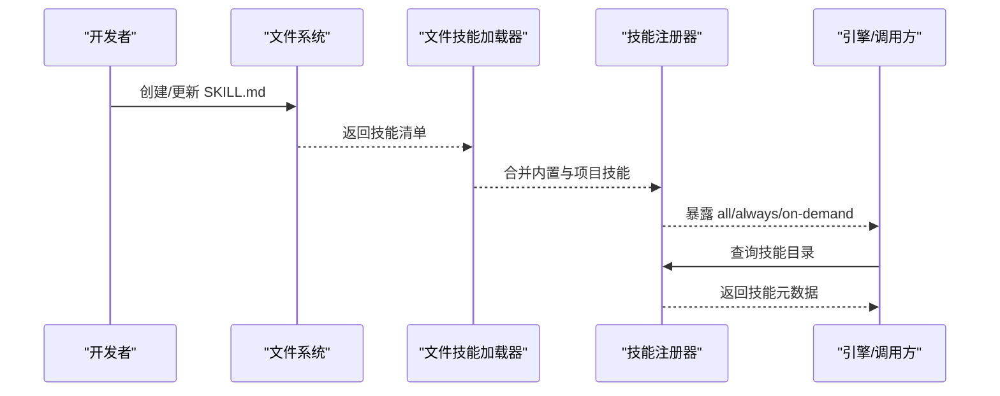
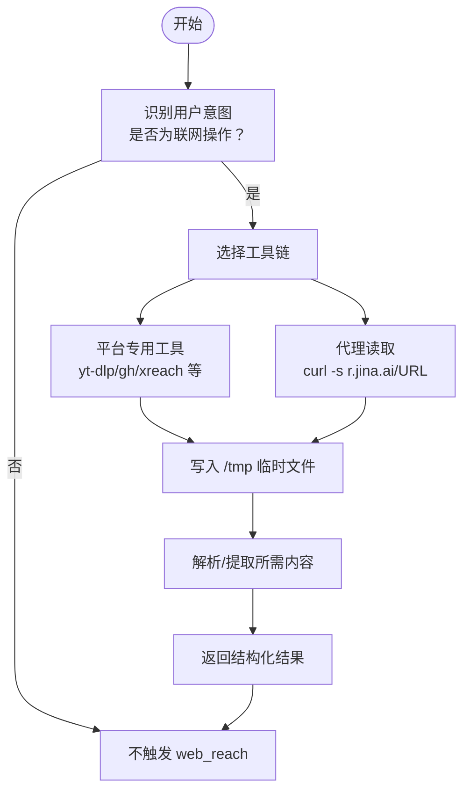
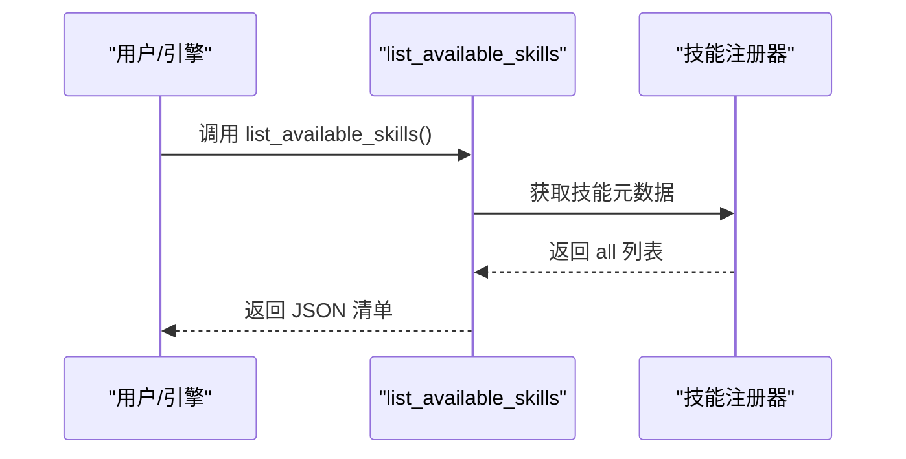
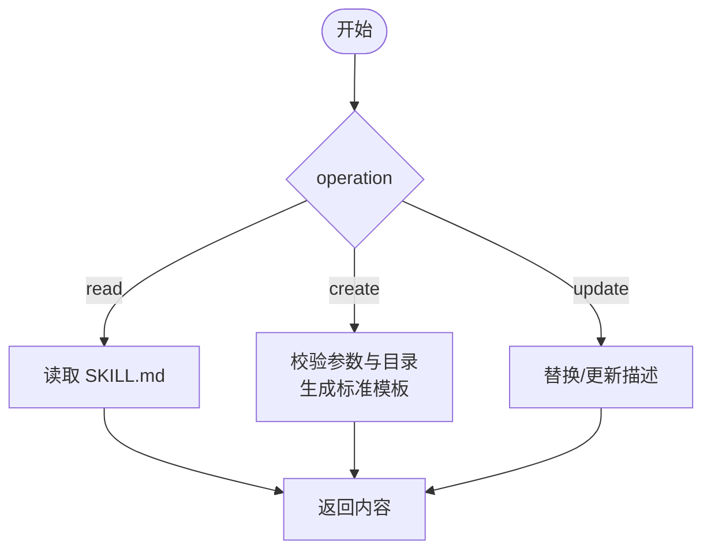
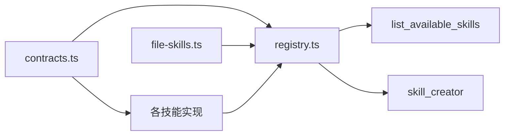

# 内置技能示例

<cite>
**本文引用的文件**
- [README.md](file://README.md)
- [package.json](file://package.json)
- [builtin-skills/web_reach/SKILL.md](file://builtin-skills/web_reach/SKILL.md)
- [src/skills/contracts.ts](file://src/skills/contracts.ts)
- [src/skills/registry.ts](file://src/skills/registry.ts)
- [src/skills/system/list_available_skills.ts](file://src/skills/system/list_available_skills.ts)
- [src/skills/system/skill_creator.ts](file://src/skills/system/skill_creator.ts)
- [src/skills/system/get_system_time.ts](file://src/skills/system/get_system_time.ts)
- [src/skills/coding/claude_code.ts](file://src/skills/coding/claude_code.ts)
- [src/skills/web/web_search.ts](file://src/skills/web/web_search.ts)
- [src/skills/web/get_weather.ts](file://src/skills/web/get_weather.ts)
- [src/skills/memory/query_history.ts](file://src/skills/memory/query_history.ts)
- [src/skills/memory/update_profile.ts](file://src/skills/memory/update_profile.ts)
- [src/skills/cron/manage_cron_jobs.ts](file://src/skills/cron/manage_cron_jobs.ts)
- [src/skills/file-skills.ts](file://src/skills/file-skills.ts)
</cite>

## 目录
1. [简介](#简介)
2. [项目结构](#项目结构)
3. [核心组件](#核心组件)
4. [架构总览](#架构总览)
5. [详细组件分析](#详细组件分析)
6. [依赖关系分析](#依赖关系分析)
7. [性能考量](#性能考量)
8. [故障排查指南](#故障排查指南)
9. [结论](#结论)
10. [附录](#附录)

## 简介
本文件围绕 StupidClaw 的“内置技能”体系，系统性地梳理并讲解各类内置技能的功能特性、使用方法与实现原理。重点包括：
- 内置技能的整体设计理念与暴露策略（always/on-demand）
- 技能注册与发现机制
- 典型技能的参数、调用流程与错误处理
- 以 web_reach 为例，详解其工具链、参数配置与调用示例
- 技能开发指南与自定义技能创建方法

StupidClaw 强调“极简本地 Agent”，所有能力均通过“技能”（Skill）形式按需披露，避免一次性加载过多能力导致上下文污染与误触发。

## 项目结构
StupidClaw 的技能体系由“内置技能目录”与“项目自定义技能目录”共同组成，统一通过文件系统中的 SKILL.md 描述文件进行声明与加载。技能注册器负责将内置与自定义技能整合为三类集合：全部技能、总是可用技能（always）、按需技能（on-demand）。

图示来源
- [src/skills/registry.ts:23-54](file://src/skills/registry.ts#L23-L54)
- [src/skills/file-skills.ts:11-24](file://src/skills/file-skills.ts#L11-L24)

章节来源
- [README.md:22-52](file://README.md#L22-L52)
- [src/skills/registry.ts:23-54](file://src/skills/registry.ts#L23-L54)
- [src/skills/file-skills.ts:11-24](file://src/skills/file-skills.ts#L11-L24)

## 核心组件
- 技能契约与元数据
  - 技能名称、描述、暴露级别（always/on-demand）
  - 工具定义（参数 Schema、执行函数）
- 技能注册器
  - 统一创建内置技能与自定义技能元数据
  - 按 exposure 划分 all/always/on-demand
- 文件技能加载
  - 自动扫描内置与项目自定义技能目录
  - 去重合并，形成最终技能清单

章节来源
- [src/skills/contracts.ts:4-19](file://src/skills/contracts.ts#L4-L19)
- [src/skills/registry.ts:23-54](file://src/skills/registry.ts#L23-L54)
- [src/skills/file-skills.ts:58-64](file://src/skills/file-skills.ts#L58-L64)

## 架构总览
下图展示了“技能注册与暴露”的整体流程，以及与文件系统、工具链的交互关系。

图示来源
- [src/skills/file-skills.ts:26-48](file://src/skills/file-skills.ts#L26-L48)
- [src/skills/registry.ts:40-51](file://src/skills/registry.ts#L40-L51)

## 详细组件分析

### web_reach 技能详解
web_reach 是一个“联网工具包”，通过多种外部工具与平台接口实现网页抓取、搜索与内容解析。其核心特点是“按需披露”：仅在用户明确表达“搜索/查看链接/查资料”等意图时被调用。

- 功能范围
  - 网页阅读：通过代理服务读取任意 URL
  - 平台搜索：Exa、Brave、GitHub、Reddit、LinkedIn、RSS 等
  - 社交媒体：Twitter/X、YouTube、Bilibili、小红书、抖音、微信公众号
- 使用场景
  - 用户说“搜索一下”“看这个链接”“查一下推特”
  - 需要结构化结果时优先使用平台原生工具（如 Exa、yt-dlp）
- 临时文件与安全
  - 临时文件写入 /tmp，避免污染工作区
  - 缺工具时先检测再提示
- 反爬与降级
  - 遇到反爬时可回退到通用代理读取页面

图示来源
- [builtin-skills/web_reach/SKILL.md:13-122](file://builtin-skills/web_reach/SKILL.md#L13-L122)

章节来源
- [builtin-skills/web_reach/SKILL.md:1-122](file://builtin-skills/web_reach/SKILL.md#L1-L122)

### 列出可用技能（list_available_skills）
- 作用：返回 all 列表，标注 exposure 级别与用途
- 使用建议：优先调用 always 技能；需要历史/记忆等能力时再调用 on-demand 技能
- 输出：JSON 格式的技能清单与使用指引

图示来源
- [src/skills/system/list_available_skills.ts:4-39](file://src/skills/system/list_available_skills.ts#L4-L39)
- [src/skills/registry.ts:40-49](file://src/skills/registry.ts#L40-L49)

章节来源
- [src/skills/system/list_available_skills.ts:4-39](file://src/skills/system/list_available_skills.ts#L4-L39)
- [src/skills/registry.ts:40-49](file://src/skills/registry.ts#L40-L49)

### 技能创建器（skill_creator）
- 作用：在 .stupidClaw/skills/<name>/SKILL.md 下创建/读取/更新技能文档
- 关键点
  - name 规范化（小写字母、数字、连字符）
  - description 是主要触发机制，需明确“做什么+何时触发”
  - 支持标准模板与自定义 body
- 使用建议
  - 创建前先与用户确认目标、触发条件与输出格式
  - 大型参考文档建议拆分为 references/ 子目录并在 SKILL.md 引用

图示来源
- [src/skills/system/skill_creator.ts:65-312](file://src/skills/system/skill_creator.ts#L65-L312)

章节来源
- [src/skills/system/skill_creator.ts:65-312](file://src/skills/system/skill_creator.ts#L65-L312)

### 系统时间（get_system_time）
- 作用：返回 ISO 与本地时间字符串
- 特点：always 暴露，无参数，常用于时间戳与日志

章节来源
- [src/skills/system/get_system_time.ts:4-38](file://src/skills/system/get_system_time.ts#L4-L38)

### 天气查询（get_weather）
- 作用：查询指定城市的实时天气与当日预报
- 参数：city（支持中文/英文）
- 实现要点：调用第三方天气接口，解析 JSON 并格式化输出

章节来源
- [src/skills/web/get_weather.ts:30-110](file://src/skills/web/get_weather.ts#L30-L110)

### 网页搜索（web_search）
- 作用：使用 Brave Search API 搜索互联网，返回标题、链接与摘要
- 参数：q（关键词）、count（默认 5，最多 10）
- 实现要点：读取 BRAVE_SEARCH_API_KEY，构造请求并处理响应

章节来源
- [src/skills/web/web_search.ts:16-95](file://src/skills/web/web_search.ts#L16-L95)

### 历史查询（query_history）
- 作用：按日期与 chatId 查询历史事件，支持 limit
- 参数：date（YYYY-MM-DD，默认当天）、chatId（可选）、limit（默认 20，最大 200）

章节来源
- [src/skills/memory/query_history.ts:5-57](file://src/skills/memory/query_history.ts#L5-L57)

### 更新档案（update_profile）
- 作用：更新 profile.md 的指定 section（stable_facts / preferences / constraints）
- 参数：section、facts[]、mode（append/replace，默认 append）

章节来源
- [src/skills/memory/update_profile.ts:10-84](file://src/skills/memory/update_profile.ts#L10-L84)

### 定时任务管理（manage_cron_jobs）
- 作用：增删改查定时任务，支持启用/禁用
- 参数：action（list/add/update/remove/set_enabled）及相关任务字段
- 实现要点：校验 cron 表达式、聊天会话键、必要字段组合

章节来源
- [src/skills/cron/manage_cron_jobs.ts:32-336](file://src/skills/cron/manage_cron_jobs.ts#L32-L336)

### 编程助手（claude_code）
- 作用：调用本地 Claude Code CLI 执行编程任务
- 参数：task（自然语言描述）、workDir（可选）
- 实现要点：设置超时与缓冲上限，捕获 CLI 错误并返回详细输出

章节来源
- [src/skills/coding/claude_code.ts:8-99](file://src/skills/coding/claude_code.ts#L8-L99)

## 依赖关系分析
- 技能注册器依赖各具体技能的工厂函数，统一产出 SkillDefinition
- 文件技能加载器从内置与项目目录加载 SKILL.md，去重后参与注册
- 各技能内部依赖外部工具或 API（如 Brave Search、天气接口、yt-dlp 等）

图示来源
- [src/skills/registry.ts:1-12](file://src/skills/registry.ts#L1-L12)
- [src/skills/file-skills.ts:15-24](file://src/skills/file-skills.ts#L15-L24)

章节来源
- [src/skills/registry.ts:1-12](file://src/skills/registry.ts#L1-L12)
- [src/skills/file-skills.ts:15-24](file://src/skills/file-skills.ts#L15-L24)

## 性能考量
- 按需披露（on-demand）降低初始上下文负担，提升推理稳定性
- 外部 API/CLI 调用需设置合理超时与缓冲上限，避免阻塞
- 临时文件写入 /tmp，减少磁盘 IO 对工作区的影响
- 对于高并发场景，建议在调用层增加限流与重试策略

## 故障排查指南
- 缺少 API Key
  - 示例：web_search 需要 BRAVE_SEARCH_API_KEY
  - 处理：在环境变量中配置后重启
- 本地工具未安装
  - 示例：claude_code 需要 Claude Code CLI
  - 处理：安装后重试
- 反爬或网络异常
  - 示例：部分平台/站点反爬
  - 处理：回退到通用代理读取页面
- 参数非法
  - 示例：cron 表达式必须为 5 段
  - 处理：修正表达式或检查必填字段

章节来源
- [src/skills/web/web_search.ts:34-46](file://src/skills/web/web_search.ts#L34-L46)
- [src/skills/coding/claude_code.ts:56-82](file://src/skills/coding/claude_code.ts#L56-L82)
- [src/skills/cron/manage_cron_jobs.ts:164-174](file://src/skills/cron/manage_cron_jobs.ts#L164-L174)
- [builtin-skills/web_reach/SKILL.md:117-122](file://builtin-skills/web_reach/SKILL.md#L117-L122)

## 结论
StupidClaw 的“内置技能”体系以“文件即契约”的方式，将能力以最小暴露面提供给 LLM，既保证了灵活性，又避免了能力膨胀带来的误触发与上下文污染。通过“always/on-demand”的暴露策略与“文件技能加载器”的统一发现机制，项目实现了可扩展、可维护的技能生态。对于 web_reach 这类联网工具，建议结合平台原生能力与通用代理读取相结合的方式，兼顾效率与鲁棒性。

## 附录

### 技能使用案例（概念性示例）
- 场景一：用户询问“今天天气如何？”
  - 触发：get_weather
  - 输入：city
  - 输出：格式化后的天气信息
- 场景二：用户要求“搜索一下人工智能的最新研究”
  - 触发：web_search
  - 输入：q、count
  - 输出：标题、链接与摘要列表
- 场景三：用户给出一个 YouTube 链接，要求提取视频信息与字幕
  - 触发：web_reach（yt-dlp）
  - 输入：URL、语言参数
  - 输出：视频信息与字幕文件路径（/tmp）

### 技能开发指南与最佳实践
- 设计理念
  - 以“触发描述”为核心：在 description 中明确“做什么+何时触发”
  - 最小复杂度：一次只做一件事，参数尽量精简
  - 结构化输出：面向下游消费，便于后续处理
- 创建流程
  - 使用 skill_creator 在 .stupidClaw/skills/<name>/SKILL.md 创建
  - 填写 description 与 body，必要时拆分 references/
  - 通过 list_available_skills 验证是否可见
- 扩展方式
  - 新增技能工厂函数并加入注册器
  - 若为平台工具，优先封装为独立工具链，再在 SKILL.md 中说明调用方式
- 安全与合规
  - 严格遵守平台 API 限额与使用条款
  - 临时文件写入 /tmp，避免持久化敏感数据
  - 对外部输入进行参数校验与长度限制

章节来源
- [src/skills/system/skill_creator.ts:65-312](file://src/skills/system/skill_creator.ts#L65-L312)
- [src/skills/system/list_available_skills.ts:4-39](file://src/skills/system/list_available_skills.ts#L4-L39)
- [src/skills/registry.ts:23-54](file://src/skills/registry.ts#L23-L54)
- [builtin-skills/web_reach/SKILL.md:1-122](file://builtin-skills/web_reach/SKILL.md#L1-L122)