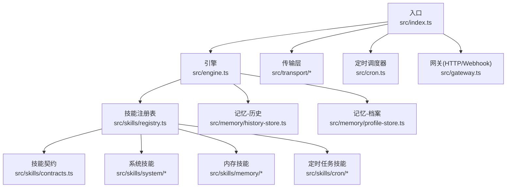
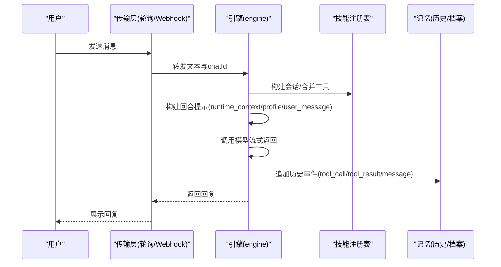
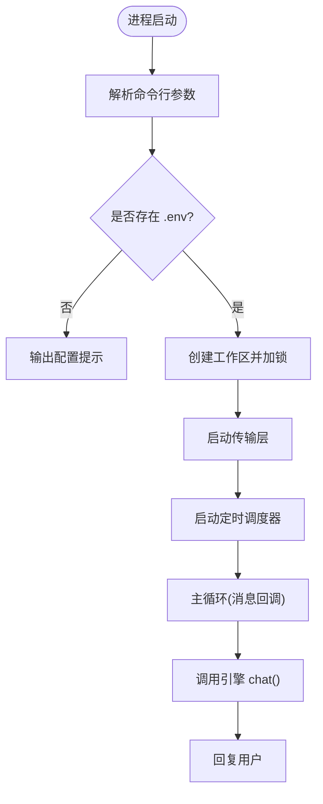
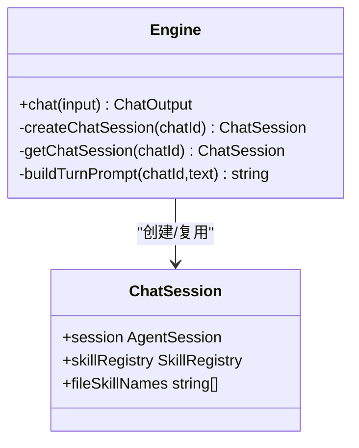
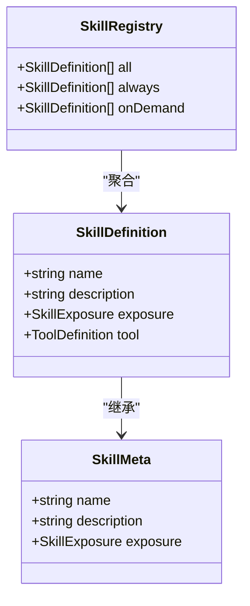
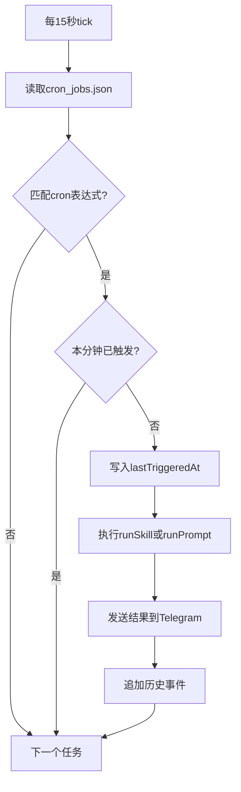
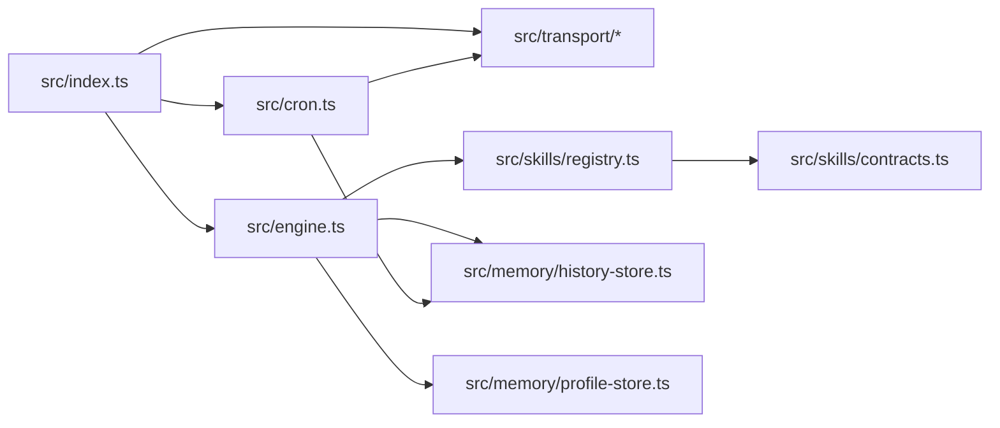

# 教程与示例

<cite>
**本文引用的文件**
- [README.md](file://README.md)
- [package.json](file://package.json)
- [src/index.ts](file://src/index.ts)
- [src/engine.ts](file://src/engine.ts)
- [src/gateway.ts](file://src/gateway.ts)
- [src/skills/registry.ts](file://src/skills/registry.ts)
- [src/skills/contracts.ts](file://src/skills/contracts.ts)
- [src/skills/system/get_system_time.ts](file://src/skills/system/get_system_time.ts)
- [src/skills/memory/update_profile.ts](file://src/skills/memory/update_profile.ts)
- [src/skills/cron/manage_cron_jobs.ts](file://src/skills/cron/manage_cron_jobs.ts)
- [src/memory/profile-store.ts](file://src/memory/profile-store.ts)
- [src/memory/history-store.ts](file://src/memory/history-store.ts)
- [src/cron.ts](file://src/cron.ts)
- [docs/getting-started.md](file://docs/getting-started.md)
- [docs/models.md](file://docs/models.md)
</cite>

## 目录
1. [简介](#简介)
2. [项目结构](#项目结构)
3. [核心组件](#核心组件)
4. [架构总览](#架构总览)
5. [详细组件分析](#详细组件分析)
6. [依赖关系分析](#依赖关系分析)
7. [性能考量](#性能考量)
8. [故障排除指南](#故障排除指南)
9. [结论](#结论)
10. [附录](#附录)

## 简介
本教程面向希望循序渐进掌握 StupidClaw 的学习者，覆盖从基础到高级的完整开发路径。StupidClaw 是一个极简本地 Agent，基于 pi-mono 底座，严格限制在指定目录并通过纯文本文件进行长期记忆与历史记录管理。默认使用 Telegram 作为消息通道，支持长轮询与 Webhook 两种传输模式；默认模型为 MiniMax，同时支持多种云端与本地模型。

本教程将：
- 逐期讲解开发目标、实现步骤与关键点
- 提供内置技能使用示例与自定义技能开发示例
- 给出最佳实践、常见陷阱与排障技巧
- 设计练习题与实践项目，帮助巩固知识

## 项目结构
StupidClaw 的核心模块围绕“入口 -> 引擎 -> 技能 -> 记忆 -> 传输”展开，采用清晰的分层设计与职责分离。

图示来源
- [src/index.ts:1-216](file://src/index.ts#L1-L216)
- [src/engine.ts:1-706](file://src/engine.ts#L1-L706)
- [src/skills/registry.ts:1-55](file://src/skills/registry.ts#L1-L55)
- [src/memory/history-store.ts:1-83](file://src/memory/history-store.ts#L1-L83)
- [src/memory/profile-store.ts:1-132](file://src/memory/profile-store.ts#L1-L132)
- [src/cron.ts:1-265](file://src/cron.ts#L1-L265)
- [src/gateway.ts:1-79](file://src/gateway.ts#L1-L79)

章节来源
- [README.md:22-52](file://README.md#L22-L52)
- [src/index.ts:112-216](file://src/index.ts#L112-L216)

## 核心组件
- 入口与生命周期
  - 初始化锁文件、单实例保护、优雅退出钩子
  - 加载 .env 配置，创建工作区目录
  - 启动传输层与定时调度器，注入技能执行器与提示执行器
- 引擎与会话
  - 模型注册与选择、系统提示构建、资源加载器
  - 会话复用、工具集合并、历史事件追加
  - 错误归一化（API Key 缺失提示）、回复提取与降噪
- 技能体系
  - 注册表统一管理内置与标准文件技能，区分 always/on_demand
  - 技能契约定义工具签名、暴露策略与上下文
- 记忆系统
  - 历史事件按日期写入 .stupidClaw/history/*.jsonl
  - profile.md 三段式长期记忆（稳定事实/偏好/约束）
- 传输与网关
  - 长轮询与 Webhook 两种模式
  - HTTP 网关支持校验令牌与 GET/POST 路由

章节来源
- [src/index.ts:112-216](file://src/index.ts#L112-L216)
- [src/engine.ts:392-475](file://src/engine.ts#L392-L475)
- [src/skills/registry.ts:23-55](file://src/skills/registry.ts#L23-L55)
- [src/memory/history-store.ts:37-83](file://src/memory/history-store.ts#L37-L83)
- [src/memory/profile-store.ts:112-132](file://src/memory/profile-store.ts#L112-L132)
- [src/gateway.ts:27-79](file://src/gateway.ts#L27-L79)

## 架构总览
StupidClaw 的运行时流程如下：

图示来源
- [src/index.ts:189-208](file://src/index.ts#L189-L208)
- [src/engine.ts:484-607](file://src/engine.ts#L484-L607)
- [src/memory/history-store.ts:37-42](file://src/memory/history-store.ts#L37-L42)

章节来源
- [src/index.ts:189-208](file://src/index.ts#L189-L208)
- [src/engine.ts:680-706](file://src/engine.ts#L680-L706)

## 详细组件分析

### 入口与生命周期（index.ts）
- 命令行参数解析：支持 init 子命令与 --config 指定 .env
- 单实例锁：通过 .stupidClaw/polling.lock 防止并发实例
- 环境加载：显式加载 .env，不存在时给出友好提示
- 传输启动：根据 TELEGRAM_BOT_TOKEN 决定是否启用轮询与定时
- 定时调度：注入 runSkill/runPrompt，分别执行技能与提示
- 传输回调：处理消息、发送 Typing、调用引擎 chat、回复用户

图示来源
- [src/index.ts:12-84](file://src/index.ts#L12-L84)
- [src/index.ts:112-216](file://src/index.ts#L112-L216)

章节来源
- [src/index.ts:12-84](file://src/index.ts#L12-L84)
- [src/index.ts:112-216](file://src/index.ts#L112-L216)

### 引擎与会话（engine.ts）
- 模型选择：支持 provider:model_id，兼容旧格式与兜底策略
- 注册表扩展：动态注册 Ollama/LM Studio/DeepSeek/Kimi/DashScope/BigModel/custom-openai/custom-anthropic
- 会话创建：DefaultResourceLoader 构建静态系统提示，合并标准文件技能与自定义技能
- 提示构建：runtime_context/chat_id/now_iso/now_local/profile/user_message
- 流式处理：订阅 message_update，拼接 text_delta/text_end/done，去 think 标签
- 历史记录：tool_execution_start/end 与 message 追加，异常归一化

图示来源
- [src/engine.ts:19-32](file://src/engine.ts#L19-L32)
- [src/engine.ts:392-475](file://src/engine.ts#L392-L475)

章节来源
- [src/engine.ts:196-244](file://src/engine.ts#L196-L244)
- [src/engine.ts:484-509](file://src/engine.ts#L484-L509)
- [src/engine.ts:511-607](file://src/engine.ts#L511-L607)

### 技能注册表与契约（skills/registry.ts, contracts.ts）
- 注册表：聚合系统/内存/网络/编码/定时任务技能，暴露 always/on_demand
- 契约：SkillMeta/SkillContext/SkillDefinition，统一工具签名与暴露策略
- 列表能力：动态列举内置与标准文件技能元信息

图示来源
- [src/skills/contracts.ts:6-19](file://src/skills/contracts.ts#L6-L19)
- [src/skills/registry.ts:13-54](file://src/skills/registry.ts#L13-L54)

章节来源
- [src/skills/registry.ts:23-55](file://src/skills/registry.ts#L23-L55)
- [src/skills/contracts.ts:1-20](file://src/skills/contracts.ts#L1-L20)

### 内置技能示例

#### 系统技能：获取系统时间
- 名称与暴露策略：always
- 参数：无
- 行为：返回 ISO 与本地时间字符串，便于 runtime_context

章节来源
- [src/skills/system/get_system_time.ts:4-38](file://src/skills/system/get_system_time.ts#L4-L38)

#### 内存技能：更新档案（profile）
- 名称与暴露策略：on_demand
- 参数：section（stable_facts/preferences/constraints）、facts 数组、mode（append/replace）
- 行为：原子性更新 profile.md 并返回最新数据

章节来源
- [src/skills/memory/update_profile.ts:10-84](file://src/skills/memory/update_profile.ts#L10-L84)
- [src/memory/profile-store.ts:117-132](file://src/memory/profile-store.ts#L117-L132)

#### 定时任务技能：管理定时任务
- 名称与暴露策略：on_demand
- 支持动作：list/add/update/remove/set_enabled
- 关键字段：cronExpr（5 段）、targetChatId、requirement、skillNames、prompt、toolName/toolArgs
- 行为：读写 .stupidClaw/cron_jobs.json，校验表达式与必填项

章节来源
- [src/skills/cron/manage_cron_jobs.ts:32-336](file://src/skills/cron/manage_cron_jobs.ts#L32-L336)

### 记忆系统

#### 历史存储（history-store.ts）
- 数据结构：HistoryEvent（ts/chatId/role/type/text/tool/args/result/isError）
- 写入：按 UTC 日切分文件，追加 JSONL 行
- 查询：支持按 date/chatId/limit 查询，限制最大 200 条

章节来源
- [src/memory/history-store.ts:8-18](file://src/memory/history-store.ts#L8-L18)
- [src/memory/history-store.ts:37-83](file://src/memory/history-store.ts#L37-L83)

#### 档案存储（profile-store.ts）
- 结构：三段式（stable_facts/preferences/constraints）
- 解析：按 ## 区块与 - 列表项解析，去重与规范化
- 写入：toMarkdown 输出，保证一致性

章节来源
- [src/memory/profile-store.ts:4-24](file://src/memory/profile-store.ts#L4-L24)
- [src/memory/profile-store.ts:50-101](file://src/memory/profile-store.ts#L50-L101)

### 传输与网关

#### 长轮询与 Webhook
- 长轮询：基于 Telegram Bot API 的轮询模式
- Webhook：通过 HTTP 网关接收推送，支持可选令牌校验

章节来源
- [src/gateway.ts:27-79](file://src/gateway.ts#L27-L79)

#### HTTP 网关（gateway.ts）
- 路由：GET/POST，路径可配置，支持 secretToken 校验
- 请求体：JSON 解析，异常返回 400/401/404

章节来源
- [src/gateway.ts:16-25](file://src/gateway.ts#L16-L25)
- [src/gateway.ts:40-65](file://src/gateway.ts#L40-L65)

### 定时调度器（cron.ts）
- 表达式解析：支持 *, 数字, 范围, 步进（*/n）
- 触发策略：每分钟检查一次，避免同一分钟重复触发
- 执行路径：runSkill 或 runPrompt，发送结果到目标 chatId
- 历史记录：tool_call/tool_result/message 三段记录

图示来源
- [src/cron.ts:171-249](file://src/cron.ts#L171-L249)

章节来源
- [src/cron.ts:85-109](file://src/cron.ts#L85-L109)
- [src/cron.ts:171-249](file://src/cron.ts#L171-L249)

## 依赖关系分析

图示来源
- [src/index.ts:112-216](file://src/index.ts#L112-L216)
- [src/engine.ts:422-459](file://src/engine.ts#L422-L459)
- [src/skills/registry.ts:23-55](file://src/skills/registry.ts#L23-L55)

章节来源
- [src/index.ts:112-216](file://src/index.ts#L112-L216)
- [src/engine.ts:422-459](file://src/engine.ts#L422-L459)

## 性能考量
- 会话复用：按 chatId 复用 AgentSession，减少初始化开销
- 流式响应：订阅 text_delta，边生成边输出，改善感知延迟
- 历史写入：异步 append，避免阻塞主流程
- 定时调度：15 秒间隔，避免频繁 IO；同一分钟内去重触发
- 模型选择：优先 minimax-cn，兜底可用模型，减少失败重试

## 故障排除指南
- 缺少 TELEGRAM_BOT_TOKEN
  - 现象：Telegram 轮询与定时不会启动
  - 处理：配置 TELEGRAM_BOT_TOKEN 或使用内置网页端 IM
- API Key 未配置或拼写错误
  - 现象：模型调用失败，错误信息指向缺失 provider 的 Key
  - 处理：核对 .env 中对应 PROVIDER_API_KEY，确认 STUPID_MODEL 格式
- .env 不存在或路径错误
  - 现象：启动提示未找到配置文件
  - 处理：使用 npx stupid-claw init 生成配置，或指定 --config 路径
- 单实例冲突
  - 现象：提示已有轮询实例运行
  - 处理：清理 .stupidClaw/polling.lock 或停止现有实例
- 定时任务未触发
  - 现象：cron_jobs.json 存在但未执行
  - 处理：检查 cronExpr 是否为 5 段，确认本分钟未重复触发，核对 targetChatId

章节来源
- [src/index.ts:118-120](file://src/index.ts#L118-L120)
- [src/engine.ts:162-186](file://src/engine.ts#L162-L186)
- [src/index.ts:29-40](file://src/index.ts#L29-L40)
- [src/index.ts:45-69](file://src/index.ts#L45-L69)
- [src/cron.ts:171-186](file://src/cron.ts#L171-L186)

## 结论
StupidClaw 通过极简设计实现了可控、可观测、可扩展的本地 Agent。依托技能注册表与文件化记忆，学习者可以逐步掌握从消息闭环、Webhook 升级、按需披露、长期记忆、安全沙盒、定时任务到工程收口的完整开发路径。建议按教程阶段推进，并结合练习与实践项目加深理解。

## 附录

### 渐进式开发教程与练习

- 第1期：先用 Polling 跑通消息闭环
  - 目标：启动 StupidClaw，配置 .env，验证 Telegram 轮询与回复
  - 关键点：TELEGRAM_BOT_TOKEN、STUPID_MODEL、npx init
  - 练习：在 Telegram 中发起多轮对话，观察 .stupidClaw/history/* 是否写入
  - 参考
    - [docs/getting-started.md:97-113](file://docs/getting-started.md#L97-L113)
    - [src/index.ts:189-208](file://src/index.ts#L189-L208)

- 第2期：从 Polling 升级到 Webhook
  - 目标：启用 HTTP 网关，配置 secretToken，接收 Webhook 推送
  - 关键点：gateway.ts 的路由与校验，Telegram Webhook 设置
  - 练习：关闭轮询，开启 Webhook，验证网关日志与消息到达
  - 参考
    - [src/gateway.ts:27-79](file://src/gateway.ts#L27-L79)
    - [docs/getting-started.md:115-135](file://docs/getting-started.md#L115-L135)

- 第3期：Skills 不是越多越好，关键是按需披露
  - 目标：理解 always/on_demand 暴露策略，使用 list_available_skills
  - 关键点：技能注册表、契约、系统提示中的 file_skills
  - 练习：调用 list_available_skills，对比 always 与 on_demand 技能差异
  - 参考
    - [src/skills/registry.ts:40-47](file://src/skills/registry.ts#L40-L47)
    - [src/engine.ts:426-428](file://src/engine.ts#L426-L428)

- 第4期：用 profile 做长期记忆，让 Agent 记住你
  - 目标：使用 update_profile 写入长期记忆，观察系统提示中的 profile
  - 关键点：三段式结构、去重与规范化、系统提示拼接
  - 练习：写入 stable_facts/preferences/constraints，再发起对话验证引用
  - 参考
    - [src/skills/memory/update_profile.ts:10-84](file://src/skills/memory/update_profile.ts#L10-L84)
    - [src/memory/profile-store.ts:50-101](file://src/memory/profile-store.ts#L50-L101)
    - [src/engine.ts:484-509](file://src/engine.ts#L484-L509)

- 第5期：安全沙盒 PathJailing，防止越权读写
  - 目标：理解 resolveSafePath 与 workspace 限制，避免越界访问
  - 关键点：安全路径解析、工作区根目录、文件操作前置校验
  - 练习：尝试读取 src/ 或上级目录，观察错误提示
  - 参考
    - [src/engine.ts:37-37](file://src/engine.ts#L37-L37)

- 第6期：Cron 主动触发，让 Agent 自己干活
  - 目标：配置定时任务，验证触发与结果回推
  - 关键点：5 段 cron 表达式、toolName/toolArgs 与 skillNames/prompt 的区别
  - 练习：创建每日提醒任务，或调用固定工具发送通知
  - 参考
    - [src/skills/cron/manage_cron_jobs.ts:32-336](file://src/skills/cron/manage_cron_jobs.ts#L32-L336)
    - [src/cron.ts:171-249](file://src/cron.ts#L171-L249)

- 第7期：发布与工程收口
  - 目标：打包为独立可执行文件，准备生产部署
  - 关键点：package.json 的 bin 与 build:exe，dist 目录产物
  - 练习：在服务器上单独运行 dist/stupidclaw，携带 .env
  - 参考
    - [package.json:5-13](file://package.json#L5-L13)
    - [docs/getting-started.md:138-153](file://docs/getting-started.md#L138-L153)

### 最佳实践与常见陷阱
- 最佳实践
  - 使用 always/on_demand 策略控制技能暴露，避免过度披露
  - 将长期稳定事实放入 profile，短期上下文放入 history
  - 定时任务尽量固定参数时使用 toolName，需要 LLM 生成时使用 skillNames/prompt
  - 通过 DEBUG_STUPIDCLAW/DEBUG_PROMPT 观察运行细节
- 常见陷阱
  - 忘记配置 TELEGRAM_BOT_TOKEN 导致轮询与定时不生效
  - cronExpr 非 5 段导致任务永不触发
  - API Key 拼写错误或 provider 不一致导致模型调用失败
  - .env 路径错误或权限不足导致配置未生效

### 模型与配置参考
- 快速开始与凭证获取
  - [docs/getting-started.md:9-36](file://docs/getting-started.md#L9-L36)
- 模型配置与供应商列表
  - [docs/models.md:9-101](file://docs/models.md#L9-L101)
- 本地模型与自定义接口
  - [docs/models.md:155-281](file://docs/models.md#L155-L281)