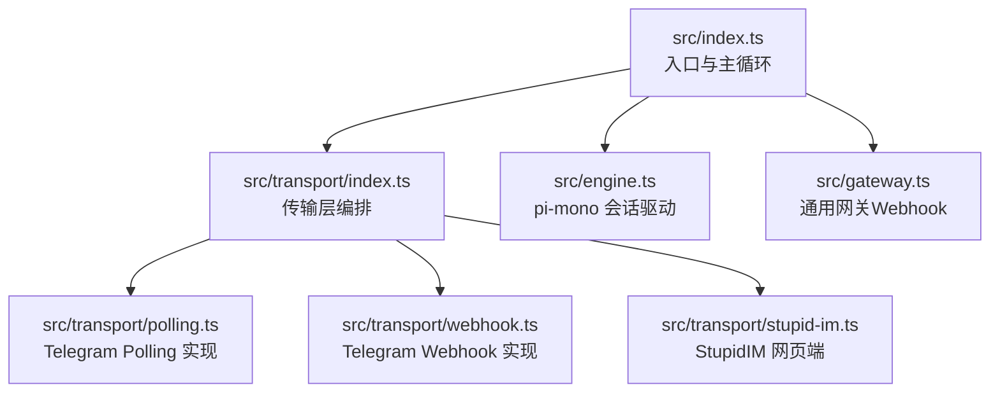
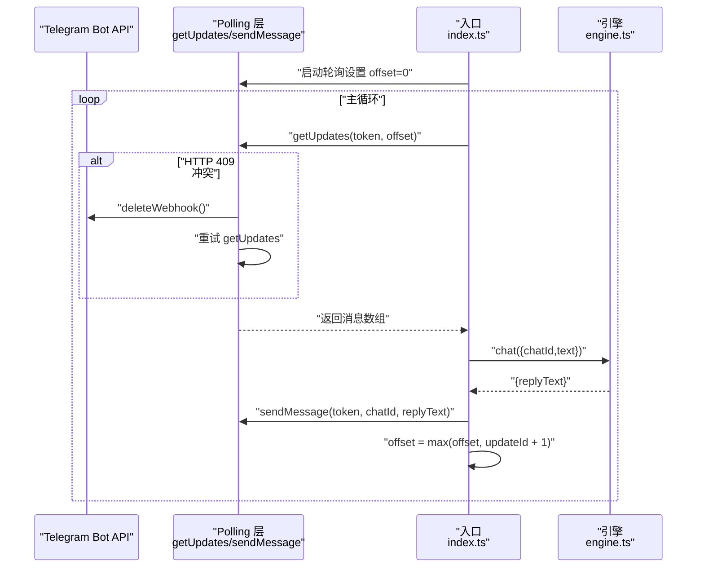
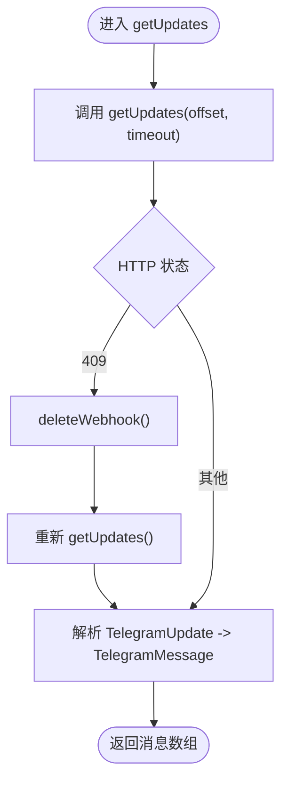
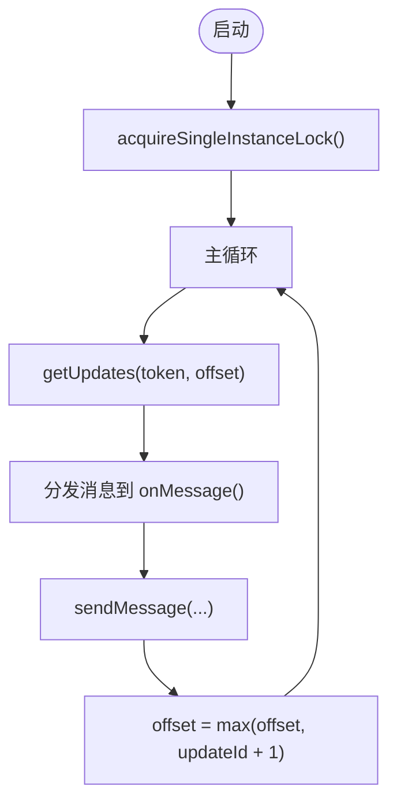
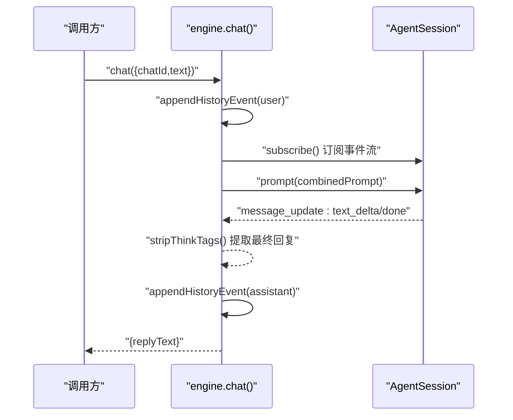
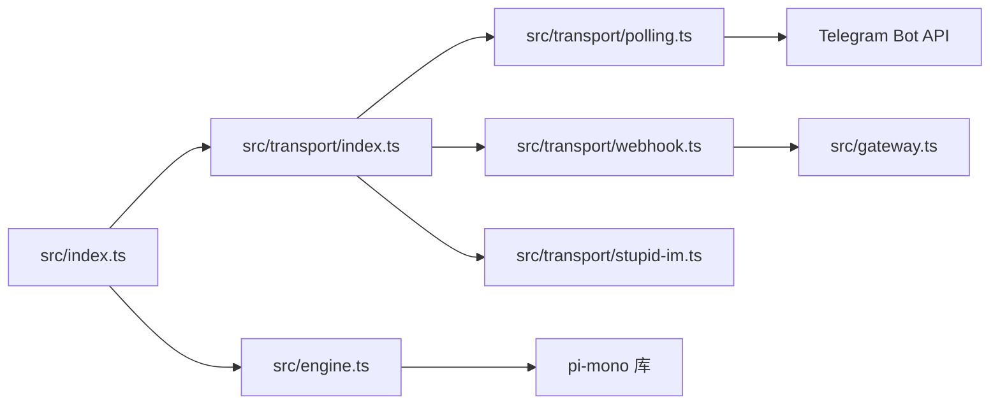

# 第1期：Polling 消息闭环

<cite>
**本文引用的文件**
- [StupidClaw-第1期-先用Polling跑通消息闭环.md](file://StupidClaw-第1期-先用Polling跑通消息闭环.md)
- [src/index.ts](file://src/index.ts)
- [src/engine.ts](file://src/engine.ts)
- [src/transport/index.ts](file://src/transport/index.ts)
- [src/transport/polling.ts](file://src/transport/polling.ts)
- [src/transport/webhook.ts](file://src/transport/webhook.ts)
- [src/transport/stupid-im.ts](file://src/transport/stupid-im.ts)
- [src/gateway.ts](file://src/gateway.ts)
- [package.json](file://package.json)
- [.env.example](file://.env.example)
- [README.md](file://README.md)
- [docs/getting-started.md](file://docs/getting-started.md)
- [AGENTS.md](file://AGENTS.md)
</cite>

## 目录
1. [引言](#引言)
2. [项目结构](#项目结构)
3. [核心组件](#核心组件)
4. [架构总览](#架构总览)
5. [详细组件分析](#详细组件分析)
6. [依赖关系分析](#依赖关系分析)
7. [性能考量](#性能考量)
8. [故障排查指南](#故障排查指南)
9. [结论](#结论)
10. [附录](#附录)

## 引言
本教程聚焦第1期目标：用 Telegram Long Polling 跑通“用户发消息 -> Agent 回复”的最小可行闭环。围绕这一目标，我们将系统讲解数据结构设计（入站消息、出站消息、运行时状态、会话状态）、关键实现细节（Polling 拉取与回复发送、pi-mono 会话驱动、主循环与单实例锁），并给出环境变量配置、启动命令与验收清单。同时解释为何只做这些内容以及后续开发的基础意义。

## 项目结构
第1期的代码组织遵循“入口启动 + 传输层 + 引擎”的分层思路：
- 入口启动：负责单实例锁、环境变量加载、主循环调度与生命周期钩子
- 传输层：封装 Telegram Polling/Webhook/StupidIM 的统一消息通道
- 引擎：基于 pi-mono 的会话驱动，负责模型选择、会话管理与回复生成

图表来源
- [src/index.ts:112-209](file://src/index.ts#L112-L209)
- [src/transport/index.ts:47-70](file://src/transport/index.ts#L47-L70)
- [src/transport/polling.ts:52-89](file://src/transport/polling.ts#L52-L89)
- [src/transport/webhook.ts:41-85](file://src/transport/webhook.ts#L41-L85)
- [src/transport/stupid-im.ts:24-104](file://src/transport/stupid-im.ts#L24-L104)
- [src/gateway.ts:27-78](file://src/gateway.ts#L27-L78)

章节来源
- [README.md:22-52](file://README.md#L22-L52)
- [StupidClaw-第1期-先用Polling跑通消息闭环.md:56-64](file://StupidClaw-第1期-先用Polling跑通消息闭环.md#L56-L64)

## 核心组件
- 数据结构
  - 入站消息：包含 updateId、chatId、text
  - 出站消息：包含 chatId、replyText
  - 运行时状态：offset（轮询偏移量）
  - 会话状态：chatId -> pi-mono AgentSession 映射
- 关键实现
  - Polling 拉取与回复发送：getUpdates、sendMessage、deleteWebhook 自动处理
  - pi-mono 会话驱动：createAgentSession、ModelRegistry、SessionManager.inMemory
  - 主循环与单实例锁：入口启动时创建锁文件，避免多实例竞争

章节来源
- [StupidClaw-第1期-先用Polling跑通消息闭环.md:18-53](file://StupidClaw-第1期-先用Polling跑通消息闭环.md#L18-L53)
- [src/transport/polling.ts:52-89](file://src/transport/polling.ts#L52-L89)
- [src/engine.ts:392-459](file://src/engine.ts#L392-L459)
- [src/index.ts:45-84](file://src/index.ts#L45-L84)

## 架构总览
下面的时序图展示了从 Telegram 轮询到 Agent 回复的完整闭环流程，包括 409 冲突处理与单实例锁保障。

图表来源
- [src/transport/polling.ts:52-89](file://src/transport/polling.ts#L52-L89)
- [src/transport/index.ts:19-45](file://src/transport/index.ts#L19-L45)
- [src/index.ts:189-208](file://src/index.ts#L189-L208)
- [src/engine.ts:680-705](file://src/engine.ts#L680-L705)

## 详细组件分析

### 组件A：Telegram Polling 传输层
- 功能职责
  - 拉取消息：getUpdates(token, offset)，自动处理 409 冲突（deleteWebhook 后重试）
  - 发送回复：sendMessage(token, chatId, text)，支持 Markdown -> HTML 转换与分片发送
  - 输入输出：统一的 TelegramMessage/TelegramUpdate 类型转换
- 关键点
  - 409 冲突：当 bot 已绑定 webhook 时，getUpdates 返回 409，需先 deleteWebhook 再重试
  - 分片发送：超过最大长度时按换行切片，必要时回退纯文本发送
  - Markdown 渲染：标题、粗体、斜体、行内代码、链接、代码块等转换为 Telegram HTML 子集

图表来源
- [src/transport/polling.ts:36-89](file://src/transport/polling.ts#L36-L89)

章节来源
- [src/transport/polling.ts:52-89](file://src/transport/polling.ts#L52-L89)
- [src/transport/polling.ts:215-242](file://src/transport/polling.ts#L215-L242)

### 组件B：主循环与单实例锁
- 功能职责
  - 单实例锁：启动时创建 .stupidClaw/polling.lock，若存在则直接退出，避免重复消费
  - 生命周期钩子：监听 SIGINT/SIGTERM，优雅释放锁文件
  - 主循环：固定轮询 + 消息分发 + 偏移推进
- 关键点
  - 锁文件路径：WORKSPACE_DIR/polling.lock
  - 偏移推进：offset = max(offset, updateId + 1)，保证幂等

图表来源
- [src/index.ts:112-209](file://src/index.ts#L112-L209)
- [src/transport/index.ts:19-45](file://src/transport/index.ts#L19-L45)

章节来源
- [src/index.ts:45-84](file://src/index.ts#L45-L84)
- [src/index.ts:112-209](file://src/index.ts#L112-L209)
- [src/transport/index.ts:19-45](file://src/transport/index.ts#L19-L45)

### 组件C：pi-mono 会话驱动
- 功能职责
  - 会话创建：createAgentSession，使用 ModelRegistry 选择模型，SessionManager.inMemory
  - 提示词构建：runtime_context、profile、user_message 组合
  - 回复提取：订阅事件流，抽取 text_delta/text_end/done，剥离 think 标签
  - 回退策略：无有效回复时回退到 fallbackReply
- 关键点
  - 工具与技能：tools 为空，先跑最小会话循环
  - 错误归一化：将 API Key 缺失等错误映射为更友好的提示

图表来源
- [src/engine.ts:680-705](file://src/engine.ts#L680-L705)
- [src/engine.ts:511-607](file://src/engine.ts#L511-L607)

章节来源
- [src/engine.ts:19-32](file://src/engine.ts#L19-L32)
- [src/engine.ts:392-459](file://src/engine.ts#L392-L459)
- [src/engine.ts:511-607](file://src/engine.ts#L511-L607)
- [src/engine.ts:680-705](file://src/engine.ts#L680-L705)

### 组件D：Webhook 与 StupidIM（为后续铺垫）
- Webhook：setWebhook + startGateway，用于第2期升级
- StupidIM：HTTP + WebSocket，用于无 Telegram 时的网页端交互

章节来源
- [src/transport/webhook.ts:41-85](file://src/transport/webhook.ts#L41-L85)
- [src/gateway.ts:27-78](file://src/gateway.ts#L27-L78)
- [src/transport/stupid-im.ts:24-104](file://src/transport/stupid-im.ts#L24-L104)

## 依赖关系分析
- 入口依赖传输层：index.ts 通过 transport/index.ts 启动轮询或 webhook
- 传输层依赖 Telegram API：polling.ts 直接调用 Telegram Bot API
- 引擎依赖 pi-mono：engine.ts 使用 @mariozechner/pi-coding-agent 创建会话
- Webhook 依赖通用网关：webhook.ts 通过 gateway.ts 启动 HTTP 服务

图表来源
- [src/index.ts:10-10](file://src/index.ts#L10-L10)
- [src/transport/index.ts:1-3](file://src/transport/index.ts#L1-L3)
- [src/transport/polling.ts:15-19](file://src/transport/polling.ts#L15-L19)
- [src/transport/webhook.ts:13-17](file://src/transport/webhook.ts#L13-L17)
- [src/gateway.ts:7-14](file://src/gateway.ts#L7-L14)
- [src/engine.ts:1-11](file://src/engine.ts#L1-L11)

章节来源
- [src/index.ts:10-10](file://src/index.ts#L10-L10)
- [src/transport/index.ts:1-3](file://src/transport/index.ts#L1-L3)
- [src/transport/polling.ts:15-19](file://src/transport/polling.ts#L15-L19)
- [src/transport/webhook.ts:13-17](file://src/transport/webhook.ts#L13-L17)
- [src/gateway.ts:7-14](file://src/gateway.ts#L7-L14)
- [src/engine.ts:1-11](file://src/engine.ts#L1-L11)

## 性能考量
- 轮询间隔与超时：getUpdates 设置 timeout 与 allowed_updates，降低空轮询成本
- 分片发送：超过最大长度时按换行切片，避免单次请求过大导致失败
- 事件流订阅：引擎通过订阅事件流增量拼接回复，减少中间态 IO
- 单实例锁：避免多实例并发拉取导致重复消费与资源浪费

## 故障排查指南
- 重复回复三次
  - 根因：同时运行多个 polling 进程
  - 修复：确保单实例锁文件存在且唯一，启动时自动检测并退出
  - 参考：[src/index.ts:45-63](file://src/index.ts#L45-L63)
- getUpdates 返回 409
  - 根因：bot 已绑定 webhook
  - 修复：捕获 409 后 deleteWebhook 再重试
  - 参考：[src/transport/polling.ts:57-60](file://src/transport/polling.ts#L57-L60)
- pnpm dev 启动失败（bun: command not found）
  - 根因：开发脚本依赖 tsx，本机未安装 bun
  - 修复：使用 tsx 启动，入口显式加载 .env
  - 参考：[package.json:15](file://package.json#L15), [src/index.ts:28-40](file://src/index.ts#L28-L40)
- TELEGRAM_BOT_TOKEN 未配置
  - 现象：轮询与定时任务不会启动
  - 修复：在 .env 中填写 TELEGRAM_BOT_TOKEN 或使用 StupidIM
  - 参考：[src/index.ts:117-120](file://src/index.ts#L117-L120), [.env.example:54-56](file://.env.example#L54-L56)

章节来源
- [src/index.ts:45-63](file://src/index.ts#L45-L63)
- [src/transport/polling.ts:57-60](file://src/transport/polling.ts#L57-L60)
- [package.json:15](file://package.json#L15)
- [src/index.ts:117-120](file://src/index.ts#L117-L120)
- [.env.example:54-56](file://.env.example#L54-L56)

## 结论
第1期通过“Polling 消息闭环”证明了“消息能进、模型能回、进程可重启、日志可追踪”的工程最小闭环。在此基础上，第2期再升级为 Webhook，保持业务层 engine.chat() 逻辑不变，实现传输层的平滑演进。后续各期（Skills、记忆、安全沙盒、Cron 等）均建立在这一稳固基座之上。

## 附录

### 环境变量配置
- 至少填写：
  - TELEGRAM_BOT_TOKEN（可选，无则使用 StupidIM）
  - STUPID_MODEL（如 minimax:MiniMax-M2.5 或 openai:gpt-4o）
  - 对应供应商 API Key（如 MINIMAX_CN_API_KEY、OPENAI_API_KEY 等）
- 其他常用：
  - TELEGRAM_MODE=polling（默认）
  - STUPID_IM_TOKEN（StupidIM 密钥）
  - PORT=8080（服务端口）

章节来源
- [.env.example:29](file://.env.example#L29)
- [.env.example:32-48](file://.env.example#L32-L48)
- [.env.example:54-68](file://.env.example#L54-L68)
- [docs/getting-started.md:75-91](file://docs/getting-started.md#L75-L91)

### 启动命令
- 开发启动：pnpm dev
- 指定配置文件：npx stupid-claw --config ~/my-stupid-config.env
- 打包为独立可执行文件：pnpm run build:exe

章节来源
- [package.json:15](file://package.json#L15)
- [docs/getting-started.md:42-55](file://docs/getting-started.md#L42-L55)
- [docs/getting-started.md:138-152](file://docs/getting-started.md#L138-L152)

### 验收清单（第1期）
- 用户发消息，Bot 能回复
- 进程重启后，Polling 能恢复拉取
- 链路日志可追踪（含 chatId/updateId/text）

章节来源
- [StupidClaw-第1期-先用Polling跑通消息闭环.md:134-139](file://StupidClaw-第1期-先用Polling跑通消息闭环.md#L134-L139)

### 为什么只做这些
- 先证明“消息能进、模型能回、进程可重启、日志可追踪”
- 没有这个闭环，后续 Skills、记忆、Cron 都是空中楼阁
- 有了闭环，第2 期再上 Webhook 才是增量，而非推倒重来

章节来源
- [StupidClaw-第1期-先用Polling跑通消息闭环.md:158-165](file://StupidClaw-第1期-先用Polling跑通消息闭环.md#L158-L165)