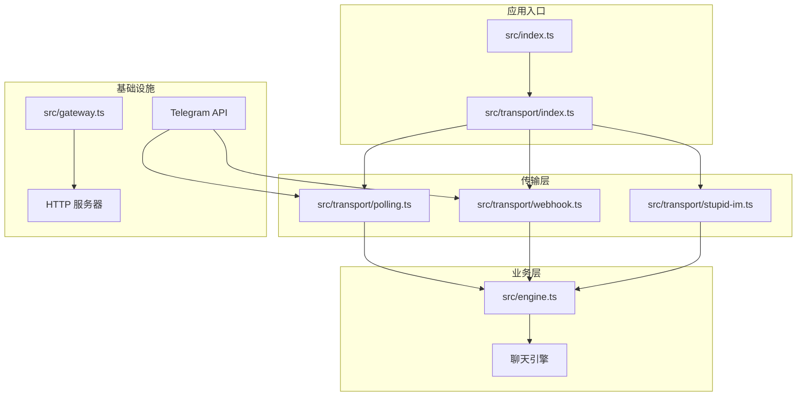
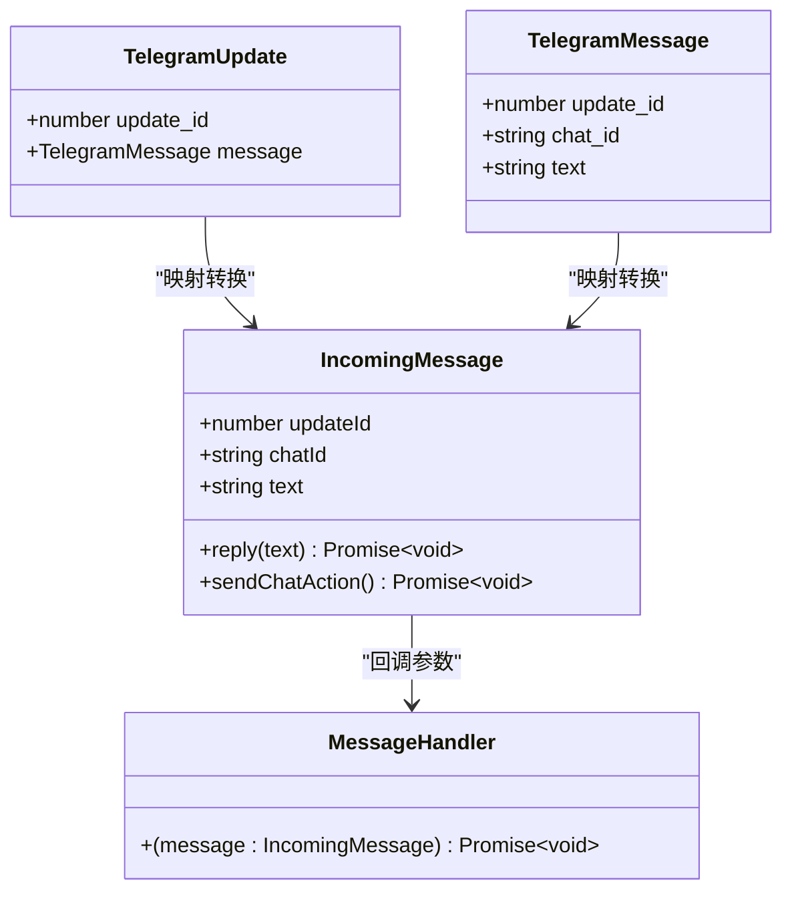
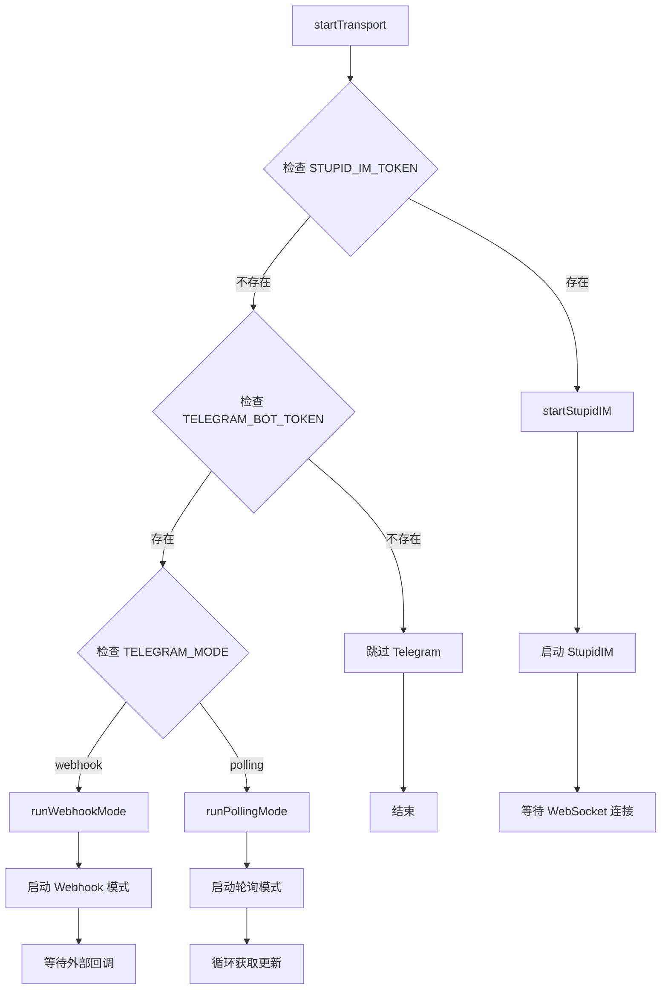
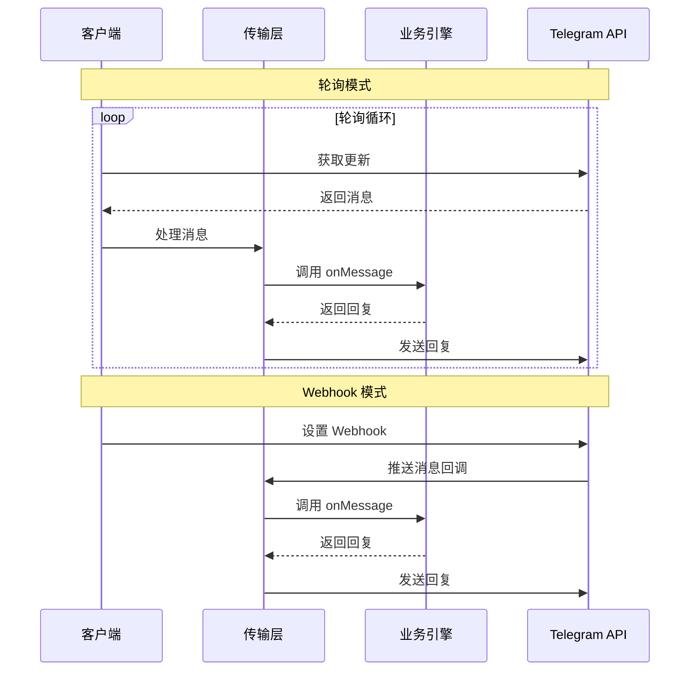
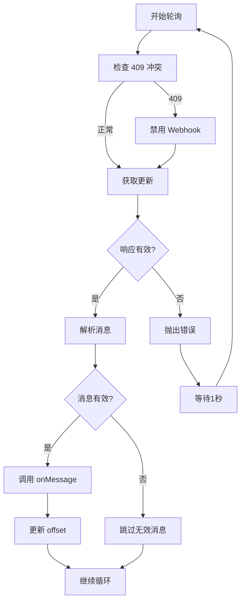
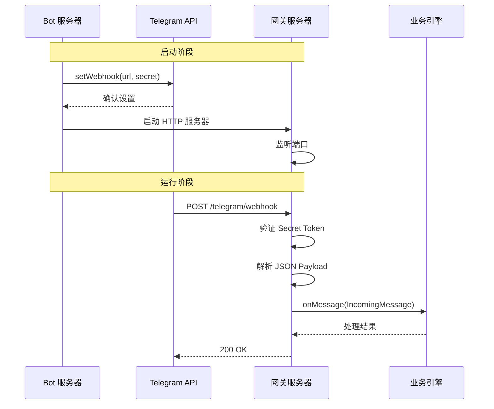
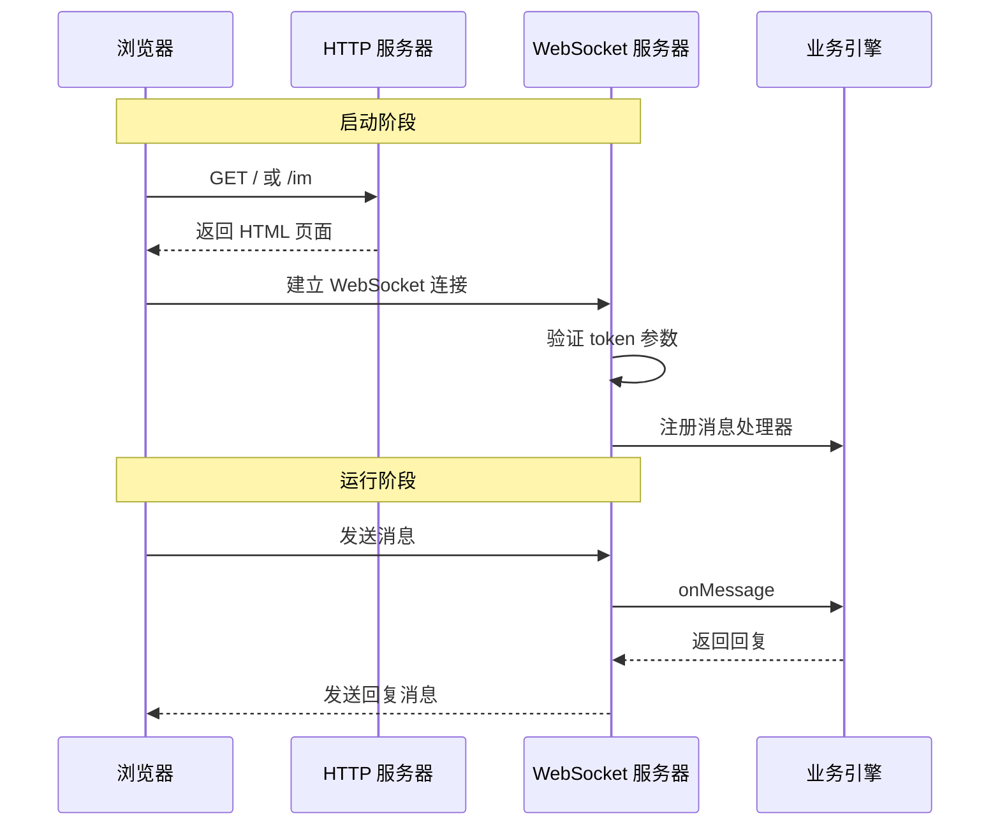
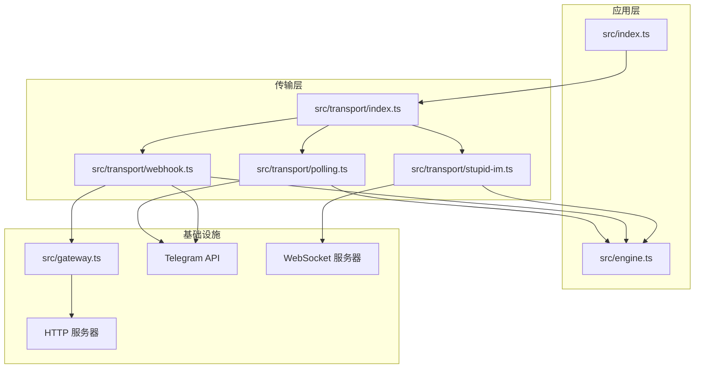

# 第2期：Webhook 升级

<cite>
**本文档中引用的文件**
- [src/transport/index.ts](file://src/transport/index.ts)
- [src/transport/polling.ts](file://src/transport/polling.ts)
- [src/transport/webhook.ts](file://src/transport/webhook.ts)
- [src/transport/stupid-im.ts](file://src/transport/stupid-im.ts)
- [src/gateway.ts](file://src/gateway.ts)
- [src/engine.ts](file://src/engine.ts)
- [src/index.ts](file://src/index.ts)
- [StupidClaw-第2期-从Polling升级到Webhook.md](file://StupidClaw-第2期-从Polling升级到Webhook.md)
</cite>

## 目录
1. [引言](#引言)
2. [项目结构](#项目结构)
3. [核心组件](#核心组件)
4. [架构概览](#架构概览)
5. [详细组件分析](#详细组件分析)
6. [依赖关系分析](#依赖关系分析)
7. [性能考虑](#性能考虑)
8. [故障排除指南](#故障排除指南)
9. [部署配置](#部署配置)
10. [总结](#总结)

## 引言

第2期教程的核心目标是实现从 Polling 到 Webhook 的平滑升级，同时保持业务层逻辑完全不变。这一期的关键在于构建一个可插拔的传输层架构，使得业务层（engine.chat()）能够独立于传输方式而存在。

通过引入 Webhook 模式，系统可以实现更高效的实时通信，避免轮询带来的延迟和资源消耗。更重要的是，这种设计确保了未来可以轻松添加其他传输方式（如 WebSocket、MQTT 等），而无需修改业务逻辑。

## 项目结构

第2期的项目结构围绕传输层抽象进行了重新组织：



**图表来源**
- [src/index.ts:112-208](file://src/index.ts#L112-L208)
- [src/transport/index.ts:47-70](file://src/transport/index.ts#L47-L70)

**章节来源**
- [src/transport/index.ts:1-71](file://src/transport/index.ts#L1-L71)
- [src/transport/polling.ts:1-243](file://src/transport/polling.ts#L1-L243)
- [src/transport/webhook.ts:1-86](file://src/transport/webhook.ts#L1-L86)
- [src/gateway.ts:1-79](file://src/gateway.ts#L1-L79)

## 核心组件

### 统一消息模型

第2期最重要的创新是定义了统一的消息模型，确保不同传输方式产生的消息能够被业务层无差别处理：



**图表来源**
- [src/transport/index.ts:5-13](file://src/transport/index.ts#L5-L13)
- [src/transport/polling.ts:1-13](file://src/transport/polling.ts#L1-L13)

### 传输层统一入口

`src/transport/index.ts` 提供了统一的传输层入口，根据环境变量自动选择合适的传输模式：



**图表来源**
- [src/transport/index.ts:47-70](file://src/transport/index.ts#L47-L70)

**章节来源**
- [src/transport/index.ts:19-70](file://src/transport/index.ts#L19-L70)

## 架构概览

第2期的架构设计实现了真正的传输层解耦：



**图表来源**
- [src/transport/polling.ts:26-44](file://src/transport/polling.ts#L26-L44)
- [src/transport/webhook.ts:41-84](file://src/transport/webhook.ts#L41-L84)

## 详细组件分析

### Polling 模式实现

Polling 模式保持了原有的轮询机制，但进行了优化以避免与 Webhook 冲突：



**图表来源**
- [src/transport/polling.ts:52-89](file://src/transport/polling.ts#L52-L89)

**章节来源**
- [src/transport/polling.ts:21-89](file://src/transport/polling.ts#L21-L89)

### Webhook 模式实现

Webhook 模式是第2期的核心创新，实现了真正的事件驱动通信：



**图表来源**
- [src/transport/webhook.ts:41-84](file://src/transport/webhook.ts#L41-L84)
- [src/gateway.ts:27-78](file://src/gateway.ts#L27-L78)

**章节来源**
- [src/transport/webhook.ts:19-84](file://src/transport/webhook.ts#L19-L84)

### 网关服务器实现

网关服务器提供了轻量级的 HTTP 接入层，专门负责 Webhook 请求的验证和转发：

```mermaid
flowchart TD
A[HTTP 请求到达] --> B{方法验证}
B --> |GET| C{onGet 处理器}
C --> |已处理| D[返回结果]
C --> |未处理| E[继续处理]
B --> |POST| E
E --> F{路径验证}
F --> |不匹配| G[404 Not Found]
F --> |匹配| H{Secret Token 验证}
H --> |失败| I[401 Unauthorized]
H --> |通过| J[读取请求体]
J --> K[解析 JSON]
K --> L{解析成功?}
L --> |否| M[400 Bad Request]
L --> |是| N[调用 onPayload]
N --> O[200 OK {ok: true}]
```

**图表来源**
- [src/gateway.ts:30-65](file://src/gateway.ts#L30-L65)

**章节来源**
- [src/gateway.ts:27-78](file://src/gateway.ts#L27-L78)

### StupidIM 集成

StupidIM 提供了网页端的即时消息功能，支持 WebSocket 连接：



**图表来源**
- [src/transport/stupid-im.ts:24-104](file://src/transport/stupid-im.ts#L24-L104)

**章节来源**
- [src/transport/stupid-im.ts:11-104](file://src/transport/stupid-im.ts#L11-L104)

## 依赖关系分析

第2期的模块依赖关系体现了清晰的关注点分离：



**图表来源**
- [src/index.ts:10-10](file://src/index.ts#L10-L10)
- [src/transport/index.ts:1-3](file://src/transport/index.ts#L1-L3)

**章节来源**
- [src/index.ts:7-10](file://src/index.ts#L7-L10)
- [src/transport/index.ts:1-3](file://src/transport/index.ts#L1-L3)

## 性能考虑

### 轮询 vs Webhook 性能对比

| 特性 | 轮询模式 | Webhook 模式 |
|------|----------|--------------|
| 响应延迟 | 高（轮询间隔） | 低（实时推送） |
| CPU 使用率 | 中等（持续轮询） | 低（事件驱动） |
| 内存占用 | 低 | 低 |
| 网络开销 | 高（频繁请求） | 低（按需推送） |
| 可扩展性 | 差 | 好 |

### 优化策略

1. **轮询模式优化**：通过合理的轮询间隔和错误重试机制平衡延迟和资源消耗
2. **Webhook 模式优化**：使用连接池和异步处理提高并发处理能力
3. **内存管理**：及时清理不再使用的会话和缓存
4. **网络优化**：使用连接复用和压缩减少网络开销

## 故障排除指南

### 常见问题及解决方案

#### 1. Webhook 设置失败

**症状**：启动时出现 `setWebhook failed` 错误

**原因**：
- 网络连接问题
- Telegram API 限制
- URL 格式不正确
- Secret Token 配置错误

**解决方案**：
- 检查网络连接和代理设置
- 验证 TELEGRAM_WEBHOOK_URL 格式
- 确认 SSL 证书有效
- 检查 TELEGRAM_WEBHOOK_SECRET 配置

#### 2. 409 冲突错误

**症状**：轮询模式出现 409 状态码

**原因**：Webhook 和轮询同时启用导致冲突

**解决方案**：
- 确保只启用一种传输模式
- 在轮询模式下禁用 Webhook
- 清理 Telegram 上的现有 Webhook 设置

#### 3. 网关验证失败

**症状**：Webhook 请求被拒绝 401

**原因**：
- 缺少 X-Telegram-Bot-API-Secret-Token 头
- Secret Token 不匹配
- 请求路径不正确

**解决方案**：
- 确保请求包含正确的 Secret Token 头
- 验证 TELEGRAM_WEBHOOK_SECRET 配置
- 检查 TELEGRAM_WEBHOOK_PATH 设置

**章节来源**
- [src/transport/polling.ts:57-60](file://src/transport/polling.ts#L57-L60)
- [src/gateway.ts:46-52](file://src/gateway.ts#L46-L52)

## 部署配置

### 环境变量配置

第2期引入了新的环境变量来支持 Webhook 模式：

| 变量名 | 默认值 | 描述 | 必需 |
|--------|--------|------|------|
| TELEGRAM_MODE | polling | 传输模式（polling/webhook） | 否 |
| TELEGRAM_WEBHOOK_URL | 无 | Webhook 回调地址 | webhook 模式必需 |
| TELEGRAM_WEBHOOK_SECRET | 无 | Secret Token 验证 | 可选 |
| TELEGRAM_WEBHOOK_PATH | /telegram/webhook | Webhook 路径 | 否 |
| PORT | 8787 | 服务器监听端口 | 否 |
| STUPID_IM_TOKEN | 无 | StupidIM 访问令牌 | 可选 |

### SSL 证书配置

对于公网部署，需要配置有效的 SSL 证书：

1. **Let's Encrypt**：免费的自动化证书颁发
2. **自签名证书**：适用于测试环境
3. **商业证书**：适用于生产环境

### 域名设置

1. **DNS 配置**：确保域名指向服务器 IP
2. **反向代理**：使用 Nginx 或 Apache 作为反向代理
3. **防火墙设置**：开放 80/443 端口

**章节来源**
- [src/transport/webhook.ts:45-55](file://src/transport/webhook.ts#L45-L55)
- [src/gateway.ts:46-52](file://src/gateway.ts#L46-L52)

## 总结

第2期教程成功实现了从 Polling 到 Webhook 的平滑升级，关键成果包括：

### 架构层面

1. **传输层解耦**：通过统一的消息模型实现了传输方式的完全可替换性
2. **业务层独立**：engine.chat() 逻辑在两种模式下保持完全一致
3. **扩展性增强**：为未来添加其他传输方式奠定了基础

### 技术层面

1. **Webhook 实现**：提供了真正的事件驱动通信机制
2. **网关服务器**：实现了轻量级的 HTTP 接入层
3. **StupidIM 集成**：提供了网页端的即时消息功能

### 开发体验

1. **零业务代码改动**：升级传输层不影响任何业务逻辑
2. **配置驱动**：通过环境变量轻松切换传输模式
3. **渐进式部署**：可以在本地使用轮询，在生产使用 Webhook

这一期的架构设计为后续的功能扩展打下了坚实的基础，使得系统能够在保持稳定性的同时灵活适应不同的部署需求。