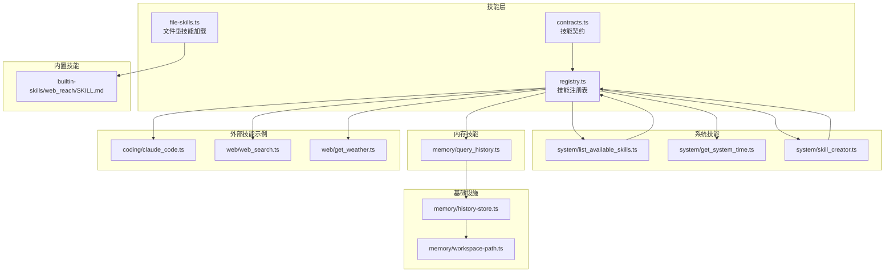
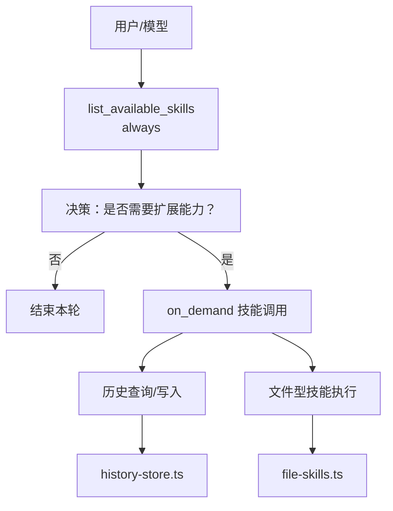
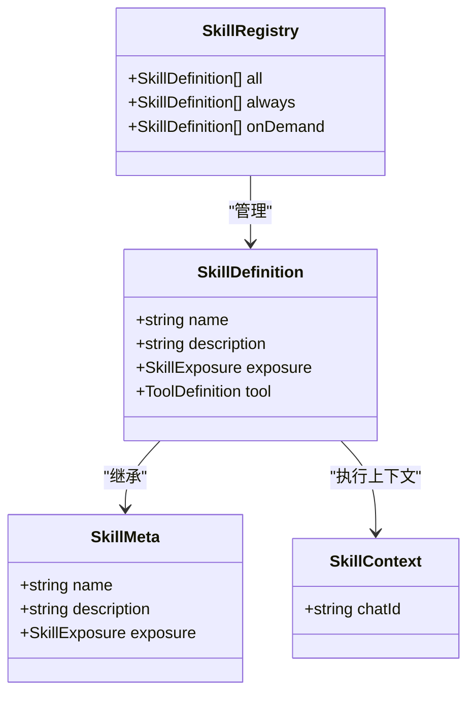
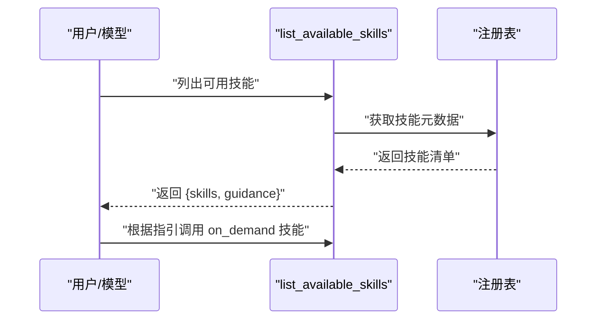
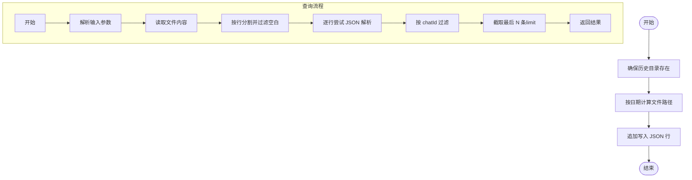
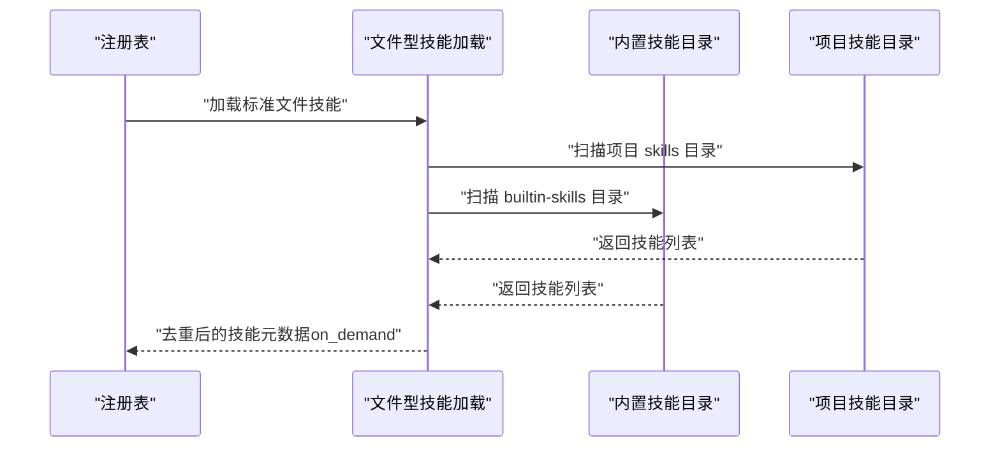
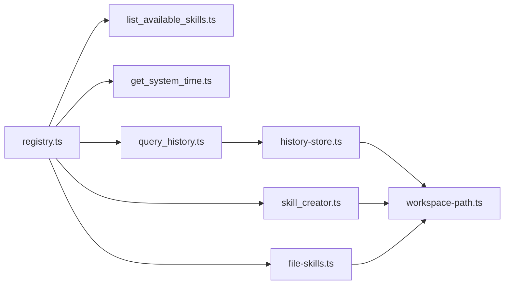

# 第3期：技能按需披露

<cite>
**本文引用的文件**
- [StupidClaw-第3期-Skills不是越多越好关键是按需披露.md](file://StupidClaw-第3期-Skills不是越多越好关键是按需披露.md)
- [README.md](file://README.md)
- [src/skills/registry.ts](file://src/skills/registry.ts)
- [src/skills/contracts.ts](file://src/skills/contracts.ts)
- [src/skills/file-skills.ts](file://src/skills/file-skills.ts)
- [src/skills/system/list_available_skills.ts](file://src/skills/system/list_available_skills.ts)
- [src/skills/system/get_system_time.ts](file://src/skills/system/get_system_time.ts)
- [src/skills/system/skill_creator.ts](file://src/skills/system/skill_creator.ts)
- [src/skills/memory/query_history.ts](file://src/skills/memory/query_history.ts)
- [src/memory/history-store.ts](file://src/memory/history-store.ts)
- [src/memory/workspace-path.ts](file://src/memory/workspace-path.ts)
- [src/skills/coding/claude_code.ts](file://src/skills/coding/claude_code.ts)
- [src/skills/web/web_search.ts](file://src/skills/web/web_search.ts)
- [src/skills/web/get_weather.ts](file://src/skills/web/get_weather.ts)
- [builtin-skills/web_reach/SKILL.md](file://builtin-skills/web_reach/SKILL.md)
</cite>

## 目录
1. [简介](#简介)
2. [项目结构](#项目结构)
3. [核心组件](#核心组件)
4. [架构总览](#架构总览)
5. [详细组件分析](#详细组件分析)
6. [依赖关系分析](#依赖关系分析)
7. [性能考量](#性能考量)
8. [故障排查指南](#故障排查指南)
9. [结论](#结论)
10. [附录](#附录)

## 简介
本教程聚焦“技能按需披露”的设计理念与实现。通过“always/on_demand”两级披露策略，将“入口能力”与“扩展能力”解耦，使模型在首轮仅接触必要工具，随后根据上下文按需发现并调用更丰富的技能。本期内置了系统工具、历史记录与文件型技能加载能力，并以最小闭环验证了“先目录、后按需”的交互范式。

## 项目结构
围绕技能系统的关键目录与文件如下：
- 技能契约与注册表：contracts.ts、registry.ts
- 内置系统技能：system/*（如 list_available_skills、get_system_time、skill_creator）
- 内置内存技能：memory/*（如 query_history）
- 文件型技能加载：file-skills.ts（扫描 .stupidClaw/skills 与 builtin-skills）
- 历史存储：history-store.ts、workspace-path.ts
- 示例外部技能：coding/claude_code.ts、web/web_search.ts、web/get_weather.ts
- 内置示例技能文档：builtin-skills/web_reach/SKILL.md

图表来源
- [src/skills/registry.ts:23-54](file://src/skills/registry.ts#L23-L54)
- [src/skills/contracts.ts:4-19](file://src/skills/contracts.ts#L4-L19)
- [src/skills/file-skills.ts:26-64](file://src/skills/file-skills.ts#L26-L64)
- [src/skills/system/list_available_skills.ts:4-39](file://src/skills/system/list_available_skills.ts#L4-L39)
- [src/skills/system/get_system_time.ts:4-37](file://src/skills/system/get_system_time.ts#L4-L37)
- [src/skills/system/skill_creator.ts:65-311](file://src/skills/system/skill_creator.ts#L65-L311)
- [src/skills/memory/query_history.ts:5-56](file://src/skills/memory/query_history.ts#L5-L56)
- [src/memory/history-store.ts:50-82](file://src/memory/history-store.ts#L50-L82)
- [src/memory/workspace-path.ts:32-41](file://src/memory/workspace-path.ts#L32-L41)
- [src/skills/coding/claude_code.ts:8-98](file://src/skills/coding/claude_code.ts#L8-L98)
- [src/skills/web/web_search.ts:16-94](file://src/skills/web/web_search.ts#L16-L94)
- [src/skills/web/get_weather.ts:30-109](file://src/skills/web/get_weather.ts#L30-L109)
- [builtin-skills/web_reach/SKILL.md:1-122](file://builtin-skills/web_reach/SKILL.md#L1-L122)

章节来源
- [README.md:22-51](file://README.md#L22-L51)
- [StupidClaw-第3期-Skills不是越多越好关键是按需披露.md:72-84](file://StupidClaw-第3期-Skills不是越多越好关键是按需披露.md#L72-L84)

## 核心组件
- 技能契约与暴露级别
  - 技能元数据包含名称、描述与暴露级别（always/on_demand）。
  - 技能定义在元数据基础上附加可执行工具（tool），确保参数与执行结果可序列化。
- 技能注册表
  - 将内置技能按暴露级别分类：always 与 on_demand。
  - 提供统一的“技能目录”工具，返回技能清单与使用指引。
- 文件型技能加载
  - 自动扫描项目与内置技能目录，去重合并，统一暴露为 on_demand 技能。
- 历史存储与查询
  - 历史事件以 JSONL 追加写入，按日期切分文件，支持按日期、chatId、limit 查询。
  - 对坏行具备容错处理，保证可回溯优先。

章节来源
- [src/skills/contracts.ts:4-19](file://src/skills/contracts.ts#L4-L19)
- [src/skills/registry.ts:13-54](file://src/skills/registry.ts#L13-L54)
- [src/skills/file-skills.ts:15-64](file://src/skills/file-skills.ts#L15-L64)
- [src/skills/system/list_available_skills.ts:4-39](file://src/skills/system/list_available_skills.ts#L4-L39)
- [src/memory/history-store.ts:50-82](file://src/memory/history-store.ts#L50-L82)

## 架构总览
技能系统采用“注册表 + 目录工具 + 按需加载”的分层架构：
- 注册表负责聚合与分类内置技能，形成 always/on_demand 两套集合。
- 目录工具提供统一的技能清单与使用指引，引导模型先调用 always 技能，再按需调用 on_demand。
- 文件型技能加载在运行时动态发现并注入 on_demand 技能，实现“按需披露”。

图表来源
- [src/skills/registry.ts:40-51](file://src/skills/registry.ts#L40-L51)
- [src/skills/system/list_available_skills.ts:16-36](file://src/skills/system/list_available_skills.ts#L16-L36)
- [src/skills/memory/query_history.ts:31-53](file://src/skills/memory/query_history.ts#L31-L53)
- [src/memory/history-store.ts:37-82](file://src/memory/history-store.ts#L37-L82)
- [src/skills/file-skills.ts:26-64](file://src/skills/file-skills.ts#L26-L64)

## 详细组件分析

### 技能注册表与暴露策略
- 注册表职责
  - 聚合内置技能，构造“技能目录”工具。
  - 将技能分为 always 与 on_demand 两类，分别用于首轮曝光与按需发现。
- 暴露策略
  - always：系统时间、技能目录等“入口能力”，确保模型首轮即可使用。
  - on_demand：历史查询、技能创建、外部工具等“扩展能力”，仅在需要时被发现与调用。

图表来源
- [src/skills/contracts.ts:6-19](file://src/skills/contracts.ts#L6-L19)
- [src/skills/registry.ts:13-54](file://src/skills/registry.ts#L13-L54)

章节来源
- [src/skills/registry.ts:23-54](file://src/skills/registry.ts#L23-L54)
- [src/skills/contracts.ts:4-19](file://src/skills/contracts.ts#L4-L19)

### 技能目录工具：先目录，后按需
- 功能要点
  - 返回技能清单（名称、暴露级别、描述）与使用指引。
  - 强制“先 always，再 on_demand”的调用顺序，降低误用风险。
- 输出结构
  - skills：标准化的技能元数据列表。
  - guidance：明确的使用顺序与工作目录说明。

图表来源
- [src/skills/system/list_available_skills.ts:4-39](file://src/skills/system/list_available_skills.ts#L4-L39)
- [src/skills/registry.ts:40-47](file://src/skills/registry.ts#L40-L47)

章节来源
- [src/skills/system/list_available_skills.ts:4-39](file://src/skills/system/list_available_skills.ts#L4-L39)
- [src/skills/registry.ts:40-47](file://src/skills/registry.ts#L40-L47)

### 历史存储与查询：append-only JSONL
- 写入流程
  - 确保历史目录存在，按 UTC 日期计算文件名，追加单行 JSON。
- 查询流程
  - 支持按日期、chatId、limit 过滤，对坏行进行容错处理，避免整次查询失败。
- 安全与边界
  - 使用安全路径解析，禁止绝对路径与路径穿越，确保只能在沙盒内读写。

图表来源
- [src/memory/history-store.ts:37-82](file://src/memory/history-store.ts#L37-L82)
- [src/memory/workspace-path.ts:32-41](file://src/memory/workspace-path.ts#L32-L41)

章节来源
- [src/memory/history-store.ts:50-82](file://src/memory/history-store.ts#L50-L82)
- [src/memory/workspace-path.ts:32-41](file://src/memory/workspace-path.ts#L32-L41)

### 文件型技能加载：动态技能注入
- 加载范围
  - 项目技能目录与内置技能目录，自动去重合并。
- 暴露策略
  - 统一标记为 on_demand，随目录一起呈现给模型。
- 目录结构
  - 每个技能独立子目录，包含 SKILL.md 文档，描述触发条件与执行步骤。

图表来源
- [src/skills/file-skills.ts:26-64](file://src/skills/file-skills.ts#L26-L64)
- [src/skills/registry.ts:40-47](file://src/skills/registry.ts#L40-L47)

章节来源
- [src/skills/file-skills.ts:15-64](file://src/skills/file-skills.ts#L15-L64)
- [builtin-skills/web_reach/SKILL.md:1-122](file://builtin-skills/web_reach/SKILL.md#L1-L122)

### 示例技能：系统时间、技能创建、历史查询
- 系统时间（always）
  - 返回 ISO 与本地时间字符串，作为“入口能力”之一。
- 技能创建（on_demand）
  - 支持读取、创建、更新 SKILL.md，规范化技能名称，构建标准模板。
- 历史查询（on_demand）
  - 支持按日期、chatId、limit 查询历史事件，返回结构化 JSON。

章节来源
- [src/skills/system/get_system_time.ts:4-37](file://src/skills/system/get_system_time.ts#L4-L37)
- [src/skills/system/skill_creator.ts:65-311](file://src/skills/system/skill_creator.ts#L65-L311)
- [src/skills/memory/query_history.ts:5-56](file://src/skills/memory/query_history.ts#L5-L56)

### 示例技能：外部能力（演示按需披露）
- Claude Code（on_demand）
  - 调用本地 Claude Code CLI 执行编程任务，支持工作目录与超时控制。
- Web 搜索（on_demand）
  - 通过 Brave Search API 搜索互联网，返回标题、链接与摘要。
- 天气查询（on_demand）
  - 通过 wttr.in 获取实时天气与今日预报，支持中英城市名。

章节来源
- [src/skills/coding/claude_code.ts:8-98](file://src/skills/coding/claude_code.ts#L8-L98)
- [src/skills/web/web_search.ts:16-94](file://src/skills/web/web_search.ts#L16-L94)
- [src/skills/web/get_weather.ts:30-109](file://src/skills/web/get_weather.ts#L30-L109)

## 依赖关系分析
- 组件耦合
  - 注册表依赖各内置技能工厂函数与文件型技能加载器。
  - 目录工具依赖注册表提供的技能元数据。
  - 历史查询依赖历史存储模块与安全路径解析。
- 外部依赖
  - 天气与搜索技能依赖第三方 API，需配置相应密钥。
  - 编程技能依赖本地 CLI 工具，需提前安装。

图表来源
- [src/skills/registry.ts:23-54](file://src/skills/registry.ts#L23-L54)
- [src/skills/system/list_available_skills.ts:4-39](file://src/skills/system/list_available_skills.ts#L4-L39)
- [src/skills/system/get_system_time.ts:4-37](file://src/skills/system/get_system_time.ts#L4-L37)
- [src/skills/system/skill_creator.ts:65-311](file://src/skills/system/skill_creator.ts#L65-L311)
- [src/skills/memory/query_history.ts:5-56](file://src/skills/memory/query_history.ts#L5-L56)
- [src/skills/file-skills.ts:26-64](file://src/skills/file-skills.ts#L26-L64)
- [src/memory/history-store.ts:50-82](file://src/memory/history-store.ts#L50-L82)
- [src/memory/workspace-path.ts:32-41](file://src/memory/workspace-path.ts#L32-L41)

章节来源
- [src/skills/registry.ts:23-54](file://src/skills/registry.ts#L23-L54)
- [src/skills/file-skills.ts:26-64](file://src/skills/file-skills.ts#L26-L64)
- [src/memory/history-store.ts:50-82](file://src/memory/history-store.ts#L50-L82)

## 性能考量
- JSONL 追加写入
  - 单线程顺序写入，避免随机 IO；按日期切分文件，便于清理与归档。
- 查询优化
  - 限制每页返回条数上限，避免大文件全量解析；对坏行跳过，减少失败影响面。
- 外部调用
  - 搜索与天气接口设置合理超时与缓冲区上限；CLI 调用设置超时，避免阻塞。
- 动态加载
  - 文件型技能仅在需要时被发现与注入，避免启动时的全量扫描成本。

## 故障排查指南
- “技能目录为空”
  - 检查项目与内置技能目录是否存在；确认文件命名与 frontmatter 正确。
- “历史查询失败”
  - 确认历史文件存在且可读；检查日期格式与 chatId 是否匹配；关注坏行导致的解析异常。
- “外部 API 失败”
  - 检查环境变量是否配置（如 BRAVE_SEARCH_API_KEY）；确认网络可达与返回状态码。
- “本地 CLI 不可用”
  - 确认 CLI 工具已安装并可在 PATH 中找到；检查工作目录权限与超时设置。

章节来源
- [src/skills/web/web_search.ts:34-46](file://src/skills/web/web_search.ts#L34-L46)
- [src/skills/coding/claude_code.ts:56-82](file://src/skills/coding/claude_code.ts#L56-L82)
- [src/memory/history-store.ts:72-81](file://src/memory/history-store.ts#L72-L81)

## 结论
本教程展示了“按需披露”的最小可行实现：通过 always/on_demand 的分层与目录工具的引导，将“入口能力”与“扩展能力”解耦，使模型在首轮仅接触必要工具，随后根据上下文按需发现并调用。配合文件型技能加载与历史存储，系统实现了可演进、可回溯、可容错的技能体系。下一阶段可在此基础上引入长期记忆与安全沙盒，进一步提升稳定性与安全性。

## 附录

### 技能开发最佳实践
- 明确定义触发条件
  - 在 SKILL.md 的 description 中明确“做什么”和“何时触发”的具体用户短语/场景。
- 保持参数与执行结果可序列化
  - 工具参数与返回值尽量为结构化 JSON，避免隐式状态。
- 优先使用 always 作为入口
  - 将“目录查询”“系统时间”等作为 always，引导模型先发现再执行。
- 容错与提示
  - 对外部 API 与 CLI 调用提供清晰的错误提示与降级方案。
- 安全边界
  - 严格使用安全路径解析，禁止绝对路径与路径穿越；对外部工具调用设置超时与缓冲区上限。

### 内置技能使用示例
- 列出可用技能
  - 调用目录工具，获取技能清单与使用指引。
- 回顾历史
  - 按日期与 chatId 查询历史事件，结合上下文进行决策。
- 创建新技能
  - 先与模型确认触发条件与输出格式，再调用技能创建工具生成 SKILL.md。

章节来源
- [src/skills/system/list_available_skills.ts:16-36](file://src/skills/system/list_available_skills.ts#L16-L36)
- [src/skills/memory/query_history.ts:31-53](file://src/skills/memory/query_history.ts#L31-L53)
- [src/skills/system/skill_creator.ts:127-308](file://src/skills/system/skill_creator.ts#L127-L308)
- [builtin-skills/web_reach/SKILL.md:1-122](file://builtin-skills/web_reach/SKILL.md#L1-L122)