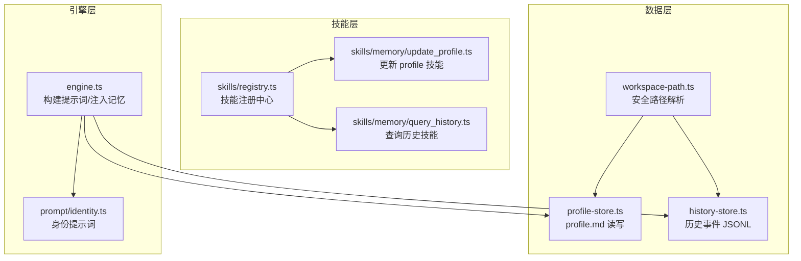
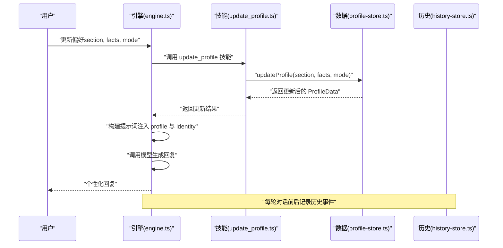
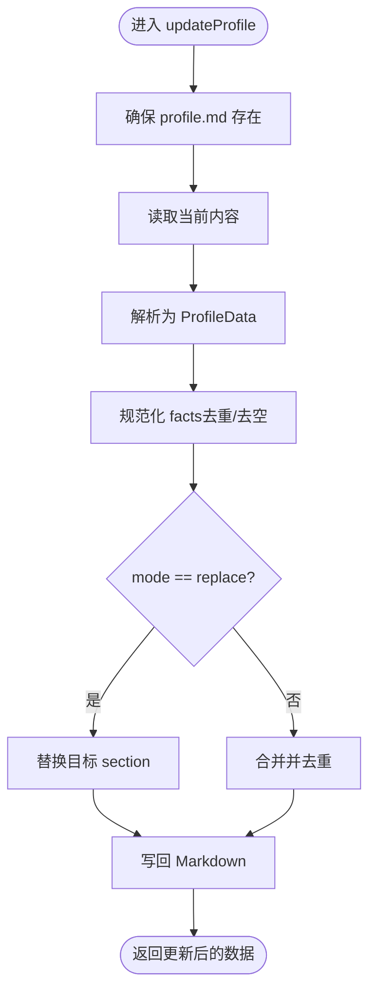
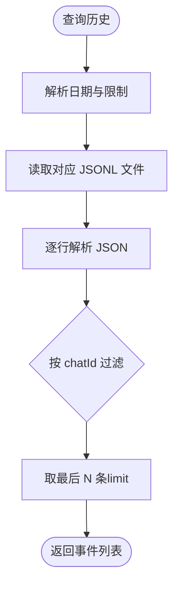
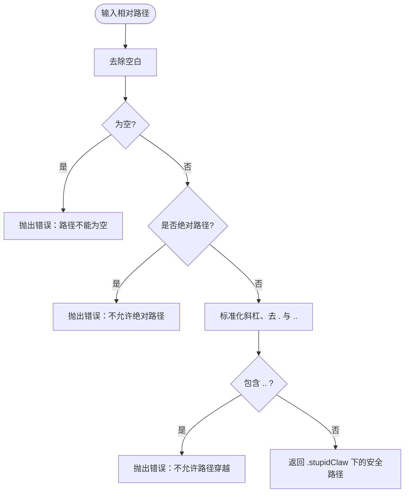
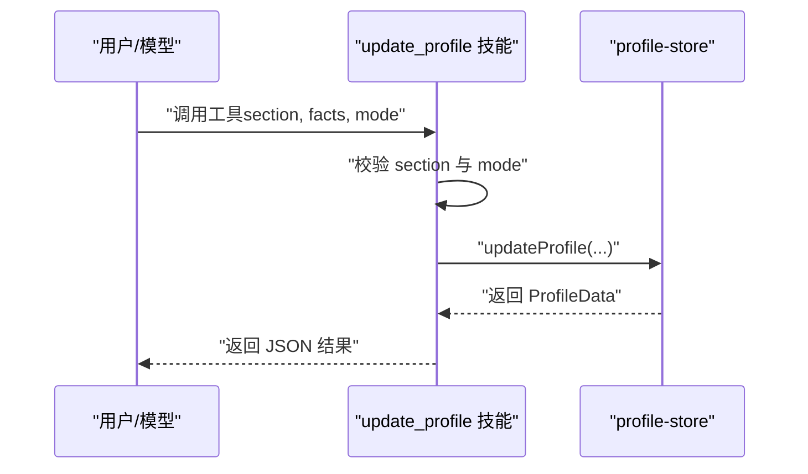
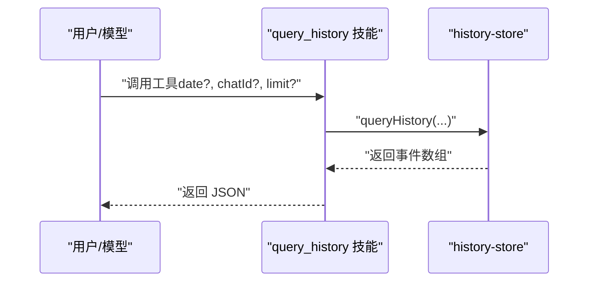
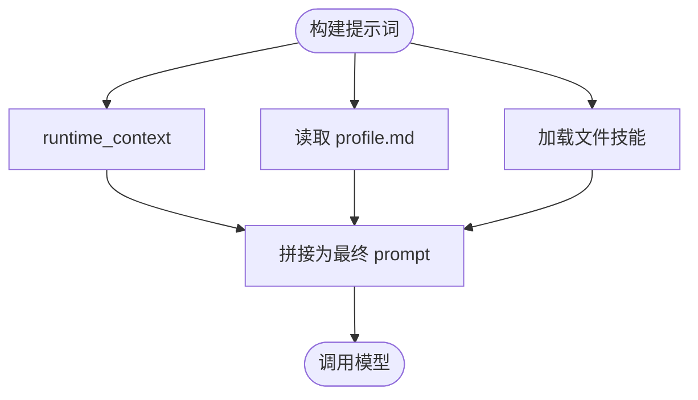
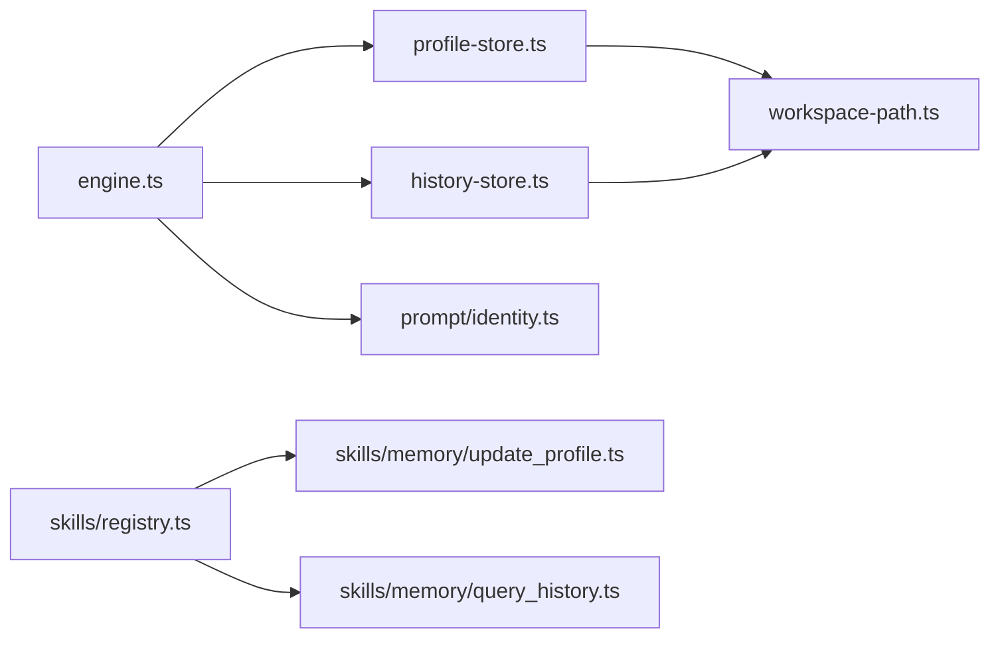

# 第4期：长期记忆管理

<cite>
**本文引用的文件**
- [src/memory/profile-store.ts](file://src/memory/profile-store.ts)
- [src/memory/history-store.ts](file://src/memory/history-store.ts)
- [src/memory/workspace-path.ts](file://src/memory/workspace-path.ts)
- [src/skills/memory/update_profile.ts](file://src/skills/memory/update_profile.ts)
- [src/skills/memory/query_history.ts](file://src/skills/memory/query_history.ts)
- [src/skills/registry.ts](file://src/skills/registry.ts)
- [src/engine.ts](file://src/engine.ts)
- [src/prompt/identity.ts](file://src/prompt/identity.ts)
- [src/skills/contracts.ts](file://src/skills/contracts.ts)
- [StupidClaw-第4期-用profile做长期记忆让Agent记住你.md](file://StupidClaw-第4期-用profile做长期记忆让Agent记住你.md)
- [AGENTS.md](file://AGENTS.md)
- [src/memory/workspace-path.test.ts](file://src/memory/workspace-path.test.ts)
- [src/cron/jobs-store.ts](file://src/cron/jobs-store.ts)
</cite>

## 目录
1. [引言](#引言)
2. [项目结构](#项目结构)
3. [核心组件](#核心组件)
4. [架构总览](#架构总览)
5. [组件详解](#组件详解)
6. [依赖关系分析](#依赖关系分析)
7. [性能考量](#性能考量)
8. [故障排查指南](#故障排查指南)
9. [结论](#结论)
10. [附录](#附录)

## 引言
本教程聚焦于 StupidClaw 第4期：用 profile 做长期记忆，让 Agent 记住你。目标是在不引入数据库与复杂检索的前提下，提供“稳定可读写、可重启保留”的长期记忆能力。通过固定分段的 Markdown 文件（profile.md）承载稳定事实、偏好与约束，配合受控的更新入口（update_profile 技能）与历史记录（history-store），实现用户识别、个性化回复与记忆维护。

本教程将系统讲解：
- profile 的数据结构与持久化格式
- 历史记录的组织与查询
- 记忆更新策略与访问控制
- 架构设计与关键流程
- 配置示例与使用方法
- 最佳实践与常见问题

## 项目结构
围绕长期记忆管理，第4期的关键模块如下：
- 数据层
  - profile-store：负责 profile.md 的读取、解析、去重与写回
  - history-store：按日期切分的 JSONL 历史事件存储
  - workspace-path：安全路径解析与沙盒根目录控制
- 技能层
  - update_profile：受控更新 profile 的技能
  - query_history：按日期与 chatId 查询历史的技能
  - 技能注册中心：集中注册与暴露技能
- 引擎层
  - engine：构建每轮对话的系统提示词，注入 profile 与文件技能
  - identity：固定助手身份，确保一致性

图表来源
- [src/memory/workspace-path.ts:1-42](file://src/memory/workspace-path.ts#L1-L42)
- [src/memory/profile-store.ts:1-132](file://src/memory/profile-store.ts#L1-L132)
- [src/memory/history-store.ts:1-83](file://src/memory/history-store.ts#L1-L83)
- [src/skills/registry.ts:1-55](file://src/skills/registry.ts#L1-L55)
- [src/skills/memory/update_profile.ts:1-84](file://src/skills/memory/update_profile.ts#L1-L84)
- [src/skills/memory/query_history.ts:1-57](file://src/skills/memory/query_history.ts#L1-L57)
- [src/engine.ts:484-509](file://src/engine.ts#L484-L509)
- [src/prompt/identity.ts:1-9](file://src/prompt/identity.ts#L1-L9)

章节来源
- [StupidClaw-第4期-用profile做长期记忆让Agent记住你.md:49-61](file://StupidClaw-第4期-用profile做长期记忆让Agent记住你.md#L49-L61)

## 核心组件
- profile-store
  - 职责：确保 profile.md 存在、解析固定分段、执行去重与写回
  - 关键点：固定 section（stable_facts、preferences、constraints）、append/replace 模式、唯一性保证
- history-store
  - 职责：按日期切分 JSONL，支持按 chatId 与 limit 查询
  - 关键点：安全路径解析、日期文件名、异常处理（ENOENT 返回空数组）
- workspace-path
  - 职责：限制路径仅在 .stupidClaw 下，拒绝绝对路径与路径穿越
  - 关键点：normalizeRelativePath、resolveSafePath、ensureWorkspaceDirs
- update_profile 技能
  - 职责：受控更新指定 section，参数校验与模式选择
  - 关键点：仅允许固定 section、append 默认、replace 替换
- query_history 技能
  - 职责：按日期与 chatId 查询历史事件，限制最大返回条数
  - 关键点：默认当天、默认 limit 20、最大 200
- 引擎注入
  - 职责：每轮对话前注入身份提示、profile 与文件技能
  - 关键点：buildTurnPrompt 组合上下文、DEBUG_PROMPT 输出调试信息

章节来源
- [src/memory/profile-store.ts:6-132](file://src/memory/profile-store.ts#L6-L132)
- [src/memory/history-store.ts:8-83](file://src/memory/history-store.ts#L8-L83)
- [src/memory/workspace-path.ts:6-42](file://src/memory/workspace-path.ts#L6-L42)
- [src/skills/memory/update_profile.ts:10-84](file://src/skills/memory/update_profile.ts#L10-L84)
- [src/skills/memory/query_history.ts:5-57](file://src/skills/memory/query_history.ts#L5-L57)
- [src/engine.ts:484-509](file://src/engine.ts#L484-L509)

## 架构总览
下面的序列图展示了“用户更新偏好 -> 引擎注入 profile -> 模型生成个性化回复”的关键流程。

图表来源
- [src/engine.ts:680-705](file://src/engine.ts#L680-L705)
- [src/skills/memory/update_profile.ts:35-81](file://src/skills/memory/update_profile.ts#L35-L81)
- [src/memory/profile-store.ts:117-131](file://src/memory/profile-store.ts#L117-L131)
- [src/memory/history-store.ts:37-42](file://src/memory/history-store.ts#L37-L42)

## 组件详解

### profile-store：长期记忆的数据层
- 数据结构
  - section 类型：stable_facts、preferences、constraints
  - 去重策略：按行 trim 后去重，空行与“(empty)”占位跳过
- 解析与写回
  - 解析：按行匹配“## section”切换当前区段，按“- fact”提取事实
  - 写回：生成 Markdown，空区段写“(empty)”
- 更新策略
  - append：合并现有与新 facts 后去重
  - replace：仅替换目标区段
- 安全与健壮性
  - 确保文件存在（不存在则创建空 profile）
  - 严格按固定 section 写入，拒绝自由拼写

图表来源
- [src/memory/profile-store.ts:103-131](file://src/memory/profile-store.ts#L103-L131)

章节来源
- [src/memory/profile-store.ts:6-132](file://src/memory/profile-store.ts#L6-L132)

### history-store：历史记录管理
- 文件组织
  - 每日一文件，路径为 history/YYYY-MM-DD.jsonl
  - 每行一条 JSONL 事件，包含 ts、chatId、role、type、text/tool/args/result/isError 等
- 写入
  - 按事件时间戳决定日期文件，追加写入
- 查询
  - 支持按 date、chatId、limit 查询，limit 最大 200
  - 未找到文件时返回空数组（ENOENT）

图表来源
- [src/memory/history-store.ts:50-82](file://src/memory/history-store.ts#L50-L82)

章节来源
- [src/memory/history-store.ts:1-83](file://src/memory/history-store.ts#L1-L83)

### workspace-path：安全路径解析与沙盒
- 职责
  - 规定 .stupidClaw 为根目录
  - 拒绝绝对路径、路径穿越（..）、空路径
  - 提供 resolveSafePath 与 ensureWorkspaceDirs
- 测试验证
  - 单元测试覆盖非法路径场景

图表来源
- [src/memory/workspace-path.ts:6-35](file://src/memory/workspace-path.ts#L6-L35)

章节来源
- [src/memory/workspace-path.ts:1-42](file://src/memory/workspace-path.ts#L1-L42)
- [src/memory/workspace-path.test.ts:1-29](file://src/memory/workspace-path.test.ts#L1-L29)

### update_profile 技能：受控的记忆更新入口
- 参数
  - section：仅允许 stable_facts、preferences、constraints
  - facts：字符串数组，每项一条
  - mode：append（默认）或 replace
- 行为
  - 校验 section 合法性
  - 调用 updateProfile 执行更新
  - 返回结构化结果（包含 section、mode、更新后的 profile）

图表来源
- [src/skills/memory/update_profile.ts:35-81](file://src/skills/memory/update_profile.ts#L35-L81)
- [src/memory/profile-store.ts:117-131](file://src/memory/profile-store.ts#L117-L131)

章节来源
- [src/skills/memory/update_profile.ts:1-84](file://src/skills/memory/update_profile.ts#L1-L84)

### query_history 技能：历史查询入口
- 参数
  - date：YYYY-MM-DD，默认当天
  - chatId：可选，按会话过滤
  - limit：默认 20，最大 200
- 行为
  - 调用 queryHistory 读取 JSONL 并解析
  - 返回事件数组或空数组

图表来源
- [src/skills/memory/query_history.ts:31-53](file://src/skills/memory/query_history.ts#L31-L53)
- [src/memory/history-store.ts:50-82](file://src/memory/history-store.ts#L50-L82)

章节来源
- [src/skills/memory/query_history.ts:1-57](file://src/skills/memory/query_history.ts#L1-L57)

### 引擎注入：身份 + profile + 文件技能
- 身份提示词
  - 固定助手身份与风格，避免漂移
- 上下文注入
  - 每轮对话前构建 runtime_context（chat_id、now_iso、now_local）
  - 注入 profile.md 的稳定事实
  - 注入文件技能（SKILL.md）形成 <file_skills> 区域
- 调试
  - DEBUG_PROMPT=1 时打印完整 prompt 与工具/文件技能清单

图表来源
- [src/engine.ts:484-509](file://src/engine.ts#L484-L509)
- [src/prompt/identity.ts:1-9](file://src/prompt/identity.ts#L1-L9)

章节来源
- [src/engine.ts:484-509](file://src/engine.ts#L484-L509)
- [src/prompt/identity.ts:1-9](file://src/prompt/identity.ts#L1-L9)

### 技能注册中心：统一暴露技能
- 注册内置技能：包括 update_profile、query_history、manage_cron_jobs、web_search、get_weather、claude_code 等
- 暴露方式：always/on_demand 两种曝光级别
- 列表能力：提供 list_available_skills 便于调试与发现

章节来源
- [src/skills/registry.ts:23-54](file://src/skills/registry.ts#L23-L54)
- [src/skills/contracts.ts:4-20](file://src/skills/contracts.ts#L4-L20)

## 依赖关系分析
- 组件耦合
  - engine 依赖 profile-store 与 history-store，用于构建提示词与记录历史
  - update_profile 与 query_history 作为技能被 engine 的技能注册中心统一暴露
  - workspace-path 为 profile-store 与 history-store 提供安全路径保障
- 外部依赖
  - pi-coding-agent 与 pi-ai（技能参数 Schema、工具定义）
  - Node.js fs/promises（文件读写）
- 循环依赖
  - 未见循环依赖，模块边界清晰

图表来源
- [src/engine.ts:12-17](file://src/engine.ts#L12-L17)
- [src/skills/registry.ts:24-39](file://src/skills/registry.ts#L24-L39)
- [src/memory/profile-store.ts:18-19](file://src/memory/profile-store.ts#L18-L19)
- [src/memory/history-store.ts:20](file://src/memory/history-store.ts#L20)
- [src/memory/workspace-path.ts:4](file://src/memory/workspace-path.ts#L4)

章节来源
- [src/engine.ts:12-17](file://src/engine.ts#L12-L17)
- [src/skills/registry.ts:24-39](file://src/skills/registry.ts#L24-L39)

## 性能考量
- I/O 特征
  - profile-store：小文件读写，append/replace 写回成本低
  - history-store：每日 JSONL 追加写入，查询按文件读取并截断，适合短期高频对话
- 去重与解析
  - profile 解析与去重为线性扫描，数据规模小时开销可忽略
- 并发与会话
  - 引擎按 chatId 维度复用会话，减少重复初始化成本
- 建议
  - 控制单次 facts 数量，避免超长列表导致解析与写回耗时上升
  - 合理设置 query_history 的 limit，避免一次性读取过多行

## 故障排查指南
- profile.md 未生成或为空
  - 检查 ensureProfileFile 是否被调用（首次读取或更新时会创建）
  - 确认 .stupidClaw 目录可写
- update_profile 失败
  - section 非法：仅允许 stable_facts、preferences、constraints
  - mode 非法：仅支持 append（默认）或 replace
  - 检查 facts 是否为数组
- 历史查询无结果
  - 确认日期是否正确（默认当天）
  - 确认 chatId 是否匹配
  - 检查历史目录是否存在，文件是否可读
- 路径错误
  - workspace-path 拒绝绝对路径、路径穿越与空路径
  - 使用 resolveSafePath 限定在 .stupidClaw 下
- 调试建议
  - 设置 DEBUG_PROMPT=1 查看完整 prompt 与工具清单
  - 设置 DEBUG_STUPIDCLAW=1 查看引擎运行时配置与日志

章节来源
- [src/memory/profile-store.ts:103-110](file://src/memory/profile-store.ts#L103-L110)
- [src/skills/memory/update_profile.ts:42-52](file://src/skills/memory/update_profile.ts#L42-L52)
- [src/memory/history-store.ts:72-82](file://src/memory/history-store.ts#L72-L82)
- [src/memory/workspace-path.ts:6-26](file://src/memory/workspace-path.ts#L6-L26)
- [src/engine.ts:59-73](file://src/engine.ts#L59-L73)

## 结论
第4期通过“固定分段 + 受控更新 + 安全路径”的组合，实现了稳定、可审计、可重启保留的长期记忆。配合历史记录与文件技能注入，引擎能够在每轮对话中将“稳定事实”与“近期上下文”有机结合，既满足个性化回复，又保持实现的简洁与可维护性。后续可在该基础上扩展记忆压缩、摘要与检索能力，但应坚持“先确定性，后智能化”的原则。

## 附录

### 配置示例与使用方法
- 环境变量与最小配置
  - STUPID_MODEL=provider:model_id
  - 对应供应商的 API Key（如 DEEPSEEK_API_KEY）
- 启动与交互
  - 使用 npx stupid-claw 启动，或通过 init 向导生成 .env
  - 可选：配置 TELEGRAM_BOT_TOKEN 或 STUPID_IM_TOKEN
- 调试开关
  - DEBUG_STUPIDCLAW=1：引擎详细日志
  - DEBUG_PROMPT=1：打印完整 prompt 与工具/文件技能清单

章节来源
- [AGENTS.md:143-162](file://AGENTS.md#L143-L162)
- [src/engine.ts:59-73](file://src/engine.ts#L59-L73)

### 数据格式与访问控制
- profile.md 格式
  - 固定分段：## stable_facts / ## preferences / ## constraints
  - 每条事实以 - 开头，空区段写 (empty)
  - 去重与去空处理
- 历史文件格式
  - history/YYYY-MM-DD.jsonl，每行一条事件 JSON
  - 字段：ts、chatId、role、type、text/tool/args/result/isError
- 访问控制
  - 仅允许固定 section 写入
  - 仅允许 append/replace 两种模式
  - 路径解析严格限制在 .stupidClaw 下

章节来源
- [src/memory/profile-store.ts:50-101](file://src/memory/profile-store.ts#L50-L101)
- [src/memory/history-store.ts:8-31](file://src/memory/history-store.ts#L8-L31)
- [src/memory/workspace-path.ts:32-35](file://src/memory/workspace-path.ts#L32-L35)

### 与定时任务的关系
- cron_jobs.json 与 profile/history 独立，但可结合使用
- 通过 manage_cron_jobs 技能创建定时任务，任务中可调用 update_profile 或 query_history

章节来源
- [src/cron/jobs-store.ts:27-146](file://src/cron/jobs-store.ts#L27-L146)
- [src/skills/registry.ts:27-29](file://src/skills/registry.ts#L27-L29)