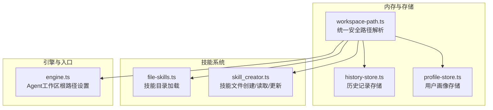
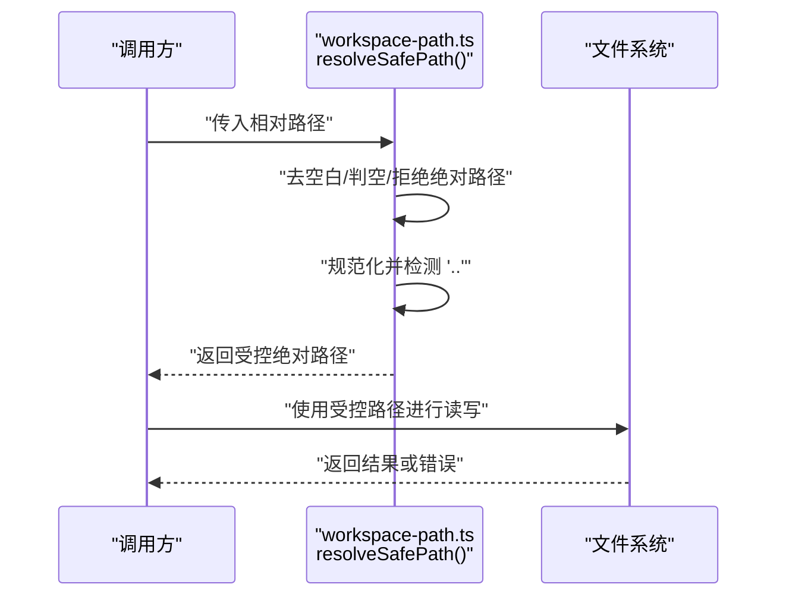
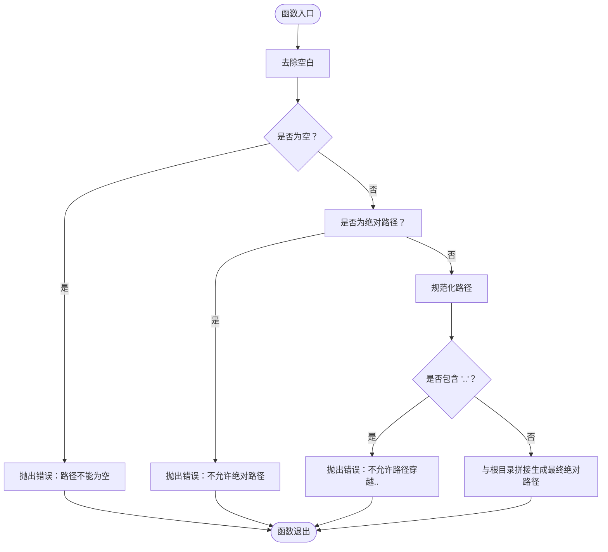
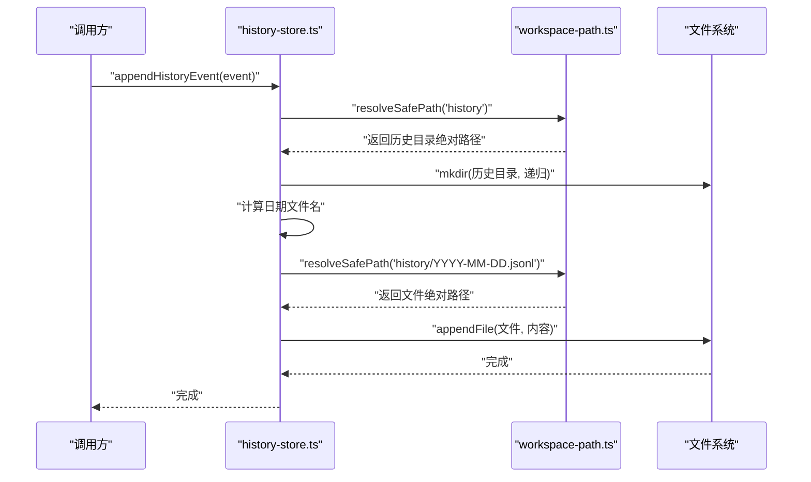
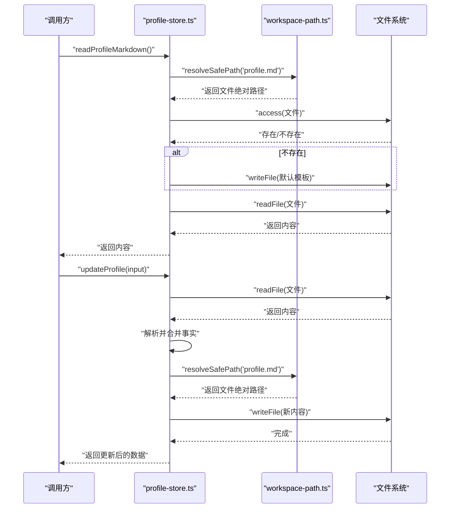
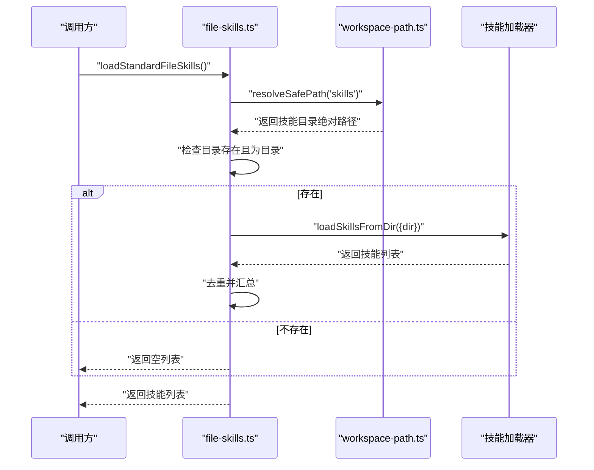
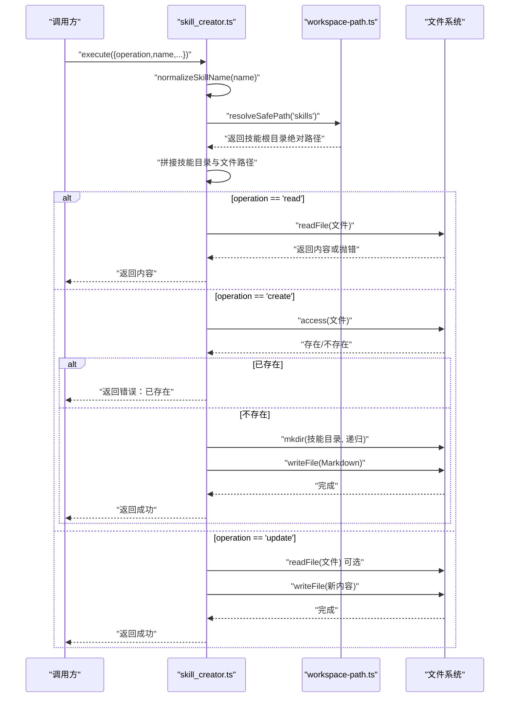
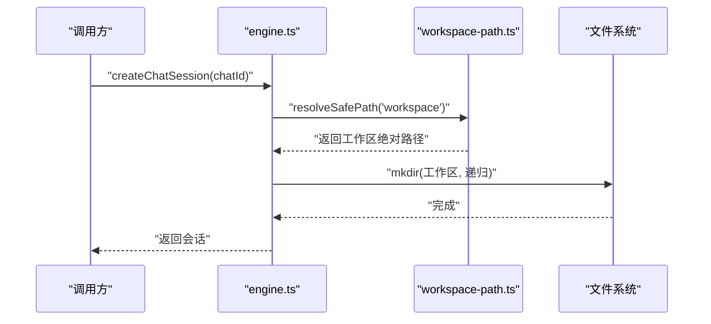
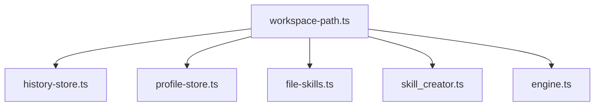

# 第5期：安全沙盒机制

<cite>
**本文档引用的文件**
- [StupidClaw-第5期-安全沙盒PathJailing防止越权读写.md](file://StupidClaw-第5期-安全沙盒PathJailing防止越权读写.md)
- [workspace-path.ts](file://src/memory/workspace-path.ts)
- [workspace-path.test.ts](file://src/memory/workspace-path.test.ts)
- [history-store.ts](file://src/memory/history-store.ts)
- [profile-store.ts](file://src/memory/profile-store.ts)
- [file-skills.ts](file://src/skills/file-skills.ts)
- [skill_creator.ts](file://src/skills/system/skill_creator.ts)
- [engine.ts](file://src/engine.ts)
- [StupidClaw-详细设计文档-v3.md](file://StupidClaw-详细设计文档-v3.md)
- [package.json](file://package.json)
</cite>

## 目录
1. [引言](#引言)
2. [项目结构](#项目结构)
3. [核心组件](#核心组件)
4. [架构总览](#架构总览)
5. [详细组件分析](#详细组件分析)
6. [依赖关系分析](#依赖关系分析)
7. [性能考虑](#性能考虑)
8. [故障排查指南](#故障排查指南)
9. [结论](#结论)
10. [附录](#附录)

## 引言
本教程聚焦于第5期“安全沙盒 Path Jailing，防止越权读写”的设计与实现。目标是在不改变功能的前提下，将所有项目内文件落盘路径统一收敛到 `.stupidClaw/` 目录，并在路径解析阶段严格拒绝越界访问，从而有效防止模型或技能通过路径穿越（如 `../src/index.ts`）越权读写系统中的任意文件。

本节概述了安全沙盒的核心理念：以“一处定义、处处复用”的路径解析器为核心，配合严格的路径校验规则，确保所有文件操作都在受控范围内进行。

## 项目结构
本节展示与安全沙盒相关的关键文件及其在项目中的位置，体现“统一入口、集中校验”的组织方式。

图表来源
- [workspace-path.ts:1-42](file://src/memory/workspace-path.ts#L1-L42)
- [history-store.ts:1-83](file://src/memory/history-store.ts#L1-L83)
- [profile-store.ts:1-132](file://src/memory/profile-store.ts#L1-L132)
- [file-skills.ts:1-65](file://src/skills/file-skills.ts#L1-L65)
- [skill_creator.ts:1-312](file://src/skills/system/skill_creator.ts#L1-L312)
- [engine.ts:1-706](file://src/engine.ts#L1-L706)

章节来源
- [StupidClaw-第5期-安全沙盒PathJailing防止越权读写.md:34-47](file://StupidClaw-第5期-安全沙盒PathJailing防止越权读写.md#L34-L47)

## 核心组件
本节深入解析安全沙盒机制的核心组件，包括统一路径解析器、路径校验规则、以及在各模块中的接入方式。

- 统一路径解析器
  - 提供根目录常量与安全路径解析函数，确保所有文件操作路径均在 `.stupidClaw/` 下。
  - 核心规则：拒绝空路径、拒绝绝对路径、拒绝包含 `..` 的路径穿越、最终路径必须位于根目录之下。
- 路径校验流程
  - 输入路径预处理：去除空白、判断是否为空、判断是否为绝对路径。
  - 规范化与穿越检测：规范化路径后检查是否存在 `..` 片段。
  - 生成最终路径：通过根目录与规范化路径拼接生成绝对路径。
- 模块接入
  - 引擎：Agent 工作区根路径统一由解析器生成。
  - 历史记录：历史目录与每日文件路径统一由解析器生成。
  - 用户画像：profile.md 文件路径统一由解析器生成。
  - 技能目录：项目技能目录与内置技能目录均通过解析器限定范围。
  - 技能创建：技能文件的创建、读取、更新均在受控目录内进行。

章节来源
- [workspace-path.ts:1-42](file://src/memory/workspace-path.ts#L1-L42)
- [engine.ts:37-37](file://src/engine.ts#L37-L37)
- [history-store.ts:20-31](file://src/memory/history-store.ts#L20-L31)
- [profile-store.ts:18-19](file://src/memory/profile-store.ts#L18-L19)
- [file-skills.ts:15-24](file://src/skills/file-skills.ts#L15-L24)
- [skill_creator.ts:7-7](file://src/skills/system/skill_creator.ts#L7-L7)

## 架构总览
本节以序列图形式展示“路径解析器”在整个系统中的作用，体现其作为“安全边界”的定位。

图表来源
- [workspace-path.ts:32-35](file://src/memory/workspace-path.ts#L32-L35)
- [history-store.ts:37-42](file://src/memory/history-store.ts#L37-L42)
- [profile-store.ts:112-131](file://src/memory/profile-store.ts#L112-L131)
- [file-skills.ts:30-48](file://src/skills/file-skills.ts#L30-L48)
- [skill_creator.ts:152-241](file://src/skills/system/skill_creator.ts#L152-L241)

## 详细组件分析

### 组件A：统一路径解析器（workspace-path.ts）
- 设计要点
  - 单一职责：仅负责路径解析与校验，不承担策略对象或可插拔后端。
  - 硬约束：路径安全是硬约束，拒绝一切越界风险。
  - 可复用性：所有模块共享同一解析器，避免“有的地方忘了加校验”的风险。
- 数据结构与算法
  - 输入：相对路径字符串。
  - 规则：空路径拒绝、绝对路径拒绝、包含 `..` 拒绝、最终路径必须位于根目录之下。
  - 输出：规范化后的绝对路径。
- 错误处理
  - 对于非法输入抛出明确错误，便于上层捕获与处理。
- 性能特征
  - 解析过程为常数时间复杂度，开销极低。
  - 无外部依赖，纯路径字符串处理。

图表来源
- [workspace-path.ts:6-26](file://src/memory/workspace-path.ts#L6-L26)
- [workspace-path.ts:32-35](file://src/memory/workspace-path.ts#L32-L35)

章节来源
- [workspace-path.ts:1-42](file://src/memory/workspace-path.ts#L1-L42)
- [workspace-path.test.ts:1-29](file://src/memory/workspace-path.test.ts#L1-L29)

### 组件B：历史记录存储（history-store.ts）
- 设计要点
  - 历史目录与每日文件路径统一由解析器生成，保证所有历史文件均在受控目录下。
  - 读写操作采用异步文件系统接口，异常处理遵循“非文件不存在”错误即向上抛出的原则。
- 关键流程
  - 目录确保：首次使用时自动创建历史目录。
  - 文件定位：根据日期生成文件名并解析为受控路径。
  - 读取与查询：按行解析 JSONL，支持按聊天ID与限制条数过滤。

图表来源
- [history-store.ts:20-42](file://src/memory/history-store.ts#L20-L42)
- [workspace-path.ts:32-35](file://src/memory/workspace-path.ts#L32-L35)

章节来源
- [history-store.ts:1-83](file://src/memory/history-store.ts#L1-L83)

### 组件C：用户画像存储（profile-store.ts）
- 设计要点
  - profile.md 文件路径统一由解析器生成，确保用户画像文件始终位于受控目录。
  - 文件初始化：若不存在则创建默认模板。
  - 写入与读取：采用异步文件系统接口，写入时生成 Markdown 内容并覆盖原文件。
- 关键流程
  - 文件确保：创建工作区目录并确保 profile.md 存在。
  - 读取：直接读取 Markdown 内容。
  - 更新：解析现有内容，按段落更新事实，生成新的 Markdown 并写回。

图表来源
- [profile-store.ts:18-19](file://src/memory/profile-store.ts#L18-L19)
- [profile-store.ts:103-131](file://src/memory/profile-store.ts#L103-L131)
- [workspace-path.ts:32-35](file://src/memory/workspace-path.ts#L32-L35)

章节来源
- [profile-store.ts:1-132](file://src/memory/profile-store.ts#L1-L132)

### 组件D：技能目录加载（file-skills.ts）
- 设计要点
  - 项目技能目录与内置技能目录均通过解析器限定范围，确保技能文件加载在受控目录下。
  - 加载策略：遍历目录，跳过不存在或非目录项，去重后汇总技能列表。
- 关键流程
  - 目录解析：将项目技能目录解析为受控绝对路径。
  - 目录存在性检查：仅在存在且为目录时才加载。
  - 技能汇总：去重后返回技能集合。

图表来源
- [file-skills.ts:15-48](file://src/skills/file-skills.ts#L15-L48)
- [workspace-path.ts:32-35](file://src/memory/workspace-path.ts#L32-L35)

章节来源
- [file-skills.ts:1-65](file://src/skills/file-skills.ts#L1-L65)

### 组件E：技能文件创建/读取/更新（skill_creator.ts）
- 设计要点
  - 技能文件统一在受控目录下创建、读取与更新，名称规范化并确保目录存在。
  - 创建流程：校验描述参数、检查文件是否存在、创建目录并写入 Markdown。
  - 读取流程：读取现有内容并返回。
  - 更新流程：支持完整内容替换或仅更新描述，保留原有正文。
- 关键流程
  - 名称规范化：去除多余字符并确保符合命名规范。
  - 路径解析：技能目录与文件路径均通过解析器生成。
  - 文件操作：创建、读取、写入均在受控目录内进行。

图表来源
- [skill_creator.ts:127-300](file://src/skills/system/skill_creator.ts#L127-L300)
- [workspace-path.ts:32-35](file://src/memory/workspace-path.ts#L32-L35)

章节来源
- [skill_creator.ts:1-312](file://src/skills/system/skill_creator.ts#L1-L312)

### 组件F：引擎工作区根路径（engine.ts）
- 设计要点
  - Agent 工作区根路径统一由解析器生成，确保 Agent 的工作空间位于受控目录下。
  - 工作区创建：首次使用时自动创建工作区目录。
- 关键流程
  - 路径解析：将工作区根目录解析为受控绝对路径。
  - 目录创建：递归创建工作区目录。

图表来源
- [engine.ts:37-37](file://src/engine.ts#L37-L37)
- [engine.ts:421-421](file://src/engine.ts#L421-L421)
- [workspace-path.ts:32-35](file://src/memory/workspace-path.ts#L32-L35)

章节来源
- [engine.ts:1-706](file://src/engine.ts#L1-L706)

## 依赖关系分析
本节展示安全沙盒机制在系统中的依赖关系，强调“统一入口、集中校验”的设计理念。

图表来源
- [workspace-path.ts:1-42](file://src/memory/workspace-path.ts#L1-L42)
- [history-store.ts:1-83](file://src/memory/history-store.ts#L1-L83)
- [profile-store.ts:1-132](file://src/memory/profile-store.ts#L1-L132)
- [file-skills.ts:1-65](file://src/skills/file-skills.ts#L1-L65)
- [skill_creator.ts:1-312](file://src/skills/system/skill_creator.ts#L1-L312)
- [engine.ts:1-706](file://src/engine.ts#L1-L706)

章节来源
- [StupidClaw-第5期-安全沙盒PathJailing防止越权读写.md:68-79](file://StupidClaw-第5期-安全沙盒PathJailing防止越权读写.md#L68-L79)

## 性能考虑
- 路径解析成本极低：字符串处理与少量正则/分割操作，时间复杂度为 O(n)，n 为路径长度。
- I/O 成本为主：文件读写、目录创建等操作的性能取决于磁盘与文件系统，而非路径解析。
- 缓存与复用：统一解析器可避免重复校验，减少模块间重复逻辑，间接提升整体性能。
- 并发安全：路径解析器为纯函数，无状态，天然支持并发调用。

## 故障排查指南
- 越权路径被拒绝
  - 现象：调用解析器时抛出“不允许路径穿越（..）”或“不允许绝对路径”等错误。
  - 排查：检查调用方传入的路径是否包含 `..` 或为绝对路径；确认路径是否通过解析器生成。
  - 参考：测试用例覆盖了拒绝越界路径、绝对路径与空路径的场景。
- 文件不存在错误
  - 现象：读取历史或技能文件时报错，错误码为“文件不存在”。
  - 排查：确认文件路径是否正确、文件是否存在于受控目录下；检查解析器生成的路径是否与预期一致。
  - 参考：历史记录读取对“文件不存在”进行了特殊处理，其余错误直接向上抛出。
- 权限不足或磁盘空间不足
  - 现象：写入或创建目录时报错。
  - 排查：检查运行用户权限、磁盘空间与目录权限；确认解析器生成的路径指向可写目录。
- 配置与调试
  - 可通过调试环境变量查看运行时配置与工作区根路径，辅助定位问题。

章节来源
- [workspace-path.test.ts:14-28](file://src/memory/workspace-path.test.ts#L14-L28)
- [history-store.ts:72-82](file://src/memory/history-store.ts#L72-L82)
- [engine.ts:401-419](file://src/engine.ts#L401-L419)

## 结论
第5期通过“统一路径解析 + 硬拒绝越界”的安全沙盒机制，将所有文件操作限制在 `.stupidClaw/` 目录之内，有效防止了路径穿越导致的越权访问。该设计以最小化复杂度实现了高安全性，同时保持了良好的可维护性与可扩展性。后续可在现有基础上引入更细粒度的权限控制与审计日志，进一步提升系统的安全能力。

## 附录
- 安全策略与最佳实践
  - 严格遵循“统一入口、集中校验”的原则，所有文件操作必须通过解析器生成的受控路径。
  - 禁止在任何模块中绕过解析器直接拼接路径。
  - 对于外部输入的路径参数，务必进行严格的白名单与格式校验。
  - 在生产环境中启用调试与日志记录，以便追踪异常与越权尝试。
- 验收清单
  - 新增统一路径解析器并完成单元测试。
  - 引擎、历史记录、用户画像、技能目录与技能创建模块全部接入解析器。
  - 越权路径（如包含 `..` 或绝对路径）被拒绝。
  - 合法路径的读写与加载保持正常。

章节来源
- [StupidClaw-第5期-安全沙盒PathJailing防止越权读写.md:105-111](file://StupidClaw-第5期-安全沙盒PathJailing防止越权读写.md#L105-L111)
- [StupidClaw-详细设计文档-v3.md:149-170](file://StupidClaw-详细设计文档-v3.md#L149-L170)