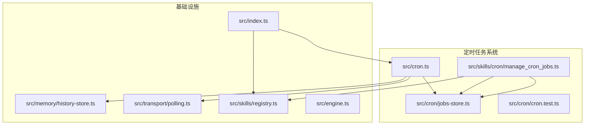
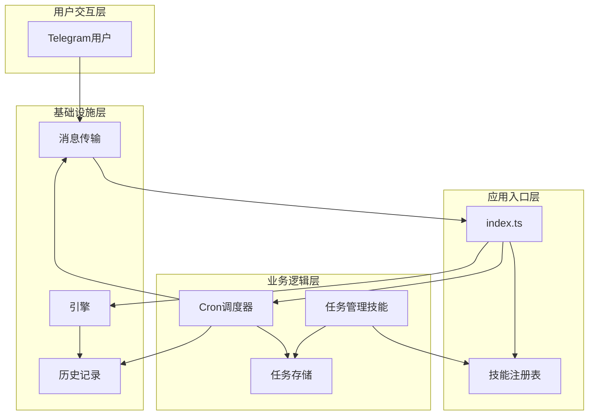
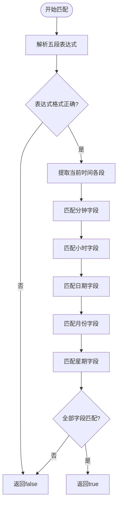
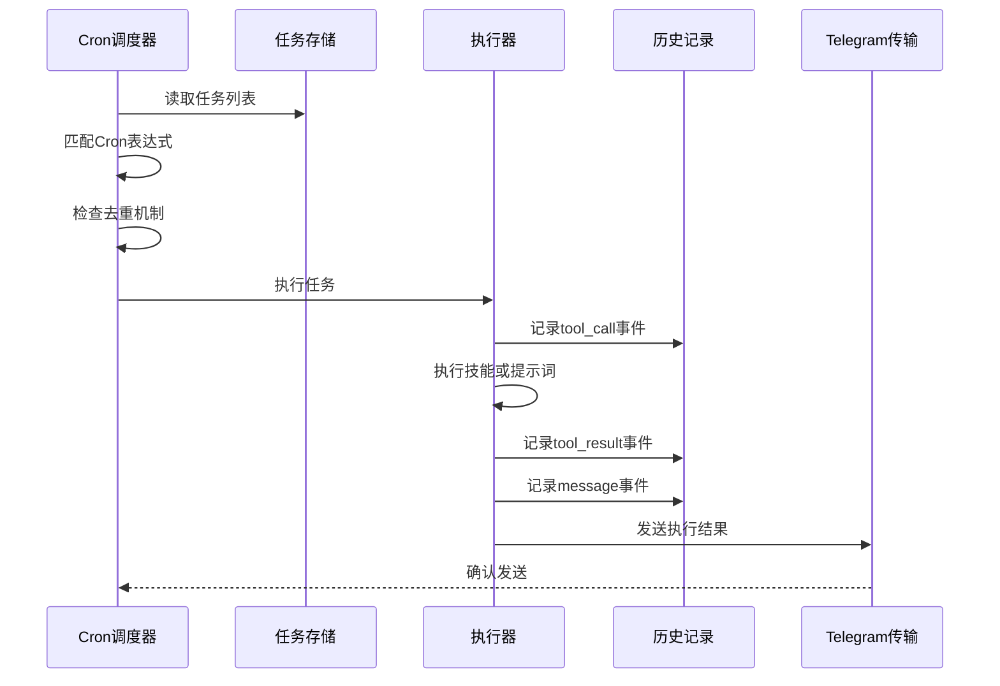
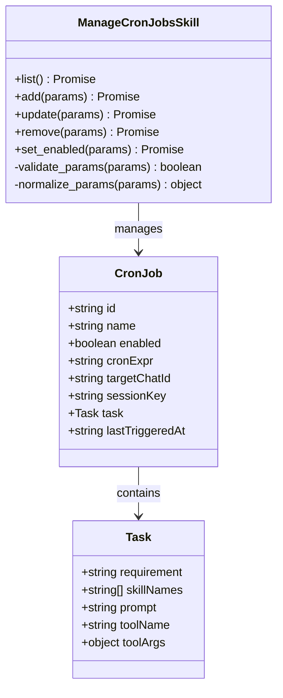
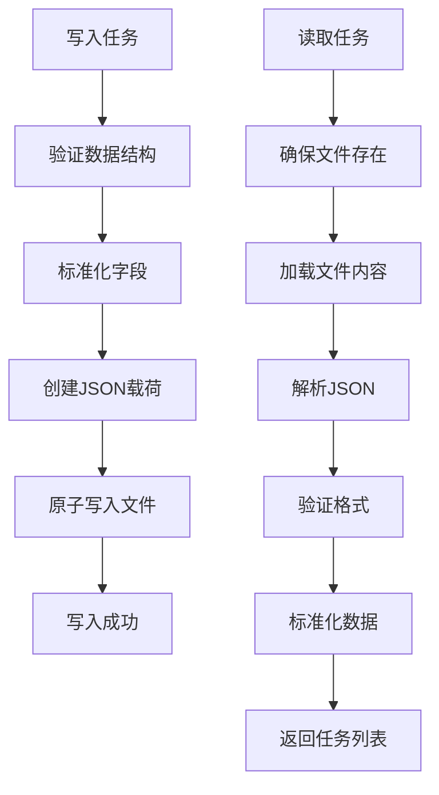
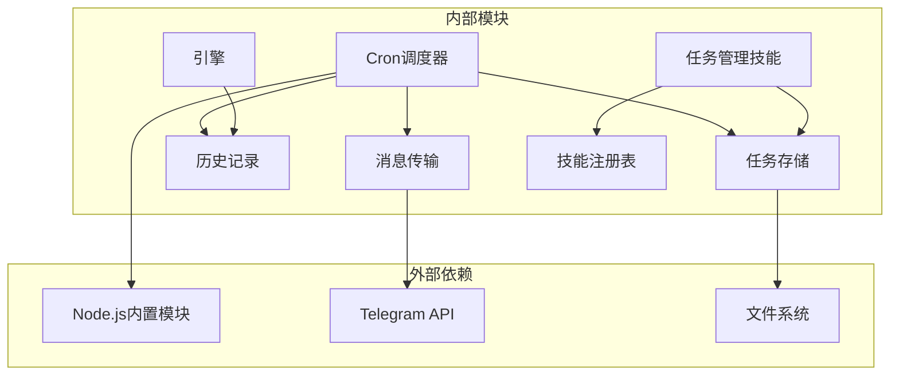

# 第6期：定时任务系统

<cite>
**本文档引用的文件**
- [src/cron.ts](file://src/cron.ts)
- [src/cron/jobs-store.ts](file://src/cron/jobs-store.ts)
- [src/skills/cron/manage_cron_jobs.ts](file://src/skills/cron/manage_cron_jobs.ts)
- [src/cron/cron.test.ts](file://src/cron/cron.test.ts)
- [src/memory/history-store.ts](file://src/memory/history-store.ts)
- [src/transport/polling.ts](file://src/transport/polling.ts)
- [src/index.ts](file://src/index.ts)
- [src/skills/registry.ts](file://src/skills/registry.ts)
- [src/engine.ts](file://src/engine.ts)
- [StupidClaw-第6期-Cron主动触发让Agent自己干活.md](file://StupidClaw-第6期-Cron主动触发让Agent自己干活.md)
</cite>

## 目录
1. [引言](#引言)
2. [项目结构](#项目结构)
3. [核心组件](#核心组件)
4. [架构概览](#架构概览)
5. [详细组件分析](#详细组件分析)
6. [依赖关系分析](#依赖关系分析)
7. [性能考虑](#性能考虑)
8. [故障排除指南](#故障排除指南)
9. [结论](#结论)
10. [附录](#附录)

## 引言

第6期教程专注于构建一个完整的定时任务系统，让Agent能够主动触发执行而非仅依赖用户的被动询问。本系统实现了Cron主动触发机制，包括任务调度算法、任务管理、主动触发策略和执行流程等核心技术。

该系统的核心设计理念是"最小可行闭环"：通过`.stupidClaw/cron_jobs.json`文件持久化任务配置，进程内定时扫描匹配Cron表达式，命中后自动执行技能或提示词，并将结果写入历史记录和主动推送到Telegram。

## 项目结构

第6期的项目结构围绕定时任务系统进行了专门的模块化设计：



**图表来源**
- [src/cron.ts:1-265](file://src/cron.ts#L1-L265)
- [src/cron/jobs-store.ts:1-151](file://src/cron/jobs-store.ts#L1-L151)
- [src/skills/cron/manage_cron_jobs.ts:1-336](file://src/skills/cron/manage_cron_jobs.ts#L1-L336)

**章节来源**
- [StupidClaw-第6期-Cron主动触发让Agent自己干活.md:46-61](file://StupidClaw-第6期-Cron主动触发让Agent自己干活.md#L46-L61)

## 核心组件

### Cron调度器 (src/cron.ts)

Cron调度器是整个系统的核心，负责：
- **Cron表达式解析**：支持分钟、小时、日期、月份、星期五段格式
- **任务匹配算法**：精确匹配当前时间与Cron表达式
- **去重机制**：防止同一分钟内重复触发
- **执行调度**：根据任务类型选择技能执行或提示词执行
- **历史记录**：记录工具调用、结果和消息事件

### 任务存储 (src/cron/jobs-store.ts)

任务存储模块提供：
- **文件持久化**：将任务配置保存在`.stupidClaw/cron_jobs.json`中
- **数据验证**：确保任务配置的完整性和有效性
- **兼容性处理**：支持新旧版本的任务格式迁移
- **原子写入**：整文件覆盖写入，保证数据一致性

### 任务管理技能 (src/skills/cron/manage_cron_jobs.ts)

任务管理技能提供：
- **CRUD操作**：list、add、update、remove、set_enabled
- **参数验证**：严格的输入参数校验
- **模式切换**：支持工具模式(tool)和提示词模式(prompt)
- **智能默认值**：根据上下文自动填充必要参数

**章节来源**
- [src/cron.ts:5-265](file://src/cron.ts#L5-L265)
- [src/cron/jobs-store.ts:4-151](file://src/cron/jobs-store.ts#L4-L151)
- [src/skills/cron/manage_cron_jobs.ts:28-336](file://src/skills/cron/manage_cron_jobs.ts#L28-L336)

## 架构概览

定时任务系统的整体架构采用分层设计，确保职责分离和可维护性：



**图表来源**
- [src/index.ts:112-187](file://src/index.ts#L112-L187)
- [src/cron.ts:251-265](file://src/cron.ts#L251-L265)
- [src/skills/registry.ts:23-54](file://src/skills/registry.ts#L23-L54)

系统的关键特性包括：
- **单文件存储**：所有任务配置集中在一个JSON文件中
- **进程内调度**：使用Node.js内置定时器进行任务调度
- **双模式执行**：支持固定参数工具调用和动态提示词生成
- **完整历史**：记录每个任务执行的完整生命周期

## 详细组件分析

### Cron表达式匹配算法

Cron表达式匹配算法是系统的核心，支持以下语法：



**图表来源**
- [src/cron.ts:85-109](file://src/cron.ts#L85-L109)

算法支持的表达式语法：
- `*`：匹配任意值
- `数字`：精确匹配
- `起止`：范围匹配（如 9-17）
- `*/步进`：步进匹配（如 */15）
- `逗号分隔`：列表匹配（如 0,30）

**章节来源**
- [src/cron.ts:16-83](file://src/cron.ts#L16-L83)

### 任务执行流程

任务执行采用统一的流程，无论使用哪种执行模式：



**图表来源**
- [src/cron.ts:171-249](file://src/cron.ts#L171-L249)

执行流程的关键步骤：
1. **任务发现**：扫描所有启用的任务
2. **表达式匹配**：验证当前时间是否满足Cron条件
3. **去重保护**：确保同一分钟内不重复执行
4. **状态更新**：立即更新最后触发时间
5. **历史记录**：记录完整的执行轨迹
6. **结果通知**：通过Telegram主动推送结果

**章节来源**
- [src/cron.ts:147-249](file://src/cron.ts#L147-L249)

### 任务管理API

任务管理技能提供了完整的CRUD操作接口：



**图表来源**
- [src/skills/cron/manage_cron_jobs.ts:32-336](file://src/skills/cron/manage_cron_jobs.ts#L32-L336)
- [src/cron/jobs-store.ts:4-21](file://src/cron/jobs-store.ts#L4-L21)

支持的操作类型：
- **list**：列出所有任务及其状态
- **add**：创建新任务（需要name、cronExpr、chatId）
- **update**：更新现有任务的任意属性
- **remove**：删除指定任务
- **set_enabled**：启用或禁用任务

**章节来源**
- [src/skills/cron/manage_cron_jobs.ts:10-336](file://src/skills/cron/manage_cron_jobs.ts#L10-L336)

### 数据持久化机制

任务数据采用文件系统持久化，具有以下特点：



**图表来源**
- [src/cron/jobs-store.ts:115-142](file://src/cron/jobs-store.ts#L115-L142)

持久化的优势：
- **简单可靠**：无需数据库依赖，降低复杂度
- **可审计**：所有任务配置都可以直接查看和编辑
- **可移植**：配置文件便于备份和迁移
- **容错**：文件损坏时提供降级处理

**章节来源**
- [src/cron/jobs-store.ts:115-151](file://src/cron/jobs-store.ts#L115-L151)

## 依赖关系分析

定时任务系统的依赖关系清晰明确，遵循单一职责原则：



**图表来源**
- [src/cron.ts:1-3](file://src/cron.ts#L1-L3)
- [src/skills/cron/manage_cron_jobs.ts:1-8](file://src/skills/cron/manage_cron_jobs.ts#L1-L8)

主要依赖关系：
- **Cron调度器**依赖任务存储和历史记录
- **任务管理技能**依赖任务存储和技能注册表
- **消息传输**独立于核心业务逻辑
- **历史记录**提供跨模块的数据共享

**章节来源**
- [src/index.ts:6-10](file://src/index.ts#L6-L10)
- [src/cron.ts:1-4](file://src/cron.ts#L1-L4)

## 性能考虑

定时任务系统在设计时充分考虑了性能和资源使用：

### 调度频率优化
- **15秒间隔**：平衡响应速度和CPU占用
- **异步执行**：避免阻塞主事件循环
- **去重机制**：防止重复触发造成资源浪费

### 内存使用控制
- **惰性加载**：仅在需要时读取任务文件
- **对象池**：复用临时对象减少GC压力
- **流式处理**：历史记录采用追加写入

### I/O优化策略
- **批量写入**：任务状态更新采用原子写入
- **缓存机制**：最近读取的任务数据进行缓存
- **连接复用**：Telegram API连接复用

## 故障排除指南

### 常见问题及解决方案

**问题1：任务不触发**
- 检查Cron表达式格式是否正确
- 验证任务是否处于enabled状态
- 确认当前时间确实满足Cron条件
- 查看任务的lastTriggeredAt字段

**问题2：Telegram消息发送失败**
- 检查TELEGRAM_BOT_TOKEN配置
- 验证chatId的有效性
- 查看网络连接状态
- 检查Telegram API限制

**问题3：任务配置损坏**
- 备份cron_jobs.json文件
- 使用manage_cron_jobs的list功能检查格式
- 重新创建任务配置
- 检查文件权限

**问题4：历史记录异常**
- 确认.history目录权限
- 检查磁盘空间
- 验证JSON格式正确性
- 清理过期的历史文件

**章节来源**
- [src/cron.ts:225-246](file://src/cron.ts#L225-L246)
- [src/transport/polling.ts:215-242](file://src/transport/polling.ts#L215-L242)

### 日志记录和监控

系统提供了多层次的日志记录：
- **调度器日志**：任务触发和执行状态
- **错误日志**：异常情况和故障信息
- **历史记录**：完整的执行轨迹
- **调试模式**：详细的执行过程跟踪

## 结论

第6期的定时任务系统成功实现了Cron主动触发机制，具备以下优势：

1. **简洁高效**：采用最小可行设计，功能完整且易于维护
2. **可靠稳定**：单文件持久化和原子操作确保数据安全
3. **灵活扩展**：支持多种执行模式和任务类型
4. **可观测性**：完整的日志记录和历史追踪
5. **易用性强**：直观的管理接口和配置方式

该系统为后续的功能扩展奠定了坚实基础，包括分布式调度、任务队列、监控告警等高级特性都可以在此基础上进行增强。

## 附录

### 使用示例

**创建每日早报任务**
```json
{
  "action": "add",
  "name": "daily-report",
  "cronExpr": "0 8 * * *",
  "chatId": "123456789",
  "requirement": "生成今天的日报摘要，包含重要事项和待办事项",
  "skillNames": ["generate_daily_report"]
}
```

**创建天气提醒任务**
```json
{
  "action": "add",
  "name": "weather-reminder",
  "cronExpr": "30 7 * * *",
  "chatId": "123456789",
  "requirement": "查询今天天气预报，提醒用户携带雨具",
  "prompt": "请查询北京今天的天气，如果预报有雨，提醒用户携带雨具"
}
```

### 配置选项

**环境变量**
- `TELEGRAM_BOT_TOKEN`：Telegram机器人令牌
- `DEBUG_STUPIDCLAW`：启用调试模式
- `STUPID_MODEL`：指定使用的AI模型

**系统要求**
- Node.js 16+
- Telegram账户和机器人
- 稳定的网络连接
- 足够的磁盘空间用于历史记录