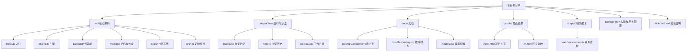
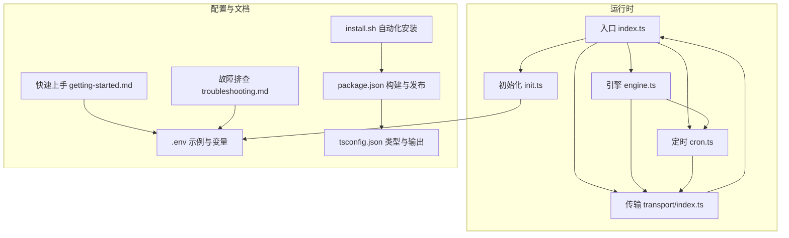
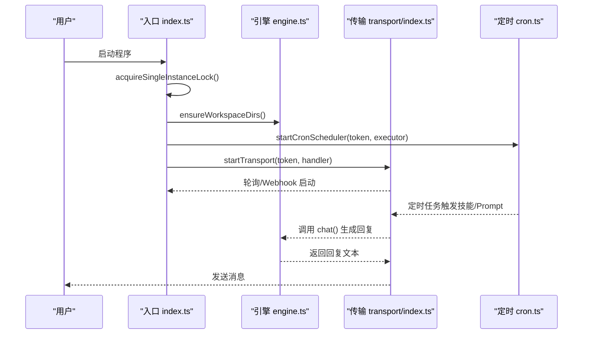
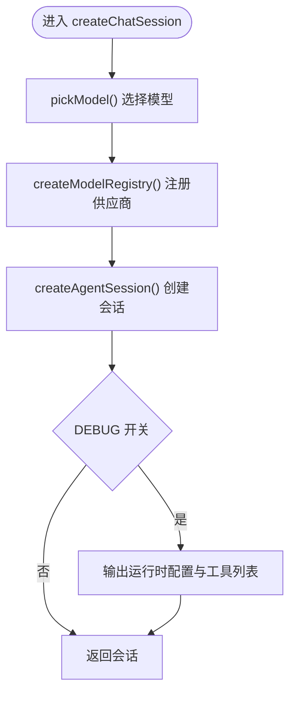
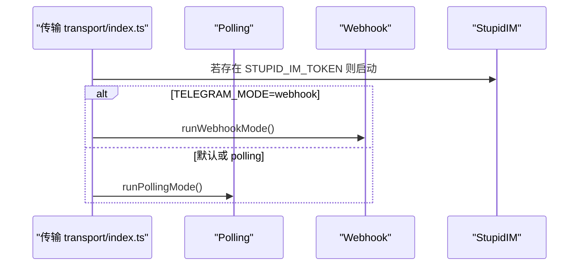
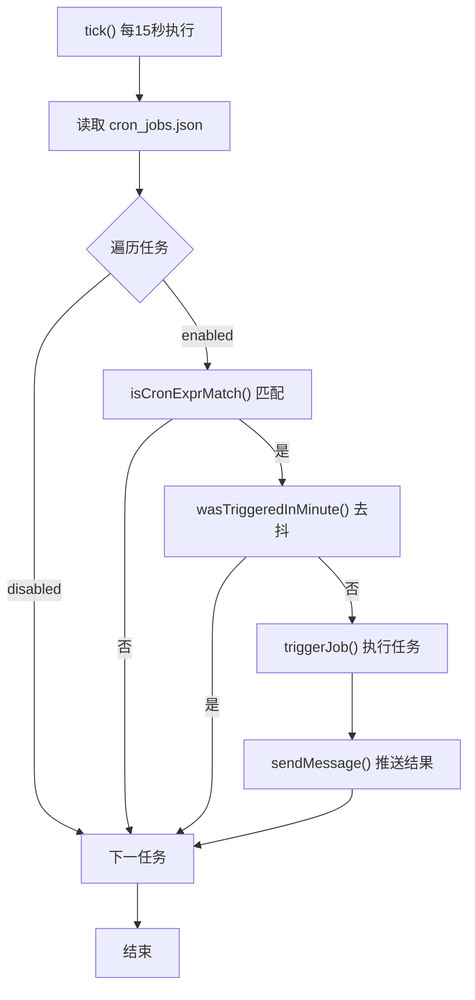
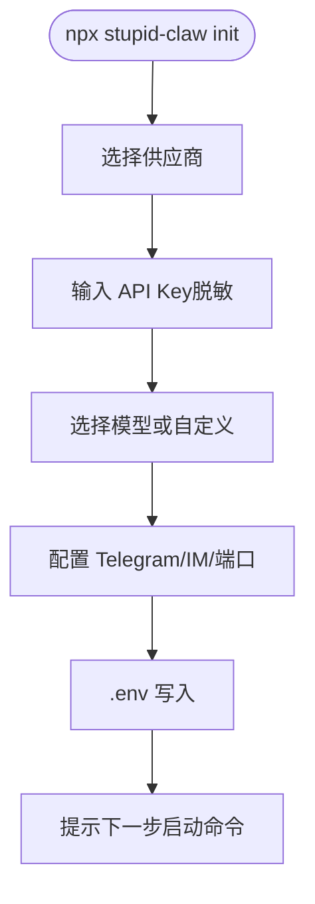
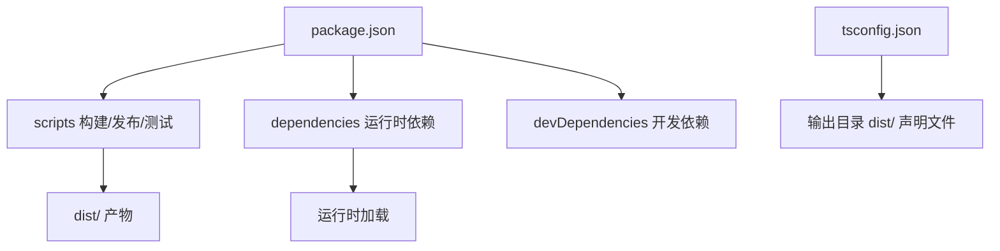

# 第7期：发布与工程收口

<cite>
**本文引用的文件**
- [README.md](file://README.md)
- [StupidClaw-第7期-发布与工程收口.md](file://StupidClaw-第7期-发布与工程收口.md)
- [package.json](file://package.json)
- [install.sh](file://install.sh)
- [tsconfig.json](file://tsconfig.json)
- [src/index.ts](file://src/index.ts)
- [src/engine.ts](file://src/engine.ts)
- [src/init.ts](file://src/init.ts)
- [src/cron.ts](file://src/cron.ts)
- [src/transport/index.ts](file://src/transport/index.ts)
- [docs/getting-started.md](file://docs/getting-started.md)
- [docs/troubleshooting.md](file://docs/troubleshooting.md)
- [AGENTS.md](file://AGENTS.md)
- [DEV_TODO.md](file://DEV_TODO.md)
</cite>

## 目录
1. [引言](#引言)
2. [项目结构](#项目结构)
3. [核心组件](#核心组件)
4. [架构总览](#架构总览)
5. [详细组件分析](#详细组件分析)
6. [依赖关系分析](#依赖关系分析)
7. [性能考量](#性能考量)
8. [故障排查指南](#故障排查指南)
9. [结论](#结论)
10. [附录](#附录)

## 引言
本节面向第7期“发布与工程收口”的目标，系统阐述如何将 StupidClaw 从功能实现阶段转入可交付状态。重点围绕版本管理、打包构建、部署策略、文档完善、测试验证等工程化流程展开，提供可落地的发布步骤与检查清单，帮助团队或个人在15分钟内完成从克隆到跑通的全流程交付。

## 项目结构
StupidClaw 采用“极简本地 Agent”理念，严格限制在指定目录并通过纯文本文件进行记忆存储，不引入数据库与向量库。项目目录与目标结构清晰，便于新用户快速上手与交付。

图表来源
- [README.md:22-51](file://README.md#L22-L51)
- [docs/getting-started.md:166-186](file://docs/getting-started.md#L166-L186)

章节来源
- [README.md:22-51](file://README.md#L22-L51)
- [docs/getting-started.md:166-186](file://docs/getting-started.md#L166-L186)

## 核心组件
- 入口与生命周期管理：负责单实例锁、优雅退出、环境加载与主流程编排。
- 引擎与模型选择：统一的模型注册与选择逻辑，支持多供应商与本地模型。
- 传输层：支持 Polling 与 Webhook 两种模式，具备 StupidIM 网页端能力。
- 定时任务：基于标准 Cron 表达式的调度器，支持技能与 Prompt 两类任务。
- 初始化向导：交互式配置向导，生成 .env 并指导后续步骤。
- 文档与安装脚本：完善快速上手、故障排查与自动化安装流程。

章节来源
- [src/index.ts:112-216](file://src/index.ts#L112-L216)
- [src/engine.ts:196-383](file://src/engine.ts#L196-L383)
- [src/transport/index.ts:47-71](file://src/transport/index.ts#L47-L71)
- [src/cron.ts:251-265](file://src/cron.ts#L251-L265)
- [src/init.ts:224-339](file://src/init.ts#L224-L339)
- [docs/getting-started.md:1-153](file://docs/getting-started.md#L1-L153)
- [docs/troubleshooting.md:1-194](file://docs/troubleshooting.md#L1-L194)
- [install.sh:1-68](file://install.sh#L1-L68)

## 架构总览
StupidClaw 的工程收口以“可交付”为目标，强调文档与流程的完备性。整体架构围绕入口、引擎、传输层、定时任务与文档体系协同工作，形成闭环。

图表来源
- [src/index.ts:112-216](file://src/index.ts#L112-L216)
- [src/engine.ts:392-475](file://src/engine.ts#L392-L475)
- [src/transport/index.ts:47-71](file://src/transport/index.ts#L47-L71)
- [src/cron.ts:251-265](file://src/cron.ts#L251-L265)
- [src/init.ts:224-339](file://src/init.ts#L224-L339)
- [package.json:14-22](file://package.json#L14-L22)
- [tsconfig.json:1-19](file://tsconfig.json#L1-L19)
- [install.sh:1-68](file://install.sh#L1-L68)

## 详细组件分析

### 入口与生命周期管理
- 单实例锁：通过工作目录下的锁文件确保同一时间只有一个实例运行，避免冲突。
- 优雅退出：注册信号处理器，保证退出时释放锁文件。
- 环境加载：支持通过 --config 指定 .env 路径，未检测到 .env 时给出友好提示。
- 主流程编排：创建技能注册表、启动定时任务调度器与传输层。

图表来源
- [src/index.ts:112-216](file://src/index.ts#L112-L216)
- [src/engine.ts:680-706](file://src/engine.ts#L680-L706)
- [src/transport/index.ts:47-71](file://src/transport/index.ts#L47-L71)
- [src/cron.ts:147-249](file://src/cron.ts#L147-L249)

章节来源
- [src/index.ts:45-84](file://src/index.ts#L45-L84)
- [src/index.ts:112-216](file://src/index.ts#L112-L216)

### 引擎与模型选择
- 模型注册：根据环境变量动态注册多个供应商，支持本地模型与自定义兼容接口。
- 模型选择：优先按配置选择，否则回退到可用模型，提供明确的错误提示。
- 会话管理：复用会话、记录历史、调试日志与工具列表输出。

图表来源
- [src/engine.ts:196-383](file://src/engine.ts#L196-L383)
- [src/engine.ts:392-475](file://src/engine.ts#L392-L475)

章节来源
- [src/engine.ts:196-383](file://src/engine.ts#L196-L383)
- [src/engine.ts:392-475](file://src/engine.ts#L392-L475)

### 传输层（Polling/Webhook/StupidIM）
- 模式切换：根据 TELEGRAM_MODE 选择 Polling 或 Webhook；未配置 TELEGRAM_BOT_TOKEN 时仅启用 StupidIM。
- Polling：长轮询拉取消息，异常时自动休眠重试。
- StupidIM：提供网页端 IM，支持 Token 校验与 WebSocket 连接。

图表来源
- [src/transport/index.ts:47-71](file://src/transport/index.ts#L47-L71)

章节来源
- [src/transport/index.ts:19-71](file://src/transport/index.ts#L19-L71)

### 定时任务调度
- 表达式匹配：支持标准 5 段 Cron 表达式，按分/时/日/月/周匹配。
- 去抖与持久化：每分钟仅触发一次，先写入 lastTriggeredAt 防止重复触发。
- 任务类型：技能调用与 Prompt 两类，分别通过工具或聊天接口执行。

图表来源
- [src/cron.ts:171-249](file://src/cron.ts#L171-L249)

章节来源
- [src/cron.ts:85-109](file://src/cron.ts#L85-L109)
- [src/cron.ts:171-249](file://src/cron.ts#L171-L249)

### 初始化向导与自动化安装
- 交互式配置：引导用户选择供应商、输入 API Key、模型与端口等，生成 .env。
- 自动化安装脚本：自动检测并安装 Node.js、pnpm，初始化 .env 并提示启动命令。

图表来源
- [src/init.ts:224-339](file://src/init.ts#L224-L339)

章节来源
- [src/init.ts:224-339](file://src/init.ts#L224-L339)
- [install.sh:17-68](file://install.sh#L17-L68)

## 依赖关系分析
- 构建与发布：TypeScript 编译配置、ESM 模块与声明文件输出；package.json 定义 bin、files、脚本与依赖。
- 运行时依赖：dotenv、@mariozechner/pi-ai、@mariozechner/pi-coding-agent、ws、picocolors、@inquirer/prompts 等。
- 开发依赖：tsx、bun、typescript 等。

图表来源
- [package.json:14-39](file://package.json#L14-L39)
- [tsconfig.json:10-16](file://tsconfig.json#L10-L16)

章节来源
- [package.json:14-39](file://package.json#L14-L39)
- [tsconfig.json:1-19](file://tsconfig.json#L1-L19)

## 性能考量
- 启动性能：入口采用延迟导入 init 子命令，减少冷启动开销。
- 传输层：Polling 模式自动休眠重试，避免频繁请求；Webhook 需公网 HTTPS 与有效证书。
- 定时任务：15 秒粒度扫描，去抖与持久化减少重复触发与 IO 压力。
- 日志与调试：DEBUG 开关与提示词调试，有助于定位性能瓶颈与错误。

## 故障排查指南
- 启动即崩溃：检查 TELEGRAM_BOT_TOKEN 与锁文件残留；清理 .stupidClaw/polling.lock 后重启。
- Bot 无回复：确认 API Key 有效、开启 DEBUG_STUPIDCLAW 查看引擎日志。
- Polling 409 冲突：确保仅有一个实例运行，清理 Webhook 或残留进程。
- Webhook 收不到消息：验证公网 HTTPS 地址、证书有效性与 PORT 一致性。
- Cron 不触发：检查 enabled、cronExpr、时区与当日 history 文件。

章节来源
- [docs/troubleshooting.md:5-194](file://docs/troubleshooting.md#L5-L194)

## 结论
第7期“发布与工程收口”聚焦于可交付性与可维护性，通过补齐文档、完善安装与故障排查流程、统一配置与脚本，使新用户能在15分钟内从 clone 到跑通。在此基础上，项目具备了持续演进与长期维护的良好工程基础。

## 附录

### 发布与工程收口验收清单
- [ ] README.md 5 分钟启动流程完整，新用户可在15分钟内跑通
- [ ] .env.example 包含所有必要变量与注释说明
- [ ] docs/getting-started.md 与 docs/troubleshooting.md 完善
- [ ] install.sh 自动化安装脚本可用
- [ ] package.json 脚本与 files 字段正确，支持构建与发布
- [ ] tsconfig.json 输出配置与声明文件齐全
- [ ] 项目主页 public/index.html 与网页端 IM 资源就绪

章节来源
- [StupidClaw-第7期-发布与工程收口.md:149-155](file://StupidClaw-第7期-发布与工程收口.md#L149-L155)
- [docs/getting-started.md:1-153](file://docs/getting-started.md#L1-L153)
- [docs/troubleshooting.md:1-194](file://docs/troubleshooting.md#L1-L194)
- [install.sh:1-68](file://install.sh#L1-L68)
- [package.json:8-13](file://package.json#L8-L13)
- [tsconfig.json:10-16](file://tsconfig.json#L10-L16)