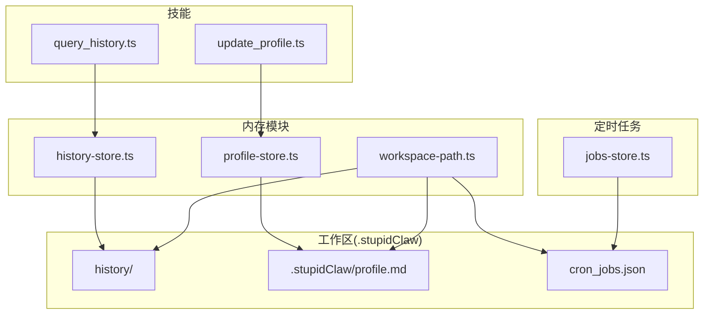
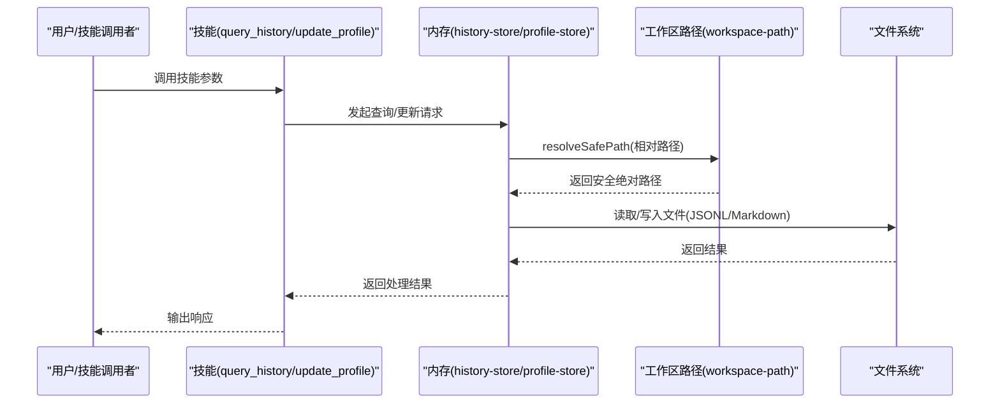
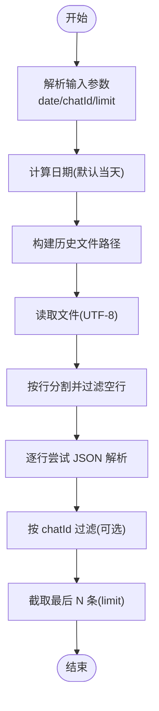
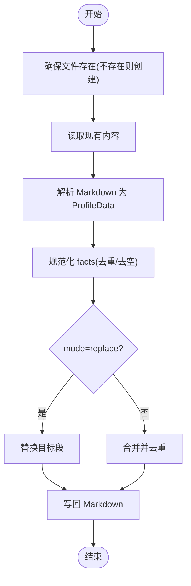
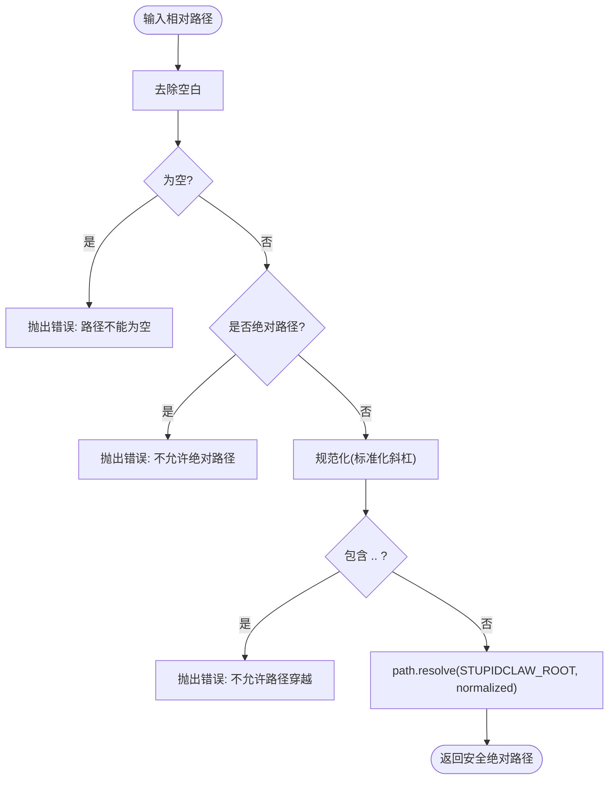
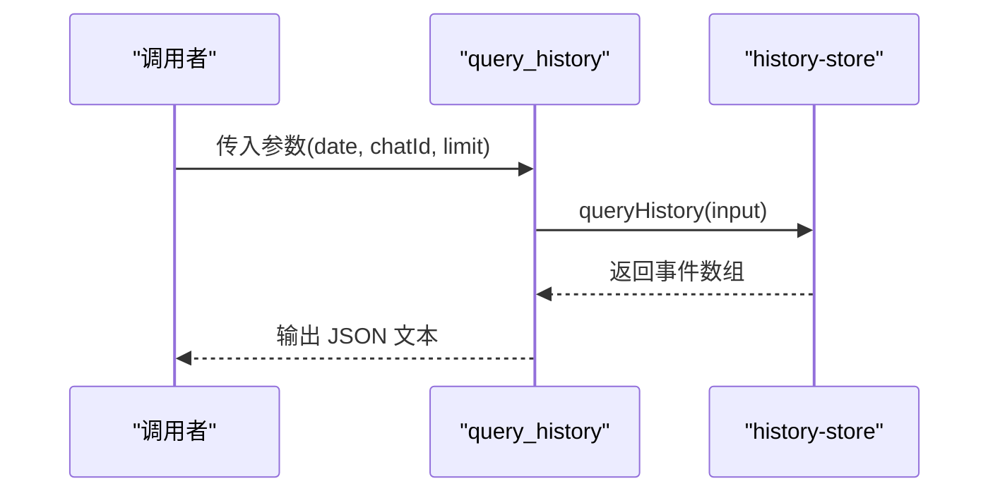
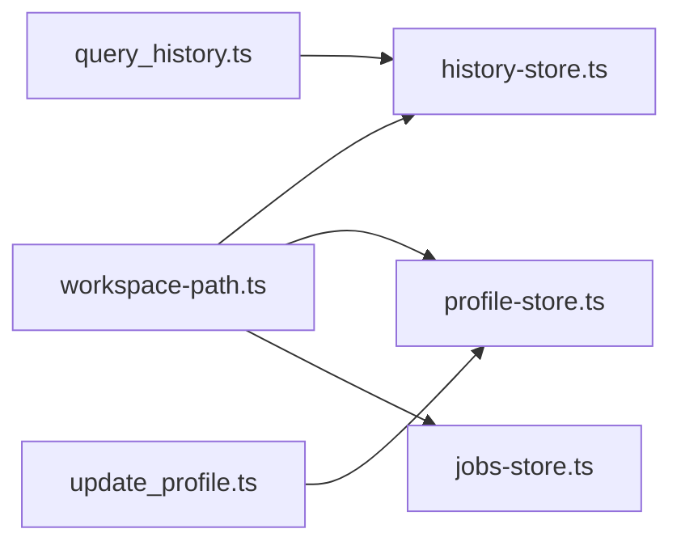

# 内存管理系统

<cite>
**本文引用的文件**
- [history-store.ts](file://src/memory/history-store.ts)
- [profile-store.ts](file://src/memory/profile-store.ts)
- [workspace-path.ts](file://src/memory/workspace-path.ts)
- [query_history.ts](file://src/skills/memory/query_history.ts)
- [update_profile.ts](file://src/skills/memory/update_profile.ts)
- [jobs-store.ts](file://src/cron/jobs-store.ts)
- [workspace-path.test.ts](file://src/memory/workspace-path.test.ts)
- [README.md](file://README.md)
- [StupidClaw-第4期-用profile做长期记忆让Agent记住你.md](file://StupidClaw-第4期-用profile做长期记忆让Agent记住你.md)
- [StupidClaw-第5期-安全沙盒PathJailing防止越权读写.md](file://StupidClaw-第5期-安全沙盒PathJailing防止越权读写.md)
</cite>

## 目录
1. [简介](#简介)
2. [项目结构](#项目结构)
3. [核心组件](#核心组件)
4. [架构总览](#架构总览)
5. [详细组件分析](#详细组件分析)
6. [依赖关系分析](#依赖关系分析)
7. [性能考量](#性能考量)
8. [故障排查指南](#故障排查指南)
9. [结论](#结论)
10. [附录](#附录)

## 简介
本文件面向 StupidClaw 的内存管理系统，系统采用纯文件系统进行记忆存储，不引入数据库或向量库，确保可读、可控、可审计。核心包括：
- 历史记录存储（按日切分的 JSONL 文件，支持按 chatId 查询）
- 长期记忆管理（Profile，固定分段结构，支持追加/替换更新）
- 工作区路径沙盒（统一安全路径解析，拒绝绝对路径与路径穿越）

系统通过安全沙盒限制 AI 对工作区外的读写，保证运行时安全；通过最小数据结构与明确的更新协议，降低复杂度与误用风险。

## 项目结构
内存管理相关模块位于 src/memory，配套技能位于 src/skills/memory，定时任务配置位于 src/cron。整体目录与边界如下：
- 工作区根：.stupidClaw（由工作区路径沙盒统一解析）
- 历史记录：history/YYYY-MM-DD.jsonl（按 UTC 日切分）
- 长期记忆：profile.md（固定 section 结构）
- 定时任务：cron_jobs.json（任务定义与状态）

图表来源
- [history-store.ts:1-83](file://src/memory/history-store.ts#L1-L83)
- [profile-store.ts:1-132](file://src/memory/profile-store.ts#L1-L132)
- [workspace-path.ts:1-42](file://src/memory/workspace-path.ts#L1-L42)
- [query_history.ts:1-57](file://src/skills/memory/query_history.ts#L1-L57)
- [update_profile.ts:1-84](file://src/skills/memory/update_profile.ts#L1-L84)
- [jobs-store.ts:1-151](file://src/cron/jobs-store.ts#L1-L151)

章节来源
- [README.md:22-52](file://README.md#L22-L52)

## 核心组件
- 历史记录存储（history-store.ts）
  - 数据结构：HistoryEvent（包含时间戳、chatId、角色、事件类型、文本、工具调用与结果等）
  - 存储格式：按 UTC 日切分的 JSONL 文件，每行一条事件
  - 查询接口：按日期与 chatId 过滤，限制返回数量
- 长期记忆管理（profile-store.ts）
  - 数据结构：ProfileData（三段固定 section：stable_facts、preferences、constraints）
  - 更新协议：UpdateProfileInput（section、facts、mode），支持 append/replace
  - 持久化：profile.md，Markdown 格式，带去重与空值过滤
- 工作区路径沙盒（workspace-path.ts）
  - 统一入口：resolveSafePath，拒绝空路径、绝对路径、路径穿越（..）
  - 根目录：.stupidClaw，所有落盘路径必须位于该根下
  - 目录预创建：确保 workspace/history/skills 存在

章节来源
- [history-store.ts:8-18](file://src/memory/history-store.ts#L8-L18)
- [history-store.ts:44-48](file://src/memory/history-store.ts#L44-L48)
- [history-store.ts:50-82](file://src/memory/history-store.ts#L50-L82)
- [profile-store.ts:4-16](file://src/memory/profile-store.ts#L4-L16)
- [profile-store.ts:6-10](file://src/memory/profile-store.ts#L6-L10)
- [profile-store.ts:12-16](file://src/memory/profile-store.ts#L12-L16)
- [profile-store.ts:117-131](file://src/memory/profile-store.ts#L117-L131)
- [workspace-path.ts:32-35](file://src/memory/workspace-path.ts#L32-L35)
- [workspace-path.ts:37-41](file://src/memory/workspace-path.ts#L37-L41)

## 架构总览
内存管理的调用链路如下：
- 技能调用：query_history 与 update_profile 作为对外入口
- 数据层：history-store 与 profile-store 负责读写
- 路径安全：workspace-path 提供统一安全路径解析
- 定时任务：jobs-store 读写 cron_jobs.json，同样受安全路径约束

图表来源
- [query_history.ts:31-53](file://src/skills/memory/query_history.ts#L31-L53)
- [update_profile.ts:35-80](file://src/skills/memory/update_profile.ts#L35-L80)
- [history-store.ts:37-42](file://src/memory/history-store.ts#L37-L42)
- [profile-store.ts:117-131](file://src/memory/profile-store.ts#L117-L131)
- [workspace-path.ts:32-35](file://src/memory/workspace-path.ts#L32-L35)

## 详细组件分析

### 历史记录存储（history-store.ts）
- 数据结构与字段
  - 时间戳：UTC 字符串，用于按日切分
  - chatId：会话标识，支持按会话过滤
  - 角色与事件类型：user/assistant 与 message/tool_call/tool_result
  - 文本与工具：text、tool、args、result、isError
- 存储策略
  - 按 UTC 年-月-日切分文件，文件名为 YYYY-MM-DD.jsonl
  - 每行一条 JSON 对象，追加写入
  - 自动创建历史目录
- 查询策略
  - 默认查询当天，可指定日期
  - 可按 chatId 过滤
  - 限制返回条数（默认 20，最大 200）
  - 忽略解析失败的行，保证健壮性
- 错误处理
  - 文件不存在返回空数组（ENOENT）
  - 其他错误抛出

图表来源
- [history-store.ts:50-82](file://src/memory/history-store.ts#L50-L82)

章节来源
- [history-store.ts:8-18](file://src/memory/history-store.ts#L8-L18)
- [history-store.ts:29-31](file://src/memory/history-store.ts#L29-L31)
- [history-store.ts:50-82](file://src/memory/history-store.ts#L50-L82)

### 长期记忆管理（profile-store.ts）
- 数据结构
  - 三段固定 section：stable_facts、preferences、constraints
  - 每段为字符串列表，支持去重与空值过滤
- 更新协议
  - section 限定：仅允许上述三段
  - mode：append（默认，去重合并）或 replace（仅替换目标段）
  - facts：字符串数组，每项为一条事实
- 持久化格式
  - Markdown 文档，标题为“StupidClaw Profile”
  - 注释说明“仅保存长期稳定事实；短期上下文放 history”
  - 每段以二级标题分隔，事实以无序列表形式呈现
- 初始化
  - 若 profile.md 不存在，自动创建空文档

图表来源
- [profile-store.ts:117-131](file://src/memory/profile-store.ts#L117-L131)
- [profile-store.ts:50-78](file://src/memory/profile-store.ts#L50-L78)
- [profile-store.ts:80-101](file://src/memory/profile-store.ts#L80-L101)

章节来源
- [profile-store.ts:4-16](file://src/memory/profile-store.ts#L4-L16)
- [profile-store.ts:6-10](file://src/memory/profile-store.ts#L6-L10)
- [profile-store.ts:117-131](file://src/memory/profile-store.ts#L117-L131)
- [StupidClaw-第4期-用profile做长期记忆让Agent记住你.md:13-46](file://StupidClaw-第4期-用profile做长期记忆让Agent记住你.md#L13-L46)

### 工作区路径沙盒（workspace-path.ts）
- 根路径
  - STUPIDCLAW_ROOT 固定为 process.cwd() + "/.stupidClaw"
- 安全解析
  - 输入必须为相对路径，拒绝绝对路径
  - 规范化后禁止出现 “..” 路径穿越
  - 最终路径必须位于 STUPIDCLAW_ROOT 下
- 目录预创建
  - 确保 workspace/history/skills 目录存在
- 使用范围
  - history-store 与 profile-store 均通过 resolveSafePath 获取安全路径
  - 定时任务 jobs-store 同样使用 resolveSafePath

图表来源
- [workspace-path.ts:6-26](file://src/memory/workspace-path.ts#L6-L26)
- [workspace-path.ts:32-35](file://src/memory/workspace-path.ts#L32-L35)
- [workspace-path.ts:37-41](file://src/memory/workspace-path.ts#L37-L41)

章节来源
- [workspace-path.ts:4-35](file://src/memory/workspace-path.ts#L4-L35)
- [workspace-path.ts:37-41](file://src/memory/workspace-path.ts#L37-L41)
- [StupidClaw-第5期-安全沙盒PathJailing防止越权读写.md:53-87](file://StupidClaw-第5期-安全沙盒PathJailing防止越权读写.md#L53-L87)

### 技能接口（query_history.ts / update_profile.ts）
- query_history 技能
  - 参数：date（YYYY-MM-DD，默认当天）、chatId（可选）、limit（默认 20，最大 200）
  - 返回：事件数组的 JSON 文本
- update_profile 技能
  - 参数：section（限定三段之一）、facts（字符串数组）、mode（append/replace）
  - 返回：更新后的完整 ProfileData

图表来源
- [query_history.ts:31-53](file://src/skills/memory/query_history.ts#L31-L53)
- [history-store.ts:50-82](file://src/memory/history-store.ts#L50-L82)

章节来源
- [query_history.ts:5-57](file://src/skills/memory/query_history.ts#L5-L57)
- [update_profile.ts:10-84](file://src/skills/memory/update_profile.ts#L10-L84)

### 定时任务配置（jobs-store.ts）
- 数据结构
  - CronJob：包含 id、name、enabled、cronExpr、targetChatId、sessionKey、task、lastTriggeredAt
  - task：requirement、skillNames、prompt、toolName、toolArgs
- 文件位置
  - cron_jobs.json，位于工作区根下
- 安全与兼容
  - 读写均通过 resolveSafePath 保证路径安全
  - 兼容旧版字段（chatId、skill、args），并进行归一化

章节来源
- [jobs-store.ts:4-21](file://src/cron/jobs-store.ts#L4-L21)
- [jobs-store.ts:29-113](file://src/cron/jobs-store.ts#L29-L113)
- [jobs-store.ts:115-146](file://src/cron/jobs-store.ts#L115-L146)

## 依赖关系分析
- 组件耦合
  - history-store 依赖 workspace-path（安全路径解析）
  - profile-store 依赖 workspace-path（安全路径解析）
  - jobs-store 依赖 workspace-path（安全路径解析）
  - 技能层（query_history、update_profile）依赖对应存储层
- 外部依赖
  - Node.js fs/promises 与 path
  - pi-ai 类型系统（技能参数校验）
- 循环依赖
  - 无循环导入，模块间单向依赖清晰

图表来源
- [history-store.ts](file://src/memory/history-store.ts#L3)
- [profile-store.ts](file://src/memory/profile-store.ts#L2)
- [jobs-store.ts](file://src/cron/jobs-store.ts#L2)
- [query_history.ts](file://src/skills/memory/query_history.ts#L2)
- [update_profile.ts](file://src/skills/memory/update_profile.ts#L2)

章节来源
- [history-store.ts:1-3](file://src/memory/history-store.ts#L1-L3)
- [profile-store.ts:1-2](file://src/memory/profile-store.ts#L1-L2)
- [jobs-store.ts:1-2](file://src/cron/jobs-store.ts#L1-L2)
- [query_history.ts:1-3](file://src/skills/memory/query_history.ts#L1-L3)
- [update_profile.ts:1-6](file://src/skills/memory/update_profile.ts#L1-L6)

## 性能考量
- 历史记录
  - JSONL 按日切分，避免单文件过大；查询时仅读取当日文件，IO 负载可控
  - 限制返回条数，避免一次性读取过多行
  - 逐行解析并过滤，忽略解析失败行，提高鲁棒性
- Profile
  - Markdown 解析按行扫描，三段固定结构，解析成本低
  - 去重使用 Set，时间复杂度 O(n)，适合小规模事实列表
- 路径解析
  - resolveSafePath 仅做路径规范化与安全检查，开销极小
- I/O 优化建议
  - 批量写入历史事件时，尽量合并写入以减少 fsync 次数
  - Profile 更新频率较低，可忽略进一步优化
  - 若未来历史规模增长，可考虑按会话聚合或压缩策略（当前不引入）

[本节为通用性能讨论，不直接分析具体文件]

## 故障排查指南
- 历史记录查询为空
  - 检查日期是否正确（默认当天），确认历史文件是否存在
  - 确认 chatId 是否匹配
  - 检查 limit 是否过小
- 历史文件读取异常
  - 确认文件编码为 UTF-8
  - 检查是否存在损坏行（解析失败会被忽略）
- Profile 更新失败
  - 确认 section 是否为 stable_facts、preferences 或 constraints
  - 确认 facts 为字符串数组
  - 确认 mode 为 append 或 replace
- 路径越权错误
  - 检查传入路径是否为相对路径
  - 确认路径中不含 “..”
  - 确认最终路径位于 .stupidClaw 根下
- 测试验证
  - 参考单元测试对 resolveSafePath 的断言，验证拒绝绝对路径、路径穿越与空路径的行为

章节来源
- [workspace-path.test.ts:6-28](file://src/memory/workspace-path.test.ts#L6-L28)
- [history-store.ts:72-81](file://src/memory/history-store.ts#L72-L81)
- [update_profile.ts:42-52](file://src/skills/memory/update_profile.ts#L42-L52)

## 结论
StupidClaw 的内存管理系统以“纯文件 + 安全沙盒”为核心，实现了：
- 历史记录的轻量、可追溯与可查询
- 长期记忆的稳定、可控与可审计
- 工作区路径的统一安全约束，杜绝越权读写
通过最小数据结构与明确的更新协议，系统在可读性、可维护性与安全性之间取得平衡，适合本地单用户场景与教学演示。

[本节为总结性内容，不直接分析具体文件]

## 附录

### 配置与部署要点
- 工作区根：.stupidClaw（由 workspace-path.ts 统一解析）
- 历史目录：history（自动创建）
- Profile 文件：profile.md（自动创建）
- 定时任务文件：cron_jobs.json（自动创建）

章节来源
- [workspace-path.ts:37-41](file://src/memory/workspace-path.ts#L37-L41)
- [profile-store.ts:103-110](file://src/memory/profile-store.ts#L103-L110)
- [jobs-store.ts:115-122](file://src/cron/jobs-store.ts#L115-L122)

### 最佳实践
- 历史记录
  - 使用 chatId 区分多会话，便于后续检索
  - 控制 limit，避免一次性读取过多历史
- 长期记忆
  - 仅在 stable_facts 中写入长期稳定事实
  - preferences 与 constraints 用于偏好与约束，避免混用
  - 使用 append 模式累积事实，必要时用 replace 清空重建
- 路径安全
  - 始终使用 resolveSafePath 生成绝对路径
  - 避免在业务逻辑中直接拼接绝对路径
- 定时任务
  - 使用 cron_jobs.json 管理任务，避免硬编码
  - 任务名称与 id 唯一，便于追踪

[本节为通用指导，不直接分析具体文件]