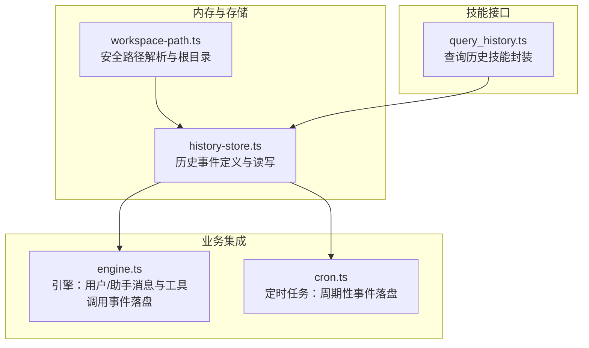
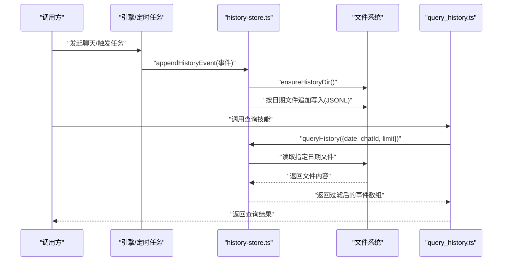
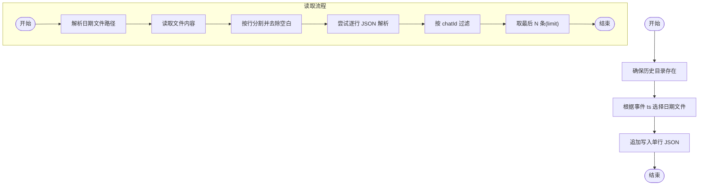
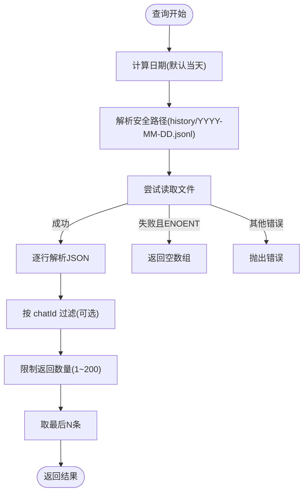
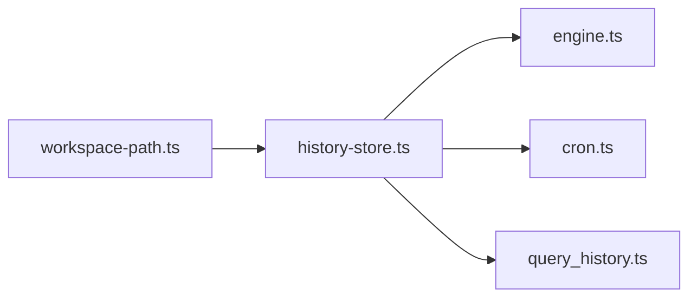

# 历史记录存储

<cite>
**本文引用的文件**
- [history-store.ts](file://src/memory/history-store.ts)
- [workspace-path.ts](file://src/memory/workspace-path.ts)
- [query_history.ts](file://src/skills/memory/query_history.ts)
- [engine.ts](file://src/engine.ts)
- [cron.ts](file://src/cron.ts)
- [workspace-path.test.ts](file://src/memory/workspace-path.test.ts)
- [StupidClaw-第3期-Skills不是越多越好关键是按需披露.md](file://StupidClaw-第3期-Skills不是越多越好关键是按需披露.md)
- [USER_STORIES.md](file://USER_STORIES.md)
</cite>

## 目录
1. [简介](#简介)
2. [项目结构](#项目结构)
3. [核心组件](#核心组件)
4. [架构总览](#架构总览)
5. [详细组件分析](#详细组件分析)
6. [依赖关系分析](#依赖关系分析)
7. [性能考量](#性能考量)
8. [故障排查指南](#故障排查指南)
9. [结论](#结论)
10. [附录](#附录)

## 简介
本文件面向 StupidClaw 的历史记录存储系统，系统性说明历史事件的数据结构（HistoryEvent）、文件存储机制（按日期分隔的 JSONL 文件）、事件追加写入流程、查询功能（按聊天 ID 过滤、按日期查询、限制返回数量）以及在对话上下文构建中的作用与最佳实践。同时提供使用示例、性能优化建议与错误处理策略，帮助开发者与使用者正确、安全地使用历史记录能力。

## 项目结构
历史记录相关代码主要分布在以下模块：
- 数据结构与存储：src/memory/history-store.ts
- 安全路径解析与工作区根：src/memory/workspace-path.ts
- 查询技能封装：src/skills/memory/query_history.ts
- 使用示例与集成点：src/engine.ts、src/cron.ts
- 测试与文档参考：src/memory/workspace-path.test.ts、StupidClaw-第3期-Skills不是越多越好关键是按需披露.md、USER_STORIES.md

图表来源
- [history-store.ts:1-83](file://src/memory/history-store.ts#L1-L83)
- [workspace-path.ts:1-42](file://src/memory/workspace-path.ts#L1-L42)
- [query_history.ts:1-57](file://src/skills/memory/query_history.ts#L1-L57)
- [engine.ts:680-705](file://src/engine.ts#L680-L705)
- [cron.ts:196-246](file://src/cron.ts#L196-L246)

章节来源
- [history-store.ts:1-83](file://src/memory/history-store.ts#L1-L83)
- [workspace-path.ts:1-42](file://src/memory/workspace-path.ts#L1-L42)
- [query_history.ts:1-57](file://src/skills/memory/query_history.ts#L1-L57)
- [engine.ts:680-705](file://src/engine.ts#L680-L705)
- [cron.ts:196-246](file://src/cron.ts#L196-L246)

## 核心组件
- 历史事件数据结构（HistoryEvent）
  - 角色类型（role）：user 或 assistant
  - 事件类型（type）：message、tool_call、tool_result
  - 时间戳（ts）：ISO 字符串
  - 聊天ID（chatId）：用于区分不同会话
  - 文本内容（text）：普通消息文本
  - 工具名（tool）：工具调用名称
  - 参数（args）：工具调用参数对象
  - 结果（result）：工具执行结果字符串
  - 错误标记（isError）：是否为错误结果
- 存储与查询
  - 历史目录：.stupidClaw/history（通过安全路径解析）
  - 文件命名：YYYY-MM-DD.jsonl
  - 写入：追加写入单行 JSON
  - 查询：按日期读取，按 chatId 过滤，限制返回条数

章节来源
- [history-store.ts:5-18](file://src/memory/history-store.ts#L5-L18)
- [history-store.ts:20-31](file://src/memory/history-store.ts#L20-L31)
- [history-store.ts:37-42](file://src/memory/history-store.ts#L37-L42)
- [history-store.ts:44-82](file://src/memory/history-store.ts#L44-L82)

## 架构总览
历史记录系统围绕“事件落盘 + 查询检索”两条主线展开：
- 写入链路：业务逻辑（引擎、定时任务）构造 HistoryEvent，调用 appendHistoryEvent，按事件时间戳选择日期文件并追加写入。
- 读取链路：查询技能或直接调用 queryHistory，按日期读取 JSONL 文件，逐行解析为事件对象，按 chatId 过滤并截取最后 N 条。

图表来源
- [engine.ts:680-705](file://src/engine.ts#L680-L705)
- [cron.ts:196-246](file://src/cron.ts#L196-L246)
- [history-store.ts:37-42](file://src/memory/history-store.ts#L37-L42)
- [history-store.ts:50-82](file://src/memory/history-store.ts#L50-L82)
- [query_history.ts:31-53](file://src/skills/memory/query_history.ts#L31-L53)

## 详细组件分析

### 历史事件数据结构（HistoryEvent）
- 字段定义
  - ts：事件发生的时间戳（ISO 字符串）
  - chatId：所属聊天会话标识
  - role：事件角色（user/assistant）
  - type：事件类型（message/tool_call/tool_result）
  - text：消息文本（可选）
  - tool：工具名（可选）
  - args：工具参数（可选）
  - result：工具结果（可选）
  - isError：是否为错误结果（可选）
- 设计要点
  - 以 JSONL 行式存储，便于流式读取与增量处理
  - 通过 chatId 实现跨轮次、跨进程的会话隔离
  - 通过 ts 与 type 组合，可还原完整对话与工具调用轨迹

章节来源
- [history-store.ts:5-18](file://src/memory/history-store.ts#L5-L18)

### 文件存储机制（按日期分隔的 JSONL）
- 目录与路径
  - 历史目录：.stupidClaw/history
  - 文件命名：YYYY-MM-DD.jsonl
  - 通过安全路径解析函数确保路径不越权
- 写入流程
  - 确保目录存在
  - 根据事件 ts 推导日期，定位对应文件
  - 将事件序列化为单行 JSON 并追加写入
- 读取流程
  - 按日期读取文件
  - 按行分割，逐行解析 JSON
  - 过滤非法行（异常时跳过），按 chatId 过滤
  - 截取最后 N 条作为结果

图表来源
- [history-store.ts:33-42](file://src/memory/history-store.ts#L33-L42)
- [history-store.ts:50-82](file://src/memory/history-store.ts#L50-L82)

章节来源
- [history-store.ts:20-31](file://src/memory/history-store.ts#L20-L31)
- [history-store.ts:33-42](file://src/memory/history-store.ts#L33-L42)
- [history-store.ts:50-82](file://src/memory/history-store.ts#L50-L82)
- [workspace-path.ts:32-35](file://src/memory/workspace-path.ts#L32-L35)

### 查询功能实现（按聊天ID过滤、按日期查询、限制返回数量）
- 输入参数
  - date：查询日期（YYYY-MM-DD，默认当天）
  - chatId：可选，按会话过滤
  - limit：可选，返回条数上限（默认 20，最大 200）
- 处理逻辑
  - 解析日期文件路径
  - 读取文件内容，按行解析 JSON
  - 过滤非法行（异常时跳过），按 chatId 过滤
  - 截取最后 N 条作为结果
  - 文件不存在时返回空数组
- 错误处理
  - 非 ENOENT 的错误会向上抛出
  - 读取异常行时静默跳过，保证整体可用性

图表来源
- [history-store.ts:50-82](file://src/memory/history-store.ts#L50-L82)
- [query_history.ts:31-53](file://src/skills/memory/query_history.ts#L31-L53)

章节来源
- [history-store.ts:44-48](file://src/memory/history-store.ts#L44-L48)
- [history-store.ts:50-82](file://src/memory/history-store.ts#L50-L82)
- [query_history.ts:14-30](file://src/skills/memory/query_history.ts#L14-L30)
- [query_history.ts:31-53](file://src/skills/memory/query_history.ts#L31-L53)

### 在对话上下文构建中的作用与最佳实践
- 作用
  - 记录用户消息、助手回复、工具调用与结果，形成完整的对话与工具调用轨迹
  - 为后续检索、复盘、重放提供基础数据
- 最佳实践
  - 使用 chatId 区分会话，避免跨会话污染
  - 严格控制 limit，避免一次性读取过多导致内存压力
  - 对于工具调用，建议同时记录 tool_call 与 tool_result，便于回溯
  - 在引擎中对落盘失败进行兜底处理，避免影响主流程

章节来源
- [engine.ts:477-482](file://src/engine.ts#L477-L482)
- [engine.ts:550-575](file://src/engine.ts#L550-L575)
- [engine.ts:680-705](file://src/engine.ts#L680-L705)

### 使用示例
- 引擎中记录用户消息与助手回复
  - 发送用户消息时记录一条 message 事件
  - 接收助手回复后记录一条 message 事件
- 引擎中记录工具调用
  - 工具执行开始时记录 tool_call 事件
  - 工具执行结束时记录 tool_result 事件
- 定时任务中记录周期性事件
  - 触发任务时记录 tool_call 事件
  - 任务完成后记录 tool_result 与 message 事件

章节来源
- [engine.ts:680-705](file://src/engine.ts#L680-L705)
- [engine.ts:550-575](file://src/engine.ts#L550-L575)
- [cron.ts:196-246](file://src/cron.ts#L196-L246)

## 依赖关系分析
- 组件耦合
  - history-store.ts 依赖 workspace-path.ts 提供安全路径解析
  - engine.ts 与 cron.ts 直接调用 appendHistoryEvent，形成写入入口
  - query_history.ts 依赖 history-store.ts 的查询接口
- 外部依赖
  - Node.js 文件系统 API（fs/promises）
  - 路径解析（path）

图表来源
- [history-store.ts:1-3](file://src/memory/history-store.ts#L1-L3)
- [engine.ts:680-705](file://src/engine.ts#L680-L705)
- [cron.ts:196-246](file://src/cron.ts#L196-L246)
- [query_history.ts:1-3](file://src/skills/memory/query_history.ts#L1-L3)

章节来源
- [history-store.ts:1-3](file://src/memory/history-store.ts#L1-L3)
- [engine.ts:680-705](file://src/engine.ts#L680-L705)
- [cron.ts:196-246](file://src/cron.ts#L196-L246)
- [query_history.ts:1-3](file://src/skills/memory/query_history.ts#L1-L3)

## 性能考量
- 写入性能
  - JSONL 追加写入，避免随机 IO，写入开销低
  - 单行写入，减少锁竞争
- 读取性能
  - 逐行解析，内存占用与文件大小线性相关
  - 建议限制 limit，避免一次性加载过多事件
- 存储规模
  - 按日切分，便于清理与归档
  - 建议定期清理旧文件或压缩历史数据

[本节为通用性能建议，不直接分析具体文件]

## 故障排查指南
- 路径安全
  - resolveSafePath 会拒绝绝对路径、空路径与路径穿越（..），确保工作区外不可访问
- 文件不存在
  - 查询时若文件不存在（ENOENT），返回空数组；其他错误会向上抛出
- 非法行
  - 读取时遇到非法 JSON 行会跳过，不影响其余事件解析
- 落盘失败
  - 引擎侧提供安全包装函数，落盘异常仅记录错误日志，不影响主流程

章节来源
- [workspace-path.test.ts:14-28](file://src/memory/workspace-path.test.ts#L14-L28)
- [history-store.ts:72-81](file://src/memory/history-store.ts#L72-L81)
- [engine.ts:477-482](file://src/engine.ts#L477-L482)

## 结论
StupidClaw 的历史记录系统采用简洁可靠的 JSONL 行式存储，通过安全路径解析与按日切分，实现了可追踪、易维护、可扩展的历史数据管理。结合查询技能与引擎集成，既能满足日常对话记录需求，又能在需要时进行高效检索与复盘。遵循本文的最佳实践与故障排查建议，可在保证稳定性的同时获得良好的使用体验。

[本节为总结性内容，不直接分析具体文件]

## 附录

### 历史记录在 UI 中的展示与交互参考
- 历史消息目录：IM 连接成功后自动获取 .stupidClaw/history 下的日期列表
- 日期面板：点击日期展开该天的对话列表，每条对话显示时间与首条消息摘要
- 发送到聊天：选中对话后格式化内容发送到当前聊天
- JSONL 格式：每行一个 JSON 对象，包含时间戳、角色与内容等字段

章节来源
- [USER_STORIES.md:326-353](file://USER_STORIES.md#L326-L353)

### 历史记录系统设计背景与演进
- 第 3 期：引入历史落盘（append-only JSONL），仅做三件事：确保目录存在、按 ts 算出日期文件、追加一行 JSON
- 第 3 期：历史查询支持按日期回溯与 chatId 过滤，限制返回数量；读取时遇到坏行跳过，提升稳态

章节来源
- [StupidClaw-第3期-Skills不是越多越好关键是按需披露.md:109-132](file://StupidClaw-第3期-Skills不是越多越好关键是按需披露.md#L109-L132)